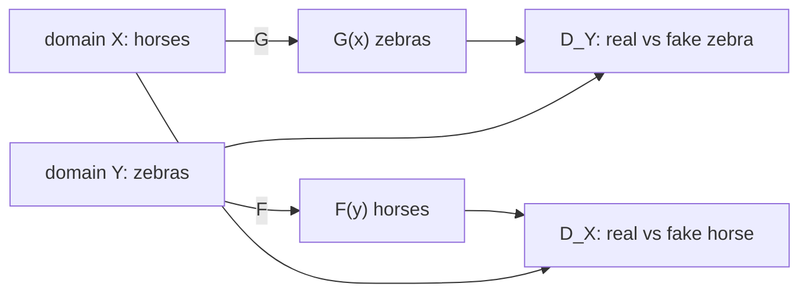
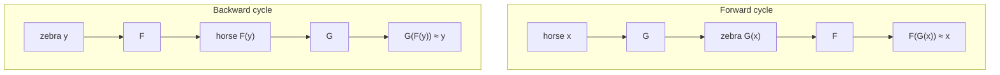

# L40: CycleGAN

**Video:** [Lec 40](https://www.youtube.com/watch?v=cIQgQZxat7w) · 36:22  
**Instructor in this lecture:** Prof. Baishali Garai

### Learning objectives

- Explain the **paired-data** bottleneck of Pix2Pix and why **unpaired** translation needs CycleGAN.
- Name the **four networks** $G,F,D_Y,D_X$ on domains $X$ (horse) and $Y$ (zebra).
- State **cycle consistency**: horse→zebra→horse returns the **same** horse (and the backward cycle).
- Write the two **adversarial** losses, **$L_1$ cycle** loss, $\lambda=10$, and the joint minimax objective.

### Agenda (as listed)

Motivation → introduction → architecture → cycle consistency → adversarial + cycle losses → objective.

---

## Motivation: Pix2Pix needs pairs

Pix2Pix (and “traditional” translation GANs in this week) need a **paired** dataset: input **and** the **same-instance** target.

Examples of pairs that are **hard to collect**:

- sketch of **this** bag **and** a photo of **the same** bag  
- daytime photo **and** nighttime photo of **the same** scene  
- a painting **and** a photo of **the same** subject  

Scientists’ question: can we learn $X\to Y$ from **two separate collections**, **without** paired examples? (sketches without matching photos; autumn without matching winter of the same place.)

That question is the motivation for **CycleGAN**.

---

## What CycleGAN does

**Unpaired** image-to-image translation between two domains.

| Forward | Backward (also learned) |
|---------|-------------------------|
| horse **→** zebra | zebra **→** horse |
| winter **→** summer | summer **→** winter |
| photo **→** painting style | painting **→** photo |
| sketch of a bag **→** photo of a bag | (unpaired collections) |

**Source domain** = what you feed in. **Target domain** = the style/class you want.

Paper: **Unpaired Image-to-Image Translation using Cycle-Consistent Adversarial Networks**, **Jun-Yan Zhu** and team, **UC Berkeley / BAIR**. Students are told to read the math in the paper.

---

## Four networks (horse = $X$, zebra = $Y$)

Running example for the whole lecture:

- Domain **$X$**: horses  
- Domain **$Y$**: zebras  

**Two generators, two discriminators.**

| Network | Map / job |
|---------|-----------|
| Generator **$G$** | $X \to Y$ (horse → zebra) |
| Generator **$F$** | $Y \to X$ (zebra → horse) |
| Discriminator **$D_Y$** | real **zebra** vs generated zebra $G(x)$ |
| Discriminator **$D_X$** | real **horse** vs generated horse $F(y)$ |

Notation:

- $G(x)$: $x$ (horse) through $G$ → **generated zebra**  
- $F(y)$: $y$ (zebra) through $F$ → **generated horse**

All four are **learned**.

---

## Cycle consistency (the key idea)

Adversarial training alone can turn **any** horse into **any** zebra. When you map back, you might get a **different** horse. Cycle consistency **forbids** that.

### Forward cycle

$$
x \;\xrightarrow{G}\; G(x) \;\xrightarrow{F}\; F(G(x))
\quad\text{should equal } x.
$$

Horse → zebra → horse: the reconstructed horse must be the **original** horse.

### Backward cycle

$$
y \;\xrightarrow{F}\; F(y) \;\xrightarrow{G}\; G(F(y))
\quad\text{should equal } y.
$$

Zebra → horse → zebra: reconstructed zebra = original zebra.

**What is being enforced:** after any number of translations, **underlying content / structure** of the original image is **preserved**. Appearance (stripes, season, paint style) can change; identity of the scene/object should not wander.

| Allowed to change | Must stay |
|-------------------|-----------|
| Horse coat → zebra stripes (domain $Y$ look) | Same animal, pose, layout |
| Summer light → winter snow | Same place / camera framing |
| Photo pigments → Van Gogh brushwork | Same scene content |

If cycle consistency is **off**, $G$ can emit **any** plausible zebra and $F$ can emit **any** plausible horse. The two adversarial discriminators would still be happy (both images “look real”). The cycle term is the only piece that **ties** $G(x)$ to **that** $x$.

---

## Numbering the four networks (as in the loss lecture)

Keep this order in your head when reading the equations:

1. **$G$** — horse → zebra  
2. **$D_Y$** — is this zebra real or $G(x)$?  
3. **$F$** — zebra → horse  
4. **$D_X$** — is this horse real or $F(y)$?  

Losses must cover **all four**.

---

## Two kinds of loss

Four networks $\Rightarrow$ the total loss must cover all of them.

| Loss | What it checks |
|------|----------------|
| **Adversarial** | Does this zebra/horse look **real** vs generated? |
| **Cycle consistency** | Does horse→zebra→horse (and the reverse) **match the original**? |

Adversarial loss itself splits in two, because there are two GAN games:

1. **$G$ and $D_Y$** (horse→zebra game)  
2. **$F$ and $D_X$** (zebra→horse game)

---

## Adversarial loss 1: $G$ and $D_Y$

$$
\mathcal{L}_{\text{GAN}}(G, D_Y, X, Y)
= \mathbb{E}_{y \sim p_{\text{data}}(y)}\bigl[\log D_Y(y)\bigr]
+ \mathbb{E}_{x \sim p_{\text{data}}(x)}\bigl[\log\bigl(1 - D_Y(G(x))\bigr)\bigr].
$$

| Term | Trains $D_Y$ to… |
|------|------------------|
| First | classify **real zebras** as real ($D_Y(y)\to 1$) |
| Second | classify **generated zebras** $G(x)$ as fake ($D_Y(G(x))\to 0$) |

$G$ wants $D_Y(G(x))\to 1$ (fool $D_Y$). So **$G$ minimizes** this loss, **$D_Y$ maximizes** it.

---

## Adversarial loss 2: $F$ and $D_X$

$$
\mathcal{L}_{\text{GAN}}(F, D_X, Y, X)
= \mathbb{E}_{x \sim p_{\text{data}}(x)}\bigl[\log D_X(x)\bigr]
+ \mathbb{E}_{y \sim p_{\text{data}}(y)}\bigl[\log\bigl(1 - D_X(F(y))\bigr)\bigr].
$$

| Term | Trains $D_X$ to… |
|------|------------------|
| First | real **horses** as real |
| Second | generated horses $F(y)$ as fake |

Desired: $D_X(\text{fake horse})\to 0$. Generator $F$ wants $D_X(F(y))\to 1$.

**Limit of adversarial losses:** they make outputs **look realistic**. They do **not** force the output to **correspond to that input**. That is why cycle loss exists.

---

## Cycle consistency loss ($L_1$)

$$
\mathcal{L}_{\text{cyc}}(G,F)
= \mathbb{E}_{x}\bigl[\,\| F(G(x)) - x \|_1\,\bigr]
+ \mathbb{E}_{y}\bigl[\,\| G(F(y)) - y \|_1\,\bigr].
$$

| Term | Name in lecture | Compares |
|------|-----------------|----------|
| $\|F(G(x))-x\|_1$ | **Forward cycle** | original horse vs reconstructed horse |
| $\|G(F(y))-y\|_1$ | **Backward cycle** | original zebra vs reconstructed zebra |

Walk-through of $F(G(x))$: $x$ (horse) $\xrightarrow{G}$ zebra $\xrightarrow{F}$ horse.  
Walk-through of $G(F(y))$: $y$ (zebra) $\xrightarrow{F}$ horse $\xrightarrow{G}$ zebra.

**Minimize both** absolute errors.

---

## Full loss and objective

$$
\mathcal{L}
= \mathcal{L}_{\text{GAN}}(G,D_Y,X,Y)
+ \mathcal{L}_{\text{GAN}}(F,D_X,Y,X)
+ \lambda\,\mathcal{L}_{\text{cyc}}(G,F).
$$

**$\lambda = 10$** in the original paper (weight on cycle consistency).

$$
G^*, F^*
= \arg\min_{G,F} \max_{D_X, D_Y} \mathcal{L}.
$$

| Who | Goal |
|-----|------|
| $G,F$ | **Minimize** $\mathcal{L}$: fool the $D$s **and** keep cycle consistency |
| $D_X,D_Y$ | **Maximize**: correctly classify real vs generated |

---

## Qualitative results they showed (from the paper)

- Horse $\leftrightarrow$ zebra, many poses  
- Winter $\leftrightarrow$ summer  
- Orange $\leftrightarrow$ apple  
- Photos $\leftrightarrow$ **Van Gogh** and other painting styles  

Because of cycle consistency **plus** the two adversarial games, translations look **realistic** and **keep structure** through multiple trips around the cycle.

---

## Closing recap (as taught)

Pix2Pix needed **expensive / rare pairs**. CycleGAN answers “can we translate **without** pairs?” with **two generators, two discriminators**, and a cycle that says **$F(G(x))\approx x$** (and $G(F(y))\approx y$). Adversarial terms = realism; cycle $L_1$ = correspondence; $\lambda=10$. Next: **StyleGAN**. Read the paper for extra algebra.

### Key takeaways

- Unpaired $X\leftrightarrow Y$: no matched sketch/photo required.
- $G:X\to Y$, $F:Y\to X$, $D_Y$ judges $Y$, $D_X$ judges $X$.
- Cycle consistency: reconstruct the **same** horse/zebra, not a random other one.
- $\mathcal{L} = \mathcal{L}_{\text{GAN}}(G,D_Y) + \mathcal{L}_{\text{GAN}}(F,D_X) + 10\,\mathcal{L}_{\text{cyc}}$.
- $G,F$ min; $D_X,D_Y$ max.

---
