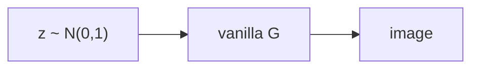
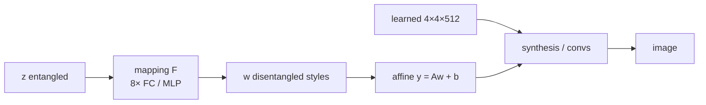
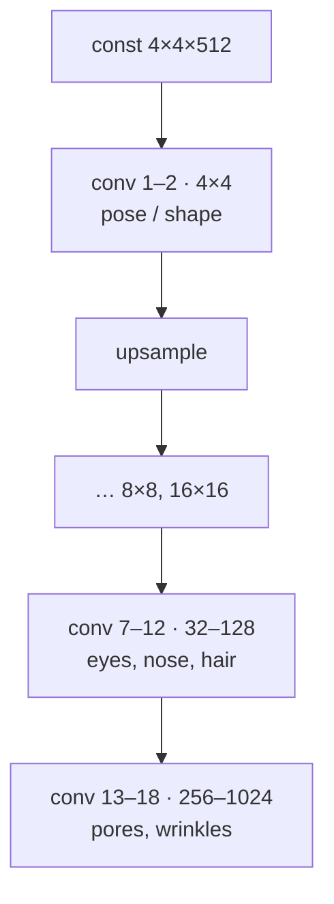

# L41: StyleGAN

**Video:** [Lec 41](https://www.youtube.com/watch?v=qNgUfe1oe7Q) · 38:41  
**Instructor in this lecture:** Prof. Baishali Garai

### Learning objectives

- Name the **fine-control** failures of a vanilla $G(z)$ (hair color, smile, glasses) and define **latent-space entanglement**.
- Draw StyleGAN’s pipeline: $z \xrightarrow{F} w$ (**8-layer MLP**), **affine** style $y=Aw+b$, **synthesis** from a **$4\times4\times512$** constant.
- Write **AdaIN**: normalize feature maps, then restyle with $(y_s, y_b)$.
- Place **18 convolutions**, resolution-dependent attributes, and **noise injection** (scale $B$).

### Agenda (as listed)

Limitations of traditional GAN / motivation → latent-space entanglement → StyleGAN intro → mapping network → affine transform → synthesis network → AdaIN → the style-based generator as a whole.

**What this lecture is not:** StyleGAN **2** is the **next** video.

---

## Limitation of traditional $G(z)$

Vanilla generator: sample $z$ from $\mathcal{N}(0,1)$, push through $G$, get an image (example: a **butterfly**). $G(z)$ has no knob for **one attribute at a time**.

Questions the lecture cannot answer with a standard GAN:

| You want | Can you change only that? |
|----------|---------------------------|
| Butterfly **wing color**, keep pose | **No** |
| Face hair **brown → blonde** | No mapped latent coordinate |
| **Remove a smile** | No |
| **Add glasses** | No |

Demo faces from **thispersondoesnotexist.com** (spoken “thispersonexist.com”).

**Motivation:** researchers wanted **independent control** of attributes (hair color, smile, glasses). Traditional GANs do not give it.

There is no “this coordinate of $z$ = hair only.”

---

## Latent-space entanglement

**Definition as taught:** **one latent variable affects multiple image attributes at once.**

Trying to move brown hair → blonde may also change **face shape**. Blonde → black may **add freckles**. Changing **one dimension** moves **several semantic attributes**. You cannot edit attributes **independently**.

### Why the space is entangled

Textbook line they unpack: the input latent space must follow the **probability density of the training data**, which **forces** entanglements.

Face-dataset cartoon:

- In **this** collection, **short hair** co-occurs with **male** faces; **long hair** with **female** faces.
- $G$ is trained on that joint. Hair **length** becomes correlated with eyes/nose/lips.
- The latent space **curves**. $G$ **avoids unlikely combinations** (short-haired women, long-haired men) if those are rare in the set.
- If the set had **balanced** long/short hair on all genders, this particular entanglement would not appear.

**Entanglement = correlations in $p_{\text{data}}$ copied into $z$.** That is the problem StyleGAN is built to loosen.

---

## StyleGAN vs traditional GAN (high-level)

| Traditional GAN | StyleGAN |
|-----------------|----------|
| $z$ goes **straight** into $G$ | $z$ goes through a **mapping network** $F$ first |
| Image synthesis starts from $z$ | Synthesis starts from a **learned constant** tensor |
| Attributes mixed in $z$ | Intermediate space $w$ is for **styles**; attributes vary **more independently** |

Paper: **A Style-Based Generator Architecture for Generative Adversarial Networks**, **Tero Karras** et al., **NVIDIA**.

Pipeline:

$$
z \;\xrightarrow{\text{mapping } F}\; w \;\xrightarrow{\text{synthesis / generator}}\; \text{image}.
$$

$w$ is an **intermediate latent space** that **carries style**.

---

## Mapping network and $w$

- $z$ still $\sim\mathcal{N}(0,1)$.
- Typical dimension: **$512$**. Compressed recipe for the image.
- $F$: **eight fully connected / MLP layers**, width **$512$**.
- $z$ is **normalized**, then passed through those eight layers → $w\in\mathbb{R}^{512}$.

**Job of $F$:** map **entangled** $z$ to a **more disentangled** $w$. In $w$, **one direction** can control pose, another hairstyle, another smile, another eyeglasses.

Traditional $G$ **begins** image creation from $z$. StyleGAN does **two** extra things before pixels:

1. $z\to w$ via $F$.
2. Synthesis **does not start from $z$**. It starts from a **fixed learned tensor** of shape **$4\times4\times512$** (the $512$ matches latent width). Initialized to constants; **updated by backprop** (learned, not a random $z$).

---

## Clay-block analogy (why a constant start still yields different faces)

Sculptor, **day 1:** same clay block → a horse.  
**Day 2:** the **same** starting block → a horse in a **different style**.

The **$4\times4\times512$** tensor is the clay. **Style is not in the clay**; it is **injected later** by:

- **AdaIN** (adaptive instance normalization; spoken “ADA IN” / “add-in”)
- **Noise injection** for fine **stochastic** differences between images

Affine transforms + AdaIN + convolutions are the sculpting tools.

---

## Affine transform: $w$ → style parameters $y$

An **affine** map (ASR: “a fine transformation”) is

$$
y = Wx + b
$$

in general. In StyleGAN, after $z\mapsto w$,

$$
y = A w + b.
$$

The resulting **$y$ are style parameters**. They are **injected at every layer** through an **AdaIN** block.

Clay = $4\times4\times512$. Styles = sculpting **instructions** applied along the pipeline.

---

## Two paths, 18 convolutions

StyleGAN generator = **mapping path** + **synthesis path**.

| Path | Role |
|------|------|
| Mapping | $z\to w$, **disentangled** styles |
| Synthesis | **image generation**, starting at **$4\times4\times512$** (trainable constant) |

They meet through **convolutions**. Lecture count: **18 convolution layers**.

At **each** conv layer, an affine map produces a $y$ that AdaIN injects.

Flow inside synthesis:

1. Constant $4\times4\times512$  
2. Convolution → **feature maps** (edges, textures, face structure, hair, …)  
3. **AdaIN** on those maps  
4. After **every two** convolutions: **upsample** (resolution doubles)

### Coarse / middle / fine (what each resolution learns)

| Conv layers | Resolution | Attributes |
|-------------|------------|------------|
| 1–2, 3–4, 5–6 | $4\times4$, $8\times8$, $16\times16$ | **Coarse:** pose, face **shape**, edges |
| 7–12 | $32$, $64$, $128$ | **Mid:** eyes, nose, **hairstyle** |
| 13–18 | $256$, $512$, **$1024\times1024$** | **Fine:** pores, wrinkles, skin **texture** |

Low, mid, and high layers together cover **coarse geometry and fine texture**.

---

## AdaIN

Feature maps from conv enter AdaIN.

### Step 1 — normalize (erase old style)

Per channel, compute mean $\mu$ and standard deviation $\sigma$ of the map (standard formulas; they invited you to check arithmetic on the slide). Then

$$
\hat{x}_i = \frac{x_i - \mu}{\sigma}.
$$

After this: **zero mean, unit variance**. **Old style statistics are wiped**; **structure** remains. Each **channel is normalized independently**.

### Step 2 — inject new style

Affine $y=Aw+b$ splits into **scale** $y_s$ and **bias** $y_b$ (learned). For layer $i$:

$$
\text{AdaIN}(x_i, y) = y_s \cdot \frac{x_i - \mu(x_i)}{\sigma(x_i)} + y_b.
$$

**Numerical example:** $y_s=2$, $y_b=1$ $\Rightarrow$ $2\hat{x}+1$. That scaled-and-shifted map **is** the styled feature map.

AdaIN therefore:

1. **Normalizes** (removes previous style stats).  
2. **Applies** $y_s,y_b$ from the affine head.

---

## Traditional generator vs style-based generator (paper figure)

They put the **original paper’s** two cartoons side by side and asked students to read the paper for more algebra.

| Traditional (left) | Style-based (right) |
|--------------------|---------------------|
| $z$ into fully connected layers, then the image stack | $z$ into **mapping** (8-layer MLP) → $w$ |
| No separate style path | $w$ → affine **A** at **every** synthesis layer |
| Starts from $z$ | Starts from **constant** $4\times4\times512$ |
| No AdaIN | Conv → AdaIN (styles) at each scale |
| No explicit stochastic input after $z$ | **Noise** + learned **$B$** on feature channels |

That figure is the whole architecture in one glance.

---

## Noise injection (on the paper figure)

The original-paper diagram of the **style-based generator** (vs a traditional $z\to$ FC $\to$ image stack):

- $z$ → **8-layer MLP** → $w$  
- $w$ → affine **A** at each synthesis layer → AdaIN  
- Synthesis from **constant $4\times4\times512$** through convs  
- Extra: **noise** added in the synthesis stream  

**Noise** = **stochastic variation** of **very fine** details so two generated faces are not identical down to every pore.

**$B$:** a **learned per-channel scale** — how strongly that noise is allowed to move each feature channel.

---

## End-to-end recap (their summary)

1. Vanilla GANs cannot independently edit face attributes.  
2. **Entangled** $z$ $\xrightarrow{\text{8-layer mapping}}$ **disentangled** $w$.  
3. Affine $y=Aw+b$ produces **style parameters** $(y_s,y_b)$.  
4. Synthesis starts from a **learned $4\times4\times512$**, not from $z$.  
5. AdaIN **strips** then **restyles** conv feature maps at each layer.  
6. Resolution grows $4\to1024$; coarse/mid/fine attributes split across layers; noise+$B$ adds stochastic detail.

Next session: **StyleGAN 2**.

### Key takeaways

- Entanglement: one $z$-coordinate moves many attributes because $G$ copies correlations in $p_{\text{data}}$.
- StyleGAN inserts mapping $F$ ($8\times$ FC, $512$-D) so $w$ can be traversed **per style**.
- Images grow from a **constant** $4\times4\times512$ plus **AdaIN** styles, not from feeding $z$ into the first conv.
- AdaIN: $\hat{x}=(x-\mu)/\sigma$, then $y_s\hat{x}+y_b$.
- 18 convs, upsample every two layers; noise scaled by $B$ for fine stochasticity.

---
