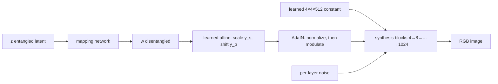
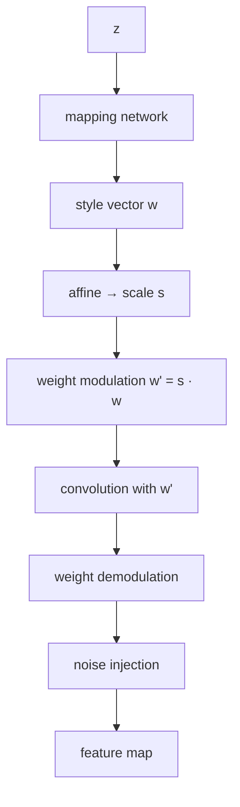
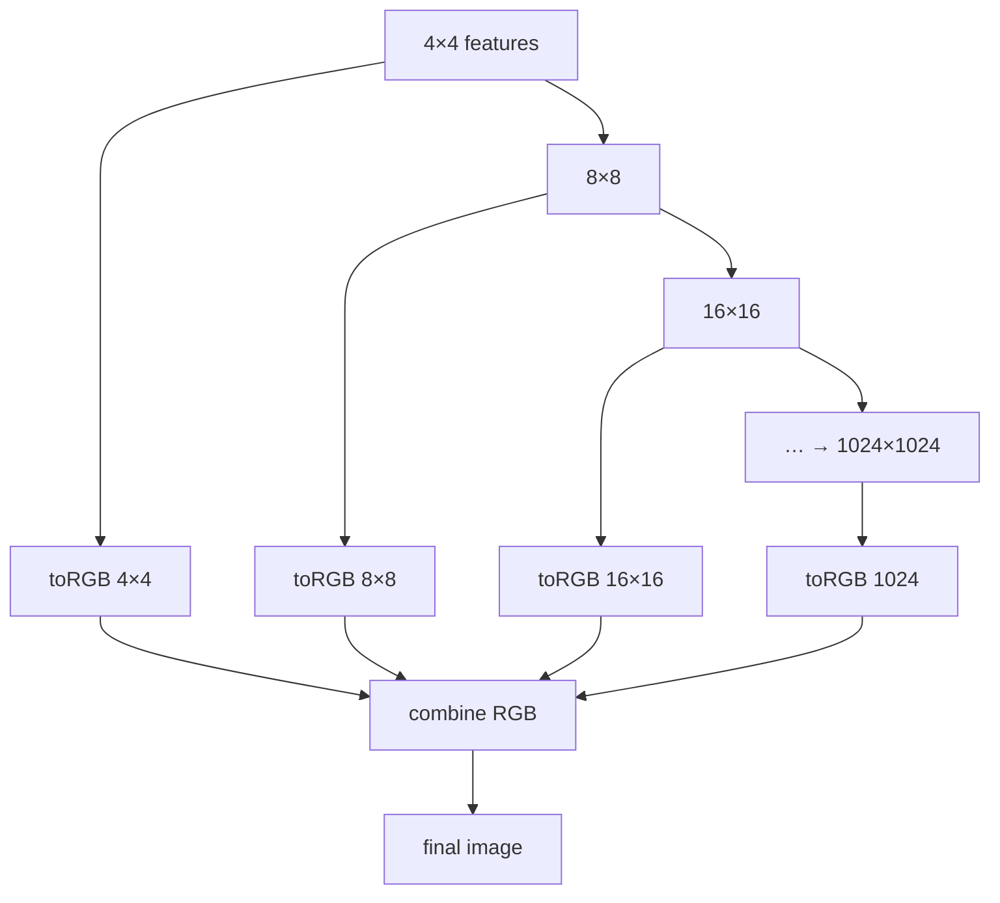

# L42: StyleGAN 2

**Video:** [Lec 42](https://www.youtube.com/watch?v=FXGAP5h7414) · 46:13  
**Instructor in this lecture:** Prof. Baishali Garai

### Learning objectives

- Name the two characteristic **StyleGAN** artifacts (water-droplet blobs and phase / alignment artifacts) and where they first show up in the synthesis pyramid.
- Explain how **AdaIN** lets the generator spike a pixel so that instance-normalization statistics become a blob.
- Write the **weight modulation** and **demodulation** formulas that replace AdaIN.
- State the three architectural changes that remove progressive growing: a **fixed** generator, **skip** `toRGB` paths, and a **residual** discriminator.

### Agenda (as stated)

1. Limitations of StyleGAN  
2. Origin of water-droplet artifacts  
3. Architectural changes in StyleGAN 2: weight modulation and demodulation  
4. Origin of phase artifacts  
5. Fixes: fixed architecture, skip connections in the generator, residual connections in the discriminator  

StyleGAN 2 is the paper *Analyzing and Improving the Image Quality of StyleGAN* from the same group (Karras and co-authors). StyleGAN already produced high-resolution, style-controllable faces. StyleGAN 2 exists because those images (and especially their **feature maps**) still carried **structural** artifacts.

---

## Recap of StyleGAN 1 (needed to see what changed)

- Input $z$ is **entangled**. The mapping network sends it to a **disentangled** $w$.
- A learned **affine** layer turns $w$ into style parameters: a **scale** $y_s$ and a **shift** $y_b$.
- Synthesis does **not** start from $z$. It starts from a learned constant tensor of size **$4 \times 4 \times 512$**.
- **AdaIN** (the lecture’s “AdaIN / add-in”) has two steps: **normalize** each feature-map channel (mean and variance), then **modulate** with $y_s$ and $y_b$:

$$
\hat{x}_{i} = \frac{x_i - \mu(x_i)}{\sigma(x_i)}, \qquad \mathrm{AdaIN}(x_i, y) = y_{s,i}\,\hat{x}_i + y_{b,i}.
$$
- Resolution **grows progressively**: $4\times4$, $8\times8$, … up to $1024\times1024$.
- **Noise injection** at each block supplies stochastic variation (two samples are not pixel-identical).

---

## Two artifacts the paper showed on generated faces

The lecture’s slides are from the StyleGAN 2 paper: a face (and its feature map) with a **water-droplet / blob** sitting on the map, and a second family of **phase** glitches. Researchers treated these as a **consistent architectural** problem, not random noise.

| Artifact | What you see | First visible at |
|----------|----------------|------------------|
| **Water droplet** | Blob-like spots on feature maps (and sometimes on the image) | From **$64\times64$**, then **stronger** through $1024\times1024$ |
| **Phase / alignment** | Features stay locked to the **camera center** while the face turns | Same growing pyramid |

StyleGAN 2’s job is to **remove both**.

---

## Water-droplet artifacts: AdaIN vs. signal statistics

AdaIN injects style at every layer. It first **normalizes the mean and variance of each channel**. The lecture’s point: those two numbers are not nuisances. **Per-channel mean and variance carry semantic / style information.** Before AdaIN they are meaningful; AdaIN is designed to **wipe that style** so a new style can be written in.

The generator’s only job is to **fool the discriminator**. Once AdaIN resets statistics, the generator learns to **exploit the normalizer**:

1. Spike **one pixel** (or a tiny region) to an enormous value.  
2. Instance normalization’s mean and variance are then **dominated by that spike**.  
3. The spike reads out as a **blob / water droplet** on the map.

**Classroom analogy:** if every student scores $0$–$100$ and one student is given $10{,}000$, the class mean and variance are controlled by the outlier. The lecture’s toy vector: values like $0,1,2,7$ vs. $0,100,2,7$ — the $100$ owns the statistics.

So the origin of the droplet is **not** “too little capacity.” It is **AdaIN normalization** plus a generator that **hacks those statistics**.

### Fix: drop AdaIN; modulate **convolution weights** instead

StyleGAN 2 **removes AdaIN completely**. Styles no longer rewrite feature maps. They rewrite the **conv kernel**.

**Modulation** (style scale $s_i$ for input channel $i$):

$$
w'_{ijk} = s_i\, w_{ijk}
$$

| Index | Meaning |
|-------|---------|
| $i$ | input channel |
| $j$ | output channel |
| $k$ | spatial location inside the filter |
| $w_{ijk}$ | original conv weight |
| $w'_{ijk}$ | modulated weight |
| $s_i$ | style scale from the affine layer |

After multiplying by $s_i$, some channels become **huge** → training **instability**. **Demodulation** renormalizes the kernel magnitude:

$$
w''_{ijk} = \frac{w'_{ijk}}{\sqrt{\displaystyle\sum_{i,k} (w'_{ijk})^2 + \varepsilon}}
$$

| Piece | Why it is there (as taught) |
|-------|-----------------------------|
| $w'_{ijk}$ | already-modulated weight |
| $\sum_{i,k}$ | sum over **input channels** and **kernel positions** |
| $(\cdot)^2$ | so **positive and negative** weights cannot cancel |
| $\sqrt{\cdot}$ | restore **normalized energy** to the original scale |
| $\varepsilon$ | tiny constant so the denominator is never zero |

The lecture does **not** derive this from first principles; it asks you to know **what each term is for**.

### Modulation–demodulation pipeline

After this change, the paper’s feature maps (face, car, horse-and-rider) **no longer show droplets**.

---

## Phase artifacts: teeth that will not turn

**Phase**, in the lecture’s signal-processing language, means **spatial alignment / positional consistency**. A phase artifact is a **positional** glitch.

Demo: a face looking at the camera — teeth centered. The head rotates, but the **center of the teeth stays glued to the camera center**, then **jumps**. Eyes and nose should rotate with the head; they do not. That lock-then-jump is the phase artifact.

### Origin: progressive growing

StyleGAN trains $4\times4$ first, then **inserts** $8\times8$, $16\times16$, … up to $1024\times1024$. Early, low-resolution blocks **temporarily act as the final output**. A $4\times4$ or $8\times8$ map **cannot** represent fine spatial detail, but the loss still asks for a realistic image. Features become **position-dependent** too early. Those high-frequency details are **location-sensitive**, so later upsampling **accumulates misalignment**.

### Low frequency vs. high frequency (leaf example)

| Region | Pixel neighbors | One-pixel shift |
|--------|-----------------|-----------------|
| **Low frequency** (leaf interior) | similar color | almost invisible |
| **High frequency** (leaf edge vs. background) | sharp jump | **distorts the silhouette** |

Phase problems are a **high-frequency** problem. The lecture notes that blobs already appear at **$64\times64$** — the first scale where those edges are forced.

### Upsampling makes the edge location ambiguous

Start with two pixels, values $0$ and $1$ (black | white). The edge sits **exactly in the middle**. Upsample to four pixels, e.g. $0,\;0.3,\;0.6,\;1$. The middle is a **gray ramp**. Where is the edge now? Several gray bins are plausible. Each extra upsample **shifts** that guess. By $1024\times1024$ the shift can be large. High-frequency structure (teeth, eyelids) is exactly what that accumulated shift wrecks.

---

## Three changes that replace progressive growing

The researchers **remove progressive growing**. Three replacements:

1. **Keep the architecture fixed** from iteration one: $4\times4$ through $1024\times1024$ are all present. No new block is **inserted** mid-training (StyleGAN 1’s stage-1 / stage-2 / stage-3 story).  
2. **Skip connections in the generator.**  
3. **Residual connections in the discriminator.**

### Skip connections in the generator (`toRGB` at every scale)

**Without skips (StyleGAN 1):** $4\times4 \to 8\times8 \to \cdots \to 1024\times1024 \to$ one RGB. The $4\times4$ map must wait until the last layer to affect pixels. Spatial shifts **accumulate** along that path.

**With skips (StyleGAN 2):** each resolution produces a **partial RGB**. $4\times4$, $8\times8$, $16\times16$, … all contribute. **Multiscale RGB outputs are combined** into the final image. Early layers **directly** influence the photograph, so alignment information is not forced through every upsample.

Side effects named in the lecture: **better gradient flow** and **more stable training**, which also fights phase shift.

### Residual connections in the discriminator

Phase shift is **spatial misalignment / texture drift / features glued to pixel indices**. After progressive growing is gone, the discriminator sees a **full $1024\times1024$ image from the first iteration**. That forces a **deep** net (many downsample stages $1024 \to \cdots \to 4$) from day one.

| StyleGAN 1 discriminator | StyleGAN 2 discriminator |
|--------------------------|--------------------------|
| Early stages see **tiny** images → a **shallow** net is enough | Always sees **$1024\times1024$** |
| Later stages deepen as resolution grows | Deep from the start → vanishing gradients, unstable optimization, memory cost |

**Downsampling** is required so the discriminator is not doing dense $1024$ work at every layer, but depth remains. **Residual connections** address that:

$$
y = F(x) + x
$$

Do not destroy information that is already in $x$. Add the **learned refinement** $F(x)$ to the original. Alignment cues in the high-resolution input can **skip** the long conv stack instead of being warped by repeated convolution.

**Pairing:** generator uses **skips**; discriminator uses **residuals**. Together with a **fixed** topology, phase artifacts go away.

---

## StyleGAN 1 vs. StyleGAN 2 (cheat sheet)

| Piece | StyleGAN 1 | StyleGAN 2 |
|-------|------------|------------|
| Style injection | **AdaIN** on feature maps (normalize, then scale/shift) | **Weight modulation + demodulation** |
| Water droplets | Generator spikes a pixel to own AdaIN stats | AdaIN removed |
| Growing | Progressive: insert $4\to8\to\cdots\to1024$ | **Fixed** full stack from the start |
| Generator extras | Single final RGB | **Skip / toRGB** at every scale, then combine |
| Discriminator extras | Grows with resolution | Full-res input + **residual** blocks |
| Noise | Per-layer injection (kept) | Per-layer injection (kept) |
| Mapping $z\to w$ | Kept | Kept |

**What this lecture is not:** a re-derivation of StyleGAN 1’s mapping network (that is the previous video), and not a diffusion lecture (the instructor flags diffusion as the **next theory** topic). The following video in the playlist is a **CycleGAN lab**.

### Key takeaways

- StyleGAN 2 exists to kill two **structural** artifacts: **water droplets** (AdaIN statistics) and **phase / alignment** (progressive growing + high-frequency upsampling).
- Droplets: replace AdaIN with $w'_{ijk}=s_i w_{ijk}$ and demodulate by the RMS of the modulated kernel plus $\varepsilon$.
- Phase: freeze the pyramid, let every scale skip to RGB, give the discriminator residual paths so a deep full-res critic still preserves alignment.
- Noise injection for stochastic variation is unchanged.

---
