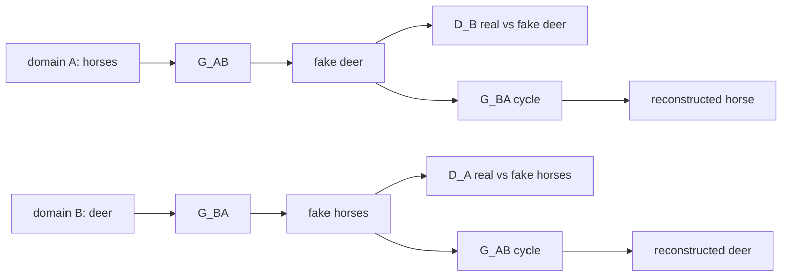

# L43: Practical exercise 1 — CycleGAN (advanced GAN lab)

**Video:** [Lec 43](https://www.youtube.com/watch?v=tZg9-lZnGBs) · 50:54

### Learning objectives

- Contrast a **vanilla GAN** (one $G$, one $D$) with **CycleGAN** (two generators, two discriminators, three loss families).
- Rebuild the **PyTorch** lab: STL-10 **horse ↔ deer**, unpaired pairing, encoder–decoder $G$, conv $D$, Adam, MSE + L1.
- Read the printed metrics (parameter counts, per-epoch losses, the six-panel grid) and the reason the checkpoints are saved.

**What this lab is not:** it is **not** a StyleGAN 2 training session. Lec 42 was StyleGAN 2 theory; Lec 40 was CycleGAN theory (horse↔zebra). This hands-on implements **CycleGAN** on STL-10 **horse↔deer** as the advanced / unpaired image-to-image GAN.

---

## Why CycleGAN needs more than one $G$ and one $D$

A traditional GAN: one generator makes fakes from a domain; one discriminator says real vs fake. Losses: generator loss and discriminator loss.

CycleGAN is **unpaired image-to-image translation**. Domain **A** and domain **B** are separate collections (no aligned pairs). During training:

- Only **A** images go into generator 1; it must emit **B-like** fakes.  
- Only **B** images go into generator 2; it must emit **A-like** fakes.  
- Those fakes are scored by **two** discriminators.

**Naming used in the notebook**

| Model | Input | Output |
|-------|--------|--------|
| **$G_{AB}$** | real horse (A) | fake deer |
| **$G_{BA}$** | real deer (B) | fake horse |
| **$D_A$** | horse-shaped images | real horse vs fake horse |
| **$D_B$** | deer-shaped images | real deer vs fake deer |

**Three loss families** (all used together as “the CycleGAN loss”):

| Loss | Role |
|------|------|
| **Adversarial** (MSE in this lab) | $G$ fools $D$; $D$ separates real/fake |
| **Cycle-consistency** (L1) | horse → fake deer → back to horse (and the other way) should reconstruct |
| **Identity** (L1) | $G_{AB}(\text{deer})\approx\text{deer}$, $G_{BA}(\text{horse})\approx\text{horse}$ — stay close when the input is already in the target domain |

Cycle A→B→A (and B→A→B) is why it is called **cycle** GAN. The lecture also frames the four directed adversarial terms as part of that cycle.

---

## Lab setup: PyTorch, not TensorFlow / Keras

Previous course labs used **TensorFlow / Keras**. This one switches to **PyTorch** (Meta / Facebook) so you can compare implementation style and CPU vs GPU timing.

### Imports (as spoken)

| Import | Why |
|--------|-----|
| `torch` | framework |
| `torch.nn` as `nn` | layers / `Module` |
| `torch.optim` as `optim` | Adam |
| `torchvision.datasets`, `transforms` | STL-10 + preprocessing |
| `torchvision.utils.make_grid` | many images in one figure |
| `torch.utils.data`: `DataLoader`, `Dataset`, `Subset` | loading, pairing, 400-image subsets |
| `matplotlib.pyplot` as `plt` | plots |
| `random`, `os` | pairing / paths; check the runtime |

**Device:** `torch.device` — use GPU if present, else CPU, so the notebook does not die on a machine without CUDA. The talk mentions T4, and (for a real deployment) RTX / Blackwell-class GPUs with `DataLoader` workers.

---

## Step 1 — Hyperparameters

| Knob | Value | Reason given |
|------|-------|----------------|
| Epochs | **20** | keep compute down |
| Learning rate | **very small** (Adam later uses $\eta = 10^{-5}$) | unpaired A↔B is easy to **converge too fast** into obviously fake images |
| Batch size | **4** | four images at a time |

---

## Step 2 — Dataset: STL-10, two classes only

**STL-10** is a 10-class animal / object benchmark. CycleGAN needs **two domains**, so:

| Domain | Class index | Content | Count used |
|--------|-------------|---------|------------|
| **A** | **6** | **horse** | **400** (`0…399`) |
| **B** | **4** | **deer** | **400** |

The full set is $>$10k images; 400+400 is a compute cut. `Subset` + `enumerate` keeps indices whose label is 6 or 4.

### `transforms.Compose` (four ops, in order)

1. **Resize** $256\times256 \to 96\times96$ (compress).  
2. **Crop** to $96\times96$.  
3. **`ToTensor`**: PyTorch wants **channel-first** $(C,H,W)$, not $(H,W,C)$. Color: $C=3$.  
4. **Normalize** each RGB channel with mean $0.5$ and std $0.5$, i.e.

$$
x_{\text{norm}} = \frac{x - 0.5}{0.5}
$$

so pixels land in **$[-1,1]$**, matching a final **tanh**. The same $(0.5, 0.5)$ is repeated **three times** (R, G, B).

Worked micro-example from the lecture: a $3\times3$ patch with values in $0$–$255$ is resized conceptually to $96\times96\times3$, then laid out as a $3\times96\times96$ tensor. A value $10$ becomes $(10-0.5)/0.5$ on every channel that holds it.

Download STL-10 with `download=True`; print a message or raise if it fails. Print `len(domain A)` and `len(domain B)` — both **400**.

---

## Step 3 — Unpaired random pairing

Horse has label 6, deer has label 4: there is **no** aligned pair. A custom `Dataset`:

- Store both domain lists.  
- `__len__` = $\max(|A|,|B|)$.  
- `__getitem__`: take image $A[i]$, pick a **random** index into $B$, return $(a, b)$.  
- **Drop labels** (`_`) — discriminators must guess real/fake (and implicitly which domain), not read the class id.

Wrap in a `DataLoader`:

| Arg | Value | Why |
|-----|-------|-----|
| `batch_size` | 4 | not 64; matches the hyperparameter |
| `shuffle` | **True** | avoid “memory mapping” (a unit always seeing the same A/B pairing) |
| `num_workers` | **2** | even multiple of the batch size 4 |

**Batches per epoch:** $400 / 4 =$ **100**. Print that.

---

## Step 4 — Generator: encoder → residual/transform → decoder

`class Generator(nn.Module)`. Compress, transform, decompress (reconstruction), **tanh** at the end.

### Encoder (low-level → mid-level → high-level filtering)

| Stage | Conv | BN | Activation | Notes |
|-------|------|----|------------|--------|
| 1 | in **3**, out **64**, kernel **7**, padding **3** | 64 | **ReLU** | $\mathrm{ReLU}(x)=\max(0,x)$ so pixels stay non-negative in the hidden maps |
| 2 | 64 → **128**, kernel **3**, stride **2**, padding **1** | 128 | ReLU | stride 2 skips a window |
| 3 | 128 → **256**, kernel **3**, stride **2**, padding **1** | 256 | ReLU | deeper features |

Padding keeps **edge** information. Stride **1 vs 2** is described as **trial-and-error**, not a theorem: larger stride if you trust the data / generator.

### “Transformer” residual stack

Conv **256→256**, kernel 3, padding 1, BN, ReLU — repeated **four** times (spoken as “three encoder convs, so $3+1$ transform convs”).

### Decoder

Reverse the filter counts: **256 → 128 → 64**, then RGB. Output **tanh** so values lie in $[-1,1]$ (median near 0, compatible with the Gaussian-like $[-1,1]$ picture: mean 0, std ~1; far outliers ≈ very fake images).

Filtering story used in the talk: encoder goes **low-level** (lines, points, edges) → **mid** (shape, texture) → **high** (contours; zebra stripes / cat fur as examples). Decoder inverts that.

---

## Step 5 — Discriminator: four convs + Leaky ReLU

`class Discriminator(nn.Module)` as `nn.Sequential`. Four convolutions, **low-level → high-level** again. **Leaky ReLU** instead of ReLU: ReLU can zero a unit forever (“no learning”); a small leak (e.g. $0.001$-scale) keeps the neuron alive.

Stride and padding again left as user knobs.

Instantiate **four** nets and `.to(device)`:

- $G_{AB}$: horse → fake deer  
- $G_{BA}$: deer → fake horse  
- $D_A$: is this a **real horse**?  
- $D_B$: is this a **real deer**?

### Parameter count (as taught)

For a dense-style layer:

$$
\#\text{params} = (\text{inputs into the layer})\times(\#\text{hidden units}) + \text{biases}
$$

Print totals after build. The run reports:

| Net | Parameters |
|-----|------------|
| Generator | **3.1 million** |
| Discriminator | **0.7 million** |

---

## Step 6 — Losses and Adam

| Loss object | Used as |
|-------------|---------|
| **MSE** | adversarial / “GAN” loss |
| **L1** | cycle-consistency **and** identity |

**Two Adam optimizers for generators** (all $G_{AB}$ params + all $G_{BA}$ params, one `lr`, `betas`). **Two more** for $D_A$ and $D_B$.

Adam uses running **mean and variance** of gradients; **$\beta_1$ and $\beta_2$** are those scalars. Recap from the autoencoder week: **$\beta_1 = 0.5$**, **$\beta_2 \approx 0.9$ or $0.998$** (near one). Learning rate in the Adam constructors: **$10^{-5}$**.

Weight update (backprop, as written):

$$
w_{\text{new}} = w_{\text{old}} - \eta \frac{\partial L}{\partial w}
$$

with Adam supplying the effective step via $\beta_1,\beta_2$.

---

## Step 7 — Training loop

Create an output directory. For `epoch` in $1\ldots 20$:

1. Load a batch of horses and deer from the loader.  
2. Build **real / fake target tensors**: real labels **1**, fake labels **0** (dense vectors of ones vs zeros).  
3. **Train generators** on the four translations:

   | Path | Meaning |
   |------|---------|
   | horse → fake deer | $G_{AB}$ |
   | deer → fake horse | $G_{BA}$ |
   | fake deer → reconstructed horse | cycle |
   | fake horse → reconstructed deer | cycle |

4. **Adversarial terms:** MSE of $D_B$ on fake deer and $D_A$ on fake horse (generators want ones).  
5. **Cycle L1:** reconstructed horse vs real horse; reconstructed deer vs real deer (spoken with a “10 classes” aside — STL-10 has 10 classes; the cycle still compares the **images**).  
6. **Identity L1:** $G_{AB}(\text{real deer})$ vs real deer; $G_{BA}(\text{real horse})$ vs real horse.  
7. **Total generator loss**

$$
L_G = L_{\text{MSE (adv)}} + L_{\text{cycle (L1)}} + L_{\text{identity (L1)}}
$$

   Backward + generator Adam step.

8. **Train $D_A$:** MSE on **real horses** + MSE on **fake horses**, each weighted **$0.5$**.  
9. **Train $D_B$:** MSE on **real deer** + MSE on **fake deer**, each weighted **$0.5$**. Equal weight because there are two discriminators.  
10. Print **generator loss**, **$D_A$ loss**, **$D_B$ loss**.

---

## Step 8 — Visualization each epoch

`next` on the loader. Four placeholders per row (indices `0:4`):

Spoken layout while coding, then the **saved grid** (six categories via `torch.cat`):

| Row | Panels |
|-----|--------|
| 1 | **real horse**, **fake deer**, **reconstructed horse** |
| 2 | **real deer**, **fake horse**, **reconstructed deer** |

Comments in the notebook: horse→deer, deer→horse, cycle back to horse, cycle back to deer.

Plot settings:

- Figure **$12\times 6$** inches  
- `normalize=True` (tensors were in $[-1,1]$; show as pixels)  
- `permute` to a display layout; **axes off**  
- Titles font size **10**; `tight_layout` so images stay inside $12\times6$  
- Save **PNG**, dpi **100**

---

## Step 9 — Checkpoint the two translators

After epochs, save `state_dict`s (key = domain / real-vs-fake metadata; value = tensors):

| File / path name | Contents |
|------------------|----------|
| horse → deer | $G_{AB}$ |
| deer → horse | $G_{BA}$ |

Print `saved`. The lecture’s reason: generated images become a **base** for later GAN work — **always save** $G$’s fakes / weights.

---

## What the run printed

| Quantity | Value |
|----------|--------|
| Horses / deer used | 400 / 400 |
| Batches / epoch | 100 |
| $G$ params | 3.1 M |
| $D$ params | 0.7 M |
| Epochs | 20 (400 images, 20 passes) |
| Final $L_G$ | **5.12** |
| Final $D_A$ | **0.2** |
| Final $D_B$ | **0.16** |

**Observation they stated:** $D_B$ looks **better** than $D_A$ (lower loss) — it is the stronger real/fake deer classifier in this run. The six-panel grid is shown from epoch 1 through 20 (early fakes vs later reconstructions).

---

## How this differs from DCGAN / vanilla GAN (closing)

| | Vanilla / DCGAN | CycleGAN (this lab) |
|--|-----------------|---------------------|
| $G$, $D$ | one each | **two** of each |
| Data | one domain, fakes in that domain | **unpaired** two domains |
| Extra losses | adversarial only | **cycle + identity** |
| Typical use | sample new images | **image-to-image translation** |

Punchline: from **horse-only** knowledge the model builds **deer**; from **deer-only** knowledge it builds **horses**. That is unpaired translation on STL-10 domains A and B.

### Key takeaways

- CycleGAN = $G_{AB}$, $G_{BA}$, $D_A$, $D_B$ + adversarial MSE + cycle L1 + identity L1.  
- This notebook: PyTorch, STL-10 class **6 horses** / class **4 deer**, 400 each, $96\times96$, $[-1,1]$, batch 4, 20 epochs, Adam.  
- Encoder–decoder $G$ (ReLU, tanh out); leaky-ReLU conv $D$; shuffle to break pairing memory.  
- Save both translation directions; $D_B$ ended slightly stronger than $D_A$ in the demo.

---
