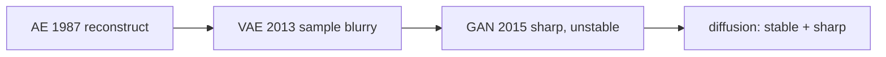
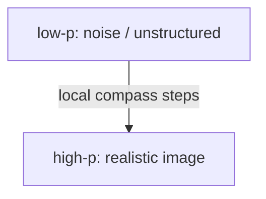
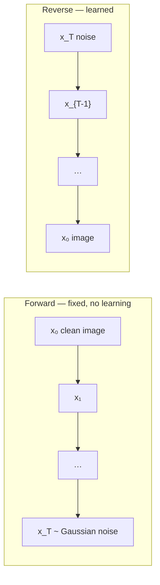
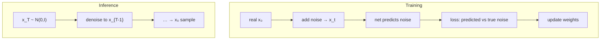

# L44: Introduction to diffusion models

**Video:** [Lec 44](https://www.youtube.com/watch?v=scQsAvXIOWw) · 37:23  
**Instructor in this lecture:** Prof. Baishali Garai

### Learning objectives

- Place diffusion after autoencoders, VAEs, and GANs on the course timeline, including the **stability vs. quality** gap it was meant to close.
- Read a **probability landscape**: high-$p$ peaks = realistic images, low-$p$ valleys = noise, and why a model needs a **compass** (local next-step choices).
- Contrast a **fixed forward** noising chain with a **learned reverse** denoising chain, and sketch training vs. inference.
- State the **Markov** property used for both chains (snakes-and-ladders example).

### Agenda (as stated)

1. Evolution from autoencoders to diffusion  
2. What a diffusion model is  
3. Why diffusion was needed  
4. Forward and reverse processes  
5. Training and inference pipelines  
6. A brief introduction to **Markov chains**

The instructor points to the paper **Deep Unsupervised Learning using Nonequilibrium Thermodynamics** for the detailed math (next lectures develop the formulas used in this course).

---

## Evolution: AE → VAE → GAN → diffusion

All of these are **generative** models used mainly for images (also video / audio). The lecture’s timeline:

| Year (as taught) | Model | What it did | Limitation named here |
|------------------|-------|-------------|------------------------|
| **1987** | Autoencoder | Compress to a latent, **reconstruct** the input (zip / unzip a folder) | **Cannot** emit realistic **new** images; used for denoising, anomaly spotting, feature extraction, scratch restoration |
| **2013** | VAE | Latent is a **Gaussian** $(\mu,\sigma)$, not a single point | **Can** make variants (ship with different sky / water / hull color) but images are often **blurry**, not high-res |
| **2015** | GAN | High-quality fakes from **noise**; FaceApp (2017) and *This Person Does Not Exist* as GAN apps | **Mode collapse** (train on dogs/cats/horses/birds, emit only dogs) and **unstable** training |
| **2015** | Diffusion | Physics-style **diffusion** of probability | Designed to be **as stable as VAEs** and **as sharp as GANs** |

Autoencoder restoration example: scratches removed from a photograph — still a **reconstruction** of the given image, not a new sample.

**Mode collapse** in the lecture: little diversity; one mode of $p_{\text{data}}$ dominates the generator.

---

## Physics picture: ink in water

**Diffusion** in physics: particles move from **high concentration** to **low concentration**. A drop of **red ink** in a glass of water spreads over time. Researchers (2015) linked **nonequilibrium thermodynamics** to machine learning: the same spreading idea becomes a generative model.

The bridge: **physics of particle motion** ↔ **generative AI**, via diffusion models.

---

## Data landscape: peaks are images, valleys are noise

Imagine coordinates $(x_0, x_1)$ and a vertical axis **probability**. Spikes are **high-probability** regions = **structured, realistic** images. Flat / low regions = **unstructured noise**.

In pixel space this is not a 3-D plot: **each pixel channel is its own axis**. The 2-D sketch is only a cartoon.

**Generation** = start somewhere on the landscape and **walk uphill** to a peak. The true $p_{\text{data}}$ is **unknown**, so you do not have a map of the peaks.

Two failed strategies:

| Idea | Why it fails |
|------|----------------|
| Map **every image in the world** as a peak | Impossible |
| Memorize **known** rooms of “your house” | No help in an **unknown house** (new images) |

You need a model with **general navigation**: from **any** point, choose a local step that still climbs. That is a **compass**: at this location, move **this** way toward high probability.

Each step is a **time-varying** distribution. Write

$$
p_t(x) = p(x \mid t)
$$

— probability of data $x$ **at time** $t$. Space **and** time appear together. That is ordinary in physics (the ink drop is concentrated at $t=0$ and spread at $t=5\,\mathrm{s}$) and new as a default language for generative ML. Concentration changes over **space and time**; that is why the name **diffusion** stuck.

---

## Tractable vs. expressive: the gap diffusion fills

Existing generators (at the time of the 2015 paper) fell in one of two bins:

| | Tractable | Expressive |
|--|-----------|------------|
| Meaning | You can compute probabilities, train, optimize, **sample** | You can model **complex** data (images, speech, text) |
| Typical failure | Math is easy but the model **cannot** fit real images / speech | Fits complexity but you **cannot** evaluate / train / sample efficiently |

**Diffusion’s pitch:** be **flexible** (complex data) **and** **computationally tractable** by breaking a hard problem into **many easy steps**.

---

## Two processes

### Forward (known, fixed)

Start from structured $x_0$. Add a **little** noise each step: $x_1,x_2,x_3,\ldots,x_T$. At the end $x_T$ is (almost) **isotropic Gaussian** noise. Complex structured data has been reduced to a **simple** distribution that is easy to work with. **No neural net is trained here.**

Visual: face → slightly blurry → random pattern → **pure Gaussian**.

### Reverse (where learning happens)

Start from $x_T$ and denoise: $x_{T-1}, x_{T-2}, \ldots, x_0$. Step count depends on the problem (**100**, **200**, …). Each **small** denoising step is easier to learn than “noise → image” in one shot.

**Core idea:** learning a full $p(x)$ is hard. Learning **one previous step** is easier:

$$
p(x_{t-1} \mid x_t) \quad\text{is much easier than}\quad p(x).
$$

Forward only **corrupts**. Reverse **learns how much noise to strip** at each $t$.

---

## Training pipeline vs. inference pipeline

### Training

1. Take a real image $x_0$.  
2. Add noise over many steps (the talk’s example: out to $x_{100}$) to obtain a noisy $x_t$.  
3. Feed $x_t$ to a neural net.  
4. The net **predicts the noise** that was added relative to $x_0$.  
5. **Denoising loss** = difference between **true** noise and **predicted** noise.  
6. Update weights so the next prediction is closer.

### Inference (sampling / generation)

1. Draw $x_T \sim \mathcal{N}(0,1)$ (mean 0, variance 1 as spoken).  
2. The **trained** net repeatedly denoises: $x_T \to x_{T-1} \to \cdots \to x_0$.  
3. It knows how much noise to remove at each hop. Repeated denoising **gradually** yields a realistic image.

Learning is **only** in training. Sampling starts from noise and applies the learned reverse steps.

---

## Markov chains (why they appear)

A Markov chain: the system hops **state 1 → 2 → … → N**. The probability of the **next** state depends on the **current** state, **not** on the whole history.

**Snakes and ladders:** from square **9** a ladder goes to **55**; from **98** a snake goes to **76**. Whether you can take the ladder depends only on **being on 9**, not on the path $1,2,\ldots$ that got you there. Square **8** does not send you to 55.

As used for diffusion: to produce $x_t$ you only need $x_{t-1}$.

**Both** the forward noising process and the reverse denoising process are modeled as Markov chains.

---

## One-slide summary from the lecture

- VAEs / AEs / GANs gave images but not **stability and quality together**; diffusion generates from noise with both.  
- Navigate a **probability landscape** with a local compass; treat $p$ as **space- and time-varying** (physics).  
- **Forward:** corrupt $x_0$ with small Gaussian hits until $x_T$ is Gaussian.  
- **Reverse:** strip noise over many steps until a realistic $x_0$.  
- Train by predicting added noise; sample by iterating the reverse.  
- Markov: next state depends on **now**, not the full past.

Next theory lecture: **mathematics** of diffusion models.

### Key takeaways

- Diffusion = many easy Markov steps instead of one intractable map from noise to data.  
- Forward is **fixed** Gaussian corruption; reverse is the **learned** denoiser.  
- High probability ↔ structure; low probability ↔ noise; generation is climbing with a local rule $p_t(x)$.  
- The net is trained to predict **noise**, then used at inference to denoise $x_T\sim\mathcal{N}(0,I)$ down to an image.

---
