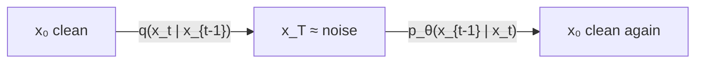
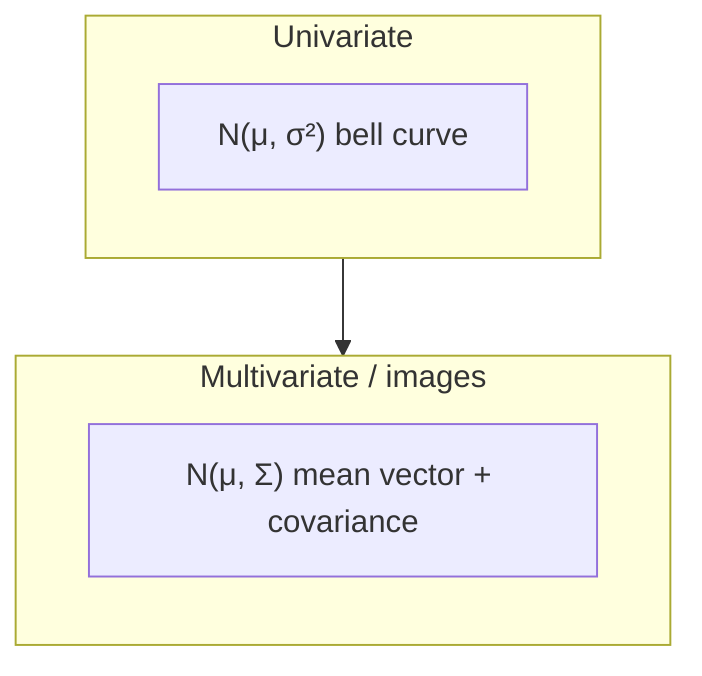

# L45: Mathematics of diffusion models

**Video:** [Lec 45](https://www.youtube.com/watch?v=eyw6Hep8kf4) · 31:58  
**Instructor in this lecture:** Prof. Baishali Garai

### Learning objectives

- Write the **forward** kernel $q(x_t\mid x_{t-1})$ and the **reverse** kernel $p_\theta(x_{t-1}\mid x_t)$ as the lecture set them up.
- Explain the **noise variance schedule** $\beta_t$ and what goes wrong if destruction is too fast or too slow.
- Recall the **Gaussian** PDF, the **standard** Gaussian $\mathcal{N}(0,1)$, and why images need a **multivariate** Gaussian (covariance, not a scalar $\sigma^2$).
- Compute a $2\times2$ **covariance matrix** on the height–weight table (population $n$, not $n-1$).

This lecture is **foundations only**. The next video specializes them to **DDPM**. It is not a full DDPM derivation.

---

## Problem setup: two processes

Demo: a **dog jumping**. At $t=0$ the frame is clean. At $t=1,2,\ldots$ more noise appears. At $t=T$ the frame is almost **pure noise**.

| Symbol | Meaning |
|--------|---------|
| $x_0$ | original data (clean image / signal) |
| $x_t$ | noisy version at step $t$ |
| $T$ | total diffusion steps (can be **up to ~1000**, application-dependent) |
| $t\in\{1,\ldots,T\}$ | current step |

### Forward kernel (fixed, known)

$$
q(x_t \mid x_{t-1})
$$

is the distribution of $x_t$ **conditioned on** $x_{t-1}$. If you know $x_2$, then $x_3$ is drawn given $x_2$.

Nothing is **learned**. You only manufacture a noisier sample from a cleaner one. Because the process is known, this kernel is taken to be a **predefined Gaussian**.

### Reverse kernel (learned)

Start at $t=T$ (almost pure noise). Denoise step by step down to $x_0$. The network learns **how much noise was added at timestamp $t$**.

$$
p_\theta(x_{t-1} \mid x_t)
$$

$x_{t-1}$ is conditioned on $x_t$ (walking **backward**). The new symbol **$\theta$** is **all trainable weights** of the denoising net. Reverse = generate a **cleaner** sample from a **noisier** one.

| | Forward | Reverse |
|--|---------|---------|
| Direction | clean → noise | noise → clean |
| Learning | none | $\theta$ |
| Typical letter | $q$ | $p_\theta$ |

---

## Noise variance schedule $\beta_t$

Noise is **not** the same size at every hop. A **schedule** is a sequence

$$
\beta_1,\beta_2,\ldots,\beta_T, \qquad \beta_t \in (0,1).
$$

$\beta_t$ is how much noise is injected at step $t$. Small $t$: **small** $\beta_t$. Large $t$: **larger** $\beta_t$. That **gradual** increase is the schedule. It also controls **signal-to-noise ratio** (more noise → SNR **drops**).

### Why not a constant $\beta$?

You want **complete destruction** of $x_0$’s structure by step $T$, i.e. $x_T \approx \mathcal{N}(0,1)$ (mean 0, variance 1).

| If destruction is… | What happens |
|--------------------|----------------|
| **Too fast** (clean → noise in ~3–6 steps) | Reverse learning is hard: too much change per hop |
| **Too slow** | Too many steps; **training inefficient** |

So a schedule must (i) finish as $\mathcal{N}(0,1)$ by $T$ and (ii) not jump or crawl.

---

## Gaussian review (used constantly from here on)

A Gaussian is a distribution **clustered around the mean**, **symmetric** left and right.

$$
p(x) = \frac{1}{\sqrt{2\pi\sigma^2}} \exp\left( -\frac{(x-\mu)^2}{2\sigma^2} \right)
$$

| Symbol | Role |
|--------|------|
| $x$ | data point (random variable) |
| $\mu$ | mean |
| $\sigma^2$ | variance (spread) |
| $\sigma$ | standard deviation |
| $1/\sqrt{2\pi\sigma^2}$ | **normalization** so total probability is 1 |
| exponential | density **falls off** as you move away from $\mu$ |

Empirical rule drawn on the bell curve:

| Interval | Probability (as taught) |
|----------|-------------------------|
| $\mu\pm\sigma$ | **68%** |
| $\mu\pm 2\sigma$ | **95%** |
| $\mu\pm 3\sigma$ | **99.7%** |

### Standard Gaussian

When $\mu=0$ and variance $=1$, write $\mathcal{N}(0,1)$ and call it the **standard** Gaussian.

---

## Multivariate Gaussian (why images are not $\mathcal{N}(\mu,\sigma^2)$)

**Multivariate** = more than one variable, packed as a **vector**. Instead of a scalar $x$, take $x\in\mathbb{R}^d$ ($d$ components). The density is a multivariate normal with **mean vector** $\mu$ and **covariance matrix** $\Sigma$ — you speak of **covariance**, not a single $\sigma^2$.

**Why this course needs it:** ML almost never uses one scalar. An image has **millions of pixels**; embeddings are high-dimensional. Pixels are **correlated**; features are correlated. Those relationships live in $\Sigma$.

If the off-diagonals are zero, dimensions are **uncorrelated** (this fact is reused in the DDPM forward covariance $\beta_t I$).

### Covariance as “how two variables move together”

| Example | Pattern | Name |
|---------|---------|------|
| Temperature vs **ice-cream** sales in summer | both **rise** | **positive** covariance |
| Temperature vs **hot-chocolate** sales in summer | heat up, chocolate sales **fall** | **negative** covariance |

### Shape of a $2\times2$ covariance matrix

For features $X_1,X_2$:

$$
\Sigma = \begin{bmatrix}
\mathrm{Var}(X_1) & \mathrm{Cov}(X_1,X_2) \\
\mathrm{Cov}(X_2,X_1) & \mathrm{Var}(X_2)
\end{bmatrix}
$$

**Diagonal** = variances. **Off-diagonal** = covariances. $\mathrm{Cov}(X_1,X_2)=\mathrm{Cov}(X_2,X_1)$.

---

## Numerical example: height and weight

Four people, two features. $X_1=$ height, $X_2=$ weight.

| Person | Height $X_1$ | Weight $X_2$ |
|--------|--------------:|--------------:|
| A | 150 | 50 |
| B | 160 | 55 |
| C | 170 | 65 |
| D | 180 | 72 |

Means (as computed in class):

$$
\mu_1 = 165, \qquad \mu_2 = 60.5
$$

**Population variance** (divide by $n=4$, **not** $n-1$; sample variance would use $n-1$):

$$
\mathrm{Var}(X_1) = \mathbb{E}\bigl[(X_1-\mu_1)^2\bigr]
$$

| Person | $X_1-\mu_1$ | $(X_1-\mu_1)^2$ |
|--------|-------------:|----------------:|
| A | $-15$ | 225 |
| B | $-5$ | 25 |
| C | $5$ | 25 |
| D | $15$ | 225 |

Sum $=500$, divide by $4$ → $\mathrm{Var}(X_1)=\mathbf{125}$.  
$\mathrm{Var}(X_2)$ was **left as an exercise** (same table with $X_2-\mu_2$).

**Covariance**

$$
\mathrm{Cov}(X_1,X_2) = \mathbb{E}\bigl[(X_1-\mu_1)(X_2-\mu_2)\bigr] = \mathbf{95}
$$

(The lecture asked you to pause and check the extended table; the filled-in value is 95.)

So

$$
\Sigma = \begin{bmatrix} 125 & 95 \\ 95 & \mathrm{Var}(X_2) \end{bmatrix}
$$

with the missing diagonal entry from the exercise. This $2\times2$ drill exists because **later DDPM lectures keep saying “covariance.”**

---

## Recap map

1. Forward $q(x_t\mid x_{t-1})$: **Gaussian**, **fixed**.  
2. Reverse $p_\theta(x_{t-1}\mid x_t)$: Gaussian whose parameters depend on **$\theta$**.  
3. $\beta_t\in(0,1)$ schedules how fast structure dies; too fast or too slow both hurt.  
4. Target at $T$: standard Gaussian $\mathcal{N}(0,1)$.  
5. Images → **multivariate** Gaussians → **covariance matrices**; ice cream vs hot chocolate; height–weight calculation.

Next lecture: **denoising diffusion probabilistic models (DDPM)** as a specific diffusion family, starting with the **forward** process.

### Key takeaways

- $q$ noising is predefined Gaussian; $p_\theta$ denoising is the trainable Gaussian.  
- $\beta_t$ is a **schedule**, not a constant, so $x_T$ is fully noise without making reverse learning impossible.  
- Standard Gaussian = $\mathcal{N}(0,1)$; pixels need $\mathcal{N}(\mu,\Sigma)$.  
- $\Sigma$’s diagonal is variance, off-diagonal is relationship; the $n=4$ height–weight example is the calculation you are expected to reproduce.

---
