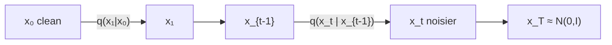
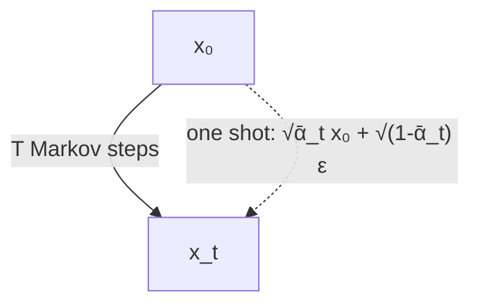

# L46: DDPM — forward process

**Video:** [Lec 46](https://www.youtube.com/watch?v=Ze66dWq7yhI) · 29:51  
**Instructor in this lecture:** Prof. Baishali Garai

### Learning objectives

- Identify **DDPM** as the 2020 Ho et al. (UC Berkeley) formulation of diffusion.
- Write the Markov forward kernel $q(x_t\mid x_{t-1})$ with mean $\sqrt{1-\beta_t}\,x_{t-1}$ and covariance $\beta_t I$.
- Show why the previous image must be **scaled** (unscaled variance **blows up**).
- Expand the recursion to the **closed-form** $q(x_t\mid x_0)$ and the **reparameterization** that samples any $t$ in one shot.

Reverse-process math is the **next** lecture. This video is forward only.

---

## What DDPM is

**Denoising diffusion probabilistic models (DDPM)** — paper *Denoising Diffusion Probabilistic Models*, Jonathan Ho and colleagues, UC Berkeley, **2020**. A **specific** instance of the diffusion family from the previous two lectures.

Same two processes:

| Forward | Reverse |
|---------|---------|
| Clean image → almost pure noise, step by step | Almost pure noise → clean image |
| **No learning**; predefined Gaussian | Learning lives here (next lecture) |

Markov reminder: the **next** state depends only on the **current** state, not on the whole path. Forward DDPM is a Markov chain. Noise **increases** with $t$ (a little at $t=1,2$; much more by $t=30$–$40$).

$$
q(x_t \mid x_{t-1})
$$

= probability of a **noisier** $x_t$ given a **less noisy** $x_{t-1}$.

---

## Forward kernel as a Gaussian

Because the forward process is **fixed**, $x_t$ is sampled from a Gaussian with mean $\mu$ and covariance $\Sigma$:

$$
x_t \sim \mathcal{N}(\mu, \Sigma)
$$

written $\mathcal{N}(x_t;\,\mu,\,\Sigma)$.

**Covariance** (from last lecture): how uncertainty is spread across dimensions and how dimensions **relate**. For two scalars $X_1,X_2$,

$$
\Sigma = \begin{bmatrix} \mathrm{Var}(X_1) & \mathrm{Cov}(X_1,X_2) \\ \mathrm{Cov}(X_2,X_1) & \mathrm{Var}(X_2) \end{bmatrix}.
$$

**Zero off-diagonal covariance** = no relationship between dimensions. DDPM uses that idea: noise is **independent across pixels**, so $\Sigma$ is a **scaled identity**.

### The actual DDPM forward equation

$$
q(x_t \mid x_{t-1}) = \mathcal{N}\!\bigl(x_t;\; \sqrt{1-\beta_t}\, x_{t-1},\; \beta_t I\bigr)
$$

| Symbol | Meaning |
|--------|---------|
| $x_t$ | image at step $t$ |
| $x_{t-1}$ | image at step $t-1$ |
| $\beta_t$ | how much noise is added at $t$ (magnitude) |
| $I$ | identity matrix |

$\beta_t I$ for 2-D looks like $\mathrm{diag}(\beta_t,\beta_t)$: variance $\beta_t$ on each axis, **zero** cross-covariance.

**In words:** given $x_{t-1}$, draw $x_t$ from a Gaussian whose

- **mean** is $\sqrt{1-\beta_t}\,x_{t-1}$ — a **scaled copy** of the previous image, scale $\sqrt{1-\beta_t}$, with $\beta_t\in(0,1)$;  
- **covariance** is $\beta_t I$.

---

## Substitute $\alpha_t = 1-\beta_t$

$$
\alpha_t := 1-\beta_t \quad\Rightarrow\quad \beta_t = 1-\alpha_t
$$

$$
q(x_t \mid x_{t-1}) = \mathcal{N}\!\bigl(x_t;\; \sqrt{\alpha_t}\, x_{t-1},\; (1-\alpha_t)I\bigr)
$$

**Reparameterize a Gaussian sample** as mean + std $\times$ standard normal:

$$
x_t = \sqrt{\alpha_t}\, x_{t-1} + \sqrt{1-\alpha_t}\,\varepsilon_t, \qquad \varepsilon_t \sim \mathcal{N}(0,I)
$$

| Term | Role |
|------|------|
| $\sqrt{\alpha_t}\, x_{t-1}$ | **scaled remaining signal** |
| $\sqrt{1-\alpha_t}\,\varepsilon_t$ | **noise** ($\varepsilon_t$ standard Gaussian) |

---

## Why scale the signal? Variance blow-up

Suppose we **did not** scale and wrote $x_t = x_{t-1} + \sqrt{1-\alpha_t}\,\varepsilon_t$. Independently adding noise,

$$
\mathrm{Var}(x_t) = \mathrm{Var}(x_{t-1}) + \mathrm{Var}\bigl(\sqrt{1-\alpha_t}\,\varepsilon_t\bigr).
$$

Let $a=\sqrt{1-\alpha_t}$. Then $\mathrm{Var}(a\varepsilon_t)=a^2\mathrm{Var}(\varepsilon_t)=(1-\alpha_t)\cdot 1$, so

$$
\mathrm{Var}(x_t) = \mathrm{Var}(x_{t-1}) + (1-\alpha_t).
$$

$\mathrm{Var}(x_{t-1})$ **grows every step**. After many steps the variance is huge and the **distribution blows up**. That is why the mean is a **fraction** of the previous image, not the whole image.

---

## Recursion: write $x_2$ in terms of $x_0$

Start at $t=1$:

$$
x_1 = \sqrt{\alpha_1}\, x_0 + \sqrt{1-\alpha_1}\,\varepsilon_1.
$$

Then

$$
x_2 = \sqrt{\alpha_2}\, x_1 + \sqrt{1-\alpha_2}\,\varepsilon_2.
$$

Substitute $x_1$:

$$
x_2 = \sqrt{\alpha_2}\bigl(\sqrt{\alpha_1}\, x_0 + \sqrt{1-\alpha_1}\,\varepsilon_1\bigr) + \sqrt{1-\alpha_2}\,\varepsilon_2
$$

$$
x_2 = \sqrt{\alpha_1\alpha_2}\, x_0 + \sqrt{\alpha_2(1-\alpha_1)}\,\varepsilon_1 + \sqrt{1-\alpha_2}\,\varepsilon_2.
$$

- $\sqrt{\alpha_1\alpha_2}\,x_0$ still carries the **original signal** $x_0$.  
- The other two terms are **independent Gaussians**.

Define

$$
\bar{\alpha}_2 := \alpha_1\alpha_2
$$

and let $Z$ be the sum of those two noise terms. Their covariance (independent $\varepsilon_1,\varepsilon_2$):

$$
\alpha_2(1-\alpha_1)I + (1-\alpha_2)I = \bigl(\alpha_2 - \alpha_1\alpha_2 + 1 - \alpha_2\bigr)I = (1-\alpha_1\alpha_2)I = (1-\bar{\alpha}_2)I.
$$

So $x_2$ is Gaussian with mean $\sqrt{\bar{\alpha}_2}\,x_0$ and covariance $(1-\bar{\alpha}_2)I$.

### General $t$

$$
\bar{\alpha}_t := \prod_{s=1}^{t} \alpha_s = \alpha_1\alpha_2\cdots\alpha_t
$$

$$
\sqrt{\alpha_1\cdots\alpha_t} = \sqrt{\bar{\alpha}_t}.
$$

**Closed-form forward (the equation to memorize):**

$$
q(x_t \mid x_0) = \mathcal{N}\!\bigl(x_t;\; \sqrt{\bar{\alpha}_t}\, x_0,\; (1-\bar{\alpha}_t)I\bigr)
$$

---

## Reparameterization trick (why DDPM training is cheap)

If $Z\sim\mathcal{N}(\mu,\sigma^2)$, do **not** sample $Z$ as an opaque Gaussian. Write

$$
Z = \mu + \sigma\,\varepsilon, \qquad \varepsilon\sim\mathcal{N}(0,1).
$$

Apply that to $q(x_t\mid x_0)$:

$$
x_t = \sqrt{\bar{\alpha}_t}\, x_0 + \sqrt{1-\bar{\alpha}_t}\,\varepsilon, \qquad \varepsilon\sim\mathcal{N}(0,I).
$$

| Term | Meaning |
|------|---------|
| $\sqrt{\bar{\alpha}_t}\,x_0$ | **remaining signal strength** |
| $\sqrt{1-\bar{\alpha}_t}\,\varepsilon$ | **accumulated noise** |

**Without** this: to reach $x_t$ you must walk $x_0\to x_1\to\cdots\to x_t$ (**$t$ diffusion steps**).  
**With** this: if you know $x_0$, you can draw $x_t$ for **any** $t$ **in one step**. Example from the lecture: want $x_{99}$? Use $x_0$ and $\bar{\alpha}_{99}$ directly.

That one-shot sample is the important DDPM engineering fact for the forward process.

---

## What this lecture is *not*

It does **not** train $\theta$ or write $p_\theta(x_{t-1}\mid x_t)$. The instructor flags that as the next class (parameters live on the reverse chain).

### Key takeaways

- DDPM forward is a **fixed** Markov Gaussian: $q(x_t\mid x_{t-1})=\mathcal{N}(\sqrt{1-\beta_t}\,x_{t-1},\,\beta_t I)$.  
- $\alpha_t=1-\beta_t$; samples $x_t=\sqrt{\alpha_t}\,x_{t-1}+\sqrt{1-\alpha_t}\,\varepsilon_t$.  
- Skipping the $\sqrt{\alpha_t}$ scale makes variance **accumulate** until the law blows up.  
- $\bar{\alpha}_t=\prod_s\alpha_s$ yields $q(x_t\mid x_0)=\mathcal{N}(\sqrt{\bar{\alpha}_t}\,x_0,\,(1-\bar{\alpha}_t)I)$ and the one-shot $x_t=\sqrt{\bar{\alpha}_t}\,x_0+\sqrt{1-\bar{\alpha}_t}\,\varepsilon$.

---
