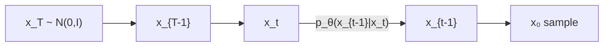
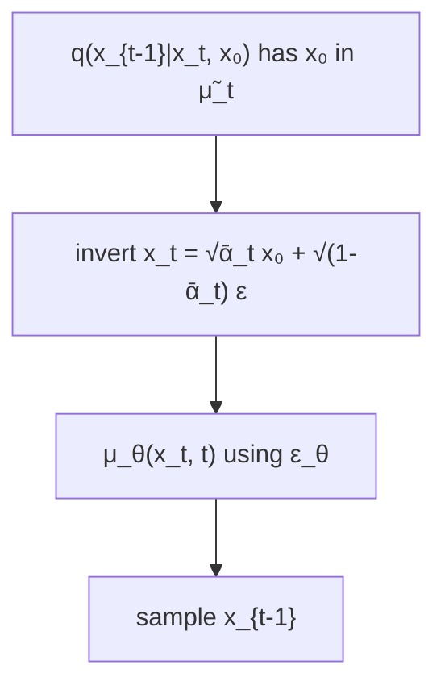

# L47: DDPM — reverse process

**Video:** [Lec 47](https://www.youtube.com/watch?v=AF3G4llVO20) · 33:01  
**Instructor in this lecture:** Prof. Baishali Garai

### Learning objectives

- Write the reverse **Markov** joint $p_\theta(x_{0:T})$ from a Gaussian **prior** $x_T$.
- State the **forward posterior** $q(x_{t-1}\mid x_t,x_0)$ (mean $\tilde{\mu}_t$ depends on $x_0$ — unusable at generation).
- Eliminate $x_0$ using the forward reparameterization, replace $\varepsilon$ by $\varepsilon_\theta$, and sample $x_{t-1}$.
- Quote the **MSE noise-prediction** loss used to train DDPM.

U-Net internals are **not** this video (the instructor points to a later architecture lecture; the next playlist item is the **forward-process lab**).

---

## Recap: forward equations we reuse

From the previous lecture:

$$
q(x_t \mid x_0) = \mathcal{N}\!\bigl(x_t;\; \sqrt{\bar{\alpha}_t}\, x_0,\; (1-\bar{\alpha}_t)I\bigr)
$$

$$
x_t = \sqrt{\bar{\alpha}_t}\, x_0 + \sqrt{1-\bar{\alpha}_t}\,\varepsilon, \qquad \varepsilon\sim\mathcal{N}(0,I).
$$

Reparameterization still means: sample **any** $x_t$ from $x_0$ **without** walking every intermediate hop.

We keep returning to these $q$ formulas because the **reverse learner is guided by the known forward**.

---

## Reverse process: goal

Sequence: $x_T \to x_{T-1} \to \cdots \to x_2 \to x_1 \to x_0$. $x_T$ is complete Gaussian noise; $x_0$ is a clean image. Generation = **progressively remove noise** from a Gaussian draw.

**Goal:** learn

$$
p_\theta(x_{t-1} \mid x_t)
$$

— given a noisy $x_t$, predict a **slightly less noisy** $x_{t-1}$. $\theta$ = neural-net parameters (how much noise to strip).

---

## Reverse as a Markov chain

$x_{t-1}$ depends **only** on $x_t$, not on the rest of the trajectory. The joint over the **whole reverse path** therefore factors:

$$
p_\theta(x_{0:T}) = p(x_T)\prod_{t=1}^{T} p_\theta(x_{t-1}\mid x_t)
$$

| Factor | Meaning |
|--------|---------|
| $p_\theta(x_{0:T})$ | joint of the **entire reverse trajectory** |
| $p(x_T)$ | **prior** at the start of generation |
| $\prod p_\theta(x_{t-1}\mid x_t)$ | all reverse conditionals |
| $\theta$ | trainable weights |

**Prior:** $x_T$ is **Gaussian noise, mean 0, unit variance** — $\mathcal{N}(0,I)$. Generation **starts** there.

---

## Prior vs. posterior (terms used below)

| Term | Lecture meaning |
|------|-----------------|
| **Prior** | what you assume **before** extra evidence |
| **Posterior** | the law **after** observing more information |

---

## Posterior of the **forward** process

Under the known noising $q$, look **one step back** given both the current noisy state **and** the clean start:

$$
q(x_{t-1} \mid x_t, x_0)
$$

Forward path: $x_0\to x_1\to\cdots\to x_{t-1}\to x_t\to\cdots\to x_T$. Here you know $x_0$ (training-time clean image) and $x_t$; you want the law of the previous noisy image $x_{t-1}$.

This posterior is **Gaussian**:

$$
q(x_{t-1}\mid x_t,x_0) = \mathcal{N}\!\bigl(x_{t-1};\; \tilde{\mu}_t(x_t,x_0),\; \tilde{\beta}_t I\bigr).
$$

The lecture **does not derive** $\tilde{\mu}_t$; it **states** the formula (depends on $x_t$ and $x_0$). With $\bar{\alpha}_t=\prod_{s=1}^t\alpha_s$ as before:

$$
\tilde{\mu}_t(x_t,x_0)
= \frac{\sqrt{\bar{\alpha}_{t-1}}\,\beta_t}{1-\bar{\alpha}_t}\, x_0
+ \frac{\sqrt{\alpha_t}\,(1-\bar{\alpha}_{t-1})}{1-\bar{\alpha}_t}\, x_t.
$$

Once mean and variance are known, $x_{t-1}$ is a Gaussian sample (mean + std $\times$ noise). Tractable **because** it is Gaussian.

---

## Reverse conditional we actually learn

$$
p_\theta(x_{t-1}\mid x_t) = \mathcal{N}\!\bigl(x_{t-1};\; \mu_\theta(x_t,t),\; \Sigma_\theta(x_t,t)\bigr)
$$

**Wherever you see $\theta$, something is learned.** Both the reverse **mean** $\mu_\theta(x_t,t)$ and the reverse **covariance** $\Sigma_\theta(x_t,t)$ are functions of the current noisy image **and** the time index.

The next denoised image is sampled from that Gaussian: you **have** $x_t$, you **sample** $x_{t-1}$. The net must learn that mean (and covariance).

---

## Why $\tilde{\mu}_t(x_t,x_0)$ cannot be used at generation

$\tilde{\mu}_t$ contains **$x_0$**, the **clean** image. During **generation** you start at $x_T$ and only have the current $x_t$. You **do not** have $x_0$ yet — that is the thing you are trying to create. So the posterior mean **as written cannot be plugged into the sampler**.

**Fix:** rewrite the mean **without** $x_0$.

From the forward sample equation, solve for $x_0$:

$$
x_0 = \frac{x_t - \sqrt{1-\bar{\alpha}_t}\,\varepsilon}{\sqrt{\bar{\alpha}_t}}.
$$

Substitute that into $\tilde{\mu}_t$. After algebra the lecture **does not expand on the board**, the mean depends only on $x_t$ (and $\varepsilon$). **Replace the true noise $\varepsilon$ by the network’s prediction** $\varepsilon_\theta(x_t,t)$:

$$
\mu_\theta(x_t,t)
= \frac{1}{\sqrt{\alpha_t}}\left(
x_t - \frac{\beta_t}{\sqrt{1-\bar{\alpha}_t}}\,\varepsilon_\theta(x_t,t)
\right).
$$

Now the reverse mean is a function of **$x_t$ and $t$ only** — no $x_0$.

---

## Sampling the reverse step

A Gaussian sample is mean + standard deviation $\times$ standard normal:

$$
x_{t-1} = \mu_\theta(x_t,t) + \sigma_t z, \qquad z\sim\mathcal{N}(0,I).
$$

$\sigma_t$ comes from the reverse variance (square root). Plug in $\mu_\theta$ from above — that **is** the reverse diffusion update. The net has learned how to produce $x_{t-1}$ from $x_t$.

Then **iterate**: at $x_{t-1}$ predict mean/variance again, sample $x_{t-2}$, … until $x_0$.

---

## Training loss: predict the noise

The diffusion model is trained as a **noise predictor**. Loss = expected **mean squared error** between true $\varepsilon$ and predicted $\varepsilon_\theta(x_t,t)$:

$$
L = \mathbb{E}_{x_0,\,\varepsilon,\,t}\Bigl[ \bigl\| \varepsilon - \varepsilon_\theta(x_t,t) \bigr\|^2 \Bigr]
$$

| Piece | Average over… |
|-------|----------------|
| $x_0$ | **all images** |
| $\varepsilon$ | **all noise levels** |
| $t$ | **all time steps** |

So the network must work **on average** across the dataset, across $t$, and across the noise draws. $x_t$ is built from $x_0$ and $\varepsilon$ with the **forward** closed form.

---

## Story in one chain

1. Forward $q$ is known.  
2. Reverse $p_\theta(x_{t-1}\mid x_t)$ is modeled as Gaussian with learned mean/covariance.  
3. The textbook posterior mean needs $x_0$ → invert the forward sample → replace $\varepsilon$ by $\varepsilon_\theta$.  
4. Sample $x_{t-1}=\mu_\theta+\sigma_t z$ and loop to $x_0$.  
5. Train with $\|\varepsilon-\varepsilon_\theta\|^2$.

### Key takeaways

- Reverse joint = prior $x_T\sim\mathcal{N}(0,I)$ times Markov conditionals $p_\theta(x_{t-1}\mid x_t)$.  
- $q(x_{t-1}\mid x_t,x_0)$ is Gaussian, but $\tilde{\mu}_t$ needs the **unknown** $x_0$ at sampling time.  
- $\mu_\theta(x_t,t)=\frac{1}{\sqrt{\alpha_t}}\bigl(x_t-\frac{\beta_t}{\sqrt{1-\bar{\alpha}_t}}\varepsilon_\theta(x_t,t)\bigr)$.  
- $x_{t-1}=\mu_\theta+\sigma_t z$; train $\varepsilon_\theta$ with MSE vs true $\varepsilon$.

---
