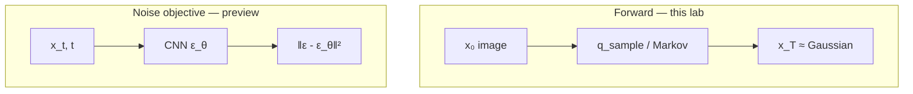

# L48: Hands-on — forward diffusion process

**Video:** [Lec 48](https://www.youtube.com/watch?v=wXBxC49sNmk) · 20:05  
**Instructor in this lecture:** Debarpan (part 1 of the diffusion notebook; reverse sampling is Lec 53)

### Learning objectives

- Implement the DDPM **forward** kernel, $\alpha_t$, $\bar{\alpha}_t$, and **closed-form** $x_t$ from $x_0$.
- Compare **linear** vs **cosine** $\beta$-schedules ($T=1000$) on remaining signal and **SNR**.
- Show that **iterative Markov** noising and **one-shot** $q(x_t\mid x_0)$ match in **mean and std** (Monte Carlo).
- Train a small **time-conditioned CNN** on MNIST to predict $\varepsilon$, then reconstruct by **subtracting** predicted noise — and list what a full DDPM still needs.

**Part 2** (reverse sampling, U-Net, guidance) is explicitly **not** this tutorial.

---

## What the notebook covers (week 7 theory)

Why diffusion; forward Gaussian noising; linear vs cosine variance schedules; denoising intuition; Markov interpretation; closed-form vs iterative sampling; SNR; noise-prediction objective; a small CNN on MNIST.

Imports: PyTorch, set **device to GPU** when available.

---

## Intuition recap (as coded)

Generation splits in two:

| Process | Path | Who learns |
|---------|------|------------|
| **Forward** | $x_0\to x_1\to\cdots\to x_T$ | nobody — add small Gaussians until noise |
| **Reverse** | $x_T\sim\mathcal{N}(0,I)$ toward $x_0$ | **neural net** |

---

## Equations implemented (from theory)

$$
q(x_t\mid x_{t-1}) = \mathcal{N}\!\bigl(\sqrt{1-\beta_t}\,x_{t-1},\; \beta_t I\bigr)
$$

$$
\alpha_t = 1-\beta_t, \qquad \bar{\alpha}_t = \prod_{s=1}^{t}\alpha_s
$$

**Closed form** (any intermediate state from $x_0$):

$$
x_t = \sqrt{\bar{\alpha}_t}\, x_0 + \sqrt{1-\bar{\alpha}_t}\,\varepsilon
$$

---

## Step 1 — Variance schedules, $T=1000$

Set **$T=1000$** steps from clean image to noise. Implement:

- **Linear** $\beta$ schedule  
- **Cosine-derived** $\beta$ schedule  

Both run over the **same start/end range** (spoken as going from **0 to 1** on the plotted normalized axis).

| Schedule | Shape on the plot | Remaining signal $\bar{\alpha}_t$ |
|----------|-------------------|-------------------------------------|
| **Linear** | essentially **flat** $\beta_t \approx 1/1000$ | signal decays **slowly at first**, then **drops** |
| **Cosine** | $\beta_t$ **small at the start**, then **rises** | **more uniform** decline of original signal |

**Why cosine is preferred here:** even though linear takes **uniform $\beta$ steps**, the **fraction of $x_0$ that remains** is **not** uniform. Cosine’s smaller early $\beta$ makes $\bar{\alpha}_t$ fall more evenly. Linear also fails to push **SNR as low** at the end (next plot).

Plot both $\beta_t$ and the retained-signal curves.

---

## Step 2 — Forward on a real image (astronaut)

- Load a standard **astronaut** image with **scikit-image**. Display $x_0$.  
- Precompute time-indexed $\alpha,\beta,\bar{\alpha}$.  
- `extract(values, time_steps, target_shape)` — gather coefficients for a batch of $t$.  
- `q_sample` — draw $x_t$ from **$q(x_t\mid x_0)$** (the **marginal**, one shot).

**Visualization timesteps:** $0, 50, 100, \ldots, 999$ (last step). The image **slowly** becomes Gaussian by $t=999$.

**Linear vs cosine on the same photo:**

| Row | What you should see |
|-----|---------------------|
| **Linear** (top) | becomes **very noisy early**; by **$t\approx 500$** already near Gaussian |
| **Cosine** (bottom) | **uniform** fade from structure to noise |

That is the same story as the $\bar{\alpha}_t$ plots.

---

## Step 3 — Markov-chain interpretation

**Markov:** next noisier image depends only on the **previous** noisier image.

$$
q(x_t \mid x_{t-1}, x_{t-2}, \ldots, x_0) = q(x_t \mid x_{t-1})
$$

Once $x_{t-1}$ is known, $x_{t-2},\ldots,x_0$ are irrelevant. Implement **iterative** transitions with the $\beta_t,\alpha_t$ formulas. Visualize $t=0$ through $t=999$: again, image → Gaussian.

---

## Step 4 — Closed form vs iterative: Monte Carlo check

Individual draws **differ** (different random $\varepsilon$ sequences) but they represent the **same marginal**. Experiment:

| Setting | Value |
|---------|--------|
| Clean signal $x_0$ | a **scalar** |
| Target $t$ | **500** |
| Number of samples | **20{,}000** |

Compare **empirical mean and standard deviation** of iterative Markov vs one-shot `q_sample`. They are **close** — the lab’s check that Markov modeling and closed-form sampling agree.

---

## Step 5 — Signal-to-noise ratio

$$
\mathrm{SNR}(t) = \frac{\bar{\alpha}_t}{1-\bar{\alpha}_t}
$$

| $t$ | Expected SNR |
|-----|----------------|
| start | **high** (all signal, no noise) |
| later | **falls** (signal down, noise up) |
| $T$ | **~0** (only noise) |

Both schedules: SNR **monotonically decreases**. Extra linear limitation: it does **not** drive SNR as **low** as cosine. Desired: **as high as possible at $t=0$**, **as low as possible at $t=T$**. Cosine has the **better range**.

---

## Step 6 — Noise-prediction objective (bridge to reverse)

Given clean $x_0$, random $t$, $\varepsilon\sim\mathcal{N}(0,I)$, build $x_t$. Ask a net: from **$(x_t, t)$**, recover $\varepsilon$. Not a linear map — needs a network.

**Simplified loss** (gradient descent):

$$
L_{\text{simple}} = \mathbb{E}\bigl[\|\varepsilon - \varepsilon_\theta(x_t,t)\|^2\bigr]
$$

$\theta$ = network weights. This is the training objective used next.

---

## Step 7 — Tiny MNIST noise predictor

| Piece | As implemented |
|-------|----------------|
| Data | MNIST, **transforms**, train/test split |
| Train size | **12{,}000** |
| Val size | **2{,}000** |
| Model | **CNN** taking the image **and** time, predicting noise |
| Parameters | about **124{,}000** |
| Optim | batches + train / eval loops |

**Observe:** training **MSE** and **validation MSE** both **fall**. So $\varepsilon_\theta(x_t,t)$ can approximate $\varepsilon$.

**Sanity check beyond the loss:** if noise is predicted well, **subtract** it from $x_t$ and you should **see $x_0$**. Grid: **first row = original digits**, **last row = reconstructions**. This is a **toy, one-step** demo — quality is only **approximate**. Real reverse diffusion uses **many** steps and a stronger net.

**Caveats stated at the end**

- Falling noise-prediction loss **does not** mean high-quality generation.  
- A complete DDPM still needs **reverse equations**, **iterative sampling** (not one subtraction), a **U-Net** (not this CNN), **longer training**, and optionally **conditioning / guidance** (next tutorial).  
- Optional extra exercises are listed in the notebook for self-study.

---

## Summary (as spoken)

- Forward diffusion **destroys** structure with Gaussian noise; the process is **Markovian**.  
- A **variance schedule** sets how fast signal dies; cosine is the better SNR / remaining-signal shape here.  
- **Closed form** enables efficient **random-$t$** training.  
- SNR **decreases** with $t$.  
- The net sees **$x_t$ and $t$** when predicting noise.  
- Basic DDPM learns added Gaussian noise with **MSE**.  
- **Full reverse** is the next lab.

### Key takeaways

- Code $x_t=\sqrt{\bar{\alpha}_t}x_0+\sqrt{1-\bar{\alpha}_t}\varepsilon$ and the Markov one-step kernel; they match in Monte Carlo.  
- $T=1000$; cosine $\beta$ beats linear on uniform signal decay and final SNR.  
- Astronaut viz: linear is “done” by ~500; cosine fades evenly.  
- MNIST CNN (~124k params, 12k/2k split) can drop $L_{\text{simple}}$ and roughly undo noise in one subtract — that is **not** yet a DDPM sampler.

---
