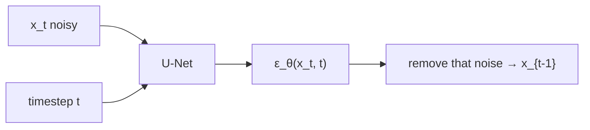
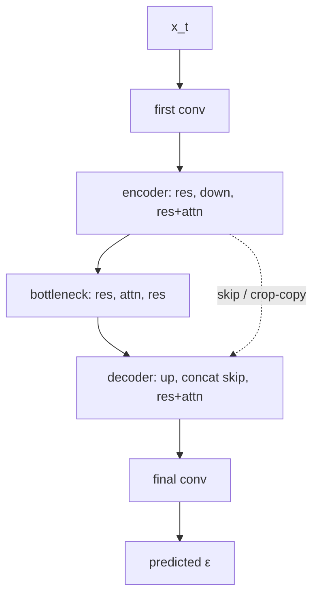
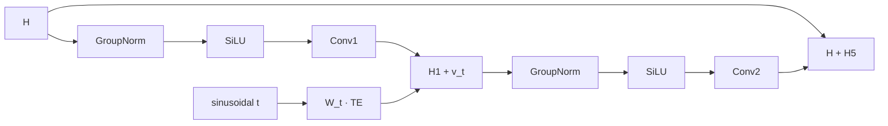

# L49: U-Net for denoising

**Video:** [Lec 49](https://www.youtube.com/watch?v=oqA3Mjp2Nn4) · 36:13  
**Instructor in this lecture:** Prof. Baishali Garai

### Learning objectives

- Place **U-Net** in DDPM: input $(x_t,t)$ → predicted noise $\varepsilon_\theta(x_t,t)$.
- Contrast **Ronneberger** segmentation U-Net with the DDPM stack: **time embeddings**, **residual blocks**, **self-attention**.
- Compute a **sinusoidal** time embedding (the $T=100$, $d=8$ numerical example).
- Walk **encoder / bottleneck / decoder**, the residual-block algebra (GroupNorm, **SiLU**, time projection), and **QKV** attention.

Classifier-guided diffusion is the **next** theory lecture, not this one.

---

## Role of U-Net in DDPM

Forward DDPM: add a scheduled amount of noise until a clean image is destroyed. Reverse: start from noise, denoise to $x_0$. The **network that predicts how much noise is in $x_t$** is a **U-Net**.

$$
\varepsilon_\theta(x_t, t)
$$

$\theta$ = U-Net weights. Inputs: noisy image $x_t$ **and** timestep $t$.

**Why U-Net rather than a plain CNN?**

1. **Global context** — overall image structure.  
2. **Skip connections** — **fine details** lost in downsampling are **copied back** on the expanding path.

At **every reverse step**, U-Net predicts $\varepsilon$; that amount is removed to form $x_{t-1}$.

---

## Original U-Net (segmentation) vs DDPM U-Net

Source picture: **Olaf Ronneberger**, *U-Net: Convolutional Networks for Biomedical Image Segmentation*. Input image → **segmentation map**.

| Part | Job |
|------|-----|
| **Encoder** (contracting) | downsample; spatial size shrinks; keep important information |
| **Bottleneck** | most **compressed** summary |
| **Decoder** (expanding) | upsample / reconstruct |
| **Skips** | **crop and concatenate** encoder features onto the matching decoder level so fine detail survives |

DDPM is **not** producing a segmentation map. It must **predict noise at each $t$**. The modified U-Net therefore adds three things:

1. **Timestep embeddings**  
2. **Residual blocks**  
3. **Attention layers**

---

## Time embeddings

Walking $x_T\to x_{t-1}\to\cdots\to x_0$, U-Net always sees some $x_t$. **$t$ is a proxy for noise level:** small $t$ → little noise; large $t$ → lots of noise (from the forward schedule).

Without $t$, the net sees only $x_t$ and cannot tell **$t=5$ from $t=1000$**.

| Example $t$ | Typical look (as taught) |
|-------------|---------------------------|
| 50 | slightly noisy |
| 500 | moderately noisy |
| 900 | heavily noised |

At each training step DDPM feeds **$(x_t, t)$**. $t$ is **not** a raw scalar. It becomes a **high-dimensional vector** via **sinusoidal embedding** (same idea as **transformers**).

For embedding dimension $d$, index $i=0,1,2,\ldots$:

$$
\mathrm{TE}(t, 2i) = \sin\left(\frac{t}{10000^{2i/d}}\right), \qquad
\mathrm{TE}(t, 2i+1) = \cos\left(\frac{t}{10000^{2i/d}}\right)
$$

Each $i$ produces **two** coordinates $(2i)$ and $(2i+1)$. Typical $d$ in implementations: **128 to 512**.

### Numerical example: $t=100$, $d=8$

Denominator $10000^{2i/d}$:

| $i$ | $2i/d$ | $10000^{2i/d}$ | Argument $t/\cdot$ | $\mathrm{TE}_{2i}=\sin$ | $\mathrm{TE}_{2i+1}=\cos$ |
|----:|--------:|----------------:|-------------------:|-------------------------:|---------------------------:|
| 0 | 0 | $1$ | $100$ | $\sin 100 \approx \mathbf{-0.506}$ | $\cos 100 \approx \mathbf{0.862}$ |
| 1 | $1/4$ | $10$ | $10$ | $\sin 10 \approx \mathbf{-0.544}$ | $\cos 10 \approx \mathbf{-0.839}$ |
| 2 | $1/2$ | $100$ | $1$ | $\sin 1 \approx 0.842$ | $\cos 1 \approx 0.540$ |
| 3 | $3/4$ | $1000$ | $0.1$ | $\sin 0.1 \approx 0.100$ | $\cos 0.1 \approx 0.995$ |

The lecture filled $i=0,1$ on the board (bold) and said $i=2,3$ complete $\mathrm{TE}_4\ldots\mathrm{TE}_7$ by the same recipe.

So $\mathrm{TE}(100)\in\mathbb{R}^8$ is the vector $(\mathrm{TE}_0,\ldots,\mathrm{TE}_7)$ fed into residual blocks. The instructor asked students to **cross-check** the trig values.

---

## Encoder, bottleneck, decoder (DDPM layout)

Time vectors sit **aside** until they are added **inside residual blocks**.

### Encoder

`x_t` → **conv** → feature map → **two residual blocks** (time embedding into each) → **downsample** → **res + attention** → **res + attention** → **downsample**. Residual blocks learn features for **noise prediction**; attention is the extra DDPM ingredient.

### Bottleneck

**Res → attention → res**, time embedding in the residual blocks.

### Decoder

**Upsample** → **concatenate skip** from encoder → **res + attention** → **res + attention** → **upsample** → **concat skip** → **res** → **res** (time in every res block) → predicted noise.

**Skips:** a slice of encoder features (fine detail) is **cropped and concatenated** onto the **same-scale** decoder map, then upsampling continues.

Simplified picture from the slides: noisy $x_t$ → encoder block → bottleneck → decoder → concat of the last skip → final convolution → $\varepsilon$.

---

## Inside a residual block

Input feature map $H$ has shape **$B\times C\times H\times W$** (batch, channels, spatial height/width).

| Step | Operation |
|------|-----------|
| 1 | **GroupNorm** → $\hat H$ |
| 2 | **SiLU** → $A$. Formula: $\mathrm{SiLU}(x)=x\cdot\sigma(x)$ ($\sigma=$ sigmoid) |
| 3 | **Conv 1** → $H_1$ |
| 4 | **Time projection:** sinusoidal $\mathrm{TE}(t)$, then $v_t = W_t\,\mathrm{TE}(t)$ with **learned linear** $W_t$ |
| 5 | $H_2 = H_1 + v_t$ |
| 6 | GroupNorm($H_2$) → $H_3$ |
| 7 | SiLU($H_3$) → $H_4$ |
| 8 | **Conv 2** → $H_5$ |
| 9 | **Residual:** $H_{\mathrm{out}} = H + H_5 = H + F(H)$ |

$F(H)$ is the learned transformation through the block; adding $H$ is the skip **inside** the res block. **That is how $t$ is wired into the architecture.**

---

## Self-attention (why convolution is not enough)

A convolution sees only a **local neighborhood**. Denoising a **left eye** may need the **right eye** across the face. Self-attention can pull **distant** but relevant pixels.

Feature map $X$ with spatial size $H\times W$ and $C$ channels. Build **query, key, value**:

$$
Q = X W_Q,\quad K = X W_K,\quad V = X W_V
$$

$W_Q,W_K,W_V$ are **learned**. Attention weights and output:

$$
A = \mathrm{softmax}\left(\frac{Q K^\top}{\sqrt{d}}\right), \qquad Y = A V
$$

$d$ is the key dimension (scale is a **scalar** divide). This is how self-attention is used in the DDPM U-Net for noise prediction.

---

## Recap

- Original U-Net → segmentation; DDPM U-Net → **$\varepsilon_\theta(x_t,t)$**.  
- Modifications: **sinusoidal time embeddings**, **residual blocks** (time added after conv1), **self-attention**.  
- $t$ matters because it **encodes noise level**.  
- Encoder / bottleneck / decoder all mix res ± attention; skips restore detail.  
- Next lecture flagged: **classifier-guided** diffusion.

### Key takeaways

- U-Net is the DDPM denoiser: global structure + skips for fine detail.  
- $\mathrm{TE}(t)$ uses $\sin/\cos$ of $t/10000^{2i/d}$; the $t=100$, $d=8$ vector is the exam-style drill.  
- Residual path: GroupNorm → SiLU → conv → **add $W_t\mathrm{TE}(t)$** → GroupNorm → SiLU → conv → **$H+F(H)$**.  
- Attention: $Q,K,V$ projections, softmax$(QK^\top/\sqrt{d})$, then $AV$, so far-apart structure (two eyes) can interact.

---
