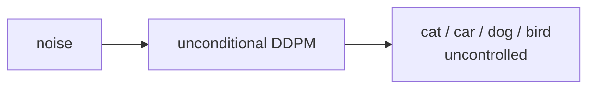
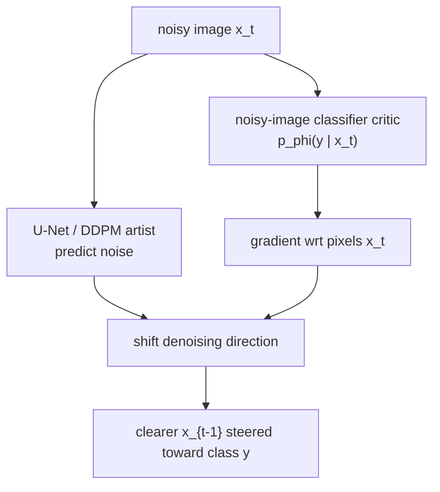
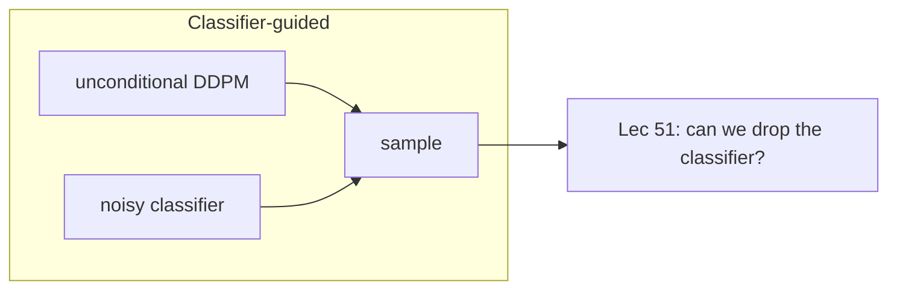

# L50: Classifier-guided diffusion model

**Video:** [Lec 50](https://www.youtube.com/watch?v=tDFtVtmwuxo) · 37:35  
**Instructor in this lecture:** Prof. Ashwini Kodipalli

### Learning objectives

- Explain why an unconditional DDPM cannot choose a class (dog vs cat vs flower).
- Describe the **artist + critic** pair: a denoising U-Net plus a **noisy-image classifier**.
- Reconstruct the Bayes / score derivation that turns a classifier gradient into a **guided noise** $\hat{\varepsilon}$.
- State the **guidance scale** $s$ trade-off (class precision vs diversity) and the sampling replacement rule.
- List the pipeline limitations that motivate classifier-free guidance in the next lecture.

### Agenda (as stated in lecture)

1. Motivation for classifier-guided diffusion  
2. What the method is (core idea + paper)  
3. Mathematical formulation  
4. Guidance scale  
5. Sampling equation  
6. Limitations  

This lecture is **not** classifier-free guidance (Lec 51) and **not** Stable Diffusion (Lec 52).

---

## Why unconditional DDPM has no class control

A standard DDPM learns the data distribution and can emit realistic images, but it has **no control over which class** comes out. Feed in noise; the reverse process may produce a cat, a car, a dog, or a bird. If the requirement is “only dog images” (or even a specific breed), that is not guaranteed.

A **guidance mechanism** is required so the model knows *what* to generate, not only *how* to denoise.

---

## Core idea and paper

**Core idea (lecture metaphor):** take a generative model that already knows how to create images from noise, and give it a **GPS / steering wheel** that steers generation toward a chosen category.

The method was introduced in **Dhariwal & Nichol**, *Diffusion Models Beat GANs on Image Synthesis*, **NeurIPS 2021**.

### Two components

| Role | What it is | What it does |
|------|------------|--------------|
| **Artist** | Ordinary **unconditional** DDPM / U-Net | Denoises a noisy image toward something realistic. It does **not** know which class to emit. |
| **Critic** | A **classifier**, itself a pretrained network | Looks at the *noisy* image $x_t$ and predicts $p_\phi(y \mid x_t)$ over classes (cats, dogs, trees, houses, …). |

$\phi$ denotes the classifier’s parameters.

---

## Artist–critic loop (intuition)

At each reverse step:

1. The **artist** takes a small step to remove noise.  
2. The **critic** looks at the slightly clearer image and computes the **gradient of the class score with respect to image pixels**:

$$
\nabla_{x_t} \log p_\phi(y \mid x_t)
$$

3. That gradient says *how to change pixels* so that the probability of the target class (lecture running example: **dog**, $y = \text{dog}$) goes up.  
4. The diffusion model **shifts its denoising trajectory** along that gradient. Generation is oriented toward class $y$.

The classifier must be trained on **noisy** images $x_t$ at many noise levels (the lecture’s jumping-dog example: clean dog plus several noisy versions, all labeled “dog”). A classifier trained only on **clean** photos will not give a usable gradient during reverse diffusion, because the critic only ever sees noisy $x_t$, never a clean $x_0$, until the end.

---

## Guidance scale $s$

The **guidance scale** $s$ is the **strength** with which the classifier gradient is added to the denoiser.

| $s$ | Class recognizability | Sample diversity |
|-----|------------------------|------------------|
| Small | Weak conditioning; images may not look like the target class | Higher diversity |
| Large | Strong, precise class (very “dog-like”) | Diversity **drops** |

There is an explicit **precision–diversity trade-off**. Too large $s$ yields accurate dogs but similar dogs. An **optimal** $s$ is a compromise; the lecture does not prescribe a single numeric default here (paper figures use specific values below).

---

## Reverse process without class, then with a perturbation

Unconditional DDPM reverse transition (no $y$ in the formula):

$$
p_\theta(x_{t-1} \mid x_t) = \mathcal{N}\!\bigl(x_{t-1};\; \mu_\theta(x_t, t),\; \Sigma_\theta(x_t, t)\bigr)
$$

starting from $x_T$ and walking down to $x_0$. Conditioning is visible in an equation **only if $y$ appears**.

To steer that trajectory: **perturb** the reverse denoising path with the **classifier gradient**. Sampling still uses a trained unconditional DDPM; the extra signal is the critic’s $\nabla_{x_t} \log p_\phi(y \mid x_t)$.

### Sampling-time picture (as drawn in lecture)

1. Give $x_t$ to the U-Net; it predicts noise $\varepsilon_\theta(x_t, t)$.  
2. Subtracting that noise would give the usual slightly cleaner image.  
3. Independently, take $\nabla_{x_t} \log p_\phi(y \mid x_t)$ from the classifier on the **same** $x_t$.  
4. **Add** that gradient into the update so the next image is both cleaner **and** more like class $y$.

---

## Mathematical formulation

The target reverse distribution is **class-conditional on the noisy image**:

$$
p(x_t \mid y)
$$

—probability of observing noisy $x_t$ given class $y$ (dog).

### Bayes

$$
p(x_t \mid y) = \frac{p(y \mid x_t)\, p(x_t)}{p(y)}
$$

Take $\log$:

$$
\log p(x_t \mid y) = \log p(x_t) + \log p(y \mid x_t) - \log p(y)
$$

$p(y)$ does **not** depend on $x_t$, so its gradient wrt $x_t$ is zero. Differentiate:

$$
\nabla_{x_t} \log p(x_t \mid y)
= \nabla_{x_t} \log p(x_t)
+ \nabla_{x_t} \log p_\phi(y \mid x_t)
$$

This is the **key equation** of classifier guidance.

| Term | Role (lecture reading) |
|------|-------------------------|
| $\nabla_{x_t} \log p(x_t)$ | Makes the image **realistic** (no class $y$) |
| $\nabla_{x_t} \log p_\phi(y \mid x_t)$ | Pushes toward the **target class** (dog) |

### Unconditional score as predicted noise

In ordinary DDPM the first term is the **diffusion score**, written in the lecture as a constant times the U-Net noise prediction:

$$
\nabla_{x_t} \log p(x_t)
= -\frac{1}{\sqrt{1-\bar{\alpha}_t}}\, \varepsilon_\theta(x_t, t)
$$

with the usual cumulative product

$$
\bar{\alpha}_t = \prod_{i=1}^{t} \alpha_i
$$

—the **fraction of original signal remaining** after $t$ forward steps.

Substitute:

$$
\nabla_{x_t} \log p(x_t \mid y)
= -\frac{1}{\sqrt{1-\bar{\alpha}_t}}\, \varepsilon_\theta(x_t, t)
+ \nabla_{x_t} \log p_\phi(y \mid x_t)
$$

$\varepsilon_\theta$ is the **old, unconditioned** noise. The extra gradient produces a **new** noise oriented toward class $y$.

### Guided noise $\hat{\varepsilon}$

Identify the left-hand side with the same score form but a **new** noise that depends on $y$:

$$
\nabla_{x_t} \log p(x_t \mid y)
= -\frac{1}{\sqrt{1-\bar{\alpha}_t}}\, \hat{\varepsilon}(x_t, y)
$$

Multiply through by $-\sqrt{1-\bar{\alpha}_t}$ and insert the **guidance scale** $s$ on the classifier term (lecture: “classifier-guided noise prediction equation”):

$$
\hat{\varepsilon}(x_t, y)
= \varepsilon_\theta(x_t, t)
- s\,\sqrt{1-\bar{\alpha}_t}\, \nabla_{x_t} \log p_\phi(y \mid x_t)
$$

Removing $\hat{\varepsilon}$ instead of $\varepsilon_\theta$ steers the reverse path toward $y$.

- Small $s$: diverse images, **weak** class match.  
- Large $s$: strong class match, **less** diversity.

---

## Sampling equation

**Rule:** in the usual DDPM reverse update, **replace** the standard noise estimate with the guided $\hat{\varepsilon}$.

The lecture writes the reverse step in the “predict $x_0$ then mix with noise” form (same $\hat{\varepsilon}$ in both places):

$$
x_{t-1}
= \sqrt{\bar{\alpha}_{t-1}}
\left(
\frac{x_t - \sqrt{1-\bar{\alpha}_t}\,\hat{\varepsilon}}{\sqrt{\bar{\alpha}_t}}
\right)
+ \sqrt{1-\bar{\alpha}_{t-1}}\,\hat{\varepsilon}
$$

(At the last step the usual DDPM extra Gaussian draw is omitted; that detail is used in the reverse-process lab, Lec 53.)

### Paper figure (Pembroke Welsh Corgi)

From Dhariwal & Nichol: classifier guidance on class **Pembroke Welsh Corgi**.

- Smaller $s$ (lecture: **$s=1$**): not very convincing class images.  
- Larger $s$ (lecture: **$s=10$**, corrected from a spoken “100”): consistent images of that class.

---

## Limitations

1. **Extra classifier**, trained specifically on **noisy** $x_t$ at the diffusion time steps (gradients needed at every $t$). Two trainings: unconditional DDPM **and** the noisy classifier.  
2. **Off-the-shelf ImageNet classifiers** (e.g. **ResNet** on clean images) **do not work**.  
3. **Complex pipeline:** two separate networks (U-Net + classifier).  
4. **Sampling cost:** classifier gradients at **every** $t$.  
5. **Adversarial vulnerability:** the reverse process can create **artifacts** that score high for the target class but look artificial / not human-like.

---

### Key takeaways

- Unconditional DDPM generates realistic images with **no class knob**.  
- Classifier guidance adds a noisy-image critic; $\nabla_{x_t}\log p_\phi(y\mid x_t)$ steers denoising toward $y$.  
- Bayes splits the conditional score into a **realism** term (U-Net $\varepsilon_\theta$) and a **class** term (classifier).  
- Guided noise $\hat{\varepsilon}$ replaces $\varepsilon_\theta$ in the reverse update; $s$ trades **precision vs diversity**.  
- Cost: a second network, noisy-label training, per-step gradients, and adversarial artifacts. Next lecture: **classifier-free** guidance.

---
