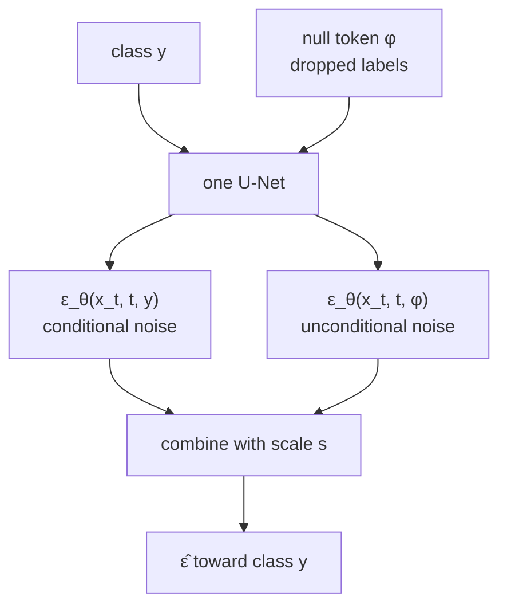
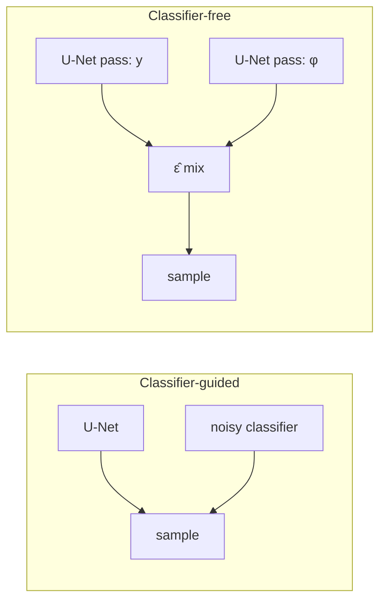

# L51: Classifier-free diffusion models

**Video:** [Lec 51](https://www.youtube.com/watch?v=sf35xeS7i2Y) · 20:36  
**Instructor in this lecture:** Prof. Ashwini Kodipalli

### Learning objectives

- Restate why classifier-guided diffusion is heavy (extra noisy classifier, no off-the-shelf ResNet).
- Explain **classifier-free guidance (CFG)**: one U-Net trained for **both** conditional and unconditional denoising.
- Write the CFG noise combination with guidance scale $s$.
- Contrast sampling cost: U-Net **+ classifier** vs **two U-Net passes**.

### Agenda (as stated in lecture)

Motivation → CFG concept → **joint training** → math → sampling → comparison table vs classifier guidance.

---

## Motivation: drop the external classifier

Lec 50’s limitations, restated as the reason for CFG:

| Problem | Why it hurts |
|---------|----------------|
| Extra classifier | Must be trained **on noisy images** $x_t$ to supply $\nabla_{x_t}\log p(y\mid x_t)$ |
| No ImageNet ResNet | Off-the-shelf nets saw **clean** pixels, not $x_t$ |
| Two trainings | Unconditional DDPM **and** the classifier → slower, more complex pipeline |

**Question of this lecture:** can we get similar **class-conditioned** generation **without** an explicit classifier?

**Paper:** Jonathan Ho and the Google Research Brain Team, *Classifier-Free Diffusion Guidance*, **NeurIPS workshop 2022**.

---

## Core idea

- Conditional generation **without** a separate critic.  
- A **single** diffusion U-Net is trained to do **conditional and unconditional** generation **at the same time**.  
- Guidance comes from the **difference** between those two denoising scores—not from $\nabla \log p_\phi(y\mid x_t)$.

---

## Joint training of one network

The same network sees two kinds of example:

**Conditional path.** Supply class labels $y$. The network outputs a **conditional** noise / score that depends on $(x_t, t, y)$:

$$
\varepsilon_\theta(x_t, t, y)
$$

**Unconditional path.** Drop class labels with a **fixed probability** (lecture: on the order of **10–20%** of the data). Replace $y$ by a **null token** $\phi$ that means “no conditioning.” The same network then outputs

$$
\varepsilon_\theta(x_t, t, \phi)
$$

$\phi$ is **not** a class; it is the **absence** of class information. One set of U-Net weights therefore learns both scores. Their **difference** is what steers generation toward a chosen class.

---

## Mathematical formulation

In classifier guidance the missing piece was the classifier term $p(y \mid x_t)$. CFG **rewrites that probability using the diffusion model itself**.

Bayes:

$$
p(y \mid x_t) = \frac{p(x_t \mid y)\, p(y)}{p(x_t)}
$$

$$
\log p(y \mid x_t) = \log p(x_t \mid y) + \log p(y) - \log p(x_t)
$$

$p(y)$ is constant wrt $x_t$, so its gradient vanishes. The classifier gradient then becomes a combination of a **conditional** score $\nabla_{x_t}\log p(x_t \mid y)$ and an **unconditional** score $\nabla_{x_t}\log p(x_t)$—the two quantities the jointly trained U-Net already estimates.

**Punchline:** CFG **approximates the classifier gradient using only the diffusion model**. No external $p_\phi$.

### Guided noise (as written in lecture)

The instructor does not re-derive every algebra step; the sampling noise is given as a **combination** of conditional and unconditional predictions, with guidance scale $s$:

$$
\hat{\varepsilon}(x_t, t, y)
= (1+s)\,\varepsilon_\theta(x_t, t, y)
- s\,\varepsilon_\theta(x_t, t, \phi)
$$

- $\varepsilon_\theta(x_t, t, y)$: noise from the **conditional** training path.  
- $\varepsilon_\theta(x_t, t, \phi)$: noise from the **unconditional** path ($y$ replaced by $\phi$).  
- $s$: how hard to push toward the condition (same precision–diversity tension as Lec 50).

Equivalently, this is a weighted mix of “noise with class” and “noise without class.” Removing $\hat{\varepsilon}$ in the reverse process steers samples toward $y$.

---

## Sampling / training recipe (as listed)

1. Sample training pairs **with** class labels from the dataset.  
2. **Randomly discard** the label on a fraction of examples; replace with $\phi$.  
3. Train **one** network on both conditional and unconditional examples.  
4. At generation time, form $\hat{\varepsilon}$ from the two forward passes and denoise as in DDPM.

The network has learned to guide itself toward a class **without a classifier**.

### Paper figure

From Ho et al.: **left** = non-guided samples (not convincing); **right** = CFG with **$s = 3$** (class is clear; lecture notes some **color saturation**). Same source: NeurIPS workshop 2022.

---

## Classifier-guided vs classifier-free

| | **Classifier-guided** (Lec 50) | **Classifier-free (CFG)** |
|--|-------------------------------|---------------------------|
| Separate classifier | Yes | **No** (main advantage) |
| Noisy-classifier training | Yes | Not required |
| Where the guidance signal comes from | Classifier gradient $\nabla_{x_t}\log p_\phi(y\mid x_t)$ | **Difference** of conditional vs unconditional scores |
| Sampling-time cost | U-Net **plus** classifier, both run while generating | **Two U-Net passes** (conditional and unconditional) per step |

Why two U-Net passes: there is no critic, but each reverse step still needs **both** $\varepsilon_\theta(\cdot, y)$ and $\varepsilon_\theta(\cdot, \phi)$ to form $\hat{\varepsilon}$. The lecture also describes training as seeing each image in both roles (with $y$ and with $\phi$).

---

### Key takeaways

- CFG exists to **delete the noisy classifier** while keeping class control.  
- One U-Net, **joint** training: keep $y$ or replace it by null $\phi$ with fixed dropout probability.  
- The old classifier gradient is rewritten as **conditional minus unconditional** diffusion scores.  
- $\hat{\varepsilon}=(1+s)\varepsilon_\theta(x_t,t,y)-s\varepsilon_\theta(x_t,t,\phi)$; larger $s$ (paper demo $s=3$) sharpens class at some cost (saturation / diversity).  
- Sampling trades classifier cost for **two U-Net evaluations**. Next lecture: **Stable Diffusion**.

---
