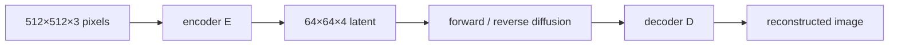
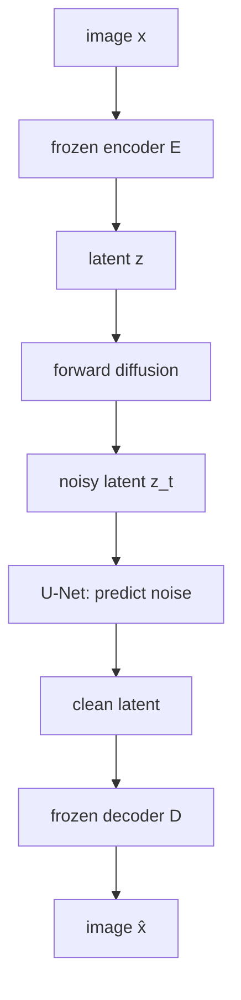
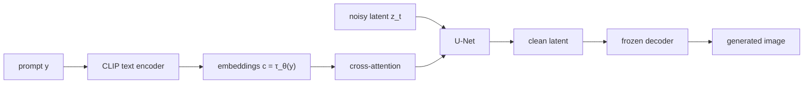
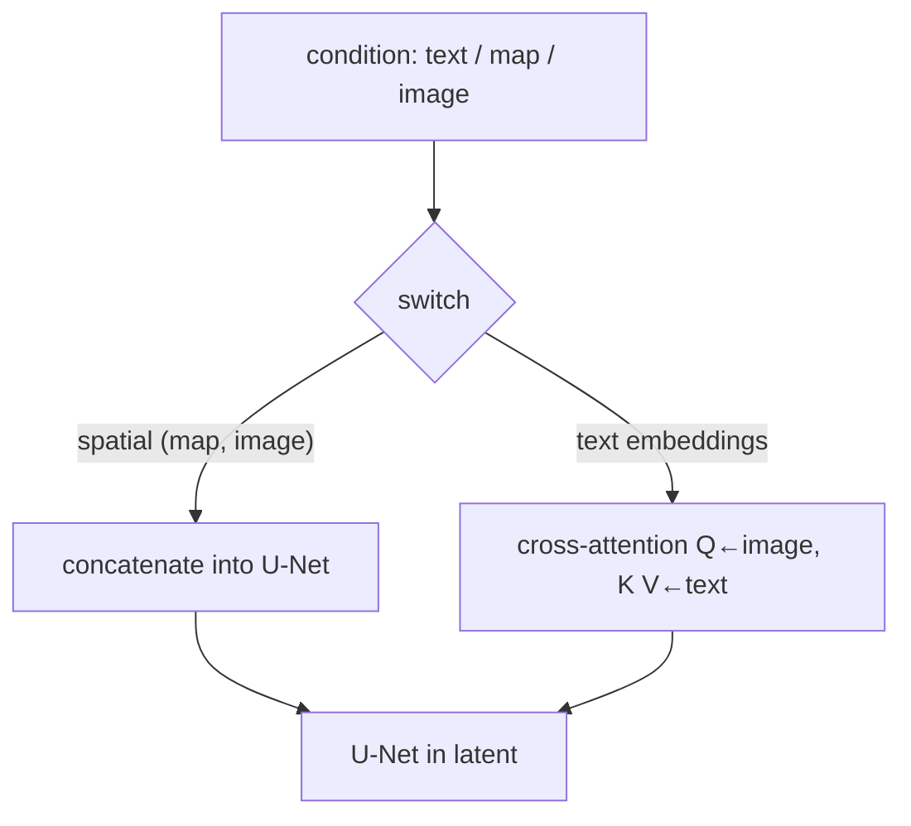

# L52: Stable Diffusion model

**Video:** [Lec 52](https://www.youtube.com/watch?v=8xZqIo3BZgE) · 36:02  
**Instructor in this lecture:** Prof. Ashwini Kodipalli

### Learning objectives

- Motivate **latent** diffusion: why pixel-space DDPM on $512\times 512\times 3$ is too expensive.
- Separate **latent diffusion (LDM)** (the algorithm) from **Stable Diffusion** (text-to-image implementation).
- Trace the frozen autoencoder → noisy latent → U-Net → decoder pipeline and the latent-space MSE objective.
- Write **cross-attention** with $Q$ from U-Net maps and $K,V$ from a **CLIP** text encoder.
- Choose **concatenation vs cross-attention** from whether the condition has spatial structure.

### Agenda (as stated in lecture)

Motivation → latent diffusion intro → LDM training pipeline → LDM objective → Stable Diffusion pipeline → cross-attention → conditioning modalities → advantages vs DDPM.

This is the **last image-generation / diffusion theory** video in the series. Transformer encoder internals are **not** taught here (text encoder is used as a frozen CLIP module).

---

## Motivation: DDPM in pixel space is expensive

In DDPM, forward and reverse diffusion run on the **full high-dimensional image**. Every pixel is noised and denoised.

$$
x \in \mathbb{R}^{H \times W \times 3}
$$

($H,W$ = height/width; $3$ = RGB). A **$512\times 512\times 3$** image has

$$
512 \times 512 \times 3 = 786{,}432
$$

pixel values. Those must be processed at **every** denoising step. Diffusion already uses **hundreds** of reverse steps, so inference is slow.

Stated problems: **high memory**, **high compute**, **slow inference**.

**Idea:** compress the image to a **latent** that keeps the important structure and drops irrelevant detail, then run diffusion **in that latent**.

**Paper:** Rombach et al., *High-Resolution Image Synthesis with Latent Diffusion Models*, **CVPR 2022**.

| Name | What it is |
|------|------------|
| **Latent diffusion model (LDM)** | The **algorithm** in that paper |
| **Stable Diffusion** | A **practical** LDM implementation for **text-to-image**, with extra **conditioning** |

For a $512\times 512$ image the lecture’s latent is **$64\times 64\times 4$** (much smaller than $786{,}432$ pixels). Diffusion happens on that latent, not on RGB.

---

## Latent diffusion training pipeline

1. Input image $x$ goes through an **autoencoder**. Latent $z = E(x)$.  
2. The autoencoder is **trained first, then frozen**. While the diffusion model trains, **$E$ and $D$ are not updated**.  
3. $z$ goes through **forward diffusion** → **noisy latent** (latent analogue of DDPM’s noisy image).  
4. **U-Net** reverse-denoises and **predicts the noise** in latent space → **clean latent**.  
5. Frozen **decoder** $D$ maps the clean latent to $\hat{x}$ (generated / reconstructed image).

Noisy latent $\Leftrightarrow$ DDPM noisy image, but in compressed coordinates.

---

## Latent diffusion objective

Same shape as the DDPM noise-matching loss, **applied to latents** instead of pixels:

$$
L = \mathbb{E}\bigl\| \varepsilon - \varepsilon_\theta(z_t, t) \bigr\|^2
$$

| Symbol | Meaning |
|--------|---------|
| $\varepsilon$ | Gaussian noise added in the **forward** process |
| $z_t$ | **Noisy latent** at time $t$ |
| $\varepsilon_\theta(z_t, t)$ | U-Net prediction — depends on **$z_t$ and $t$**, **not** on pixel $x_t$ |

The network predicts noise in **latent** space.

---

## Stable Diffusion pipeline (text → image)

Stable Diffusion = LDM **plus text conditioning**.

1. **Text prompt** $y$ (e.g. a caption).  
2. **Text encoder:** a **pretrained CLIP** text encoder, used so the model can read the **semantic meaning** of the prompt.  
3. **Text embeddings** (networks do not ingest raw strings). Lecture notation:

$$
c = \tau_\theta(y)
$$

vectors that store the prompt’s meaning as numbers. These embeddings **condition** image generation.

4. Embeddings enter the U-Net through a **cross-attention** block — the **bridge** between language and the latent diffusion path.  
5. U-Net sees **noisy latent** $z_t$ (DDPM’s noisy image, in latent space), predicts noise, yields a cleaner latent.  
6. **Frozen decoder** reconstructs the image.

---

## Cross-attention: $Q$ from the image, $K,V$ from text

Attention always uses **query, key, value**.

**Query (from the image / U-Net):**

$$
Q = W_Q^{i}\, \varphi_i(z_t)
$$

- $W_Q^{i}$: learnable weights at U-Net layer $i$  
- $\varphi_i(z_t)$: feature map of that layer, flattened into an $N\times d$ intermediate representation  

**Key and value (from text embeddings):**

$$
K = W_K^{i}\, \tau_\theta(y), \qquad
V = W_V^{i}\, \tau_\theta(y)
$$

Because $Q$ comes from one sequence (U-Net features) and $K,V$ from another (text), this is **cross-attention**. If $Q,K,V$ all came from the same sequence it would be **self-attention**.

Standard weights:

$$
\mathrm{Attention}(Q,K,V) = \mathrm{softmax}\!\left(\frac{QK^{\top}}{\sqrt{d}}\right) V
$$

$\sqrt{d}$ is the (scalar) key dimension scale.

### Why cross-attention is required

Prompt example: **“a yellow butterfly sitting on a purple flower.”**

Different **regions of the latent** need different **words**:

| Latent region | Must receive |
|---------------|----------------|
| Butterfly | “butterfly” + **yellow** |
| Flower | “flower” + **purple** |
| Background | remaining context |

Without attending text into spatial features, those details do not land in the right places. Cross-attention at **several U-Net resolutions** is called out as a **main innovation** of the LDM paper (skip connections still carry fine spatial detail that encoding might drop).

---

## Three blocks of the LDM / Stable Diffusion figure

The lecture walks the paper diagram as **pixel space** (pink), **latent space** (green), and a **conditioning** block.

### Pixel space

- Encoder $E$: $x \mapsto z$  
- After diffusion in latent space, decoder $D$ reconstructs $\tilde{x}$ / $\hat{x}$

### Latent space

- **All** forward and reverse diffusion lives here.  
- Gaussian noise is added **progressively** to $z$ until $z_T$ at $t=T$.  
- Denoising U-Net predicts $\varepsilon_\theta$; **skip connections** restore fine detail.  
- **Cross-attention at several resolutions** injects conditioning (text or other).

### Conditioning block

Stable Diffusion’s headline use is **text → image**, but the architecture supports **several modalities**:

| Condition | Lecture example |
|-----------|-----------------|
| **Text prompt** | “cat sitting on a red carpet” |
| **Semantic map** | labeled regions (dog, cats) → image |
| **Image** | e.g. **black-and-white → color** (image-to-image) |

Conditioning is injected in **two** ways; a **switch** in the diagram picks one from the application.

| Method | When |
|--------|------|
| **Concatenation** | Condition has **spatial** structure: segmentation map, low-res image, another image |
| **Cross-attention** | **Text embeddings** — **no** spatial dimensions |

Text-to-image → cross-attention. Image-to-image → concatenation. The switch is “use concat **or** cross-attention depending on the job.”

---

## Advantages over pixel-space DDPM

Lecture metaphor: DDPM adds Gaussian noise to a **full-resolution photograph**. Stable Diffusion first compresses that photo to a compact **blueprint** (latent: important structure, unimportant detail removed), **noises the blueprint**, then **cleans the blueprint** step by step and **decodes** to pixels.

Fewer coordinates in the reverse process → **lower computational cost** and faster inference than denoising all $786{,}432$ RGB values at every step.

---

## Text-to-image examples (paper, LAION 1.45B)

Same prompt can yield **different** valid images on different runs. Lecture examples:

- “a street sign that reads latent diffusion”  
- “a zombie in the style of Picasso”  
- “image of an animal half mouse, half octopus”  
- “illustration of slightly conscious neural network”  

---

### Key takeaways

- LDM moves DDPM from pixels into a **frozen autoencoder’s latent** ($64\times 64\times 4$ vs $512\times 512\times 3$).  
- Stable Diffusion **is** that algorithm plus **CLIP text embeddings** and **cross-attention** into the U-Net.  
- Loss is DDPM’s noise MSE on **$z_t$**, not $x_t$.  
- $Q$ from U-Net maps, $K$ and $V$ from $\tau_\theta(y)$; concat is for **spatial** conditions.  
- Next in the playlist is the **reverse-diffusion lab**; the instructor also flags the coming shift to **NLP / transformers / LLMs**.

---
