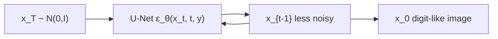
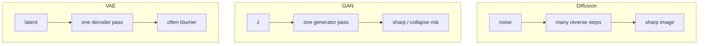

# L53: Hands-on reverse diffusion process

**Video:** [Lec 53](https://www.youtube.com/watch?v=b1lFJ8_zEdQ) · 37:26  
**Instructor in this lecture:** lab / TA session (part 2 of the diffusion notebook; Debarpan’s reverse-denoising track from the course intro)

### Learning objectives

- Implement reverse DDPM sampling from $\mathcal{N}(0,I)$ with a **small class-conditional U-Net** on **MNIST**.
- Train with **$L_{\mathrm{simple}}$** (MSE on Gaussian noise) and **null-class dropout** for classifier-free guidance.
- Compare **guidance scales** and a tiny **quality classifier** on generated digits.
- Contrast diffusion vs **GAN** vs **VAE** using the lecture’s table (tendencies, not universal laws).

### What this notebook covers (stated up front)

Reverse-diffusion intuition · full DDPM training pipeline · small U-Net for MNIST · noise-prediction loss · sampling from Gaussian noise · classifier guidance vs **classifier-free** guidance · gradient-weight experiments · visual quality · qualitative **diffusion vs GANs vs VAEs**.

This is **part 2**. Part 1 was the **forward** process (clean image → incremental noise → Gaussian). Fast Colab settings are intentional; this is **not** a production sampler.

---

## Reverse-process intuition

**Forward (part 1):** $x_0$ is destroyed step by step until $x_t$ is (approximately) Gaussian noise.

**Reverse (this lab):** generation **starts from** that Gaussian and repeatedly estimates a **less noisy** state. At each $t$ the network predicts the noise to subtract:

$$
\varepsilon_\theta(x_t, t, y)
$$

given current noisy image $x_t$, time $t$, and optional class $y$. $\theta$ = U-Net weights. Iterate until $x_0$.

---

## DDPM reverse equations (as used in the notebook)

The reverse **mean** $\mu_\theta(x_t,t)$ is parameterized by the **same** $\varepsilon_\theta$ and by schedule coefficients $\alpha_t$, $\beta_t$. Sample quality tracks how well $\varepsilon_\theta$ predicts the forward noise.

A reverse draw:

$$
x_{t-1} = \mu_\theta(x_t, t) + \sqrt{\tilde{\beta}_t}\, z, \qquad z \sim \mathcal{N}(0,I)
$$

with $\tilde{\beta}_t$ the usual posterior variance. **At the final step no extra random noise is added** — you want a clean image.

---

## Diffusion schedule (fast mode)

Production models may use more elaborate / faster schedules. Here:

| Setting | Value in the notebook |
|---------|------------------------|
| Time steps $T$ | **100** (`fast_mode=True`; set `False` to increase $T$) |
| $\beta$ schedule | **Linear**, $\beta$ from **0** to **0.02** |
| $\alpha_t$ | $1-\beta_t$ |
| Also computed | $\bar{\alpha}_t$, posterior variance |

**Plot to observe:** $\alpha$ starts at **1** and falls; $\beta$ starts at **0** and rises with $t$.

### Helpers reused from the forward lab

- `extract`: reshape schedule coefficients to **image shape** for broadcast multiply.  
- `q_sample`: sample a noisy image from the closed-form posterior $q(x_t \mid x_0)$ (same function as part 1).

---

## Dataset: MNIST (small on purpose)

Scale up to “real-looking” datasets later; MNIST keeps the tutorial short.

| Split | Size |
|-------|------|
| Train | **12,000** |
| Validation | **2,000** |

PyTorch `Dataset` + `DataLoader` (`train_loader`, `val_loader`). Print sizes as a check (12000 / 2000). Display a few digit grids for sanity.

---

## Small class-conditional U-Net

Encoder of conv layers **down** to a bottleneck, then **up**; **skip connections** (ResNet-style) keep local detail.

Extra inputs required to predict noise:

| Condition | Role |
|-----------|------|
| **Time-step embedding** | Current noise level (sinusoidal, like transformer **positional** embeddings) |
| **Class embedding** | Desired digit $y$ |

### Residual conv block (time + class)

Forward path (as narrated / shown as pseudocode):

1. Residual projection of the incoming features.  
2. **GroupNorm** → **SiLU** → $3\times 3$ conv.  
3. Add `condition_projection(condition)` — this is where **time + class** enter (`hidden = hidden + self.condition_projection(condition)`).  
4. GroupNorm → nonlinearity → conv again.  
5. Skip from input features to the block output.

### `SmallConditionalUNet`

- Number of classes for MNIST digits.  
- **`non_null` / null class:** **unconditional** (“free-form”) generation — random MNIST-like digits, **not** forced to be a five. Null class ⇒ no digit guidance.  
- Sinusoidal time embedding + class embedding + encoder / downsampling + bottleneck + decoder / upsampling.  
- Forward: pack time and labels into `condition`; project the noisy image; encoder skips (`skip1`, `skip2`); decoder; output = **predicted noise**.

**Size check:** model `.to(device)`; about **778k** parameters.

**Shape check:** pull `test_images` / labels from `train_loader`; noisy image, predicted noise, and target noise must share **the image shape**.

---

## Training objective and loop

$$
L_{\mathrm{simple}} = \mathbb{E}\bigl\| \varepsilon - \varepsilon_\theta(x_t, t, y) \bigr\|^2
$$

$\varepsilon$ = the Gaussian actually added in the forward process. $\theta$ = U-Net.

**One training step:**

1. Sample a clean image and label.  
2. Sample a random time $t$.  
3. Sample Gaussian noise; `q_sample` → noisy image.  
4. **Occasionally replace the class with the null condition** (needed for **classifier-free** guidance).  
5. Predict noise; **MSE** vs true $\varepsilon$; backprop.

`prepare_training_batch(clean_images, class_labels, drop_probability)` with **drop probability $0.1$**.

### Evaluation helper

- `model.eval()` so gradients are not stored.  
- Move clean images, labels, and time steps to GPU.  
- `q_sample` → noisy image + true noise.  
- `predicted = model(noisy, timesteps, labels)`.  
- `F.mse_loss(predicted, true_noise)`; accumulate.  
- Set the model **back to `train()`** after eval.

### Optimizer / epochs (fast tutorial)

| Choice | Value |
|--------|--------|
| Optimizer | **Adam** |
| Learning rate | **$10^{-3}$** |
| Epochs | **4** |

Per batch: `optimizer.zero_grad()` → `loss.backward()` → `optimizer.step()`. Track **train and val MSE** each epoch (overfitting check).

**Spoken curves:** train MSE **$1.09 \to 0.07$**; validation MSE also falls (lecture: starts near **$0.01$** and is **$0.07$** by the end of the short run). Plot train MSE; optional **save** utility for later reuse.

---

## Reverse sampling: `p_sample`

Start from $x_T \sim \mathcal{N}(0,I)$. At every $t$ call the model and apply the reverse equation until a clean image.

| Mode | What you pass |
|------|----------------|
| **Unconditional** | noisy image, $t$, **null labels** |
| **Conditional** | noisy image, $t$, **class labels** (e.g. digit 5) |

**Classifier-free mix** (what the notebook implements):

$$
\hat{\varepsilon}
= \varepsilon_{\mathrm{uncond}}
+ s\,(\varepsilon_{\mathrm{cond}} - \varepsilon_{\mathrm{uncond}})
$$

Larger $s$ → stronger class push. **Too large $s$ harms image quality** (same trade-off as the theory lectures). Schedule $\alpha_t,\beta_t$ from the closed-form cells; emit the denoised image.

### Digit-7 trajectory demo

- Class **7**, **guidance scale $s=2$**.  
- Reverse from $t=99$ (i.e. start near $T=100$) down to $0$.  
- Left: pure noise. Toward the end: **MNIST-like structure**.  
- With this tiny net / 4 epochs it may **not** look like a crisp 7; the point is the **mechanism**. More iterations, a stronger net, and more training (exercise) make a real digit.

---

## Two guidance stories (theory recap in the notebook)

**Classifier-guided:** a **separate noisy-image classifier** supplies a gradient $\propto \nabla_{x_t}\log p_\phi(y\mid x_t)$.

**Classifier-free (implemented):** train the **same** diffusion model with and without labels; combine

$$
\hat{\varepsilon}
= \varepsilon_{\mathrm{uncond}}
+ \omega\,(\varepsilon_{\mathrm{cond}} - \varepsilon_{\mathrm{uncond}})
$$

($\omega$ = guidance scale, same $s$ as above).

### Gradient-weight grid

Rows = guidance **$0, 1, 2, 4$**. Row $s=0$ is fully unguided.

**What to look at:** class **0** — $s=0$ does not look like zero; last row **does**. Class **2** and **6** are weaker in this tiny run but **trend** toward those shapes as $s$ grows. Treat “train bigger” as homework.

---

## Quantitative-ish quality check

Visual inspection does not scale. Idea: train a small **CNN “quality classifier”** on real MNIST (train split), then see whether it **recognizes generated digits** (test / generated split).

- Very high accuracy on real training digits.  
- On **generated** images this demo uses only **~10** images, so numbers are noisy.  
- Spoken: accuracy about **$0.3$** at guidance **$0$**; **$s=1,2,3$** still show the **trend** that higher guidance → more recognizable digits (no longer free-form).

### Other losses (pointer only)

MSE on $\varepsilon$ is what you train. Other papers: predict **clean $x_0$**, **velocity** parameterization, **SNR-weighted** combinations. Left as further reading.

---

## Diffusion vs GAN vs VAE (broad tendencies)

| | **Diffusion** | **GAN** | **VAE** |
|--|---------------|---------|---------|
| Training signal | Denoising **regression** (MSE) | **Adversarial** game (G vs D) | Reconstruction + **latent regularization** |
| Stability | Relatively **stable** (convex-ish MSE) | **Unstable** (conflicting objectives) | Usually stable |
| Sampling speed | **Iterative** / slow | **One** generator pass | **One** decoder pass |
| Mode coverage | Often **strong** | **Mode collapse** risk | Generally decent coverage |
| Sharpness | Sharp | Sharp | Often **smooth / blurry** |
| Practical cost | Many U-Net calls | Hard adversarial opt. | Reconstruction–quality trade-off |

These are **tendencies**, not universal rules — they depend on implementation.

---

## Suggested exercises (from the notebook)

1. Vary **guidance** values.  
2. **Remove one U-Net skip**, retrain, watch detail.  
3. Vary **condition drop** probability.  
4. Raise $T$ from **100 → 200**.  
5. Base channels **16 / 32 / 64**.  
6. Reuse the **same initial noise**, change only guidance.  
7. Turn **fast mode off** (more epochs, more steps).  
8. **SNR-weighted** loss vs this MSE.

### Common failure modes

| Symptom | Likely cause |
|---------|----------------|
| Samples stay noisy | Undertrained / too small net / **wrong reverse equation** |
| Every class looks similar | Network **ignores class embedding** |
| Guidance barely matters | Conditional and unconditional $\varepsilon$ **not different yet** |
| Large $s$ → artifacts | Over-guidance; naturalness suffers |
| Loss falls, samples still poor | Noise MSE is a **local** objective; good samples also need capacity, time-step coverage, and a **correct reverse process** |

---

### Key takeaways

- Reverse diffusion repeatedly maps noise toward data; a U-Net mixes global structure with skip-connection detail.  
- Train by predicting known Gaussian noise with **MSE**; condition on **$t$** (noise level) and optionally **$y$**.  
- Null-class dropout + $\varepsilon_{\mathrm{uncond}}+s(\varepsilon_{\mathrm{cond}}-\varepsilon_{\mathrm{uncond}})$ is **classifier-free** guidance. Moderate $s$ helps class adherence; excessive $s$ hurts diversity / adds artifacts.  
- This classroom model **demonstrates the mechanism**; scale data, $T$, channels, and epochs to get convincing digits. That closes the diffusion hands-on pair (forward + reverse).

---
