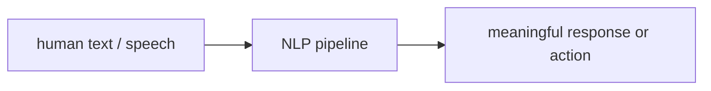
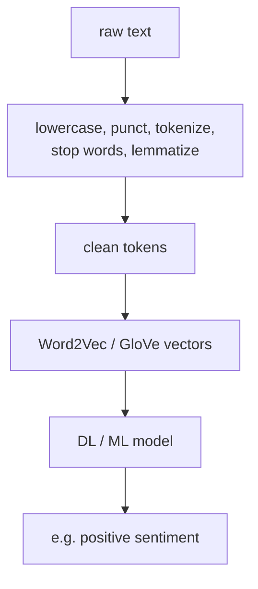
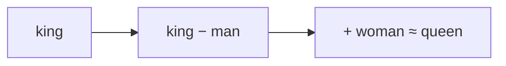

# L54: Foundations of natural language processing

**Video:** [Lec 54](https://www.youtube.com/watch?v=xPba29DZ0wI) · 32:03  
**Instructor in this lecture:** Prof. Ashwini Kodipalli

### Learning objectives

- Define NLP as mapping human language to something a model can compute, then to an action.
- Walk the pipeline: **raw text → preprocessing → numerical representation → model**.
- Tokenize at word / sentence / **subword** / character granularity; apply stop-word removal and **lemmatization**.
- Contrast **Word2Vec** (local windows, king–queen arithmetic) with **GloVe** (co-occurrence matrix).
- List NLP challenges that motivate **sequential** models in Lec 55 (especially **long-range dependency**).

### Agenda (as stated in lecture)

Introduction → applications → NLP pipeline → text preprocessing → tokenization → stop-word removal → lemmatization → text representations (**Word2Vec**, **GloVe**) → challenges.

**BERT / GPT contextual embeddings** are named and **deferred** until transformers. Traditional one-hot / bag-of-words / TF–IDF are mentioned and **not** developed.

---

## What NLP is

NLP is technology that lets computers **interpret, manipulate, and comprehend human language**. Speech or text is hard for a machine in raw form; NLP turns it into a representation deep models can use, then into a **response or action**.

### Input → output → action (lecture table)

| Input | Output | Action / task |
|-------|--------|----------------|
| “Is this email spam?” | Yes | **Spam detection** |
| “The movie was amazing” | Positive | **Sentiment analysis** |
| “Hello” | “Hola” | **Machine translation** |
| “What is generative AI?” | A definition paragraph | **Question answering** |

Whenever a computer processes, understands, or **generates** human-like language, NLP is at work. Named application list: **chatbots**, translation, QA, **summarization**, spam, sentiment — and more.

---

## NLP pipeline

Running example: raw text **“I absolutely love this movie!”**

| Stage | What happens | Example |
|-------|----------------|---------|
| Raw text | User text, or speech converted to text | Full sentence + punctuation |
| **Text preprocessing** | Clean, normalize, drop extras | Content words such as **absolutely / love / movie** |
| **Text representation** | Words → **numerical vectors** (models do not read strings) | Embedding per token |
| Model | Learns patterns from those vectors | Sentiment model |
| Output | Task prediction | **Positive** sentiment |

Preprocessing is described as removing information that is **not needed** so the remaining tokens still encode the sentence’s meaning, at lower compute.

---

## Text preprocessing, step by step

Goal: structured text that models can analyze.

1. **Lowercase** the raw string.  
2. Remove **punctuation and special characters** (little vital information).  
3. **Tokenization** (next section).  
4. **Stop-word removal** — frequent words that add compute without much meaning.  
5. **Lemmatization** — map inflected forms to one **dictionary base (lemma)**.  
6. Result: **clean text**.

**Worked cleaning example.** Raw: “The quick brown foxes are running. Visit https://example.com” plus a smiley and extra punctuation. After preprocessing the lecture keeps the content skeleton **the quick brown fox run** (link, emoji, extras gone; inflected *foxes/running* collapsed).

---

## Tokenization

Split text into smaller units called **tokens**. A token may be a **word**, a **sentence**, a **subword**, or a **character**, depending on the application.

### Word tokenization

Sentence: “I love learning natural language processing.”  
Tokens: `I` | `love` | `learning` | `natural` | `language` | `processing`.

### Sentence tokenization

Paragraph of three sentences (NLP is fascinating / computers understand language / it powers generativity). Each **sentence** is one token.

### Subword tokenization

Word **unbelievable** split into subword pieces (lecture: *un* / *believe* / *able* style pieces). Used in modern LLMs such as **BERT** and **GPT** (details later).

### Character tokenization

Word **NLP** → `N`, `L`, `P`.

**Why tokenize:** raw text becomes smaller units so models can process human language at all.

---

## Stop-word removal

**Stop words:** very frequent items such as **the, is, are, of, and**. They rarely add extra semantics but still become tokens, embeddings, and matmuls — **noise + cost**.

Example: “The students are learning natural language processing”  
→ **students learning natural language processing** (*the*, *are* dropped).

---

## Lemmatization

Convert a word to its **base / dictionary form (lemma)** while keeping meaning.

| Original | Lemma |
|----------|--------|
| running | **run** |
| studies | **study** |
| children | **child** |
| better | **good** (*good / better / best*) |

**Why:** many surface forms share one semantic core (*better/best* → *good*; plural *children* → *child*). After this stage the string is still **text** — representation is next.

---

## Text representation

Machines need **numbers**. Traditional methods (one-hot, bag of words, TF–IDF) are skipped. This lecture’s **modern** slice:

| Family | Methods | This course |
|--------|---------|-------------|
| **Word embeddings** | **Word2Vec**, **GloVe** | Taught now |
| **Contextual embeddings** | **BERT**, **GPT** | After transformers |

Vectors should carry **semantic fingerprints** of the words.

### Word2Vec

**Core idea:** learn from **local context windows**. Vector **length and direction** store meaning.

Classic geometry (origin, 2-D sketch): vectors for **king, queen, man, woman**. Parallelogram / vector arithmetic:

- $\overrightarrow{\text{king}}-\overrightarrow{\text{man}}$ ≈ **male royalty**  
- $(\overrightarrow{\text{king}}-\overrightarrow{\text{man}})+\overrightarrow{\text{woman}} \approx \overrightarrow{\text{queen}}$  

Gender / royalty relations are **linear** in the embedding space. That is the point of Word2Vec in this lecture — not a full skip-gram derivation.

### GloVe

**Core idea:** words that **often occur together** in a large corpus (e.g. **hot** and **coffee**) tend to be semantically related. Learn **dense** embeddings from a **word–word co-occurrence matrix**.

Lecture toy matrix over {king, queen, man, woman} (counts are illustrative):

|  | king | queen | man | woman |
|--|-----:|------:|----:|------:|
| **king** | 0 | 120 | 250 | (low / 80 in the symmetric reading) |
| **queen** | 120 | 0 | 75 | 240 |
| **man** | 250 | 75 | 0 | 110 |
| **woman** | 80 | 240 | 110 | 0 |

Diagonal self-pairs are **0** in the sketch. **High co-occurrence ⇒ stronger semantic relation**; those statistics become GloVe vectors.

---

## Challenges in NLP

| Challenge | Lecture example |
|-----------|-----------------|
| **Discrete** text | *sky* vs *stars*, *red* vs *pink* — relatedness is not obvious from the string |
| **Evolving** language | New dictionary words (lecture: **rizz**) with **no** training corpus |
| **Ambiguity / vagueness** | “Never tasted a pizza like this before” — positive **or** negative |
| **Long-range dependency** | “Animals do not cross the road as it was **tired** or **wide**” — *tired* must bind to *animal*, *wide* to *road* |

Capturing long-range links is called out as **especially important**. It is why the **next** lecture is sequential modeling with **RNNs and LSTMs** (memory of the past).

---

### Key takeaways

- NLP turns language into **clean tokens**, then **vectors**, then a task output (spam, sentiment, translation, QA, …).  
- Preprocessing: lowercase, strip punct, **tokenize**, drop stop words, **lemmatize**.  
- Word2Vec: local windows + vector arithmetic (king − man + woman ≈ queen).  
- GloVe: **co-occurrence** counts → dense embeddings.  
- Discrete, drifting, ambiguous language plus **long-range** binding still break bag-of-features thinking — hence sequence models next. Contextual BERT/GPT embeddings wait for the transformer week.

---
