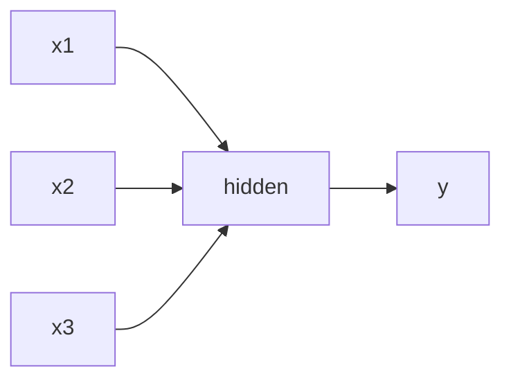
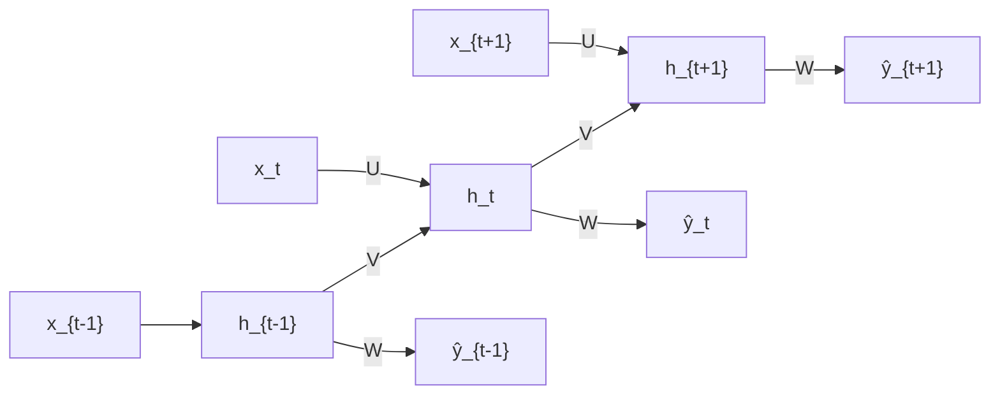
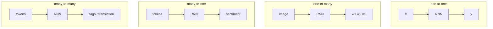
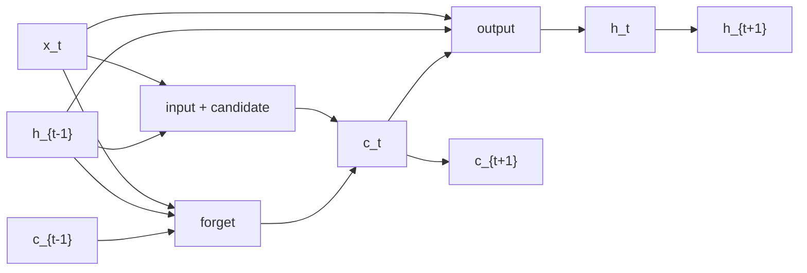

# L55: Sequential modeling with RNNs and LSTM

**Video:** [Lec 55](https://www.youtube.com/watch?v=omPaHVk9hrM) · 38:40  
**Instructor in this lecture:** Prof. Ashwini Kodipalli

### Learning objectives

- Motivate sequence models from **word order** (“dog bites man” vs “man bites dog”).
- Distinguish **short-term** vs **long-term** temporal dependence.
- Write the RNN **hidden-state** and **output** updates; map **one-to-one / one-to-many / many-to-one / many-to-many**.
- Explain **vanishing / exploding** gradients and **BPTT** as why vanilla RNNs fail on long gaps.
- Walk LSTM **forget, input, output** gates and the **cell state** highway.

### Agenda (as stated in lecture)

Why sequence models → temporal dependencies → RNNs (architecture + math) → types of RNN → limitations → LSTMs → gates and cell states.

Transformers are **previewed only** as the next video (Lec 56).

---

## Why sequential models

Most real-world language has **inherent order**. Moving a word changes meaning.

| Sentence | Meaning |
|----------|---------|
| The dog bites man | Dog is the biter |
| Man bites dog | Same words, **different** event |

NLP so far (Lec 54): text → **tokens** → **embeddings**. Missing piece: process those vectors **without scrambling order**.

Applications that need order:

- **Next-word prediction** — meaning of previous tokens.  
- **Sentence classification** — e.g. “I love pizza” → positive sentiment.  
- **Translation** (English → German / French / …).

That motivation produced **RNNs** and **LSTMs**.

---

## Temporal dependency

**Temporal dependency:** what a token means depends on **when** (in the sequence) it appears.

### Short-term

“The movie is **not good**.”  
*Good* is flipped by the immediately preceding **not**. Swap to “the movie is good” and sentiment flips. Dependence on the **just previous** word = **short-term**.

### Long-term

“I grew up in **France**. I speak fluent \_\_\_.”  
Most probable fill-in: **French**. *French* relates to *France* with **three** intervening words. The model must **remember earlier** information. That gap is **long-term dependency**.

(If many words sit between two related tokens — 3, 4, 5, 6, … — it is long-term.)

---

## Why a feedforward net is not enough

In a feedforward MLP, information flows **one way**: $x_1,x_2,\ldots$ → hidden layer(s) → output. There is **no memory of previous inputs**. Sequential modeling needs that memory → **recurrent** nets.

No recurrent arrow: previous $x$ is not stored.

---

## Recurrent neural networks

**Core idea:** do **not** discard the previous token; **carry it forward** in a **hidden state**. The hidden state is the network’s **working memory**.

### Unrolled picture

Time steps $t-1$, $t$, $t+1$. Inputs $x_{t-1}, x_t, x_{t+1}$ are successive words (lecture: “I love pizza” / “I love machine learning”).

| Matrix | Connects |
|--------|----------|
| $U$ | Input $x_t$ → hidden $h_t$ |
| $V$ | **Recurrent:** previous hidden $h_{t-1}$ → current $h_t$ |
| $W$ | Hidden $h_t$ → output $\hat{y}_t$ |

$U,V,W$ are **shared across all time steps**.

### Hidden-state update

At each $t$, $h_t$ mixes **current input** $x_t$ and **previous memory** $h_{t-1}$:

$$
h_t = \tanh\!\bigl( V h_{t-1} + U x_t + b_h \bigr)
$$

$b_h$ = hidden bias. If $h_t$ is not updated every step, the **immediately preceding** word is lost.

### Output

$$
\hat{y}_t = g(W h_t + b_y)
$$

$g$ depends on the task: **softmax** for multiclass, **sigmoid** for binary. $b_y$ = output bias.

---

## Types of RNN (by input/output arity)

| Pattern | Shape | Lecture application |
|---------|--------|---------------------|
| **One-to-one** | One in, one out | Binary classification (cat vs dog image) — **no** real sequence |
| **One-to-many** | One in, many outs | **Image captioning** (one photo → “sunset near the river”) |
| **Many-to-one** | Many in, one out | **Sentiment** (“I love pizza” → positive) |
| **Many-to-many** | Many in, many outs | **Translation**; **POS tagging** (“I play cricket” → pronoun / verb / noun) |

---

## Limitation: long-term memory dies

Example: “My brother lives in **France** and I visit him every summer which is why I understand **French** quite well.”  
*France* and *French* are separated by **11** words. The signal must pass $h_1,\ldots,h_{11}$. Information **weakens** along that chain. Vanilla RNNs **cannot handle long-term dependency**.

### Vanishing and exploding gradients

Training uses **backpropagation through time (BPTT)** — backprop unrolled over the sequence. A small gradient multiplied along many steps **vanishes**; a large one **explodes** (unstable training). That is why RNNs fail on long gaps.

---

## LSTM: add a long-term cell

**Long short-term memory** keeps RNN-style **working memory** (hidden state: recent word) **and** a **cell state** that carries important information **across many steps**.

Gates are **learnable** (small nets). Each learns how much to **retain, update, or expose**.

| Gate | Job |
|------|-----|
| **Forget** | How much of $c_{t-1}$ to keep vs erase |
| **Input** | How much **new** candidate content to write |
| **Output** | How much of the cell to expose as $h_t$ |

Lecture chain: three LSTM cells at $t-1$, $t$, $t+1$. From the previous cell: **cell** $c_{t-1}$ and **hidden** $h_{t-1}$.

### Forget gate

Concatenate $h_{t-1}$ and $x_t$, then sigmoid:

$$
f_t = \sigma\!\bigl( W_f [h_{t-1}, x_t] + b_f \bigr)
$$

$f_t \in (0,1)$: near **1** ≈ keep almost everything; near **0** ≈ forget. Apply to the old cell:

$$
f_t \odot c_{t-1}
$$

(element-wise product).

### Input gate and candidate cell

$$
i_t = \sigma\!\bigl( W_i [h_{t-1}, x_t] + b_i \bigr)
$$

$$
\tilde{c}_t = \tanh\!\bigl( W_c [h_{t-1}, x_t] + b_c \bigr)
$$

$\tilde{c}_t$ = **new information** proposed from the current input. Mix:

$$
i_t \odot \tilde{c}_t
$$

**New cell state** (forget old + write new):

$$
c_t = f_t \odot c_{t-1} + i_t \odot \tilde{c}_t
$$

### Output gate

$$
o_t = \sigma\!\bigl( W_o [h_{t-1}, x_t] + b_o \bigr)
$$

$$
h_t = o_t \odot \tanh(c_t)
$$

$c_t$ and $h_t$ both pass to time $t+1$; the same gates run again.

$W_f,W_i,W_c,W_o$ and $b_f,b_i,b_c,b_o$ are the gate / candidate parameters.

---

### Key takeaways

- Order is meaning: same bag of words, different sequence, different sentence.  
- Feedforward nets have **no** sequential memory; RNNs store it in $h_t = \tanh(V h_{t-1}+U x_t+b_h)$.  
- RNN patterns match captioning, sentiment, translation / tagging.  
- Long gaps + BPTT → **vanishing / exploding** gradients.  
- LSTM adds **cell state** $c_t$ and three gates so memory can survive many steps.  
- **Still not enough** when dependencies are *very* long → **transformers / attention** in Lec 56.

---
