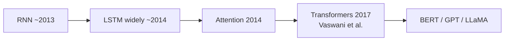
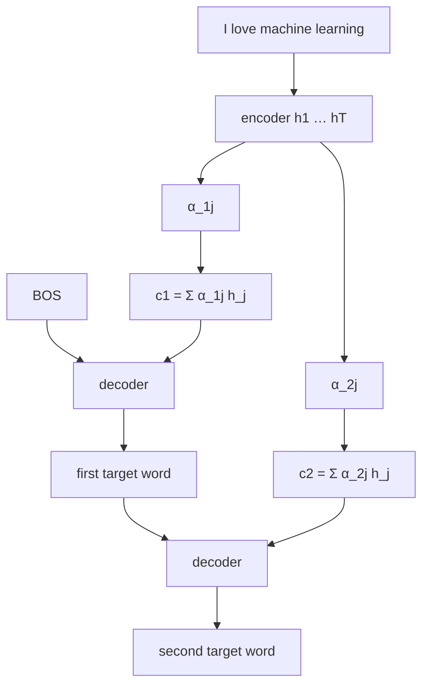
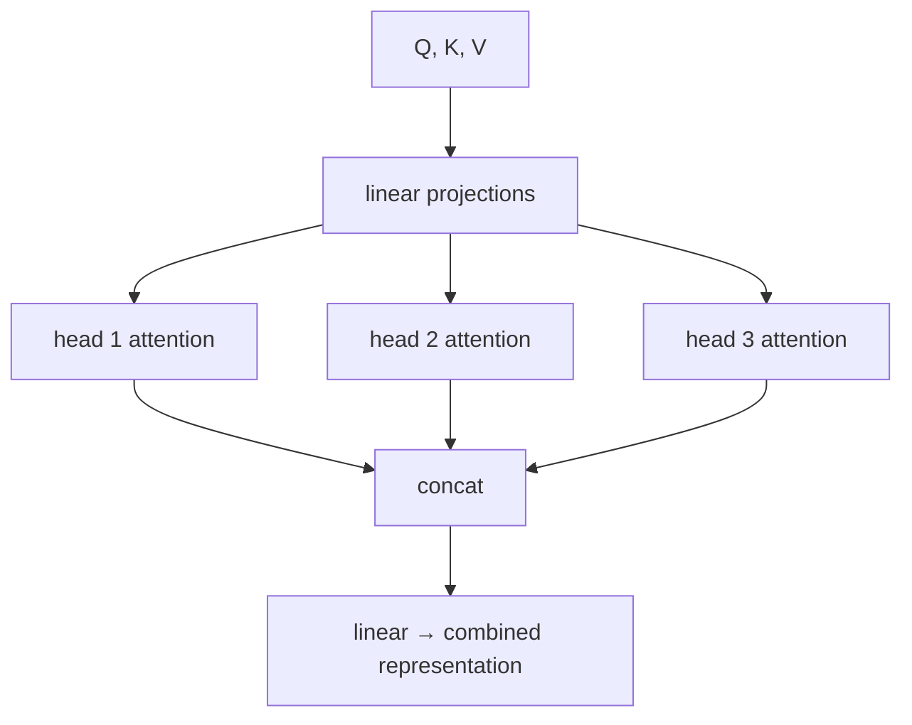
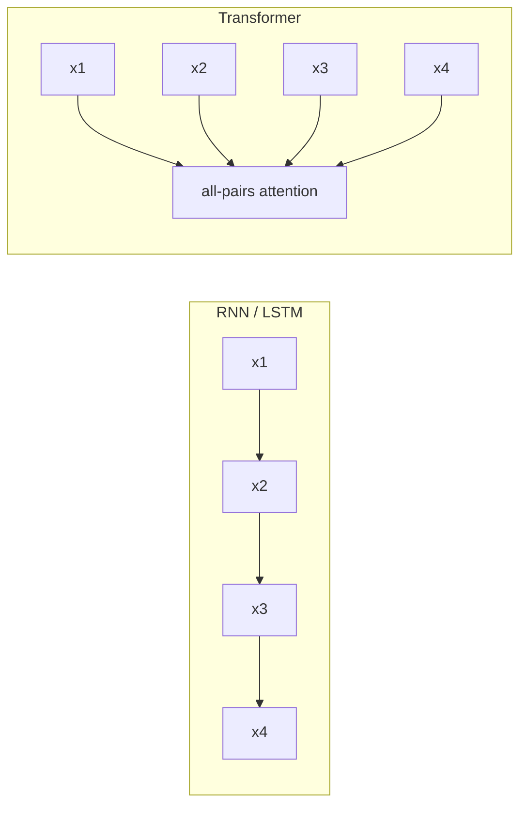

# L56: Evolution from LSTMs to transformers

**Video:** [Lec 56](https://www.youtube.com/watch?v=PkK0LcbqPXM) · 42:27  
**Instructor in this lecture:** Prof. Ashwini Kodipalli

### Learning objectives

- Place RNN → LSTM → **attention (2014)** → **transformers (2017)** on the lecture’s timeline.
- Explain why recurrence is expensive for long documents ($O(n)$ sequential steps, memory of every $h_t$).
- Define **encoder–decoder attention** (context $c_t=\sum_j \alpha_{tj}h_j$) and **self-attention** ($Q,K,V$).
- Motivate **multi-head** attention and **causal masks** ($-\infty$ → softmax $0$).
- Contrast RNN/LSTM vs transformers: sequential vs **parallel**, hidden state vs **direct** token links.

### Agenda (as stated in lecture)

Evolution of sequence models → limits of RNN/LSTM → attention → encoder–decoder attention → self-attention → multi-head → masked self-attention → introduction to transformers → RNN/LSTM vs transformers.

**Full transformer block diagrams** (encoder stacks, FFN, residuals) are **next lecture**, not this one. Read *Attention Is All You Need* as assigned homework.

---

## Timeline (as taught)

| When | What |
|------|------|
| ~2013 | **RNNs** in wide NLP use |
| 1997 / adopted ~2014 | **LSTMs** (Hochreiter & Schmidhuber 1997; popular after 2014) |
| **2014** | **Attention** (the ingredient transformers will rest on) |
| **2017** | **Transformers** — NLP landscape changes; leads to **BERT, GPT, LLaMA**, … |

The rest of the lecture is: which RNN/LSTM failures attention + parallel processing fix.

---

## Limits of RNN and LSTM (why attention)

**Example 1.** “The **book** that I brought yesterday from the new bookstore **is** amazing.”  
*Is* agrees with *book*. A recurrent model must thread that link through a **chain of hidden states**

$$
h_t = \tanh(V h_{t-1} + U x_t + b_h)
$$

(same recurrence as Lec 55).

**Example 2.** “The **quick brown** fox” — understanding *brown* requires having processed *quick*; each word still has its own $h_t$.

Two costs:

1. **Memory:** the machine must **hold the sequence of hidden states** so the start of a sentence is still available at the end.  
2. **Long-range path length:** information between distant words travels **$\mathcal{O}(n)$ sequential steps**. A **1,000-word** sequence ⇒ **1,000** sequential operations to carry a token from the front to the back (a paragraph whose first line must bind to a later line). That is slow and fragile for RNNs **and** LSTMs.

---

## Attention: not all hidden states are equal

When predicting a word, do we need **every** previous $h_t$ **equally**? **No.** Nearby words may be almost irrelevant; **relevant** words should get **higher attention weight**.

**Example.** “The **animal** didn’t cross the street because **it** was too tired.”  
*It* refers to **animal**, not *street*. *Didn’t / cross / street / because* should not all share equal weight with *animal*.

**Idea:** replace uniform memory with an **attention score** over the sequence.

---

## Encoder–decoder attention

### Encoder–decoder without attention (baseline)

Encoder compresses the **input sequence** into a single **thought vector**; the decoder generates the output **word by word** from that bottleneck.

### With attention

Encoder (RNN/LSTM, possibly bidirectional) produces hidden states $h_1,\ldots,h_T$ for the source, e.g. **“I love machine learning.”**

Attention weights $\alpha_{tj}$: how much to use encoder state $h_j$ when emitting **decoder step** $t$.

First output step uses context

$$
c_1 = \sum_{j=1}^{T} \alpha_{1j}\, h_j
$$

In general

$$
c_t = \sum_{j=1}^{T} \alpha_{tj}\, h_j
$$

$\alpha_{tj}$ = attention on the **$j$-th input word** (via $h_j$) while generating the **$t$-th output word**.

**Translation setting in the lecture:** English source on the encoder; decoder emits **German** one token at a time. Four source words ⇒ four contexts $c_1,\ldots,c_4$ for four target words (spoken German pieces: *ich*, *liebe*, … plus an EOS).

**Decoder loop:**

1. Start-of-sentence token + $c_1$ → first target word.  
2. That word **plus** $c_2$ → second word.  
3. Repeat; last step emits **end-of-sequence**.

Attention here is **between encoder inputs and decoder outputs** (cross-sequence).

---

## Self-attention

**Attention** is the umbrella. **Self-attention:** **every word learns from every other word** in the *same* sequence (“I love machine learning” — *I* from *love*, *love* from *machine*, … all pairs).

Each token is projected to three vectors: **query, key, value**.

### Toy embeddings

Sentence **“I love generative AI.”** Tokens have embedding vectors $x_1,\ldots,x_4$ (lecture uses made-up numbers). Then

$$
Q = X W_Q,\qquad
K = X W_K,\qquad
V = X W_V
$$

$W_Q,W_K,W_V$ are learned. **Attention (must-remember equation):**

$$
\mathrm{Attention}(Q,K,V)
= \mathrm{softmax}\!\left(\frac{Q K^{\top}}{\sqrt{d_k}}\right) V
$$

$d_k$ = key dimension.

| Vector | Informal job (lecture) |
|--------|-------------------------|
| **Query** | What am I looking for? |
| **Key** | What information do I contain? |
| **Value** | What should I pass forward? |

---

## Multi-head attention

One head ≈ **one dominant** relation at a time. Real sentences have **several** linguistic links at once.

**Example.** “The **scientist** published the **paper** because **she** **completed** the **experiment** successfully.”

- *paper*–*published*  
- *experiment*–*completed*  
- *scientist*–*completed*  
- *scientist*–*she*  

**Core idea:** different heads learn **different** relations **in parallel** (e.g. head 1 grammar, head 2 semantics, head 3 syntax).

**Block (as drawn):**

1. $Q,K,V$ into **linear** layers — different weights = **different views** of the same sentence.  
2. **Projection** per head: one $(Q,K,V)$ triple per head.  
3. Each head: $\mathrm{softmax}(QK^{\top}/\sqrt{d_k})V$.  
4. **Concatenate** head outputs into one feature vector.  
5. Final **linear** mix → one representation.

---

## Masked self-attention

**Mask** = hide the future. Needed when the **decoder** emits **one word at a time** (English → French: “I am a student” → *je suis un étudiant*). The source may be seen at once; the **target** must not peek at tokens **after** the current position.

**Rule:** when predicting a token, attend only to **past tokens and itself**, **never** to future tokens.

### Attention matrix

Tokens e.g. **I / love / deep / learning**.

- **Unmasked:** every pair has a score.  
- **Masked:** future positions are **$-\infty$**.  
  - After only “I”, scores involving later words are $-\infty$.  
  - After “I love”, the last two keys are $-\infty$.  
  - Full sequence: all scores allowed.

**Why $-\infty$:** softmax

$$
\mathrm{softmax}(z)_i = \frac{e^{z_i}}{\sum_j e^{z_j}}, \qquad e^{-\infty}=0
$$

so future tokens get **zero** attention weight.

---

## Transformers (introduction only)

**2017 landmark:** Vaswani et al., *Attention Is All You Need*, **Google Brain**. Two pillars:

1. **Attention** (self-attention, multi-head, encoder–decoder attention).  
2. **Parallel processing** — not one-token-after-another recurrence.

Architecture internals: **next session**. Assigned: actually **read the paper**.

### RNN / LSTM vs transformers

| RNN / LSTM | Transformers |
|------------|----------------|
| Read tokens **sequentially** | Look at **all tokens at once** |
| **Hidden states** carry memory | **Attention connects tokens directly** |
| **Hard to parallelize** | **Highly parallelizable** |
| Slow training on long sequences | **Faster** training |
| Long-distance information **weakens** | Long distance handled **efficiently** |

**Core transformer idea (lecture):** instead of reading one word after another, **look at all the words simultaneously**.

---

### Key takeaways

- Recurrence forces **$O(n)$** hops and a stack of hidden states; long documents (paragraph-scale) become expensive and forgetful.  
- Attention **reweights** encoder states (or tokens) so *it* can lock onto *animal*, not the whole sentence equally.  
- Self-attention: $Q,K,V$ from the **same** sequence; multi-head = several relations at once; **masks** implement causal decoding.  
- Transformers (2017) combine attention with **parallel** reads of the whole sequence — the reason they replace LSTMs as the default sequence backbone. Next lecture: **transformer architecture** in detail.

---
