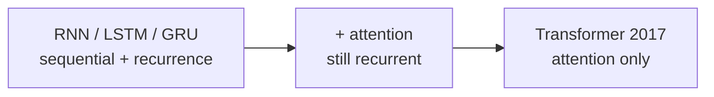
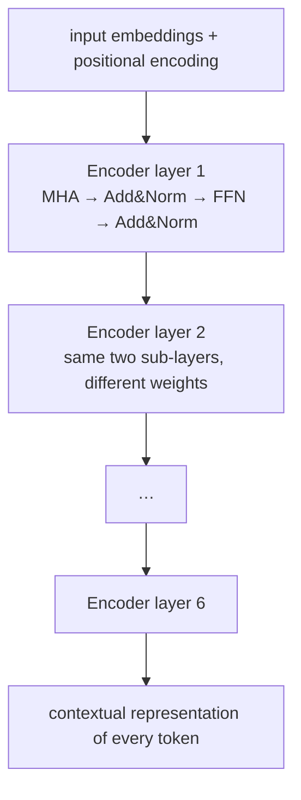
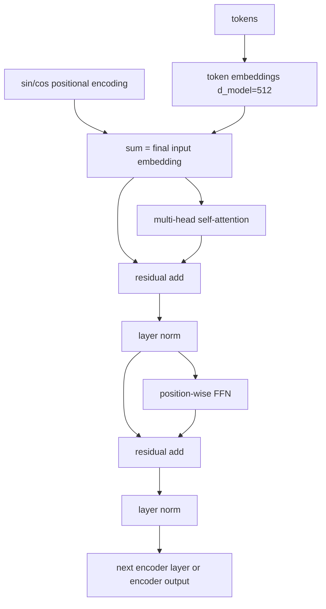

# L57: Transformer architecture — encoder

**Video:** [Lec 57](https://www.youtube.com/watch?v=PBBWBo7OL3M) · 39:35

### Learning objectives

- State why RNNs, LSTMs, and GRUs motivated the 2017 transformer: sequential compute, hard parallelization, and remaining recurrence after attention.
- Describe the encoder as **six identical stacked layers**, each with **multi-head self-attention** and a **position-wise feed-forward network**.
- Explain why **sinusoidal positional encodings** are added to token embeddings when every token is processed at once.
- Compute a $d_{\text{model}}=4$ positional encoding for the token *sat* in “the cat sat on the mat.”
- Write residual + layer-norm and the two-linear ReLU FFN used in the original paper.

### Agenda (as stated)

1. Motivation for transformers  
2. Introduction to the transformer (encoder vs decoder)  
3. Function of encoder and decoder  
4. Positional encoding, with one numerical example  
5. Encoder architecture  
6. Residual connections and layer normalization  
7. Position-wise feed-forward network  

Decoder details are the **next** lecture.

---

## Motivation: what sequence models still could not do

RNNs, LSTMs, and GRUs are **sequence-to-sequence** models: an input sequence in, an output sequence out. They capture **some** long-term dependency, but the lecture lists three hard limits:

| Limitation | What happens |
|------------|----------------|
| **Sequential computation** | Word 1, then 2, then 3, … Training is slow. |
| **Hard to parallelize** | Later tokens wait on earlier hidden states; many operations cannot run together. |
| **Very long-range dependency** | LSTMs help, but words many sentences apart are still a problem. |

**Attention** (previous lecture) improved seq2seq by weighting the *relevant* past words for the next prediction, instead of treating every past word equally. Recurrence was still there: a hidden state remembers the previous word, that word depends on the one before it, and so on. Scientists asked whether **recurrence could be removed entirely**.

**Vaswani et al., 2017, *Attention Is All You Need***: transformers based **only on attention**, eliminating **recurrence and convolutions**.

---

## Encoder + decoder; six stacked encoder layers

A transformer has two parts: **encoder** and **decoder**. This lecture is the encoder.

The original paper stacks **six encoder layers** (layer 1 … layer 6). Architecture is **the same** in every layer; **learned weights differ**. Stacking is what builds a **deeper understanding** of the sentence.

Each encoder layer has **two sub-layers**:

1. **Multi-head self-attention**
2. **Position-wise feed-forward network (FFN)**

---

## Function of encoder vs decoder (English → German)

Running example: **translate English to German**.

| Block | Job |
|-------|-----|
| **Encoder** | **Understand** the English input. Process **all input tokens simultaneously**. Emit a **contextual representation** of every token. |
| **Decoder** | **Generate** the German translation. At **inference**, it does **not** emit all words at once: **one word at a time**. |

At each decoder step the model uses:

- words it has **already generated**, and  
- the **encoder’s** contextual representations,

then predicts the **next** German word.

---

## Why positional encoding exists

In an RNN/LSTM, words arrive **one after another**. Hidden states carry previous-word information, so the model **naturally knows order**. Example: *the cat sat on the mat* — *the*, then *cat*, then *sat*, …

In the transformer encoder, **all words are processed simultaneously**. Each token has a vector embedding, but **order is lost** if those embeddings are fed in as a bag. **Positional encoding injects order**: a fingerprint of where the token sits. It is **added** to the token embedding to form the vector that actually enters the encoder.

Original $d_{\text{model}} = 512$. Even dimensions use **sine**, odd dimensions **cosine**:

$$
\mathrm{PE}_{(\mathrm{pos},\,2i)} = \sin\left(\frac{\mathrm{pos}}{10000^{2i/d_{\mathrm{model}}}}\right)
$$

$$
\mathrm{PE}_{(\mathrm{pos},\,2i+1)} = \cos\left(\frac{\mathrm{pos}}{10000^{2i/d_{\mathrm{model}}}}\right)
$$

- $\mathrm{pos}$: token position in the sentence (0-based in the numerical).  
- $i$: dimension index (pairs even/odd coordinates).  
- $d_{\text{model}}$: embedding / model width.

---

## Numerical example: $d_{\text{model}}=4$, token *sat*

The lecture uses $d_{\text{model}}=4$ so the arithmetic is small (the paper’s 512 would be huge). Sentence:

> the cat sat on the mat

Positions $\mathrm{pos} = 0,1,2,3,4,5$. **$\mathrm{pos}=2$** is *sat*.

### $i=0$ (coordinates $2i=0$ and $2i+1=1$)

$$
\mathrm{PE}_{(2,0)} = \sin(2 / 10000^{0}) = \sin 2 = 0.9093
$$

$$
\mathrm{PE}_{(2,1)} = \cos(2 / 10000^{0}) = \cos 2 = -0.4161
$$

### $i=1$ (coordinates $2$ and $3$)

$2i/d_{\text{model}} = 2/4 = 1/2$, so $10000^{1/2}=100$:

$$
\mathrm{PE}_{(2,2)} = \sin(2/100) = \sin 0.02 = 0.0200
$$

$$
\mathrm{PE}_{(2,3)} = \cos(2/100) = \cos 0.02 = 0.9998
$$

**Positional vector for *sat*:**

$$
\mathrm{PE}_2 = \bigl[0.9093,\; -0.4161,\; 0.0200,\; 0.9998\bigr]
$$

If the token embedding of *sat* is $[X_1,X_2,X_3,X_4]$, the **final embedding** into the transformer is the sum:

$$
\bigl[0.9093+X_1,\; -0.4161+X_2,\; 0.0200+X_3,\; 0.9998+X_4\bigr]
$$

*Mat* at the **end** of the sentence gets a different PE from *the* at the **start** — that is the order fingerprint.

---

## Encoder block, in order

1. **Input sequence** → **input embeddings**: tokens to continuous vectors of width $d_{\text{model}}=512$ in the paper.  
2. **Add positional encoding** (relative / absolute position).  
3. **Multi-head self-attention**: look at the same sentence from several **perspectives** in parallel — semantic, syntactic, structural. More heads → richer relations. Tokens attend to **different parts of the same sequence** at once.  
4. **Add & Norm**: residual **add** of the sub-layer input to its output, then **layer normalization**. Stabilizes training.  
5. **Position-wise FFN**: after attention, learn **richer, more complex** token features.  
6. **Add & Norm** again (residual around the FFN).  
7. Repeat this block $N$ times ($N=6$ in the paper). The slide’s $N\times$ is that stack.

---

## Residual connections and layer normalization

Let $x$ be the word embedding **plus** positional encoding. A **sub-layer** (multi-head attention, or later the FFN) maps $x$ to $\mathrm{Sublayer}(x)$. Residual:

$$
\mathrm{LayerNorm}\bigl(x + \mathrm{Sublayer}(x)\bigr)
$$

**Why add $x$ back?** Sub-layer operations can **change the representation fully**. Important information can disappear. The skip **preserves the original representation**.

**Why layer-norm?** Neuron outputs sit on **different scales**. Normalization **stabilizes activations**, improves optimization, and **makes training faster / more stable**.

---

## Position-wise feed-forward network

After multi-head attention (and Add & Norm), each token is transformed **independently** by the **same** FFN. That is why it is **position-wise**: if the input words are $w_1,\ldots,w_T$, each token’s vector goes through **its own application** of one shared FFN (not one giant mix across positions at this step).

Inside the FFN, **two linear maps** with **ReLU** between them. Paper sizes:

| Stage | Width |
|-------|------:|
| Input | $512$ |
| After first linear | $2048$ (expand) |
| ReLU | $2048$ |
| After second linear | $512$ (project back) |

$$
\mathrm{FFN}(x) = \max\bigl(0,\; xW_1 + b_1\bigr)\,W_2 + b_2
$$

$W_1,b_1$ first linear; $\max(0,\cdot)$ is ReLU; $W_2,b_2$ second linear. The expansion is meant to learn a **richer** representation after attention has mixed context.

---

### Key takeaways

- Seq2seq recurrence made training slow, blocked parallelization, and still struggled with **very** long range; *Attention Is All You Need* (2017) dropped recurrence and convolutions.
- The encoder is **six identical layers** (different weights): multi-head self-attention + position-wise FFN, each wrapped in residual Add & Norm.
- Encoder **understands** all input tokens at once; decoder **generates** one token at a time from past outputs **and** encoder context (English→German).
- Simultaneous encoding loses order, so **sinusoidal PE** is added to embeddings; even dims sine, odd dims cosine.
- Residual $x+\mathrm{Sublayer}(x)$ keeps information from being wiped; layer-norm stabilizes training; FFN is $512\to 2048\to\mathrm{ReLU}\to 512$.

---
