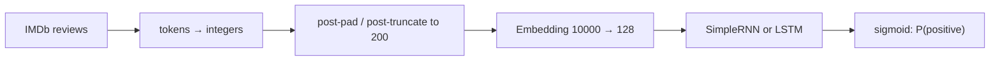
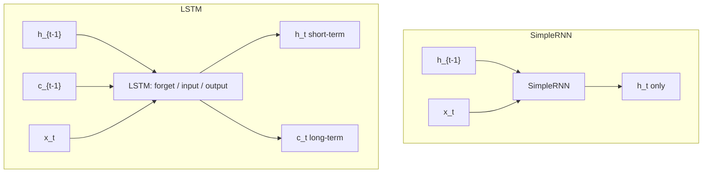

# L58: Practical exercise 1 — RNN vs LSTM sentiment classification

**Video:** [Lec 58](https://www.youtube.com/watch?v=doc237ORyxc) · 48:27

### Learning objectives

- Implement **binary sentiment classification** on **IMDb** with a **SimpleRNN** and an **LSTM** in TensorFlow / Keras.
- Pad / truncate reviews to a fixed length with **post-padding** and **post-truncation**.
- Compare validation accuracy/loss, test accuracy, and confusion matrices.
- Inspect **LSTM hidden-state** heatmaps (tanh activations) and decode two test reviews.

### What this lecture is *not*

Despite sitting after the encoder theory video, this Colab is **not** a transformer implementation. It is **RNN vs LSTM on movie reviews**. The decoder-only transformer from scratch is **Lec 63**.

---

## Task and dataset

**Sentiment classification** on text: sequential / time-series style data, so the lecture uses networks with **memory** (RNN, LSTM).

**IMDb** (Internet Movie Database): movie reviews (also mentioned: actor information, web series / serials). Keras `imdb` load:

| Split | Reviews |
|-------|--------:|
| Train | 25,000 |
| Test | 25,000 |
| Total | 50,000 |

Labels: **positive = 1**, **negative = 0**.

Limits (full unique vocabulary would be expensive; the lecture mentions the raw set can be on the order of 50k–100k words):

| Parameter | Value | Why |
|-----------|------:|-----|
| `vocab_size` / `num_words` | **10,000** | Unique words kept; rest treated as unknown later |
| `maxlen` | **200** | Networks need a **fixed** input length |



---

## 1. Imports and TensorFlow version

| Import | Role in this lab |
|--------|------------------|
| `numpy` as `np` | Arrays |
| `matplotlib.pyplot` as `plt` | Plots |
| `tensorflow` as `tf` | Deep learning |
| `imdb` from `tensorflow.keras.datasets` | Reviews |
| `pad_sequences` from `tensorflow.keras.preprocessing.sequence` | Padding |
| Layers: `Input`, `Embedding`, `SimpleRNN`, `LSTM`, `Dense`, `Dropout`, `GlobalAveragePooling1D` | Architecture |
| `Model` from `tensorflow.keras.models` | Functional-style model from inputs/outputs |
| `accuracy_score`, `confusion_matrix`, `ConfusionMatrixDisplay`, `classification_report` from sklearn | Metrics |

Print **TensorFlow version** (lab shows **2.20**) so LSTM-layer options can be adjusted if needed.

---

## 2. Load IMDb

```text
(x_train, y_train), (x_test, y_test) = imdb.load_data(num_words=vocab_size)
```

Print lengths: 25,000 train, 25,000 test.

---

## 3. Padding (pre-processing)

Reviews are **variable length**. Pad train and test to `maxlen=200` with **`padding='post'`** and **`truncating='post'`**.

Shapes after padding: `x_train` and `x_test` are **(25000, 200)**.

### Mini-example from the slides

Positive review (label 1): *The movie was interesting. Actors acted well.* — **7** words.  
Negative review (label 0): *movie was boring … climax was dull … I did not like the movie* — **15** words.

If `maxlen=20`:

- 7-word review → **13** zeros **after** the words (post-pad).  
- 15-word review → **5** zeros after.

**Pre-padding** would put zeros first, then the sentence. The lecture prefers **post-padding**: real tokens come first, so **activation is more likely early**; trailing zeros do not fire neurons.

Pipeline named in the talk:

1. **Tokenization** — sentence → words.  
2. **Integer encoding** — e.g. *the* → 3, *movie* → 10.  
3. **Dense vectors** — embedding layer turns those integers into features (128-d in the models below).

---

## 4. SimpleRNN model

1. **Input** shape `(maxlen,)` = 200.  
2. **Embedding**: `input_dim=10000`, `output_dim=128`.  
3. **SimpleRNN**: **64** units (compress 128-d embeddings; named `rnn_layer`). The lecture’s story: different hidden units specialize (positive words, negative words, pairwise relations, adjectives, …).  
4. **Dense(1, sigmoid)** — binary classification.

Threshold:

- predicted $p > 0.5$ → **positive**  
- $p \le 0.5$ → **negative**

**Compile:** optimizer **Adam**, loss **binary cross-entropy**, metric **accuracy**.

**Fit:** `x_train`, `y_train`; **10 epochs**; **batch size 64**; **`validation_split=0.2`**.

### What to observe (RNN)

At epoch 10: **validation accuracy ≈ 50%**, **validation loss ≈ 1.26**.  
RNN has **one** hidden state, **vanishing gradients**, weak **long-term** (and “future word”) dependency — text is sequential. Bidirectional LSTM is mentioned as a type that can use future context; this lab’s RNN does not.

**Test:** `model.predict(x_test)`, threshold 0.5. **RNN test accuracy ≈ 50%.**

### RNN confusion matrix (as read off the plot)

|  | Predicted 0 (neg) | Predicted 1 (pos) |
|--|------------------:|------------------:|
| **True 0** | 8,846 | 3,654 |
| **True 1** | 8,828 | 3,672 |

Correct ≈ $8846+3672$; errors ≈ $3654+8828$ — about half right.

---

## 5. LSTM model

Same skeleton, extra capacity and regularization:

1. **Input** `(200,)`.  
2. **Embedding** 10,000 → 128 (named `embedding_layer`).  
3. **LSTM(64, `return_sequences=True`)** so the sequence of hidden states is kept (dependency along the review). Named `lstm_layer`.  
4. **GlobalAveragePooling1D** — average the 64-d states over the 200 positions into **one** vector (one representation for backprop).  
5. **Dropout(0.5)** — drop 50% of units.  
6. **Dense(1, sigmoid)**.

Same compile and fit as RNN (Adam, BCE, accuracy; 10 epochs, batch 64, val split 20%) so the comparison is fair.

### What to observe (LSTM)

End of epoch 10: **validation accuracy ≈ 84.82%**, **validation loss ≈ 0.77** (below 1, unlike RNN).  
**Test accuracy ≈ 82%.** Confusion matrix: true counts **above ~10,000**, errors **around 4,000**.

### Why LSTM beats this RNN (as drawn)

RNN: previous hidden state + current word → SimpleRNN → **one** new hidden state.

LSTM: previous **hidden** state **and** previous **cell** state + current word, with three gates:

| Gate | Role in the lecture |
|------|---------------------|
| **Forget** | How much to drop vs pass on |
| **Input** | What to write into the cell |
| **Output** | What to emit as hidden state |

Hidden state ≈ **short-term**; cell state ≈ **long-term**. Together: **Long Short-Term Memory**.



---

## 6. Validation curves

Figure **8×5** inches.

**Validation accuracy vs epoch**

- RNN: `'o'` markers, label “simple RNN”  
- LSTM: square markers, label “LSTM”  
- *x*: epoch (0–10); *y*: validation accuracy; grid on; legend  

**Observe:** LSTM around **82–85%**; RNN around **50%**.

**Validation loss vs epoch** — same markers. LSTM loss stays lower (orange in the demo); RNN loss **rises** and stays higher.

---

## 7. Hidden-state probe (LSTM)

Build a second model with the **same input** as the LSTM but **output = `lstm_model.get_layer('lstm_layer').output`** — stop before GAP / Dense.

Take **one** test review: `x_test[0:1]`. Hidden-state shape: **`(1, 200, 64)`** — 1 sample, 200 word positions, 64 units.

**Heatmap:** `imshow` of the **transpose** so **rows = hidden units**, **columns = word position**. Colormap **viridis**. Values in **$[-1,1]$** because LSTM uses **tanh**.

Color reading from the lecture:

| Color | Activation |
|-------|------------|
| Purple | Negative |
| Yellow | Strong positive |
| Green / blue | Little / none |

**Observe on sample 0:**

- Positions ~0–20: mostly green/blue, activations roughly **−0.2 to 0.2** (still picking up the start).  
- ~20–60: mixed colors — the **middle of the review** is where learning varies.  
- After ~60–75: **constant** stripes (all purple, all green, …) because **post-padding zeros** remain; neurons do not keep changing on zeros.

### Three hidden units vs word position

Plot units 0, 1, 2 on the same sample: *x* = word position 0–200, *y* = activation. Learning until ~70–75, then **flat**. Sign flips: a “positive-word” unit goes **> 0.5** on positive tokens and **drops** on negative ones.

---

## 8. Predict and reverse-decode two reviews

LSTM + sigmoid; threshold 0.5.

| Index | $p$ | Predicted |
|------:|----:|-----------|
| `x_test[0]` | **0.01** | negative |
| `x_test[20]` | **0.99** | positive |

Reverse mapping uses `imdb.get_word_index()`, then a dictionary that also maps special ids:

| Id | Meaning in the decode helper |
|---:|------------------------------|
| 0 | padding |
| 1 | start of sequence |
| 2 | **UNK** — word outside the 10k vocab (raw IMDb is described as ~80k unique words) |
| 3 | unused |

Decoded **sample 0** (negative, matches the score): starts with start-token, *please give this one a miss*, some **UNK**, *the rest of the cast render **terrible** performance*, *the show is **flat flat flat***.

Decoded **sample 20** (positive): *this film was one that I have waited to see for some time … everything anticipated … writing … so finely crafted*.

---

### Key takeaways

- IMDb 25k/25k, vocab **10k**, length **200**, **post-pad**; Embedding **128**, recurrent **64**, sigmoid + **Adam** + **BCE**, 10 epochs, batch 64, 20% validation.
- SimpleRNN stuck near **50%**; LSTM near **85% val / 82% test** because of **forget / input / output** gates and a **cell state**.
- Hidden-state heatmaps show tanh activity on real tokens, then **constant** rows on **padding**.
- This exercise is **sentiment RNNs**, not a transformer; transformer training/inference is Lec 63.

---
