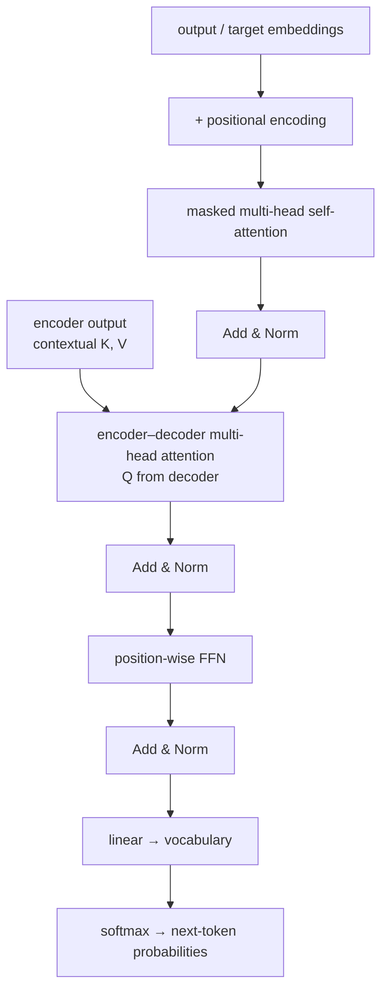
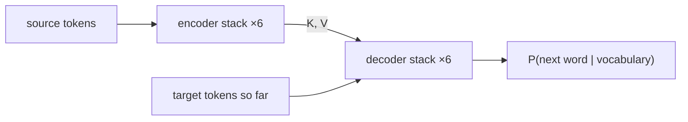

# L59: Transformer architecture — decoder

**Video:** [Lec 59](https://www.youtube.com/watch?v=if65zXEwIKI) · 35:20

### Learning objectives

- List the decoder’s **three** sub-layers and why the encoder only needed two.
- Explain **masked** multi-head attention vs **encoder–decoder** attention ($Q$ from decoder, $K,V$ from encoder).
- Reconstruct **BPE** (frequency) vs **WordPiece** (likelihood) as the pre-processing step before embeddings.
- Recall the **WMT 2014** En–De / En–Fr training setup and transformer **advantages vs quadratic cost**.

### Agenda (as stated)

Decoder architecture and sub-layers; encoder–decoder connection; subword tokenization (BPE, WordPiece); training of the transformer; advantages and limitations. Encoder internals were Lec 57.

---

## Six decoder layers, three sub-layers each

Same stacking idea as the encoder: **decoder layers 1–6**, identical structure, different weights. Encoder layers had **two** sub-layers; each decoder layer has **three**:

1. **Masked multi-head (self-)attention**  
2. **Encoder–decoder multi-head attention**  
3. **Position-wise feed-forward network**

Each is followed by **Add & Norm** (residual + layer-norm), as in the encoder.

---

## Information flow

**Output embeddings** (not the source sentence) enter the decoder. At inference, **already generated tokens** are fed back as this input. Add **positional encoding**, then:

### Masked multi-head attention

When predicting the next word, the model **must not see future** target tokens. **Masking** lets each target token attend **only to previously generated** tokens (and itself). Same idea in **training**: future positions in the gold target are hidden.

### Add & Norm

$\mathrm{LayerNorm}(x + \mathrm{Sublayer}(x))$: residual keeps the original input; normalization **stabilizes training** (same story as the encoder).

### Encoder–decoder attention

The decoder must **read the encoder’s output** — the contextual understanding of the **input** (English, in the running translation example). This second attention is **multi-head cross-attention**:

- **Queries $Q$** from the **decoder**  
- **Keys $K$ and values $V$** from the **encoder**

Scaled-dot attention (as written in the lecture; $d$ = key dimension):

$$
\mathrm{Attention}(Q,K,V) = \mathrm{softmax}\!\left(\frac{QK^{\top}}{\sqrt{d}}\right) V
$$

Heads run in parallel, then **concatenate**. The decoder can put weight on **relevant encoder positions** while predicting the next German token.

### Position-wise FFN

Same as the encoder: **two linear layers**, **ReLU** between them; each token independently; expand then project back. With $x$ the token vector:

$$
\mathrm{FFN}(x) = \max(0,\, xW_1 + b_1)\, W_2 + b_2
$$

### Linear + softmax

The last decoder output is mapped to **vocabulary logits**, then **softmax** → a distribution over **every** vocab word. The next token is the word with **maximum** probability. Stacking $N=6$ decoder layers (paper) deepens that prediction.

English → German reminder: encoder consumes **all English tokens at once**; decoder emits **one German word at a time**.

---

## Why the extra sub-layer?

| Side | Job | Attention it needs |
|------|-----|--------------------|
| **Encoder** | Only **understand** the input | Self-attention over the source + FFN (**two** sub-layers) |
| **Decoder** | **Two** jobs | (1) Look at **already generated** words → **masked** self-attention. (2) Attend to **encoder** context → **cross-attention**. Then FFN. |

Without cross-attention the decoder would generate without looking at the source representation; without masking it would **cheat** by seeing future target words.

---

## How many heads?

Inside **one** attention sub-layer, heads are **parallel**, not separate stacked sub-layers.

| Model (as stated) | Heads |
|-------------------|------:|
| Original transformer | **8** |
| Transformer **big** | **16** |

---

## Full transformer (encoder hooked to decoder)

One encoder layer: embeddings + PE → multi-head **self**-attention → Add & Norm → position-wise FFN → Add & Norm.  
One decoder layer: target embeddings + PE → **masked** MHA → Add & Norm → **encoder–decoder** MHA (encoder output enters **here**) → Add & Norm → FFN → Add & Norm → linear → softmax.

$N\times$ stacks; paper: **six encoders and six decoders**.

---

## Subword tokenization (pre-processing)

Transformers do not ingest raw characters as the only unit. **Subword tokenization** splits text into **smaller meaningful pieces**, which become embeddings. Two methods in this lecture:

| Method | Merge / split rule |
|--------|--------------------|
| **Byte-pair encoding (BPE)** | Merge the **most frequent** character (then subword) pairs |
| **WordPiece** | Break using **likelihood** of pieces occurring together |

**Why subwords?** Handle **rare / unseen** words. If the model knows *cyber* and *security*, it can compose **cybersecurity**. Smaller **reusable** pieces → smaller vocab → less memory.

### BPE walk-through (corpus: *low*, *lower*, *newer*)

1. Split into characters: `l o w`, `l o w e r`, … (the board also tracks *lowest*-style forms).  
2. Most frequent pair is **`l`+`o`** → merge to **`lo`**.  
3. Next frequent continuation is **`w`** after `lo` → **`low`**.  
4. Write the corpus with the merged piece: *low*, *low er*, *low est*, *new er*.  
5. Store **`er`**, **`est`**, **`new`** as pieces. You do **not** need a separate full-word *newer* if *new*+*er* compose it.

**Learned vocabulary stores subwords, not only whole words.**

### WordPiece examples

Vocabulary pieces such as *play*, *##ing*, *##ed*, *##er* (the `##` means “continuation, not a new word”).

| Word | Pieces |
|------|--------|
| playing | play + ##ing |
| played | play + ##ed |
| player | play + ##er |
| microscope | micro + scope |
| unhappiness | un + happiness |

**BPE merges by frequency; WordPiece chooses merges by likelihood.**

---

## Training the original transformer

| Dataset | Size (as stated) | Subword method |
|---------|------------------|----------------|
| **WMT 2014 English–German** | ≈ **4.5 million** sentence pairs (also said ~4.1M) | **BPE** |
| **WMT 2014 English–French** | ≈ **36 million** sentence pairs | **WordPiece** |

A sentence pair is source + translation (English sentence $i$ with German/French sentence $i$).

---

## Advantages and limitations

**Advantages**

- **Parallel** computation  
- Better **long-range** dependency modeling  
- **Scalable**; state-of-the-art  
- Foundation of modern LLMs (**BERT**, **GPT** — next lectures)

**Limitations**

- **High memory**  
- **Quadratic** attention: $n$ tokens → on the order of $n^2$ pairwise operations  
- Needs **large** datasets  
- **Computationally expensive**

---

### Key takeaways

- Decoder layer = **masked self-attention** + **encoder–decoder attention** ($Q$ decoder, $K,V$ encoder) + **FFN**, each with residual Add & Norm; **six** layers in the paper.
- Masking stops future-target leakage; cross-attention injects source context; softmax over the vocab emits the next word.
- Extra sub-layer exists because generation has **two** look-ups (past outputs **and** encoder).
- BPE (frequency) and WordPiece (likelihood) shrink vocab and handle unknowns (*cyber*+*security*).
- Trained on WMT 2014 En–De (~4.5M, BPE) and En–Fr (~36M, WordPiece); pay **$O(n^2)$** attention cost.

---
