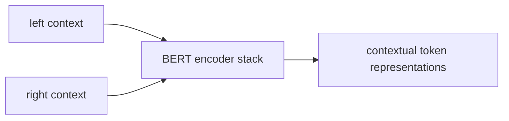
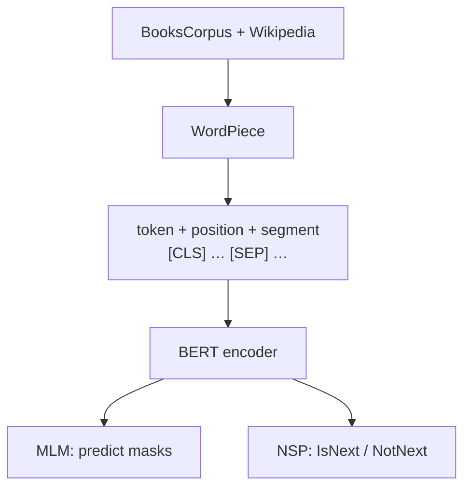

# L60: BERT

**Video:** [Lec 60](https://www.youtube.com/watch?v=tXCsSH5MJUI) · 42:39

### Learning objectives

- Contrast BERT with **static** embeddings (Word2Vec / GloVe) and **left-to-right** LMs using the lecture’s *bank* and *movie was —* examples.
- Explain why BERT is **encoder-only**: **understand** language, not generate long text.
- Describe the two pre-training tasks **MLM** and **NSP**, including the **15% / 80–10–10** masking recipe.
- Trace input construction: **token + segment + position** embeddings, `[CLS]`, `[SEP]`.
- Distinguish **self-supervised pre-training** from **supervised fine-tuning**, and name the BERT **variants** listed in class.

### Agenda (as stated)

Motivation; what BERT is; why encoder only; pre-training vs fine-tuning; MLM and NSP; pipelines; variants. GPT is the **next** lecture.

---

## Motivation: four limits of earlier LMs

### 1. Static embeddings (Word2Vec / GloVe)

> I deposited money in the **bank**.  
> The children played near the **bank** of the river.

Financial *bank* vs river *bank* got the **same** vector. **Context** was missing.

### 2. Left-to-right processing

> The movie was ——

Both *good* (positive) and *bad* (negative) are possible. A left-to-right model **ignores words that appear later**, so sentiment can be under-determined until the end — and those later tokens were not used when scoring the blank.

### 3. Poor very-long-range understanding

RNNs/LSTMs struggle to link word 2 with word 10 in a long sequence. LSTMs helped; **very** long range stayed hard.

### 4. One model per task

Sentiment analysis, question answering, **NER** (named entity recognition) each needed a **separately trained** model.

These gaps motivated **BERT**.

---

## What BERT is

**Bidirectional Encoder Representations from Transformers.** Pre-trained deep LM from **Google (2018)**; paper (Devlin et al.): *Pre-training of Deep Bidirectional Transformers for Language Understanding* (existence 2018, published **2019**).

Built **only on the transformer encoder** (not the decoder). It reads **left and right** at once. Example: *the cat sat on the mat* is used from both directions so beginning **and** end context are available.

### Language model (working definition here)

An LM learns a **probability distribution over word sequences**. Given a prefix (or a blank), it scores the **vocabulary**; the highest-scoring word fills the slot. Traditional LMs do **next-word prediction** after training on **billions** of text examples (statistical patterns and relations). BERT’s pre-training objective is **not** that left-to-right next word — it is **masked** prediction (below).

---

## Why encoder only? Understand, do not generate

BERT’s primary goal is **language understanding**, not paragraph **generation**. Applications listed:

| Task | Input (lecture) | Output |
|------|-----------------|--------|
| **Sentiment** | *I absolutely love this movie.* | **positive** (one label, not a sentence) |
| **NER** | *Dr. Joan visited Ames Hospital on August 1st, 2025.* | person / organization / date |
| **QA** | Paragraph: *Paris is the capital of France.* Q: *What is the capital of France?* | **Paris** |
| **Text classification** | (same idea) | class label |

None of these require **writing a full generated sentence**. Encoder contextualization is enough.

---

## Pre-training vs fine-tuning (two-stage LMs)

Modern LMs (BERT, GPT) train in **two stages**. School analogy:

| Stage | School analogy | Data | What is learned |
|-------|----------------|------|-----------------|
| **Pre-training** | KG through class 12: many subjects | **Massive unlabeled** corpus | Grammar, word relations, general language |
| **Fine-tuning** | Medical school: specialize | **Smaller labeled** set | One NLP task (e.g. news-topic classification) |

Fine-tuning takes the **same** pre-trained net and trains it further until it is an **expert** at that task.

---

## Pre-training is self-supervised: two tasks

No human labels on the raw corpus. Two objectives on **unlabeled** text.

### Masked language modeling (MLM)

Traditional LMs: *the cat sat on the ——* → *mat* (left-to-right only).  
BERT: **randomly mask** tokens and predict them from **both** sides.

Original: *the boy is **playing** football.*  
Input: *the boy is **[MASK]** football.*  
Target: *playing*.

**Masking strategy (original paper):** randomly select **15%** of tokens. Of those selected:

| Fraction of the 15% | Replacement |
|--------------------:|-------------|
| **80%** | `[MASK]` token |
| **10%** | a **random** word |
| **10%** | **left unchanged** |

**Why not always `[MASK]`?** At inference / fine-tuning the `[MASK]` token often **does not appear**. Training only on `[MASK]` would **mismatch** pre-training and later use. Random replacements and unchanged tokens reduce that gap. MLM yields **contextual** word representations.

### Next sentence prediction (NSP)

Needed for QA, NLI, document retrieval: **relation between two sentences**.

| Sentence A | Sentence B | Label |
|------------|------------|-------|
| Rahul went to the grocery store. | He bought some milk. | **IsNext** |
| Rahul went to the grocery store. | Eiffel Tower is in Paris. | **NotNext** |

During pre-training: **50%** true consecutive pairs, **50%** random **NotNext**. BERT learns **sentence-level** relations (paragraphs are sequences of sentences).

---

## Pre-training pipeline and input construction

**Data:** **BooksCorpus + Wikipedia** (plus “other relevant documents” as a catch-all).  
**Tokenizer:** **WordPiece**.  
Then **input construction** → BERT → **MLM + NSP** → pre-trained BERT.

The vector that enters BERT is the **sum** of three embeddings:

| Embedding | Role |
|-----------|------|
| **Token** | WordPiece piece vectors |
| **Position** | Order (same idea as transformer PE) |
| **Segment** | Sentence **A** vs sentence **B** ($E_A$ vs $E_B$ in the paper figure) |

Special tokens (paper figure *my dog is cute* / *he likes playing*):

- **`[CLS]`** at the **start**. Its **final** embedding is the **sequence representation** for **classification**.  
- **`[SEP]`** **between** sentences and at the end.

---

## Fine-tuning pipeline

Adapt pre-trained BERT to one NLP task (sentiment, QA, NER, …).

1. Take **pre-trained** BERT (MLM + NSP).  
2. Add a **small task-specific output layer** (e.g. linear) on top.  
3. Train **BERT + new layer together** on **labeled** data (**supervised**).  

Weights are **updated**, not trained **from scratch**. Pre-training still matters: you start from a language-aware initialization.

**Takeaway:** one pre-trained body; **swap the last layers** for different tasks. Pre-training = self-supervised; fine-tuning = supervised.

**QA fine-tune (paper figure):** question tokens + context paragraph, `[CLS]` / `[SEP]`. Heads predict the **start and end span** of the answer. Other heads in the figure: NER, MultiNLI, etc. **Dotted arrows** = copy pre-trained weights into the fine-tune graph.

---

## Variants named in lecture

| Variant | What the lecture says it changes |
|---------|----------------------------------|
| **RoBERTa** | Robustly optimized BERT: **drops NSP**, more data, larger batches, **dynamic masking** |
| **ALBERT** | “A lite BERT”: **parameter sharing** → smaller model / memory, performance kept high |
| **DistilBERT** | Compressed BERT: faster, smaller, about **95%** of BERT’s performance with fewer parameters |
| **ELECTRA** | Efficiently Learning an Encoder that Classifies Token Replacements Accurately: **detect replaced tokens** instead of predicting masks; stronger results with **less** compute |

Closing ask: **read the original BERT paper** for architecture details not expanded on the slides.

---

### Key takeaways

- Static *bank* vectors and left-to-right LMs miss context; BERT is a **bidirectional encoder** LM (Google / Devlin et al.).
- Encoder-only because target tasks need **labels and short answers**, not free generation.
- Pre-train **MLM** (15% selected; 80% `[MASK]`, 10% random, 10% unchanged) and **NSP** (50/50 IsNext) on BooksCorpus + Wikipedia with WordPiece.
- Input = token + position + segment; `[CLS]` for classification; fine-tune with a small head on labeled data.
- Variants: RoBERTa, ALBERT, DistilBERT, ELECTRA — still BERT-family encoders, not GPT.

---
