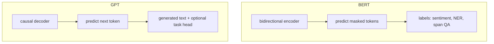
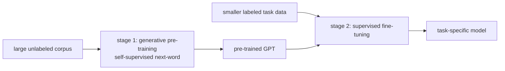

# L61: GPT — decoder-only large language model

**Video:** [Lec 61](https://www.youtube.com/watch?v=_zH-VPjiHfM) · 40:53

### Learning objectives

- Contrast **BERT (encoder, understanding, MLM)** with **GPT (decoder, generation, next-token)** as taught in this pair of lectures.
- Explain **causal / masked self-attention** and why a **bidirectional encoder cannot** generate without **information leakage**.
- Walk the **autoregressive** loop on *The capital of France is … Eiffel Tower*.
- Describe GPT’s **pre-train (unlabeled next-word) → supervised fine-tune** framework and the **decoder-only** block (no encoder–decoder attention).
- List GPT-1 vs GPT-2 scale numbers and the **limitations** named here (including **hallucination**). Prompt recipes are Lec 62 — not this video.

### Agenda (as stated)

Evolution of GPT; need for GPT-1; why decoder-only; autoregressive generation; learning framework; architecture; what “large language model” means; limitations.

---

## Evolution (timeline as stated)

| Year (lecture) | Model |
|----------------|--------|
| 2018 | **GPT-1** (same year as BERT) |
| 2019 | **GPT-2** |
| 2020 | **GPT-3** |
| 2022 | **GPT-3.5** |
| 2023 | **GPT-4** |
| 2024 | **GPT-4o** |
| 2025 | **GPT-5**, and the lecture’s latest mention **GPT-5.6** |

Scale, context, and **multimodal** ability grow along this line. This lecture’s architecture story is still the **decoder-only** GPT-1 design (Radford et al.).

---

## BERT vs GPT (as taught)

Both are 2018 language models; jobs differ.

| | **BERT** | **GPT-1** |
|--|----------|-----------|
| Aim | Language **understanding** | Language **generation** (sentences, paragraphs) |
| Stack | **Encoder-only** transformer | **Decoder-only** transformer |
| Pre-train prediction | **Masked** token (both sides): *the boy is **[MASK]** football* → *playing* | **Next** token (left context only) |

---

## Why GPT-1 was built

Older NLP systems needed **labeled** data (scarce) and a **separate model per task** (expensive).

**OpenAI**, **Radford** et al., paper: *Improving Language Understanding by Generative Pre-Training* (2018).

**Key idea**

1. **Pre-train one** model on **large unlabeled** text with **next-word prediction** (**self-supervised** — no extra labels).  
2. **Fine-tune the same** model on downstream tasks (sentiment, NLI, QA, …) instead of training a new net from scratch.

---

## Why decoder-only?

Encoder **understands**; decoder **generates**. Generation is **predict the next word from words already seen** — that is the decoder’s job in the original transformer.

GPT generates **one token at a time** (**autoregressive** next-token prediction) and uses **causal masked self-attention** so the model **cannot see future** words.

Example of the mask: given *the cat sat on the ——*, the model has seen *the cat sat on the* and must **not** see *mat* or later sentences (*the cat is jumping above the wall*, …).

### Why not generate with an encoder?

The transformer **encoder** uses **bidirectional** attention: every word attends to **every** other word (no causal mask). If you tried to generate *mat* in *the cat sat on the mat*, the encoder could already have **attended to *mat* from the right**. That is **information leakage**. Causal masking is **incompatible** with full bidirectional attention. Hence **encoders are not used for text generation** in this design.

---

## Autoregressive generation (worked prompt)

Start: *The capital of France is*

| Input so far | Predicted next |
|--------------|----------------|
| The capital of France is | **Paris** |
| … is Paris | **.** |
| … Paris. | **It** |
| … It | **is** |
| … is | **known** |
| … known | **for** |
| … for | **the** |
| … the | **Eiffel** |
| … Eiffel | **Tower** |

Final: *The capital of France is Paris. It is known for the Eiffel Tower.*  
Each new token is **appended** to the context; then the model predicts again. That loop is **autoregressive text generation**.

---

## Learning framework

**Pre-training** learns grammar, semantics, and **reasoning / “what follows what”** patterns.

Examples of the next-word task (repeated **billions** of times):

- Input: *the earth revolves around the sun* → target last word **sun**  
- *Artificial intelligence is transforming ——* → **industries**

The model absorbs **statistical structure**: grammar, vocabulary, context, long-range dependency.

**Fine-tuning:** labeled data for a domain (sports QA, education QA, …). **Update pre-trained weights**; do **not** train from scratch (saves time and compute). Tasks named: text classification, QA, NLI, semantic similarity. Few extra **task-specific** layers.

---

## Decoder-only architecture (paper figure)

**12 decoder layers.** Input: **token + position** embeddings.

Inside a block (as drawn): **masked multi-head self-attention** → **layer-norm** → **feed-forward** → **layer-norm**, with **skip / residual** connections.

**Missing vs the original transformer decoder:** there is **no encoder**, so there is **no encoder–decoder cross-attention**. Only **causal** self-attention (hide future tokens).

Two heads on the figure:

- **Text / next-token prediction** = **pre-training** objective.  
- **Task classifier** = **downstream** fine-tune (linear layers on transformed inputs).

### Downstream input layouts (paper)

**Start** token = beginning of sequence. **Extract** (end) token: its **final hidden state** is used for prediction. **Delimiter** = separator between two texts.

| Task | How the sequence is packed | Output idea |
|------|----------------------------|-------------|
| **Classification** | start + text + extract → transformer → **linear** | e.g. positive / negative |
| **Entailment** | start + **premise** + delimiter + **hypothesis** + extract | entailment / contradiction / **neutral** (need more info) |
| Example | Premise *birds can fly*; hypothesis *sparrows can fly* | **entailment** |
| **Similarity** | start + text1 + delimiter + text2 + extract (order also swapped in the figure) → linear | similar / not |
| **Multiple choice** | context packed with **each** answer option; each pair scored | **highest score** wins |

Those extra **linear** layers are the **fine-tune** heads.

---

## What “large language model” means here

A **transformer** trained on **massive** text with **self-supervised next-token prediction**. **GPT** is one such model. **One** pre-trained net is adapted to many NLP tasks via last-layer heads.

### GPT-1 vs GPT-2 (numbers from the lecture)

Same **decoder-only** net and **next-token** objective; **scale** changes.

| | **GPT-1** | **GPT-2** |
|--|-----------|-----------|
| Parameters | **117 million** | **1.5 billion** |
| Training data | **5 GB** | **40 GB** (high-quality web pages) |
| Context length | **512** tokens | **1024** tokens |
| Vocabulary | **40k** | **50k BPE** |

Later versions grow these further and add **multimodal** paths (text↔image, etc.). Context length keeps increasing.

---

## Limitations of GPT (as listed)

| Issue | Lecture meaning |
|-------|-----------------|
| **Hallucination** | Model **makes up** information and states it **confidently** |
| **Bias** | If training text says leaders are “he” 95% of the time, the model may assume leaders are male |
| **Compute cost** | Training / running is expensive |
| **Context-window limits** | Only so many tokens at once |
| **Prompt sensitivity** | A small prompt change can **drastically** change the output |
| **Knowledge cutoff** (especially **base** models) | Trained through e.g. 2022–23 may not know 2025–26 facts (the lecture notes later products mitigate this) |
| **Safety** | Harmful content if **prompted wrongly** |

Because of **prompt sensitivity**, **prompt engineering** is how we communicate with LLMs so outputs match intent — **next lecture**.

---

### Key takeaways

- GPT-1 (OpenAI / Radford, 2018) is **decoder-only**; BERT is **encoder-only**. GPT predicts the **next** token; BERT predicted **masks**.
- Causal masking enables generation; bidirectional encoder attention would **leak** future tokens.
- Generation is **autoregressive**: append Paris, then `.`, then *It is known for the Eiffel Tower*.
- Pre-train unlabeled next-word (12 decoder blocks, no cross-attention) → fine-tune with small linear heads (classification, entailment, similarity, MCQ).
- GPT-1 → GPT-2: 117M→1.5B parameters, 5→40 GB, 512→1024 context, 40k→50k BPE. Failures named here: hallucination, bias, cost, context, prompts, cutoff, safety — not RAG/ethics weeks.

---
