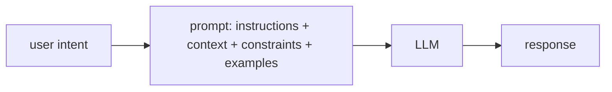
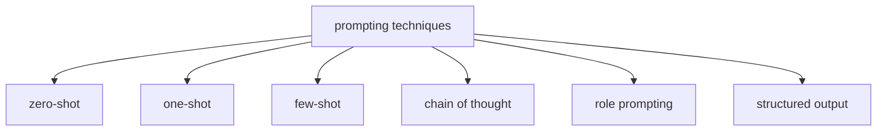

# L62: Prompt engineering basics

**Video:** [Lec 62](https://www.youtube.com/watch?v=DQqRc6ifLFA) · 37:09

### Learning objectives

- Define a **prompt** as the input that **guides** an LLM, and **prompt engineering** as designing that input so the answer matches what you asked for.
- List what a prompt can contain: **instructions, questions, context, constraints, examples**.
- Name the six techniques taught: **zero-shot, one-shot, few-shot, chain-of-thought, role, structured-output**.
- Contrast a **vague** vs **specific** prompt using the *explain machine learning* pair.

### Agenda (as stated)

Concept; why prompts matter; techniques (zero / one / few-shot, chain of thought, structured output, role); applications. This instructor’s **last theory session** in the series; later videos (RAG, etc.) are **other** sessions — not this one.

---

## What a prompt is

You are a user; you want an answer (example: Bangalore weather **ten years ago**). You must **tell the model the question**. That input is the **prompt**.

**Prompt:** input to an AI model that **guides its response**.  
Flow: prompt → LLM → generated response.

**Prompt engineering:** how to write **effective** prompts so the model returns **what you want** — not a dump of extra material, and not too little. **Better prompts → better responses.**

A prompt **may include**:

| Ingredient | Lecture example |
|------------|-----------------|
| **Instructions** | *Summarize this article in **five bullet points*** |
| **Context** | The article itself, pasted in |
| **Questions** | Follow-ups (e.g. weather in Bangalore over five months **from that summary**) |
| **Constraints** | *Avoid rainy season; only summer/winter/…* |
| **Examples** | Demonstrations of the desired pattern |

More clarity in the prompt → the LLM is clearer on the target.

---

## Why prompts matter

| Role of the prompt | What it does |
|--------------------|--------------|
| **Define the task** | Summarization, translation, explanation, classification, QA, **code generation**, … |
| **Provide context** | Background so the situation is understood |
| **Specify the audience** | Explain AI to a **layperson** vs **PhD / research** scholars → **depth** changes |
| **Control format** | Bullets, **table**, code, essay; “three bullet points” vs a long paragraph |
| **Reduce ambiguity** | Task + context + audience + format + extra specifics → fewer misreads |

### Characteristics of a **good** prompt

**Clear and crisp**; **context-rich**; **unambiguous**; **goal-oriented and specific**.

Specificity examples: not “political situation in India,” but **Bangalore, one week before**; not “sports update last 7 days,” but **cricket played by Karnataka cricketers**.

Prehistoric-era questions need **political/social situation** as context first.

### What to **avoid**

| Failure | Effect |
|---------|--------|
| **Vague** instructions | You do not even know what a good answer would be |
| **Missing context** | Model may **hallucinate a context** and answer that |
| **Many unrelated questions** | Weather + politics + sociology in one blob → confused, weaker answer |

**Diabetes example:** paste a **scientific / medical** document (symptoms, treatments) as context, *then* ask symptoms, control, treatments, what patients find hardest. Trustworthy context → more precise answers.

---

## Vague vs specific (machine learning)

**Vague prompt:** *Explain machine learning.*

Possible response: branch of AI; learn from data without being explicitly programmed; supervised / unsupervised / RL; decision trees, neural nets, SVMs. **Problem:** heavy jargon; a **newcomer** cannot use it; may be **too broad / too detailed** vs what you needed (maybe only a high-level picture).

**Specific prompt:** *Explain machine learning to **first-year engineering students** in **150 words**. Use **simple language** and include **one real-world example**.*

Possible response: learn patterns from data and predict without programming every case; **spam filter** trained on thousands of emails, improves with more data; key points: patterns from data, improves with experience; spam, recommenders, image recognition.

**Why better:** matches **audience**, **length**, and **format**.

---

## Techniques (as named)

### Zero-shot

**No examples.** Rely on **instructions in the prompt** + the model’s **pre-trained** knowledge. Prompt = task description only.

> Classify the sentiment as positive, negative, or neutral.  
> *The movie had stunning visuals but the storyline was disappointing.*

Lecture’s model answer: **negative**.

**Typical uses named:** summarization, translation, sentiment, QA, grammar correction.

### One-shot

**One** input–output example so the model sees the **task** and **expected answer**, then a new input.

> *The customer support was excellent.* Sentiment: **positive**.  
> *The laptop battery drains very quickly.* Sentiment: **?**

Expected: **negative**.

**Uses named:** teach a **response format**; keep a **writing style** (e.g. one Shakespeare passage, then “write more like that”); customer labeling; structured outputs.

### Few-shot

**Two to five** examples (format, style, reasoning pattern).

> *I absolutely loved the food.* → positive  
> *The service was very slow.* → negative  
> *The phone had a good camera but poor battery life.* → **?**

**Uses named:** custom text classification, information extraction, domain-specific and **reasoning** tasks, **intent** classification. Customer-care: examples of happy vs angry reviews before classifying a new ticket.

### Chain of thought (CoT)

For **numerical / multi-step** problems. Ask the model to **think step by step**.

> A shop sells a notebook for **$5** and a pen for **$2**. Customer buys **3** notebooks and **4** pens. Calculate the total cost. **Think step by step.**

Lecture’s intended trace:

1. Notebooks: $3\times 5=15$  
2. Pens: $4\times 2=8$  
3. Total: $15+8=\mathbf{23}$

### Role prompting

Assign a **profession / persona**: doctor, nurse, teacher, athlete, nutritionist, musician, artist, …

> You are an **experienced physics professor** teaching **first-year engineering students**. Explain **Newton’s second law** in simple language with **real-life examples**.

Role = physics professor; audience = first-years; task = Newton’s second law; extras = real-world examples.

Intended answer: $F=ma$; empty shopping cart vs **fully loaded** cart (more mass → more force for the same acceleration).

Other roles mentioned: experienced **dietitian / nutritionist** for a one-month plan (muscle, fat, weight).

### Structured-output prompting

Demand a **format**: bullets, **JSON**, summary, essay, **code snippet**.

> Extract information from the paragraph and return a **JSON object**.  
> *John Smith is a data scientist at ABC technologies.*

Fill `name`, … in the requested schema. Same idea: “50-word summary,” “bullet list,” “give me the code.”

---

## Applications of prompt engineering (closing list)

Content generation (including **images / videos** from prompts), **data analysis** (last weeks/months; bar vs pie), **programming assistance**, education, healthcare, customer support, research, document summarization, translation — “every domain” once the prompt is right.

Closing moral: scientific depth vs high-level overview is a **prompt-design** choice. This is the last **prompt-engineering theory** video; the speaker points to later sessions on **RAG and other topics** without teaching them here.

---

### Key takeaways

- A prompt is the **guiding input**; engineering it means instructions + context + constraints + examples so the LLM matches intent.
- Good prompts are clear, contextual, specific, audience- and format-aware; avoid vagueness, missing context (hallucinated background), and unrelated question piles.
- Six named techniques: **zero-shot** (no demos), **one-shot**, **few-shot** (2–5), **chain-of-thought** (step-by-step $5/$2 shop), **role** (physics professor / $F=ma$ cart), **structured output** (JSON / bullets / code).
- *Explain machine learning* vs *150 words, first-years, one example* is the running quality contrast.
- RAG, ethics, and LoRA are **not** in this transcript.

---
