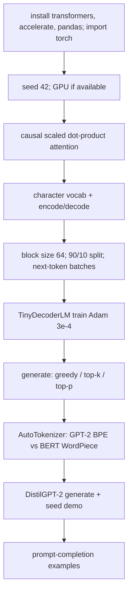

# L63: Hands-on on LLM

**Video:** [Lec 63](https://www.youtube.com/watch?v=V0q393vUcKw) · 32:56  
**Instructor in this lecture:** Debarpan (PhD student, Electrical Engineering; reliable AI and LLMs)

### Learning objectives

- Implement **scaled dot-product attention** with a **causal (triangular) mask** and **next-token** training (input shifted by one).
- Train a **tiny decoder-only** transformer from scratch on a **character** corpus (paragraph × 80).
- Decode with **greedy**, **top-$k$**, and **nucleus (top-$p$)** sampling; see **temperature** and **seed**.
- Compare **character** vs **BPE / WordPiece** on Hugging Face tokenizers; run **DistilGPT-2** as a pretrained **completion** model (not instruction-tuned chat).
- Treat **prompts** as incomplete context. This notebook does **not** implement RAG.

### Lab map

---

## Scope (as announced)

- Next-token prediction and **causal self-attention**  
- Tiny **decoder-only** transformer trained **from scratch** on a toy corpus  
- **Character** tokenization; short **BPE** and **WordPiece** demo  
- Load a small LLM **DistilGPT-2**; generate with **greedy, top-$k$, nucleus / top-$p$**  
- Basic **prompt engineering** as completion  

Theory at full web/Wikipedia scale is only **illustrated** by this scaled-down Colab (notebook to be shared).

---

## 1. Setup

Install a suitable **`transformers`** version, plus **`accelerate`** and **pandas**.

Imports named: `math`, `random`, `numpy`, `pandas`, **PyTorch** utilities.

- **`set_seed(42)`** for reproducibility  
- Check **device**; prefer **GPU** (`cuda`)

---

## 2. Next-token prediction and decoder-only vs full transformer

For tokens $x_1,\ldots,x_T$, a **causal** LM predicts the next token at each position. Training **minimizes cross-entropy** between the predicted distribution and the **true next token**.

A “typical” transformer has encoder **and** decoder. **Decoder-only** LMs are enough **at scale** (large data + large model): the model sees **previous** tokens, predicts the **next**, and **never** sees the future. A **triangular causal mask** is used in **training** as well as inference, because inference will only have the past.

---

## 3. Scaled dot-product attention (single head)

Function of $Q,K,V$ with `causal=True`:

$$
d_k = Q.\mathrm{size}(-1),\qquad
\mathrm{scores} = \frac{QK^{\top}}{\sqrt{d_k}}
$$

If causal: apply an **upper-triangular** mask so future positions cannot attend. Then

$$
\mathrm{weights} = \mathrm{softmax}(\mathrm{scores}),\qquad
\mathrm{out} = \mathrm{weights}\, V
$$

**Sanity check:** random `torch.rand` tensors; print weights — **upper triangle is 0** (mask in place).

---

## 4. Character tokenizer (tiny model)

Advanced LMs split words into **2–3 meaningful subwords**. This tiny net uses **characters**.

1. **Corpus:** one short paragraph (stand-in for “crawl the web / Wikipedia”).  
2. **Repeat it 80 times** so the string is long enough to train.  
3. `chars = sorted(set(corpus))` — unique characters.  
4. Dicts: **stoi** (char → id), **itos** (id → char).  
5. **`encode(text)`:** if any char is **outside** the train vocab, **raise** (cannot process unseen characters); else return integer ids.  
6. **`decode(ids)`:** join characters.  
7. `data = torch.tensor(encode(corpus))`. Print **vocab size** and **token count**.  
8. **Sanity:** encode `"transformer"` then decode → `"transformer"`.

---

## 5. Next-token batches

Target sequence = input **shifted left by one** (standard LM).

| Hyperparameter | Value | Lecture name |
|----------------|------:|--------------|
| **Block size** | **64** | context window (64 **characters** per sample) |
| **Batch size** | 32 (from printed shapes) | independent sequences per step |
| Split | **90%** train / **10%** val | prefix of the token stream vs rest |

`get_batch(split)` returns `x, y` on **device** (GPU if present). Demo shapes: **`x` and `y` are `(32, 64)`**. Example: input starts `m...`; target is the same window **shifted** so the model learns *n-e-x-t* from *next*.

---

## 6. Tiny decoder-only transformer

**Blocks:** token embedding + **learned position** embedding; causal **multi-head self-attention**; **FFN**; **residuals**; **layer-norm**; linear to **vocab logits**.

**No encoder–decoder cross-attention.** A PyTorch **TransformerEncoderLayer**-style block is reused **only** as a self-attention brick; a **causal mask** makes the net **decoder-only**.

Config (as described): `vocab_size`, `block_size`, `d_model`, `n_head`, `n_layer`, `dropout`.

`TinyDecoderLM(nn.Module)`:

- `token_embedding(vocab_size, d_model)`  
- `position_embedding` — **learnable** vector per position  
- `self.blocks` — repeat the transformer block `n_layer` times  
- final `LayerNorm` + **linear** → logits over characters  

**Forward:** ids → embeddings → blocks **with mask** → logits (and loss if targets given).

Instantiate `tiny_model = TinyDecoderLM(config).to(device)`. Pass `x_demo, y_demo`.

**Printed in the demo:**

- Initial loss **≈ 3.613**  
- Trainable parameters **413,987** (captions split this as “413 and 987”)

---

## 7. Train

- `estimate_loss(model, split)`: `model.eval()`, average loss on train or val batches, then `model.train()`.  
- Optimizer: **Adam**, learning rate **$3\times 10^{-4}$**.  
- **Steps:** **400** if CUDA, else **180** (CPU is slow).  
- Loop: every **50** steps, print estimated losses.  
- Standard PyTorch: `optimizer.zero_grad()`, `loss.backward()`, `optimizer.step()`.

**Observe:** train loss **3.623 → 0.161**. **Val loss falls in proportion** (not a pure train overfit). Print wall-clock time. Colab-only in the session.

---

## 8. Decoding modes (tiny model)

At each step the LM scores **every vocab token**.

| Mode | Rule |
|------|------|
| **Greedy** | Always take the **max** probability token. **No stochasticity** — same string every time (seed / temperature do not change it). |
| **Top-$k$** | Keep the **$k$ largest** logits; sample from that set (with temperature, e.g. 1). |
| **Nucleus / top-$p$** | Smallest prefix of the ranked vocab whose probabilities **sum to ≥ $p$** (e.g. **0.9**); sample from that set. |

Helpers: `apply_top_k` (cutoff from the $k$-th logit; mask the rest); `apply_top_p` (cumulative probability).

`generate_tiny(model, prompt, strategy, max_new_tokens, temperature, top_k, top_p)`:

- **Autoregressive** loop; **`max_new_tokens`** caps length.  
- **Temperature 0** ≈ deterministic; **higher** temperature → closer to **uniform** over remaining tokens.  
- Demo defaults: temperature **0.9**, top-$k$ **10**, top-$p$ **0.9**.  
- `model.eval()` — **no grad** at inference.

**Greedy demo text (truncated by max tokens):** starts like *a transformer processes tokens using self attention and feed forward layers. causal attention prevents a token from reading tokens in the future during training…*

**Top-$k$ / nucleus:** may match greedy at first, then **diverge** (e.g. sample a **period** instead of the letter **r**). The tiny model is **intentionally weak**: tiny corpus, **character** tokens, few parameters, a few hundred updates — purpose is **mechanism**, not quality prose.

---

## 9. BPE and WordPiece (Hugging Face)

Character tokens collide across words with different meanings. Production LMs use **WordPiece** / **BPE**.

`AutoTokenizer` from **`transformers`**: GPT-2-style **BPE** vs BERT **WordPiece**. Example strings: *transformer*, *tokenization*, *unbelievable*, *prompt engineering*, …

| String | BPE (lecture) | WordPiece (lecture) |
|--------|---------------|---------------------|
| transformer | trans + former | transform… (pieces as printed) |
| tokenization | one piece in the demo | token + … |
| unbelievable | four pieces: un / believ / … / able | **one** token *unbelievable* |
| prompt engineering | prom / pt / … / engineering | prompt + engineering |

Same idea as Lec 59: subwords, not full-word memory. Suggested **exercise:** larger corpus + these tokenizers (beyond the class toy).

---

## 10. DistilGPT-2 (pretrained completion)

Load **DistilGPT-2**: a **pretrained base completion** model, **not** an instruction-tuned chat assistant.

Course theory: LLMs often have **pre-training** then **instruction tuning** for human-like replies. This demo uses the **base** (no instruction tune).

Contrast with the tiny net: DistilGPT-2 is **much larger** (captions jumble “81 crores / billions”; the **named** Hugging Face checkpoint is DistilGPT-2). Write `generate` with the same strategy arguments as the toy model.

**Observe:** greedy vs top-$k$ vs nucleus **differ**. Stochastic decoding can be **more useful** than a single greedy string. This is **inference**, not RAG.

### Random seed

| Strategy | Change seed 1, 2, 3 |
|----------|---------------------|
| **Greedy** | **Identical** completions (always argmax) |
| **Top-$k$** | Completions **vary** |
| **Nucleus** | Completions **vary** |

---

## 11. Prompt engineering in this notebook

A prompt **conditions** free-running completion: incomplete context; the LM continues.

Tried prefixes (DistilGPT-2):

- *transformers are*  
- *In a beginner machine learning textbook transformers are described as*  
- *three advantages of transformer models are*

**Observe:** completions can be **poor** (*transformers are very scary / dangerous*) — DistilGPT-2 is a small **base** completer. Mechanistically, the prompt is still **context for next-token**.

---

## 12. Suggested extra experiments

Change **`d_model`**, **layers**, **heads** on the tiny LM; **block size**, **temperature**, **top-$k$ / top-$p$**; **larger corpus** and **different tokenizers**. Watch train curves and sample quality.

---

### Key takeaways

- Causal LMs learn **next-token** prediction; **causal masks** block future tokens in train and decode.
- Tokenization is **model-specific**: use the **same** tokenizer at train and inference.
- **Greedy** is deterministic (seed-invariant); **top-$k$** and **nucleus** add **controlled** diversity.
- Prompt wording **shifts** the continuation distribution; a prompt is **unfinished context**, not a separate RAG index.
- Tiny char-LM (block 64, Adam $3\times10^{-4}$, loss ~3.6→0.16) plus DistilGPT-2 decoding is the whole lab — **no RAG, no ethics module**.

---
