# Volume 01 — Deep Learning Foundations for Generative AI

**Intro + Lec 01–09** · Transcript-grounded notes (notes-2)

These notes follow the official NPTEL lecture videos. They are not the condensed 36-lecture mapping in `notes/`.

---

# L00: Course introduction

**Video:** [Intro](https://www.youtube.com/watch?v=9g8BtJMHVwc) · 6:42  
**Speakers in this video:** Prof. Sriram Ganapathy (IISc), Prof. Baishali Garai (RV University), Prof. Ashwini Kodipalli (PES University), plus TAs Tripti and Debarpan

### Learning objectives

- Place the 12-week course in the sequence after *Foundations of Deep Learning*.
- List the week-by-week theory map and the matching hands-on track.

### Who the course is for

Prof. Ganapathy frames this as a follow-on to the earlier NPTEL deep-learning course. It is aimed at **UG and PG students** and **working professionals** who want a foundations-plus-practice path through generative AI and large language models. The offering is a **12-week** NPTEL course with **weekly hands-on sessions** and **monthly live faculty interactions**. It is jointly taught by IISc, RV University, and PES University.

### Why generative AI now

Prof. Garai’s pitch is the shift from *analysis* to *creation*: models that write stories, emails, code, and images in seconds. Industry already uses them for customer support, software development, product design, and mining large corpora. The course’s job is to answer **how these systems actually work**—foundations, mathematics, and algorithms—not only demos.

### Twelve-week theory map

Prof. Kodipalli walks the syllabus in order. This notes-2 set follows the **same order as the videos**, not a condensed 36-lecture remap.

| Weeks | Theory focus |
|------:|--------------|
| 1 | Deep-learning foundations needed for generative models |
| 2 | Autoencoders and representation learning |
| 3–4 | Variational autoencoders, advanced VAEs, applications |
| 5–6 | GANs, important variants, applications |
| 7–8 | Diffusion models |
| 9 | Sequence models (RNN/LSTM) and NLP foundations |
| 10 | LLM foundations and prompt engineering |
| 11 | Retrieval-augmented generation (RAG) |
| 12 | LLM capabilities, multimodal AI, ethics |

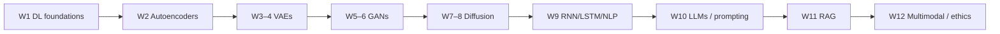

### Hands-on track (Tripti)

The labs are not an afterthought. The announced implementation sequence is:

| Weeks | Labs announced in the intro |
|------:|-----------------------------|
| 1–2 | CNNs, transfer learning, ensemble models, then the **autoencoder** as the first generative model |
| 3–4 | Representation learning: train a **VAE** and a **conditional VAE** |
| 5–6 | Adversarial models: **DCGAN**, **cGAN**, **CycleGAN** |
| 7–8 | Diffusion: simulate **forward** noise, **reverse** denoising, and a **U-Net** |
| 9–10 | Sequence/LLM stack: **RNN**, **LSTM**, **transformer** |

### Later LLM / diffusion labs (Debarpan)

Debarpan’s sessions (later weeks) cover:

- Forward diffusion and reverse denoising
- LLM **inference** and **prompt engineering**
- Multimodal LLMs
- **Hallucinations**, and **RAG** as a way to ground generation

### Key takeaways

- The course is theory *and* weekly coding, from CNN recap through RAG.
- The video order is the authority for these notes: autoencoders → VAEs → GANs → diffusion → sequence models → transformers/LLMs → RAG/ethics.
- Several topics advertised for weeks 11–12 (RAG, multimodal, ethics, hallucinations) appear in this intro; they are expanded only when a later lecture actually teaches them.

---


\newpage

# L01: Introduction to Generative AI

**Video:** [Lec 01](https://www.youtube.com/watch?v=aOQMmjoUglM) · 42:38  
**Instructor in this lecture:** Prof. Ashwini Kodipalli

### Learning objectives

- Contrast discriminative models with generative models using the lecture’s $P(y \mid x)$ vs $P(x)$ / $P(x,y)$ language.
- Explain why **data augmentation** and **oversampling** are not generative modeling.
- Match output type → assumed distribution → activation and loss used in code.
- Locate where a **Gaussian** shows up in VAEs, diffusion, and GANs (preview only).

### Week 1 agenda (as stated in lecture)

This 12-week course covers autoencoders, VAEs, GANs, diffusion, then sequence models (RNN/LSTM) as a foundation for LLMs, then LLMs, RAG, multimodal AI, and ethics—with weekly hands-on.

**Before any of that, week 1 is only deep-learning fundamentals needed for GenAI:**

1. Shift from discriminative learning to generative learning
2. What generative modeling is, and types of generative modeling
3. Probability distributions used in generative models: **Gaussian, Bernoulli, categorical**
4. Applications of generative AI
5. Recap of **loss functions, activations, optimizers**
6. Recap of **CNNs** (later generative architectures reuse the same patterns)
7. Two labs: CNN on a real-world dataset, and an **ensemble** model

---

## Discriminative models we already know

The lecture starts from three familiar families, all treated as **discriminative**:

| Model | Data it fits | Typical tasks |
|-------|----------------|---------------|
| **MLP** | Tabular (CSV / spreadsheet features) | Classification or regression |
| **CNN** | Images | Classification, segmentation, object detection |
| **RNN / LSTM / GRU** | Sequences / time series | “What comes next” (e.g. rainfall tomorrow from 10 days of history) |

In every case the training set is **labeled**: each input $x$ has a target $y$. $x$ may be an image, text embeddings, tabular features, or a time series. $y$ is a numeric value (regression) or a class (classification).

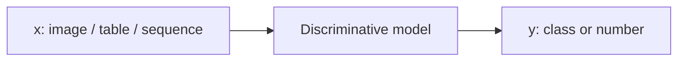

### What “discriminative” means

Discriminative models **learn features that separate classes**. The cat-vs-dog slide is the running example: the model learns cat features vs dog features, using the known label of every training point.

Formally it estimates

$$
P(y \mid x)
$$

—the probability of the label given the input. Example from the lecture: an image scored $0.85$ cat, $0.10$ dog, $0.05$ horse. The model’s job is “which class does this $x$ belong to?”, not “how was this image produced?”.

**Stated drawback:** a discriminative model maps $x \mapsto y$. It **does not learn how the data were generated**.

---

## Why modern deep learning is not only discrimination

The lecture’s turning point: today’s systems are not limited to diagnosis (disease / no disease) or next-value prediction. They **learn the data distribution** so they can emit **new, realistic, statistically similar** samples:

- text prompt → image
- text prompt → paragraph
- damaged / incomplete face → completed image
- noisy data → cleaned reconstruction
- existing samples → newly synthesized samples

The aim is **what new data can be created**, not only which class $x$ belongs to.

---

## Why augmentation and oversampling are not enough

If the only requirement were “more data,” two old tricks come to mind. The lecture rejects both as *generative modeling*.

### Data augmentation

Flip (horizontal/vertical), rotate, zoom, crop, add noise. All of these are **different views of the same image**. They do **not** learn $p_{\text{data}}(x)$. The lecture’s visualization: a grid of images that are still one photograph at different orientations.

### Oversampling

Used when a **minority class** has too few rows. Typical tactics: **duplicate** minority examples or **interpolate** between them. That raises the count; it does **not** guarantee new variants of the data. Duplicates add no new information for the model to learn.

**Punchline from the lecture:** augmentation and oversampling increase samples **from existing data only**. Generative modeling must learn the **distribution and structure** of the data so it can emit **new, diverse, still-training-like** points—not copies and not wild deviations.

---

## Formal generative modeling

A generative model learns the **probability distribution of the data** in order to sample new points that look like training data.

| View | What is learned | When you use it |
|------|-----------------|-----------------|
| Unsupervised generation | $P(x)$ or $p_\theta(x) \approx p_{\text{data}}(x)$ | Features only (no labels) |
| Joint modeling | $P(x,y)$ | Features **and** labels |
| Conditional generation | $P(x \mid y)$ (lecture language: generate $x$ given a chosen class $y$) | “Only digit 7”, “only smiling faces”, extra **malignant** medical images |

### $P(x)$: unlabeled features

Running example: a table of **age, height, weight** with no class column. The cloud of points $x_1,\ldots,x_n$ has some mean and spread—the unknown $p_{\text{data}}(x)$. The network (weights $\theta$, or distribution parameters $\mu,\sigma$) learns $p_\theta(x)$. After training we want

$$
p_\theta(x) \approx p_{\text{data}}(x)
$$

so that **sampling** from $p_\theta$ yields new rows that could have come from the same population.

### $P(x,y)$: joint / labeled generation

Now each $x$ has a label $y$. The model learns the joint. As a side effect it can still **classify** via Bayes’ rule, recovering $P(y \mid x)$ from the joint. The lecture’s point: generative training does not forbid classification; it *can* do it, but that is not the headline goal.

### Conditional generation

Do not emit “any image”—emit **a specified class** (digit 7, smiling face, more malignant scans). Condition $y$ is the control signal.

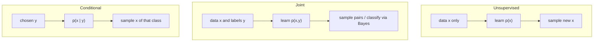

---

## Output type → distribution → code (activation + loss)

The generator/decoder’s **output type** decides which distribution the lecture says the model “assumes.” You typically **do not type the word Gaussian in the training loop**; the pair *(activation, loss)* implies it.

| Desired output | Assumed distribution | Output activation | Loss |
|----------------|----------------------|-------------------|------|
| Continuous real values (age, height, weight) | **Gaussian** | **Linear** | **MSE** (predict the Gaussian mean) |
| Binary / 0–1 pixels (black-and-white image) | **Bernoulli** | **Sigmoid** | **Binary cross-entropy**; each pixel is $P(\text{pixel}=1)$ |
| Next word / multiclass token | **Categorical / multinomial** | **Softmax** | **Categorical cross-entropy** |

Gaussian is the bell curve with parameters $\mu$ and $\sigma$—the lecture’s default for **continuous** outputs.

---

## Where the Gaussian already appears (preview of later weeks)

The last block of the lecture is only a **pointer**, not a full derivation.

### VAE

Input → **encoder** (important features) → **latent space**. Between encoder and latent code the lecture places a **Gaussian**. The encoder maps $x$ to a Gaussian in latent space; new $x$ are made by **sampling** that Gaussian and decoding.

### Diffusion

Start from a cat image; add noise drawn from a **Gaussian**, repeatedly, until the cat is gone. Reverse: strip noise and obtain a **new** sample. (Forward / reverse are weeks 7–8.)

### GAN

A **generator** and a **discriminator** (real vs fake). The generator has to start somewhere: a **noise vector from a Gaussian**.

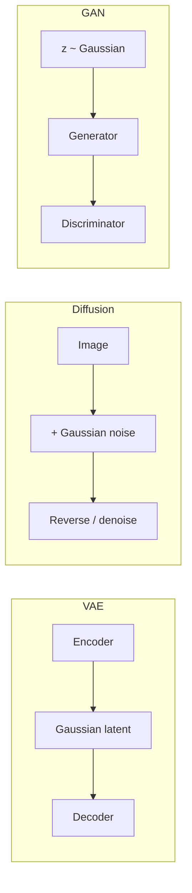

Bernoulli is recalled for binary outputs (sigmoid + BCE). Categorical is recalled for next-word prediction (softmax + CCE).

---

## Applications by modality (closing slide)

| You want to generate… | Models the lecture names as typical |
|-----------------------|--------------------------------------|
| **Text** | LLMs and **transformers** (taught in the LLM week) |
| **Images** (inpaint, extra samples) | **GAN, VAE, diffusion** |
| **Speech / music / sound** (time-dependent) | **Transformers**, also GAN or VAE |
| **Code** | Any of the course models, depending on setup |

### Key takeaways

- MLP / CNN / RNN-style predictors are discriminative: they learn $P(y \mid x)$ and **not** how $x$ was generated.
- Generative modeling learns $p_{\text{data}}$ so it can **sample** new realistic $x$ (and optionally $x$ given $y$).
- Augmentation and oversampling reuse existing points; they are not distribution learning.
- In code, Gaussian / Bernoulli / categorical show up as **linear+MSE**, **sigmoid+BCE**, **softmax+CCE**.
- The same Gaussian idea will reappear in VAE latents, diffusion noise, and GAN $z$.

---


\newpage

# L02: Activation Functions & Loss Functions in Deep Learning

**Video:** [Lec 02](https://www.youtube.com/watch?v=jXlaQvjQiIU) · 36:34

### Learning objectives

- State why a neuron needs a nonlinear activation, and where activations sit (hidden vs output).
- Compute ReLU / Leaky ReLU / ELU on a weighted sum, and pick sigmoid, tanh, or softmax at the output.
- Map this course’s models (CNN, autoencoder, VAE, GAN, diffusion, LLM) to typical hidden and output activations.
- Distinguish reconstruction / classification losses from generative-model losses (KL, GAN, noise-prediction).

### Week 1 placement

Previous lecture: generative-AI fundamentals. This lecture is the **activation + loss recap** needed for deep learning and for later generative models. Next lecture: optimizers.

---

## What one neuron does

Each neuron runs two steps:

1. **Weighted sum:** multiply inputs by weights, add bias.
2. **Activation:** pass that scalar through $\sigma(\cdot)$.

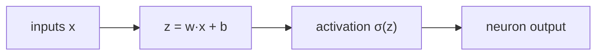

### Why an activation is required

| If there is no activation | What goes wrong |
|---------------------------|-----------------|
| The weighted sum is emitted unchanged | The neuron is a **linear** model |
| Stacking linear layers stays linear | The net cannot learn **complex patterns** |
| No ReLU-family gate | Negative / unused features are not suppressed |

Three roles the lecture names:

1. **Nonlinearity** — without $\sigma$, the unit is linear.
2. **Composition across layers** — each neuron’s output fans out to every neuron in the next layer, so activations let the stack combine features.
3. **Suppression (ReLU family)** — $\max(0,x)$ forwards only positive information.

In **generative** models the same nonlinear maps turn **noise** or a **latent** code into a meaningful sample.

### Where they sit

Activations are used at **hidden layers and at the output layer**. The two places do **not** share the same menu.

---

## Hidden-layer activations (ReLU family)

The $x$ below is the neuron’s weighted sum.

### ReLU — $\max(0,x)$ (default hidden activation)

| Weighted sum $x$ | $\max(0,x)$ |
|------------------|------------|
| negative (e.g. $-3$) | $0$ |
| $0$ | $0$ |
| positive (e.g. $4$) | $4$ |

**Interpretation:** a negative sum is treated as “this feature is not contributing,” so ReLU zeros it. Only positive evidence is sent on.

**Dying-neuron problem:** if a neuron’s sum is $-3$, ReLU outputs $0$ — the unit contributed nothing. That is not always correct; some negative evidence should leak through.

### Leaky ReLU — keep a trickle of the negative part

Plot vs ReLU: ReLU’s negative side is a flat line at $0$; Leaky ReLU has a shallow slope.

$$
\text{LeakyReLU}(x)=\begin{cases}
x & x \ge 0 \\
0.01\,x & x < 0
\end{cases}
$$

The slope **$0.01$ is fixed**. If you treat that slope as a learned hyperparameter, the activation is **parametric ReLU (PReLU)**, not Leaky ReLU.

Same example: $x=-3$ gave $0$ under ReLU; Leaky ReLU gives $0.01\times(-3)=-0.03$. Not the full negative value, but **some** information continues.

**What it fixes:** dying neurons.

### ELU — Exponential Linear Unit (smoother negative tail)

Leaky ReLU’s negative side is a **sharp** line. ELU uses an **exponential** for $x\le 0$, with hyperparameter $\alpha$ (lecture example $\alpha=1$):

$$
\text{ELU}(x)=\begin{cases}
x & x > 0 \\
\alpha(e^{x}-1) & x \le 0
\end{cases}
$$

Worked sketch from the lecture: $x=-1$, $\alpha=1$ → substitute into the exponential formula. Repeat with $x=-3$ and compare to Leaky ReLU’s $-0.03$ to see the smoother curve.

### GELU — Gaussian Error Linear Unit

A further ReLU-family variant used in **modern** nets, especially **transformers**. Substitute the weighted sum into the GELU formula (the slide’s closed form). Example given: $x=-1$ maps to the corresponding GELU output.

### SiLU (Sigmoid Linear Unit)

Another modern hidden activation, **inspired by sigmoid**. Substitute the neuron sum into the SiLU formula (typically $x\cdot\sigma(x)$).

---

## Output-layer activations (task-dependent)

You **do** have a choice, but it is determined by the problem — not by taste.

### Sigmoid — binary, labels in $\{0,1\}$

Disease / no disease, yes / no. Formula:

$$
\sigma(x)=\frac{1}{1+e^{-x}}
$$

| $x$ (weighted sum) | $\sigma(x)$ | Class (threshold $0.5$) |
|--------------------|-------------|-------------------------|
| $-2$ | $0.119$ | class $0$ ($<0.5$) |
| $0$ | $0.5$ | boundary (either class, by how you implement the cut) |
| $2$ | $0.881$ | class $1$ ($>0.5$) |

The sigmoid curve cuts at $0.5$.

### Tanh — binary, labels in $\{-1,+1\}$

If labels are already $-1$ and $+1$, two options: recode $-1\to 0$ and keep sigmoid, **or** use tanh and leave the labels.

$$
\tanh(x)=\frac{e^{x}-e^{-x}}{e^{x}+e^{-x}}
$$

| $x$ | $\tanh(x)$ | Class (cut at $0$) |
|-----|------------|---------------------|
| $-2$ | $-0.964$ | $-1$ |
| $0$ | $0$ | boundary |
| $2$ | $+0.964$ | $+1$ |

Any value $<0$ → minus class; $>0$ → plus class. (Contrast with sigmoid’s $0.5$ cut and rounding to $0/1$.)

### Softmax — multiclass

Medical: **normal / benign / malignant**. Or **male / female / transgender**. Sigmoid and tanh cannot handle more than two classes.

**Number of output neurons = number of classes.** Five classes → five output neurons, each with a weighted sum. Softmax turns that vector into probabilities that **sum to 1**.

Lecture vector of sums: $[1.3,\ 5.1,\ 2.2,\ 0.7,\ 1.1]$. For class $i$,

$$
p_i=\frac{e^{z_i}}{\sum_j e^{z_j}}
$$

Worked values from the lecture:

| $z_i$ | Numerator | $p_i$ (approx.) |
|------:|-----------|-----------------|
| $1.3$ | $e^{1.3}$ | $0.02$ |
| $5.1$ | $e^{5.1}$ | $0.90$ |
| $2.2$ | $e^{2.2}$ | $0.05$ |
| $0.7$ | $e^{0.7}$ | (compute similarly) |
| $1.1$ | $e^{1.1}$ | (compute similarly) |

Animal example: $C_1$ cat, $C_2$ dog, $C_3$ horse, … The **argmax** of the softmax vector is the predicted class (here $C_2$ / dog at $0.90$).

### Output-activation summary

| Problem | Output range | Activation |
|---------|--------------|------------|
| Binary, $\{0,1\}$ | $(0,1)$ | **sigmoid** |
| Binary, $\{-1,+1\}$ | $(-1,1)$ | **tanh** |
| Multiclass | probabilities summing to $1$ | **softmax** |

---

## Which activations this course actually uses

The syllabus order recalled here: **CNN → autoencoders → VAEs → GANs → diffusion → sequence models / LLMs**. You cannot reuse one hidden activation for all of them.

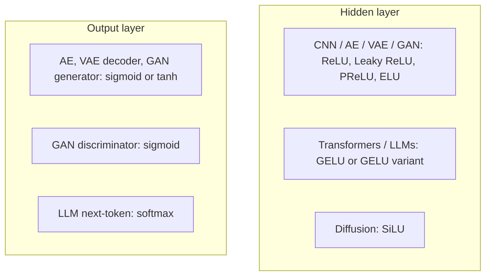

| Model | Hidden | Output |
|-------|--------|--------|
| CNN, autoencoder, VAE, GAN | ReLU, Leaky ReLU, PReLU, or ELU | — |
| Transformers / LLMs | **GELU** (Gaussian Error Linear Unit) or a GELU variant | **softmax** (next word / token) |
| Diffusion | **SiLU** | — |
| Autoencoder / VAE **decoder**, GAN **generator** | — | **sigmoid** or **tanh** |
| GAN **discriminator** | — | **sigmoid** |

---

## Loss functions

**Loss** measures how far the **prediction** is from the **ground truth** (or, in reconstruction, from the **original input**). Input → network → prediction; compare to the label (or to $x$ itself).

Same loss is **not** used for every application.

### Conventional DL vs generative DL

| Setting | What the loss compares |
|---------|------------------------|
| Classical deep learning | predicted label vs ground-truth label |
| Generative / “modern” DL | **reconstruct** $x$, **generate** realistic new samples, or **predict the next word** |

The lecture splits losses into (1) **reconstruction and classification** and (2) **generative-model** losses.

---

## Reconstruction and classification losses

### MSE as reconstruction loss (continuous $x$)

In an ML/DL course, MSE is usually $\frac{1}{n}\sum(y_i-\hat{y}_i)^2$ on **labels**. Here the aim is to **reconstruct the input**. Example features $2,4,6$ should come back as something like $2,4,6$. The “ground truth” is the **original sample**.

$$
\mathcal{L}_{\text{MSE}}=\frac{1}{n}\sum_i\bigl(x_i-\hat{x}_i\bigr)^2
$$

$x_i$ = original input, $\hat{x}_i$ = reconstructed input. If $x=25$ and $\hat{x}=20$, the gap is $5$. Use MSE when reconstructing **continuous** values.

### Binary cross-entropy (binary / $0$–$1$ reconstruction)

If you need reconstructed values in $\{0,1\}$ (not $25$, $28$), do **not** use MSE. Use **binary cross-entropy**, again with the **original input** in the $x$ slot (not a class label). Same functional form as supervised BCE; different target.

### Cross-entropy for next-word / LLM prediction

Predicting the next token is classification over the vocabulary.

| Label encoding | Loss |
|----------------|------|
| **One-hot** | **categorical cross-entropy** |
| **Integer class ids** (word $1$, word $2$, …) | **sparse categorical cross-entropy** |

Both appear in the week-1 hands-on. Categorical CE is the one the lecture flags for LLMs / next-token prediction.

---

## Generative-model losses (preview; math later)

### VAE: reconstruction + KL divergence

Total VAE loss = **reconstruction loss + KL divergence**.

Reconstruction is still “how far is $\hat{x}$ from $x$.” **KL divergence** measures how far **one probability distribution** is from another (e.g. a Gaussian vs a Bernoulli).

Analogy: distance between two **points** $P,Q$ in 2-D → Euclidean distance (each has $(x,y)$). Distance between two **distributions** → **not** Euclidean (there are no point coordinates). That job is KL. Full treatment is **week 3**.

### GAN

A **generator** emits samples; a **discriminator** says real vs fake. The generator’s job is to make images realistic enough that the discriminator is **confused**. The associated GAN loss is named here; the mathematics is **week 4**.

### Diffusion

**Noise-prediction loss** (later diffusion weeks).

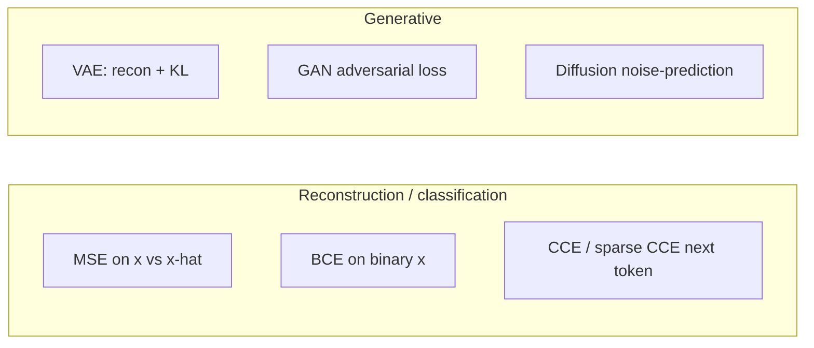

### Key takeaways

- No activation ⇒ linear neuron; ReLU-family activations also **gate** negative features.
- Hidden menu: ReLU (dying neurons) → Leaky ReLU ($0.01$) / PReLU (learned slope) → ELU (smooth exponential) → GELU (transformers) / SiLU (diffusion).
- Output menu: sigmoid $\{0,1\}$, tanh $\{-1,+1\}$, softmax (multiclass / next token).
- Generative reconstruction uses MSE or BCE on **$x$ vs $\hat{x}$**, not on class labels; LLMs use (sparse) categorical CE; VAEs add KL; GANs and diffusion have their own losses.

---


\newpage

# L03: Optimizers — Part A

**Video:** [Lec 03](https://www.youtube.com/watch?v=VevYEYDAm_8) · 31:03

### Learning objectives

- Place the optimizer in the train loop: forward pass → loss → gradients → weight update.
- Apply $W_{\text{new}}=W_{\text{old}}-\eta\,\partial L/\partial W$ and explain the minus sign.
- Contrast **SGD**, **mini-batch SGD**, and **batch gradient descent** by *when* weights are updated.
- Write SGD **with momentum** as an exponentially weighted moving average of gradients.

### What this lecture is *not*

AdaGrad, RMSProp, and Adam are **Part B** (next video). This video stops after SGD with momentum.

---

## Why we need an optimizer

Setup: a simple **MLP**. Every neuron is connected to every neuron in the next layer; each connection has a weight. **Weights (and biases) start random.**

Because initialization is random, the first prediction is wrong. Compare it to the **ground truth** / label:

- True label $1$, prediction $0.2$ → **high** loss.
- True label $1$, prediction $0.95$ → **low** loss.

**Loss** answers: *how wrong is the model?* Goal: drive loss down so prediction and ground truth get close.

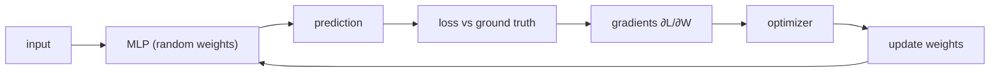

### Gradients

$$
g = \frac{\partial L}{\partial W}
$$

This derivative says **how each weight contributed to the loss**, and it gives both:

- the **direction** of the weight update,
- the **amount of influence** that weight has on the loss.

Increase $W$ → loss moves one way; decrease $W$ → the other way.

### Role of the optimizer

Use those gradients to **update weights in the right direction** so predictions gradually improve.

**Primary objective of optimization: minimize the loss.**

---

## The weight-update rule

$$
W_{\text{new}} = W_{\text{old}} - \eta \frac{\partial L}{\partial W}
$$

$\eta$ is the **learning rate**. The gradient may be $>0$ or $<0$.

**Why the minus sign?** We want to move **where loss decreases** (gradient descent).

### Worked sign examples

$W_{\text{old}}=5$, $\eta=0.1$.

| Gradient $\partial L/\partial W$ | Arithmetic | $W_{\text{new}}$ | Effect |
|----------------------------------|------------|------------------|--------|
| $-2$ (negative) | $5 - 0.1(-2)=5.2$ | $5.2$ | **weight increases** |
| positive | $5$ minus a positive quantity | $<5$ | **weight decreases** |

Punchlines:

- Gradient **negative** → subtracting a negative **increases** $W$.
- Gradient **positive** → optimizer **reduces** $W$.

The optimizer does **not** change weights at random. It reads the loss gradient and decides up vs down. “Optimizing weights” here just means increasing or decreasing them so that **loss is minimized**.

---

## Three classical update schedules

Training samples can be fed in three ways. All compute prediction → error vs ground truth → gradient → update; they differ in **how many samples** sit behind one update.

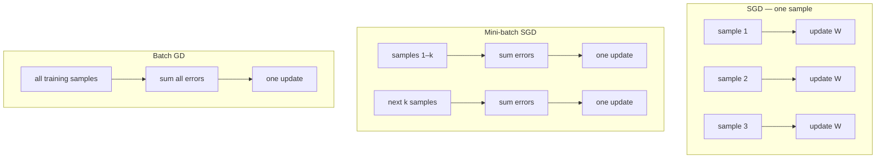

### Stochastic gradient descent (SGD)

Pass **one sample**, predict, compare to that sample’s $y$, compute loss, **backprop, update all weights**, then the next sample.

- Sample 1 → $P_1$ vs $Y_1$ → update.
- Sample 2 → $P_2$ vs $Y_2$ → update.
- Sample 3 → $P_3$ vs $Y_3$ → update.

**Picture toward the global minimum (loss near $0$):** first sample might **increase** $W$; second **decrease**; third **increase** again. Result: **heavy oscillation** / zigzag. The lecture does not call this a fatal flaw — it is simply what “update after every sample” looks like.

In the update formula, $\partial L/\partial W$ is computed from **that one sample’s error**.

### Mini-batch SGD

“Mini batch” = a **small subset** of samples. Batch size is a **hyperparameter** (diagram used $2$ only as a cartoon).

1. Forward sample 1 → error $E_1$. **Do not backprop yet.**
2. Forward sample 2 → error $E_2$.
3. **Add** $E_1+E_2$ (all errors in the batch), then one weight update.
4. Repeat on the next batch.

If the last leftover group is smaller than the batch size (one leftover sample in the lecture’s cartoon), you still forward it, compute its error, and update.

**Compared with SGD:** fewer updates per epoch → **less zigzag**. Mini-batch is often smoother, but there is **no thumb rule** — try both and keep the hyperparameter that performs on *your* data.

Here $\partial L/\partial W$ uses the **$k$ samples** in the batch.

### Batch gradient descent

Take **every** training sample: $E_1+\cdots+E_n$, then **one** update. No per-sample or per-mini-batch backprop.

Here the gradient uses **all** samples.

| Optimizer | Samples per update | Typical path to the minimum |
|-----------|--------------------|-----------------------------|
| SGD | $1$ | noisy, much zigzag |
| Mini-batch SGD | $k$ (hyperparameter) | smoother than SGD |
| Batch GD | all $n$ | one step per full pass |

These three are the **initial** set. The rest of the video is the first “modern” variant: **SGD with momentum**.

---

## SGD with momentum

### The zigzag problem, restated

SGD updates from the **current** gradient only. Sequence of signs $(-,+, -, +, \ldots)$ ⇒ weight up, down, up, down. That **slows convergence** to the global minimum.

In the formula, SGD’s gradient term is “$1$” in the sense that it is **only the current sample’s** $g_t$. Mini-batch uses $k$ errors; batch GD uses all of them.

### Momentum as velocity

Analogies from the lecture:

- Walking on a **flat** surface → you can go **fast**; on a **steep** slope → slower.
- If gradients have been **positive for many steps** (current, previous, the one before), you can **walk faster** toward the minimum — less zigzag, smoother path.

### Update with a velocity term

$$
v_t = \beta\, v_{t-1} + (1-\beta)\, g_t, \qquad
W_{\text{new}} = W_{\text{old}} - \eta\, v_t
$$

$g_t=\partial L/\partial W$ at the current step. $\beta$ is the momentum coefficient; **standard default $\beta=0.9$**. $v_0=0$ on the first step.

$v_t$ is an **exponentially weighted moving average (EWMA)** of gradients:

- **recent** gradients get **more** weight,
- **older** gradients are still remembered, with **decreasing** importance.

### Numerical walk-through ($\beta=0.9$)

Lecture’s consistent-positive run (reconstructed from the stated $v$ values: $v_1=0.5$ implies $g_1=5$):

| Step | $g_t$ | Recurrence | $v_t$ |
|-----:|------:|------------|------:|
| $1$ | $5$ | $0.9\cdot 0 + 0.1\cdot 5$ | $0.5$ |
| $2$ | $6$ | $0.9\cdot 0.5 + 0.1\cdot 6$ | $1.05$ |
| $3$ | $7$ | $0.9\cdot 1.05 + 0.1\cdot 7$ | $1.645$ |

If gradients **point the same way**, velocity **rises** ($0.5\to 1.05\to 1.645$). On a “flat” consistent slope you take **larger steps** — you already have evidence from the past.

### What if the next gradient goes negative?

$g_4=-4$, $v_3=1.645$:

$$
v_4 = 0.9\cdot 1.645 + 0.1\cdot(-4) \approx 1.08
$$

Speed **drops a little**; it does **not** reverse violently. **Smooth** transition instead of SGD’s abrupt zigzag. Negative-gradient stretches still look like a smooth curve on the board.

### Key takeaways

- Optimizer = use $\partial L/\partial W$ to raise or lower $W$ so loss falls; the minus sign is “move downhill.”
- SGD / mini-batch / batch GD differ only in **how many samples** feed one update.
- SGD zigzags because each update sees only the current $g_t$.
- Momentum replaces $g_t$ by an EWMA $v_t$ ($\beta\approx 0.9$): same-direction gradients **speed up**; a sudden sign flip **damps** rather than snaps.

---


\newpage

# L04: Optimizers — Part B

**Video:** [Lec 04](https://www.youtube.com/watch?v=7vmbACnFrb4) · 34:13

### Learning objectives

- Separate **gradient sign** (direction) from **gradient magnitude** and **learning rate** (step size).
- Explain why a **single** $\eta$ for millions of weights is a bad idea.
- Write **AdaGrad**’s per-parameter rate from the sum of **squared** past gradients, and state why the rate can die.
- Show how **RMSProp** replaces that sum by an EWMA of $g_t^2$, and how **Adam** = momentum + RMSProp.

### Recap from Part A (first minutes)

SGD update:

$$
W_{\text{new}} = W_{\text{old}} - \eta\, g, \qquad g=\frac{\partial L}{\partial W}
$$

Already known:

- $g>0$ → weight **decreases**; $g<0$ → weight **increases**.

New emphasis: **how large** $|g|$ is, and how $\eta$ interacts with it.

---

## Sign vs magnitude vs learning rate

Keep $\eta$ fixed. $W_{\text{old}}=5$.

| Situation | What happens to $W$ |
|-----------|---------------------|
| **Large** $\|g\|$ | **Large** change (lecture: $5\to 4$) |
| **Small** $\|g\|$ | **Tiny** change (lecture: $5\to 4.95$) |

So:

- **sign** of $g$ → **direction**,
- **magnitude** of $g$ → **how much** $W$ moves.

### Same gradient, different $\eta$

Now **vary the learning rate**. Large $g$ (lecture used $g=10$), $W_{\text{old}}=5$:

| $\eta$ | Qualitative result |
|--------|--------------------|
| small | small change in $W$ |
| moderate | e.g. $5\to 4$ |
| **high** | **abrupt** jump — lecture’s scare case: $5\to 0$ |

Repeat with a **small** gradient and several $\eta$: again, $\eta$ controls how far $W$ moves. Statement to keep:

> **Learning rate controls how the weight actually changes.**

---

## Why one global $\eta$ is not enough

A net has **millions** of weights. They do **not** all see the same $|g|$:

- some parameters get **large** gradients,
- some get **small / rare** gradients.

SGD still uses **one** $\eta$ for everyone.

| Parameter’s gradient | If $\eta$ is also large | If $\eta$ is also small | What you actually want |
|----------------------|-------------------------|-------------------------|------------------------|
| already **large** | adverse: $5\to 0$ | stable small step | **small** $\eta$ |
| already **small** | reasonable movement | almost stuck ($5\to 4.99$); slow convergence | **large** $\eta$ |

Ideal: **large $g$ ⇒ shrink $\eta$; small $g$ ⇒ grow $\eta$.** SGD cannot do that with a shared rate.

### Don’t decide from the current $g$ alone

A single mini-batch might be an outlier. Better: look at the **history**.

- If **past** gradients were all large, the **cumulative sum** is large → confidently **decrease** $\eta$.
- If past gradients were all small, the cumulative sum is small → confidently **increase** $\eta$.

That idea is **AdaGrad** (adaptive gradient).

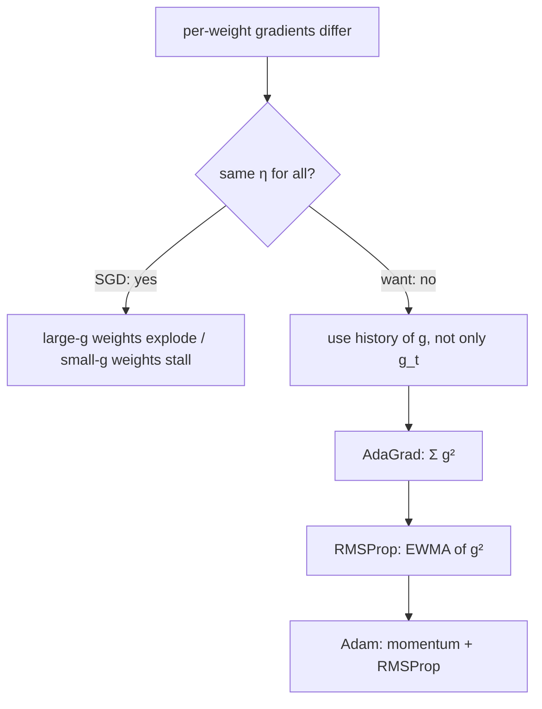

---

## AdaGrad

SGD:

$$
W_{\text{new}} = W_{\text{old}} - \eta\, g_t
$$

$\eta$ is the **same** for every weight. AdaGrad keeps a **running sum of squared gradients** and builds a **per-parameter** rate.

### Accumulator

At every step: square the current gradient, **add** it to the previous total.

$$
\alpha_t = \alpha_{t-1} + g_t^2
$$

$\alpha_{t-1}$ = accumulated squared gradients **up to the previous step**. Decision uses **all previous** $i=1,\ldots,t-1$, not only $g_t$.

### Per-parameter learning rate

$$
\eta_t = \frac{\eta}{\sqrt{\alpha_{t-1}+\varepsilon}}, \qquad
W_{\text{new}} = W_{\text{old}} - \eta_t\, g_t
$$

$\varepsilon$ is a small constant so the **denominator is never zero**.

### Why this grows / shrinks $\eta$ correctly

Denominator $= \sqrt{\alpha_{t-1}+\varepsilon}$.

**Small past gradients** (lecture sketch $0.1,\ 0.2,\ 0.3,\ -0.4$): squares are tiny, $\alpha$ is small, denominator is small ⇒ $\eta/\sqrt{\alpha}$ is **large** ⇒ **larger** effective learning rate for those weights.

**Large past gradients** (e.g. $5,\ 5.95,\ -4,\ 3,\ 0.79$): $\alpha$ is huge, denominator is huge ⇒ effective $\eta$ is **small**.

AdaGrad therefore:

- **allows larger rates** for parameters that have been seeing **small** gradients,
- **shrinks rates** for parameters that have been seeing **large** gradients.

None of the Part A optimizers could do this.

### AdaGrad’s failure mode

$\alpha$ is a **cumulative sum**. In a **deep** net, large $g$ keep adding forever. Then:

- denominator → large ⇒ effective $\eta$ → **tiny**,
- $\eta_t g_t$ ≈ $0$ ⇒ $W_{\text{new}}\approx W_{\text{old}}$,
- **no further progress**; reaching the minimum becomes extremely slow.

The lecture’s cartoon: if the subtracted term is tiny (e.g. you multiply a small rate by $25$ and still get almost nothing), the old weight is the new weight — **loss does not move**.

The whole problem sits in that **unbounded sum of squares**. Fix: stop accumulating everything equally. That is **RMSProp**.

---

## RMSProp (root mean square propagation)

Keep AdaGrad’s good idea (different $\eta$ per weight). Replace $\alpha_t=\sum g_i^2$ by an **exponentially weighted moving average of squared gradients** — the same EWMA idea as **SGD with momentum**, but on $g_t^2$.

$$
s_t = \beta\, s_{t-1} + (1-\beta)\, g_t^2
$$

$s_t$ = EWMA of **squared** gradients at time $t$. Put $s_t$ where AdaGrad put $\alpha$:

$$
W_{\text{new}} = W_{\text{old}} - \frac{\eta}{\sqrt{s_t+\varepsilon}}\, g_t
$$

### EWMA meaning, with $\beta=0.9$

$s_0=0$. Expand a few steps (lecture’s algebra):

| $t$ | Recurrence | Who is emphasized |
|----:|------------|-------------------|
| $1$ | $s_1=0.1\,g_1^2$ | only the current gradient |
| $2$ | $s_2=0.9\,s_1+0.1\,g_2^2=0.09\,g_1^2+0.1\,g_2^2$ | $g_2$ more than $g_1$ |
| $3$ | $s_3=0.9\,s_2+0.1\,g_3^2$ | $g_3$ highest; $g_1$ already small |
| $4$ | continue | $g_1$ tiny; $g_2$ small; $g_3$ less; **$g_4$ largest** |

**Current $g_t^2$ gets the most weight; older squares remain but with decreasing importance.** That is exactly the definition of exponentially weighted moving average.

Same “small $s$ ⇒ large $\eta$; large $s$ ⇒ small $\eta$” logic as AdaGrad, **without** the accumulator that drives $\eta\to 0$ forever.

---

## Adam

**Adam = momentum + RMSProp** (the two ideas that survived).

There are newer optimizers; Adam is the last **fundamental** one in this pair of lectures.

Use **two** $\beta$s because both pieces have a $\beta$:

| Piece | What is averaged | Coefficient |
|-------|------------------|-------------|
| **Momentum** (Part A) | gradients $g_t$ | $\beta_1$ |
| **RMSProp** | squared gradients $g_t^2$ | $\beta_2$ |

The Adam step combines:

- a **momentum** term in the numerator (smooth direction, velocity),
- an **RMSProp** term in the denominator (adaptive per-weight scale).

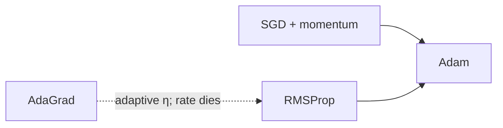

---

## Week 1 theory map (closing)

Week 1 so far: generative-modeling language → **activations** → **losses** → **optimizers** (this video and the previous). Next two sessions: **CNN recap** (how each layer works).

### Key takeaways

- Sign of $g$ = direction; $|g|$ and $\eta$ = step size. A huge $\eta$ with a huge $g$ can slam $W$ (e.g. $5\to 0$).
- Weights see different $|g|$; one global $\eta$ is the SGD assumption we drop.
- AdaGrad: $\eta_t=\eta/\sqrt{\sum g^2+\varepsilon}$ — good adaptivity, **vanishing rate** as the sum grows.
- RMSProp: same denominator idea with **EWMA of $g^2$** so old squares fade.
- Adam: **momentum ($\beta_1$) + RMSProp ($\beta_2$)**.

---


\newpage

# L05: Convolutional Neural Network — Part A

**Video:** [Lec 05](https://www.youtube.com/watch?v=SoKjqOB0YPw) · 47:25

### Learning objectives

- Describe how a machine stores an image (pixels, height × width, channels).
- List why a fully connected MLP is the wrong first model for images.
- Name CNN applications (classification, detection, segmentation variants).
- Run one **convolution**: kernel, element-wise multiply-and-sum, stride, padding, output size, Keras `Conv2D` arguments.

### What this lecture is *not*

**ReLU, pooling, flatten, and the fully connected head** are Part B. This video stops after the convolutional layer (plus a Keras preview of `Conv2D`).

---

## How a computer reads an image

To a human, a photograph is a scene. To a machine it is a **matrix of pixel values**.

- One **pixel** = one numerical intensity (brightness), or a colour intensity in **RGB**.
- **One pixel is not an object.** Nearby pixels together are the sun, an edge, a digit.
- **Height** = number of rows; **width** = number of columns. That pair is the **spatial size** of the image.

---

## Why not a fully connected MLP?

An MLP wants **independent features in a single vector**.

### Parameter blow-up

| Image | Channels | Flattened length |
|-------|----------|------------------|
| $28\times 28$ colour | $3$ (RGB) | $28\times 28\times 3=2352$ |
| $200\times 200$ colour | $3$ | $120{,}000$ |

$28\times 28\times 3$ is already a **low-resolution** image; you barely see content. Realistic sizes explode the input width. Every hidden neuron connects to every input, so **weights explode**, training **slows**, and **overfitting** gets worse.

### Spatial structure is destroyed

Flattening a 2-D grid into a 1-D vector:

1. **Destroys spatial relationships** — how pixels are *positioned* and *related*.
2. Treats every pixel as an **independent** feature. A single pixel is almost never a useful image feature; **neighbourhoods** are.
3. **Local dependencies** (an edge, a curve, a stroke of an “8”) vanish.

Lecture’s $3\times 3$ walk-through: horizontal neighbours of $1$ are $2$; of $2$ are $1$ and $3$; rows $1\,2\,3$, $4\,5\,6$, $7\,8\,9$. Vertical: $1,4,7$. After flattening, $2$ and $5$ are no longer adjacent; $3$ and $4$ look adjacent even though they were not. Scale that to $28\times 28=784$ and many fully connected hidden layers: **parameter explosion**.

That is why images use a **convolutional neural network (CNN)** — a specialized deep net for image (grid) data.

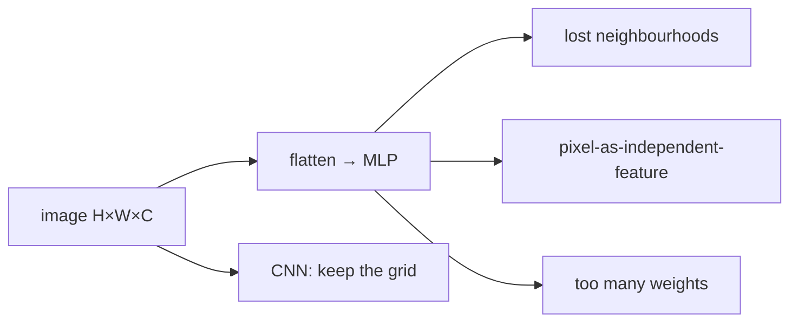

---

## What CNNs are used for

| Task | Lecture example |
|------|-----------------|
| **Image classification** | sheep or not; **benign vs malignant** / cancerous vs not |
| **Object detection** | several objects; **where** each one is |
| **Image segmentation** | keep only the **region of interest** |
| Classification + **localization** | same class (sheep) **and** a box |
| **Semantic segmentation** | road / grass / sheep — one colour per **class** |
| **Instance segmentation** | sheep 1, sheep 2, sheep 3 — same class, **different instances** |

Medical segmentation example: CT of the **ovarian** region. The tumour occupies a small patch. Sending the whole scan forces the model to learn irrelevant background. Segment the tumour, treat the rest as background, and the net focuses on what matters.

CNNs are **not only classifiers**.

---

## Inspiration: human visual system

MLP/perceptrons mimic biological neurons. CNNs mimic **how a human eye parses a scene**:

1. first **outlines** — lines, **edges**, **corners**;
2. then connect those into **shapes**;
3. then identify the object (lecture: **elephant** — outlines, then texture and colour).

CNN **early layers** look at **local** regions (lines, edges, corners). **Deeper** layers see the image as a whole.

---

## Four core components (map for Parts A–B)

| # | Component | Job in this course’s story |
|---|-----------|----------------------------|
| 1 | **Convolutional layer** | **extract features** (this lecture) |
| 2 | **Activation** (typically **ReLU**, not always — see the lab) | kill unhelpful (negative) features |
| 3 | **Pooling** | **downsample** — shrink feature-map **height and width** |
| 4 | **Fully connected layer** | classification (needs a vector) |

**Optional** regularizers: **normalization** and **dropout**.

Why pool at all? The eventual classifier is still a fully connected net, but you **must not** dump the raw image into it (too many features). Conv extracts; activation gates; pooling **still has to shrink size**. Terminology is unpacked as we go.

Feature hierarchy inside stacked conv layers:

- early conv → **low-level** features,
- middle conv → **mid-level**,
- late conv → **high-level**.

---

## Convolutional layer

**Fundamental building block.** Extracts features from the input image.

The “eye” that scans the image is the **kernel** (also called **filter** — the lecture uses the words interchangeably). The kernel walks the image and extracts features.

Kernel entries are **not fixed**. They are **learnable**; backpropagation updates them.

Image = matrix of pixels ⇒ kernel = a **smaller** matrix, almost always **odd-sized**: $1\times 1$ or $3\times 3$. The lecture starts with $3\times 3$ and later warns that $1\times 1$ is usually a poor first choice.

### Convolution operation

Place the $3\times 3$ kernel on a $3\times 3$ patch of the image:

1. **element-wise multiply**,
2. **sum** the nine products,
3. write that scalar into the **feature map**.

Definition given: *element-wise multiplication and sum the result.*

### Worked $6\times 6$ image, $3\times 3$ kernel

First patch → sum $=-5$ (products include $3\cdot 1$, $1\cdot 1$, $2\cdot 1$, then a row of zeros, then a row of $-1$s). That is one feature-map entry.

Then **stride**: slide the kernel to the next patch, multiply-and-sum again. Repeat until the kernel has covered the image. Resulting feature map in the slide: **$4\times 4$**.

### The border is under-visited

The lecture asks you to watch the pixel valued **$3$**. Interior pixels are seen in **several** windows; **border** pixels ($3$, $4$, $9$, $2$, …) are seen **once**. That is the information-loss problem padding will fix.

### Several kernels ⇒ several feature maps

Running the **same** kernel again extracts the **same** features (same weights). To get **different** features, use a **different** kernel → another feature map. **More kernels, more kinds of features.** Count of kernels is a hyperparameter.

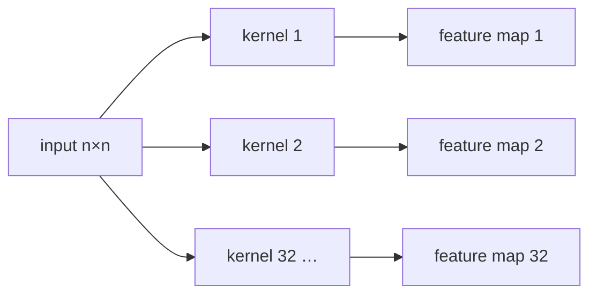

---

## Output size (no padding)

$$
\left\lfloor\frac{n-f}{s}\right\rfloor+1
\quad\text{(height and width)}
$$

$n$ = input size, $f$ = kernel size, $s$ = **stride**. If $s=1$ this is just $n-f+1$.

Lecture numbers: $n=6$, $f=3$, $s=1$ → $6-3+1=4$ → feature map **$4\times 4$**.

**Problem:** $6\times 6$ became $4\times 4$ — **size dropped, information lost**, especially at borders. In **medical** images every region (including the border) can matter.

---

## Padding

Add a frame of **zeros** around the image so border pixels are visited as often as interior ones.

After **one** layer of zero-padding on a $6\times 6$ image, the working grid is $8\times 8$, but we want the **feature map** back at **$6\times 6$** (same as the original image) so we can say nothing was lost.

Formula **with padding** $p$ (and $s=1$ as in the board derivation):

$$
n+2p-f+1
$$

Substitute $n=6$, $p=1$, $f=3$: $6+2-3+1=6$. Matches the original size.

(The lecture said “one layer of pooling” once when it meant **padding** — ASR/slip; the algebra is padding.)

With padding, the pixel $3$ is seen on the first window, after a horizontal stride, after a vertical stride, and again — **multiple looks** at the border.

---

## Stride

**Hyperparameter.** In Keras it controls **how the filter moves**. After one multiply-and-sum, jump $s$ pixels.

General size formula (include $2p$ only if you padded):

$$
\left\lfloor\frac{n+2p-f}{s}\right\rfloor+1
$$

If the division is not integer, take the **floor** (e.g. $3.1$, $3.5$, $3.9$ all become $3$ — greatest integer $\le$ that number).

### $s=1$ example (no pad)

$n=7$, $f=3$, $s=1$, $p=0$ → $(7-3)/1+1=5$ → **$5\times 5$**.

### $s=2$

Skip a position; the kernel lands on every other patch. Same $n=7$, $f=3$, $p=0$: $(7-3)/2+1=3$ → **$3\times 3$**. Larger stride ⇒ **smaller** feature map.

Stride is **not** always $1$, and **not** always square.

---

## Keras / `Conv2D` preview (hands-on syntax)

Minimum ingredients: **input image** + **kernels**.

Lecture defaults:

- input **$64\times 64\times 1$** — the $1$ is the channel count (**grayscale / binary**).
- **$32$ kernels**, each **$3\times 3$**. (Both $32$ and $3\times 3$ are hyperparameters.)
- Each kernel produces one feature map → $32$ maps.

| Argument | Meaning |
|----------|---------|
| `padding="same"` | apply padding (keep size) |
| `padding="valid"` | **no** padding |
| `strides=(2,2)` | jump two pixels |
| `activation="relu"` | ReLU after the conv (detail in Part B) |
| omitted stride | **default stride $=1$** |

Function name: **`Conv2D`**.

### Rectangular images

The $64\times 64$ demo is square. Real photos can be **rectangular** (different aspect ratio). Then stride need not be square: `strides=(2,3)` means **$3$ pixels right and $2$ pixels down** (lecture’s wording). Square input ↔ square stride is a convenience, not a law.

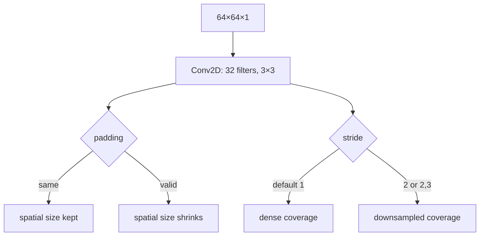

### Why CNN now

Later generative architectures **reuse CNN patterns**. Knowing conv/kernel/stride/padding is the prerequisite.

Next session: **ReLU, pooling, flatten**.

### Key takeaways

- Images are $H\times W\times C$ pixel grids; flattening them for an MLP drops neighbourhoods and explodes parameters.
- CNN applications: classify, detect, semantically / instance-segment (sheep, CT tumour, …).
- A kernel slides, multiply-and-sums, writes a feature map; **many kernels ⇒ many maps**; kernel weights are learned.
- Size: $\lfloor(n+2p-f)/s\rfloor+1$, floor if needed; **padding** protects borders; **stride** is how far the kernel jumps.
- Keras: `Conv2D`, `padding="same"|"valid"`, default stride $1$.

---


\newpage

# L06: Convolutional Neural Network — Part B

**Video:** [Lec 06](https://www.youtube.com/watch?v=wyvLZfmhqP0) · 51:50

### Learning objectives

- Apply **ReLU** to a feature map and explain why it does **not** downsample.
- Count **learnable conv parameters** and the **output tensor size** after conv.
- Run **max / average / min / max-average-min** pooling, including Keras `MaxPooling2D`.
- Stack conv–ReLU–pool, **flatten**, and a **fully connected** classifier (sigmoid vs softmax).

### Placement

Part A: why MLP fails on images, and the **convolutional** layer. This video is the rest of the CNN, then the end of **week-1 theory**. Next: hands-on CNN.

---

## Recap: we still have not shrunk the map

Conv **extracts** features. With **padding**, the feature map stays the **same spatial size** as the input. You still cannot dump that tensor into a fully connected classifier (parameter explosion from Part A). Remaining layers: **activation (ReLU)**, **pooling**, **flatten**, **fully connected**.

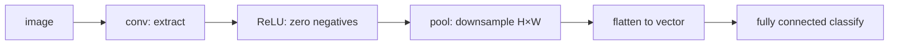

---

## ReLU after convolution

**Rectified linear unit:** $\max(0,x)$ on **every** feature-map entry.

Lecture walk-through: conv output contains $1$, $14$, $-9$, $4$, … After ReLU: $1$, $14$, **$0$**, $4$, … All **negatives become $0$**; positives stay.

**Intuition:** the feature map *is* the extracted features. A **negative** response is “this feature is not contributing” → drop it. ReLU does **not** change height or width.

### Diagonal-feature example

Input image $X$, one kernel. The feature map’s **diagonal** is large compared with other entries — that kernel found a **diagonal** structure (the lecture’s “X” / stroke). After ReLU the diagonal **stays**; unhelpful locations become $0$. The extracted pattern is not compromised.

Same kernel again ⇒ **same** map. A **different** kernel ⇒ a **different** map, then its own ReLU. Stack those maps: one kernel on a handwritten **4** keeps **vertical** strokes; another keeps another vertical band; combining them reconstructs the digit.

### Keras line (ties to Part A)

Input $64\times 64\times 1$, **$32$** kernels of **$3\times 3$**, `activation="relu"`. (The toy figures used **two** kernels; real nets use many.)

**Punchline:** conv extracts; ReLU zeros negatives; **neither reduces spatial size** if you padded. Downsampling is pooling’s job.

---

## How many learnable parameters?

Kernel weights are **learned** (updated over iterations). Count them.

$$
\bigl(f_H \times f_W \times C_{\text{in}} + 1\bigr)\times n_{\text{filters}}
$$

$+1$ is the **bias** per filter. $C_{\text{in}}$ comes from the input: **$3$ for RGB**, **$1$ for grayscale/binary**.

**Stride and padding do not change this count.** Padding a $32\times 32$ image still has a $32\times 32$ original; stride only moves the window.

### Worked counts from the lecture

| $f_H\times f_W$ | $C_{\text{in}}$ | Filters | Arithmetic | Parameters |
|-----------------|-----------------|---------|------------|------------|
| $5\times 5$ | $3$ | $6$ | $(25\times 3 + 1)\times 6$ | **$456$** (stated) |
| $3\times 3$ | $3$ | $64$ | $(9\times 3 + 1)\times 64$ | $1792$ |
| $5\times 5$ | $64$ | $128$ | $(25\times 64 + 1)\times 128$ | $204{,}928$ |

Always know the parameter count **after each layer**.

---

## Feature-map (output) size after conv

$$
\left(\left\lfloor\frac{I - F + 2P}{S}\right\rfloor + 1\right) \times D
$$

$I$ = spatial input, $F$ = filter, $P$ = padding, $S$ = stride, $D$ = **number of filters** (output depth / channels). Non-integer results: **floor**.

You need this whenever you **draw** a custom CNN (input size → size after conv 1 → size after conv 2). In code, `model.summary()` prints the same thing.

### Example A — no padding

Input **$32\times 32\times 3$**, **six** $5\times 5$ filters, $S=1$, $P=0$:

$$
\frac{32-5+0}{1}+1=28
$$

**Six** $28\times 28$ maps (one per kernel). Size dropped because there was **no** padding.

### Example B — `padding = 2`

“Padding equal to two” = **two rings** of padding. $P=2$, $2P=4$:

$$
\frac{32-5+4}{1}+1=32
$$

Output spatial size **matches** the $32\times 32$ input. Depth still $6$.

---

## Pooling — the actual downsampler

You do not need **every** pixel to recognize a person; **salient** features suffice. Pooling **reduces spatial size** while keeping those.

**Input to pooling:** ReLU’s map (negatives already $0$). Real images are not $7\times 7$; the board is small only for arithmetic.

### Mechanics

1. Fix a **window** (hyperparameter; lecture default **$2\times 2$**).
2. **Slide** it over the feature map.
3. **Summarize** the window: max, average, or min (and one research variant below).

$2\times 2$ on a $7\times 7$-ish map → about **$4\times 4$**: spatial dimensions fall.

**Pooling = downsampling.** It reduces **width and height** of the feature map, **cuts compute**, and prepares a smaller tensor for the dense classifier.

Default **stride = window size**. For $2\times 2$, if you do not set stride, it is **$2$**. You *may* set stride explicitly.

### Max pooling

Take the **largest** value in the window. Intuition: that entry carries the **most important** feature.

$4\times 4$ map, $2\times 2$ window, stride $2$: windows yield e.g. **$71$**, **$6$**, **$60$**, **$13$**.

### Average pooling

Mean of the four values. First window $71+8+1+0=80$, $80/4=20$. Mixes the strong response with the weak ones.

### Min pooling

The **smallest** value in the window (least-important / weakest response): e.g. $0$, $2$, $20$, $3$.

### Max-average-min pooling (from a paper the instructor flagged)

Let $M=\max$, $m=\min$, $A=\text{average}$ **inside the window**.

- If $M-m > A$ (large gap ⇒ **sharp** change / strong feature): emit $M-m$. Example: $M=71$, $m=0$, $A=20$, $71>20$ → output **$71$**.
- If $M-m \le A$ (more **uniform** window): emit $(M+A)/2$.

Use when implementing; it is a fourth pooling option, not the Keras default.

### Did we throw the pattern away?

**No.** On the diagonal-feature example, max-pool **$7\times 7$** with $2\times 2$, stride $2$: the **diagonal stays visible** in the smaller map. Important extracted structure is retained.

### Keras

```text
from tensorflow.keras.models import Sequential
from tensorflow.keras.layers import Conv2D, MaxPooling2D
```

`MaxPooling2D(pool_size=(2,2))` — **pool size is required**. Unspecified stride ⇒ $2$. To override: `strides=(1,1)`.

Worked block:

- `Conv2D(32, (3,3), activation="relu", padding="same", input 28×28×1)` → **$28\times 28\times 32$**
- `MaxPooling2D((2,2))` → **$14\times 14\times 32$** (spatial **halved**; **$32$ channels kept**)

If conv used `padding="same"`, the lecture also pads in the pooling demo so empty cells are $0$.

### Output size after pooling

$$
\left(\frac{n_H-F}{S}+1\right)\times(\text{same for width})\times D
$$

$D$ = number of filters from the **preceding conv**.

Example: $5\times 5\times 1$ “input” to a $3\times 3$ window, $S=1$ → $(5-3)/1+1=3$ → **$3\times 3\times 1$** (one map, not five separate maps). Three conv kernels would give **three** such maps.

---

## Repeating conv–ReLU–pool

You **can** stack another conv–ReLU–pool. Why: after **one** round the maps may still be large.

Three $3\times 3$ kernels on a padded $7\times 7\times 1$: three feature maps. Flattening those $4\times 4$ maps is $3\times 16=48$ numbers — fine for a toy $7\times 7$, **not** for $256\times 256$. A **second** block, again three kernels, sees the **already pooled** maps as input and writes **three smaller** maps (lecture: $12$ values to the classifier instead of $48$).

How many times to repeat is the question “how small must the final map be before the dense net?” Sequential Keras: the **second** `Conv2D` does **not** take `input_shape`; previous output is the input.

```text
Conv2D(3, (3,3), activation="relu")   # no input_shape the second time
MaxPooling2D(...)
```

---

## Flatten

Classification (or detection / segmentation — this recap is classification) still has not happened. A dense MLP wants a **1-D vector**. Pooling output is still a **matrix / tensor**.

**Flatten** concatenates maps: e.g. $3,1,1,3,1,2,5,0,2,\ldots$ then the next map, … One `Flatten()` call. Multiple maps → concatenate all of them.

---

## Fully connected head

This is an MLP: any number of hidden layers, any width. **Last layer width = number of classes.**

| Task | Output neurons | Activation |
|------|----------------|------------|
| Binary | **$1$** | **sigmoid** |
| $3$-class | **$3$** | **softmax** |

Code pattern from the lecture:

1. `Flatten()`
2. hidden `Dense(128, activation="relu")`
3. `Dense(3, activation="softmax")`  — or `Dense(1, activation="sigmoid")` if binary
4. `compile`: **optimizer**, **loss**, metric **accuracy** (details in the lab)

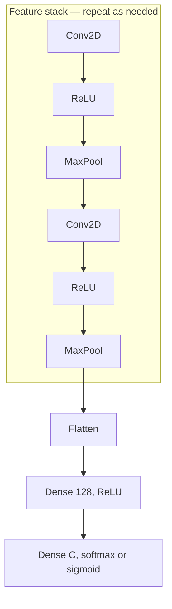

### Week-1 theory close

| Layer | Role |
|-------|------|
| Convolution | extract features |
| ReLU | negatives → $0$ |
| Pooling | downsample $H\times W$ |
| Flatten | maps → vector |
| Fully connected | classify |

Hands-on CNN is the next two sessions.

### Key takeaways

- ReLU after conv zeros negatives and **keeps spatial size**; pooling is the downsampler.
- Conv parameters: $(f_H f_W C_{\text{in}}+1)\times n_{\text{filters}}$; output spatial size $\lfloor(I-F+2P)/S\rfloor+1$ with depth $=$ number of filters.
- Pooling: $2\times 2$ window, default stride $2$; max (salient), average, min, or max-average-min; Keras `MaxPooling2D`.
- Stack blocks until the map is small enough; flatten; dense head with **$C$** outputs (sigmoid vs softmax).

---


\newpage

# L07: Introduction to Google Colab

**Video:** [Lec 07](https://www.youtube.com/watch?v=ukII_nwzPsI) · 16:21

### Learning objectives

- Open Colab, create a notebook, connect a runtime, and pick CPU / GPU / TPU.
- Run **code** vs **text** cells (`Shift+Enter`).
- Pull a dataset from **Kaggle**, **GitHub**, or **UCI**, land it in **Google Drive**, and paste the path into pandas / folder variables.

### What this lecture is *not*

No CNN training. This is the **environment + data plumbing** session before Practical Exercise 1.

---

## Why Colab

**Free cloud** Python, with a **Jupyter notebook** UI. Used in this course for ML / DL (datasets, not only toy arithmetic).


---

## Open a notebook

1. Chrome → type **Google Colab**.
2. Click **Welcome to Colab**.
3. **New notebook** (page takes a moment to load).
4. Default name like `untitled5.ipynb` — replace with a project name (demo: **project four**).

**`.ipynb`:** **I**nteractive **Py**thon **N**ote**b**ook.

5. Top right: **Connect**.

### Menu bar

**File, Edit, View, Insert, Runtime, Tools, Help.**

---

## Runtime: language, hardware, version

Connect dropdown → **Change runtime**.

| Field | Options the lecture shows | What to pick |
|-------|---------------------------|--------------|
| **Runtime type** | **Python 3**, **R**, **Julia** | Python 3 for this course; R if you are writing R |
| **Hardware accelerator** | **CPU**, **GPU**, **TPU** | see below |
| **Runtime version** | several | **latest** |

**Save** after choosing.

### CPU vs GPU vs TPU

| Accelerator | When |
|-------------|------|
| **CPU** (default) | fine for small demos; lecture selects CPU “for the time being” |
| **GPU** (graphics processing unit) | same code that might take **10–12 hours** on CPU can take **1–2 hours** on GPU |
| **TPU** (tensor processing unit) | **very large** datasets or **NLP** |

Pick the accelerator **before** you run heavy training.

After connect you also see **RAM** and **disk** — quota for this session.

---

## Text cells vs code cells

Tabs: **Code** and **Text**.

**Text** demo: heading “multiplication of two numbers”. **Shift+Enter** renders the markdown.

**Code** demo:

```python
x = 5
y = 8
z = x * y
print(z)   # 40
```

Run with the **play button** in the cell **or** **Shift+Enter**.

---

## Where datasets come from

Colab is for models that need data. Typical sources named: **Kaggle**, **GitHub**, **UCI**. Files are **CSV**, **images**, or **videos**.

### Pattern used throughout

1. Download to **your computer**.
2. Upload to **Google Drive**.
3. In Colab, **mount Drive** and **copy path**.

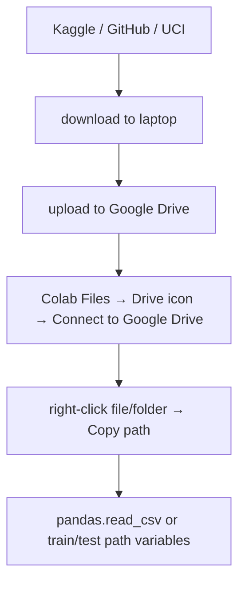

---

## Kaggle

1. Open Kaggle (sign up if new; already-signed-in users see their name).
2. Search, e.g. **lung cancer** — lecture saw **5,191** results.
3. First hit was a **`lung cancer.csv`** project. **Download** (top right). File lands **on your system**.
4. Image search example: **Alzheimer’s dataset**. Read the dataset **description**, table of contents, and **libraries**. Download is a **zip**. Inside: separate folders for **test**, **train**, and **validation**. Download those folders too.

Kaggle is **not only datasets**. **Create** opens a **notebook** where you can write and **run** code.

**Share:** button **Share** — **private** (named people) or **public** via link, same idea as sharing a Drive file.

---

## Mount Drive and read a CSV in Colab

Left sidebar: **folder**. Inside, the icon with a **Drive** badge → **Connect to Google Drive** → wait for mount → **drive** → **My Drive**. Whatever you uploaded appears (lecture: test folder, train folder, lung-cancer CSV).

```python
import pandas as pd
import numpy as np

lung = pd.read_csv("PASTE_COPIED_PATH_HERE")
lung.head()
```

**Copy path:** right-click the CSV in the file browser → **Copy path** → paste inside the quotes.

`head()` showed rows with features:

| Feature | Role |
|---------|------|
| name, surname | identity |
| age | |
| smokes | |
| area | |
| alcohol | |
| **result** | **lung cancer or not** — **binary classification** |

### Train / test image folders

Right-click **test** → Copy path → `test_data = "..."`. Same for **train**. Those folder paths are what later image loaders will use.

---

## GitHub

Sign in (register if new). Search **lung cancer** — lecture saw **11.6k** results. Opening a repo shows the project write-up: how they built the **CNN**, training, testing, **confusion matrix**, and the files themselves.

Use GitHub to **host your whole project** and to **download** someone else’s data (same pipeline: download → Drive → Colab).

### Create a repo (lecture demo)

1. **New repository**.
2. Name: **lung two**.
3. Visibility: **public**.
4. **Add README**: on (so you can write a project explanation).
5. **Create repository**.
6. **Edit file** → type description or code → **Commit changes** (confirm).

Share the URL at the top, or make the repo public.

---

## UCI datasets

**University of California** repository. Example: **heart disease** → **Download** → laptop → Drive → path in Colab. Same procedure, different catalogue.

You can **contribute / donate** a dataset (form or link).

Most people in the lecture’s framing use **Kaggle** and **GitHub**; **UCI** sometimes.

---

## Saving the notebook

**File** menu:

- **Save a copy in Drive**
- **Save a copy in GitHub**

### Key takeaways

- Colab = free cloud Jupyter; connect, then set **Python 3** and **CPU/GPU/TPU** (GPU for long jobs, TPU for huge / NLP).
- `Shift+Enter` runs a cell; `.ipynb` is an interactive Python notebook.
- Data path: Kaggle / GitHub / UCI → disk → **Google Drive** → mount → **Copy path** into `read_csv` or train/test variables.
- Kaggle also runs notebooks; GitHub also hosts full CNN projects (confusion matrices included).

---


\newpage

# L08: Practical exercise 1 — CNN on CIFAR-10

**Video:** [Lec 08](https://www.youtube.com/watch?v=9xuj1BTwWos) · 47:36

### Learning objectives

- Load **CIFAR-10**, normalize pixels to $[0,1]$, and plot a $2\times 5$ sample grid.
- Build a **three-block** Keras CNN (32 / 64 / 128 filters), flatten, dense, **dropout $0.5$**, softmax-10.
- Compile with **Adam** + **sparse categorical cross-entropy** + **accuracy**; train **10 epochs**, batch **64**, `validation_split=0.2`.
- Read accuracy/loss curves, test metrics, per-image predictions, and the **$10\times 10$ confusion matrix**.

This is the **week-1 CNN hands-on** (not the ensemble lab).

---

## What the lab is doing

A CNN classifies images. Base operation: **convolution** (multiply then sum), then **pooling**, **activations**, then a prediction head.

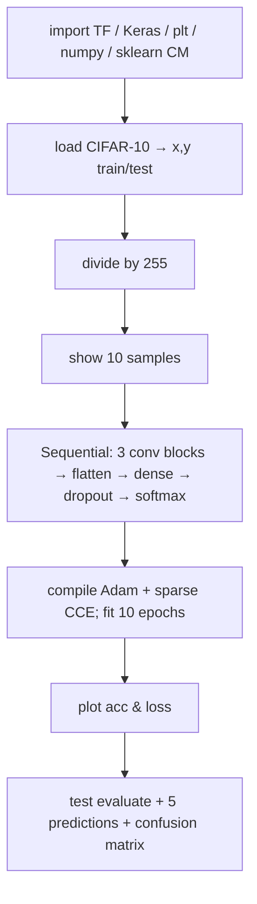

---

## 1. Imports

| Import | Why |
|--------|-----|
| `tensorflow as tf` | DL framework |
| `tensorflow.keras`: **`datasets`**, **`layers`**, **`models`** | CIFAR loader, layer types, Sequential |
| `matplotlib.pyplot as plt` | plots |
| `numpy as np` | arrays |
| `sklearn.metrics`: **`confusion_matrix`**, **`confusion_matrix_display`** | true vs predicted counts |

Keras `datasets` is how they pull a ready set (Kaggle / UCI are mentioned as the general idea; **this** notebook uses the built-in CIFAR loader).

---

## 2. Dataset: CIFAR-10

**CIFAR** = **Canadian Institute for Advanced Research**. **10 classes** of vehicles, animals, and birds:

**airplane, automobile, bird, cat, deer, dog, frog, horse, ship, truck.**

```python
(x_train, y_train), (x_test, y_test) = ...cifar10.load_data()
```

| Split | Contents |
|-------|----------|
| `x_train` | training **images** |
| `y_train` | training **labels** |
| `x_test` | test images |
| `y_test` | test labels (ground truth to compare with $\hat{y}$) |

### Normalization to $[0,1]$

RGB intensities are **$0$–$255$** ($256$ levels per channel). Learning on that range is “tedious.” Divide **train and test** by **$255$**:

- $0/255=0$, $255/255=1$, e.g. $100/255$ in between.

Toy $4\times 4$ sketch in the lecture uses values $100,50,10,250$ all mapped into $[0,1]$.

### Shapes (after `print(...shape)`)

| Split | Count | Spatial | Channels |
|-------|------:|---------|----------|
| Train | **$50{,}000$** | $32\times 32$ | $3$ (RGB) |
| Test | **$10{,}000$** | $32\times 32$ | $3$ |

---

## 3. Visualize 10 training images

- `plt.figure(figsize=(10, 5))` — width $10$, height $5$.
- Loop `i in range(10)` (indices $0$–$9$).
- `subplot`: **$2$ rows × $5$ columns**.
- Show `x_train[i]`; title = `class_names[y_train[i]]`.
- `plt.axis("off")` — no $x$/$y$ axis labels.
- Images called out: frog, truck (twice), deer, automobile (twice), horse, ship, cat.

---

## 4. Architecture (`Sequential` — stack layers)

A **basic** CNN can be one conv + pool + flatten + dense. Here they use **three conv blocks** because they can afford the compute / memory; filter count **rises** with depth (low-level → harder high-level features).

| Block | Layer | Filters / units | Kernel / pool | Activation | Extra |
|-------|-------|-----------------|---------------|------------|--------|
| 1 | `Conv2D` | **32** | **$3\times 3$** | **ReLU** | `input_shape=(32,32,3)` |
| 1 | `MaxPooling2D` | — | **$2\times 2$** | — | |
| 2 | `Conv2D` | **64** | $3\times 3$ | ReLU | |
| 2 | `MaxPooling2D` | — | $2\times 2$ | — | |
| 3 | `Conv2D` | **128** | $3\times 3$ | ReLU | |
| — | `Flatten` | — | — | — | matrix/tensor → 1-D |
| — | `Dense` | **128** | — | ReLU | hidden |
| — | `Dropout` | **$0.5$** | — | — | drop **50%** of units — **regularize**, fight **overfitting** |
| — | `Dense` | **10** | — | **softmax** | **10 classes ⇒ 10 neurons** |

Output width **equals** the number of classes (two classes would mean two neurons).

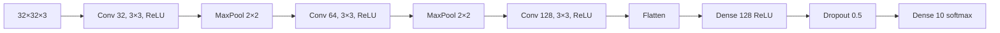

---

## 5. Board-sized walk-through (why each layer)

They re-teach conv/pool/ReLU/flatten/softmax on a **$5\times 5\times 3$** RGB toy (one **red** channel filled in: first row $10,2,1,0,2$) instead of $32\times 32$.

### Convolution / feature extraction

Filters detect points, shapes, textures, **edges**, lines. Deeper layers: extraction gets **harder** — that is why filters go **$32\to 64\to 128$**.

Named **edge operators** you could use as kernels: **Prewitt**, **Sobel**, **Canny**.

- **Sobel vertical:** pattern $1,2,1$ (vertical).
- **Sobel horizontal:**
  $$
  \begin{bmatrix}-1 & -2 & -1\\ 0 & 0 & 0\\ 1 & 2 & 1\end{bmatrix}
  $$
- Prewitt: separate **vertical** and **horizontal** $3\times 3$ masks (shown on the slide).

**Overlap the mask, multiply pixels, sum.** Vertical-Prewitt-style products on the first window: $-10+0+1-2+0+4+0+0+4$ → they reduce this to **$11$**. Slide with **stride $1$**: next windows share a $2$-pixel overlap, then $1,0,2,\ldots$ and so on. Result: a **feature map**, spatially **smaller** than $5\times 5$.

### Output size after conv (no pad, $s=1$)

$$
W_{\text{out}}=\frac{W_{\text{in}}-F+2P}{S}+1
$$

$5-3+0+1=3$ (same for height) → **$3\times 3\times 3$**. Padding with a **ring of zeros** would **preserve edges**; this toy uses $P=0$. Benefit: **less memory / time**, plus the features the kernel is designed for (vertical vs horizontal edges).

### Max pooling on the $3\times 3$ map

Pooling is again for **compute / memory**. Options: **max, average, min**; they use **max** (keep the most important response).

$2\times 2$ windows on a map that includes the $11$: maxima **$11$**, **$5$**, **$2$**, **$2$** → **$2\times 2\times 3$** (channels unchanged). **No padding** in pooling here (not extracting edges). Formula they used with stride $1$: $(3-2)/1+1=2$.

### ReLU on the pooled map

$\max(0,x)$: $11,5,2,2$ stay; a $-5$ would become **$0$**. Adds **nonlinearity** (negatives do not pass as negatives).

### Flatten → dense → softmax

Four values $11,5,2,2$ become features $x_1,\ldots,x_4$. Multiply by a **weight matrix** whose **rows match the number of inputs** and **columns match hidden neurons**. Cartoon hidden layer: **$2$** neurons ⇒ $W$ is $4\times 2$, bias $(b_1,b_2)$.

$$
z = W^{\top}x + b
$$

$z$ is **raw scores**, not probabilities. CIFAR head actually has **$10$** output neurons (10 classes). Softmax:

$$
p_i=\frac{e^{z_i}}{\sum_j e^{z_j}}
$$

Example logits $0.5,0.15,0.2,0.1,\ldots$ do **not** already sum to $1$; after softmax they do. **Argmax $p_i$** is the predicted class.

---

## 6. Compile and train

| Knob | Value | Why |
|------|-------|-----|
| Optimizer | **Adam** | |
| Loss | **sparse categorical cross-entropy** | 10 classes **encoded as integers** (e.g. automobile$\,\to 0$, truck$\,\to 1$, bird$\,\to 2$). Integers ⇒ **sparse** CCE, not one-hot CCE. **Binary** CE would be for **two** classes only |
| Metric | **accuracy** | train and validation |
| `epochs` | **10** | full passes over the data |
| `batch_size` | **64** | samples $0$–$63$: predict, loss, **update weights**; then $64$–$127$; … |
| `validation_split` | **$0.2$** | **80% / 20%** train / val from the training set |
| `verbose` | **1** | one progress line per epoch (`0` = silent, `2` = two lines) |

**Reported after 10 epochs:** training acc **$\approx 75\%$**, validation **$\approx 72\%$**. Gap is small ⇒ **not overfitting** in this run.

---

## 7. Curves

`figsize=(12, 5)`. Two subplots (`1,2,1` and `1,2,2`):

| Panel | Series | Labels |
|-------|--------|--------|
| **Model accuracy** | train + val acc | $x$=epoch, $y$=accuracy; legend **training** (blue) / **validation** (orange) |
| **Model loss** | train + val loss | $x$=epoch, $y$=loss |

**Observe:** both accuracies **rise** with epoch; val acc stays a bit under train ($\sim 72\%$ vs $\sim 75\%$). Both losses **fall**; val loss stays slightly **higher**.

---

## 8. Test set

$10{,}000$ images. `evaluate` on `(x_test, y_test)`:

| Test accuracy | Test loss |
|---------------|-----------|
| **$\approx 71\%$** | **$\approx 0.82$** |

### Five qualitative predictions

`predictions = model.predict(x_test)`. For `i in range(5)`: predicted label = **`argmax`** of that row’s 10 probabilities; actual = `y_test[i]`. Plot image, title “prediction vs actual”, axes off.

All five shown were **correct**: cat/cat, ship/ship, ship/ship, and the 4th and 5th also matched. The lecture stresses this **need not** hold for every test image.

---

## 9. Confusion matrix

`argmax` over `predictions` with `axis=1` (**columns** = predicted). True labels from `y_test` flattened to 1-D (default axis $0$ = rows).

`confusion_matrix(true, pred)` → `ConfusionMatrixDisplay` with **class names**, colormap **Blues**, `xticks_rotation=45` so names do not overlap. Title: **CNN CIFAR confusion matrix**.

$10$ classes ⇒ **$10\times 10$** matrix.

| Where | Meaning | Examples from the run |
|-------|---------|------------------------|
| **Diagonal** | correct | airplane→airplane **$815$**; automobile→automobile **$839$** |
| **Off-diagonal** | mistakes | true automobile, pred airplane **$35$**; true automobile, pred frog **$16$** |

Light blue = small counts, dark blue = large. Mostly dark diagonal + sparse off-diagonal matches the **$\sim 72\%$** accuracy.

### Why three conv blocks

More conv layers ⇒ **richer features** ⇒ easier prediction than a one-conv “basic” CNN.

### Key takeaways

- CIFAR-10: $50\mathrm{k}+10\mathrm{k}$ RGB $32\times 32$ images, 10 named classes; pixels **$/255$**.
- CNN: Conv32–pool, Conv64–pool, Conv128, flatten, Dense128 ReLU, **Dropout $0.5$**, Dense10 softmax.
- Adam + **sparse** CCE (integer labels) + accuracy; 10 epochs, batch 64, 20% val.
- This run: train $\sim 75\%$, val $\sim 72\%$, test $\sim 71\%$ / loss $0.82$; CM diagonal (e.g. $815$, $839$) vs off-diagonal errors ($35$, $16$, …).

---


\newpage

# L09: Practical exercise 2 — Ensemble models

**Video:** [Lec 09](https://www.youtube.com/watch?v=1zLfwJgBnOo) · 29:49

### Learning objectives

- Contrast **serial** vs **parallel** ensembling; implement **three CNNs in parallel** and **average** their probability vectors.
- Differentiate the three members: plain CNN, CNN + **batch normalization**, CNN + **dropout $0.5$**.
- Train each **5 epochs** (batch $64$, `validation_split=0.2`, Adam, sparse CCE) and compare **individual val acc** to **ensemble test acc $\approx 71\%$**.

This is the **ensemble-model hands-on** (same CIFAR-10 data as Practical 1, different models).

---

## Why ensemble

Take several models, run them **in parallel**, collect their predictions, then **average** (this lab) or **stack**. Averaging / majority vote is meant to **cut misclassifications** relative to any single model.

```mermaid
flowchart LR
    DATA["CIFAR-10 train/test"] --> M1[CNN]
    DATA --> M2[CNN + BatchNorm]
    DATA --> M3[CNN + Dropout 0.5]
    M1 --> P1[pred 1]
    M2 --> P2[pred 2]
    M3 --> P3[pred 3]
    P1 --> AVG["mean / majority"]
    P2 --> AVG
    P3 --> AVG
    AVG --> Y["y_pred = argmax"]
```

---

## 1. Imports (same stack as the CNN lab)

| Import | Role |
|--------|------|
| `tensorflow as tf` | build nets |
| Keras `datasets`, `layers`, `models` | CIFAR-10, layers, Sequential |
| `matplotlib.pyplot as plt` | plots |
| `numpy as np` | arrays |
| sklearn `confusion_matrix`, `confusion_matrix_display` | true vs predicted |
| later: `accuracy_score` from sklearn | ensemble accuracy |

---

## 2. Data — CIFAR-10 again

**Canadian Institute for Advanced Research**, **10** classes: vehicles, animals, birds.

**airplane, automobile, bird, cat, deer, dog, frog, horse, ship, truck.**

```python
(x_train, y_train), (x_test, y_test) = ...cifar10.load_data()
```

Images have intensities **$0$–$255$**. Normalize to **$[0,1]$** (they also mention $[-1,1]$ as a possible range; this notebook uses $0$–$1$ via **/ $255$**). Same numerical story as Lec 08: $0/255=0$, $255/255=1$.

| Split | Samples | Shape |
|-------|--------:|-------|
| Train | **$50{,}000$** | $32\times 32\times 3$ (W, H, RGB) |
| Test | **$10{,}000$** | $32\times 32\times 3$ |

---

## 3. Parallel ensemble — cartoon vote

$N\ge 2$ models; here **$N=3$**: `model1`, `model2`, `model3`. **Same** train and test tensors go to all three.

Index-$0$ test image example:

| Model | Prediction |
|-------|------------|
| 1 | **truck** |
| 2 | automobile |
| 3 | **truck** |

**Majority = truck** → final label truck. One model alone might err more often; three votes **stabilize**.

### How the three CNNs differ

All are **custom CNNs**. Regularizers differ:

| Model | Extra | Intent |
|-------|--------|--------|
| **1** | plain conv–pool–dense | baseline customized CNN (same *idea* as Practical 1) |
| **2** | **batch normalization** | regularize, **generalize**, reduce **overfitting** |
| **3** | **dropout** | drop the effect of some neurons so they do **not memorize** training patterns |

---

## 4. Model 1 — two-block CNN

Sequential.

| Step | Spec |
|------|------|
| `Conv2D` | **32** filters, **$3\times 3$**, **ReLU**, `input_shape=(32,32,3)` |
| `MaxPooling2D` | **$2\times 2$** |
| `Conv2D` | **64** filters, $3\times 3$, ReLU (high-level features; $32$ was low-level) |
| `MaxPooling2D` | $2\times 2$ |
| `Flatten` | $32\times 32$ grid / pooled maps → **1-D** features $x_1,x_2,\ldots$ |
| `Dense` | **128**, ReLU |
| `Dense` | **10**, **softmax** (10 classes; softmax because **$>2$** classes) |

**Conv** = feature extraction (max in the window = most contributing pixel intensity). Flatten exists so $W x+b$ can produce **raw scores**, then softmax probabilities.

---

## 5. Model 2 — CNN + batch normalization

Sequential, **two** repeats of:

**Conv → BatchNormalization → ReLU → MaxPool**

Then flatten → Dense **128** → Dense **10**.

The **only** structural add vs model 1 is **batch norm**.

### What batch norm does (lecture formula)

On a pooled / activated $2\times 2$ patch with values e.g. $2,10,3,4$:

$$
x_{\text{norm}} = \frac{x-\mu}{\sigma}
$$

$\mu$ = mean of those four values, $\sigma$ = their standard deviation. Every activation is mapped into a **fixed range**.

**Why:** data become more **Gaussian / bell-shaped** (few outliers). Fewer outliers ⇒ **fewer misclassifications**. Lecture summary: BN targets **zero-mean, unit-variance** style scaling — a more **regularized / generalized** net.

---

## 6. Model 3 — CNN + dropout $0.5$

Sequential: conv → max pool → conv → max pool → flatten → Dense **128** → **dropout** → Dense **10**.

**Dropout:** in a fully connected hidden stack, every neuron talks to every neuron in the next layer ($A$ feeds $D,E,F$, …). Those units **memorize training patterns** and fail on unseen data.

Dropout **removes connections**. Cartoon: from $10$ connections, drop $5$ = **$50\%$ dropout**. Dense **128** is thinned by half during training — neurons **deactivated**, less memorization, more **generalization**.

---

## 7. Compile (all three)

Put the three models in a list / loop and compile each:

| Knob | Value |
|------|-------|
| Optimizer | **Adam** |
| Loss | **sparse categorical cross-entropy** |
| Metric | **accuracy** |

**Why sparse:** classes are **integers $0$–$9$** (automobile$\,\to 0$, truck$\,\to 1$, …). A computer does not need the English names. If labels were one-hot and $C>2$, use **categorical** CE; if **two** classes, **binary** CE.

---

## 8. Train each model separately

Same recipe for model 1, 2, and 3:

| Knob | Value | Notes |
|------|-------|--------|
| Data | `x_train`, `y_train` | |
| `epochs` | **5** | you *may* use more; five is for a short demo |
| `batch_size` | **64** | $50\mathrm{k}$ images are **not** one giant update; update after every 64 samples, pass new weights to the next batch |
| `validation_split` | **$0.2$** | 20% of training held out |

You see **epochs 1–5 three times** (once per model).

**Validation accuracy at epoch 5 (this run):**

| Model | Val acc | Comment |
|-------|---------|---------|
| 1 (plain) | **$\approx 67\%$** | |
| 2 (batch norm) | **$\approx 68\%$** | BN **most effective** of the three |
| 3 (dropout) | **$\approx 61\%$** | weakest single model here |

---

## 9. Average the three test predictions

```text
pred1 = model1.predict(x_test)
pred2 = model2.predict(x_test)
pred3 = model3.predict(x_test)
ensemble_pred = (pred1 + pred2 + pred3) / 3    # mean = majority-in-probability
y_pred = argmax(ensemble_pred)                 # index of largest of 10 probs
```

Each row is 10 class probabilities. **Argmax** = class id (automobile, truck, …).

### Ensemble accuracy

`accuracy_score(y_test, y_pred)` → **$0.7114$ ($\approx 71\%$)**.

That is **higher than 67 / 68 / 61**. Averaging over all test images beats every member.

---

## 10. Confusion matrix

`confusion_matrix(y_test, y_pred)` — true labels vs **ensemble** predictions. Colormap **Blues**.

This lab labels axes with **integers $0$–$9$**, not English class names, to show the matrix still works that way (and to match **sparse** CCE).

| Axis | Content |
|------|---------|
| Rows (axis 0) | **true** class $0$–$9$ |
| Columns (`axis=1`) | **predicted** class $0$–$9$ |

**Diagonal = correct.** Lecture counts: class $0\to 0$ **$805$** (spoken “8.5”); class $1\to 1$ **$839$**; class $2\to 2$ **$547$**.

**Off-diagonal = errors.** Examples: $0$ predicted as $1$: **$19$**; class $2$ predicted as class $5$: **$73$**. Sum of off-diagonals = misclassifications (drives loss). Light blue = small, dark blue = large.

Most mass on the diagonal ⇒ accuracy **$71\%>50\%$**.

### Key takeaways

- Parallel ensemble: three CIFAR CNNs, **average softmax vectors**, then argmax.
- Members: (1) two-block CNN, (2) same idea + **batch norm** ($\frac{x-\mu}{\sigma}$), (3) CNN + **$50\%$ dropout**.
- Train **5** epochs, batch **64**, val **$20\%$**, Adam, **sparse** CCE, accuracy.
- This run: val **$67\% / 68\% / 61\%$**; ensemble test **$71.14\%$** — fewer mistakes than any one model.

---


\newpage
