# Volume 02 — Autoencoders

**Lec 10–18** · Transcript-grounded notes (notes-2)

These notes follow the official NPTEL lecture videos. They are not the condensed 36-lecture mapping in `notes/`.

---

# L10: Introduction to Autoencoder

**Video:** [Lec 10](https://www.youtube.com/watch?v=aBauhB6K0jg) · 34:48  
**Instructor in this lecture:** Prof. Ashwini Kodipalli

### Learning objectives

- Place autoencoders in week 2 as **representation learning**, after week 1’s activations, losses, optimizers, and CNNs.
- Contrast **supervised** $x \mapsto y$ mapping with **unsupervised** learning from unlabeled $x$ only.
- Name the three AE blocks—**encoder**, **latent code**, **decoder**—and the two objectives: representation learning and reconstruction.
- Walk a fully connected encoder/decoder on tabular data: $100 \to 75 \to 25 \to 75 \to 100$.
- Distinguish **undercomplete** vs **overcomplete** latent spaces, including the identity-mapping failure mode.

### Week 2 agenda (as stated in lecture)

Week 2 is autoencoders. The announced sequence is:

1. Introduction and architecture (this lecture)
2. How the autoencoder works in detail
3. **Undercomplete** vs **overcomplete** latent space
4. **Reconstruction loss**
5. Types: **simple / shallow**, **deep**, and **CNN** autoencoders
6. Regularization: **denoising**, **sparse**, **contractive**
7. One **numerical example**
8. **Limitations** of autoencoders (why a VAE is needed)
9. Hands-on on the types of autoencoders

Today’s session only: *why* autoencoders, the three-block architecture, then undercomplete vs overcomplete.

---

## From supervised nets to unlabeled data

Week 1 reviewed ANN, CNN, RNN-style models. Those are **supervised**: every sample has a label. The running picture is a labeled dataset—input $x$ and target $y$. The model’s job is to learn the **mapping** $x \mapsto y$.

When labels are missing, the problem is **unsupervised**. The lecture’s table is **age, height, weight** with no class column. The model must learn **directly from $x$**: hidden patterns, correlations among features, and the structure of the data.

Unsupervised learning in general discovers patterns in unlabeled data. Autoencoders are a **special category**: they learn a **meaningful representation** of $x$ so that they can **reconstruct their own inputs**.

An autoencoder is therefore an **unsupervised deep learning model** whose headline job is representation learning, with reconstruction as the check that the representation is useful.

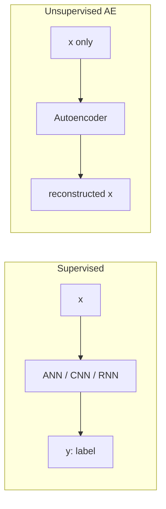

---

## Three components: encoder, latent code, decoder

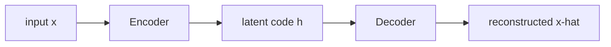

| Block | Role |
|-------|------|
| **Encoder** | Learns the most important features of $x$. Output is a **smaller internal representation**. |
| **Latent code** $h$ | That compact representation (also: encoded data, latent representation, hidden representation). |
| **Decoder** | Maps $h$ back toward the original input. Output is $\hat{x}$ (not called $x$, because it is reconstructed). |

Working order:

1. Pass $x$ into the encoder.
2. Encoder compresses $x$ into $h$.
3. Pass $h$ into the decoder.
4. Decoder reconstructs $\hat{x}$.

### Two objectives

| Objective | Who does it | Meaning |
|-----------|-------------|---------|
| **Representation learning** | Encoder | Compact, important features of $x$ |
| **Reconstruction learning** | Decoder | Recover the original input **from $h$**, not by copying pixels/values |

If $h$ really captured structure, $\hat{x}$ will look like $x$. If $h$ is a poor code, reconstruction fails. So $h$ is the hinge of the whole model: $x \to h \to \hat{x}$.

---

## Encoder in detail (tabular MLP example)

The lecture uses **tabular** data (rows and columns), so both encoder and decoder are **multi-layer perceptrons** (fully connected).

Running sizes (chosen only to explain the idea; 25 is a **hyperparameter**, not a law):

$$
100 \;\to\; 75 \;\to\; 25
$$

Input $x$ has **100 features**. First hidden layer $H_1$ has **75 neurons**. Second hidden layer $H_2$ has **25 neurons**. The output of $H_2$ **is** the latent code.

### Fully connected first layer

Every one of the 100 inputs connects to every one of the 75 neurons. Each neuron does the usual deep-learning pair: **weighted sum + activation**.

After $H_1$ you have 75 numbers—not because 25 features were deleted, but because the **same 100 features were compressed**. Every hidden neuron sees **all** inputs. Nothing is dropped; the representation is smaller.

### Second layer: 75 → 25

Every one of the 75 activations connects to every one of the 25 neurons. Again: summation and activation. Output: 25 numbers. Again, this is **compression**, not deletion.

That 25-dimensional vector is $h$: encoded data / latent code / latent representation. The encoder’s job in one sentence: **map $x$ to a lower-dimensional latent representation by progressively reducing the number of hidden neurons**.

$$
100 \;\to\; 75 \;\to\; 25 = h
$$

Because the bottleneck is only 25, the encoder is **forced** to keep the most important features. That is representation learning. The latent size is a **hyperparameter**: you choose it when you design the encoder.

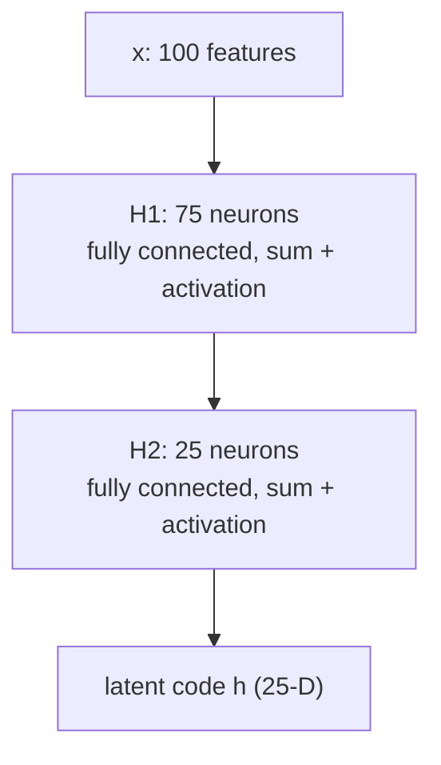

---

## Decoder in detail (mirror expansion)

Decoder is also an MLP on this tabular example. Input to the decoder is the **25-D latent code**.

$$
25 \;\to\; 75 \;\to\; 100 = \hat{x}
$$

First decoder hidden layer: **75 neurons**. Every latent unit connects to every one of those 75. Summation + activation. You now have 75 numbers. This is **expansion**, not insertion of extra raw features: each of the 75 outputs is a **combination** of all 25 latent values (times weights, plus bias).

Next layer: **100 neurons**—the original feature count. Fully connected from 75, summation + activation. The 100 outputs are the **reconstructed** vector $\hat{x}$.

The decoder does **not** copy $x$. It only ever sees $h$. It reconstructs by **progressively increasing** hidden width until the last layer matches $\dim(x)$.

If $h$ captured the important structure, $\hat{x}$ will be similar to $x$. That is reconstruction learning.

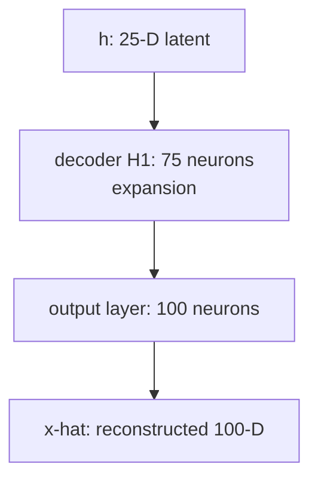

### End-to-end map

$$
x \;\xrightarrow{\text{encoder}}\; h \;\xrightarrow{\text{decoder}}\; \hat{x}
$$

Notation in the lecture: encoder maps $x$ to hidden representation $h$; decoder maps $h$ back to $\hat{x}$. The whole aim is $x_i \to h \to \hat{x}_i$, so **$h$ is the object that must be good**.

---

## Undercomplete vs overcomplete

Is $\dim(h) < \dim(x)$ mandatory? No. Both designs exist.

| Type | Latent size | What the lecture wants you to remember |
|------|-------------|----------------------------------------|
| **Undercomplete** | $\dim(h) < \dim(x)$ | Bottleneck **enforces** important-feature learning. If you can still reconstruct, $h$ is a compact, essentially **loss-free encoding** of $x$. |
| **Overcomplete** | $\dim(h) \ge \dim(x)$ | Easy **trivial / identity mapping**: copy $x$ into $h$, pad remaining units with **zeros**, then copy back. **No** useful representation learning. |

### Undercomplete (preferred in practice)

The 100→25 example is undercomplete. Reconstructing from a **smaller** $h$ is evidence that $h$ kept what mattered. This is the architecture the lecture says you should use for real problems and for hands-on work.

### Overcomplete and trivial learning

Suppose $x$ has 4 (or 6) features and $h$ is **larger**. A cheap solution: copy the original coordinates into $h$ and set the extra coordinates to 0, then drop them on the way back. That is an **identical mapping** $x \to h \to \hat{x}$ with **no** good representation.

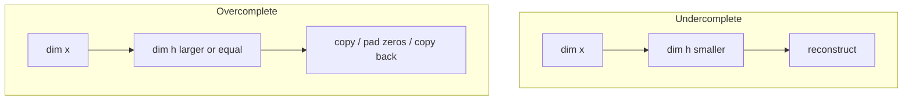

**Punchline:** in applications, design **undercomplete** autoencoders so $\dim(h)$ is smaller than $\dim(x)$.

---

## What the next lecture will add

The decoder has produced $\hat{x}$. The remaining question is **how close** $\hat{x}$ is to $x$—the **loss**. That is reconstruction loss, next session.

### Key takeaways

- Autoencoders are unsupervised **representation learners** that reconstruct their own $x$; they are not $x \mapsto y$ classifiers.
- Encoder compresses $x$ to latent $h$; decoder expands $h$ to $\hat{x}$. Compression is **not** deletion of features.
- Two objectives: **representation learning** (encoder) and **reconstruction learning** (decoder).
- Tabular example: $100 \to 75 \to 25 \to 75 \to 100$, fully connected, sum + activation at each neuron. Latent size is a hyperparameter.
- **Undercomplete** ($\dim(h) < \dim(x)$) forces useful features. **Overcomplete** ($\dim(h) \ge \dim(x)$) risks copying $x$ and padding zeros.

---


\newpage

# L11: Reconstruction Loss (MSE, Binary Cross-Entropy)

**Video:** [Lec 11](https://www.youtube.com/watch?v=FyL6UTURU4c) · 39:03  
**Instructor in this lecture:** Prof. Ashwini Kodipalli

### Learning objectives

- Write the encoder/decoder maps $h = G(x W_E)$ and $\hat{x} = F(h W_D)$ with shapes for a $1000 \times 6$ example.
- Contrast **generic** weights ($W_E$ and $W_D$ both learned) with the **tied-weight** assumption $W_D = W^\top$.
- Choose **output activation** from the feature type: sigmoid for binary, linear for continuous.
- Derive **MSE** reconstruction loss for real-valued $x$ and **binary cross-entropy** for $0/1$ features, including why BCE has a leading minus.
- Add a **weight regularizer** so $W$ stays small; after training, $W^\star$ yields a good $h^\star$ and an $\hat{x}$ close to $x$.

### What this lecture is *not*

CNN autoencoders are only **previewed** at the end (conv encoder, upsample / transpose-conv decoder). Types of AE are the next video.

---

## Setup: a one-hidden-layer autoencoder

The math is shown on a **simple** AE: one hidden layer whose output **is** the latent code, then one output layer as the decoder.

Running shapes:

| Object | Shape | Meaning |
|--------|-------|---------|
| Input $X$ | $1000 \times 6$ | 1000 samples, 6 features |
| Latent $H$ | $1000 \times 3$ | same 1000 samples, 3-D code (undercomplete) |
| Encoder weights $W_E$ | $6 \times 3$ | maps $\mathbb{R}^6 \to \mathbb{R}^3$ |
| Decoder weights $W_D$ | $3 \times 6$ | maps $\mathbb{R}^3 \to \mathbb{R}^6$ |
| Reconstruction $\hat{X}$ | $1000 \times 6$ | 6 features back |

Fully connected: each of the 6 inputs connects to all 3 hidden units.

Bias is present in a real net; the lecture **drops bias** here so the products stay readable.

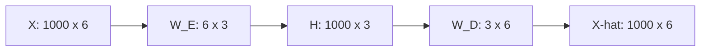

---

## Encoder and decoder equations

Hidden activation $G$, output activation $F$:

$$
h = G(x\, W_E)
$$

$$
\hat{x} = F(h\, W_D)
$$

If $X$ is $1000\times 6$ and $H$ must be $1000\times 3$, then $W_E$ **must** be $6\times 3$. Role of $W_E$: map an input vector in $\mathbb{R}^6$ to $\mathbb{R}^3$.

If $H$ is $1000\times 3$ and $\hat{X}$ must be $1000\times 6$, then $W_D$ **must** be $3\times 6$. Role of $W_D$: map the latent vector in $\mathbb{R}^3$ back to $\mathbb{R}^6$.

---

## Generic weights vs tied weights

$W_E$ is $6\times 3$ and $W_D$ is $3\times 6$: **shapes** are transposes of each other. The **entries need not** be transposes. If you train both matrices, backpropagation learns **two** parameter sets.

| Setting | What is learned | Cost |
|---------|-----------------|------|
| **Generic** | $W_E$ **and** $W_D$ | More parameters, slower training |
| **Tied weights** | Learn only $W$ ($= W_E$); set $W_D = W^\top$ | Same shapes as needed for decode; **one** matrix to train |

Tied-weight assumption: learn $W_E$ only; for the decoder, **take the transpose**. That is enough because $(6\times 3)^\top = 3\times 6$. Complexity of the model drops.

For the rest of the MSE derivation the lecture writes $W_E$ as $W$ and $W_D$ as $W^\top$.

---

## Activations: binary vs continuous features

Choose $F$ (output) from **what you must reconstruct**. Hidden $G$ is almost always **nonlinear**.

### Binary features (all $x_j \in \{0,1\}$)

Decoder must emit values in $[0,1]$. **Output = sigmoid.**

$$
\sigma(a) = \frac{1}{1+e^{-a}}, \qquad
\hat{x} = \sigma(h\, W_D)
$$

Threshold language in the lecture: value $> 0.5$ treated as 1, $< 0.5$ as 0.

**Hidden $G$:** ReLU **or** sigmoid.

### Continuous / real-valued features

Example row: $2.5,\; 7.3,\; 6.9,\; 11.4$. Reconstruction should come back near those reals (the lecture’s sketch: something like $2.1,\; 6.4,\; 6.9,\; 6.1,\; 10.7$—close, not magically exact).

**Output = linear:**

$$
F(a) = a
$$

**Hidden $G$:** ReLU, sigmoid, or **tanh**, depending on the architecture.

| Input features | Output activation $F$ | Hidden $G$ |
|----------------|----------------------|------------|
| Binary $0/1$ | **Sigmoid** | ReLU or sigmoid |
| Continuous | **Linear** | ReLU / sigmoid / tanh |

---

## MSE reconstruction loss (real-valued $x$)

Ideal requirement: $\hat{x}_i = x_i$. In practice: **approximately** equal. There are **no labels**; the **reference is $x$ itself**. Minimize the difference between original and reconstructed input.

**Per-sample** loss (square so a negative residual still costs):

$$
\ell_i = (x_i - \hat{x}_i)^2
$$

**Average** over $m$ samples:

$$
L = \frac{1}{m}\sum_{i=1}^{m} \ell_i
$$

The object that makes this small is the weight matrix. Under tied weights you only need one $W$.

Substitute $\hat{x} = h\, W_D$, $W_D = W^\top$, $h = x\, W$:

$$
\hat{x} = (x\, W)\, W^\top
$$

The reconstruction error is then the mismatch between $x$ and that product, and training should find an $W$ that **minimizes** it.

### $L_2$ regularizer on $W$

Entries of $W$ can be large or small and still fit. The lecture **adds a regularization term** so those entries stay **small**. Example: multiply by $\lambda = 0.01$. Small $\lambda$ scales the matrix down. Intuition: keep $W$ small while still shrinking $\|x - \hat{x}\|$.

After training you have $W^\star$. Then:

$$
h^\star = x\, W^\star
$$

is the **optimized** latent code (important features), and

$$
\hat{x} = h^\star (W^\star)^\top
$$

is a reconstruction **close** to $x$, because $W^\star$ was chosen to shrink that gap under backpropagation.

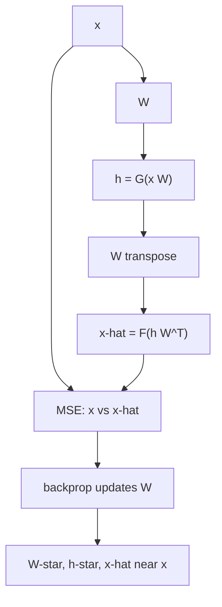

---

## Binary cross-entropy (binary features)

Do **not** use MSE when features are $0/1$. Output is sigmoid, so $\hat{x}$ is a **probability** in $(0,1)$.

Lecture sketch of targets vs predictions: original $1$ with $\hat{x}=0.92$; original $0$; original $1$; original $1$; original $0$ with $\hat{x}=0.12$. Compare those with **BCE**, not squared error.

**Per-sample** BCE (one feature shown; extend across $D$ features of sample $i$):

$$
\ell_i = -\Big( x_i \log \hat{x}_i + (1-x_i)\log(1-\hat{x}_i) \Big)
$$

### Why the minus sign

In MSE, squaring made the cost non-negative. You cannot square BCE the same way.

- $\hat{x}$ is a probability in $(0,1)$.
- $\log$ of a number in $(0,1)$ is **negative**.
- The inner expression is therefore negative.
- Multiply by $-1$ so the **loss is positive**.

$i$ indexes the **sample**. One sample with $D$ features is $x_{i1},\ldots,x_{iD}$. Over $n$ samples:

$$
L = \frac{1}{n}\sum_{i=1}^{n} \ell_i
$$

(with the same minus-and-log form inside, summed over features). Minimize this in $W$, again with a regularizer so $W$ stays small.

| Feature type | Loss | Why |
|--------------|------|-----|
| Real-valued / continuous | **MSE** | Compare $x$ and $\hat{x}$ in Euclidean sense; square kills the sign |
| Binary $0/1$ | **BCE** | Compare $0/1$ targets to sigmoid probabilities; minus flips $\log p < 0$ |

Both are **reconstruction** losses: the “label” is the original $x$.

---

## Recap diagram and data type → architecture

Latent size is a **hyperparameter** (the recap slide used size **2**). Encoder produces $h$ (or $z$); decoder produces $\hat{x}$. For **tabular** data, encoder and decoder are MLPs. Loss for that recap: MSE on $x$ vs $\hat{x}$.

This course’s AE track is **tabular and images only** (not audio/video).

| Data | Encoder | Decoder | Typical output act. / loss |
|------|---------|---------|----------------------------|
| Tabular | MLP | MLP | linear + MSE, or sigmoid + BCE |
| Images | **Convolution** (feature extraction) | **Upsampling** or **transposed convolution** (CNN AE) | sigmoid if pixels in $\{0,1\}$ / $[0,1]$ |

Next lecture starts from images: CNN autoencoder, then shallow vs deep.

### Key takeaways

- $h = G(x W_E)$, $\hat{x} = F(h W_D)$; for $1000\times 6 \to 1000\times 3$, $W_E$ is $6\times 3$ and $W_D$ is $3\times 6$.
- **Generic:** learn both matrices. **Tied:** learn $W$, decode with $W^\top$.
- Binary $x$: sigmoid out, **BCE**. Continuous $x$: linear out, **MSE**. Hidden: nonlinear (ReLU / sigmoid / tanh).
- Autoencoders have no class labels; reconstruction loss compares $\hat{x}$ to $x$.
- Regularize $W$ (example $\lambda=0.01$) so weights stay small; $W^\star$ gives a useful $h^\star$ and $\hat{x}\approx x$.

---


\newpage

# L12: Types of Autoencoders

**Video:** [Lec 12](https://www.youtube.com/watch?v=vo2z-cWDLGE) · 39:39  
**Instructor in this lecture:** Prof. Ashwini Kodipalli

### Learning objectives

- Build a **CNN autoencoder** for images: conv + max-pool encoder, upsample-then-conv decoder, ending in sigmoid for binary pixels.
- Compute the lecture’s **28×28×1** Keras stack down to a **7×7×256** latent code and back.
- Contrast **nearest-neighbor / bed-of-nails** upsampling with **transposed convolution**, including the **checkerboard** artifact and why AE decoders prefer upsample + convolution.
- Code a **shallow** AE ($784\to 32\to 784$) and a **deep** AE ($784\to 128\to 64\to 32\to 64\to 128\to 784$).
- Explain why flattening a $28\times 28$ image into 784 and using a deep MLP AE **loses spatial structure**.

---

## Why start with CNN AEs

L10–L11 used **tabular** $x$, so encoder and decoder were MLPs. If $x$ is an **image**, the AE is **CNN-based**. Recap from week 1 CNN: convolution extracts features; pooling reduces **spatial** size. Types covered today: CNN AE, then **shallow**, then **deep**.

Every AE still has encoder, latent code, decoder. Only the **layer types** change with the data.

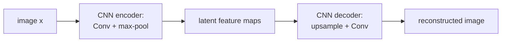

---

## CNN encoder

- **Conv** layers: extract features.
- **Pooling:** reduce spatial size. Pooling kinds from week 1: max, min, average. In autoencoders the lecture uses **max pooling**.
- Latent code = output of the **last conv** in the encoder: compressed maps that hold the important features.

Decoder cannot stay an MLP. It must **upsample** back to the input size (example: latent $7\times 7$ back to $28\times 28$) using **transposed convolution** (deconvolution) and/or explicit upsampling.

---

## Keras walk-through: $28\times 28\times 1$

Binary image: height $28$, width $28$, **1 channel**. Implemented with Keras `Conv2D`. Function name in the lecture: `conv_autoencoder`.

**Padding = `'same'`** keeps spatial size through convolution. **ReLU** after encoder/decoder convs (except the last output).

| Stage | Operation | Output shape |
|-------|-----------|----------------|
| Input | image | $28\times 28\times 1$ |
| Conv2D | 64 kernels, $3\times 3$, ReLU, `padding='same'` | $28\times 28\times 64$ |
| MaxPool | window $2\times 2$ | $14\times 14\times 64$ |
| Conv2D | 128 kernels, $3\times 3$, ReLU, `same` | $14\times 14\times 128$ |
| MaxPool | $2\times 2$ | $7\times 7\times 128$ |
| Conv2D | 256 kernels, `same` | $7\times 7\times 256$ **(latent)** |

$28\to 14\to 7$: two $2\times 2$ pools. Latent spatial size is **$7\times 7$** with **256** maps—compressed relative to $28\times 28$.

---

## Upsampling methods (decoder)

Need $7\times 7 \to 28\times 28$. The lecture first explains **how** you enlarge a map.

### 1. Nearest-neighbor upsampling

Toy input $X$ is $2\times 2$: values $1,2,3,4$. Upsampling factor $s=2$: **each** value is expanded to a $2\times 2$ block. Output is $4\times 4$. **Nearest neighbor** = copy the original value into every cell of its block.

### 2. Bed-of-nails / zero insertion

Same geometry, but fill the new cells with **0** instead of copying.

**Drawback of both:** no **learnable** parameters. Growing $7\times 7$ to $14\times 14$ with $s=2$ is just placing values. The model does not learn the upsample.

### 3. Transposed convolution

Input $2\times 2$:

$$
\begin{bmatrix} 1 & 2 \\ 0 & 1 \end{bmatrix}
$$

Kernel $2\times 2$:

$$
\begin{bmatrix} 4 & 3 \\ 2 & 1 \end{bmatrix}
$$

Output spatial size:

$$
\text{out} = \text{in} + \text{kernel} - 1 = 2+2-1 = 3
$$

so a $3\times 3$ map (zeros first, then scatter-add).

Place each input scalar times the whole kernel at that input’s location:

| Contribution | Where | Result (as taught) |
|--------------|--------|---------------------|
| $G_1$ | $1$ at top-left | $1\cdot[4,3;2,1]$ → $4,3,2,1$ in the top-left $2\times 2$ |
| $G_2$ | $2$ at top-right | $2\cdot 4=8$, $2\cdot 3=6$, $2\cdot 2=4$, $2\cdot 1=2$ |
| $G_3$, $G_4$ | remaining two inputs × kernel | two more $3\times 3$ maps |

**Transposed convolution** = **element-wise add** of $G_1+G_2+G_3+G_4$. Spoken partial sums: top-left $4$; next cell $3+8=11$; next $6$; a later cell $1+4+0+4=9$.

The **kernel is learned** (starts random, updates in backprop). $2\times 2 \to 3\times 3$ is a real upsample with parameters—better than copy/zeros.

### Checkerboard artifacts

Problem: some summed cells are **very large**, others **very small**. On an image that looks like a **grid** of alternating bright/dark squares. Cause: the kernel **overlaps unevenly**—some input regions are hit many times, some once. These are **systematic artifacts of the op**, not added noise.

### Fix used in AE decoders: upsample, then conv

1. Upsample (nearest neighbor **or** zero insertion) so values are spread **uniformly**.
2. Apply a **ordinary convolution** so the kernel walks the map evenly.

Same toy input $[1,2;0,1]$ and kernel $[4,3;2,1]$: after upsample+conv the lecture’s result is more **evenly** distributed (not a few huge cells and a few tiny ones). Overlap is uniform, so checkerboard is avoided.

**Rule for this course’s CNN AE:** decoder = **upsampling then convolution**, not raw transposed conv alone.

---

## CNN decoder matching the $7\times 7\times 256$ code

| Stage | Operation | Output shape |
|-------|-----------|----------------|
| Latent | from encoder | $7\times 7\times 256$ |
| Upsample | factor $2\times 2$ | $14\times 14\times 256$ |
| Conv | 128 kernels | $14\times 14\times 128$ |
| Upsample | factor $2$ | $28\times 28\times 128$ |
| Conv | 64 kernels | $28\times 28\times 64$ |
| Conv | **1** kernel, $3\times 3$, `padding='same'` | $28\times 28\times 1$ |

Last conv is required to collapse **64 channels → 1** so the tensor matches $28\times 28\times 1$.

**Output activation: sigmoid**, because the input is binary $0/1$; reconstruction must lie in $[0,1]$.

You can plot latent maps and reconstructions in the later hands-on.

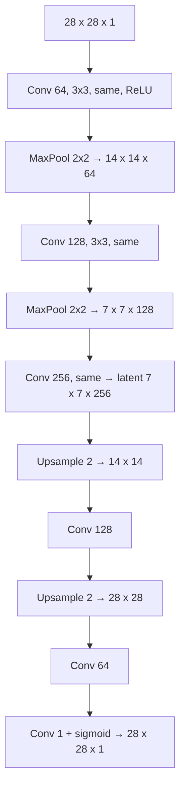

---

## Latent size is a hyperparameter (image quality)

How small you compress is set in code.

| Latent size | Reconstruction |
|-------------|----------------|
| **Too small** | Over-compression; important information is compromised; reconstruction is **too blurry** |
| **Moderately larger** (still $<$ input) | Better compressed code; **sharper** reconstructions |
| **Too large** (past a point) | Quality **deteriorates** (diminishing / worse images) |

Tune the latent dimensionality; do not collapse it, and do not grow it without limit.

---

## Shallow autoencoder

**Shallow** = **one hidden layer** between input and output. That hidden layer **is** the latent code.

MNIST-shaped vector example:

$$
784 \;\xrightarrow{\text{ReLU}}\; 32 \;\xrightarrow{\text{sigmoid}}\; 784
$$

- Input 784 (e.g. flattened $28\times 28$).
- Hidden: **32** neurons, ReLU → encoded length 32.
- Output: **784** neurons, **sigmoid**.

**Why sigmoid at the output**

- If raw features are binary, outputs should be binary-valued in $[0,1]$.
- If **preprocessing scaled** features to $[0,1]$ (normalization), outputs must match that range → still sigmoid, and loss is **BCE**.
- If features stay **real-valued** / you used **standardization** (not $0$–$1$ scaling) → **linear** output and **MSE**.

The reconstructed range must match the input range.

---

## Deep autoencoder

**Deep** = **several** hidden layers. Encoder widths **decrease**; decoder widths **increase**. Last encoder layer is the latent code.

Lecture sizes:

$$
784 \to 128 \to 64 \to 32 \;\to\; 64 \to 128 \to 784
$$

Code-level (dense layers, store activations back into `x`):

1. Input 784 → Dense 128, ReLU  
2. → Dense 64, ReLU  
3. → Dense 32, ReLU  **(latent)**  
4. → Dense 64, ReLU  
5. → Dense 128, ReLU  
6. → Dense 784, **sigmoid** if scaled to $[0,1]$; **linear** if real-valued / standardized  

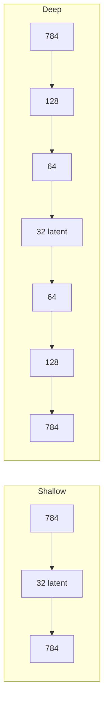

---

## Do not use a deep MLP AE on images

Can you flatten $28\times 28\times 1$ to 784 and run the deep AE? **No** for images.

Flattening **destroys spatial information**. Side-by-side in the lecture (red highlights): CNN reconstructions keep **sharp** features; the deep MLP blurs edges. A mark on a **T-shirt** is kept by the CNN AE and lost by the deep AE.

| Model on images | What happens |
|-----------------|--------------|
| Deep / shallow **MLP** AE | Flattening drops **edges, contours, shapes**; spatial relations are gone |
| **CNN** AE | Convolution keeps **local spatial structure** (edges, textures, shapes); decoder uses learned feature maps |

**Rule:** images → CNN autoencoder. Tabular data → shallow **or** deep MLP AE.

---

## Next: regularization

AEs can **overfit**. Week 1 already had L1/L2, dropout, early stopping, batch norm (for images). Next lectures ask whether AEs need **extra** regularizers: denoising, sparse, contractive.

### Key takeaways

- Image AE: encoder = conv + **max-pool**; decoder = **upsample then conv**; last layer **sigmoid** if pixels are $0/1$.
- Example stack: $28\times 28\times 1$ → … → latent $7\times 7\times 256$ → … → $28\times 28\times 1$.
- Nearest-neighbor / bed-of-nails upsample have **no** learned params. Transposed conv learns a kernel but can make **checkerboard** artifacts; prefer upsample + conv.
- Shallow: one hidden layer ($784\to 32\to 784$). Deep: stacked bottlenecks ($784\to 128\to 64\to 32\to \cdots \to 784$).
- Flattening images for an MLP AE loses spatial structure; use a CNN AE.

---


\newpage

# L13: Denoising Autoencoder

**Video:** [Lec 13](https://www.youtube.com/watch?v=q3XAdXdqz8s) · 42:36  
**Instructor in this lecture:** Prof. Ashwini Kodipalli

### Learning objectives

- Say why AEs need **regularization**, especially in the **overcomplete** identity-mapping case.
- Draw the DAE pipeline: corrupt $x \to \tilde{x}$, encode, decode, compare $\hat{x}$ to the **clean** $x$ (never to $\tilde{x}$).
- Name three corruption recipes: **Gaussian**, **masking** ($q=0.4$), **salt-and-pepper**, with the lecture’s numbers.
- Explain **neighboring-pixel dependence** as the reason a DAE can fill missing pixels (toy counts / means vs real **conv** filters).
- Write the DAE equations and training objective (MSE or BCE on clean $x$ vs $\hat{x}$).

This lecture is **only** denoising. Sparse and contractive are later videos.

---

## Recap, then why regularize

Standard AE (bias included this time):

$$
h = G(W_E x + b_E)
$$

$G$ is **nonlinear** on the encoder. Decoder last layer:

$$
\hat{x} = F(W_D h + b_D)
$$

$F$ is chosen from the output type. Intermediate decoder hidden layers: **ReLU**. Train by shrinking the gap between $x$ and $\hat{x}$.

That is enough when the AE is well behaved. **Regularization** means restricting how freely weights and biases move.

Classic failure: **overcomplete** AE ($\dim(h) \gg \dim(x)$). The net can **copy** $x$ into $h$ and copy back—an **identity mapping**, not robust features. Result: **overfitting** and poor generalization. (Undercomplete nets can overfit too; overcomplete is the **textbook** case.)

You need a **regularized variant** that blocks identity mapping and still forces useful features. **Denoising autoencoder (DAE)** is the first such variant.

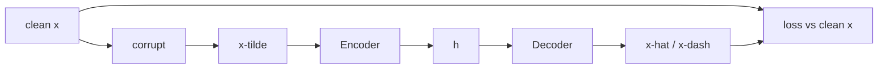

---

## DAE in one picture

1. Take clean $x$.
2. **Intentionally corrupt** it (noise, brightness up/down, “tap” values). Call the result $\tilde{x}$ (tilde $x$).
3. Feed **only** $\tilde{x}$ to the encoder.
4. Decoder emits a reconstruction (lecture also writes $x'$ / $x$-dash to avoid mixing hat and tilde).
5. Loss compares reconstruction to **clean $x$**, **not** to $\tilde{x}$.

Ground truth is the clean image; the model never sees a free copy path. It **cannot relax** (cannot identity-map $\tilde{x}\to\tilde{x}$). Working harder is the regularizer.

Diagram in the lecture: clean digit **4** → add noise → noisy image → DAE → **clean** target. Corruption uses a **probability-based** rule.

---

## Three ways to corrupt $x$

### 1. Gaussian noise

Draw noise from a Gaussian with **mean $0$** and some variance; **add** it to $x$.

Lecture vector (four features):

| | $x_1$ | $x_2$ | $x_3$ | $x_4$ |
|--|------:|------:|------:|------:|
| Clean $x$ | 0.50 | 0.80 | 0.20 | 0.90 |
| After noise $\tilde{x}$ | 0.51 | 0.75 | 0.23 | 0.82 |

Not the same row. The AE must reconstruct **$0.50, 0.80, 0.20, 0.90$**, not the noisy numbers. Disturbance can be larger than this toy; values stay “in and around” the originals.

### 2. Masking noise

Randomly set **some features to 0**. Probability $q$ that a feature is zeroed; probability $1-q$ that it is left unchanged.

Lecture: $q = 0.4$ → **40%** chance a feature becomes 0, **60%** chance it stays.

Five features; $40\%$ of $5$ is **2**, so about two entries become 0. One realized mask: **2nd and 4th** set to 0, others unchanged. Other draws are equally allowed (e.g. two different indices). Every feature independently has a $40\%$ chance.

### 3. Salt-and-pepper (most popular in the lecture)

Salt = **white**, pepper = **black**. Replace random pixels by **extreme intensity**, not by a small nudge.

**Binary $3\times 3$:** some $1$s become $0$ and some $0$s become $1$ (extremes of $\{0,1\}$). The lecture stresses this is **not** “always flip every pixel”—it is replacing **selected** pixels by the opposite extreme.

**Grayscale ($0$–$255$):** example **$128 \to 0$** (pepper / black) and **$130 \to 255$** (salt / white). The image fills with **white and black dots**—visibly noisy.

| Corruption | What it does |
|------------|----------------|
| Gaussian | Add $\mathcal{N}(0,\sigma^2)$ |
| Masking | Each feature $\to 0$ with probability $q$ (lecture $q=0.4$) |
| Salt-and-pepper | Random pixels $\to$ extreme intensity ($0$ or $1$ binary; $0$ or $255$ grayscale) |

Always: pass $\tilde{x}$ in; score $\hat{x}$ against **clean $x$**.

---

## Why reconstruction can still recover a clean “3”

After salt-and-pepper a clean **3** has cuts and missing ink. The DAE must emit a **clean 3**, not a 3 with gaps. How does it know the missing curve?

**Neighboring pixels are not independent.** They are **strongly correlated**. Face photo: pixels in one region look alike (skin vs hair). Cat: tail pixels similar, legs similar, and so on. Shapes exist only because neighbors agree.

Write $x_{i,j}$ for the pixel at row $i$, column $j$. Binary: $0$ or $1$. Grayscale: $0$–$255$, or $[0,1]$ if normalized.

If a pixel sits on a **curved black stroke**, nearby pixels are likely on the **same** stroke. If that center value is **missing**, infer it from neighbors.

**DAE is not only “reconstruct”:** it learns to restore $x$ using **neighborhood dependence**. A corrupted center can be read off the surrounding **eight** pixels (3×3 window). In probability language: $p(\text{center} \mid \text{neighbors})$.

### Toy neighborhood fill (intuition only — **not** the deployed algorithm)

The lecture repeats: **do not** use these counting tricks in production; they only show why neighbors matter.

**Binary, missing center**

- Six $1$s and two $0$s among eight neighbors.  
  $$P(\text{center}=1)=\frac{6}{8}=0.75,\quad P(\text{center}=0)=\frac{2}{8}=0.25$$  
  Fill **1**.
- Other patch: six $0$s, two $1$s → fill **0**.
- Missing pixel need not be the geometric center of the whole image; treat it as center of **its** 3×3.

**Grayscale, missing center**

Cannot count zeros and ones. List neighbors (spoken: $120, 125, 130, 123, 127, \ldots$), take the **mean**.

$$
\text{mean} = 124.625 \;\xrightarrow{\text{round}}\; 125
$$

Fill **125**. Neighbors live in $120$–$130$, so the center should too. (Correct arithmetic if a slide typo appears.)

---

## How it is actually implemented: convolution

For an **image** DAE, neighborhood structure is learned by **CNN filters**, same as week 1.

Lecture snippet: **32** filters, each **$3\times 3$**, **ReLU**, padding, applied to the (noisy) input.

Toy: kernel on a patch whose missing pixel is written as **0**. Convolution = element-wise multiply, then **sum**. First window sums to **17**. Sliding the $3\times 3$ window always mixes the missing site with its neighbors. Window size is a hyperparameter; “eight neighbors” was for a $3\times 3$ illustration.

So: corrupt → conv encoder learns local context → decoder reconstructs a clean image.

---

## DAE equations and training loop

**Step 1 — corrupt**

$$
x \;\xrightarrow{\text{Gaussian / mask / salt-pepper / other}}\; \tilde{x}
$$

**Step 2 — encoder** (one hidden layer, or last layer if deep)

$$
h = G(W \tilde{x} + b)
$$

**Step 3 — decoder**

$$
\hat{x} = F(W' h + b')
$$

Hidden decoder layers: ReLU / nonlinear. Last layer: output activation from data type.

**Step 4 — loss vs clean $x$**

$$
\min \; L\big(x,\, \hat{x}\big)
$$

| Data | Loss |
|------|------|
| Continuous | **MSE** |
| Binary or $[0,1]$ normalized | **BCE** |

Early in training $\hat{x}$ still looks noisy; the gap to clean $x$ is large → weights move. Later $\hat{x}$ approaches the clean image. At **test** time a corrupted input should yield a **clean** output.

Hidden objective: reconstructed pixel at $(i,j)$ is a function of its **local neighborhood**.

**Application:** you have corrupted measurements; DAE maps them toward clean data. Training **adds** noise to originally clean $x$ so the mapping is learnable (shown in the week-2 lab).

---

## Why this is a regularizer (even if overcomplete)

| Model | Input | Compared to |
|-------|--------|-------------|
| Standard AE | clean $x$ | clean $x$ |
| DAE | $\tilde{x}$ (noise **you** added) | still clean $x$ |

If an overcomplete DAE **copied** its input, $\hat{x}$ would stay **noisy**. Compared with clean $x$, loss would **not** go to zero. Copying is no longer a shortcut.

Corruption **removes identity mapping**. The model must **infer missing values from context**, so it learns features instead of copying.

### Key takeaways

- Regularize AEs to stop identity mapping, especially when $\dim(h)$ is large.
- DAE: encode **$\tilde{x}$**, reconstruct **clean $x$**. That gap is the constraint.
- Corrupt with Gaussian (example $0.50\to 0.51$, …), masking ($q=0.4$), or salt-and-pepper ($128\to 0$, $130\to 255$).
- Restoration uses **neighbor correlation**; toy fill is majority/mean; real images use **conv** kernels (e.g. 32 filters, $3\times 3$).
- Train MSE or BCE on $(x,\hat{x})$; test: noisy in, clean out.

---


\newpage

# L14: Sparse Autoencoder

**Video:** [Lec 14](https://www.youtube.com/watch?v=CmOGqsDRVP8) · 39:30  
**Instructor in this lecture:** Prof. Ashwini Kodipalli

### Learning objectives

- State the SAE idea: even with a **wide** hidden layer, keep **most units inactive** so the few that fire must carry important features.
- Write the loss as reconstruction **plus** a sparsity penalty controlled by $\beta$.
- Define average hidden activation $\hat{\rho}_j$, desired sparsity $\rho$, and the constraint $\hat{\rho}_j \approx \rho$.
- Use **KL divergence** $\mathrm{KL}(\rho \| \hat{\rho}_j)$ as the penalty, including the active and inactive terms, and the identity case $\rho=\hat{\rho}=0.05$.
- Follow the lecture’s **5-sample / 7-neuron** example: large $\hat{\rho}$ on **H2** and **H6** → large KL → backprop shrinks those units.

---

## Why sparsity (same overfitting story)

If $\dim(h) < \dim(x)$ (undercomplete), the bottleneck already **forces compression**. If $\dim(h) > \dim(x)$ (overcomplete), copying $x$ into $h$ is too easy—identity mapping, weak features, overfitting. Undercomplete nets are not immune, but overcomplete is the sharp case.

**Requirement:** even with **many** hidden neurons, still learn important features—**no** identity map.

Idea: keep some hidden **outputs at 0** (inactive). Effective width drops; the units that remain on must encode something real.

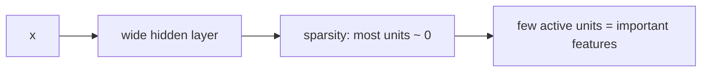

---

## What “sparse” means

A **sparse autoencoder** wants **most hidden neurons inactive** for most inputs—only a **few** active. Those few are then forced to capture important structure.

Regularization here is not “delete the layer”; it is **restrict** when a unit may fire.

### Add a sparsity term to the loss

A plain AE has only reconstruction loss. SAE:

$$
L = L_{\text{reconstruction}} + \beta\, L_{\text{sparsity}}
$$

| Term | Role |
|------|------|
| $L_{\text{reconstruction}}$ | How well $\hat{x}$ matches $x$ |
| $L_{\text{sparsity}}$ | **Penalty** if too many hidden neurons are active |
| $\beta$ | Hyperparameter: **how strongly** to enforce sparsity (small constant) |

If a neuron is active too often, **punish** it so it becomes less active; remaining activity has to be informative.

Two ways to implement sparsity: **KL divergence** or **L1**. This lecture (and the original SAE paper the instructor cites) uses **KL**. L1 appears in the week-2 lab.

---

## Notation (paper-style)

Toy net in the slides: **4** input features, **3** hidden neurons, fully connected. The construction does not depend on under- vs overcomplete.

For input $x$, the activation of hidden neuron $j$ in layer 2:

$$
a^{(2)}_j(x)
$$

Read: **output of hidden neuron $j$ in layer 2 for input $x$**. (Layer 1 = input, layer 2 = hidden.)

For training sample $i$, write the same activation on that example.

### Average activation $\hat{\rho}_j$

Do **not** sparsify from a single example. Pass **all** $m$ training samples. Neuron $j$ produces $m$ activations. Average them:

$$
\hat{\rho}_j = \frac{1}{m}\sum_{i=1}^{m} a^{(2)}_j(x^{(i)})
$$

Every hidden unit gets its own $\hat{\rho}_j$. This is the **actual average activation**.

### Desired sparsity $\rho$

$\rho$ is the **target** average activation (sparsity level). SAE constraint:

$$
\hat{\rho}_j \approx \rho
$$

If $\hat{\rho}_j$ is close to $\rho$, **small** penalty. If they differ a lot, **large** penalty. Distance between the two numbers is measured with **KL divergence**.

Two readings of “sparse,” both used:

1. Inside one hidden layer, only a **small fraction** of neurons active at a time.
2. **On average**, each neuron is active only **rarely**.

---

## KL penalty

For one unit:

$$
\mathrm{KL}(\rho \| \hat{\rho}_j)
= \rho\log\frac{\rho}{\hat{\rho}_j}
+ (1-\rho)\log\frac{1-\rho}{1-\hat{\rho}_j}
$$

- If $\rho \approx \hat{\rho}_j$, KL $\approx 0$ (ideally zero; in data, nearly zero). **Little or no** penalty.
- If they are far, KL **grows** → **large** penalty.

Sum over **all** hidden units (four units in the schematic; seven in the numerical table):

$$
L_{\text{sparsity}} = \sum_j \mathrm{KL}(\rho \| \hat{\rho}_j)
$$

### Active term and inactive term

A hidden unit has two sides: it can be **on** or **off**. Checking only “how often it is on” misses half the behavior. KL’s two logs are:

| Term | What it matches |
|------|-----------------|
| $\rho \log(\rho / \hat{\rho}_j)$ | **Active** part: how often the unit **should** fire vs how often it **does** |
| $(1-\rho)\log\bigl((1-\rho)/(1-\hat{\rho}_j)\bigr)$ | **Inactive** part: how often it **should** be off vs how often it **is** |

Penalty = mismatch on **both** sides.

---

## Identity example: $\rho = \hat{\rho} = 0.05$

Desired active rate $\rho = 0.05$ ⇒ desired inactive rate $1-\rho = 0.95$.

If actual $\hat{\rho} = 0.05$ as well, actual inactive $= 0.95$.

Plug in (lecture used $\log_{10}$ on the slide; $\log 1 = 0$ in any base):

$$
0.05\log\frac{0.05}{0.05} + 0.95\log\frac{0.95}{0.95} = 0
$$

Perfect match on active **and** inactive ⇒ KL $= 0$ ⇒ no penalty. This is the “$\rho=\hat{\rho}$” sanity check.

---

## Numerical example: 5 samples, 7 hidden units

Dataset: **5** samples, each with several input features. Hidden layer: **7** neurons $H_1,\ldots,H_7$.

Pass sample 1: each of the 7 units emits a number. Pass samples 2–5: five numbers **per column** (per neuron). Average each column with

$$
\hat{\rho}_j = \frac{1}{5}\sum_{i=1}^{5} a_j(x^{(i)})
$$

Spoken result for **$H_1$**: average activation **$0.3$** (recompute from the slide if a caption/typo disagrees; the instructor invited corrections). Repeat for $H_2$ through $H_7$ to fill $\hat{\rho}_j$.

Desired sparsity in this walk-through is the small rate from the KL slide (**$\rho = 0.05$**; the live lecture also says $0.005$ at one point—use the slide and the $1-\rho=0.95$ identity example as the intended $\rho$).

By eye:

- Some $\hat{\rho}_j$ sit **near** $\rho$ → small KL.
- **$H_2$ and $H_6$** sit **far** above $\rho$ → they fire **too often**.

SAE does **not** want neurons that are on most of the time. **$H_2$ and $H_6$ get the large penalties.**

Substitute $(\rho, \hat{\rho}_j)$ into KL for each $j$. For a unit with $\hat{\rho}$ near $\rho$, KL is **tiny**. For $H_2$ / $H_6$, KL is **large**. (Work the arithmetic from the table; treat any slide typo as yours to fix.)

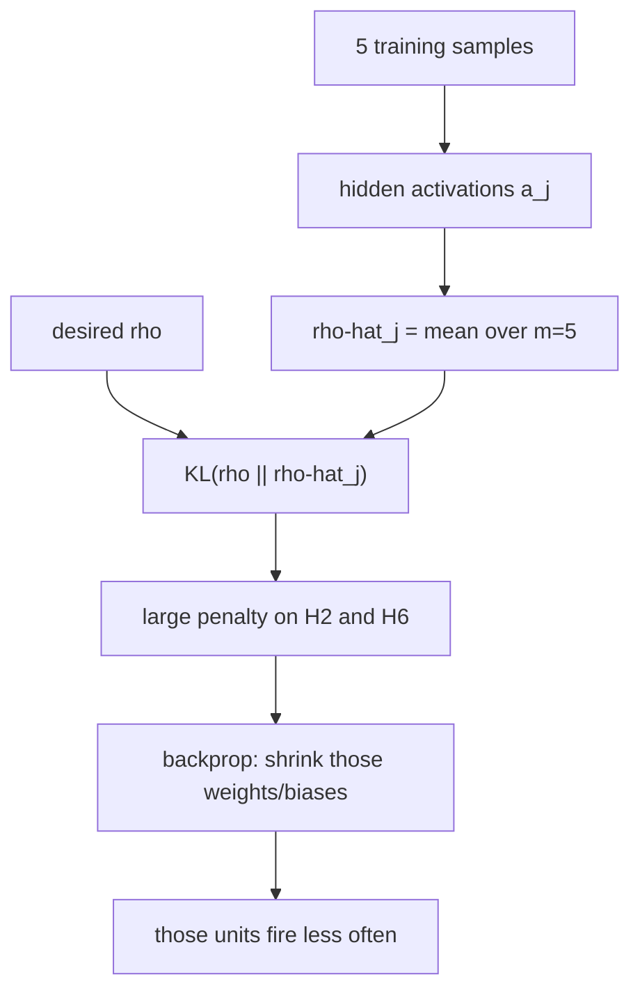

---

## What backprop does with a large KL

Large $\mathrm{KL}(\rho\|\hat{\rho}_j)$ is **added** to reconstruction loss ⇒ **total $L$ up**. Gradients flow into the weights **and bias** of that hidden unit. Next pass, $H_2$ / $H_6$ become **less** active. Overactive neurons are pushed toward rare firing.

Units that are usually off, when they **do** turn on, must carry **relevant** information. That restriction is the regularizer: the net cannot freely copy $x$ through a crowd of always-on hidden units.

### End-to-end picture

Example numbers used in the closing sketch: one unit with $\rho=0.05$ vs $\hat{\rho}=0.3$ (too active) vs another closer to target. KL on the overactive unit **rises**, total loss rises, backprop **turns that unit down**.

$$
L = L_{\text{rec}}(x,\hat{x}) + \beta \sum_j \mathrm{KL}(\rho \| \hat{\rho}_j)
$$

Because most hidden dimensions cannot stay on, SAE fights the overcomplete copying path and keeps a **sparse** code.

Next lecture: **contractive** autoencoders.

### Key takeaways

- SAE: many hidden units allowed, but **most stay off**; the few that fire must be useful.
- Loss = reconstruction + $\beta \times$ sparsity penalty (KL in this lecture; L1 is the other option).
- $\hat{\rho}_j$ = mean activation of unit $j$ over $m$ samples; target $\rho$; want $\hat{\rho}_j \approx \rho$.
- $\mathrm{KL}(\rho\|\hat{\rho})$ has an **active** log and an **inactive** log; $\rho=\hat{\rho}=0.05$ gives KL $=0$.
- In the 5×7 example, **H2** and **H6** are over-active; large KL + backprop makes them quieter.

---


\newpage

# L15: Contractive Autoencoder

**Video:** [Lec 15](https://www.youtube.com/watch?v=87pbybKetu4) · 27:05  
**Instructor in this lecture:** Prof. Ashwini Kodipalli

### Learning objectives

- State the CAE extra requirement: reconstruct well **and** keep $h$ **stable** when $x$ changes only slightly (noise, brightness).
- Write the **Jacobian** $J_h(x) = \partial h / \partial x$ and the **Frobenius** penalty $\|J_h(x)\|_F^2$.
- Add that penalty to reconstruction loss with weight $\lambda$.
- Interpret a large vs small $\partial h_1 / \partial x_1$ (sensitivity vs insensitivity).
- Explain the **trade-off**: keep **genuine** variations, suppress **unimportant** ones (noise), using $\lambda$ and the two loss terms.

---

## Reconstruct well, but keep $h$ stable

Standard AE: encoder $\to$ latent $h$ $\to$ decoder reconstructs $x$ well.

**Contractive** AE: still reconstruct well, **and** keep the hidden representation **stable**.

**Stable** means: if two inputs differ only **slightly**, their codes $h$ should stay **close**.

Lecture pair of images: same object/features; the second has a little **noise**. Features did not change. Then $h$ for the two images should not jump.

Slight change in $x$ can also be a **brightness** shift, not only additive noise.

A vanilla AE **will** usually move $h$ a bit when you pass $x$ vs $x+\delta$. CAE says those two hidden vectors should remain **nearly the same**.

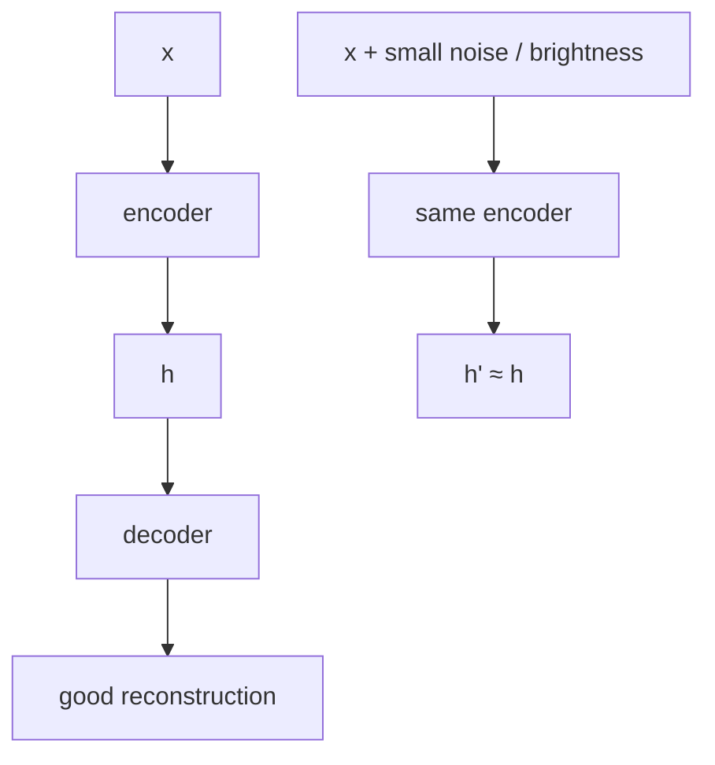

**Goal:** good reconstruction **and** stable $h$.

Like DAE and SAE, CAE is a **regularized** AE aimed at **overcomplete** nets that would otherwise learn a **trivial identity map**. The extra term is **Jacobian** regularization on the loss.

---

## Jacobian of $h$ with respect to $x$

Encoder (as before): weighted sum + bias, then activation $G$:

$$
h = G(x)
$$

The regularizer uses the **Jacobian of all hidden units with respect to all input dimensions**—partial derivatives $\partial h_k / \partial x_j$.

### Matrix picture

Inputs $x_1,x_2,x_3$ (three features). Hidden units $h_1,h_2,h_3,h_4$. Fully connected. $J$ is the matrix of every $\partial h_k / \partial x_j$.

**First column:** how much **each** hidden unit moves when $x_1$ moves a little:

$$
\frac{\partial h_1}{\partial x_1},\;
\frac{\partial h_2}{\partial x_1},\;
\frac{\partial h_3}{\partial x_1},\;
\frac{\partial h_4}{\partial x_1}
$$

That column is the **sensitivity** of the whole hidden layer to feature $x_1$. Other columns: sensitivity to $x_2$, $x_3$.

### Tiny input change (spoken numbers)

$$
x = (1.5,\; 2.5,\; 3.5)
\quad\text{vs}\quad
(1.6,\; 2.5,\; 3.4)
$$

$h$ should **not** swing wildly. Each entry of $J$ answers “how much did this $h_k$ move when this $x_j$ moved?”

### Frobenius norm

The penalty is the **sum of squares of all Jacobian entries**—the **Frobenius** norm:

$$
\|J_h(x)\|_F^2
= \sum_{k,j} \left(\frac{\partial h_k}{\partial x_j}\right)^2
$$

If this is **large**, many entries of $J$ are large ⇒ $h$ **changes a lot** for a small change in $x$. CAE wants those values **small** so $h$ stays stable.

---

## Loss

Add the Jacobian term to reconstruction loss:

$$
L = L_{\text{rec}}(x,\hat{x}) + \lambda \,\|J_h(x)\|_F^2
$$

Training **minimizes** $L$, so the second term is driven **toward 0**: $h$ should not twitch for tiny input moves.

### Reading one entry: $\partial h_1 / \partial x_1$

| Size of $\partial h_1/\partial x_1$ | Meaning | Wanted? |
|-------------------------------------|---------|---------|
| **Large** | $h_1$ changes a lot when $x_1$ changes a little; $h_1$ is **very sensitive** to $x_1$ | No: reconstruction would **copy noise** into $\hat{x}$ |
| **Small** | $h_1$ barely reacts; **insensitive** to small $x_1$ wiggles | Yes for **unimportant** wiggles |

CAE does not want $h_1$ to track **unimportant** changes in $x_1$.

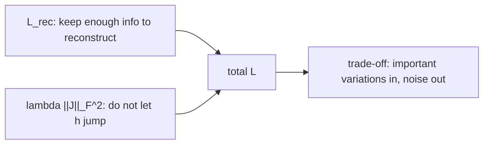

---

## Two contradictory pressures — the trade-off

If $h$ **drops** information, reconstruction is **poor** and $L_{\text{rec}}$ is large. So the first term says: **keep enough information** to reconstruct.

The second term says: **do not** let $h$ change for every small variation.

Those pull opposite ways. **Compromise:** preserve **important** variations in the data; **ignore / suppress** less important ones.

$h$ cannot store every detail, and it cannot be **completely** dead to all changes. **Balance** is the hyperparameter $\lambda$:

| $\lambda$ | Effect (as taught) |
|-----------|---------------------|
| **Large** | Punish $h$-movement more → **more stable** features |
| **Small** | Weaker penalty → **more detailed** reconstruction |

---

## How the model “knows” what to keep

The lecture’s two thought experiments (same formula, two inputs).

### Scenario A — genuine variation

The change in $x$ is a **real** part of the data—not noise, not a brightness glitch. Then $h$ **should** capture it.

If $h$ **refuses** to react (because you trained it to be still):

- $\hat{x}$ **misses** that variation.
- Compared with original $x$, **$L_{\text{rec}}$ rises**.
- Meanwhile derivatives in $J$ stay **small**, so the penalty term is **tiny**.

High reconstruction loss is the signal: **this variation mattered—capture it.** Valid structure in $x$ must move $h$.

### Scenario B — noise / random disturbance

Two images: same features, extra **noise**. $h$ should **not** encode the speckle.

If $h$ **does** react:

- $\partial h_1/\partial x_1$ (and other entries) **grow** ⇒ Frobenius penalty **grows**.
- Decoder **paints the noise** into $\hat{x}$.
- Clean original $x$ vs noisy $\hat{x}$ ⇒ **$L_{\text{rec}}$ also up**.

**Both** terms punish capturing noise. The net learns: **do not** keep those dimensions.

(The instructor once says “VAE” while pointing at this penalty; in this video that is the **contractive** loss, not a variational autoencoder.)

---

## Summary of the three regularizers (week 2)

| Variant | Extra constraint |
|---------|------------------|
| **DAE** (L13) | Encode a **corrupted** $\tilde{x}$; reconstruct **clean** $x$ |
| **SAE** (L14) | Hidden units **rarely** active (KL / L1) |
| **CAE** (this lecture) | Reconstruct well **and** keep $h$ **stable** (small Jacobian) |

Next: a **numerical** AE forward pass and the **limitations** that motivate VAEs.

### Key takeaways

- CAE: $\hat{x}$ should match $x$, and $h(x)$ should match $h(x+\text{small noise})$.
- Penalty is $\lambda$ times the **Frobenius** norm of $J_h(x)=\partial h/\partial x$.
- Large Jacobian entries = $h$ too sensitive (example $x=(1.5,2.5,3.5)$ vs $(1.6,2.5,3.4)$).
- $L_{\text{rec}}$ vs Jacobian is a trade-off: keep **real** factors, drop **noise**; $\lambda$ sets the balance.
- Overcomplete identity mapping is the failure mode this regularizer is built to block.

---


\newpage

# L16: Numerical Example and Limitations of Autoencoders

**Video:** [Lec 16](https://www.youtube.com/watch?v=vvkdhI5ECHM) · 27:25  
**Instructor in this lecture:** Prof. Ashwini Kodipalli

### Learning objectives

- Run a fully connected AE **forward pass** with the lecture’s numbers: $5\to 4\to 3\to 4\to 5$.
- Use **ReLU** on hidden layers and **linear** + **MSE** on a continuous output.
- State what training does to weights/biases so $\hat{x}$ approaches $x$.
- List four **limitations** of AEs (uninterpretable $h$, weak downstream use, approximation not generation, latent-size trap).
- See why week 3 adds a **VAE** (KL regularizer on the latent space).

Last **theory** session of week 2. Next video is the hands-on (shallow / deep / convolutional AEs—not VAEs yet, despite one slip of the tongue at the end).

---

## Architecture for the numerical example

Five input features. Encoder: hidden **4**, then hidden **3** (latent). Decoder: hidden **4**, then output **5**.

$$
5 \;\xrightarrow{\text{ReLU}}\; 4 \;\xrightarrow{\text{ReLU}}\; 3
\;\xrightarrow{\text{ReLU}}\; 4 \;\xrightarrow{\text{linear}}\; 5
$$

Fully connected at every step: all inputs to a neuron, weighted sum **plus bias**, then activation.

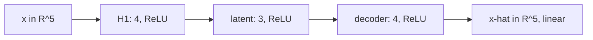

---

## Input

$$
x = (0.8,\; 0.4,\; 0.6,\; 0.2,\; 0.5)
$$

Continuous values ⇒ last layer **linear**, loss **MSE**. Hidden layers: **ReLU**, $\mathrm{ReLU}(t)=\max(0,t)$.

---

## Encoder layer 1: $5 \to 4$

### Neuron 1 (weights spoken in full)

Weights into this unit: $0.2,\; 0.5,\; 0.4,\; 0.3,\; 0.1$. Bias $0.01$.

$$
\begin{aligned}
z_1 &= 0.8\cdot 0.2 + 0.4\cdot 0.5 + 0.6\cdot 0.4 + 0.2\cdot 0.3 + 0.5\cdot 0.1 + 0.01 \\
&= 0.16 + 0.20 + 0.24 + 0.06 + 0.05 + 0.01 \\
&= 0.72
\end{aligned}
$$

$$
a_1 = \max(0,\, 0.72) = 0.72
$$

### Neuron 2

Weights: $0.1,\; 0.3,\; 0.2,\; 0.6,\; 0.4$. Same pattern: $x$ dotted with those weights, plus bias, then ReLU.

$$
a_2 = \max(0,\, 0.65) = 0.65
$$

### Neurons 3 and 4

Same fully connected rule (five weights + bias each; the lecture fills the remaining two units on the slide). After ReLU the **four** hidden outputs are:

$$
(0.72,\; 0.65,\; 0.66,\; 0.77)
$$

Five features have been **compressed** to four. Nothing was deleted: every original coordinate reached every neuron.

---

## Encoder layer 2: $4 \to 3$ (latent)

Inputs to this layer are $(0.72,\; 0.65,\; 0.66,\; 0.77)$. Each of 3 neurons takes **four** weights + bias, then ReLU.

### First latent unit

Weights: $0.3,\; 0.5,\; 0.2,\; 0.1$.

$$
h_1 = \max\bigl(0,\; 0.760\bigr) = 0.760
$$

(The pre-activation $0.760$ is the weighted sum **plus bias** as written on the slide.)

### Remaining two latent units

Same calculation with two other weight rows. Spoken latent vector:

$$
h = (0.760,\; 0.714,\; 0.944)
$$

This **is** the latent code: $5\to 4\to 3$, still **compression**, not deletion. If a slide arithmetic disagrees, recompute as the instructor asked.

---

## Decoder layer 1: $3 \to 4$

Each of 4 neurons takes **three** weights + bias, ReLU (still a hidden layer).

First unit, weights $0.4,\; 0.2,\; 0.3$:

$$
0.760\cdot 0.4 + 0.714\cdot 0.2 + 0.944\cdot 0.3 + b
$$

ReLU of that pre-activation is spoken as **$0.74$**. The other three units follow the same template. Width is back to **4**, on the way to **5**.

---

## Output layer: $4 \to 5$, linear

Five output neurons, **four** weights + bias each. **Linear** activation $F(a)=a$: the displayed sum **is** the reconstructed coordinate (no extra squash). That is why the lecture sometimes omits drawing $F$.

First reconstructed coordinate (spoken):

$$
\hat{x}_1 = 0.67838
$$

Then four more linear outputs (slide). End-to-end:

$$
5 \to 4 \to 3 \to 4 \to 5
$$

Compare to the original:

| | $x_1$ | $x_2$ | $x_3$ | $x_4$ | $x_5$ |
|--|------:|------:|------:|------:|------:|
| Original $x$ | 0.8 | 0.4 | 0.6 | 0.2 | 0.5 |
| $\hat{x}$ (first coord. spoken) | 0.67838 | (slide) | (slide) | (slide) | (slide) |

Not equal yet—this is **one** forward pass with the **current** (untrained / mid-training) weights.

---

## MSE, then training

Five continuous coordinates ⇒ **mean squared error**. Average the five squared residuals:

$$
L = \frac{1}{5}\sum_{j=1}^{5} (x_j - \hat{x}_j)^2
$$

If $L$ is large, **backpropagate**. An **optimizer** updates **all** weights: $5\to 4$, $4\to 3$, $3\to 4$, $4\to 5$, and the biases.

After training you have **optimized** weights and biases. Then:

$$
x \;\times\; W^\star \;\to\; h^\star \;\times\; W^{\star}_{\text{dec}} \;\to\; \hat{x} \approx x
$$

A good $h^\star$ plus a good decoder gives small MSE: reconstruction **close** to the original.

### Activation / loss reminder

| $x$ type | Hidden act. | Output act. | Loss |
|----------|-------------|-------------|------|
| Continuous (this example) | ReLU | **Linear** | **MSE** |
| Binary $0/1$ | ReLU | **Sigmoid** | **BCE** |

(The lecture’s wording: the last layer **reconstructs**, it does not “generate” a new sample.)

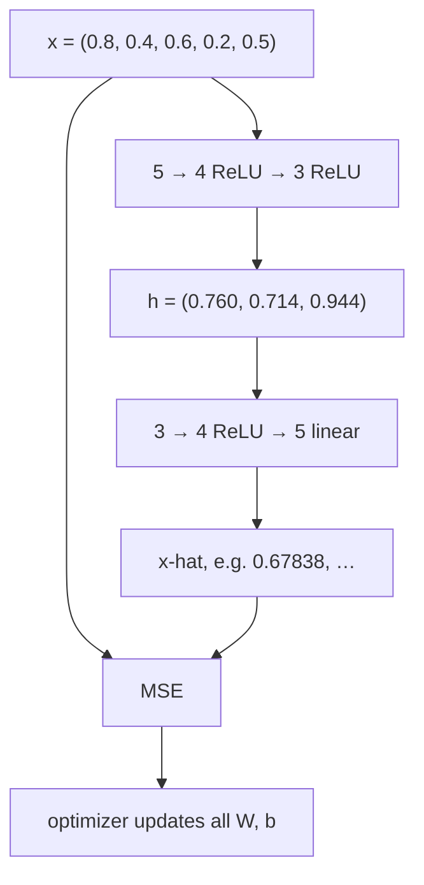

---

## Limitations (all about $h$)

Reconstruction is entirely from the latent code. Four limits:

### 1. $h$ is not human-readable

Low MSE and a pretty $\hat{x}$ do **not** mean $h$ stores **meaningful** factors you can read off.

Handwritten digits: from $h$ you **cannot** tell “is this a **2** or a **9**?”, “thin vs thick stroke?”, “slanted or not?”. Reconstruction can look fine while $h$ still has **no** interpretable content.

### 2. Downstream tasks on $h$ fail

You cannot treat that $h$ as a ready feature vector for **classification, prediction, clustering, anomaly detection**. Low reconstruction error ≠ a code that is useful or human-interpretable for those jobs.

### 3. Approximation, not new samples

$\hat{x}$ is decoded from a **compressed** $h$, so it is always an **approximation** of $x$, not an exact copy. The model also does **not generate a new sample**—it reconstructs what it was given.

### 4. Latent **size** is a trap

| Latent size | What you see | Hidden problem |
|-------------|--------------|----------------|
| **Too small** | Too much compression, **information loss**, **poor** $\hat{x}$ (blurry / wrong) | Underfitting the structure |
| **Too large** | Low reconstruction error, $\hat{x}$ close to $x$ | Possible **copying** / identity map; **weak** feature learning. Example: 3 inputs, 5 hidden, 3 outputs—copy $x$ and pad **zeros** |

This is the undercomplete vs overcomplete lesson again, as a **limitation** of vanilla AEs.

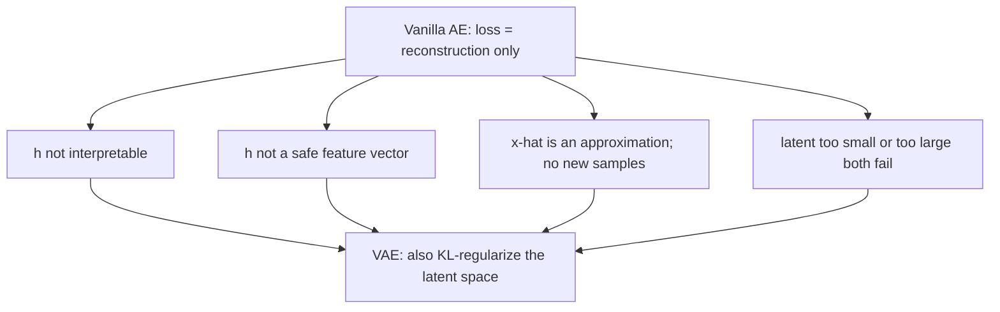

---

## Bridge to variational autoencoders

The problems sit in the **latent space**. Week 3’s **VAE** regularizes $h$ by adding a **KL divergence** term to the loss (vanilla AE has reconstruction only). That KL is there to **control the latent space**. Full discussion starts next week.

Hands-on next: **shallow**, **deep**, and **convolutional** autoencoders (not VAEs).

### Key takeaways

- Worked net: $x=(0.8,0.4,0.6,0.2,0.5)$, $5\to 4\to 3\to 4\to 5$, ReLU hidden, linear out.
- Spoken checkpoints: $H_1=(0.72,0.65,0.66,0.77)$, $h=(0.760,0.714,0.944)$, $\hat{x}_1=0.67838$; then MSE and backprop.
- Low reconstruction error does **not** imply a meaningful or reusable $h$, and AEs **reconstruct** rather than sample new $x$.
- Tiny latent loses information; huge latent copies. VAEs add **KL on $h$** to fix the latent-space issues.

---


\newpage

# L17: Practical Exercise 1 — Autoencoders

**Video:** [Lec 17](https://www.youtube.com/watch?v=5C95atwLrAM) · 35:59  

Week-2 AE hands-on #1. Implement **four** Keras models on **MNIST**: shallow (basic), deep, sparse (L1), and denoising (Gaussian noise).

### Learning objectives

- Load MNIST **without labels**, scale to $[0,1]$, flatten $28\times 28 \to 784$.
- Train a **shallow** AE $784\to 64\to 784$ (Adam, BCE) and read the parameter counts $50{,}240 + 50{,}960 = 101{,}200$.
- Train a **deep** AE $784\to 256\to 128\to 64\to 128\to 256\to 784$ and compare validation loss to the shallow net.
- Add **L1** ($10^{-4}$) for a **sparse** AE and see higher loss / worse reconstructions.
- Build a **DAE**: Gaussian noise with `noise_factor=0.5`, clip to $[0,1]$, train on noisy inputs vs clean targets.

### What this lecture is *not*

No contractive AE and no CNN AE in this notebook (those stay in the theory videos / a later lab). Labels are ignored: this is reconstruction, not classification.

---

## Exercise flowchart

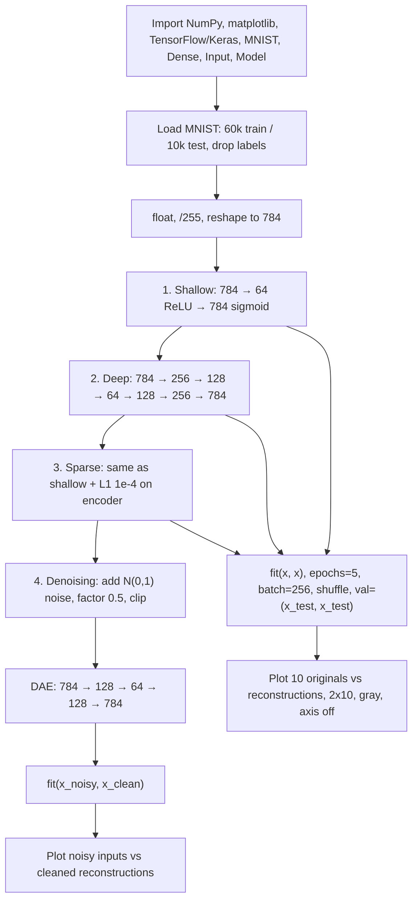

Shared training knobs unless noted: **Adam**, **binary cross-entropy**, **5 epochs**, **batch size 256**, **shuffle=True**, validation = test set (encoder **and** decoder both need $x$, so `x` is passed **twice**).

---

## 1. Libraries

| Import | Role |
|--------|------|
| `numpy` as `np` | Arrays / numbers |
| `matplotlib.pyplot` as `plt` | Plots |
| `tensorflow` as `tf` | Deep-learning framework |
| `mnist` from `tensorflow.keras.datasets` | Handwritten digits **0–9** (10 classes in the dataset, unused as labels) |
| `Dense`, `Input` | Hidden/output dense layers; input size |
| `Model` | Functional API model |

---

## 2. Data: MNIST without labels

Autoencoders **reconstruct images**. Labels are discarded with `_`:

```text
(x_train, _), (x_test, _) = mnist.load_data()
```

| Split | Count | Native shape |
|-------|------:|--------------|
| Train | 60,000 | $28\times 28$ |
| Test | 10,000 | $28\times 28$ |

**Preprocess**

1. Cast to **float**.
2. **Normalize** by dividing by **255** (pixel levels $0$–$255$) so values lie in **$[0,1]$** (the lecture also mentions $[-1,1]$ as a possible scaling family; this notebook uses $0$–$1$). Scaling makes learning easier.
3. Same for the test set.
4. **Reshape** each image to a length-**784** vector ($28\times 28=784$) so `Dense` layers see a vector. Print shapes: `(60000, 784)` and `(10000, 784)`.

---

## 3. Shallow / basic autoencoder

One encoder dense layer, one decoder dense layer.

| Piece | Spec |
|-------|------|
| Input | `Input(shape=(784,))` → `input_image` |
| Encoder | `Dense(64, activation='relu')` on the input. **784 → 64** compression (also a storage win) |
| Decoder | `Dense(784, activation='sigmoid')` on the code. Sigmoid because pixels are in $[0,1]$ (two ends of the range) |
| Model | `Model(input_image, decoded)` |
| Optimizer / loss | **Adam** / **binary cross-entropy** |
| `fit` | `x_train, x_train` (input **and** reconstruction target). **epochs=5**, **batch_size=256**, `shuffle=True`, `validation_data=(x_test, x_test)` |

`x_train` appears twice because **both** encoder and decoder need the image (unlike a classifier, where you pass `x` once and `y` as labels).

**Why shuffle:** random order so the net does not memorize a serial pattern; helps generalization / reduces overfitting.

**Epoch** = one full pass over the training set (here 5). **Batch 256** = 256 samples per weight update (easier backprop than the full 60k).

### Parameter counts (spoken)

`Dense` params $= \text{(incoming dim)}\times\text{(units)} + \text{bias}$.

| Layer | Output shape | Parameters |
|-------|--------------|------------|
| Input | `(None, 784)` | **0** (no weights) |
| Dense 1 (encoder) | `(None, 64)` | $784\times 64 + 64 = \mathbf{50{,}240}$ |
| Dense 2 (decoder) | `(None, 784)` | $64\times 784 + 784 = \mathbf{50{,}960}$ |
| **Total trainable** | | **101,200** |

### Validation loss by epoch (shallow)

| Epoch | Val. loss (spoken) |
|------:|-------------------:|
| 1 | 0.16 |
| 2 | 0.12 |
| 3 | 0.10 |
| 4 | 0.09 |
| 5 | 0.09 |

Loss falls across epochs.

### Plots

- `decoded_imgs = autoencoder.predict(x_test)`
- `n = 10` images
- `plt.figure(figsize=(20, 4))` — width 20, height 4
- Two rows × 10 columns: **row 1 original** `x_test`, **row 2 reconstruction**
- Reshape each vector back to **$28\times 28$**, `cmap='gray'`, `axis('off')`

**What to observe:** reconstructions are almost the right digits, with a little **blur** after only 5 epochs.

---

## 4. Deep autoencoder

Several encoder layers **and** matching decoder layers (one decode stage per encode stage).

$$
784 \xrightarrow{\text{ReLU}} 256 \xrightarrow{\text{ReLU}} 128 \xrightarrow{\text{ReLU}} 64
\xrightarrow{\text{ReLU}} 128 \xrightarrow{\text{ReLU}} 256 \xrightarrow{\text{sigmoid}} 784
$$

Only the **last** dense layer is sigmoid (pixels in $[0,1]$). Compile: Adam + BCE. Same `fit` signature as the shallow net.

### Parameter counts (spoken)

Formula unchanged: incoming $\times$ units $+$ bias. Input layer still 0 params.

| Dense stage (as listed) | Parameters |
|-------------------------|------------|
| after 784 | **209,960** |
| next | **32,896** |
| next | **8,256** |
| next | **8,320** |
| next | **33,024** |
| last (→ 784) | **201,488** |
| **Total** | **484,944** |

### Validation loss (deep)

Spoken sequence: **0.13**, then **0.10**, **0.1029**, **0.0968** (caption also sounds like 0.00968—treat as **0.0968** on the 0.1 scale of the other epochs), **0.0937**. Still decreasing.

Compare to shallow’s final **0.09**: deep ends near **0.093**. The lecture’s take: this deeper stack did **not** clearly win on loss in 5 epochs; reconstructions are plotted the same $2\times 10$ way.

---

## 5. Sparse autoencoder (L1)

Shallow-shaped net **plus** L1 on the encoder. Import `regularizers` from Keras.

| Piece | Spec |
|-------|------|
| Encoder | `Dense(64, activation='relu', activity_regularizer=L1(1e-4))` on 784-D input |
| Decoder | `Dense(784, activation='sigmoid')` |
| L1 strength | $10^{-4}$ (could be $10^{-1},10^{-2},10^{-3}$ by trial) |
| Params | Same as shallow: **0 + 50,240 + 50,960 = 101,200** |
| Train | Same Adam / BCE / 5 epochs / batch 256 / `(x_test, x_test)` val |

### Validation loss (sparse)

**0.6, 0.5, 0.5, 0.46, 0.43** — **higher** than shallow/deep.

**Why (as taught in the lab):** regularization **generalizes** by not fitting every sample. L1 adds $\lambda \sum |w|$ on the weights (spoken: $\lambda$ times absolute weights; 60,000 / 256 ≈ **234** batches). Sparsity means you are not using all 784 dimensions freely—activity is pushed through **64** units. Less memorization ⇒ **higher** reconstruction loss.

**What to observe:** many reconstructions **fail**; this run looks **worse** than shallow and deep. The lab’s conclusion: not the strongest reconstructor of the four **in this setup**.

---

## 6. Denoising autoencoder

Generalize by **adding noise** to MNIST, then reconstructing the **clean** image.

### Noise model

- **Gaussian / normal** noise, mean **0**, standard deviation **1**
- `noise_factor = 0.5` (range $[0,1]$: **0** = almost no noise, **1** = very heavy; **0.5** = moderate)

```text
x_train_noisy = x_train + noise_factor * np.random.normal(loc=0.0, scale=1.0, size=x_train.shape)
x_test_noisy  = x_test  + noise_factor * np.random.normal(loc=0.0, scale=1.0, size=x_test.shape)
```

`loc=0` → mean 0; `scale=1` → std 1; `size` matches the original array (do not change length).

**Clip** both noisy arrays to **$[0,1]$**: values $<0$ become 0, values $>1$ become 1, values already in $[0,1]$ stay. Avoids wild negatives / positives.

### Architecture

Two encode stages, two decode stages:

$$
784 \xrightarrow{\text{ReLU}} 128 \xrightarrow{\text{ReLU}} 64
\xrightarrow{\text{ReLU}} 128 \xrightarrow{\text{sigmoid}} 784
$$

Adam + BCE.

### `fit` targets

Train on **noisy inputs**, **clean** targets:

```text
fit(x_train_noisy, x_train, ..., validation_data=(x_test_noisy, x_test))
```

That is the DAE rule from L13: do not learn $\tilde{x}\mapsto\tilde{x}$.

### Validation loss (DAE)

**0.18, 0.15, 0.14, …, 0.13**. More epochs would likely push it down further. Because the model is **regularized by noise**, you **trade** some loss for generalization.

### Plots

Same $2\times 10$, gray, axes off. **Top:** noisy digits. **Bottom:** reconstructions.

**What to observe:** outputs are a bit **blurred**, but the **noise is gone**—a usable clean digit even though the input was corrupted.

---

## Side-by-side (this notebook)

| Model | Widths | Extra | Final val. loss (spoken) | Look at |
|-------|--------|-------|---------------------------|---------|
| Shallow | $784\to 64\to 784$ | — | $\approx 0.09$ | Slight blur, digits OK |
| Deep | $784\to 256\to 128\to 64\to \cdots\to 784$ | more layers, **484,944** params | $\approx 0.093$ | Similar; not clearly better in 5 epochs |
| Sparse | $784\to 64\to 784$ | **L1** $10^{-4}$ | $\approx 0.43$ | Many failed reconstructions |
| Denoising | $784\to 128\to 64\to 128\to 784$ | Gaussian, factor **0.5**, clip $[0,1]$ | $\approx 0.13$ | Noise removed, mild blur |

All four share: MNIST flattened, $[0,1]$ pixels, sigmoid + BCE, Adam, 5 epochs, batch 256.

### Key takeaways

- Drop MNIST labels; reconstruct `x` from `x` (or from `x_noisy` in the DAE).
- Shallow $64$-D bottleneck: **101,200** weights; val. loss down to $\sim 0.09$ in 5 epochs.
- Deep has **484,944** weights; here it does not beat shallow on val. loss in 5 epochs.
- Sparse L1 ($10^{-4}$) **raises** loss ($\sim 0.43$) and hurts visual reconstructions in this run.
- DAE: `noise_factor=0.5` Gaussian, clip $[0,1]$, train `(noisy, clean)`; recovers a clean digit from a noisy one.

---


\newpage

# L18: Practical exercise 2 — regularizing an autoencoder

**Video:** [Lec 18](https://www.youtube.com/watch?v=sSDaKISydCA) · 23:02

### Learning objectives

- Implement five regularization methods on the same MNIST autoencoder: **L1**, **L2**, **dropout**, **batch normalization**, and **early stopping**.
- State what each method does to weights or connections (absolute vs squared penalty, dropped edges, per-batch scaling, patience).
- Train with the lecture’s optimizer, loss, epochs, and batch size, and compare **validation losses**.
- Read the lecture’s ranking: L2 beats L1; among all five runs, **early stopping** is called the best.

This video is a **week-2 autoencoder lab**, not a VAE. There is no KL term and no sampling of $z$.

---

## What this session implements

The hands-on goal is to regularize an autoencoder so it **generalizes** and does **cleaner feature extraction**, then compare validation losses with each other and with the **previous (unregularized) session**.

Five techniques, in order:

1. L1 regularization  
2. L2 regularization  
3. Dropout  
4. Batch normalization  
5. Early stopping  

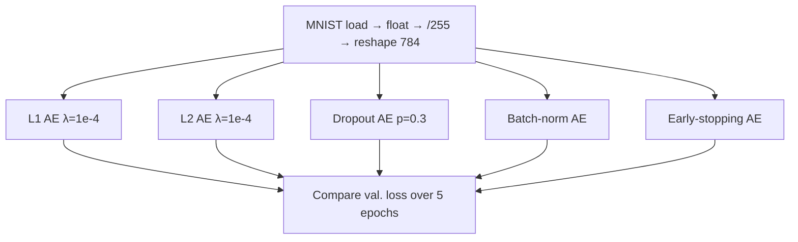

---

## 1. Libraries

| Import | Role in the notebook |
|--------|----------------------|
| `numpy` as `np` | Arrays |
| `matplotlib.pyplot` as `plt` | Plots (available; this session is mostly loss numbers) |
| `tensorflow` | Neural nets |
| `tensorflow.keras.datasets.mnist` | Handwritten digits **0–9** (10 classes) |
| `*` from TensorFlow / Keras | Pull in layers and model helpers in one go |
| Keras `models` | Build the autoencoder |
| Regularizers **L1, L2**; **Dropout**; **BatchNormalization**; **EarlyStopping** | The five techniques |

---

## 2. Dataset, dtype, normalize, reshape

1. Load MNIST into a **train** split and a **test** split.  
2. Cast pixels to **float** (needed for the network arithmetic).  
3. **Normalize** train and test by dividing by **255** so intensities lie in $[0,1]$.  
4. **Reshape** both to `(-1, 784)`. The lecture’s language: `-1` (or `_`) **drops the label**. An autoencoder is unsupervised: **784** pixel features only, no class target.

---

## Shared training recipe (every model unless noted)

| Choice | Value | Why the lecture uses it |
|--------|-------|-------------------------|
| Input size | 784 | Flattened MNIST |
| Output activation | **Sigmoid** | Pixels already in $[0,1]$ |
| Optimizer | **Adam** | Default for these labs |
| Loss | **Binary cross-entropy** | Matches normalized 0–1 pixels |
| Fit targets | `(x_train, x_train)` | Reconstruct the input (encoder *and* decoder see $x$) |
| Epochs | **5** | Short comparison run |
| Batch size | **256** | Weights update **per batch**, not once per epoch |
| Validation | `(x_test, x_test)` | Same reconstruct-the-input pairing |

Batch size is treated as a training choice (alongside SGD vs full-batch): **256** means the encoder/decoder weights move after each mini-batch, which the lecture says helps learning.

---

## 3. L1 regularization

**Penalty the lecture writes:** $\lambda$ times the **absolute** weights,

$$
\lambda \sum_i |w_i|
$$

with $\lambda = 10^{-4}$. $w_i$ are the weights in the current batch. Large $|w|$ is taxed, so **unimportant connections shrink** and the net keeps **features that actually help reconstruction**.

### Architecture

| Piece | Spec |
|-------|------|
| Input | 784 |
| Encoder dense | **128**, **ReLU**, `kernel_regularizer=L1(1e-4)` |
| Decoder dense | **784**, **sigmoid** |
| Compile | Adam + BCE |
| Fit | 5 epochs, batch 256, validate on `x_test` |

### Validation loss by epoch (spoken)

| Epoch | Val. loss |
|------:|----------:|
| 1 | 0.61 |
| 2 | 0.55 |
| 3 | 0.50 |
| 4 | 0.46 |
| 5 | **0.43** |

Loss falls every epoch; L1 is already helping, but later methods go lower.

---

## 4. L2 regularization

**Penalty:** $\lambda$ times **squared** weights,

$$
\lambda \sum_i w_i^2
$$

Same $\lambda = 10^{-4}$. Squaring still down-weights large $w_i$. The lecture’s picture: multiplying a **tiny** $\lambda$ into the weights **reduces the influence of some neurons** (features), which *is* feature extraction.

You may try $10^{-1}$, $10^{-2}$, $10^{-3}$ as well; smaller $\lambda$ deactivates less.

### Architecture

Same skeleton as L1: **784 → 128 ReLU (L2 $10^{-4}$) → 784 sigmoid**, Adam, BCE, 5 epochs, batch 256, `(x_train, x_train)` / `(x_test, x_test)`.

### Validation loss (spoken)

| Epoch | Val. loss |
|------:|----------:|
| 1 | 0.15 |
| 2 | 0.12 |
| … | keeps falling |
| last | **0.09** |

### L1 vs L2 (lecture comparison)

| Regularizer | Last-epoch val. loss |
|-------------|----------------------|
| L1 | 0.43 |
| L2 | **0.09** |

**Claim in the lecture:** L2 is **better than L1** here. Squaring the weights and scaling by $\lambda$ leaves **only the important features**, which yields a **cleaner reconstruction**.

---

## 5. Dropout

### Intuition (two hidden layers of five neurons)

Without dropout the graph is **fully connected**: neuron 1 in layer 1 always talks to every neuron in layer 2, on **every** batch. Those pairs **memorize training patterns**, so reconstructions on **train** look sharp, but **unseen test** digits are not reconstructed well — the model never had to **generalize**.

Dropout **cuts some edges** each time (lecture sketch: drop 1→3, drop 2→2, drop 3→2, …). Associations that were always “neuron $i$ with neuron $j$” cannot memorize the training set. **Specification is lost; generalization is gained.**

### Architecture (this run is deeper than L1/L2)

| Piece | Spec |
|-------|------|
| Input | 784 |
| Dense | **256**, ReLU |
| Dropout | **0.3** (drop **30%** of connections) |
| Dense | **128**, ReLU |
| Dropout | **0.3** again |
| Dense | **784**, sigmoid (output; lecture: two-class / 0–1 pixels) |
| Compile / fit | Adam, BCE, 5 epochs, batch 256, validate on `x_test` |

### Validation loss (spoken)

0.14 → 0.1 → 0.1 → 0.1 → **0.1042**. Gradual decrease.

---

## 6. Batch normalization

**Formula written on the board:** for a pixel / activation $x$,

$$
x_{\text{norm}} = \frac{x - \mu}{\sigma}
$$

After this, values sit on a **bell curve** (mean near 0, std near 1) and can be scaled into a tight range such as $[0,1]$ or $[-1,1]$. A raw intensity **255** can become **1**; a negative can be pulled toward **0**. The network spends **less effort** learning scale, which the lecture counts as **generalization**.

### Architecture

| Piece | Spec |
|-------|------|
| Input | 784 |
| Dense **256** → **BatchNorm** → **ReLU** | encoder side |
| Dense **128** → **BatchNorm** → **ReLU** | decoder hidden |
| Dense **784**, sigmoid | output |
| Compile / fit | Adam, BCE, 5 epochs, batch 256, `(x_train, x_train)`, val `(x_test, x_test)` |

### Validation loss (spoken)

First epoch already **0.13**, then down to **0.08**.

**Claim vs L1 / L2 / dropout:** this **0.08** is the **smallest** of those four. Batch norm is called a **very good** regularizer **compared with the three above**.

---

## 7. Early stopping

**Idea:** if **validation loss stops falling** (or accuracy stops rising), **stop**. Do not burn extra epochs. The user chooses a **patience**: maybe **2** epochs with no improvement, or **5**.

### Keras callback (three arguments spoken)

```text
EarlyStopping(
    monitor="val_loss",   # they trained on loss, so monitor validation loss
    patience=2,           # stop if val_loss does not drop for 2 epochs
    restore_best_weights=True
)
```

**Restore best weights:** keep the checkpoint from the **best** validation loss so later forward passes use those weights, not the last (possibly worse) step.

### Architecture

**784 → 256 ReLU → 128 ReLU → 784 sigmoid**, Adam, BCE, fit on `(x_train, x_train)`.

### Validation loss on this 5-epoch run (spoken)

| Epoch | Val. loss |
|------:|----------:|
| 1 | 0.11 |
| 2 | 0.09 |
| 3 | 0.08 |
| 4 | 0.0799 |
| 5 | **0.0722** |

**Early stopping did not fire** in five epochs: loss was still dropping, so there were never two flat epochs. The lecture’s saturation picture: if epoch 4, 5, and 6 all sat at **0.0799**, training would **stop** after patience **2**. With **10 / 20 / 50** epochs, that plateau would likely appear.

---

## Comparison the lecture actually states

| Method | Architecture (encoder → … → 784) | Last val. loss (spoken) | Lecture verdict |
|--------|----------------------------------|-------------------------|-----------------|
| L1, $\lambda=10^{-4}$ | 128 ReLU + L1 | 0.43 | Worse than L2 |
| L2, $\lambda=10^{-4}$ | 128 ReLU + L2 | 0.09 | **Better than L1** (square the weights) |
| Dropout 0.3 | 256 → drop → 128 → drop | 0.1042 | Regularizes by cutting edges |
| Batch norm | 256 BN ReLU → 128 BN ReLU | 0.08 | Best of the **first four** |
| Early stopping | 256 → 128, patience 2 | **0.0722** | **Best of all five** in the closing recap |

L2 beats L1 because the penalty uses $w_i^2$. After all five, the speaker ranks **early stopping** first on this notebook (lowest spoken val. loss, **0.0722**).

```mermaid
flowchart LR
    L1["L1 0.43"] --> L2["L2 0.09"]
    L2 --> DO["Dropout 0.104"]
    DO --> BN["BN 0.08"]
    BN --> ES["Early stop 0.072"]
```

### Key takeaways

- Same data recipe every time: MNIST, float, $/255$, shape `(-1, 784)`, **Adam + BCE**, reconstruct `x` from `x`, **5 × batch 256**.
- L1 taxes $|w|$; L2 taxes $w^2$; both at $\lambda=10^{-4}$ on a **128**-unit bottleneck. L2’s last val. loss **0.09** beats L1’s **0.43**.
- Dropout **0.3** after 256 and after 128 stops co-adaptation so test reconstructions generalize.
- Batch norm uses $(x-\mu)/\sigma$ and reached **0.08** in this run.
- Early stopping **monitors `val_loss`**, **patience 2**, **restores best weights**; here loss still fell to **0.0722** in five epochs, so the callback never clipped training.

---


\newpage
