# Volume 03 — KL Divergence and Variational Autoencoders

**Lec 19–30** · Transcript-grounded notes (notes-2)

These notes follow the official NPTEL lecture videos. They are not the condensed 36-lecture mapping in `notes/`.

---

# L19: Intuition behind KL divergence — Part A

**Video:** [Lec 19](https://www.youtube.com/watch?v=-1T2LLNIggw) · 39:47  
**Instructor in this lecture:** Prof. Ashwini Kodipalli

### Learning objectives

- Say why **KL divergence** exists: Euclidean distance is for **points**; KL is for **probability distributions** $P(x)$ vs $Q(x)$ (discrete or continuous).
- Read the three overlap pictures: identical → KL $=0$; nearby means → small KL; far apart → large KL.
- Write **forward** $D_{\mathrm{KL}}(P \,\|\, Q)$ and **reverse** $D_{\mathrm{KL}}(Q \,\|\, P)$ for sums and integrals.
- Match **forward = mode covering** and **reverse = mode seeking** on the height (160 / 190 cm) and cats-vs-dogs examples.

Part B (next video) does **self-information, entropy, cross-entropy**, and the **derivation** of the KL formula. This video is definitions, directions, and pictures only.

---

## Week 3 map (as stated)

Week 2 was autoencoders. Week 3 is **variational autoencoders**, theory only — **no VAE lab this week**; that is **week 4, first session**.

| Topic this week | Where |
|-----------------|-------|
| Intuition behind KL | This lecture + Part B |
| VAE architecture | Encoder, **latent space**, decoder (later videos) |
| ELBO | Evidence lower bound (later) |
| VAE loss | **Reconstruction** + **KL** |
| Reparameterization trick | Later |
| Numerical example | End of the week |

**Today only:** basic KL, **two directions** (forward / reverse), **two behaviours** (mode covering / mode seeking).

---

## Why KL: points vs distributions

Two points $P$ and $Q$ in 2-D: distance is easy; one tool is **Euclidean distance**.

If $P$ and $Q$ are no longer points but **distributions** $P(x)$ and $Q(x)$, the question is: **how different is $P$ from $Q$** (or $Q$ from $P$)? That difference is **Kullback–Leibler (KL) divergence**.

KL applies to **discrete** or **continuous** distributions. That is the whole motivation slide.

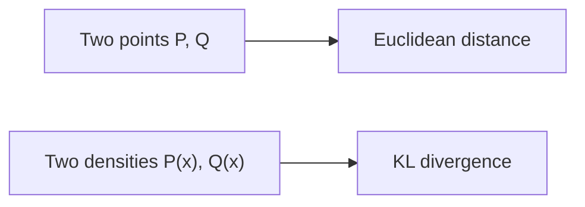

---

## Definition (lecture wording)

KL measures how a distribution **$Q(x)$** differs from a **reference** distribution **$P(x)$**.

$P$ is the reference (later: **true data**). $Q$ is the other distribution (later: **what the model learned**).

### Three pictures

| Case | Overlap | KL |
|------|---------|----|
| $P$ and $Q$ **identical** (blue $P$, red $Q$ stacked) | Complete | **$0$** |
| Nearby means, **good but not perfect** overlap | Partial | **Small** |
| Means far, **almost no overlap** | Little | **Large** |

KL is not “a distance you can draw with a ruler”; it is a **mismatch score** that is zero only when the two densities match.

---

## Forward KL

### Discrete

$$
D_{\mathrm{KL}}(P \,\|\, Q) = \sum_x P(x)\,\log\frac{P(x)}{Q(x)}
$$

(The **why** of this formula is Part B. Here we only name terms.)

### Continuous

$$
D_{\mathrm{KL}}(P \,\|\, Q) = \int P(x)\,\log\frac{P(x)}{Q(x)}\,dx
$$

### What it punishes

On the slide (black $P$, red $Q$): there is a region where **$P(x)>0$** but **$Q(x)=0$** (or $\approx 0$). $Q$ **failed to cover** mass that $P$ actually has.

- Forward KL **strongly penalizes $Q$** for missing regions of $P$.
- If $Q=0$ in the log ratio, $P/Q$ **blows up** → forward KL is **huge** → the learner is forced to react.

### What $Q$ then does: spread out (mode covering)

The fix forward KL “wants”: **push $Q$ to spread** until it covers the **entire support of $P$**.

If $P$ is **bimodal** and a narrow $Q$ sits on only one bump, spreading $Q$ makes a **wide** density that covers **both** modes. That is **mode covering**. A side effect appears in the examples below (mass in the **gap**).

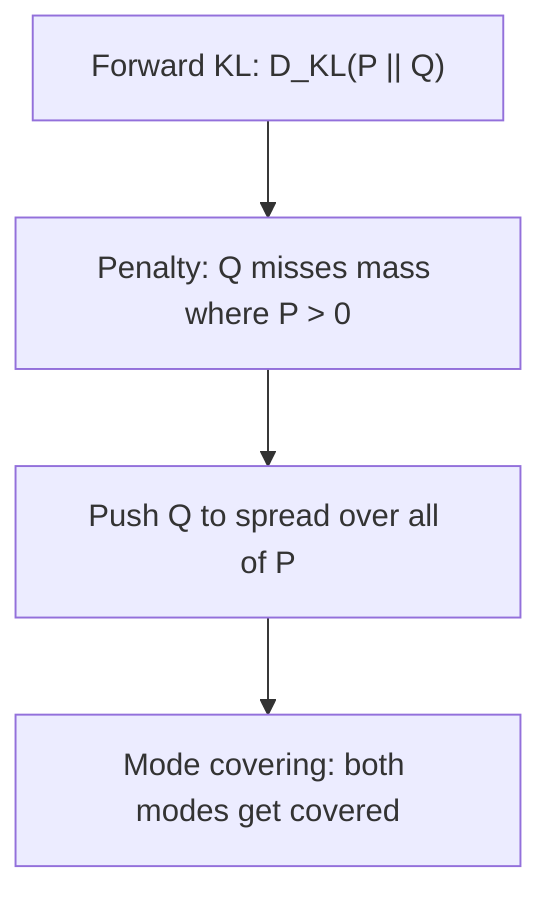

---

## Reverse KL

Notation in the lecture: reverse is **$Q$ then $P$**, i.e. $D_{\mathrm{KL}}(Q \,\|\, P)$.

### Discrete

$$
D_{\mathrm{KL}}(Q \,\|\, P) = \sum_x Q(x)\,\log\frac{Q(x)}{P(x)}
$$

### Continuous

$$
D_{\mathrm{KL}}(Q \,\|\, P) = \int Q(x)\,\log\frac{Q(x)}{P(x)}\,dx
$$

### What it punishes

Now $Q$ has leaked into a region where **$P$ has no mass** (or almost none). $P$ is the **true / given** data distribution. Mass that $Q$ puts there is **not in the real data**.

- If $P\approx 0$ in the denominator, reverse KL is **large**.
- Reverse KL **punishes $Q$ for placing probability where $P$ is empty**.

### Multimodal $P$: sit on one mode (mode seeking)

With **two modes**, a reverse-KL $Q$ often **locks onto one bump** and **ignores the other**. That is **mode seeking**: sharp, realistic samples **from the chosen mode only**.

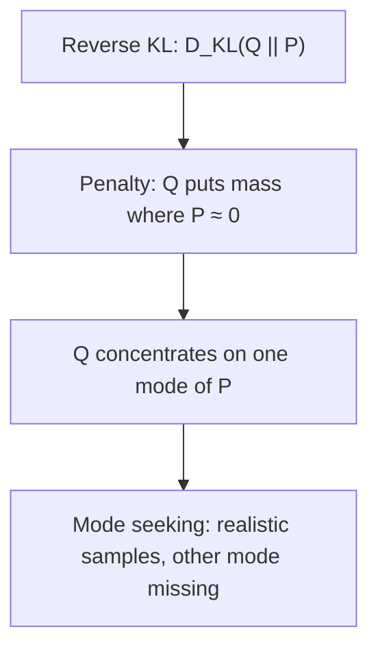

---

## $P(x)$ vs $Q_\theta(x)$ on a real table

Any problem gives you a **dataset**. The running table has **two features**. The job of a generative model is to **emit new rows**, which first requires learning the **unknown true density**.

### How the lecture draws $P(x)$

1. Take **feature 1** values.  
2. Split the range into **bins**.  
3. **Count** how many samples fall in each bin.  
4. Histogram: $x$-axis = feature-1 range, $y$-axis = **frequency**.  
5. Repeat for **feature 2**.

The screenshot on the left is only a **few rows**; the full set is large (e.g. you may not see a “4” in the screenshot even if that bin exists in the full data).

Those histograms **are** the true distribution, called **$P(x)$**. Samples were drawn from this unknown $P$. The **model is not told** the shape (perfect bell vs wiggles).

### What a VAE (any generative net) actually learns

Training sees only a **finite** set of samples, so it cannot recover $P$ exactly. It learns an **approximation** $Q_\theta(x)$, where **$\theta$** = network **weights and biases**.

**Goal:** $Q_\theta$ as close as possible to $P$. Then **samples from $Q_\theta$** look like real data.

At the start of training $P$ and $Q_\theta$ differ; mismatch is **quantified by KL**, either forward ($P$ from $Q$) or reverse.

### Two failure pictures (blue = $P$, dotted red = $Q$)

| Picture | What you see on the $x$-axis | Name |
|---------|------------------------------|------|
| $P$ still has mass, $Q$ has already gone to **0** | Model **missed** real data | **Forward KL** situation |
| $Q$ has mass where **$P$ is empty** | Model will emit **unrealistic** extras | **Reverse KL** situation |

### Why we never hand $P$ to the model

If the true density were given, generation would copy it with **no variation**. We **let the net learn** an approximation from **few training points** so new samples are **variants** of the real data, not clones. The approximation should still **sit close** to $P$ — that closeness is KL.

---

## Example 1 — heights (mode covering vs mode seeking)

Dataset of people:

| Group | Height | Role on the plot |
|-------|--------|------------------|
| Short cluster | **160 cm** | Mode A |
| Tall cluster | **190 cm** | Mode B |
| Very few people | **175 cm** | Low-density gap |

Two clear clusters; almost nobody in between.

### Forward KL = mode covering

Forward KL **forces $Q$ to cover both modes**. A **single Gaussian** $Q$ becomes **so broad** that it sits over 160 **and** 190.

- **Good:** both groups are represented.  
- **Bad:** the **peak of that wide Gaussian sits near 175**. The model then **samples 175 cm a lot**, even though the data almost never has that height. Those in-between people are **unrealistic** relative to the true density.

### Reverse KL = mode seeking

$Q$ **locks onto one mode** — either the 160 cluster **or** the 190 cluster.

| If $Q$ covers… | Samples look like | Misses |
|----------------|-------------------|--------|
| Cluster A (160) | Short people, **realistic** | All tall people |
| Cluster B (190) | Tall people, **realistic** | All short people |

**Advantage:** draws from the chosen mode are **on-data**. **Disadvantage:** the **other valid group never appears**.

---

## Example 2 — cats and dogs

Training images: **cats** and **dogs**. Task: generate **animal** images (new cats or dogs).

### Forward KL (cover both modes)

$Q$ is again **broad** enough to cover **both** class clouds. The **high-density region of $Q$ is in the middle**, where the data has **no** true animals. Samples become **hybrids**: a cat that, as you move along the row, picks up **dog features** — **unrealistic in-between** images.

**Punchline:** mode covering **hits every mode** but can emit **unrealistic interpolations**.

### Reverse KL (mode seeking)

$Q$ learns **cats well** *or* **dogs well**, not both.

- Generate cats → **dogs missing**.  
- Generate dogs → **cats missing**.

**Punchline:** mode seeking gives **sharp, realistic** samples **from one mode**; the other mode is **gone**.

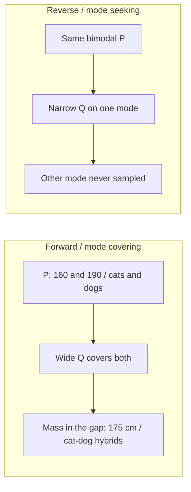

---

## Forward vs reverse (cheat sheet)

| | Forward $D_{\mathrm{KL}}(P \,\|\, Q)$ | Reverse $D_{\mathrm{KL}}(Q \,\|\, P)$ |
|--|--------------------------------------|----------------------------------------|
| Discrete | $\sum P\log(P/Q)$ | $\sum Q\log(Q/P)$ |
| Continuous | $\int P\log(P/Q)\,dx$ | $\int Q\log(Q/P)\,dx$ |
| Penalty | $Q$ **misses** mass of $P$ | $Q$ **invents** mass where $P$ is empty |
| Multimodal behaviour | **Mode covering** (spread $Q$) | **Mode seeking** (one mode) |
| Typical artefact | Unrealistic **in-between** samples | **Missing** the other real cluster |

### Key takeaways

- KL replaces Euclidean distance when $P$ and $Q$ are **densities**, discrete or continuous.
- Identical densities → KL **0**; slight mismatch → **small**; far means → **large**.
- **Forward** KL makes $Q$ **cover** $P$ (risk: gap samples). **Reverse** KL makes $Q$ **seek one mode** (risk: drop the other mode).
- In a VAE, $P$ is the unknown data distribution and $Q_\theta$ is the learned approximation; KL is how we **score** the mismatch. The algebraic identity is the **next** lecture.

---


\newpage

# L20: Intuition behind KL divergence — Part B

**Video:** [Lec 20](https://www.youtube.com/watch?v=5-O3uduPc8A) · 28:03  
**Instructor in this lecture:** Prof. Ashwini Kodipalli

### Learning objectives

- Define **self-information** $I(x)=-\log P(x)$ as surprise of **one** outcome, with the weather numbers in **bits**.
- Define **entropy** $H(P)$ as the **average** surprise of a whole distribution (one number for uncertainty).
- Define **cross-entropy** $H(P,Q)$ as surprise of the **true** outcome under the **model’s** $Q$.
- Derive **forward KL** as the lecture did: $D_{\mathrm{KL}}(P \,\|\, Q)=H(P,Q)-H(P)$, down to $\sum P\log(P/Q)$.

Watch Part A first. This video **finishes KL**. VAE architecture starts next.

---

## Running example: tomorrow’s weather

Two outcomes: **sunny** or **rainy**. The trained model’s predictive distribution (used in every numerical slide):

| Outcome $x$ | $P(x)$ | Spoken percent |
|-------------|--------|----------------|
| Sunny | **0.875** | 87.5% (also said “around 87% / 90%”) |
| Rainy | **0.125** | 12.5% |

---

## Self-information (surprise of one outcome)

**If tomorrow is sunny:** you are **not** surprised. The model already assigned **0.875**.  
**If tomorrow is rainy:** you **are** surprised. Rain was **unlikely**.

Self-information of an outcome $x$ with probability $P(x)$:

$$
I(x) = \log \frac{1}{P(x)} = -\log P(x)
$$

($\log(1/a)=-\log a$.)

| $P(x)$ | $I(x)$ | Reading |
|--------|--------|---------|
| Large (sunny happened, as predicted) | **Small** | Little surprise |
| Small (rain happened) | **Large** | Much surprise |

$I$ and $P$ are **inversely** related, which is why $1/P(x)$ appears.

### Why a logarithm?

For **independent** events, $P(AB)=P(A)P(B)$. A log turns the **product into a sum**: $\log(AB)=\log A+\log B$. That is the lecture’s reason for $\log$.

**Base 2** → unit is **bits**.

### Weather numbers (base 2)

$$
I(\text{sunny}) = -\log_2(0.875) = 0.193 \text{ bits}
$$

$$
I(\text{rainy}) = -\log_2(0.125) = 3 \text{ bits}
$$

Rain carries **more** self-information because it is **less likely**. Self-information is always about **one** realized outcome.

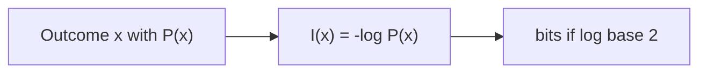

---

## Entropy (uncertainty of the whole distribution)

Before tomorrow arrives, **either** sunny **or** rainy can occur. There is **uncertainty**. Entropy folds **every** outcome’s surprise into **one average**.

Self-information: **one** observed $x$.  
Entropy: **one number** for the **entire** $P$.

$$
H(P) = \sum_x P(x)\,I(x) = \sum_x P(x)\big(-\log P(x)\big) = -\sum_x P(x)\log P(x)
$$

Equivalently without a leading minus:

$$
H(P) = \sum_x P(x)\,\log\frac{1}{P(x)}
$$

### Plug in the weather $P$

Two terms, sunny and rainy:

$$
H(P) = 0.875\cdot I(\text{sunny}) + 0.125\cdot I(\text{rainy}) = 0.544 \text{ bits}
$$

(Using the $0.193$ and $3$ from above: $0.875\times 0.193 + 0.125\times 3 \approx 0.544$.)

**Low entropy (0.544):** one outcome is **much more likely** than the other (87.5% vs 12.5%). The situation is **relatively predictable**.

### Two other $P$’s the lecture compares

| Model’s $(P_{\text{sun}}, P_{\text{rain}})$ | $H(P)$ | Meaning |
|---------------------------------------------|--------|---------|
| $(0.875,\ 0.125)$ | **0.544** (low) | One event dominates |
| $(0.5,\ 0.5)$ | **1** (maximum for two outcomes, bits) | Coin toss: **maximum uncertainty**, result unpredictable |
| $(0,\ 1)$ or $(1,\ 0)$ | **0** | **No** uncertainty: weather is fully determined |

Entropy = **before you see the outcome**, how uncertain is the **whole** experiment: multiply each outcome’s surprise by its probability and **add**.

---

## Cross-entropy (true $P$ vs model $Q$)

Now there is a **target** (true) distribution $P$ and a **predicted** distribution $Q$.

**Actual outcome = sunny** → one-hot target

$$
P = (1,\ 0)
$$

(sunny gets 1, rainy gets 0). The model still outputs $Q=(0.875,\ 0.125)$.

Cross-entropy $H(P,Q)$ mixes **$P$’s mass** with **surprise under $Q$**:

$$
H(P,Q) = -\sum_x P(x)\,\log Q(x) = \sum_x P(x)\,I_Q(x)
$$

where $I_Q(x)=-\log Q(x)$ is surprise if you score the outcome with the **model**.

### Case 1 — model agrees with the truth

$P=(1,0)$, $Q=(0.875,0.125)$:

$$
H(P,Q) = -\,1\cdot\log_2(0.875) - 0\cdot\log_2(0.125) = 0.193
$$

(The lecture also says **0.195** while writing the same substitution; the log calculation is **0.193 bits**, same as $I(\text{sunny})$ under $Q$.)

**Small** cross-entropy: the model put **high** $Q$ on the **correct** class.

### Case 2 — model is confident in the wrong class

Truth is still sunny, $P=(1,0)$, but $Q$ now puts only **0.125** on sunny (the rest on rain). Only the sunny term survives:

$$
H(P,Q) = -\log_2(0.125) = 3
$$

**Large** cross-entropy: the model assigned **low** probability to the **correct** class → **large loss**.

| $Q$ on the true class | $H(P,Q)$ | Lecture reading |
|-----------------------|----------|-----------------|
| High (0.875 on sunny) | **0.193** (small) | Model matches the answer |
| Low (0.125 on sunny) | **3** (large) | Model missed the correct class |

**Definition as stated:** cross-entropy measures how well predicted $Q$ **matches** target $P$. It is “how **surprised the model is** about the **correct** answer.”

$P(x)$ = true probability of $x$; $-\log Q(x)$ = surprise the **model** assigns to that $x$. Combining them is $H(P,Q)$.

You can also write

$$
H(P,Q) = \sum_x P(x)\,\log\frac{1}{Q(x)}
$$

This is the bridge the lecture flags: KL will look like $P\log(P/Q)$.

---

## Derivation of (forward) KL — exactly the board work

Ingredients: cross-entropy and entropy (both built from self-information).

$$
D_{\mathrm{KL}}(P \,\|\, Q) = H(P,Q) - H(P)
$$

Substitute the sums (discrete, as on the slide):

$$
H(P,Q) = -\sum_x P(x)\log Q(x),\qquad
H(P) = -\sum_x P(x)\log P(x)
$$

Then

$$
H(P,Q)-H(P)
= -\sum_x P(x)\log Q(x) \;-\; \Big(-\sum_x P(x)\log P(x)\Big)
$$

Minus of minus is plus:

$$
= -\sum_x P(x)\log Q(x) + \sum_x P(x)\log P(x)
$$

**Rearrange** so the **positive** $\log P$ term is written first:

$$
= \sum_x P(x)\log P(x) - \sum_x P(x)\log Q(x)
$$

**Factor** the common $P(x)$:

$$
= \sum_x P(x)\Big(\log P(x) - \log Q(x)\Big)
$$

**Log identity** $\log a - \log b = \log(a/b)$:

$$
D_{\mathrm{KL}}(P \,\|\, Q) = \sum_x P(x)\,\log\frac{P(x)}{Q(x)}
$$

That is **forward KL** — the same formula as Part A, now derived.

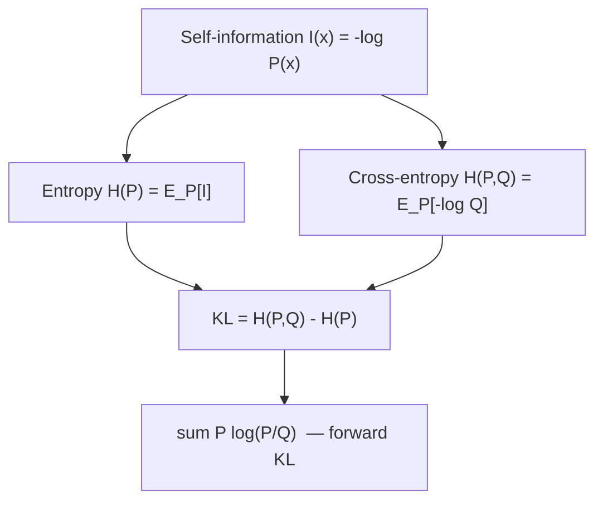

---

## Why this formula is in week 3

VAE **loss** (next lectures) contains a **KL** term; week 4’s advanced VAEs still use it. The point of Parts A and B is to know **what the formula is** and **how it was obtained** before encoder / decoder math.

### Key takeaways

- $I(x)=-\log P(x)$: surprise of **one** outcome (sunny **0.193 bits**, rain **3 bits** at these $P$).
- $H(P)$: average surprise of **all** outcomes (**0.544** here; **1** if 50–50; **0** if deterministic).
- $H(P,Q)$: score $Q$ against true $P$ (small if $Q$ is high on the correct class).
- Forward KL is **cross-entropy minus entropy**, which algebraically is $\sum P\log(P/Q)$.

---


\newpage

# L21: Introduction to VAE and the working of the encoder

**Video:** [Lec 21](https://www.youtube.com/watch?v=hOu8AoG83H4) · 41:14  
**Instructor in this lecture:** Prof. Ashwini Kodipalli

### Learning objectives

- Contrast autoencoders (**reconstruction**) with VAEs (**generation** of new samples).
- State the generative goal: from finite unlabeled samples, learn $p_\theta(x)\approx p_{\text{data}}(x)$.
- Explain why the encoder learns an **approximate posterior** $q_\phi(z\mid x)$, not the true $p(z\mid x)$.
- List the **Gaussian** assumptions on $p(z)$ and $q_\phi(z\mid x)$, and what the encoder actually outputs (**mean** and **log-variance**).
- Walk the lecture’s **latent-size-5** sampling picture.

Decoder, ELBO, and “why the evidence integral is intractable” are **this video + the next**. Watch them as a pair.

---

## Motivation: reconstruction is not enough

Week 2 autoencoders reconstruct $x$. A VAE is introduced because we also want **new samples** — **generation**, not only copying the input.

---

## Iris picture: class-conditional clouds (labels unused)

The **Iris** table has $n$ samples $x_1,\ldots,x_n$ and three species: **setosa**, **versicolor**, **virginica** (ASR: “sautazo / versicol”). Within a class, **petal width** and **petal length** sit in a similar range — each class has its own **class-conditional** pattern.

A VAE is **unsupervised**: **class labels are not used in training**. The net must still learn the **underlying pattern** so it can emit a new $x$ that looks like the table.

### What we do not know

- The **true** data distribution.  
- The **functional form** (Gaussian? Bernoulli? Poisson?).  

All we have is a **finite training set** drawn from that unknown law.

### What a generative model must do

1. Learn the **underlying distribution**.  
2. Sample a new $x_{\text{new}}$ that looks like training data.

With only a few points we learn an **approximation** $p_\theta(x)$, $\theta=$ **weights and biases**. Early in training $p_\theta$ is far from $p_{\text{data}}$; as $\theta$ updates they **move together**. Then we can **sample** from $p_\theta$.

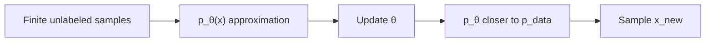

---

## Recap: deterministic autoencoder

$x$ → **encoder** → compact **latent** (important variations) → **decoder** → reconstruction. Compare to $x$; if the gap is large, **backprop**, update parameters, until reconstruction matches $x$.

If a VAE did **only** this, we would **lose generation**. The change is **probabilistic** maps.

---

## Two spaces, two distributions

| Object | Distribution | Lives in |
|--------|--------------|----------|
| Data $x_1,\ldots,x_n$ | $p_{\text{data}}(x)$ | **Data space** (input dimension / structure) |
| Latent $z$ | $p(z)$ | **Latent space** (different dimension / structure) |

Because $x$ and $z$ live in **different spaces**, mapping $x\to z$ and $z\to\hat x$ must be **probabilistic**.

| Autoencoder | VAE |
|-------------|-----|
| Encoder | **Probabilistic encoder** |
| Latent code | Latent **distribution** |
| Decoder | **Probabilistic decoder** |

---

## Encoder: approximate posterior, not true posterior

**True posterior** (what we wish we had):

$$
p(z\mid x) = \text{probability of latent }z\text{ given data }x
$$

The encoder **does not** compute this. True posterior is **hard** (denominator — hold this; decoder lecture finishes the argument). Instead it learns an **approximate posterior** with **learnable** $\phi$ (weights):

$$
q_\phi(z\mid x) \approx p(z\mid x)
$$

**Encoder’s job:** $q_\phi(z\mid x)$ — “probability of $z$ given $x$.”

**Decoder’s job** (named here, derived next video): **likelihood**

$$
p_\theta(x\mid z)
$$

—“probability of reconstructing / generating $x$ given $z$.”

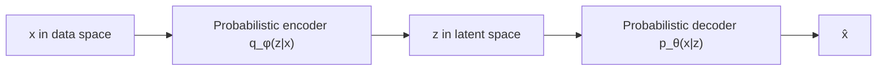

---

## Bayes’ rule and why $p(z\mid x)$ is refused

From Bayes (ASR: “base theorem”):

$$
p(z\mid x) = \frac{p(x\mid z)\,p(z)}{p(x)}
$$

| Factor | Name in the lecture |
|--------|---------------------|
| $p(z\mid x)$ | True **posterior** |
| $p(z)$ | **Prior** |
| $p(x\mid z)$ | **Likelihood** |
| $p(x)$ | **Evidence** |

$p(x)$ in the denominator is **hard**: it needs an **integral over all possible latent $z$**. That sentence is parked until the decoder video. **Because of that**, VAE never uses the true posterior; it uses $q_\phi(z\mid x)$.

---

## $z$ is a vector, not a scalar

You cannot crush **100** features to **one** number without throwing information away. If the latent size is **25**, 100 inputs become a **25-D vector**: the 100 values are **compressed** into 25 important coordinates — you have **not** deleted 75 features and kept 25 raw ones.

| Input features | Latent size | What $z$ is |
|----------------|-------------|-------------|
| 100 | 1 | Forbidden in the lecture: too much information lost |
| 100 | **25** | A **vector** of length 25 |

Same AE idea: **meaningful, lower-dimensional** representation of $x$. The VAE encoder has that same job, plus the probabilistic layer below.

---

## Assumption 1: prior $p(z)$ is Gaussian

We **do not know** the geometry of latent space. The lecture’s assumption:

$$
p(z) \sim \mathcal{N}(\mu, \sigma^2)
$$

(standard VAE: typically $\mathcal{N}(0,I)$; the slide insists on **Gaussian** with **mean and variance**).

**Why Gaussian, not some other family?** (for now)

1. **Simple / mathematically convenient** — only **two** parameters (mean, variance).  
2. **Sampling is easy**.

A fuller “why” returns when $q$ is also Gaussian.

---

## Assumption 2: $q_\phi(z\mid x)$ is Gaussian too

Encoder must output a **distribution**. Rather than an arbitrary complex density, **restrict $q_\phi$ to Gaussian**. Then the encoder outputs **only two objects: mean and variance**.

**Why match the prior’s family?** $p(z)$ is already Gaussian and is the **reference**. If $q_\phi(z\mid x)$ is Gaussian too, we can **compare** them. **KL divergence** (regularizer in the loss, next to **reconstruction loss**) **keeps the encoder Gaussian close to the prior Gaussian**.

Training is easy: learn **two** parameter maps. Sampling $z$ is easy: draw from that Gaussian.

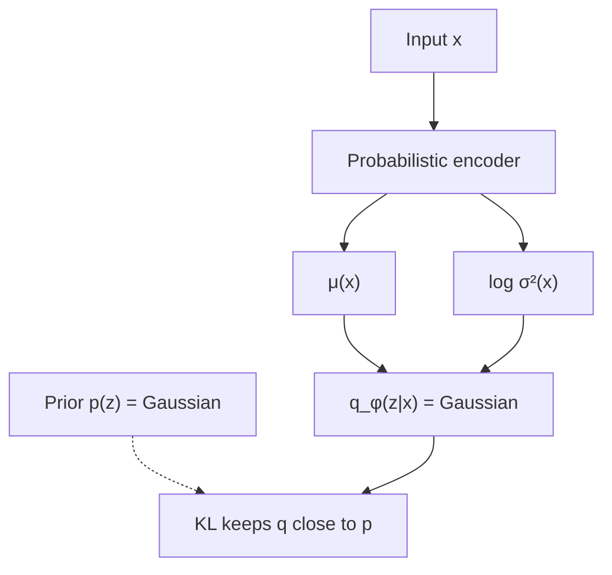

---

## Encoder as a neural net (end-to-end sketch)

The probabilistic encoder **is** a net:

- **Tabular** $x$ → **MLP** (hidden layers, weights, biases, activations).  
- **Image** $x$ → **CNN**.

At the **last encoder stage** the lecture’s code-shaped output is:

- a **mean** vector, and  
- a **log-variance** vector  

Gaussian needs **mean and variance**, so convert log-variance with the usual identity (same conversion used in the week-3 numerical example and the week-4 lab):

$$
\sigma^2 = \exp(\log\sigma^2),\qquad \sigma = \sqrt{\sigma^2} = \exp\!\big(\tfrac12\log\sigma^2\big)
$$

**Latent size is a hyperparameter** you set in code. Example: size **5** → five means, five log-variances (then five variances), five coordinates $z_1,\ldots,z_5$.

### Sampling $z$ (this lecture’s meaning)

Each pair $(\mu_j,\sigma_j^2)$ is one 1-D Gaussian. **Sampling** = **randomly pick one number** from that Gaussian → $z_j$. Do this for $j=1,\ldots,5$. Pass the five-vector into the decoder (next video).

Worked numbers on the slide: after converting log-variance → variance, a **random** draw near the first mean might be $z_1=0.65$. It could equally have been **0.45**, **0.55**, **0.67**, … — **infinitely many** $z$ for **one** $x$.

That infinity is the **hint** why the Bayes denominator $p(x)$ is hard: you cannot list “the” $z$ that produced $x$. The decoder lecture turns the hint into the integral $\int p(x\mid z)p(z)\,dz$.

Until that lecture, the encoder story is: **$x$ in → $\mu$ and $\log\sigma^2$ out → sample $z$**. Why only $\mu,\sigma^2$? Because both $p(z)$ and $q_\phi(z\mid x)$ were assumed **Gaussian**.

### Key takeaways

- AE reconstructs; VAE must **generate** by learning $p_\theta(x)$ from unlabeled samples.
- Encoder’s target is $p(z\mid x)$, but evidence $p(x)=\int p(x\mid z)p(z)\,dz$ is **intractable**, so we train $q_\phi(z\mid x)$.
- Prior $p(z)$ and approximate posterior $q_\phi$ are both taken **Gaussian**; encoder emits **$\mu$ and $\log\sigma^2$**; **KL** pins $q$ to the prior.
- $z$ is a **vector**; sampling it is a **random pick** from each coordinate’s Gaussian, so one $x$ has **infinitely many** latents.

---


\newpage

# L22: Probabilistic decoder, ELBO, and the VAE loss

**Video:** [Lec 22](https://www.youtube.com/watch?v=09A4OkjUjt0) · 44:39  
**Instructor in this lecture:** Prof. Ashwini Kodipalli

### Learning objectives

- Describe the decoder as a net that maps sampled $z$ to **likelihood parameters** (Gaussian vs Bernoulli, by data type).
- Use the lecture’s **5-feature / latent-size-2** example to see **infinitely many** $z$ for one $x$, and slightly different $\hat x$ that stay near $x$.
- Explain why $p(x)=\int p(x\mid z)p(z)\,dz$ is **intractable**, so the encoder never learns the **true** posterior.
- Write **ELBO** as reconstruction minus KL, and the **VAE loss** as **minimize** $-\text{ELBO}$.
- State the **closed-form Gaussian KL** and why **naïve sampling of $z$ blocks backprop** (reparameterization is the next video).

This lecture answers questions parked in L21. There is still **no full architecture diagram** — that comes **after** the reparameterization trick.

---

## From encoder to $z$ (recap)

Encoder outputs **mean and variance** of $q_\phi(z\mid x)$. **Sampling** $z$ means **randomly picking a number** from that Gaussian (L21’s numerical sketch). That $z$ is the **input to the decoder**.

---

## Role of the probabilistic decoder

The VAE should **generate new data** (and can reconstruct). The decoder is a neural net: $z$ in, reconstruction / sample out.

Because it is **probabilistic**, it outputs **parameters of the likelihood** $p_\theta(x\mid z)$ — “probability of $x$ given $z$.” Which parameters depend on **what you are generating**.

| Data you reconstruct / generate | Likelihood | Decoder outputs | How you get $\hat x$ |
|---------------------------------|------------|-----------------|----------------------|
| **Continuous / real** values | **Gaussian** | **Mean and variance** | Theory: **sample** $\hat x$ from that Gaussian. Practice (next numerical lecture): the **mean itself** is $\hat x$ |
| **Binary** (each feature / pixel 0 or 1) | **Bernoulli** | A **probability per feature** | $\hat x$ sampled from those Bernoullis |

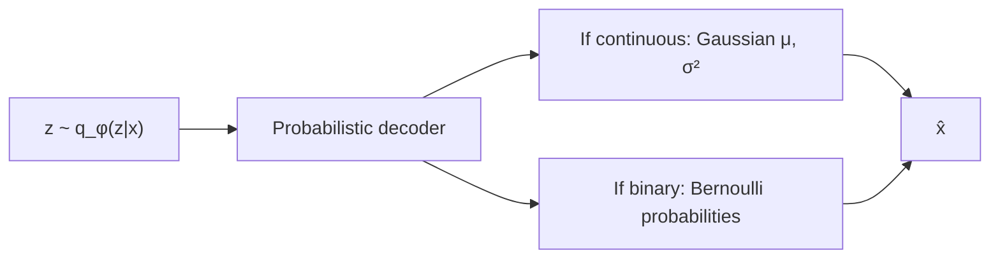

---

## Numerical picture of the decoder

**Input $x$:** **five** continuous features.  
**Latent size:** **2** → two means, two variances (convert log-variance → variance if needed).

$z_1$ is drawn from the first Gaussian, $z_2$ from the second. **The draw is not fixed.** First pick might be one pair; next pick another. There is **no end**: **infinitely many** $(z_1,z_2)$ for **one** $x$.

Spoken examples of “randomly pick a number”: 0.45, 0.46, 0.55, 0.54, 0.51, then later 0.55, 0.22, 0.46, $-0.2$, …

### Three concrete samples (lecture)

| Sample | $(z_1, z_2)$ |
|--------|----------------|
| $z^{(1)}$ | $(0.56,\ -0.11)$ |
| $z^{(2)}$ | $(0.43,\ -0.32)$ |
| $z^{(3)}$ | $(0.61,\ -0.24)$ |

Each vector is **different**. Each is passed through the **same** decoder.

Decoder last layer has **five** neurons (match the five features). Three latents → three reconstructions $\hat x^{(1)}, \hat x^{(2)}, \hat x^{(3)}$, **slightly different** from each other, **all near the original $x$**. Variation in $z$ **causes** variation in $\hat x$. That is **generation**: not a single copy of $x$, but new points around it.

Early in training, $\mu,\sigma^2$ are arbitrary. After backprop, they are **optimized**, so decoder outputs stay **close to $x$** while still **differing** across samples.

**Punchline:** many latent vectors, many reconstructions, **all similar to the original input**.

---

## Why $p(z\mid x)$ is intractable (the L21 question)

Facts already on the table:

- **Infinitely many** $z$ for one observed $x$.  
- You **cannot** point to **one** $z$ and say “this latent produced this $x$ through the decoder.”

To answer “which $z$ generated this $x$?” you need the **true posterior** $p(z\mid x)$, hence Bayes:

$$
p(z\mid x) = \frac{p(x\mid z)\,p(z)}{p(x)},\qquad
p(x) = \int p(x\mid z)\,p(z)\,dz
$$

The integral (lecture: **sum over all latents** that could have produced $x$) has **no finite list**. For a neural decoder this integral is **intractable**. So we **never** train $p(z\mid x)$; we train $q_\phi(z\mid x)$.

### Two factors inside the integrand (why each $z$ “contributes”)

For **every** candidate $z$:

1. **Likelihood** $p(x\mid z)$: decoder’s probability that **this** $z$ would generate the observed $x$ (could be 0.8, 0.2, …).  
2. **Prior density** $p(z)$: if the coordinates of $z$ sit **near the origin** (near **0**), **high** prior density; if they are **far from 0**, **low** prior density. Example: a $z$ near origin gets relatively **high** $p(z)$; a $z$ with large coordinates gets **low** $p(z)$.

**Contribution of one $z$:** product $p(x\mid z)\,p(z)$.  
**Evidence $p(x)$:** **integral / sum of all such products** — infinitely many terms. That is the hard denominator.

### $q_\phi$ vs $p(z\mid x)$ — not “just a letter”

| | True posterior $p(z\mid x)$ | Approximate $q_\phi(z\mid x)$ |
|--|-----------------------------|-------------------------------|
| Rule it follows | **Bayes** (needs $p(x)$) | **Gaussian** (output $\mu$, $\sigma^2$) |
| Denominator | Integral over **all** $z$ | **None** |
| What the net emits | Would need that integral | Mean and variance of $q_\phi$ |

The difference is **not** merely writing $P$ vs $Q$. One is Bayesian with an infinite integral; the other is a Gaussian encoder.

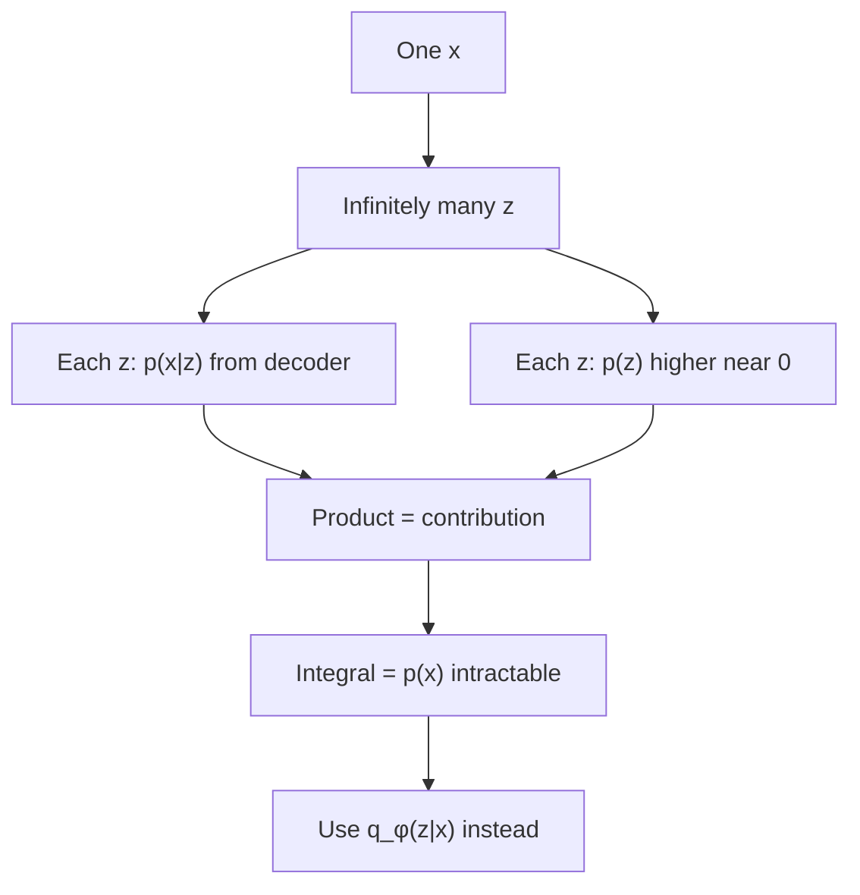

---

## What we actually want after training (MNIST thought experiment)

If the model has really learned the data distribution on **MNIST digits**:

- **Digit-like** images → **high** $p_\theta(x)$  
- **Noisy / non-digit** images → **low** $p_\theta(x)$

So the ideal objective is **maximize** $\log p_\theta(x)$. But $\log p_\theta(x)$ **cannot be computed** (same integral over all $z$ that could have generated $x$).

---

## ELBO — evidence lower bound

**ASR: “elbow” / “evidence low bound.”** Instead of maximizing $\log p_\theta(x)$, maximize a **simpler** objective: the **ELBO**, the **lower bound** of $\log p_\theta(x)$. **The VAE maximizes the ELBO** — it does **not** maximize $\log p_\theta(x)$ directly.

As written in the lecture, two pieces:

$$
\text{ELBO}
= \underbrace{\mathbb{E}_{q_\phi(z\mid x)}\big[\log p_\theta(x\mid z)\big]}_{\text{reconstruction / log-likelihood}}
- \underbrace{D_{\mathrm{KL}}\big(q_\phi(z\mid x) \,\|\, p(z)\big)}_{\text{KL regularizer}}
$$

The first term is the **log-likelihood** of the observed $x$ under the decoder, in expectation over $z\sim q_\phi(z\mid x)$. The second term is the **KL** from L19–L20, now between **encoder Gaussian** and **prior Gaussian**.

### Reconstruction term

Encoder has learned $\mu,\sigma^2$; $z$ is sampled from $q_\phi(z\mid x)$; decoder should assign **high** probability to the **observed** $x$ — i.e. reconstruct $x$.

| Data type | Reconstruction in code |
|-----------|------------------------|
| Continuous / real | **MSE** |
| Binary | **Binary cross-entropy** |

If the encoder’s Gaussian is right, reconstruction is right.

### KL term

$p(z)$ is Gaussian; $q_\phi(z\mid x)$ is assumed Gaussian. KL **keeps the encoder distribution close to the prior** (L19–L20 intuition).

---

## From ELBO to VAE **loss** (max → min)

The reconstruction / log-likelihood term is something we want to **maximize** (high probability on observed $x$). Neural nets are trained to **minimize** a loss.

**Max of $f$ = min of $-f$.** Put a **minus** on the whole ELBO:

$$
\mathcal{L}_{\text{VAE}} = -\text{ELBO}
= -\mathbb{E}_{q_\phi}\big[\log p_\theta(x\mid z)\big]
+ D_{\mathrm{KL}}\big(q_\phi(z\mid x) \,\|\, p(z)\big)
$$

Board-level sign chase the lecture walks: minus in front of the **whole** ELBO; the reconstruction piece had been a term we wanted **large**, so **minus of that** is the error we **minimize**. If a minus already sat on the KL inside ELBO, **minus of minus** on that piece becomes a **plus**: KL is **added** to the loss.

| Term in $\mathcal{L}_{\text{VAE}}$ | Continuous / real $x$ | Binary $x$ |
|------------------------------------|----------------------|------------|
| Reconstruction (from log-likelihood) | **MSE** | **BCE** |
| Regularizer | **KL**($q_\phi(z\mid x) \,\|\, p(z)$) | same |

That is the **VAE loss function** slide: reconstruction **plus** KL.

---

## Closed-form KL when both densities are Gaussian

Because $q_\phi(z\mid x)=\mathcal{N}(\mu,\sigma^2)$ (diagonal in practice) and $p(z)=\mathcal{N}(0,I)$, KL has a **closed form**: plug in numbers, get a scalar. The lecture writes the analytic expression (derived as “two Gaussians” — the discrete $\sum P\log(P/Q)$ of L20 specializes to this). Coordinate-wise:

$$
D_{\mathrm{KL}}\big(q_\phi(z\mid x) \,\|\, p(z)\big)
= \frac12\sum_j \Big(\mu_j^2 + \sigma_j^2 - 1 - \log\sigma_j^2\Big)
$$

Equivalent coding form (log-variance $l_j=\log\sigma_j^2$):

$$
\frac12\sum_j \big(\mu_j^2 + e^{l_j} - 1 - l_j\big)
= -\frac12\sum_j \big(1 + l_j - \mu_j^2 - e^{l_j}\big)
$$

L24 substitutes $\mu$, $\log\sigma^2$, and $\sigma^2$ into this family of formulae.

---

## Remaining hole: sampling $z$ breaks gradients

KL still **encourages** $q_\phi$ toward $p(z)$. But $z$ is **sampled** from $q_\phi$, and **every draw is different** — a **random** node. **Randomness breaks gradient flow.** There is **no fixed formula** $z=f(\mu,\sigma)$ in this picture, so you **cannot backprop through sampling** to the encoder weights.

The architecture is therefore **incomplete** until the **reparameterization trick** (next lecture). Only after that does the course draw the **solid VAE diagram**.

### Key takeaways

- Decoder outputs **likelihood parameters**: Gaussian $(\mu,\sigma^2)$ for continuous $x$, Bernoulli probabilities for binary $x$.
- One $x$ ↔ **infinitely many** $z$ ↔ many nearby $\hat x$ (**generation**).
- $p(x)=\int p(x\mid z)p(z)\,dz$ sums **unbounded** contributions; true posterior is **intractable**; encoder uses $q_\phi$.
- Maximize **ELBO** $= \mathbb{E}[\log p(x\mid z)] - \mathrm{KL}(q_\phi \,\|\, p)$. Minimize **loss** $= -\text{ELBO}$ = reconstruction (MSE or BCE) + KL.
- Naïve sampling of $z$ **blocks** backprop → reparameterization next.

---


\newpage

# L23: Reparameterization trick

**Video:** [Lec 23](https://www.youtube.com/watch?v=GA9T9kNoRd4) · 35:04  
**Instructor in this lecture:** Prof. Ashwini Kodipalli

### Learning objectives

- Restate the VAE loss (reconstruction + closed-form KL) and why **sampling $z$** blocks **backprop**.
- Show that **decoder** parameters are fine under ordinary chain rule; the break is $\partial z/\partial\mu$ and $\partial z/\partial\sigma$.
- Write the **reparameterization** $z=\mu+\sigma\odot\varepsilon$, $\varepsilon\sim\mathcal{N}(0,I)$, and treat $\varepsilon$ as a **constant** during backprop.
- Compute $\partial z/\partial\mu=1$ and $\partial z/\partial\sigma=\varepsilon$, then push gradients into the **encoder weights**.
- Draw the **full VAE architecture** the course withheld until this trick.

A full **numerical** forward pass is the **next** lecture.

---

## Loss we already have

Two terms (L22):

1. **Reconstruction** — how far $\hat x$ is from $x$: **MSE** if continuous, **BCE** if binary.  
2. **KL regularizer** — both $q_\phi(z\mid x)$ and $p(z)$ are Gaussian, so KL is the **closed form** that keeps the **encoder distribution close to the prior**.

$z$ appears in this story as a **sample** from $\mathcal{N}(\mu,\sigma^2)$: **randomly pick** a value given those parameters. **Sampling is a random operation. Randomness breaks gradient flow.** Without a gradient path you cannot update $\theta$.

**Question this lecture answers:** how do we get gradients when **part of the net is a sample**?

---

## Forward pass (before fixing sampling)

1. Input $x$ → encoder → parameters of $q_\phi(z\mid x)$: **mean $\mu$ and variance / std $\sigma$**.  
2. $z$ sampled from that Gaussian.  
3. $z$ → decoder $f_\theta$ → $\hat x$.

$$
\hat x = f_\theta(z)
$$

$\theta$ = decoder **weights and biases** (learnable). Updating $\theta$ pulls $\hat x$ toward $x$.

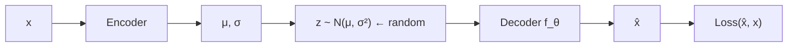

---

## Decoder side: ordinary backprop works

If $x$ is tabular, imagine decoder = **MLP**. Lecture’s two-layer sketch:

**Hidden layer** (ReLU):

$$
h_1 = \mathrm{ReLU}(W_1 z + b_1)
$$

Decoder takes $z$, multiplies by **input-to-hidden** $W_1$, adds $b_1$, applies **ReLU**. $h_1$ is the first hidden representation.

**Output layer:**

$$
\hat x = f(W_2 h_1 + b_2)
$$

$f$ depends on data type:

| Data | Output activation $f$ |
|------|------------------------|
| Binary | **Sigmoid** |
| Continuous | **Linear** |

**Learnable decoder parameters:** $W_1,b_1,W_2,b_2$.

Compute loss between $\hat x$ and $x$ (MSE or BCE). Initially loss is high; updates drive weights/biases toward an optimum.

### Chain rule at the output layer

$$
\frac{\partial L}{\partial W_2} = \frac{\partial L}{\partial\hat x}\,\frac{\partial\hat x}{\partial W_2},\qquad
\frac{\partial L}{\partial b_2} = \frac{\partial L}{\partial\hat x}\,\frac{\partial\hat x}{\partial b_2}
$$

All of these exist.

### Chain rule at the hidden layer

Path $L \to \hat x \to h_1 \to W_1$:

$$
\frac{\partial L}{\partial W_1} = \frac{\partial L}{\partial\hat x}\,\frac{\partial\hat x}{\partial h_1}\,\frac{\partial h_1}{\partial W_1}
$$

and likewise for $b_1$. **Decoder-side gradients are standard backprop. The decoder is not the problem.**

---

## Gradient w.r.t. $z$ is also fine

$\hat x$ is produced **from** $z$, so $L$ depends on $z$ through $\hat x$:

$$
\frac{\partial L}{\partial z} = \frac{\partial L}{\partial\hat x}\,\frac{\partial\hat x}{\partial z}
$$

Once sampled, $z$ is just a **numeric vector** into a differentiable decoder. Gradients **reach $z$**. The break is **behind** $z$, toward the encoder.

---

## Where it breaks: $\mu$ and $\sigma$

Encoder outputs $\mu$ and $\sigma$ (variance converted to **standard deviation**). We need $\partial L/\partial\mu$ and $\partial L/\partial\sigma$ so we can update encoder weights.

Chain rule **looks** like

$$
\frac{\partial L}{\partial\mu} = \frac{\partial L}{\partial z}\,\frac{\partial z}{\partial\mu},\qquad
\frac{\partial L}{\partial\sigma} = \frac{\partial L}{\partial z}\,\frac{\partial z}{\partial\sigma}
$$

$\partial L/\partial z$ we have. **$\partial z/\partial\mu$ and $\partial z/\partial\sigma$ we do not**, if $z$ is defined only as “a random draw from $\mathcal{N}(\mu,\sigma^2)$.” That sampling map is **not a differentiable function of $\mu$**. **Direct backprop through sampling is impossible.**

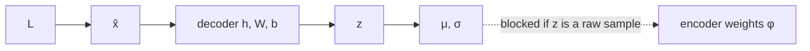

---

## Reparameterization: move the randomness into $\varepsilon$

**Do not** sample $z$ directly from $\mathcal{N}(\mu,\sigma^2)$. **Write**

$$
z = \mu + \sigma \odot \varepsilon,\qquad \varepsilon \sim \mathcal{N}(0, I)
$$

($\odot$ = elementwise product; lecture writes the 1-D form $z=\mu+\sigma\varepsilon$.)

- $\mu$ and $\sigma$ **depend on** $x$ and encoder parameters (weights, biases).  
- $\varepsilon$ is **independent** of $\mu$ and $\sigma$. It is **not learned**. It is a draw from a **standard Gaussian**. During backprop it is a **fixed number** (a **constant**).

**Why $\varepsilon$ at all?** One $x$ must still generate **many** $z$ (L21–L22). That diversity has to come from **somewhere**. $\varepsilon$ supplies the **randomness** without putting a non-differentiable sample **on the path** from $L$ to $\phi$.

Randomness is **separated** from encoder parameters. Now $z$ **is** a differentiable function of $\mu$ and $\sigma$.

---

## The two derivatives that were missing

$$
z = \mu + \sigma\,\varepsilon
$$

**W.r.t. mean**

$$
\frac{\partial z}{\partial\mu} = 1 + 0 = 1
$$

(first term depends on $\mu$; second term has **no** $\mu$.)

**W.r.t. standard deviation**

$$
\frac{\partial z}{\partial\sigma} = 0 + \varepsilon = \varepsilon
$$

(first term has **no** $\sigma$; second term contributes $\varepsilon$.)

Those were the unknown factors. They are now **1** and **$\varepsilon$**.

---

## Full backward path (end-to-end)

Decoder path unchanged: $L \to \hat x \to z$ with

$$
\frac{\partial L}{\partial z} = \frac{\partial L}{\partial\hat x}\,\frac{\partial\hat x}{\partial z}
$$

Then into encoder outputs:

$$
\frac{\partial L}{\partial\mu}
= \frac{\partial L}{\partial\hat x}\,\frac{\partial\hat x}{\partial z}\,\frac{\partial z}{\partial\mu}
= \frac{\partial L}{\partial z}\cdot 1
$$

$$
\frac{\partial L}{\partial\sigma}
= \frac{\partial L}{\partial\hat x}\,\frac{\partial\hat x}{\partial z}\,\frac{\partial z}{\partial\sigma}
= \frac{\partial L}{\partial z}\cdot\varepsilon
$$

Finally, **standard backprop** from $(\mu,\sigma)$ into encoder weights $\phi$:

$$
\frac{\partial L}{\partial\phi} = \frac{\partial L}{\partial\mu}\,\frac{\partial\mu}{\partial\phi} + \frac{\partial L}{\partial\sigma}\,\frac{\partial\sigma}{\partial\phi}
$$

Gradients run from the **output** all the way to the **encoder**. **End-to-end training is possible.**

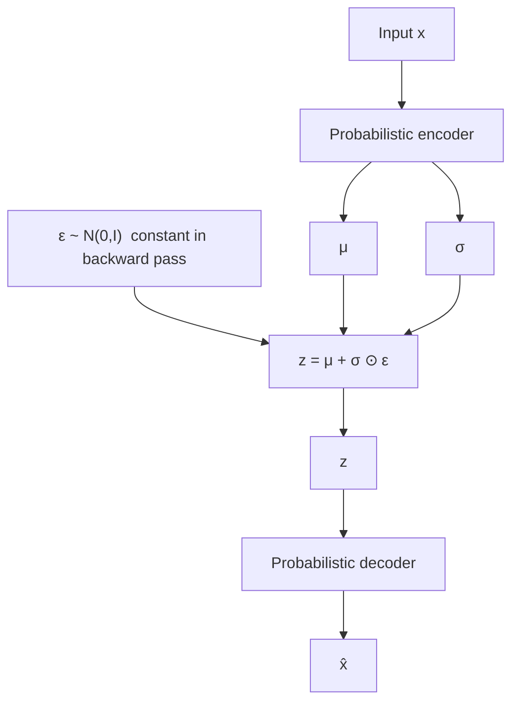

---

## Architecture the course can finally draw

| Before reparameterization | After |
|---------------------------|--------|
| $z\sim\mathcal{N}(\mu,\sigma^2)$ (raw sample) | $z=\mu+\sigma\odot\varepsilon$, $\varepsilon\sim\mathcal{N}(0,I)$ |

**Full diagram:** $x$ → probabilistic encoder → $\mu$, $\sigma$ → combine with $\varepsilon$ → $z$ → decoder → $\hat x$ (or $x'$).

That is the VAE architecture. Next lecture: **one numerical forward pass** so the flow is concrete.

### Key takeaways

- Reconstruction + KL is not enough: **sampling $z$** is non-differentiable, so encoder $\phi$ cannot be updated.
- Decoder $W,b$ and even $\partial L/\partial z$ are ordinary calculus; the hole is $\partial z/\partial\mu$ and $\partial z/\partial\sigma$.
- Reparameterization: $z=\mu+\sigma\varepsilon$ with $\varepsilon$ **independent** and treated as **constant**. Then $\partial z/\partial\mu=1$, $\partial z/\partial\sigma=\varepsilon$.
- Gradients reach encoder parameters; **end-to-end** VAE training works.

---


\newpage

# L24: VAE numerical example

**Video:** [Lec 24](https://www.youtube.com/watch?v=0ui08gNfjcA) · 45:54  
**Instructor in this lecture:** Prof. Ashwini Kodipalli

### Learning objectives

- Run a **full forward pass** of a tiny MLP VAE on one **continuous tabular** row (four features).
- Compute hidden ReLUs, **μ** and **log-variance** (no activation on those heads), **σ²** and **σ**, then **reparameterized** $z$.
- Decode with ReLU then **linear** output; compare $\hat x$ to $x$.
- Plug the lecture’s numbers into **MSE** reconstruction and **closed-form Gaussian KL**, then add them.

Week 3 **ends** here (no lab). Week 4 starts with a **practical VAE**. This video is **forward pass + loss only** — no numerical backprop.

---

## Problem setup

Last session of week 3. Encoder, decoder, and reparameterization were theory; now **one worked example**.

| Choice | Lecture |
|--------|---------|
| Data | **Continuous**, **tabular** (rows × columns) |
| Features / input neurons | **4** |
| Spoken coordinates | **5.1**, **3.5**, **1.4**, and a fourth input into weight **0.2** |
| Consistent fourth value | **0.2** (Iris-style row $(5.1,\ 3.5,\ 1.4,\ 0.2)$ makes the spoken $h_1=1.07$) |
| Encoder hidden | **3** neurons, **ReLU**, bias **0.1** |
| Latent size | **2** (two μ, two log-σ²) |
| Decoder hidden | **3** neurons, **ReLU**, bias **0.1** |
| Decoder output | **4** neurons, **linear** (continuous reconstruction) |
| Weights | **Random** (can be negative, e.g. $-0.7$) |

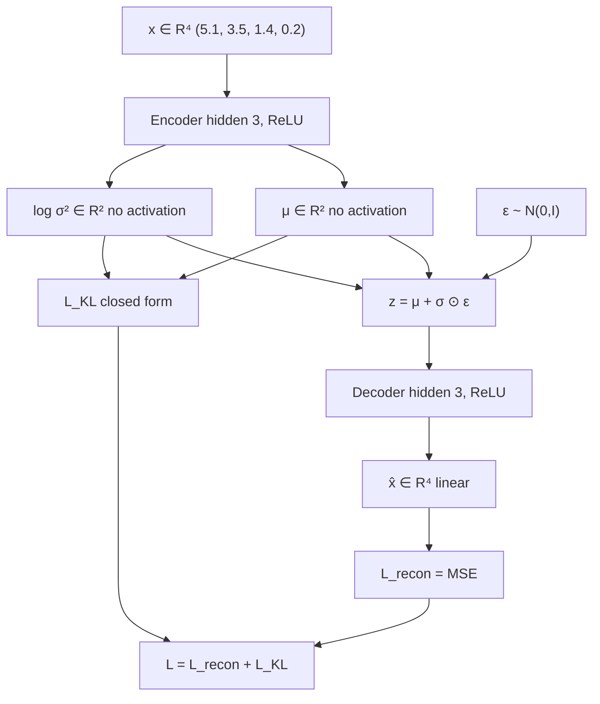

---

## 1. Encoder hidden layer

Every input connects to every hidden unit (four weights per neuron). First hidden neuron (weights spoken):

$$
h_1 = 5.1\cdot 0.1 + 3.5\cdot 0.4 + 1.4\cdot(-0.7) + 0.2\cdot 0.2 + 0.1
$$

$$
= 0.51 + 1.40 - 0.98 + 0.04 + 0.1 = 1.07
$$

Same pattern for the other two hidden units (four random weights each, same bias **0.1**). Spoken pre-activations after the sum:

| Hidden unit | Pre-activation $h$ |
|-------------|-------------------|
| 1 | **1.07** |
| 2 | **1.93** |
| 3 | **0.87** |

**ReLU** on a hidden layer: $\mathrm{ReLU}(h)=\max(0,h)$. All three are positive, so they pass through:

$$
a = (a_1,a_2,a_3) = (1.07,\ 1.93,\ 0.87)
$$

That vector is the **output of the first hidden layer**.

---

## 2. Mean head (latent dimension 2)

Next layer is **not** another ordinary hidden layer: it must emit **approximate-posterior parameters**. Latent size **2** → **two means**.

Each mean is a linear map from $a\in\mathbb{R}^3$ (three weights + bias). **Bias is 0** “for simple calculation.”

**μ₁** (weights **0.5**, **−0.3**, **0.1**):

$$
\mu_1 = 1.07\cdot 0.5 + 1.93\cdot(-0.3) + 0.87\cdot 0.1 + 0
= 0.535 - 0.579 + 0.087 = 0.043
$$

**μ₂** (weights **0.2**, **0.4**, **−0.5**):

$$
\mu_2 = 1.07\cdot 0.2 + 1.93\cdot 0.4 + 0.87\cdot(-0.5) + 0
= 0.214 + 0.772 - 0.435 = 0.551
$$

### Why **no activation** on μ

ReLU would be $\max(0,\mu)$. A **negative mean is valid**. ReLU would **zero** it and **distort** the Gaussian. **No standard activation** on the mean head. (The lecture pauses here and asks you to answer before stating this.)

---

## 3. Log-variance head, then σ² and σ

Same $a$, **another** linear map (random weights; one spoken third-weight **0.2**), bias **0**. Encoder emits **log-variance**, not σ² yet. Spoken values:

$$
\log\sigma_1^2 = 0.732,\qquad \log\sigma_2^2 = 0.302
$$

**No activation** on this head either (keep the raw linear value).

Variance and std:

$$
\sigma_j^2 = e^{\log\sigma_j^2},\qquad \sigma_j = \sqrt{\sigma_j^2}
$$

| $j$ | $\log\sigma_j^2$ | $\sigma_j^2=e^{\cdot}$ | $\sigma_j$ |
|-----|------------------|-------------------------|------------|
| 1 | 0.732 | $e^{0.732}\approx 2.079$ | **1.442** (spoken) |
| 2 | 0.302 | $e^{0.302}\approx 1.353$ | $\approx 1.163$ |

We now have **μ**, **log-variance**, **variance**, and **standard deviation**. $z$ is still not sampled.

---

## 4. Reparameterized $z$ (not a raw Gaussian draw)

Theory said $z\sim\mathcal{N}(\mu,\sigma^2)$. Reparameterization says **do not** pick $z$ that way. Latent size 2:

$$
z_1 = \mu_1 + \sigma_1\,\varepsilon_1,\qquad
z_2 = \mu_2 + \sigma_2\,\varepsilon_2
$$

$\varepsilon_j\sim\mathcal{N}(0,1)$, **independent** of $\mu,\sigma$. Need **two** draws. First pair on the board:

$$
\varepsilon = (0.5,\ -0.2)
$$

**First latent coordinate** (spoken arithmetic):

$$
z_1 = 0.043 + 1.442\cdot 0.5 = 0.043 + 0.721 = 0.764
$$

**Second** (matches the decoder input they use next):

$$
z_2 = 0.551 + 1.163\cdot(-0.2) \approx 0.318
$$

$$
z^{(1)} = (0.764,\ 0.318)
$$

(If a slide digit is off, recompute from this formula; the lecture invites you to correct typos while calculating along.)

### Same $x$, many $z$

μ and σ **do not change** for this input (they came from $x$). Only $\varepsilon$ is redrawn. Next samples from $\mathcal{N}(0,1)$ give **other** $z^{(2)}, z^{(3)},\ldots$ — **infinitely many** latents for **one** $x$, all from the **same** $q_\phi(z\mid x)$. That is the theory claim, now numeric.

---

## 5. Decoder hidden layer

Take $z^{(1)}=(0.764,\ 0.318)$. Hidden layer: **3** neurons, two incoming weights each, bias **0.1**, **ReLU**.

**Neuron 1** (weights **0.6**, **0.3**):

$$
h_1 = 0.764\cdot 0.6 + 0.318\cdot 0.3 + 0.1
= 0.4584 + 0.0954 + 0.1 = 0.6538
$$

$$
a_1 = \max(0,\ 0.6538) = 0.6538
$$

**Neuron 2** (weights **−0.4**, **0.1**):

$$
h_2 = 0.764\cdot(-0.4) + 0.318\cdot 0.1 + 0.1
= -0.3056 + 0.0318 + 0.1 = -0.1738
$$

$$
a_2 = \max(0,\ -0.1738) = 0
$$

**Neuron 3** (weights **0.2**, **−0.5**):

$$
h_3 = 0.764\cdot 0.2 + 0.318\cdot(-0.5) + 0.1
= 0.1528 - 0.159 + 0.1 = 0.0938
$$

$$
a_3 = \max(0,\ 0.0938) = 0.0938
$$

Decoder hidden output:

$$
a^{\text{dec}} = (0.6538,\ 0,\ 0.0938)
$$

---

## 6. Decoder output (reconstruction)

Four reconstructed coordinates. Because $x$ is **continuous**, output activation is **linear**: $f(u)=u$ (identity). If data were **binary** or scaled to $[0,1]$, the lecture would use **sigmoid** instead.

**$\hat x_1$** (weights **0.2**, **0.1**, **−0.3**):

$$
\hat x_1 = 0.6538\cdot 0.2 + 0\cdot 0.1 + 0.0938\cdot(-0.3)
= 0.13076 - 0.02814 = 0.10262
$$

$\hat x_2,\hat x_3,\hat x_4$ are the same pattern with other random weight triples (shown on the next slides, not all spoken). After **rounding to three decimals** (five digits after the point → keep three), the lecture displays a four-vector $\hat x$.

**Theory vs this numerical practice**

- Theory: decoder outputs **likelihood parameters**; $\hat x$ is **sampled** from that Gaussian.  
- Practice here: the linear layer’s output **is** the **mean**, and **that mean is $\hat x$**.

Compare to original $x=(5.1,\ 3.5,\ 1.4,\ 0.2)$: reconstruction is **poor**. Weights/biases were **random**. After training, backprop **updates all of them**, μ and log-σ² improve, $z$ improves, $\hat x$ moves toward $x$.

---

## 7. Reconstruction loss (MSE)

Continuous data → **mean squared error** between $x$ and $\hat x$ (and $\hat x$ **is** that decoder mean):

$$
L_{\text{recon}} = \frac{1}{4}\sum_{i=1}^{4}(x_i - \hat x_i)^2
$$

Substitute the (rounded) reconstructed coordinates from the slide:

$$
L_{\text{recon}} = 9.7111
$$

---

## 8. KL term (closed form, two Gaussians)

KL forces **encoder** $q_\phi(z\mid x)$ toward **prior** $p(z)$. **Closed form** = an expression you can **substitute numbers into**. Using μ, log-variance, and variance already computed:

$$
D_{\mathrm{KL}}
= \frac12\sum_{j=1}^{2}\Big(\mu_j^2 + \sigma_j^2 - 1 - \log\sigma_j^2\Big)
$$

Squares of the means (lecture: compute $\mu^2$ first):

$$
\mu_1^2 = 0.043^2 = 0.001849,\qquad
\mu_2^2 = 0.551^2 = 0.303601
$$

Per-coordinate pieces:

$$
\begin{aligned}
\mu_1^2 + \sigma_1^2 - 1 - \log\sigma_1^2
&\approx 0.001849 + 2.079 - 1 - 0.732 = 0.3488,\\[4pt]
\mu_2^2 + \sigma_2^2 - 1 - \log\sigma_2^2
&\approx 0.3036 + 1.353 - 1 - 0.302 = 0.3546.
\end{aligned}
$$

Sum, then **divide by 2**:

$$
D_{\mathrm{KL}} \approx 0.3517 \;\rightarrow\; \mathbf{0.352}
$$

(the lecture rounds **0.3517** to **0.352**).

---

## 9. Total VAE loss

$$
L = L_{\text{recon}} + D_{\mathrm{KL}} = 9.7111 + 0.352 = \mathbf{10.0631}
$$

**10.0631 is high.** Next step in a real training loop: an **optimizer** backprops and updates **every** weight and bias. Better μ, log-σ² → better $z$ → better $\hat x$ → lower loss.

This example is only the **forward** path: input → encoder → latent → decoder → loss.

---

## Forward-pass checklist (what the lecture wants you to be able to repeat)

| Step | What you compute | Activations |
|------|------------------|-------------|
| 1 | Hidden $h$, then $a=\mathrm{ReLU}(h)$ | **ReLU** |
| 2 | $\mu_1,\mu_2$ from $a$ | **None** (mean may be negative) |
| 3 | $\log\sigma^2$, then $\sigma^2=e^{\cdot}$, $\sigma=\sqrt{\cdot}$ | **None** on log-variance |
| 4 | Draw $\varepsilon\sim\mathcal{N}(0,1)$; $z=\mu+\sigma\odot\varepsilon$ | — |
| 5 | Decoder hidden ReLU | **ReLU** |
| 6 | $\hat x$ | **Linear** if continuous; **sigmoid** if binary / $[0,1]$ |
| 7 | $L_{\text{recon}}=\mathrm{MSE}(x,\hat x)$ here | — |
| 8 | Closed-form KL from μ, σ², log σ² | — |
| 9 | $L=L_{\text{recon}}+\mathrm{KL}$ | then optimizer |

### Key takeaways

- Tiny MLP VAE on $x=(5.1,\ 3.5,\ 1.4,\ 0.2)$: hidden ReLU **(1.07, 1.93, 0.87)** → **μ=(0.043, 0.551)**, **log σ²=(0.732, 0.302)**, **σ₁=1.442**.
- First $\varepsilon=(0.5,-0.2)$ → $z=(0.764,\ 0.318)$; other $\varepsilon$ give other $z$ from the **same** Gaussian.
- Decoder ReLU **(0.6538, 0, 0.0938)** → linear $\hat x_1=0.10262$; reconstruction is bad because weights are random.
- $L_{\text{recon}}=9.7111$, $\mathrm{KL}=0.352$, **$L=10.0631$**. Training would now update parameters. Week 4 lab implements a real VAE.

---


\newpage

# L25: Practical exercise 1 — variational autoencoder

**Video:** [Lec 25](https://www.youtube.com/watch?v=5Iiqeoxw_Sk) · 33:25

### Learning objectives

- Contrast a **vanilla autoencoder** (fixed latent vector) with a **VAE** ($z=\mu+\sigma\varepsilon$).
- Build the lecture’s Keras VAE on **MNIST**: **784 → 256 → 16** latents → **256 → 784**, with a **sampling layer**.
- Code **BCE reconstruction + closed-form KL**, train with **Adam**, **10** epochs, batch **128**.
- Plot original vs reconstructed digits and state the lecture’s diagnosis: missing **labels** → blurry / wrong digits, which a **conditional VAE** will fix.

This is **week 4, session 1** — the VAE lab promised at the end of week 3. It is not a CVAE yet.

---

## Vanilla AE vs VAE (opening slide)

| | Autoencoder | VAE in this lab |
|--|-------------|-----------------|
| Encoder | $x$ → **one fixed** latent vector | $x$ → **μ and variance** of the pixel distribution |
| Latent | Cannot be resampled | $z = \mu + \sigma\,\varepsilon$ with noise **ε** |
| Decoder | $z$ → reconstruction | Same, but $z$ is **stochastic** |

MNIST pixels → empirical mean/variance → $z$ depends on **μ, σ, and ε**. Decoder rebuilds the image from that $z$.

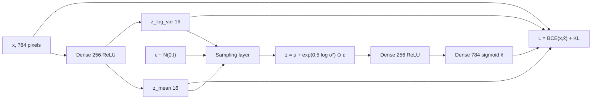

---

## 1. Libraries

| Import | Use |
|--------|-----|
| `tensorflow` as `tf` | Deep-learning framework |
| `keras.layers`, `keras.models` | Input / hidden / output layers; `Model` |
| `matplotlib.pyplot` as `plt` | Original vs reconstruction plots |

---

## 2. Dataset — same MNIST as the autoencoder labs

Handwritten digits **0–9**, **10** classes. Continuation of the AE / regularization notebooks.

### Load and drop labels

```text
(x_train, _), (x_test, _) = mnist.load_data()
```

**No `y_train` / `y_test`.** A VAE does not use class labels. `_` discards them.

### Float + normalize to $[0,1]$

Cast to float, divide by **255** (grayscale min **0**, max **255**).

Lecture’s **3×3** toy: each entry $v$ becomes $v/255$. **0 → 0**, **255 → 1**. Normalization puts pixels in a range the net can learn.

### Flatten 28×28×1 → 784

MNIST is **28×28**, channel **1**. Reshape to `(-1, 784)`. `-1` ignores the label axis so only **features** remain.

### Shapes after preprocessing (printed)

| Split | Samples | Features |
|-------|--------:|---------:|
| Train | **60,000** | 784 |
| Test | **10,000** | 784 |

---

## 3. Sampling layer (the VAE difference)

After the encoder, **before** the decoder, define sampling:

$$
z = \mu + \sigma \odot \varepsilon,\qquad
\varepsilon \sim \mathcal{N}(0, I)
$$

ε is **Gaussian / normal** noise, mean **0**, std **1**. **Shape of ε = shape of μ** (here length **16**).

### Latent dimension

`latent_dim = 16` (any size is allowed; **16** for simplicity). 784 pixels compress to **16** latent variables, each with its own $\mu_j$ and $\sigma_j^2$.

### σ from log-variance (as coded)

The network stores **log-variance**. Std is the square root of variance. With natural log:

$$
\log\sigma = \tfrac12\log(\sigma^2)
\quad\Rightarrow\quad
\sigma = \exp\!\big(0.5\cdot\log\sigma^2\big)
$$

In TensorFlow: `tf.exp(0.5 * z_log_var)`. Then

$$
z = \mu + \exp(0.5\cdot\log\sigma^2)\odot\varepsilon
$$

That is the **reparameterization trick** in the lab.

---

## 4. Encoder

| Layer | Units / shape | Activation |
|-------|----------------|------------|
| Input | **784** ($28\times 28$) | — |
| Dense | **256** | **ReLU** |
| Dense `z_mean` | **16** | linear (no ReLU on μ) |
| Dense `z_log_var` | **16** | linear |

ReLU: $\max(0,u)$ — pass positives, zero negatives (lecture example: $\max(0,5)=5$, $\max(0,-2)=0$). Adds **nonlinearity**.

`z_mean` and `z_log_var` are dense maps of size `latent_dim` on the **256**-unit representation of $x$. Encoder `Model` takes the image and produces **μ, log-variance, and sampled $z$**.

---

## 5. Decoder

Mirror the 256-unit block; decode from **latent inputs** of shape **16**.

| Layer | Units | Activation | Why |
|-------|------:|------------|-----|
| Dense | **256** | **ReLU** | Same width as encoder hidden; acts on $z$ |
| Dense | **784** | **Sigmoid** | Match **normalized** pixels in $(0,1)$ |

**Sigmoid** (standard formula the lab wants):

$$
\sigma(u) = \frac{1}{1+e^{-u}} \in (0,1)
$$

Whatever the pre-activation, the reconstruction stays in the same range as $x/255$. (The spoken limits “$-\infty\to 1$, $+\infty\to 0$” are reversed; the **point** is: outputs live in **0–1**.)

Decoder `Model`: latent $z$ → reconstruction.

---

## 6. VAE `Model` class: two losses

Subclass Keras `Model`. Encoder, decoder, and sampling are wired inside. Training uses **only** $x$ (the input).

### Tuples and `data[0]`

A batch may arrive as `(x, y)`. The VAE wants **index 0 only** — the pixels. If `data` is a tuple, take `data[0]` for both train and test. Labels in slot 1 are ignored.

### Total loss

$$
L = L_{\text{recon}} + L_{\text{KL}}
$$

Vanilla AE had reconstruction only. VAE adds **KL**.

### Reconstruction = binary cross-entropy

Spoken skeleton (standard BCE; $y=x$ pixels, $\hat y=\hat x$):

$$
\mathrm{BCE}(x,\hat x) = -\Big[x\log\hat x + (1-x)\log(1-\hat x)\Big]
$$

In code: BCE between **original image** `data` and **decoder output** `reconstruction`, then **reduce / mean**.

Lecture’s averaging picture: if you had 16 per-latent BCE pieces $0.02, 0.04, \ldots, 0.16$, **add them and divide by 16** → mean reconstruction loss. In the notebook this is a **reduced mean** over pixels / batch.

### KL (closed form, as written in the lab)

Depends on **μ** and **variance / log-variance**:

$$
L_{\mathrm{KL}} = -\frac12\sum_j \Big(1 + \log\sigma_j^2 - \mu_j^2 - \sigma_j^2\Big)
$$

Same identity as L22/L24:

$$
L_{\mathrm{KL}} = \frac12\sum_j \Big(\mu_j^2 + \sigma_j^2 - 1 - \log\sigma_j^2\Big)
$$

**Total** = mean BCE + this KL. Return that scalar from `train_step`.

---

## 7. Gradients and optimizer

Forward: weights, biases, $z$. Backward: gradients so loss falls.

Generic SGD picture:

$$
w_{\text{new}} = w_{\text{old}} - \eta\,\frac{\partial L}{\partial w}
$$

$\eta$ = learning rate; $\partial L/\partial w$ = how much to move the weight.

**Adam** is used because it tracks **mean and variance** of gradients (matches a model that already thinks in μ, σ). You *may* use SGD, momentum, Adagrad, RMSprop; this notebook **sticks to Adam**.

`GradientTape` computes grads of **total** loss w.r.t. VAE weights and applies the optimizer.

---

## 8. Fit

| Setting | Value | Lecture reason |
|---------|-------|----------------|
| Data | `x_train` only | Unsupervised |
| Epochs | **10** | |
| Batch size | **128** | Update weights every **128** images, **not** after all ~50k–60k — otherwise loss stays huge |

### Losses at epoch 10 (spoken)

| Quantity | Value |
|----------|-------|
| KL | $3.4\times 10^{-5}$ (also $3.42\times 10^{-5}$) |
| Reconstruction | **0.2643** |
| Total | **0.2644** |

Check: $0.2643 + 3.42\times 10^{-5} \approx 0.2644$. The lecture calls this **much smaller** than the earlier **shallow / deep autoencoder** losses in this series.

Each epoch logs **KL, total, reconstruction**.

---

## 9. Reconstruct 10 test images

- Take **10** `x_test` samples.  
- Encoder → `z_mean`, `z_log_var` → sampled $z$.  
- Decoder **predicts** on $z$.  

**Reconstructed shape: `(10, 784)`.** Ten examples, **784** pixels — **not** latent size 16. Even after a 16-D bottleneck, the image comes back at **input** width.

---

## 10. Plot original vs reconstruction

| `plt.figure` | Width **20**, height **4** |
| Subplots | **2 rows × 10 columns** |
| Loop | `i` in `range(10)` → positions `i+1` |
| Top row | `x_test[i]` reshaped **28×28**, colormap **gray**, axes **off** |
| Bottom row | reconstructed `[i]` reshaped **28×28**, gray, axes **off** |

Do not plot the 784-vector as a long array; **reshape** to a digit.

---

## What to observe (lecture’s drawback)

Top row: true digits. Bottom row: reconstructions.

Spoken failure mode:

- True **7** reconstructs like a **3** or **9**.  
- True **2** also looks like a **3** / **9**.

**Why:** $z$ was built from **$x$ only** (μ, σ, ε of the pixels). The lab **never conditions on $y$**. Probability of $z$ “should also have depended on $Y$.” Without labels, reconstructions **confuse classes**.

**Fix announced:** **conditional VAE** in the **next** section, which is said to overcome this VAE drawback.

### Key takeaways

- VAE lab: MNIST **60k / 10k**, $/255$, flatten **784**, **no labels**.
- Encoder **256 ReLU** + **16-D** μ and log-σ²; $z=\mu+\exp(0.5\log\sigma^2)\odot\varepsilon$; decoder **256 ReLU → 784 sigmoid**.
- $L=\mathrm{BCE}+\mathrm{KL}$ with the Gaussian closed-form KL; **Adam**, **10** epochs, batch **128**.
- Final losses ≈ KL **$3.4\times 10^{-5}$**, recon **0.2643**, total **0.2644**; reconstructions are **784-D** again.
- Plots show **class mix-ups** because $y$ is unused — motivation for **CVAE**.

---


\newpage

# L26: Entanglement, disentanglement, and β-VAE

**Video:** [Lec 26](https://www.youtube.com/watch?v=nh55anAdRfw) · 50:25  
**Instructor in this lecture:** Prof. Ashwini Kodipalli

### Learning objectives

- Explain why a fully connected encoder produces an **entangled** $z$: each coordinate mixes many factors of variation.
- Contrast that with a **disentangled** latent space, where each $z_i$ mainly controls one factor (hair, lighting, smile, …).
- Write the **β-VAE** loss and say what $\beta=1$ vs $\beta>1$ does to the KL term.
- Use the lecture’s two-dimensional KL examples to connect “small $\mu$” ↔ closer to the prior ↔ one-factor codes.
- List the three practical fixes when there are **more factors than latent dimensions**: larger $z$, moderate $\beta$, **β-annealing**.

### Week 4 agenda (as stated in lecture)

Week 3 already covered how a VAE works, a numerical example, and the **reparameterization trick**. Week 4 is advanced VAEs plus labs. The announced order is:

1. Hands-on VAE (previous practical)
2. Entangled vs disentangled latent space, then **β-VAE** (this lecture)
3. **Conditional VAE**: motivation, loss, numerical example
4. **Latent-space interpolation**
5. Hands-on **β-VAE** and **conditional VAE**

---

## How $z$ is built (and why it mixes factors)

Nothing here is a new architecture. Input $x$ goes through a hidden layer (the slide uses **8 neurons**). Every hidden unit is a combination of **all** $x_1,\ldots,x_n$. From those hidden units the encoder produces **mean** and **log-variance**; convert log-variance → variance → standard deviation; then sample

$$
z = \mu + \sigma \odot \varepsilon, \qquad \varepsilon \sim \mathcal{N}(0, I)
$$

(the reparameterization trick from week 3). Because $\mu$ and $\sigma$ already mix every input coordinate, each sampled coordinate $z_i$ is a **compressed mixture** of the input’s important variations.

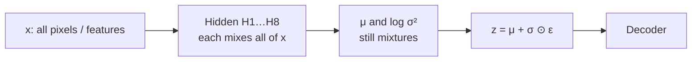

**Role of $z$:** a lower-dimensional code that stores the **important variations** of $x$, not a pixel-for-pixel copy.

---

## What “important variations” are

### MNIST digits ($28\times 28 \to 784$)

Not all 784 pixels carry structure. The lecture’s four running factors:

| Factor | What it means on a digit |
|--------|--------------------------|
| **Thickness** | Thin vs thick stroke |
| **Slant** | Tilted vs upright |
| **Rotation** | How the glyph is rotated |
| **Position** | Where the digit sits in the frame |

If the latent size is **4**, you get $z_1,z_2,z_3,z_4$. Those four codes are *meant* to capture those variations — but in a standard VAE they do **not** line up one-to-one.

### Face images

The same idea on faces: **hair**, **lighting**, **skin**, **smile**, **pose**.

---

## Entangled latent space

Because $H_1$–$H_8$ mix all 784 pixels, $\mu$ and $\sigma$ mix them again, and $z$ is sampled from those, **each $z_i$ is a combination of thickness, slant, rotation, and position** (or hair, light, skin, smile, pose).

**Definition used in the lecture:** an **entangled** latent space is one where **changing one latent variable changes multiple properties together**.

If $z_1$ contains a bit of thickness *and* slant *and* rotation *and* position, a small edit to $z_1$ moves all of those at once. You cannot “only thicken the stroke” or “only change the hair.”

---

## Disentangled latent space

The wish: if there are five meaningful factors and latent size **5**, enforce

| Coordinate | Should mainly control |
|------------|------------------------|
| $z_1$ | Hair |
| $z_2$ | Lighting |
| $z_3$ | Skin tone |
| $z_4$ | Smile |
| $z_5$ | Pose |

**Definition:** a **disentangled** latent space learns a **structured** representation in which **each latent dimension focuses on one factor of variation**. Changing one $z_i$ should change mainly **one** property of the generated image; the rest stay (mostly) unchanged.

The lecture’s face grids make the point visually: same person, only hair changes; same person, only smile changes; same person, only pose changes. That is **interpretable, controlled** generation — more variants from editing a single coordinate.

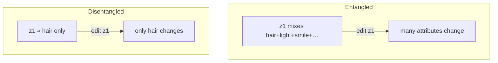

Standard VAE **does not guarantee** this. β-VAE is the lecture’s tool for *encouraging* it.

---

## Standard VAE loss vs β-VAE

The week-3 VAE loss has two terms:

$$
\mathcal{L}_{\text{VAE}} = \underbrace{\mathbb{E}_{q(z\mid x)}\!\big[\text{reconstruction of }x\text{ from }z\big]}_{\text{store enough in }z} + \underbrace{D_{\mathrm{KL}}\!\big(q(z\mid x)\,\|\,p(z)\big)}_{\text{do not store }z\text{ arbitrarily}}
$$

- **Reconstruction:** decoder $z \mapsto \hat{x}$ should match $x$. That forces $z$ to keep **enough** information.
- **KL:** encoder distribution $q(z\mid x)$ should stay close to the **prior** $p(z)$ (standard Gaussian). That forbids stuffing $z$ in an arbitrary way.

Those two already pull in opposite directions. β-VAE does **not** invent a new architecture. It only **reweights the KL**:

$$
\mathcal{L}_{\beta\text{-VAE}} = \text{reconstruction} + \beta\, D_{\mathrm{KL}}\!\big(q(z\mid x)\,\|\,p(z)\big)
$$

| $\beta$ | What the lecture says happens |
|--------:|-------------------------------|
| $=1$ | Same as standard VAE. Mixtures in $z$ are allowed **as long as reconstruction is good**. **No guarantee of disentanglement.** |
| $>1$ | Extra pressure on the KL: $q$ must hug the prior more tightly ($\mu$ near $0$, variances near $1$). That **restricts mixed information** in every latent coordinate and **encourages** disentanglement. |
| Too large | Reconstruction **quality drops** (reconstruction loss rises). Perfect disentanglement is **still not guaranteed**. |

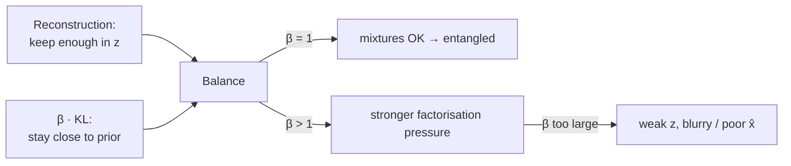

**Punchline:** β-VAE = VAE loss + a **regularization weight** $\beta$ on the KL, with $\beta>1$ when you want disentanglement. Stronger regularization **encourages** a structured $z$; it does **not** certify a perfect one-factor-per-dimension code.

---

## Numerical intuition (latent size $=2$, $\sigma^2=1$)

Take $z=(z_1,z_2)$ with

$$
z_1 = \mu_1 + \sigma_1\,\varepsilon_1, \qquad z_2 = \mu_2 + \sigma_2\,\varepsilon_2, \qquad \varepsilon_i\sim\mathcal{N}(0,1).
$$

For the closed-form KL against $\mathcal{N}(0,1)$, the lecture sets **variance $=1$ for simplicity**. The $\sigma^2-\log\sigma^2-1$ pieces cancel ($\log 1=0$), so KL is driven by the **means**.

$$
D_{\mathrm{KL}} \propto \tfrac12\big(\mu_1^2 + \mu_2^2\big)
\quad\text{(after the variance terms cancel)}
$$

### Case A — disentangled (small means)

Suppose $z_1$ is **thickness only** and $z_2$ is **slant only**. Then $\mu_1$ mainly encodes thickness and $\mu_2$ mainly encodes slant: each mean carries **one** piece of information, so the lecture treats the means as **small**. Example: $\mu=(0.4,\,0.2)$.

$$
\tfrac12\big(0.4^2 + 0.2^2\big) = \tfrac12(0.16+0.04)=0.10
$$

Small KL ⇒ encoder is **close to the prior** ⇒ means near $0$ ⇒ each coordinate is not hoarding a mix of factors.

### Case B — entangled (larger means)

Now each $z_i$ (and therefore each $\mu_i$) mixes **both** factors. Means get **larger**. Example: $\mu=(0.8,\,0.6)$.

$$
\tfrac12\big(0.8^2 + 0.6^2\big) = \tfrac12(0.64+0.36)=0.50
$$

KL $=0.50$ is the lecture’s “50%” figure: encoder mean is **far from** the prior, so $z$ is using **more latent capacity** to store mixed information.

### Case C — even more mixing

Example: $\mu=(1.5,\,0.5)$. $1.5^2=2.25$; KL is **large**. Far-from-zero means ⇒ **more** information packed into $z$ ⇒ entangled codes.

| Setting | Example $\mu$ | KL (with $\sigma^2=1$) | Lecture reading |
|---------|---------------|------------------------|-----------------|
| Disentangled | $(0.4,\,0.2)$ | $0.10$ | close to prior; one factor each |
| Entangled | $(0.8,\,0.6)$ | $0.50$ | far from prior; mixed factors |
| More mixed | $(1.5,\,0.5)$ | large ($\tfrac12(2.25+0.25)=1.25$) | even more capacity used |

The reverse-engineering the lecture wants: **small KL ↔ small $\mu$ ↔ $z_i$ focused on one factor.** $\beta>1$ is extra pressure to keep that KL small.

---

## When there are more factors than latent dimensions

Earlier slides had **four factors and four** $z$-coordinates (a hopeful one-to-one map). Now: **six** important variations, latent size only **three**. Two bad extremes, then three practical knobs.

### Extreme 1 — allow entanglement

Each of $z_1,z_2,z_3$ mixes all six factors so the decoder still sees everything.

- Reconstruction **good** (loss **down**), because $z$ stored a lot.
- Means **grow** ⇒ encoder far from the prior ⇒ **KL up**.
- $\beta$ is kept **small** (no extra disentanglement pressure).

### Extreme 2 — force disentanglement anyway ($\beta>1$)

Three coordinates can lock onto only the **most important** factors; the rest are dropped. $z$ is **weak** ⇒ decoder reconstructs poorly ⇒ **reconstruction loss up**. High $\beta$ keeps means near $0$ ⇒ **KL down**.

Neither extreme is a solution by itself.

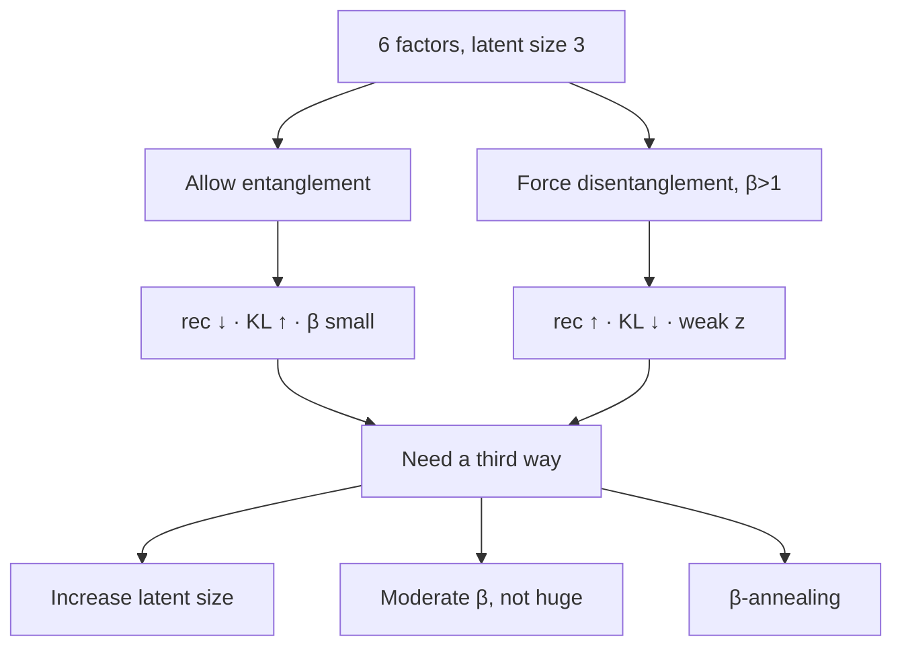

### Three knobs the lecture actually gives

1. **Increase the latent size** (hyperparameter / trial-and-error). More dimensions ⇒ more factors can be stored **separately** ⇒ reconstruction improves while KL can stay small.
2. **Tune $\beta$ to a moderate value**, not a huge one. Too-large $\beta$ over-enforces the prior, yields a weak $z$, and reconstruction collapses. Sweep $\beta$ until reconstruction and disentanglement **balance**.
3. **β-annealing.** Start with $\beta=0$ or a **very small** $\beta$ so the KL term is off and the model first learns a **good reconstruction**. Then **raise $\beta$ gradually** so the KL turns on and starts encouraging structure in $z$.

---

### Key takeaways

- Fully connected $\mu,\sigma$ make each $z_i$ a **mixture** of factors: that is **entanglement**. Editing one coordinate moves several attributes.
- **Disentanglement** means one coordinate $\approx$ one factor (hair vs smile vs pose on the face grids; thickness vs slant on digits).
- β-VAE is the VAE loss with weight $\beta$ on the KL. $\beta=1$ is ordinary VAE; $\beta>1$ **encourages** (does not certify) disentanglement; $\beta$ too large **hurts reconstruction**.
- Small $\mu$ ⇒ small KL ⇒ codes closer to the prior and less mixed; large $\mu$ ⇒ large KL ⇒ mixed, high-capacity $z$.
- If factors outnumber latent dimensions, raise **latent size**, use a **moderate $\beta$**, or **anneal $\beta$** from $\approx 0$ upward.

---


\newpage

# L27: Conditional VAE

**Video:** [Lec 27](https://www.youtube.com/watch?v=RO7aOFN2vkI) · 23:44  
**Instructor in this lecture:** Prof. Ashwini Kodipalli

### Learning objectives

- Recap the **unconditional** VAE path $x \to z \to \hat{x}$ and why generation is not class-controlled.
- State the CVAE change: extra condition $y$ into **both** encoder and decoder.
- Explain why $z$ in a CVAE can drop class identity and keep **within-class style**.
- Write the CVAE loss as the VAE loss with $y$ inserted, and follow the lecture’s numerical comparison (4 features $\to$ 6 inputs with one-hot $y$).

### What this lecture is *not*

This is the **theory** CVAE session. The Colab is a later practical. Conditional **GANs** are not in this video (the instructor’s slip “conditional GAN” is corrected in-speech to CVAE).

---

## Recap: standard VAE

The model is trained on **$x$ only**. Encoder maps $x$ to a **probabilistic** latent: approximate posterior parameters $\mu(x)$ and $\log\sigma^2(x)$. Sample $z$ with the reparameterization trick

$$
z = \mu(x) + \sigma(x)\odot\varepsilon, \qquad \varepsilon\sim\mathcal{N}(0,I)
$$

Decoder maps $z$ back to data space and produces $\hat{x}$. The lecture writes the decoder as $p(x\mid z)$: probability of the reconstruction given the code.

```mermaid
flowchart LR
    X["x only"] --> ENC["Encoder → μ(x), σ(x)"]
    ENC --> Z["z = μ + σ ⊙ ε"]
    Z --> DEC["Decoder p(x | z)"]
    DEC --> XH["x̂"]
```

**Limitation (the whole motivation for this lecture):** generation is **not explicitly controlled**. You cannot ask the decoder for “only digit 5”, “only cats”, “only dogs”, or **extra malignant** medical images, because nothing in the forward pass is a class knob.

---

## Why CVAE: extra guidance $y$

CVAE is an **extension of VAE**, not a new family. Working mechanism stays the same; you add a **condition** $y$ — a **class label** or an **attribute** — to **both** networks:

| Network | Standard VAE input | CVAE input |
|---------|--------------------|------------|
| Encoder | $x$ | $x$ **and** $y$ |
| Reparameterization | $\mu(x),\sigma(x)$ | $\mu(x,y),\sigma(x,y)$ |
| Decoder | $z$ | $z$ **and** $y$ |

$$
z = \mu(x,y) + \sigma(x,y)\odot\varepsilon
$$

$\mu$ and $\sigma$ now **depend on the label**, so the sampled $z$ is already class-aware. At decode time the same $y$ is concatenated again.

```mermaid
flowchart LR
    X["x"] --> ENC["Encoder"]
    Y["y: class / attribute"] --> ENC
    ENC --> Z["z ~ q(z | x, y)"]
    Z --> DEC["Decoder"]
    Y --> DEC
    DEC --> XH["x̂ ~ p(x | z, y)"]
```

**Controlled generation:** at test time you pick $y$ (digit 5, cat, malignant, …) and sample $z$; the decoder is **forced** to emit that class. That is the extra **flexibility** vs a vanilla VAE.

---

## Why $z$ is more efficient in a CVAE

### What $z$ must store in a standard VAE

Pass a handwritten **3**. Then $z$ has to encode **both**:

1. **Style / appearance:** how the 3 is written — thin vs thick, slant vs straight, sharp vs curved.
2. **Class identity:** “this is a 3.”

The decoder sees **only** $z$, so class and style are jammed into the same vector.

### What $z$ must store in a CVAE

$y$ is given to the decoder explicitly. Class identity is **someone else’s job**. $z$ can spend capacity on **variations within that class**:

- thin vs thick
- tilted vs straight
- tall vs short
- curved vs sharp

**Less burden on $z$** → a more efficient code for **style**, plus **controlled** outputs because $y$ is an input, not something $z$ has to memorize.

---

## CVAE loss: same two terms, $y$ in both

The lecture puts the **standard VAE loss** on the board (reconstruction + KL from week 3) and says the CVAE change is **only** that $y$ is passed into the encoder **and** the decoder (and therefore into the reparameterization).

$$
\mathcal{L}_{\text{CVAE}}
= \underbrace{\mathbb{E}_{q(z\mid x,y)}\big[\log p(x\mid z,y)\big]}_{\text{reconstruct }x\text{ given }z\text{ and }y}
- \underbrace{D_{\mathrm{KL}}\big(q(z\mid x,y)\,\|\,p(z\mid y)\big)}_{\text{regularize the encoder, now conditioned on }y}
$$

No new loss family: same reconstruction-vs-KL trade-off, now **conditional** on $y$. The board still shows the **standard VAE loss**; the CVAE edit is “write $y$ next to $x$ at the encoder, next to $z$ at the decoder, and inside $\mu,\sigma$.” That extra input is what yields **class-conditional** generation.

---

## Numerical example (same week-3 VAE problem, plus a label)

The instructor points back to the **week 3 last numerical session**. Recall that problem, then add $y$.

### Standard VAE side (already solved)

Input $x$ had **four features**. After the first hidden layer + ReLU the activations were

$$
(1.07,\; 1.93,\; 0.87)
$$

### CVAE side: concatenate one-hot $y$

Suppose the row belongs to a **binary** class. Then $y\in\{0,1\}$, or as **one-hot**: $(1,0)$ or $(0,1)$.

Running example: treat **Iris** as two classes for the arithmetic (the real Iris set has three; the lecture says so). One-hot $(1,0)$ means “this sample is **Iris setosa**, not versicolor.”

| Object | Dimension |
|--------|-----------|
| $x$ | 4 |
| one-hot $y$ | 2 |
| encoder input $[x;y]$ | **6** |

You need **two extra incoming weights** on every first-layer neuron. After the extra weighted contributions from $y$, the CVAE hidden vector is **larger in magnitude** than $(1.07,\,1.93,\,0.87)$: the label injects **additional weighted information** into the encoded representation.

Then: encode $\mu,\sigma$ from that hidden state, sample $z$ (same reparameterization).

### Decoder input is no longer $z$ alone

Standard VAE decoder input: $z$ only.  
CVAE decoder input: **$[z;\, y]$** with the same one-hot $(1,0)$.

The decoder is told: reconstruct $x$ from this $z$, **conditioned on class $y$**. The reconstructed $\hat{x}$ therefore **differs** from the week-3 VAE reconstruction. Over training you compute the (now conditional) loss, backprop, and update weights/biases until $\hat{x}$ matches $x$.

**Causal chain the lecture wants you to see:**

$$
y \;\to\; \text{hidden }h \;\to\; z \;\to\; \hat{x}
$$

Label $y$ changes the encoder hidden state, which changes $z$, which changes the reconstruction. That is the numerical proof that **conditioning is not a no-op**.

```mermaid
flowchart TB
    subgraph vae [Standard VAE]
      X4["x ∈ R⁴"] --> Hvae["h = (1.07, 1.93, 0.87)"]
      Hvae --> Zvae["z"]
      Zvae --> XhVae["x̂_VAE"]
    end
    subgraph cvae [CVAE]
      X6["[x ; y] ∈ R⁶"] --> Hcvae["h carries extra label mass"]
      Hcvae --> Zcvae["z"]
      ZY["[z ; y]"] --> XhCvae["x̂_CVAE ≠ x̂_VAE"]
      Zcvae --> ZY
    end
```

---

### Key takeaways

- Vanilla VAE: $x\to z\to\hat{x}$. You cannot request a **specific class**.
- CVAE: pass **$y$ into encoder and decoder**. Reparameterization becomes $z=\mu(x,y)+\sigma(x,y)\odot\varepsilon$.
- $z$ no longer has to store class identity, so it can store **within-class style**; generation is **controlled** by $y$.
- Loss is the VAE pair (reconstruction + KL) with $y$ in both $q$ and $p$.
- In the reused week-3 example, four features plus a 2-d one-hot become **six** inputs, extra weights, a **richer** hidden code, and a **different** $\hat{x}$.

---


\newpage

# L28: Latent-space interpolation

**Video:** [Lec 28](https://www.youtube.com/watch?v=z8nEJfojlWo) · 26:59  
**Instructor in this lecture:** Prof. Ashwini Kodipalli

### Learning objectives

- State why interpolation is done in **$z$**, not in pixel space.
- Write the linear blend $z(\alpha)=(1-\alpha)z_A+\alpha z_B$ and evaluate the lecture’s $\alpha\in\{0,0.25,0.5,0.75,1\}$.
- Decode each intermediate $z$ to get a **smooth morph** (digit 3 → digit 8).
- Name the medical **missing-scan** use case (early tumor vs late tumor, nothing in between).

### Week 4 wrap (as stated)

This is the last **theory** session of week 4. The next two videos are hands-on on the week-4 models.

---

## What interpolation is for

A VAE generates by decoding a latent vector. One generation mode is **interpolation**: given two images, produce **in-between** images that sit on a path from one to the other.

Running example: start image **digit 3** ($x_A$), end image **digit 8** ($x_B$). Encode each; the decoder of $z_A$ gives a reconstructed 3 (the lecture’s slide paints it as a colored box **only for visualization** — the real $\hat{x}_A$ is a **slightly blurry 3**, not a solid block). Encode the 8 the same way. You now hold **two codes**. The three **middle** pictures on the slide are **not** extra training images; they are what you are about to **invent**.

You do **not** invent those middle pixels by hand. You:

1. Encode $x_A \to z_A$ and $x_B \to z_B$ (same encoder / reparameterization as week 3).
2. **Mix those two vectors** in a controlled way to get intermediate codes $z^{(1)}, z^{(2)}, z^{(3)}$ (the lecture’s three interior slots).
3. Decode each mixed $z$ to an image.

You **cannot** take only $z_A$ and hope to get a path to 8 — interpolation is **between the two**. The middles must lie **between 3 and 8** in the **learned** latent space, not a random scribble. Between 3 and 8 the pixels *could* be anything; the point of the math is a **systematic** walk, not a guess.

```mermaid
flowchart LR
    XA["x_A = digit 3"] --> ENC1["Encoder"]
    XB["x_B = digit 8"] --> ENC2["Encoder"]
    ENC1 --> ZA["z_A"]
    ENC2 --> ZB["z_B"]
    ZA --> MIX["z(α) = (1-α) z_A + α z_B"]
    ZB --> MIX
    MIX --> DEC["Decoder"]
    DEC --> MID["intermediate x̂(α)"]
```

Pixel-space interpolation is **not** what this lecture does. Inputs and outputs are images; the **numbers you blend** are the compressed codes.

---

## Application the lecture actually gives

Medical follow-up: a patient is scanned at an **early** tumor stage, then disappears to another hospital, then returns with a **well-grown** tumor. There is **no intermediate imaging**. For analysis / diagnosis you still want to see **how the tumor could have progressed** (size over time). Encode the early scan and the late scan, interpolate in $z$, decode the path. That is the same 3-to-8 construction with clinical endpoints.

---

## Encoding the two endpoints (latent size $=2$)

Same feed-forward as the week-3 numerical (rewatch that session if the $\mu,\log\sigma^2$ steps are rusty): the digit is a matrix → flatten to a **1-d vector** → hidden layer. Latent size **2** ⇒ **two means and two log-variances**; convert log-variance → variance → $\sigma$; reparameterize.

For image $x_A$ the lecture writes the two coordinates as $z_{A1}, z_{A2}$ (instead of generic $z_1,z_2$) so you never confuse which image they came from:

$$
z_{A1} = \mu_1^{(A)} + \sigma_1^{(A)}\,\varepsilon_1, \qquad
z_{A2} = \mu_2^{(A)} + \sigma_2^{(A)}\,\varepsilon_2
$$

After the arithmetic you hold a 2-d vector $z_A$. That is the “we have reached this step” mark on the 3-to-8 cartoon: first image encoded.

Pass $x_B$ through the **same** encoder (same weights). You get $z_B=(z_{B1},z_{B2})$. The lecture drops in a **worked $z_B$** after that feed-forward (the numbers live on the slide; the method is ordinary VAE encoding). **No interpolation yet** — only two encodings sitting as numeric vectors, which is the only place mixing is well-defined.

---

## The interpolation formula

You need a **systematic** mix, not “pick a random $z$.” The lecture’s formula:

$$
z(\alpha) = (1-\alpha)\, z_A + \alpha\, z_B, \qquad \alpha \in [0,1]
$$

$\alpha$ is the **interpolation parameter**: how far to walk from $z_A$ toward $z_B$.

| $\alpha$ | Algebra | Whose code you get |
|--------:|---------|---------------------|
| $0$ | $1\cdot z_A + 0\cdot z_B$ | exactly $z_A$ → decode to image **3** |
| $1$ | $0\cdot z_A + 1\cdot z_B$ | exactly $z_B$ → decode to image **8** |
| in between | a convex combination | a code **on the segment** $z_A\to z_B$ |

The slide’s interior knots: $\alpha=0.25,\;0.50,\;0.75$.

Because $z$ is **two-dimensional**, expand componentwise:

$$
\begin{aligned}
z_1(\alpha) &= (1-\alpha)\, z_{A1} + \alpha\, z_{B1} \\
z_2(\alpha) &= (1-\alpha)\, z_{A2} + \alpha\, z_{B2}
\end{aligned}
$$

Every intermediate is still a **2-vector**, so it is a legal decoder input.

### Worked $\alpha=0.25$ (as spoken)

$1-\alpha=0.75$, so you take **75% of $z_A$** and **25% of $z_B$**:

$$
z(0.25) = 0.75\, z_A + 0.25\, z_B
$$

The resulting coordinates sit **closer to $z_A$ than to $z_B$**. Decoded, the image should look **3-like**, not yet an 8.

### Worked $\alpha=0.5$ and $\alpha=0.75$ (same substitution)

Same two-line expansion, new $\alpha$.

- $\alpha=0.5$: $1-\alpha=0.5$ → **50% / 50%** mix (the most “between” 3 and 8).

$$
z(0.5) = 0.5\, z_A + 0.5\, z_B
$$

- $\alpha=0.75$: $1-\alpha=0.25$ → **25% of $z_A$, 75% of $z_B$** → 8-like.

$$
z(0.75) = 0.25\, z_A + 0.75\, z_B
$$

The lecture calls $\alpha$ a **hyperparameter / interpolation parameter** that **controls the movement** from $z_A$ to $z_B$. Allowed range is **only $[0,1]$**.

Plug the slide’s $z_{A1},z_{A2},z_{B1},z_{B2}$ into that pair of lines; the first output component uses only the “1” coordinates, the second only the “2” coordinates. The lecture’s slide numbers for $z_A$ and $z_B$ are read off the board (same numerical pipeline as week 3); the **method** is the mix above.

**What “closer” means at $\alpha=0.25$:** compare $z(0.25)$ to $z_A$. The lecture’s board values sit **near** $z_A$ (first component a bit smaller, second a bit larger than $z_A$ — not a copy). Decode that and you should get a **3-like** glyph, not an 8. Each later $\alpha$ is a little less like 3 and a little more like 8.

You pass each $z(\alpha)$ through the **same decoder**:

| Code you decode | Image you should see |
|-----------------|----------------------|
| $z_A = z(0)$ | $\hat{x}_A$ (reconstructed 3) |
| $z(0.25)$ | 3-like intermediate |
| $z(0.50)$ | mixed 3/8 |
| $z(0.75)$ | 8-like intermediate |
| $z_B = z(1)$ | $\hat{x}_B$ (reconstructed 8) |

```mermaid
flowchart LR
    A["α=0 · z_A · digit 3"] --> B["α=0.25 · 3-like"]
    B --> C["α=0.5 · mix"]
    C --> D["α=0.75 · 8-like"]
    D --> E["α=1 · z_B · digit 8"]
```

You are **not** jumping randomly in $z$. You move **smoothly along the line segment** in the **learned** latent space: a bit more of $z_B$, a bit less of $z_A$, decode, repeat.

**Portion language the lecture uses:**

| $\alpha$ | Mix |
|--------:|-----|
| $0.25$ | **75%** $z_A$ + **25%** $z_B$ |
| $0.50$ | **50% / 50%** |
| $0.75$ | **25%** $z_A$ + **75%** $z_B$ |

Decoded sequence: digit 3 → 3-like intermediate → mixed 3/8 → 8-like → digit 8. That slow, **ordered** change is the generation trick: you only owned two photographs, but latent mixing **manufactures** the in-betweens.

The closing diagram (faces morphing from one photo toward another) is credited to an **internet source / author** on the slide. Same geometry: as you walk $\alpha$, the picture **gradually** becomes the second endpoint. Use this whenever **intermediate observations are missing** but you still need to **analyze** that gap (tumor-progression example). Week 4 theory ends here; the next two sessions are **hands-on**.

---

### Key takeaways

- Interpolation for generation happens in **latent space**, then you **decode**. You cannot mix the two photographs directly and call it a VAE interpolation.
- $z(\alpha)=(1-\alpha)z_A+\alpha z_B$ with $\alpha\in[0,1]$. Endpoints recover the two encodings; $0.25/0.5/0.75$ are the lecture’s interior steps.
- Componentwise mix if $\dim z>1$. Each mixed $z$ has the **same** length as $z_A$ and $z_B$.
- Visual result: a **systematic** morph (3 → 3-like → mix → 8-like → 8), useful when **intermediate observations are missing** (tumor-progression example).

---


\newpage

# L29: Practical exercise 2 — Conditional VAE

**Video:** [Lec 29](https://www.youtube.com/watch?v=f9FV2DbbxnA) · 26:31

### Learning objectives

- Build a **CVAE** on **MNIST** in TensorFlow/Keras, using the **same** $28\times 28$ digits as the previous VAE lab so the two are comparable.
- One-hot the labels, concatenate $y$ to **encoder and decoder**, keep the VAE sampling layer.
- Train with **BCE reconstruction + KL**, **Adam**, and generate a **class-specific** digit (the demo uses **7**).

### What this lecture is *not*

This is **practical exercise 2**, the **CVAE** Colab. It is *not* the first VAE lab and *not* the β-VAE lab (next video). Filename aside, every step below is CVAE as taught here.

---

## Why CVAE after the VAE lab

VAE $z$ is already smoother than a plain autoencoder (mean, variance, and $\varepsilon$ noise → interpolation between samples is smoother). The **stated drawback**: reconstruction **ignores the class label**, so reconstructions are **poor** / not class-specific.

CVAE keeps the same latent

$$
z = \mu + \sigma\odot\varepsilon
$$

but the decoder (and encoder) also see the **label**. The demo calls this a **conditional / posterior** path: generation depends on the image **and** $y$.

```mermaid
flowchart TB
    subgraph data [Data]
      XT["X_train / X_test: 784 pixels"] --> OH["one-hot Y_train / Y_test: 10 classes"]
    end
    subgraph enc [Encoder]
      IMG["image_input 784"] --> CAT1["concat"]
      LAB["label_input 10"] --> CAT1
      CAT1 --> D256["Dense 256, ReLU"]
      D256 --> MU["μ: 16"]
      D256 --> LV["log-variance: 16"]
      MU --> SAMP["sampling: z = μ + exp(0.5 log σ²) ⊙ ε"]
      LV --> SAMP
    end
    subgraph dec [Decoder]
      ZIN["z: 16"] --> CAT2["concat"]
      YDEC["label: 10"] --> CAT2
      CAT2 --> D256b["Dense 256, ReLU"]
      D256b --> OUT["Dense 784, sigmoid"]
    end
    SAMP --> ZIN
    OUT --> XH["x̂: reshape 28×28"]
```

---

## 1. Libraries

| Import | Role in this notebook |
|--------|------------------------|
| **TensorFlow** | Deep-learning framework |
| **Keras `layers`, `Model`** | Input / hidden / output layers; wrap encoder, decoder, CVAE |
| **NumPy** | Arrays; one-hot is numeric |
| **`matplotlib.pyplot` as `plt`** | Show the generated digit |

---

## 2. Dataset and preprocessing

**Dataset:** **MNIST** (same as the VAE hands-on), handwritten digits **0–9**, **10 classes**.

From `keras.datasets` load into `X_train`, `Y_train`, `X_test`, `Y_test`. **Unlike the VAE lab, keep $Y$** — that is the whole CVAE difference at data time.

1. Cast images to **float**.
2. **Normalize** by dividing by **255** (grayscale intensities $0$–$255$ → $[0,1]$). Same reason as the previous lab.
3. **Reshape** $28\times 28$ → **784** features. The spoken “$-1$” is the batch / flatten convention so each row is one digit vector.

---

## 3. One-hot encoding (CVAE-only step)

Integer labels $0,\ldots,9$ become length-**10** binary vectors (one **1**, rest **0**). Vector length **equals the number of classes**.

| Digit | One-hot (length 10) |
|------:|---------------------|
| 0 | `1 0 0 0 0 0 0 0 0 0` |
| 1 | `0 1 0 0 0 0 0 0 0 0` |
| 2 | `0 0 1 0 0 …` |
| 9 | `0 0 0 0 0 0 0 0 0 1` |

Code path: `tensorflow.keras.utils.to_categorical` on `Y_train` and `Y_test` with **10** classes.

---

## 4. Sampling layer (same math as VAE)

Extra hyperparameter vs the VAE lab: **`num_classes = 10`**. Latent size stays **`latent_dim = 16`**.

Inputs to the sampling layer: $\mu$ and log-variance. $\varepsilon\sim\mathcal{N}(0,I)$ from TensorFlow’s random normal, **shape copied from $\mu$** (length 16).

$$
z = \mu + \exp(0.5\cdot \log\sigma^2)\odot\varepsilon
$$

(The $\exp(0.5\cdot)$ conversion from log-variance to $\sigma$ was derived in the previous VAE hands-on.)

---

## 5. Encoder

| Piece | Spec as coded |
|-------|----------------|
| `image_input` | `Input(shape=784)` |
| `label_input` | `Input(shape=10)` |
| Encoder input | **concatenate** image then label |
| Hidden | **Dense 256, ReLU** |
| Heads | Dense **16** for $\mu$, Dense **16** for log-variance |
| $z$ | sampling layer on $(\mu, \log\sigma^2)$ |
| `Model` inputs / outputs | `[image_input, label_input]` → $z$ (via $\mu,\sigma$) |
| Name | `"encoder"` |

**ReLU reminder from the demo:** $\mathrm{ReLU}(x)=\max(0,x)$ — zeros negatives, keeps positives; used here for non-linearity (as in the other GenAI labs).

Previous VAE lab used **only $X$**. Here both $X$ and $Y$ are encoder inputs.

---

## 6. Decoder

| Piece | Spec as coded |
|-------|----------------|
| Latent input | shape **16** |
| `label` for decoder | shape **10** |
| Decoder input | **concatenate** $z$ then $y$ |
| Hidden | **Dense 256, ReLU** |
| Output | **Dense 784, sigmoid** |
| Why sigmoid | pixels were scaled to $[0,1]$; sigmoid emits probabilities in $[0,1]$ |
| `Model` | `[z, y] → 784` , name `"decoder"` |

Three blocks in the notebook: **encoder, sampling, decoder**.

---

## 7. CVAE wrapper and training step

Keras `Model`: image + label in; encoder produces $z$ from $\mu,\sigma$; decoder reconstructs from **$(z,y)$**. $z$ is a **distributional** code (not a single autoencoder bottleneck point).

**Backprop reminder** (as spoken):

$$
W \leftarrow W - \eta \frac{\partial L}{\partial W}
$$

**Loss — same two terms as the VAE lab**, now with labels in the forward pass.

**Reconstruction:** binary cross-entropy between the **image** $x$ and $\hat{x}$ (not the class index):

$$
\mathrm{BCE} = -\Big(x\log\hat{x} + (1-x)\log(1-\hat{x})\Big)
$$

Then `tf.reduce_mean` so you average over the batch / pixels (the demo also mentions averaging across the **16** latent-related terms as in the previous lab).

**KL** (same closed form as the VAE demo):

$$
D_{\mathrm{KL}} = -\frac12\sum \big(1 + \log\sigma^2 - \mu^2 - \sigma^2\big)
$$

**Total:** reconstruction + KL. Optimizers differ by momentum / mean / variance bookkeeping; this notebook uses **Adam** because it already tracks mean and variance estimates — the same statistics the VAE latent uses.

---

## 8. Fit

- Data: **`X_train` and `Y_train`** (VAE lab **dropped** `Y_train`).
- **Epochs:** 10 (as run).
- **Batch size:** 128 or 256 (demo: smaller batch ⇒ more weight updates per epoch ⇒ typically lower loss, but you still tune batch size).
- Optimizer: **Adam**.

### Losses to read off the log (end of epoch 10)

| Term | Value spoken |
|------|----------------|
| Reconstruction | $0.21$ |
| KL | $1.05\times 10^{-5}$ |
| **Total** | **$0.2160$** |

**Observation they want:** this total is **lower** than the previous VAE lab, because reconstructions are **class-specific** instead of a generic blur across digits.

---

## 9. Generate a chosen digit

1. Sample a random $z\sim\mathcal{N}(0,I)$ of shape `(1, 16)` — **one** digit, 16 latent coordinates.
2. Build a **label**: digit **7**, `to_categorical(..., num_classes=10)`.
3. `decoder.predict([z, label])`.
4. Reshape **$28\times 28$**, `cmap='gray'`, axes off.

**What to observe:** a recognizable **7**. The VAE lab sampled **random** digits with **no** class control (10 or 20 images, mixed classes). CVAE’s advantage here: **class separation** plus the same flexible $z$ (mean + variance, not a fixed autoencoder point), so interpolation between samples stays smooth **and** you can request a class.

---

### Key takeaways

- CVAE = VAE sampling + **one-hot $y$ concatenated on both sides**.
- MNIST, 784, latent **16**, hidden **256 ReLU**, output **sigmoid 784**, **Adam**, **10** epochs, batch **128/256**.
- Loss is still **BCE + KL**; epoch-10 total **$0.2160$**, smaller than the unconditioned VAE run.
- Decode $(z, y{=}7)$ to emit **that** class on demand.

---


\newpage

# L30: Practical exercise 3 — β-VAE

**Video:** [Lec 30](https://www.youtube.com/watch?v=9TlyLSpTq4Y) · 35:13

### Learning objectives

- Implement **β-VAE** on MNIST: same encoder/decoder skeleton as the VAE labs, with a scalar **$\beta$ multiplying the KL**.
- Sweep $\beta\in\{0.5,1,2,4,10\}$ and record reconstruction vs KL.
- Read the plot **“effect of beta on beta variational autoencoder”** and the reconstructed **digit 7** as $\beta$ grows.

### What this lecture is *not*

This is **practical exercise 3**, the **β-VAE** Colab. The CVAE notebook was the **previous** hands-on. Labels $y$ are **dropped** here (underscores on the Keras load).

---

## Why β-VAE in code

Previous labs: total VAE loss = **reconstruction + KL**. Here a hyperparameter **$\beta\ge 0$** (no upper bound stated) scales the KL:

$$
\mathcal{L} = \mathrm{RL} + \beta\cdot D_{\mathrm{KL}}
$$

**$\beta=1$** recovers the **standard VAE** equation $\mathrm{RL}+\mathrm{KL}$.

The TA’s setup speech: a plain VAE pushes $q(z\mid x)$ toward the prior so hard that $z$ can become **too constrained** to hold complex structure. β-VAE is the **knob** between reconstruction and that KL. The **experiment** then shows the trade-off the theory lecture already named: **raise $\beta$** ⇒ more weight on KL ⇒ **KL falls**, **reconstruction loss rises**, decoded digits get **worse**, while the latent is under **stronger** prior pressure (the same video later calls this **more disentanglement**).

Finding a **good $\beta$ is hard** — that is why this notebook trains **five** models.

```mermaid
flowchart TB
    MNIST["MNIST: 60k train / 10k test × 784"] --> LOOP["for β in 0.5, 1, 2, 4, 10"]
    LOOP --> ENC["Encoder 784 → 256 ReLU → μ, log σ²"]
    ENC --> Z["z = μ + exp(0.5 log σ²) ⊙ ε"]
    Z --> DEC["Decoder 10-d z → 256 ReLU → 784 sigmoid"]
    DEC --> LOSS["L = BCE + β · KL"]
    LOSS --> FIT["Adam, 5 epochs, batch 128"]
    FIT --> LOG["append RL, KL; store model[β]"]
    LOG --> PLOT["plot RL and KL vs β"]
    LOG --> GRID["reconstruct X_test[0] for each β"]
```

---

## 1. Libraries

Same stack as the other VAE labs: **TensorFlow** as `tf`; Keras **`layers`** and **`Model`**; **NumPy** as `np`; **`matplotlib.pyplot` as `plt`**.

---

## 2. Dataset (no labels)

**MNIST** again, so you can compare autoencoder / VAE / CVAE / β-VAE on the **same** digits 0–9.

Load train/test; **ignore $Y$** (`_` placeholders). CVAE needed labels; this model does not.

1. Float cast.
2. Divide by **255**. Spoken mini-example: a $3\times 3$ grayscale patch with entries such as 5, 10, 0, 255 becomes $5/255$, $10/255$, $0$, $1$ — range **$[0,1]$**.
3. Reshape with `-1` and **784** ($28\times 28$).

**Printed shapes:**

| Split | Samples | Features |
|-------|--------:|---------:|
| Train | **60,000** | 784 |
| Test | **10,000** | 784 |

---

## 3. Hyperparameters

| Name | Value in the demo |
|------|-------------------|
| Latent dimension | **10** (784 down to 10 codes). The sampling-layer recap still says “16” once — leftover wording from the VAE lab; the **decoder input and the run** use **10**. |
| $\beta$ grid | **`[0.5, 1, 2, 4, 10]`** |
| Epochs | **5** (kept small because **five models** train; you may raise it) |
| Batch size | **128** |
| Optimizer | **Adam** |
| `verbose` | **1** (one-line loss print per epoch) |

Sampling math (unchanged):

$$
z = \mu + \sigma\odot\varepsilon, \qquad \varepsilon\sim\mathcal{N}(0,1)
$$

$\sigma=\exp(0.5\log\sigma^2)$; $\varepsilon$ shape matches $\mu$.

---

## 4. Sampling layer, encoder, decoder

**Sampling:** unpack $(\mu, \log\sigma^2)$ from the encoder; draw Gaussian $\varepsilon$; return $z=\mu+\exp(0.5\log\sigma^2)\odot\varepsilon$.

**Encoder**

| Layer | Spec |
|-------|------|
| Input | 784 |
| Hidden | **Dense 256, ReLU** — $\max(0,x)$ (example: $-10\to 0$, $100\to 100$) |
| $\mu$ head | Dense, width = latent dim |
| log-var head | Dense, width = latent dim |
| $z$ | sampling |
| `Model` | input → $(\mu, \log\sigma^2, z)$ |

**Decoder** — reverse of the encoder:

| Layer | Spec |
|-------|------|
| Input | latent dim **10** |
| Hidden | **Dense 256, ReLU** |
| Output | **Dense 784, sigmoid** $\sigma(x)=1/(1+e^{-x})\in(0,1)$ as $x$ runs over $\mathbb{R}$ — matches normalized pixels |
| Reshape | **$28\times 28$** for display |

`super()` in the custom `Model` subclass: initialize the parent TensorFlow model correctly.

---

## 5. Loss trackers and train step

Three Keras **metrics** (`Mean`), so each epoch reports averages rather than a single noisy outlier:

| Tracker name shown in logs | Quantity |
|----------------------------|----------|
| `loss` | total $\mathrm{RL}+\beta\cdot\mathrm{KL}$ |
| `reconstruction_loss` | mean BCE |
| `kl_loss` | mean KL |

`@property` on `metrics` so TensorFlow can pick them up automatically.

**Train step (as spoken):** predict → loss → gradients → weight update

$$
W_{\text{new}} = W_{\text{old}} - \eta\,\frac{\partial L}{\partial W}
$$

Encoder yields $z$ from $(\mu,\sigma)$; decoder sees $z$ only (no $y$).

**BCE** between true image $x$ and reconstruction $\hat{x}$ (they write $y,\hat{y}$ for that pair):

$$
\mathrm{BCE} = -\big(x\log\hat{x} + (1-x)\log(1-\hat{x})\big)
$$

then **mean**.

**KL** (same formula as the VAE hands-on):

$$
D_{\mathrm{KL}} = -\frac12\sum\big(1+\log\sigma^2-\mu^2-\sigma^2\big)
$$

**Only difference vs vanilla VAE:** multiply KL by **$\beta$**. Gradients of that total update weights; **Adam** as usual.

Trackers `.update_state` on total / RL / KL so you can **history** five $\beta$s and plot them. Return the three scalar losses.

---

## 6. Train one model per $\beta$

Empty lists for reconstruction losses and KL losses; a **dictionary** `trained_models[β] = model` (key = β, value = that run’s network).

For each $\beta$: build encoder + decoder + β-VAE, `compile` with **Adam**, `fit(X_train, epochs=5, batch_size=128, verbose=1)`, **append** the final RL and KL.

### Numbers read from the fifth epoch

| $\beta$ | Reconstruction | KL | Total (if spoken) |
|--------:|---------------:|---:|-------------------|
| 0.5 | **19.02** | **9.95** | **24.0081** |
| 1 | **22.35** (higher RL) | **5.55** (lower KL) | — |
| 2 | **27.79** | **1.96** | — |
| 4, 10 | RL keeps rising, KL keeps falling (plot) | | |

**Pattern they hammer:** **as $\beta$ increases, reconstruction loss increases and KL decreases.** Reconstruction **quality** gets **poor** if $\beta$ is too large — pick a **balance**.

---

## 7. Plot: effect of $\beta$

- `figsize=(8, 5)`
- Reconstruction vs $\beta$: marker **`'o'`**
- KL vs $\beta$: marker **`'s'`** (square)
- xlabel **beta**, ylabel **loss**
- title **“effect of beta on beta variational autoencoder”**
- **legend** + **grid**

**What the curve shows:** $\beta$ from 0 to 10; **blue reconstruction line goes up**; **KL line goes down**. Balance is “challenging.”

---

## 8. Reconstruct one test digit across $\beta$

- Sample: `X_test[0:1]` (index **0**).
- Subplots: `len(betas)+1` (original + five reconstructions), `figsize=(15, 3)`.
- Encode the sample → $z$ from $\mu,\sigma$ → decode → reshape **$28\times 28$**, `cmap='gray'`, axes off, title with that $\beta$.

**What to observe:**

| Panel | Spoken result |
|-------|----------------|
| Original | label **7** |
| $\beta=0.5$ | reconstruction still a 7 |
| $\beta=1$ | still readable as 7 |
| larger $\beta$ | quality **degrades**; at **$\beta=10$** it may look like **3 or 9**, not 7 |

Same story as the loss table: **higher $\beta$ → worse pixels**, **stronger structure / disentanglement pressure** on $z$. **Optimal $\beta$** is the point of the lab.

The closing claim: with a **well-chosen** $\beta$, β-VAE can stay near the prior **and** still capture complex factors, so it can beat a default VAE — **provided** $\beta$ is not wild.

---

### Key takeaways

- β-VAE loss: $\mathrm{RL}+\beta\cdot\mathrm{KL}$. $\beta=1$ is vanilla VAE; sweep **0.5, 1, 2, 4, 10**.
- MNIST **60k / 10k × 784**, latent **10**, **256 ReLU**, **sigmoid 784**, **Adam**, **5** epochs, batch **128**, **no** labels.
- Measured trade-off: $\beta\uparrow$ ⇒ **RL↑, KL↓**, digit **7** turns to mush by $\beta=10$.
- Plot title and markers as above; use the trackers so all five runs are comparable.

---


\newpage
