# Volume 04 — Generative Adversarial Networks

**Lec 31–43** · Transcript-grounded notes (notes-2)

These notes follow the official NPTEL lecture videos. They are not the condensed 36-lecture mapping in `notes/`.

---

# L31: Motivation for GANs

**Video:** [Lec 31](https://www.youtube.com/watch?v=nrzPtPnz2Js) · 27:55  
**Instructor in this lecture:** Prof. Ashwini Kodipalli

### Learning objectives

- List the **six VAE limitations** this lecture uses as the reason to leave explicit likelihoods.
- State the GAN **motivation** in one sentence: realistic samples **without** a prescribed $p(x)$ or reconstruction loss.
- Define **adversarial learning** as two networks that compete: **generator** vs **discriminator**.

### Week 5 agenda (as stated)

Week 5 is **generative adversarial networks** (foundations for week 6’s variants):

1. VAE limitations and **motivation for GANs** (this lecture)
2. Idea of **adversarial learning**
3. **GAN architecture**: generator and discriminator
4. **Objective / loss**, how training runs, **convergence / equilibrium**
5. First variant: **DCGAN** (deep convolutional GAN)
6. Two labs: **basic GAN** and **DCGAN**

DCGAN, Nash equilibrium, and the labs are **later videos**. This one stops after limitations + motivation + the adversarial story.

---

## Six limitations of VAEs

All of these are reasons the generated pictures look **blurry / less realistic**, mostly from **Gaussian assumptions**, **likelihood choice**, and **pixel reconstruction**.

### 1. Gaussian assumptions

Two Gaussians are baked in:

| Piece | Assumption |
|-------|------------|
| Approximate **posterior** $q(z\mid x)$ | **Gaussian**, so the encoder only emits $\mu$ and $\log\sigma^2$ |
| **Prior** $p(z)$ | **standard normal** $\mathcal{N}(0,I)$ |

Training is **easy** under those choices. Real data need not be that simple. If the world has a **complicated structure**, the Gaussian pair is a mismatch — first limitation.

### 2. Blurry images from pixel-wise reconstruction

VAEs usually reconstruct with a **pixel-wise** loss (often **MSE**) comparing $\hat{x}$ to $x$.

Thought experiment: encode image “3” → $z_1$, encode “8” → $z_2$. If for some reason $z_1\approx z_2$, the decoder is handed **almost the same code** for two different digits. It has seen **different** $z$s in training, so it is **not sure** whether to emit a 3 or an 8. It **averages**. Averaging **washes out sharp edges and fine detail** → a **blurry** image. Second limitation: VAEs **sometimes produce blurry images**.

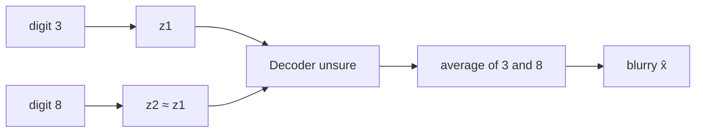

### 3. Reconstruction vs KL trade-off

VAE loss = reconstruction + KL.

- Reconstruction wants $\hat{x}\approx x$, i.e. decoder output **approximately equal** to the input. That only happens if $z$ is a **good** code, so the encoder tries to **store a lot** about $x$ in $z$.
- KL wants the encoder’s distribution and the prior to stay **as close as possible**. That **prevents** the encoder from packing too much **input-specific** information into $z$ (otherwise $q$ would drift far from $\mathcal{N}(0,I)$).

One term says “store maximum information”; the other says “don’t.” Improving one **reduces** the other. Third limitation: an inherent **trade-off**. (Week 4’s $\beta$ only **moves** that trade-off; it does not remove it.)

### 4. Posterior collapse

KL is near **0** only when $q(z\mid x)$ is almost **identical** to the prior. The prior is $\mathcal{N}(0,1)$ per coordinate. An easy cheat under “make $q$ look like the prior”: for **every** $x$, emit $\mu=0$, $\sigma=1$. Then KL vanishes, but $z$ is **uninformative** — the same $(\mu,\sigma)$ (hence a useless $z$) for every input. Extra KL pressure (the week-4 $\beta$ story) makes this cheat **more** tempting.

**Ideal VAE:** $x\to$ encoder $\to\mu,\log\sigma^2\to$ reparameterize $z\to$ decoder uses **that** $z$ (which still carries $x$) $\to\hat{x}$. Different $x$ should yield different informative $z$.

**Collapse:** input $x_1$ maps to a $z_1$ glued to the prior; $x_2$ maps to a $z_2$ also glued to the prior. $z$ no longer tells the decoder **which** $x$ it came from. The decoder then reconstructs **ignoring $z$**, from whatever it already learned: **autoregressive** decoder for **text**, **CNN / non-autoregressive** decoder for **images**. One-line definition: posterior $\approx$ prior for all $x$ ⇒ $z$ is empty ⇒ decoder does not use $z$.

### 5. Likelihood assumption

The decoder outputs **parameters of a chosen distribution**, not “pixels” in the abstract. Those **predefined choices** are the **likelihood assumption**, and they **pick the reconstruction loss**:

| Data type | Decoder emits | Distribution | Reconstruction loss |
|-----------|---------------|--------------|---------------------|
| Continuous | means | **Gaussian** | **MSE** |
| Binary | per-bit probabilities | **Bernoulli** | **BCE** |

Week 3’s numerical already did this: the four or five decoder coordinates **are** Gaussian means. If the chosen likelihood is **too simple**, **too smooth**, or **does not match** complicated real characteristics, the decoder **cannot represent output uncertainty** accurately → again **blurry / less realistic** $\hat{x}$. Fifth limitation: a **predefined likelihood**.

### 6. Missing fine detail

Even when global structure is fine, VAEs miss **sharp edges, fine texture, small facial details**. Samples look **smooth** but **less realistic**. This is the last limitation on the slide; it is mostly a **symptom** of (1), (2), and (5).

| # | Limitation | One-line cause |
|---|------------|----------------|
| 1 | Gaussian assumptions | Posterior and prior both forced Gaussian |
| 2 | Blurry images | Pixel MSE; decoder **averages** when two $z$s collide |
| 3 | Rec ↔ KL trade-off | Store more in $z$ vs stay near the prior |
| 4 | Posterior collapse | $\mu=0,\sigma=1$ for every $x$ ⇒ empty $z$ |
| 5 | Likelihood assumption | Gaussian/Bernoulli choice sets MSE vs BCE |
| 6 | Missing fine detail | Structure yes; texture / edges / faces no |

Stack those six and the common failure mode is **blurry / unrealistic samples**, caused by the **Gaussian pair**, the **likelihood choice**, and **pixel reconstruction**. VAEs still capture **overall structure**; they miss the last mile of realism.

## Motivation for GANs

VAE’s *aim* was already “$\hat{x}$ close to $x$.” The blocker is **how** it gets there (explicit $p$, reconstruction). If you want another model, it should generate **highly realistic** data **without**:

1. explicitly defining a **probability distribution**, and
2. a **reconstruction loss**.

No “probability part” in the training loop in the VAE sense. That is the **motivation for GANs** as stated here.

---

## Adversarial learning (the “A” in GAN)

**Adversarial** in English: **in conflict / competing**. Competition needs **two** players. Here both players are **neural networks**. They **learn by competing**.

| Network | Letter | Job |
|---------|--------|-----|
| **Generator** | $G$ | Map random noise $z$ to a **fake** sample $\hat{x}=G(z)$. Goal: fakes that **look real**. |
| **Discriminator** | $D$ | See **real** $x$ and **fake** $\hat{x}$; output which is which. Goal: **correctly** tell real from generated. |

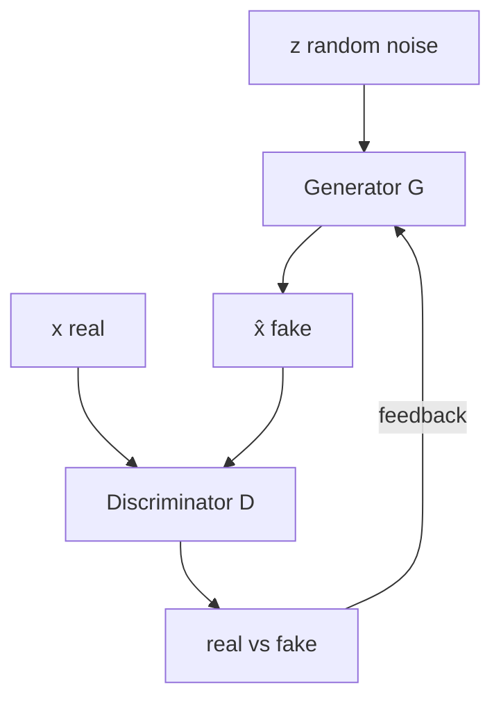

**Competition loop** (repeat for many rounds):

1. Generator emits fakes from noise.
2. Discriminator classifies real vs fake.
3. Generator uses the discriminator’s **prediction as feedback** and improves.
4. Over time $G$ **gradually** learns more realistic samples **while** $D$ gets better at the real/fake call.

If $D$ tags an image as generated and that verdict is fed back, $G$ can **correct itself**. Both sides keep raising their game: $G$ “constantly puts in effort” to look real; $D$ “puts in effort” to stay accurate. The **end state this lecture wants** is an image **close to the original data** — without ever writing $p(x)$ or a pixel reconstruction term.

Learn the two roles **separately**, then lock them:

- $D$ learns to distinguish **real samples** from **fakes produced by $G$**.
- $G$ learns to generate samples so $D$ **cannot easily** tell generated from real.
- $G$ **only** generates. Fuel = noise $z$. Ambition = fakes that could pass as data.
- $D$ **only** judges. Fuel = real $x$ **and** $G$’s fakes. Ambition = a correct real/fake call.

Then turn on the fight: $G$ works **harder** so $D$ **fails** to spot fakes; $D$ gets **stronger** so it still spots them. $G$ tries to **fool** $D$; $D$ tries **not** to be fooled. That two-player fight is **adversarial learning**. The **next** lecture puts numbers on $G$ and $D$ (architecture, losses, backprop). This video’s closer: limitations of VAE + why GAN + this competition picture — not yet the full $G$/$D$ diagrams.

---

### Key takeaways

- VAEs are limited by **Gaussian posterior/prior**, **pixel MSE averaging** (3 vs 8 with similar $z$), **rec↔KL trade-off**, **posterior collapse**, **likelihood choice**, and **missing fine texture**.
- GAN motivation: realistic samples **without** writing $p(x)$ or a reconstruction term.
- GAN = two nets: $G(z)\to$ fakes, $D$ scores real vs fake; they **compete** and $G$ trains on $D$’s feedback.

---


\newpage

# L32: GAN architecture

**Video:** [Lec 32](https://www.youtube.com/watch?v=uWm5rUJpZ_4) · 50:13  
**Instructor in this lecture:** Prof. Ashwini Kodipalli

### Learning objectives

- Trace **generator training**: $z\to G_\phi(z)=\hat{x}\to D_\theta(\hat{x})=\hat{y}$, BCE with **target $y=1$**, update **only $\phi$**.
- Trace **discriminator training**: real branch ($y=1$) and fake branch ($y=0$), $L_D=L_{\text{real}}+L_{\text{fake}}$, update **only $\theta$**.
- Derive both losses from **binary cross-entropy** and write the chain-rule updates.
- Reproduce the lecture’s probability examples ($0.2$ vs $0.9$ / $0.8$).

### Notation in this course

This video (and the next) uses **$\phi$ for generator** parameters and **$\theta$ for discriminator** parameters. (ASR captions say “fi / five / file” for $\phi$ and “Gshian” for Gaussian.)

---

## Generator training — forward pass

1. Draw a **$d$-dimensional** noise vector $z$ from a **standard normal** (Gaussian). If you set latent size **100** in code, you draw **100** Gaussians. At the start $z$ is **meaningless random numbers**.
2. Pass $z$ through generator network $G_\phi$ (**$\phi$ = trainable weights/biases**). $G$ **transforms** the low-dimensional noise into an image
   $$
   \hat{x} = G_\phi(z).
   $$
3. **Shape constraint:** $\hat{x}$ must have the **same dimensions as real training images**, because **one** discriminator sees both.
   - Real grayscale $28\times 28$ ⇒ generate $28\times 28$.
   - Real color $64\times 64\times 3$ ⇒ generate $64\times 64\times 3$.
   You **hard-code that output size** in the generator’s last layer. Two reasons the lecture repeats:
   - If $\hat{x}$ is smaller (or otherwise the wrong tensor shape), $D$ has a **giveaway** that the image is generated.
   - $D$ is built for the **real** tensor shape; a second shape would need a second network. So real and fake **must** share size before they share $D$.
4. Feed $\hat{x}$ to discriminator $D_\theta$ (**$\theta$ = its weights/biases**). $D$ emits a probability $\hat{y}\in(0,1)$:
   $$
   \hat{y} = D_\theta\big(G_\phi(z)\big).
   $$
   Example: $\hat{y}=0.2$ means “only **20%** chance this is real” — $D$ is **confident the image is fake**.

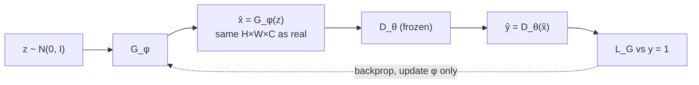

---

## Why the generator’s target is $y=1$

$G$’s job is to **fool** $D$: $D$ should call fakes **real**. So during **generator** training the **desired** label is **$y=1$**, even though the pixels came from $G$.

If you used $y=0$ (“it is fake”), a low $\hat{y}$ (D correctly saying fake) would give a **tiny** error, and $G$ would be told “you are doing fine.” Then **where does the realistic image come from?** Target **1** makes $\hat{y}=0.2$ a **large** loss, which is the signal $G$ needs. The target is **deliberately** 1 because $G$’s objective is to **fool** $D$.

**Forward summary the instructor repeats before the loss slide:** noise → $G$ → $\hat{x}$ → $D$ → $\hat{y}$ compared with **$y=1$** → $L_G$ → backprop (blue dotted path on the slide) **through** $D$ **into** $G$.

---

## Generator loss from BCE

Binary cross-entropy (signs as used on the board):

$$
\mathrm{BCE}(y,\hat{y}) = -\Big( y\log\hat{y} + (1-y)\log(1-\hat{y}) \Big)
$$

Put $y=1$: the second term dies, leftover $-\log\hat{y}$. Substitute $\hat{y}=D_\theta(G_\phi(z))$:

$$
L_G = -\log D_\theta\big(G_\phi(z)\big)
$$

**Goal of $G$ training:** make $D_\theta(G_\phi(z))$ **close to 1**.

**Numeric example:** $\hat{y}=0.2$ ⇒ $L_G=-\log 0.2$ **large**. Two readings of a large $L_G$: $D$ **successfully** tagged a fake, and $G$ **failed** to look real. That large loss, backpropagated, is how $G$ improves.

---

## Generator backpropagation

Path: $L_G \leftarrow \hat{y} \leftarrow \hat{x} \leftarrow \phi$. Chain rule:

$$
\frac{\partial L_G}{\partial\phi}
= \frac{\partial L_G}{\partial\hat{y}}
\cdot \frac{\partial\hat{y}}{\partial\hat{x}}
\cdot \frac{\partial\hat{x}}{\partial\phi}
$$

with $\hat{y}=D_\theta(G_\phi(z))$ and $\hat{x}=G_\phi(z)$. All pieces are differentiable. Update

$$
\phi \leftarrow \phi - \eta\,\frac{\partial L_G}{\partial\phi}.
$$

**Freeze $\theta$.** Gradients **flow through** $D$ but **discriminator weights are not updated** (“$\theta$ frozen”). Only $G$ is learning in this phase. $\theta$ still **appears** in the chain-rule formula — you need $D$ to compute $\hat{y}$ — but you do not step $\theta$. Purpose: change $G$ so $D$ assigns **high “real” probability** to fakes ($D_\theta(G_\phi(z))\to 1$). If that happens, $D$ can no longer tell real from fake, which is the lecture’s definition of a **good** generator.

---

## Discriminator training — two branches

$D$ sees **two** kinds of input. Task: **distinguish** them. **One** $D$, not two.

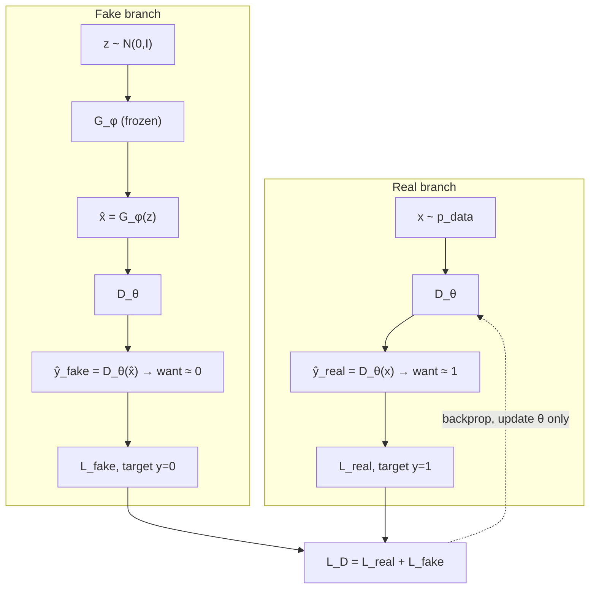

$p_{\text{data}}(x)$ is the **unknown real-data distribution**. Writing $x\sim p_{\text{data}}$ does **not** mean the GAN learns that density explicitly; in practice you **take a real image or a minibatch from the training set** and call it $x$.

### Real branch

$x$ from the dataset → $D_\theta(x)=\hat{y}_{\text{real}}$. For a **real** image this probability should be **high** (near 1). Ground truth **$y_{\text{real}}=1$**. Example: $D_\theta(x)=0.9$ → 90% “real” → good.

### Fake branch

$z\sim$ Gaussian → $\hat{x}=G_\phi(z)$ **same shape as $x$** → $D_\theta(\hat{x})=\hat{y}_{\text{fake}}$. For $D$, fakes should score **near 0**. Ground truth **$y_{\text{fake}}=0$**. (This is the **opposite** of generator training, where the fake’s target was 1.) Example: $0.2$ → only 20% “real” → $D$ correctly called it fake.

Do **not** confuse the two $y$’s:

| Who is training | Input to $D$ | Target $y$ |
|-----------------|--------------|------------|
| Generator | fake $\hat{x}$ | **1** (fool $D$) |
| Discriminator | real $x$ | **1** |
| Discriminator | fake $\hat{x}$ | **0** |

---

## Discriminator losses from BCE

**Real** ($y=1$): second BCE term vanishes

$$
L_{\text{real}} = -\log D_\theta(x).
$$

**Fake** ($y=0$): first BCE term vanishes

$$
L_{\text{fake}} = -\log\Big(1 - D_\theta\big(G_\phi(z)\big)\Big).
$$

**Total:**

$$
L_D = L_{\text{real}} + L_{\text{fake}}
= -\log D_\theta(x) - \log\big(1-D_\theta(G_\phi(z))\big).
$$

(The lecture factors out the leading minus once both logs are written.)

---

## Discriminator backpropagation

Update **$\theta$ only**. **Freeze $\phi$**: fakes still come from $G$, but **generator weights do not change**. Path is short: $L_D \to D \to \theta$.

$$
\frac{\partial L_D}{\partial\theta}
= \frac{\partial L_{\text{real}}}{\partial\theta} + \frac{\partial L_{\text{fake}}}{\partial\theta}
$$

Real path: $L_{\text{real}}\leftarrow \hat{y}_{\text{real}}=D_\theta(x)\leftarrow\theta$.  
Fake path: $L_{\text{fake}}\leftarrow \hat{y}_{\text{fake}}=D_\theta(G_\phi(z))\leftarrow\theta$ (stop before $\phi$).

$$
\theta \leftarrow \theta - \eta\,\frac{\partial L_D}{\partial\theta}.
$$

---

## Discriminator numerical examples

### $D$ doing well

Spoken pair: $D_\theta(x)=0.9$ (real called real), $D_\theta(G(z))=0.2$ (fake called fake). Both BCE terms **small** ⇒ **$L_D$ low**. A good discriminator **lowers** $L_D$.

### $D$ doing badly

$D_\theta(x)=0.2$ (only 20% “real” on a **real** image) and $D_\theta(G(z))=0.8$ (80% “real” on a **fake**). Lecture values:

$$
L_{\text{real}}=-\log 0.2 = 1.609, \qquad L_{\text{fake}}\text{ also large},
$$

so **$L_D$ high**. High $L_D$ backprop tells $D$: push real scores toward **1** and fake scores toward **0**.

---

### Key takeaways

- $G_\phi$: Gaussian $z$ → image $\hat{x}$ **matching real shape** → $D_\theta(\hat{x})$; $L_G=-\log D_\theta(G_\phi(z))$ with **$y=1$**; update **$\phi$**, freeze **$\theta$**.
- $D_\theta$: real $x$ wants score $\approx 1$ ($y=1$); fake $G_\phi(z)$ wants score $\approx 0$ ($y=0$); $L_D=L_{\text{real}}+L_{\text{fake}}$; update **$\theta$**, freeze **$\phi$**.
- Same BCE, different targets, **alternating** freezes. Next lecture turns this into a **min / max** objective.

---


\newpage

# L33: GAN objective and loss functions

**Video:** [Lec 33](https://www.youtube.com/watch?v=GqbgTaJcl38) · 43:38  
**Instructor in this lecture:** Prof. Ashwini Kodipalli

### Learning objectives

- Re-derive $L_{\text{real}}$, $L_{\text{fake}}$, and $L_D$ from BCE (same algebra as Lec 32).
- Turn **minimize $L_D$** into **maximize** a value function $V_D$, then write **expectations** for minibatches.
- Explain **why** $\max_\theta V$ pushes $D_\theta(x)\to 1$ and $D_\theta(G_\phi(z))\to 0$, using the lecture’s $\log 0.1/\log 0.5/\log 0.9$ table.
- Write the **generator** value function (optimize **only the fake term**) and the combined **minimax** GAN objective.

### What this lecture is *not*

**Convergence / Nash equilibrium** is the **next** video. This one stops at the **objective**.

---

## Recap: discriminator BCE on one real and one fake

**Real sample.** $x$ is one training point from the unknown $p_{\text{data}}$. $D_\theta(x)$ is the predicted probability that $x$ is real. Target $y=1$. BCE collapses to

$$
L_{\text{real}} = -\log D_\theta(x).
$$

**Fake sample.** $z$ from the **standard normal** noise prior → $G_\phi(z)=\hat{x}$ (also called $x_{\text{fake}}$) → $D_\theta(G_\phi(z))$ is the probability $D$ assigns “real” to a fake. Target $y=0$. BCE collapses to

$$
L_{\text{fake}} = -\log\big(1 - D_\theta(G_\phi(z))\big).
$$

**Total discriminator loss** (one pair):

$$
L_D = L_{\text{real}} + L_{\text{fake}}
= -\Big(\log D_\theta(x) + \log\big(1-D_\theta(G_\phi(z))\big)\Big).
$$

Neural nets **minimize** loss. Here we minimize $L_D$ **w.r.t. $\theta$**. $\theta$ is weights and biases in an MLP, or **kernel weights** if $D$ is CNN-based. $\phi$ appears inside $G_\phi(z)$ but is **held fixed** while $D$ trains. The left-hand “min over $\theta$ of $L_D(\theta,\phi)$” is exactly that: step $\theta$, freeze $\phi$.

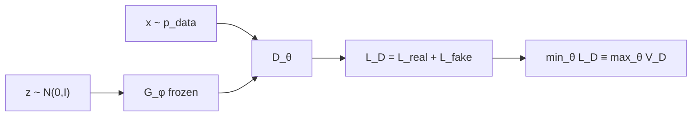

---

## From minimize $L_D$ to maximize $V_D$

$L_D$ is a **minus** a positive log-sum. The lecture’s algebra move: **minimizing $(-A)$ is maximizing $A$**. So

$$
\min_\theta L_D(\theta,\phi) \quad\Longleftrightarrow\quad \max_\theta V_D(\theta,\phi)
$$

where $V$ is the **value function** at the discriminator. $L_D$ kept the minus; $V_D$ (they also write $V_D$ / “WD” in captions) drops it:

$$
V_D(\theta,\phi)
= \log D_\theta(x) + \log\big(1-D_\theta(G_\phi(z))\big)
\quad\text{(one real $x$, one noise $z$).}
$$

If minimization was named $L_D$, maximization of the same contents is named $V_D$. The lecture writes the left-hand side with a **semicolon** $(\theta;\,\phi)$: **only $\theta$ is optimized**, $\phi$ fixed.

---

## Minibatches → expectations

Training never uses a **single** $x$ and a **single** $z$. For many reals, average $\log D_\theta(x)$; for many fakes, average $\log(1-D_\theta(G_\phi(z)))$. That average is an **expectation** (equivalent to $\frac1N\sum_i$ over the batch):

$$
\max_\theta V_D(\theta;\,\phi)
= \mathbb{E}_{x\sim p_{\text{data}}(x)}\big[\log D_\theta(x)\big]
+ \mathbb{E}_{z\sim p_z(z)}\big[\log\big(1-D_\theta(G_\phi(z))\big)\big]
$$

That is the **discriminator objective** used for the rest of the lecture. $D$ **maximizes** this $V_D$.

---

## Why maximizing $V_D$ forces $D(x)\to 1$

Look only at the **real** term $\log D_\theta(x)$. $D_\theta(x)\in(0,1)$. $\log$ is increasing, so the term is **largest** when $D_\theta(x)$ is **largest**, i.e. **$1$** ($\log 1=0$).

At the **start** of training, $\theta$ is **random**. $D$ need not score reals high. Lecture walk-through:

| $D_\theta(x)$ | $\log D_\theta(x)$ (approx.) | Reading |
|--------------:|-----------------------------:|---------|
| $0.1$ (untrained, poor) | $-2.303$ | $D$ fails on reals |
| $0.5$ after some training | $-0.693$ | improving |
| $0.9$ later | $-0.105$ | near the ceiling |

As $D_\theta(x)$ **increases**, $\log D_\theta(x)$ **increases** ($-2.3\to -0.6\to -0.1$). The **limit** is $D_\theta(x)=1$, $\log=0$. **Maximizing the real term pushes $D_\theta(x)$ toward 1** — the same “reals should score high” rule as Lec 32, now from the value function.

---

## Why maximizing $V_D$ forces $D(G(z))\to 0$

Fake term: $\log\big(1-D_\theta(G_\phi(z))\big)$. This is large when $1-D_\theta(G_\phi(z))$ is large, i.e. when **$D_\theta(G_\phi(z))$ is near 0**. Then $1-0=1$, $\log 1=0$ (best value of a log-probability term).

Untrained $D$ may **wrongly** call a fake real:

| $D_\theta(G_\phi(z))$ | $1-D$ | $\log(1-D)$ | Reading |
|----------------------:|------:|------------:|---------|
| $0.9$ (bad $D$) | $0.1$ | $-2.303$ | fakes scored as real |
| $0.5$ | $0.5$ | $-0.693$ | middling |
| $0.1$ (good $D$) | $0.9$ | $-0.105$ | fakes scored as fake |

As the fake score **falls** toward 0, $\log(1-D)$ **rises**. **Maximizing the fake term pushes $D_\theta(G_\phi(z))$ toward 0.**

Together: maximize $V_D$ ⇒ reals $\to 1$, fakes $\to 0$. That is the mathematical form of “$D$ should classify correctly.”

---

## Generator objective $V_G$

Write the **same** two-term value, now as a function of **$\phi$** (optimize generator; **freeze $\theta$**):

$$
V_G(\phi;\,\theta)
= \mathbb{E}_{x}\big[\log D_\theta(x)\big]
+ \mathbb{E}_{z}\big[\log\big(1-D_\theta(G_\phi(z))\big)\big]
$$

**First term does not contain $\phi$.** Real $x$ and $D_\theta$ only. $G$ **cannot** change it. During a generator step you **optimize only the second term**.

$G$ wants $D$ to call fakes **real**, i.e. $D_\theta(G_\phi(z))\to 1$ (Lec 32’s $y=1$ story). If that probability goes to 1,

$$
\log\big(1-D_\theta(G_\phi(z))\big) \to \log 0
$$

which is **undefined / $-\infty$**. So $G$ drives that log term **as small as possible** (large negative). **Generator’s aim is to minimize** the fake log term — opposite of $D$, who wanted to **maximize** it.

The lecture’s sketch: as $D_\theta(G_\phi(z))$ approaches 1, the fake log **drops** (example order-of-magnitude: a very small / large-negative value). That is **minimization**.

---

## Combined GAN objective: minimax

You do not train $G$ and $D$ as two unrelated problems. **One** value $V$, **opposite** goals:

- $D$ **maximizes** $V$ w.r.t. $\theta$
- $G$ **minimizes** $V$ w.r.t. $\phi$

$$
\min_\phi \max_\theta \; V(\phi,\theta)
= \mathbb{E}_{x\sim p_{\text{data}}}\big[\log D_\theta(x)\big]
+ \mathbb{E}_{z\sim p_z}\big[\log\big(1-D_\theta(G_\phi(z))\big)\big]
$$

In $G,D$ letters instead of $\phi,\theta$:

$$
\min_G \max_D \; V(G,D)
= \mathbb{E}_{x}\big[\log D(x)\big]
+ \mathbb{E}_{z}\big[\log\big(1-D(G(z))\big)\big]
$$

**Opposite targets on the same fake:**

| Player | Wants $D(G(z))$ |
|--------|------------------|
| Discriminator | **near 0** |
| Generator | **near 1** |

One minimizes, one maximizes — that is the **adversarial** game from Lec 31, now as a **minimax** objective. How this **converges** and **equilibrium** are the **next** lecture.

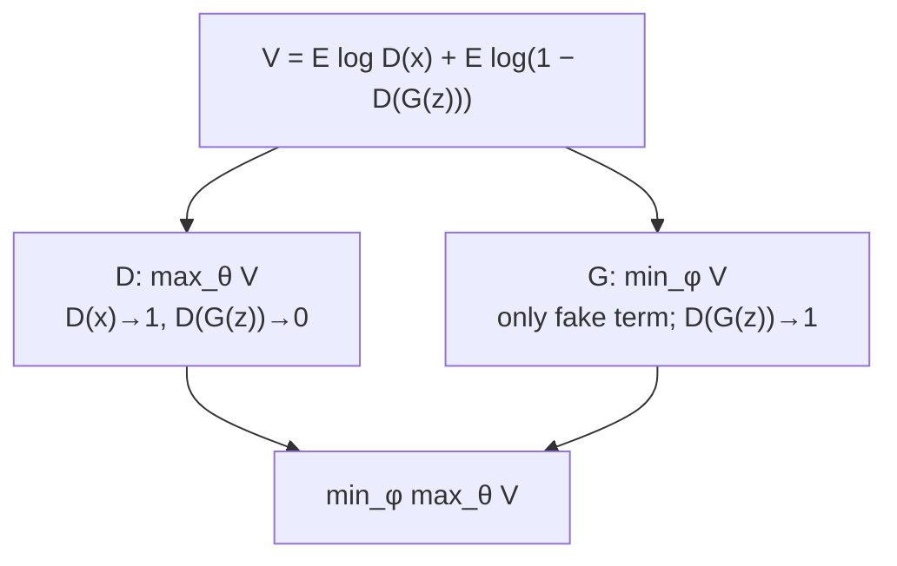

---

### Key takeaways

- $L_D=-\log D(x)-\log(1-D(G(z)))$ on one pair; **min $L_D$** = **max $V_D$** with the minus dropped.
- Batches replace single logs by **expectations** over $p_{\text{data}}$ and $p_z$.
- $\max V_D$ raises $\log D(x)$ ($D(x)\to 1$) and $\log(1-D(G(z)))$ ($D(G(z))\to 0$); the $0.1/0.5/0.9$ log table is the proof.
- $G$ cannot touch the real term; it **minimizes** $\log(1-D(G(z)))$, i.e. wants $D(G(z))\to 1$ (and hits $\log 0$ if it fully succeeds).
- Full GAN: $\min_G\max_D V(G,D)$ — two opposite objectives on the same $V$.

---


\newpage

# L34: GAN Convergence and Nash Equilibrium

**Video:** [Lec 34](https://www.youtube.com/watch?v=nDQHxsLiXz8) · 16:52

### Learning objectives

- State what $p_{\text{data}}(x)$ and $p_g(x)$ are, and how generated samples are produced from $z$.
- Describe the **start of training**: noisy $G$, a strong $D$, and $p_g \neq p_{\text{data}}$.
- Track how discriminator feedback moves $p_g$ toward $p_{\text{data}}$ and $D(G(z))$ toward $0.5$.
- Define **GAN convergence** and **Nash equilibrium** in the lecture’s two-player language.

### Place in week 5

Previous session: GAN **objective** and **loss**. This session is only **convergence**. Next session: **DCGAN** (deep convolutional GAN), which the lecture contrasts with the basic GAN at the end.

---

## Two distributions the lecture keeps on the board

All **real** training points $x$ are drawn from the real data distribution

$$
x \sim p_{\text{data}}(x).
$$

**Generated** samples are not drawn from $p_{\text{data}}$. They are made in two steps:

1. Sample noise $z$ from a **normal** (Gaussian) distribution.
2. Pass $z$ through the generator $G_\phi$ (parameters $\phi$).

The collection of all such $G_\phi(z)$ follows a second distribution, the **generated distribution** $p_g(x)$ (spoken “$p_g$ of $x$”).

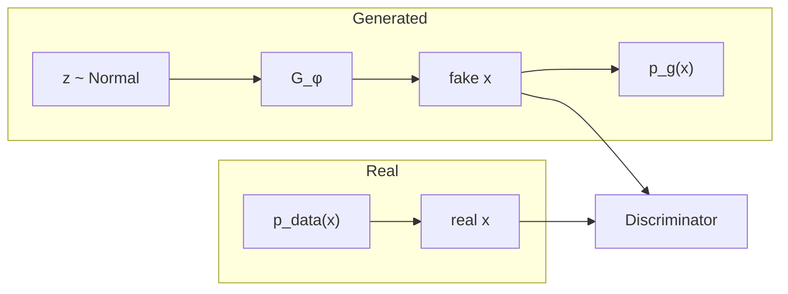

**Convergence talk is always about these two:** $p_{\text{data}}(x)$ versus $p_g(x)$.

---

## Start of training: the two distributions are not equal

$\phi$ is **randomly initialized**, so it is not a trained generator. Samples from $G_\phi$ are **noisy, meaningless, unrealistic**.

Therefore

$$
p_g(x) \;\neq\; p_{\text{data}}(x).
$$

Running example: a **human-face** dataset.

| Source | What the images look like at initialization |
|--------|-----------------------------------------------|
| Real $x \sim p_{\text{data}}$ | Actual faces |
| Fake $G_\phi(z)$ | Noise / disturbed / unrealistic blobs |

### What the discriminator does at this stage

| Input | Discriminator output (probability “real”) |
|-------|-------------------------------------------|
| Real face | closer to **$1$** |
| Generated blob | closer to **$0$** |

So at the initial phase: **discriminator performs well, generator performs poorly**.

---

## As training progresses

The discriminator’s prediction produces a **loss**. That loss is **fed back to the generator**. Gradients are back-propagated **through** $D$ into $G$. In that generator-update path the lecture’s point is: you are updating **$\phi$**, not using that backward pass to retrain $D$.

$$
\phi \;\leftarrow\; \text{update from } D\text{'s feedback}.
$$

Effects, in the lecture’s order:

1. Generated **samples** improve.
2. Therefore $p_g$ **moves closer** to $p_{\text{data}}$.
3. At sample level, fakes look **closer to real images**.
4. It becomes **harder** for $D$ to say real vs generated.

### Score on fakes climbs toward one-half

$D$ on generated images starts low (example **$0.1$**), then **$0.4$**, then **$0.5$**. The generated images are becoming more and more difficult to classify as fake.

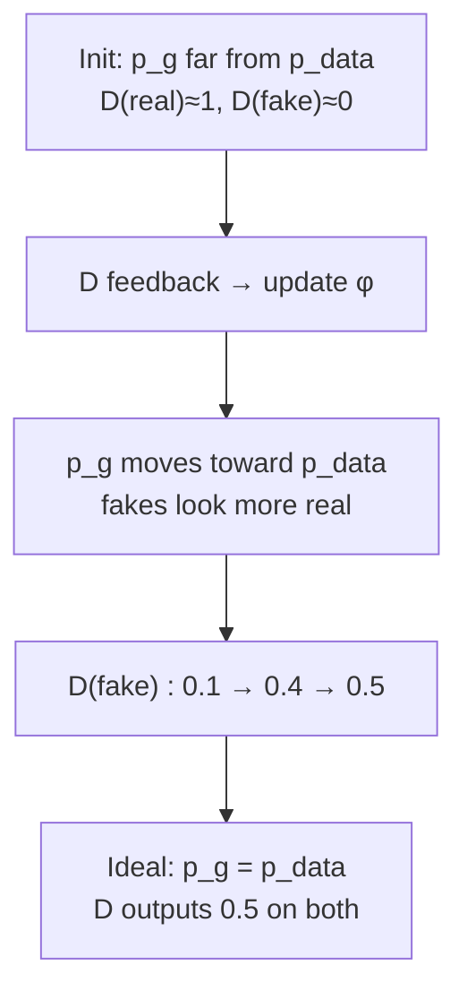

The same story again with the real path: real $x$ still go to $D$ with target near $1$. The change is on the **fake** path, because $G$ is catching up.

---

## Ideal equilibrium

At an **ideal equilibrium**

$$
p_g(x) \;=\; p_{\text{data}}(x).
$$

The generated distribution matches (or comes as close as the lecture’s language allows: “matching / coming closer to”) the real data distribution. Then:

- $D$ **can no longer distinguish** real samples from generated samples.
- For **either** a real image or a generated image, $D$ outputs **$0.5$**.

**$0.5$ does not mean $D$ is a failed network.** It means $G$ has reached the stage of producing images that sit on the same distribution as the real set. $D$ is **confused**, not “broken.”

---

## GAN convergence

**GAN convergence** is the state in which:

1. $p_g$ **matches** $p_{\text{data}}$, and
2. $D$ **can no longer distinguish** real images from generated samples.

The lecture also **calls this same state Nash equilibrium**.

---

## Nash equilibrium (two players)

Players: **generator** and **discriminator**.

At equilibrium:

| Player | Why it cannot improve further |
|--------|-------------------------------|
| $D$ | Real and generated samples follow the **same** distribution, so $D$ cannot get a better real/fake split. |
| $G$ | It is already producing images that **match** the real distribution. |

**Definition as stated:** Nash equilibrium is a state in which **neither generator nor discriminator is improving**. Neither player can obtain a **better outcome by changing its own parameters alone** while the **other network’s parameters are kept unchanged**.

You cannot improve **only** $D$ with $G$ frozen, and you cannot improve **only** $G$ with $D$ frozen: both have already reached a stage where unilateral change does not help.

### One-sentence version from the lecture

$G$ generates images **as close as** the real images $\Rightarrow$ $p_g$ matches $p_{\text{data}}$ $\Rightarrow$ $D$ cannot tell them apart $\Rightarrow$ **neither** player can improve. That is **convergence** and **Nash equilibrium**.

---

## Preview of DCGAN (closing slide)

What you have seen so far is the **basic / vanilla GAN**. It can be used for **images** or for **tabular / CSV** data.

**DCGAN** (deep convolutional GAN) is **specially designed for images**. Architecture is the next session.

### Key takeaways

- Real data: $x \sim p_{\text{data}}(x)$. Fakes: $z \sim \mathcal{N}$, then $G_\phi(z)$ with collection $p_g(x)$.
- At init, $p_g \neq p_{\text{data}}$; $D$ scores reals near $1$ and fakes near $0$.
- Training updates $\phi$ from $D$’s feedback; $p_g$ moves toward $p_{\text{data}}$ and $D(\text{fake})$ climbs toward $0.5$.
- **Convergence:** $p_g = p_{\text{data}}$ and $D \equiv 0.5$ on both. Same state is **Nash**: neither player improves by changing only its own weights.

---


\newpage

# L35: Introduction to DCGAN

**Video:** [Lec 35](https://www.youtube.com/watch?v=XSSaV-FHW2E) · 10:49

### Learning objectives

- Recap vanilla GAN as two networks with **opposite** (minimax) objectives.
- List four **limitations** of GANs taught here: no convergence guarantee, mode collapse, vanishing gradients, hyperparameter sensitivity.
- State the **DCGAN design rules** (strided / transposed conv, batch norm, no FC, activations).
- Sketch the lecture’s **64×64 RGB** generator and discriminator tensor sizes.

### Week 5 theory wrap

Last theory session of week 5 (GAN foundations). Already covered: VAE limitations → motivation for GANs, adversarial learning, architecture, objectives, losses. This video: **limitations of GAN** + **deep convolutional GAN (DCGAN)**. Next: hands-on **vanilla GAN** then **DCGAN**.

---

## Vanilla GAN recap

Two neural networks:

| Network | Input | Job |
|---------|--------|-----|
| **Generator** $G$ | latent noise $z$ | Emit images that $D$ will accept as real |
| **Discriminator** $D$ | real images **and** $G$’s images | Tell real from generated |

They have **opposite** objectives: $G$ gets better at **fooling** $D$; $D$ gets better at **catching** $G$.

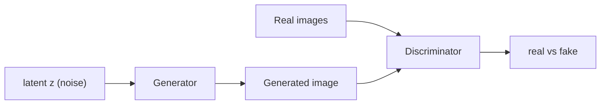

### Minimax (from the previous session; reused here)

First term: $D$ on **real** data — $D$ wants this probability **large**.  
Second term: $D$ on **generated** data — $D$ wants this **small**. That is the **minimax** relationship.

$$
\min_G \max_D V(D,G)
= \mathbb{E}_{x \sim p_{\text{data}}}[\log D(x)]
+ \mathbb{E}_{z \sim p_z}[\log\bigl(1 - D(G(z))\bigr)]
$$

---

## Limitations of GANs

### 1. No convergence guarantee

Minimax + **competitive** objectives $\Rightarrow$ it is hard to reach a **stable equilibrium**. There is **no guarantee** of convergence.

### 2. Mode collapse

Example: real data contains **cat, dog, horse, elephant**. $G$ should emit all four.

What can happen: $G$ produces a **very realistic cat**. $D$ accepts it as real. $G$ then keeps emitting **only cats** — the mode $D$ already accepted — and **never** horse / elephant / dog.

**Other modes are missing.** That is mode collapse.

### 3. Vanishing gradients

If $D$ is **well trained early**, or becomes **too accurate**, there is **no useful gradient** into $G$. Then $G$ **cannot improve**. That is vanishing gradients in this adversarial setting.

### 4. Hyperparameter sensitivity

Hyperparameters (learning rate, batch size, …) should be set **before** training. **Mid-training** retuning can make the model fail to work, sometimes **collapse entirely**.

DCGAN is introduced as a **stable** deep convolutional GAN: a few **architecture** changes to reduce these problems.

---

## DCGAN design rules (architecture changes)

Vanilla / fully connected GAN used **dense** layers and **pooling**. DCGAN’s rules as taught:

| Piece | Vanilla GAN | DCGAN |
|-------|-------------|--------|
| Discriminator spatial ops | pooling | **strided convolution** |
| Generator spatial ops | (dense upsample) | **transposed convolution** (also called deconvolution / **fractionally strided** convolution) |
| Batch normalization | not used | **BN in $G$ and $D$** |
| Fully connected layers | present | **removed** in deeper architectures |
| $G$ activations | — | **ReLU** hidden; **tanh** at output |
| $D$ activations | — | **Leaky ReLU**; **sigmoid** at last layer (real vs fake: $0$ or $1$) |

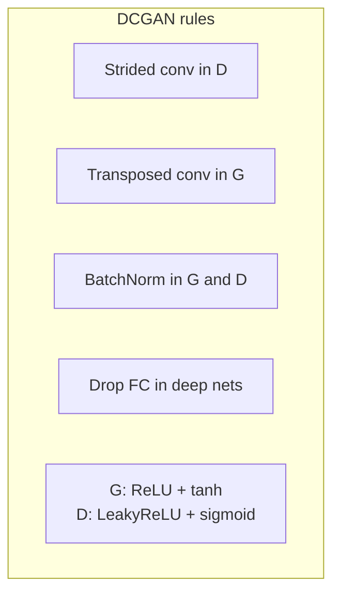

---

## Generator internals (lecture’s 64×64 RGB walk-through)

- Input: latent $z$, **100-D** random noise from a **normal** distribution.
- **Reshape** to $4 \times 4 \times 1024$.
- Each upsample block: **transposed convolution + batch norm + ReLU**.
- **Spatial size doubles**; **channels halve**.

| Stage | Spatial | Channels |
|-------|---------|----------|
| after reshape | $4 \times 4$ | $1024$ |
| upsample | $8 \times 8$ | $512$ |
| … | doubles each time | halves each time: $512 \to 256 \to 128 \to 3$ |
| output | $64 \times 64$ | **$3$ (RGB)** |


---

## Discriminator internals

Input: real **or** generated image, **$64 \times 64 \times 3$**.

Each downsample: **strided convolution + Leaky ReLU + batch norm**.

**Spatial size halves**; **channels double**.

| Stage | Tensor |
|-------|--------|
| input | $64 \times 64 \times 3$ |
| after 1st downsample | $32 \times 32 \times 64$ |
| after 2nd | $16 \times 16 \times 128$ |
| … | continue until **$4 \times 4 \times 512$** |
| last layer | **sigmoid** → probability real vs fake |

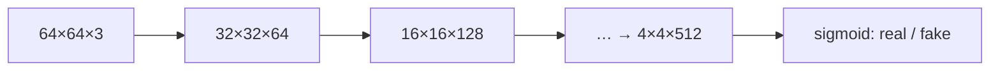

---

## DCGAN as foundation for later GANs

DCGAN **reduces** most of the listed limitations; it does not end the GAN family. Later models still **keep the DCGAN core** and add extras:

| Later GAN (named here) | Extra the lecture mentions |
|------------------------|----------------------------|
| **StyleGAN** | better **noise injection** and **style control** (architecture still DCGAN-like plus those extras) |
| **BigGAN** | **attention** for long-range dependencies |
| **WGAN** | named as another later type |

**Punchline:** many named GANs are DCGAN + additional features; **DCGAN’s core design stays**.

Next session: implementation of **basic GAN** and **DCGAN**.

### Key takeaways

- Vanilla GAN is a minimax game; it can fail to converge, collapse modes, starve $G$ of gradients, and blow up if you retune mid-run.
- DCGAN: strided conv in $D$, transposed conv in $G$, BN both sides, drop FC, ReLU/tanh in $G$, Leaky ReLU/sigmoid in $D$.
- Lecture’s picture: $100$-D $z$ $\to$ $4\times4\times1024$ $\to$ $64\times64\times3$; $D$ mirrors that down to $4\times4\times512$ then sigmoid.
- StyleGAN / BigGAN / WGAN are taught as **add-ons on the DCGAN foundation**, not replacements of that core.

---


\newpage

# L36: Practical Exercise 1 — Vanilla GAN

**Video:** [Lec 36](https://www.youtube.com/watch?v=WTpywahiL9w) · 33:04

This lab is the **vanilla (2014) fully connected GAN**, not DCGAN (that is Lec 37).

### Learning objectives

- Implement a **vanilla GAN** in TensorFlow/Keras on **Fashion MNIST**.
- Normalize pixels to **$[-1,1]$** to match **tanh**, flatten $28\times28\to784$, and drop labels / test split.
- Build MLP **generator** and **discriminator**, a custom `GAN` model class, **Adam** + **binary cross-entropy**, and plot both losses.
- Read the loss curves and the $4\times4$ grid of generated garments.

---

## What is being built

Vanilla GAN (2014): two networks, all **fully connected**. It is the base framework the lecture says later models (DCGAN, StyleGAN, CycleGAN, “diffusion” as later generative models) build on.

| Network | Role in this lab |
|---------|------------------|
| Generator | Noise $z$ → **fake** $28\times28$ fashion image |
| Discriminator | Classifier: **real** Fashion MNIST vs **fake** |

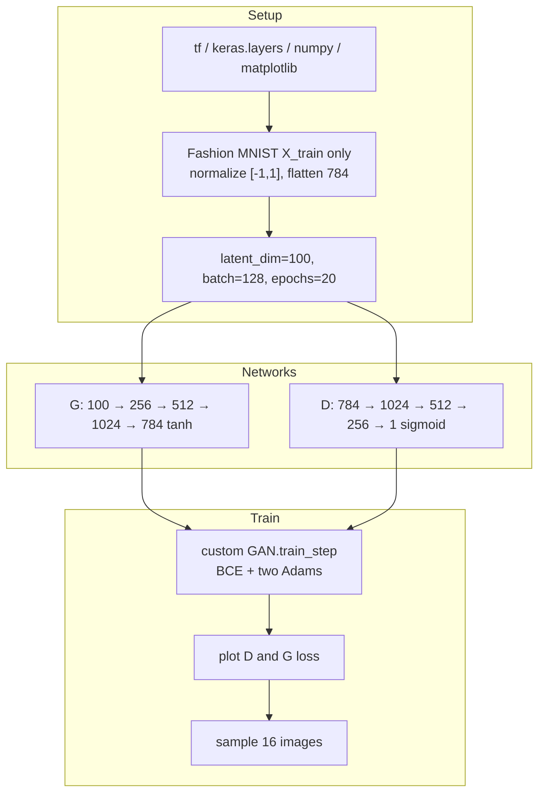

---

## 1. Libraries

- `tensorflow` as `tf`
- `tensorflow.keras` **layers**
- `numpy` as `np`
- `matplotlib.pyplot` as `plt`

---

## 2. Dataset: Fashion MNIST (no labels, no test set)

Benchmark set of **clothing and accessories**, **10 classes**:

| Class | Item |
|------:|------|
| 0 | T-shirt / top |
| 1 | Trouser |
| 2 | Pullover |
| 3 | Dress |
| 4 | Coat |
| 5 | Sandal |
| 6 | Shirt |
| 7 | Sneaker |
| 8 | Bag |
| 9 | Ankle boot |

Load from `tf.keras.datasets.fashion_mnist` into **`X_train` only**.

GANs here are **unsupervised generation**:

- **No** `y_train` / `y_test` (underscores in the unpack).
- **No** `X_test` — “testing” is $D$ scoring real training images vs $G$’s fakes.

---

## 3. Preprocess: $[-1,1]$ then flatten

Pixel intensities are **$0$–$255$** grayscale. Output activation is **tanh** (range **$[-1,1]$**), so scale with

$$
X \leftarrow \frac{X_{\text{float}} - 127.5}{127.5}.
$$

Checks from the lecture:

| Raw pixel | After scale |
|-----------|-------------|
| $0$ | $(0-127.5)/127.5 = -1$ |
| $255$ | $(255-127.5)/127.5 = 1$ |

Then **flatten** each $28\times28$ image to a **$784$** vector.

**Shape printed:** `60 000` samples × `784` features.

---

## 4. Hyperparameters

| Name | Value | Why |
|------|------:|-----|
| `latent_dim` | **100** | length of noise $z$ |
| `batch_size` | **128** | 60 000 split into batches of 128 |
| `epochs` | **20** | as used in the demo |

---

## 5. Generator (MLP)

`Sequential`. Input size **100**.

Why **Leaky ReLU**, not ReLU: ReLU is $\max(0,x)$. Negative $x$ becomes **$0$** → neurons can **die**. Leaky ReLU:

$$
\max(x,\; \alpha x),\qquad \alpha = 0.2.
$$

Worked examples:

- $x=-5$: $\max(-5,\; 0.2\cdot(-5)) = \max(-5,-1) = -1$ (still a leak, neuron stays alive).
- $x=5$: $\max(5,\; 1) = 5$.

| Layer | Units | Activation |
|-------|------:|------------|
| Dense | 256 | Leaky ReLU $0.2$ |
| Dense | 512 | Leaky ReLU $0.2$ |
| Dense | 1024 | Leaky ReLU $0.2$ |
| Dense (output) | **784** | **tanh** (matches $[-1,1]$ pixels) |

### Parameter counts (as computed on the summary)

Formula used: $(\text{in}\times\text{units}) + \text{bias}$.

| Layer | Calculation | Trainable params |
|-------|-------------|-----------------:|
| Dense 256 | $100\times256 + 256$ | **25 856** |
| Leaky ReLU | — | 0 |
| Dense 512 | $256\times512 + 512$ | **131 584** |
| later dense layers | same rule | (sum is large) |

---

## 6. Discriminator (MLP, mirror of $G$)

Input **784**. Stack is the **reverse** of $G$’s widths, then a binary head.

| Layer | Units | Activation |
|-------|------:|------------|
| Dense | 1024 | (Leaky ReLU in the same style as $G$) |
| Dense | 512 | |
| Dense | 256 | |
| Dense | **1** | **sigmoid** |

Binary classifier: $p>0.5$ → class **1 (real)**; $p<0.5$ → class **0 (fake)**.

Example param count: $784\times1024 + 1024 =$ **803 840**.

**Total $D$ params stated:** **1 460 225**.

---

## 7. Custom `GAN` class

Subclass `tf.keras.Model`.

1. Constructor stores `generator` and `discriminator`; `super()` initializes the Keras model.
2. **Loss trackers:** `tf.keras.metrics.Mean` for discriminator loss and generator loss (running averages, less noise from outliers).
3. **Two Adam optimizers** (one for $D$, one for $G$).

### Adam as written

New weights from old weights, learning rate $\eta$, bias-corrected mean $\hat{m}$ and variance $\hat{v}$:

$$
w \leftarrow w - \eta \frac{\hat{m}}{\sqrt{\hat{v}} + \varepsilon}.
$$

$$
m \leftarrow \beta_1 m + (1-\beta_1)g_t, \qquad
v \leftarrow \beta_2 v + (1-\beta_2)g_t^2.
$$

$\beta_1,\beta_2$ control moving averages of gradients and squared gradients.

---

## 8. `train_step`

### Discriminator step

1. Real batch: Fashion MNIST, size **128**.
2. Noise $\sim$ **normal / Gaussian**, shape **$(128, 100)$**.
3. `generated_images = G(noise, training=True)`.
4. **Concatenate** reals and fakes on **axis 0** (stack fakes **under** reals).
5. Labels: **ones** for real, **zeros** for fake; concatenate the same way.
6. **Label noise:** add $\text{Uniform}\times 0.05$ so labels are not hard $0/1$ (uniform so labels stay roughly equally probable).
7. $D$ predicts on the combined batch (`training=True`).
8. **Binary cross-entropy** between those labels and predictions.
9. Gradients w.r.t. $D$ weights; `zip` gradients with trainable weights; Adam update.

### Generator step

1. Fresh noise shape $(128, 100)$.
2. **Misleading labels = ones** (shape `(batch, 1)`): $G$ wants $D$ to call fakes real.
3. $D$ scores `G(noise)` with `training=True` on that path.
4. Generator BCE vs those ones; backprop into **$G$** only; zip + apply.

Return tracked **$D$ loss** and **$G$ loss**.

---

## 9. Compile, $\beta$, fit

- Build `GAN(generator, discriminator)`.
- Configure both Adams. Lecture choice: **$\beta = 0.5$** for GANs so you do **not** depend too much on the past (high/low $\beta$ → more oscillation, more “stuck on old fakes”).
- Loss: **binary cross-entropy** (true vs predicted; large when they differ).
- `fit` on `X_train`, **20** epochs, batch **128**.

Demo numbers after training: **$D$ loss $\approx 0.71$**, **$G$ loss $\approx 0.89$**. Lower $D$ loss means $D$ is still somewhat able to separate fakes from reals.

---

## 10. Loss plot — what to observe

- Figure **$8\times 5$**.
- Plot history of $D$ loss and $G$ loss; $x$ = epoch, $y$ = loss; title **“vanilla GAN training”**; legend.
- **Blue** = discriminator, **orange** = generator.

| Phase | Observation |
|-------|-------------|
| Epochs **0–7** | $D$ loss **much smaller** than $G$ loss ($G$ cannot yet make realistic images) |
| Then | $D$ loss drops further ($D$ still classifies well) |
| After ~**10** epochs | the two curves move **together**; gap is the $0.71$ vs $0.89$ seen in the log |

That matches the theory: early $D$ is strong and $G$ is weak; later they train **hand in hand**.

---

## 11. Sample 16 fashion images

1. `n = 16`; noise shape **$(16, 100)$** from a normal.
2. `G.predict(z)`; **reshape** to $(16, 28, 28)$.
3. Subplot grid **$4\times 4$**; colormap **gray**; axes off; suptitle **generated Fashion MNIST images**.

**What they saw:** shirts, sneakers/shoes, sandals, T-shirts, a plausible **bag** — clothing and accessories, not noise.

Vanilla GAN is left as the **fundamental** stack before DCGAN / CycleGAN / StyleGAN.

### Key takeaways

- Unsupervised Fashion MNIST: **60k × 784**, pixels in **$[-1,1]$**, no labels/test.
- $G$: $100\to256\to512\to1024\to784$ tanh, Leaky ReLU $0.2$; $D$ is the reverse plus sigmoid.
- Train with a Keras `GAN` class, two Adams ($\beta=0.5$), BCE, optional $0.05$ label noise, misleading ones for $G$.
- Early: $D$ loss $\ll$ $G$ loss; later they track; 16 grayscale samples already look like garments.

---


\newpage

# L37: Practical Exercise 2 — DCGAN

**Video:** [Lec 37](https://www.youtube.com/watch?v=nOL6et_IQRQ) · 40:05

### Learning objectives

- Explain why **convolutions** beat the Lec 36 MLP: spatial structure, feature hierarchy, fewer parameters.
- Rebuild Fashion MNIST as **$28\times28\times1$**, with shuffle/batch pipeline, `Conv2DTranspose` generator and strided-conv discriminator.
- Reproduce BN + `use_bias=False`, padding, stride-2, Leaky ReLU $0.2$, dropout $0.3$, Adam **$2\times10^{-4}$**, $\beta=0.5$, BCE **`from_logits=True`**.
- Compare sample quality and param counts to vanilla GAN; note the missing **class control** (teaser for cGAN).

---

## Why DCGAN after vanilla GAN

Vanilla GAN **flattens** $28\times28$ to $784$. **Spatial layout is lost.**

DCGAN keeps 2-D maps:

| Vanilla GAN | DCGAN |
|-------------|--------|
| Fully connected | **Convolutional** |
| Spatial structure discarded | Spatial structure **preserved** (padding helps keep borders) |
| No explicit hierarchy | **Low-level** (edges, corners) → **mid-level** (textures, shapes) → **high-level** (object parts) |
| More parameters | **Fewer** parameters, less memory, faster training |

Same dataset as Lec 36 so the two labs are comparable.

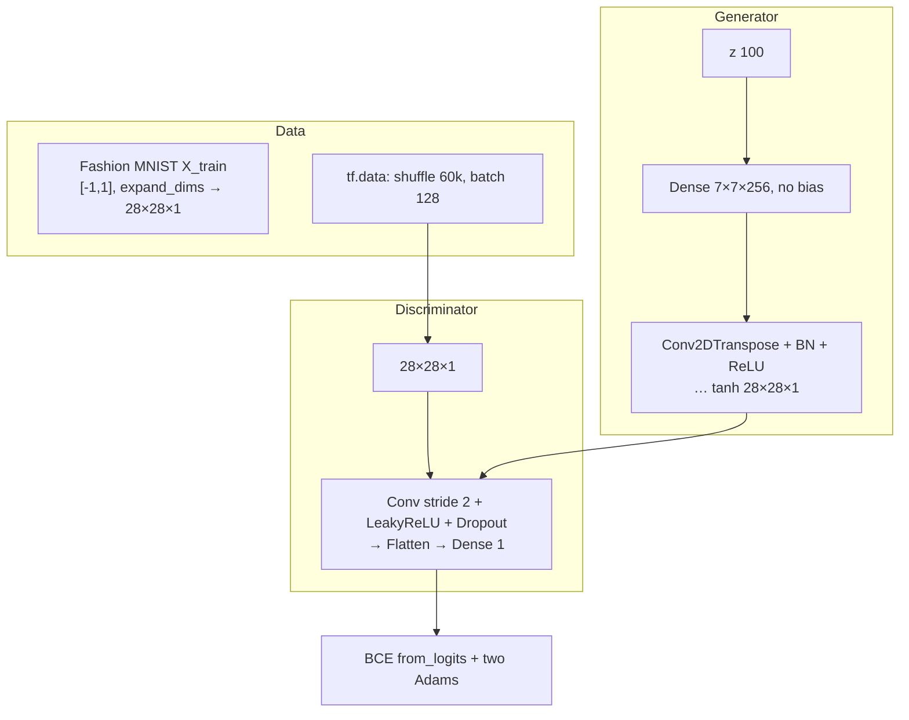

---

## 1. Libraries

Same stack as Lec 36: `tensorflow` as `tf`, `keras.layers`, `numpy` as `np`, `matplotlib.pyplot` as `plt`.

---

## 2. Dataset and preprocess

Fashion MNIST again, **10 classes** (T-shirt/top, trouser, pullover, dress, coat, sandal, shirt, sneakers, bag, ankle boot).

Unpack **`X_train` only** — unsupervised; no `y_*`, no `X_test`. Evaluation is $D$ on reals vs $G$’s fakes.

**Normalize to $[-1,1]$** because the generator ends in **tanh**:

$$
X \leftarrow \frac{X_{\text{float}} - 127.5}{127.5}.
$$

($127.5$ is half of $255$.)

**Keep the image grid:** `np.expand_dims` adds a channel. Printed shape:

$$
60\,000 \times 28 \times 28 \times 1
$$

(grayscale → one channel).

---

## 3. `tf.data` pipeline

| Knob | Value |
|------|------:|
| Buffer / training size | **60 000** |
| Batch | **128** |

`tf.data.Dataset.from_tensor_slices(X_train)` → **shuffle** the buffer → **batch** 128.

Shuffle so you do **not** always see indices $0$–$127$, then $128$–$255$, … (avoids memorizing order).

---

## 4. Generator

`latent_dim = 100`. `Sequential`.

### Why $7\times7$?

Need to grow back to **$28\times28$**. $7$ is a convenient **factor of $28$** (could have used $14$, etc.; they start from the smallest $7\times7$). **$256$** feature maps at $7\times7$.

### First dense, no bias

`Dense(7*7*256, use_bias=False, input_shape=(100,))` then **batch norm**, **ReLU**, **reshape** to $(7,7,256)$.

**Why `use_bias=False`:** BN already has a learnable **scale $\gamma$** and **shift $\beta$**. A dense/conv bias would **shift twice**. Parameter count becomes $\text{in}\times\text{units}$ with **no** extra $+ \text{units}$.

### Upsampling: `Conv2DTranspose`

Typical block: transposed conv, **kernel $5\times5$**, `padding='same'` (zero-pad so borders are not cropped off), `use_bias=False`, **BN**, **ReLU**.

Lecture stack (as spoken):

| Transposed conv | Filters | Stride | Notes |
|-----------------|--------:|--------|--------|
| 1 | 128 | **1** | $5\times5$, same pad, no bias, BN, ReLU |
| 2 | 64 | **2** | same pattern |
| … | … | 2 | repeat conv / BN / ReLU |
| last | **1** | **2** | $5\times5$, same pad, **tanh** → $[-1,1]$ |

### Convolution mini-lesson (5×5 toy image)

Grayscale values $0$ (black) – $255$ (white). Overlay a **$3\times3$ kernel** (edge/corner/line detector). Example **Prewitt**-style vertical kernel they wrote:

$$
\begin{bmatrix}
-1 & -1 & -1 \\
0 & 0 & 0 \\
1 & 1 & 1
\end{bmatrix}
$$

Place the kernel’s center on a pixel, multiply-add, write the result into the feature map (their example replaces the center value **$10$**). Slide across. Without padding, a $5\times5$ image with a $3\times3$ kernel yields **$3\times3$** and **loses the border**. **`padding='same'`** adds zeros so the center can sit on edge pixels and **boundaries survive**.

**Stride:** stride $1$ = shift the window by one pixel. Implementation uses **stride $2$** in later layers = skip a pixel (center jumps by two) → downsample/upsample by about $2\times$.

### Batch norm formula (as written)

$$
x_{\text{norm}} = \frac{x - \mu}{\sqrt{\sigma^2 + \varepsilon}}, \qquad
y = \gamma\, x_{\text{norm}} + \beta.
$$

$\varepsilon$ is a tiny constant for **numerical stability** (avoid divide-by-zero). $\gamma$ = learnable scale, $\beta$ = learnable shift. After BN, values sit near a Gaussian with mean $0$, std $1$ (mass inside $\pm1$, $\pm2$, or $\pm3$ $\sigma$ depending how much of the bell you keep).

**ReLU** after BN: $\max(0,x)$ — zeros negatives, passes positives; adds nonlinearity.

### Generator summary numbers

First dense output width $7\times7\times256 = 12\,544$.

$$
100 \times 7 \times 7 \times 256 = 1\,254\,400
$$

(no $+7\times7\times256$ bias).

**Total $G$ parameters: $2\,330\,944$** — large net, but **fewer** than the vanilla MLP GAN, so training is lighter.

---

## 5. Discriminator

Mirror the filter counts: $G$ went **$256 \to 64 \to 1$**; $D$ starts **$64 \to 128 \to 1$**.

| Layer | Details |
|-------|---------|
| Conv2D | **64** filters, $5\times5$, stride **$(2,2)$**, `padding='same'`, input **$(28,28,1)$** |
| Leaky ReLU | $\alpha=0.2$: $\max(x, 0.2x)$ — same $-5\to-1$, $+5\to5$ examples as Lec 36 |
| Dropout | **$0.3$** (30% of units dropped in training — less co-adaptation / memorization) |
| Conv2D | **128**, $5\times5$, stride $2$, same pad, Leaky ReLU, dropout |
| Flatten | 1-D vector |
| Dense | **1** logit — binary real vs fake |

First-layer spatial size: $28\to14$, so **$14\times14\times64$**.

Params (bias **kept** here): they compute first conv **$1\,664$**.

**Total $D$ parameters: $212\,865$**.

---

## 6. Adversarial loss (`from_logits=True`)

`BinaryCrossentropy(from_logits=True)`.

**Logits** = raw scores, **not** probabilities (they need not sum to $1$). The loss applies **sigmoid** internally:

$$
\sigma(x) = \frac{1}{1+e^{-x}}.
$$

Then $p \ge 0.5$ → class **1 real**; $p < 0.5$ → class **0 fake**.

(The spoken “ten raw scores” is Fashion-MNIST class count leaking into the explanation. The **network head is one logit**, binary.)

| Loss | Code idea |
|------|-----------|
| Real $D$ loss | BCE of **ones** vs $D(\text{real})$ |
| Fake $D$ loss | BCE of **zeros** vs $D(\text{fake})$ |
| $D$ total | real + fake |
| $G$ loss | BCE of **ones** vs $D(G(z))$ (fool $D$) |

---

## 7. Optimizers

**Adam** on $G$ and on $D$.

- **Learning rate $0.0002$**
- **$\beta = 0.5$** (same rationale as Lec 36: neutral; extreme $\beta$ → oscillations / clinging to old fakes, weaker adversarial learning)

---

## 8. Training step (`GradientTape`)

Per batch of real images:

1. Noise $\sim$ normal, shape **$(128, 100)$**.
2. `generated_images = G(noise, training=True)`.
3. $D$ on reals and on fakes (`training=True`).
4. Compute $G$ loss from **fake** scores only; $D$ loss from **real + fake**.
5. Gradients: $G$ loss w.r.t. $G$ trainable vars; $D$ loss w.r.t. $D$ trainable vars.
6. Apply both Adams. Return both losses.

**$G$ sees only $z$.** **$D$ sees MNIST reals and $G$ fakes.**

---

## 9. Train 20 epochs — printed losses

Outer loop `for epoch in range(20)`; inner loop over image batches; print epoch and both losses to **four decimal places**.

| What they observed | Numbers |
|--------------------|---------|
| Early $G$ loss | starts around **$0.65$**, then **$0.84$**, **$0.82$**, then **gradually decreases** |
| $D$ loss | **varies**: **$1.45$**, **$1.19$**, **$1.26$**, … |
| End of epoch 20 | $G$ **$0.81$**, $D$ **$1.32$** — “hand in hand” |

Early $G$ is weak; it improves by learning from noise + adversarial signal. $D$’s loss fluctuating means its real/fake job is not a monotone easy win.

---

## 10. Display 16 images

- Noise $(16, 100)$; `generated = G(noise)`.
- Map from $[-1,1]$ to roughly $[0,1]$: **`(generated + 1) / 2`**.
- Figure **$8\times8$**; **$4\times4$** subplots; `cmap='gray'`; axes off; `tight_layout`.

Visible: sneakers, boots, T-shirts, bag, shirt-like clothes.

---

## 11. Vanilla GAN vs DCGAN (closing comparison)

| | Vanilla (Lec 36) | DCGAN (this lab) |
|--|------------------|------------------|
| Quality of 16 samples | recognizable but weaker | **higher quality** reconstruction |
| Parameters | huge FC counts | **fewer** despite a “deep” conv stack |
| Spatial structure | destroyed by flatten | kept via conv + **padding** |
| Class control | none | **still none** |

**Limitation they emphasize:** asking for “16 samples” yields a **random mix** of bags, sneakers, boots, clothes — **not class-specific**. For **label-conditioned** generation, next model is **conditional GAN (cGAN)**.

### Key takeaways

- Keep Fashion MNIST as $28\times28\times1$; shuffle 60k; batch 128; $z\in\mathbb{R}^{100}$.
- $G$: dense $7\times7\times256$ (no bias) → Conv2DTranspose + BN + ReLU → tanh; **$2\,330\,944$** params.
- $D$: strided conv 64 then 128, Leaky ReLU $0.2$, dropout $0.3$, dense 1; **$212\,865$** params.
- Adam $2\times10^{-4}$, $\beta=0.5$, BCE with logits; 20 epochs end near $G\,0.81$, $D\,1.32$.
- Better images than vanilla GAN, still **unconditional** — that is the hook for Lec 38.

---


\newpage

# L38: Conditional GAN

**Video:** [Lec 38](https://www.youtube.com/watch?v=a9ier1m_Fzs) · 44:49  
**Instructor in this lecture:** Prof. Baishali Garai (introduces herself as Vaishali)

### Learning objectives

- Restate vanilla GAN as a **minimax / cricket-style** adversarial game, and why $z$ alone cannot request “digit 5.”
- Draw the **cGAN** architecture: condition $y$ into **both** $G$ and $D$.
- Write **real / fake $D$ losses**, the **non-saturating $G$ loss**, and the **conditioned minimax** $V(D,G)$.
- Contrast vanilla vs conditional GAN and list the lecture’s applications (including the Pix2Pix teaser).

### Agenda (as listed)

Quick GAN review → motivation for cGAN → architecture → training loop → objective / losses → vanilla vs cGAN → applications.

---

## Vanilla GAN recap

GAN = two networks, **generator** $G$ and **discriminator** $D$, trained **against** each other.

**Cricket analogy:** batsman tries to **increase** runs; bowler tries to **stop** that. Success of one is failure of the other. Same structure: $G$ vs $D$ in a **minimax game**.

### MNIST walk-through they put on the slide

- Real image: handwritten **5** → $D$ (learns what a 5 looks like).
- $G$ gets **random noise**, emits a **fake** (example: a **7**).
- $D$ sees real 5 and fake 7 and must say **real vs fake**.
- If $D$ is wrong: **discriminator loss**, backprop into $D$.
- If the fake does not look like the reals: **generator loss**, backprop into $G$.

$G$’s job: make fakes $D$ will accept as real. $D$’s job: maximize correct real/fake calls.

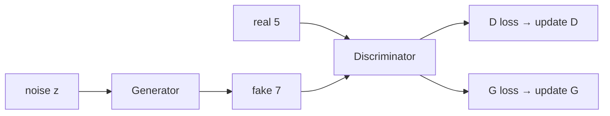

---

## What “random noise” is

$z$ is a **latent vector** from an abstract, **low-dimensional** space that still holds essential structure (summary of a long storybook: shorter, but the important plot is there).

If $z$ is **100-D**, it is 100 numbers. **Each component is drawn independently** from

$$
\mathcal{N}(0,1)
$$

(mean $0$, variance $1$). $G(z)$ turns that unstructured vector into a **structured** image (the fake 7).

---

## Motivation: no control over what $G$ emits

**There is no control** on the class of $G(z)$.

Latent space in a **standard GAN has no explicit semantic meaning**. MNIST example:

| Sample | $G(z)$ might be |
|--------|-----------------|
| $z_1$ | digit **3** |
| $z_2$ | digit **7** |
| $z_3$ | digit **1** |

**Can you demand a 5?** You do **not** know which $z$ yields 5. There is **no map** “this region of $Z$ = digit 5.”

That is the **main motivation** for **conditional GAN (cGAN)**.

Still true in both vanilla and cGAN:

- $G$ is trained to **maximize $D$’s mistakes**.
- $D$ is trained to **maximize correct** real/fake decisions.

cGAN adds **controlled, guided** generation: put a **conditioning input** into $G$ so the output is the class (or other condition) you asked for.

---

## What a cGAN conditions on

Paper the lecture points to: **Conditional Generative Adversarial Nets** (original cGAN paper — students are told to read it).

**Extra information $y$ goes to both $G$ and $D$.**

On MNIST, $y$ is the **class label** $0$–$9$ (image of a 0 tagged $0$, and so on).

Conditioning is **not only labels**. Other modalities named:

- **text prompts**
- **images** (image-to-image translation)

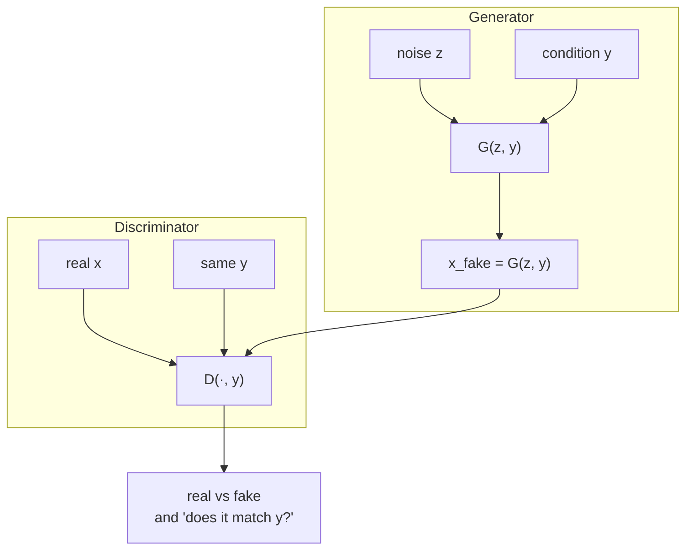

---

## Architecture on digit 7

- Real image $x$ = a **7**, label $y=7$. Both go to $D$.
- Noise $z$ **plus the same** $y=7$ go to $G$.
- $G$ now emits **sevens** (the requested class). The fake 7s can still **look different** (different stroke structure) from the real 7.
- Fakes go to $D$ as well. Reals and fakes are typically shown **50/50**.
- $D$ loss backprop → $D$; $G$ loss backprop → $G$. Same adversarial loop, now **conditioned**.

$D$ must decide: does this look like the **real 7s**, not just “is it some digit?”

---

## Training loop (five steps)

### Step 1 — real pair into $D$

Pick real image $x$ (a 7) and its condition $y$ (`label = 7`). Both enter $D$.

### Step 2 — score on the real pair

$$
D(x,y) \in [0,1]
$$

= probability $D$ assigns to “this pair is real.”

### Step 3 — fake pair into $D$

Sample $z$. Same $y$ into $G$:

$$
x_{\text{fake}} = G(z,y).
$$

$D$ scores the fake **with the same $y$:**

$$
D\bigl(G(z,y),\, y\bigr).
$$

It asks two questions at once: **does the image match condition $y$?** and **is it real?**

Targets while training $D$:

$$
D(x,y) \to 1 \quad \text{(real pair)}, \qquad
D\bigl(G(z,y), y\bigr) \to 0 \quad \text{(fake pair)}.
$$

### Step 4 — train $G$

$G$ tries to **fool** $D$: push

$$
D\bigl(G(z,y), y\bigr) \to 1.
$$

$G$ learns: given $y$, emit an image that **looks real** **and** **matches $y$**.

### Step 5 — repeat

$G$ improves image quality (and label consistency). $D$ improves detection. Eventually $G$ produces **realistic, label-consistent** samples.

---

## Discriminator losses

$D$’s goal: real pairs → real, fake pairs → fake. Two terms.

### Real loss

$$
L_D^{\text{real}}
= -\,\mathbb{E}_{x \sim p_{\text{data}}(x)}\bigl[\log D(x,y)\bigr].
$$

- Expectation = average over the **real** set.
- $p_{\text{data}}(x)$ = true data distribution.
- $D(x,y)$ = “real pair” probability.
- $D$ wants $D(x,y)\to 1$. The **minus** is there so training **minimizes** this loss.

**Numerical check they computed** (natural log):

| $D(x,y)$ | $\log D(x,y)$ | after minus (loss) |
|--------:|--------------:|-------------------:|
| $0.9$ | $\approx -0.045$ | **$0.045$** (small — $D$ is confident on a real) |
| $0.2$ | $\approx -0.70$ | **$0.70$** (large — $D$ failed on a real) |

(The spoken “$D$ wants $0$” on this slide is a slip; the table only makes sense if $D$ wants **$1$** on reals, matching the rest of the lecture.)

### Fake loss

$$
L_D^{\text{fake}}
= -\,\mathbb{E}_{z \sim p_z}\Bigl[\log\bigl(1 - D(G(z,y), y)\bigr)\Bigr].
$$

Average over **noise** samples. $D$ wants $D(G(z,y), y)\to 0$ on fakes.

**Total discriminator loss** = real + fake.

---

## Generator loss

Standard (saturating) form:

$$
L_G
= \mathbb{E}_{z,y}\Bigl[\log\bigl(1 - D(G(z,y), y)\bigr)\Bigr].
$$

**Vanishing gradients** if you use that. **In practice** they use the non-saturating version (derivation not done in class):

$$
L_G
= -\,\mathbb{E}_{z}\bigl[\log D(G(z,y), y)\bigr].
$$

Minus sign again = minimize. $G$ wants $D(G(z,y), y)\to 1$; $D$ wants that same score $\to 0$.

---

## Minimax objective of cGAN

Both networks are **conditioned on $y$**:

$$
\min_G \max_D V(D,G)
= \mathbb{E}\bigl[\log D(x,y)\bigr]
+ \mathbb{E}\bigl[\log\bigl(1 - D(G(z,y), y)\bigr)\bigr].
$$

- $\max_D$: $D$ **maximizes** $V$ (better real/fake + condition check).
- $\min_G$: $G$ **minimizes** $V$ (reduce $D$’s success / fool $D$).
- First term: classify **real** $(x,y)$ correctly.
- Second term: push $G(z,y)$ toward images $D$ would call real **under $y$**.

Competition $\Rightarrow$ realistic samples that **obey the condition**.

---

## Vanilla GAN vs cGAN

| | Vanilla GAN | Conditional GAN |
|--|-------------|-----------------|
| $G$ input | $z$ only | $z$ **and** $y$ |
| $D$ input | $x$ | $x$ **and** $y$ |
| $D$’s question | “Is $x$ real?” | “Is $x$ real **and** does it match $y$?” |
| Control | **none** | **controlled** generation |

---

## Applications named in the lecture

All of the MNIST story is **class-label** conditioning. Also:

| Task | Example they showed |
|------|---------------------|
| Image → image | **sketch → photograph** |
| Time of day | **daytime → nighttime** |
| Text → image | “**red bird with blue wings**” |
| Super-resolution | low-res → sharper high-res |
| Style | photo → **Van Gogh**-style painting |

Conditioning can be **labels, images, text, other modalities**.

**Next lecture:** **Pix2Pix** — a **specialized cGAN** for **image-to-image translation** (the sketch→photo application).

### Key takeaways

- Vanilla $z$ has no semantic map to classes; you cannot request “digit 5.”
- cGAN feeds $y$ to **both** $G$ and $D$; $G(z,y)$ is the controlled fake.
- $D(x,y)\to1$, $D(G(z,y),y)\to0$ when training $D$; $G$ pushes the fake score to $1$.
- Practical $L_G = -\mathbb{E}[\log D(G(z,y),y)]$; objective is minimax $V$ **conditioned on $y$**.
- Same game as vanilla GAN, plus **label-consistent** (or text/image-conditioned) samples.

---


\newpage

# L39: Pix2Pix GAN

**Video:** [Lec 39](https://www.youtube.com/watch?v=xS5PlsvAOb8) · 34:20  
**Instructor in this lecture:** Prof. Baishali Garai

### Learning objectives

- Place Pix2Pix as a **paired image-to-image** specialist of **cGAN**.
- Explain why the generator is a **U-Net** (skip connections) and the discriminator a **PatchGAN**, including the **$70\times70$** patch result.
- Write **$G$’s loss** $L_{\text{cGAN}} + \lambda L_1$ with $\lambda=100$, and $D$’s real+fake BCE.
- State training details (alternating Adam steps) and that **$D$ is dropped at inference**.

### Agenda (as listed)

Introduction → cGAN vs Pix2Pix → applications → U-Net generator → PatchGAN discriminator → weight updates → training and inference.

---

## What Pix2Pix is

Pix2Pix is a **specialized cGAN for image-to-image translation**: one kind of image in, another kind out.

Paper: **Image-to-Image Translation with Conditional Adversarial Networks**, **Phillip Isola** and team, **Berkeley AI Research (BAIR)**.

### Translation tasks on the slides

| Input | Output |
|-------|--------|
| Edges / **sketch** | **Photo** |
| **Map** | **Satellite** image |
| Sketch | **Painting** |
| **Low resolution** | **Super-resolution** |
| **Damaged** image | **Repaired** reconstruction |

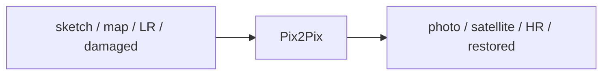

---

## cGAN vs Pix2Pix

Pix2Pix **is** a cGAN, specialized.

| | Conditional GAN | Pix2Pix |
|--|-----------------|---------|
| Scope | **Generic** conditional generation | **Paired** image-to-image only |
| Condition $y$ | labels, **text**, **images**, … | the **input image** of a pair |
| Generator | ordinary net (as in Lec 38) | **U-Net** |
| Discriminator | ordinary net | **PatchGAN** |

When the paper dropped, **visual artists / graphic practitioners** used it widely. Community examples from the paper’s figures: sketch→image, **background removal**, sketch→**Pokémon**, **palette** fill-in, **pose transfer** (“do as I do”), sketch→portrait, photo generation.

---

## Architectural difference (the picture to remember)

Everything in the cGAN cartoon stays, except:

- Generator: **U-Net** (not a generic MLP/CNN).
- Discriminator: **PatchGAN**.

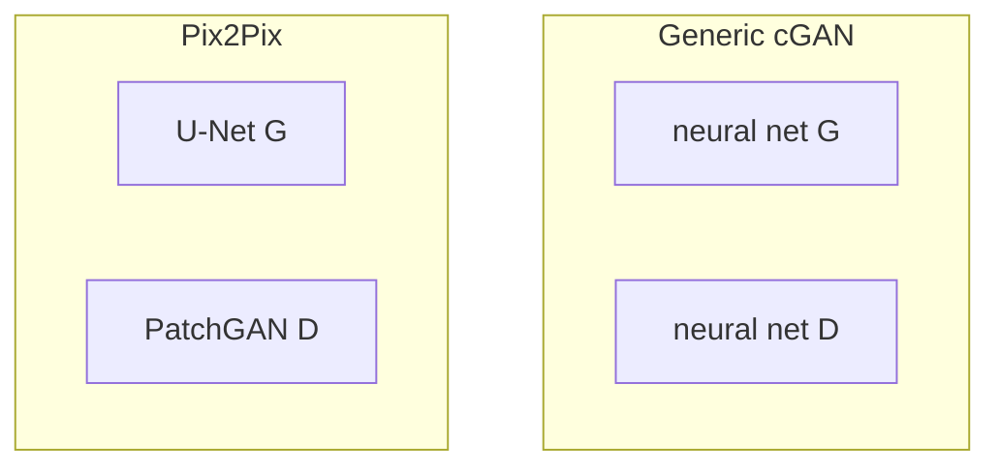

---

## U-Net as generator

You have seen U-Net for **semantic segmentation**. Here it **is** the Pix2Pix generator.

### Encoder (contracting path)

- Blue arrows: **$3\times3$ convolution + ReLU**
- Red arrows: **max pooling** — spatial size **drops** each level
- Extracts **fine details**: edges, lines, sketch structure

### Bottleneck

Most **compressed** code: important information in the smallest map.

### Decoder (expanding path)

**Up-convolutions** reconstruct / **generate** the photo (or painting). The U-Net is trained on **where to put color**, **which color**, **which structure**.

### Skip connections — why not a plain encoder–decoder

During encoding, shrinking spatial size **throws away low-level spatial detail**. U-Net **copy-and-crop** skips send encoder maps to the matching decoder level so those details are **put back**.

Without skips, sketch→photo would **lose fine structure**. That is why Pix2Pix uses U-Net rather than a bare encoder–decoder.

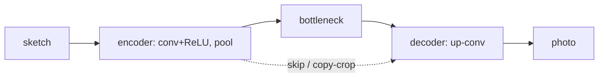

---

## PatchGAN as discriminator

Vanilla / generic cGAN $D$ looks at the **whole** image and says real vs fake.

**PatchGAN** classifies **each $n\times n$ patch** as real or fake.

Example: a **$256\times256$** image is scored **patch by patch**. One patch of the (possibly blurry) fake is compared to the corresponding real region, then the next patch, and so on.

**Final $D$ output = average of all patch decisions.**

### How big should $n$ be? (paper ablations they walked)

| Patch | What they reported |
|-------|--------------------|
| **$1\times1$** | **Color** is right; **spatial statistics** are not (looks unclear) |
| **$16\times16$** | Locally **sharp**, but **tiling artifacts** |
| **$70\times70$** | **Sharp**; some spatial/spectral mistakes remain; **best visual + FCN metric** trade-off |
| **$286\times286$** | Looks **similar** to $70\times70$, but **FCN score drops** |

**Chosen trade-off: $70\times70$ PatchGAN.**

---

## Training cartoon: sketch $A$ → painting $B$

- **Real $A$:** sketch of a scene  
- **Real $B$:** target painting of that scene (paired)

| Network | Inputs |
|---------|--------|
| **U-Net $G$** | real $A$ only → emits **fake $B$** |
| **PatchGAN $D$** | **$(A, B_{\text{real}})$** and **$(A, B_{\text{fake}})$** |

$D$ outputs a real/fake score. **GAN / BCE** losses backprop: $D$ loss into $D$, $G$ loss into $G$. Fake $B$ starts blurrier / lower-res than real $B$ and sharpens over iterations.

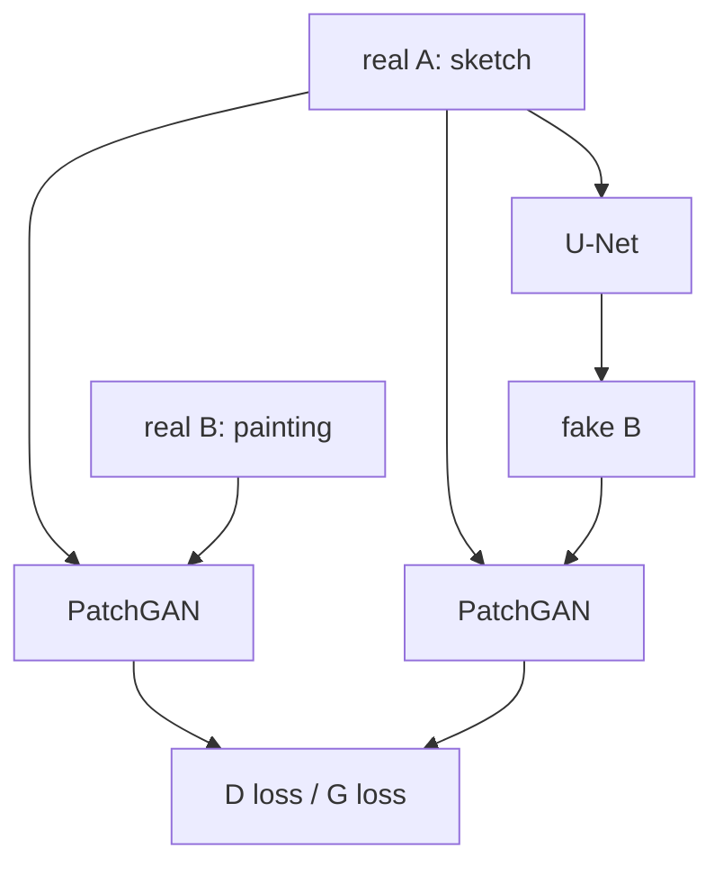

---

## Weight update of the generator

$G$ (U-Net): sketch → fake $B$. Target = real $B$.

### Two pieces

1. **$L_1$ / MAE** between fake $B$ and real $B$, **pixel by pixel**:

$$
L_1(G) = \mathbb{E}_{x,y}\bigl[\,\| y - G(x) \|_1\,\bigr].
$$

($x$ = input image / real $A$; $y$ = real target $B$; $G(x)$ = fake $B$.)

2. Fake $B$ also goes to $D$ (which also sees the target). **Binary cross-entropy** on $D$’s output.

### “All labels are one”

While training $G$, fakes are passed through $D$. $G$ wants $D$ to predict **$1$** (fool $D$). BCE compares $D(\text{fake})$ against **label 1**.

### Combine with $\lambda$

$$
L_G = L_{\text{cGAN}} + \lambda L_1, \qquad \lambda = 100
$$

in the **original paper** — **heavy weight on pixel-wise** match. Sum → **gradient descent** into U-Net weights.

### cGAN / adversarial term as written

$$
L_{\text{cGAN}}(G,D)
= \mathbb{E}_{x,y}\bigl[\log D(x,y)\bigr]
+ \mathbb{E}_{x}\bigl[\log\bigl(1 - D(x, G(x))\bigr)\bigr].
$$

$D(x,y)$: score on the **real pair**. $D(x,G(x))$: score on **input + generated target**. Minimizing $L_1$ pulls **every pixel** of $G(x)$ toward $y$.

### Why not $L_1$ alone or cGAN alone?

Paper figure: **input | ground truth | $L_1$ only | cGAN only | $L_1$ + cGAN**.

- $L_1$ only: not great  
- cGAN only: better  
- **$L_1$ + cGAN:** clearly best  

That is why the **sum** is the generator objective.

---

## Weight update of the discriminator

PatchGAN sees **input $A$** and **target $B$**. $G$ still sees only $A$ and produces fake $B$, which also enters $D$.

| Loss | Meaning | Labels |
|------|---------|--------|
| **Real** | $-\mathbb{E}_{x,y}[\log D(x,y)]$ | sigmoid BCE of **all ones** vs real pairs |
| **Fake / generated** | BCE of **all zeros** vs fake pairs | $D$ should tag $G(x)$ as fake |

$$
L_D = L_{\text{real}} + L_{\text{fake}}.
$$

Gradients update **$D$ only**.

---

## Training details and inference

**Alternation:** one **gradient-descent step on $D$**, freeze $D$, then step on $G$; repeat. While $D$ trains, $G$ is held; while $G$ trains, $D$ is held.

| Knob | Value in the paper / lecture |
|------|------------------------------|
| Optimizer | **Adam** |
| Learning rate | **$0.0002$** |
| $\beta_1$ | **$0.5$** |
| $\beta_2$ | **$0.999$** |
| Inference batch | typically **$1$ to $10$** |

**At inference, $D$ is not used.** $D$ exists only to push $G$ during training. Deployment is the trained **U-Net generator** alone.

Why drop $D$? Its job was to force $G$ until fake $B$ is **indistinguishable** (at patch level) from real $B$. Once weights are learned, you only need $G(A)$.

---

## Putting $G$ and $D$ losses next to each other

| | Generator | Discriminator |
|--|-----------|----------------|
| Sees | real $A$ (sketch) | pairs $(A,B_{\text{real}})$ and $(A,B_{\text{fake}})$ |
| Labels used | **all ones** on fakes (wants to fool $D$) | **ones** on real pairs, **zeros** on fakes |
| Extra term | $\lambda L_1$ vs real $B$, $\lambda=100$ | none |
| Update | Adam on U-Net | Adam on PatchGAN, **then freeze** while $G$ steps |

---

## Objective function

Same $L_{\text{cGAN}}$ as above, plus $\lambda L_1$:

$$
G^*
= \arg\min_G \max_D \;
L_{\text{cGAN}}(G,D) + \lambda L_1(G).
$$

$G$ minimizes; $D$ maximizes; $\lambda$ scales the pixel term.

---

## Summary they closed with

Pix2Pix = **paired** image-to-image **cGAN**. Generic cGAN can condition on labels/text/images; Pix2Pix’s architectural bet is **U-Net $G$ + PatchGAN $D$**. Next session: **CycleGAN**.

### Key takeaways

- Paired translation: sketch↔photo, map↔satellite, LR↔HR, inpainting-style repair.
- U-Net skips restore spatial detail the encoder would drop.
- PatchGAN averages **$n\times n$** real/fake votes; paper’s best patch **$70\times70$**.
- $L_G = L_{\text{cGAN}} + 100\, L_1$; $L_D$ = real ones + fake zeros; alternate Adam $2\times10^{-4}$.
- Inference = generator only.

---


\newpage

# L40: CycleGAN

**Video:** [Lec 40](https://www.youtube.com/watch?v=cIQgQZxat7w) · 36:22  
**Instructor in this lecture:** Prof. Baishali Garai

### Learning objectives

- Explain the **paired-data** bottleneck of Pix2Pix and why **unpaired** translation needs CycleGAN.
- Name the **four networks** $G,F,D_Y,D_X$ on domains $X$ (horse) and $Y$ (zebra).
- State **cycle consistency**: horse→zebra→horse returns the **same** horse (and the backward cycle).
- Write the two **adversarial** losses, **$L_1$ cycle** loss, $\lambda=10$, and the joint minimax objective.

### Agenda (as listed)

Motivation → introduction → architecture → cycle consistency → adversarial + cycle losses → objective.

---

## Motivation: Pix2Pix needs pairs

Pix2Pix (and “traditional” translation GANs in this week) need a **paired** dataset: input **and** the **same-instance** target.

Examples of pairs that are **hard to collect**:

- sketch of **this** bag **and** a photo of **the same** bag  
- daytime photo **and** nighttime photo of **the same** scene  
- a painting **and** a photo of **the same** subject  

Scientists’ question: can we learn $X\to Y$ from **two separate collections**, **without** paired examples? (sketches without matching photos; autumn without matching winter of the same place.)

That question is the motivation for **CycleGAN**.

---

## What CycleGAN does

**Unpaired** image-to-image translation between two domains.

| Forward | Backward (also learned) |
|---------|-------------------------|
| horse **→** zebra | zebra **→** horse |
| winter **→** summer | summer **→** winter |
| photo **→** painting style | painting **→** photo |
| sketch of a bag **→** photo of a bag | (unpaired collections) |

**Source domain** = what you feed in. **Target domain** = the style/class you want.

Paper: **Unpaired Image-to-Image Translation using Cycle-Consistent Adversarial Networks**, **Jun-Yan Zhu** and team, **UC Berkeley / BAIR**. Students are told to read the math in the paper.

---

## Four networks (horse = $X$, zebra = $Y$)

Running example for the whole lecture:

- Domain **$X$**: horses  
- Domain **$Y$**: zebras  

**Two generators, two discriminators.**

| Network | Map / job |
|---------|-----------|
| Generator **$G$** | $X \to Y$ (horse → zebra) |
| Generator **$F$** | $Y \to X$ (zebra → horse) |
| Discriminator **$D_Y$** | real **zebra** vs generated zebra $G(x)$ |
| Discriminator **$D_X$** | real **horse** vs generated horse $F(y)$ |

Notation:

- $G(x)$: $x$ (horse) through $G$ → **generated zebra**  
- $F(y)$: $y$ (zebra) through $F$ → **generated horse**

```mermaid
flowchart LR
    X["domain X: horses"] -->|G| Yhat["G(x) zebras"]
    Y["domain Y: zebras"] -->|F| Xhat["F(y) horses"]
    Yhat --> DY["D_Y: real vs fake zebra"]
    Y --> DY
    Xhat --> DX["D_X: real vs fake horse"]
    X --> DX
```

All four are **learned**.

---

## Cycle consistency (the key idea)

Adversarial training alone can turn **any** horse into **any** zebra. When you map back, you might get a **different** horse. Cycle consistency **forbids** that.

### Forward cycle

$$
x \;\xrightarrow{G}\; G(x) \;\xrightarrow{F}\; F(G(x))
\quad\text{should equal } x.
$$

Horse → zebra → horse: the reconstructed horse must be the **original** horse.

### Backward cycle

$$
y \;\xrightarrow{F}\; F(y) \;\xrightarrow{G}\; G(F(y))
\quad\text{should equal } y.
$$

Zebra → horse → zebra: reconstructed zebra = original zebra.

**What is being enforced:** after any number of translations, **underlying content / structure** of the original image is **preserved**. Appearance (stripes, season, paint style) can change; identity of the scene/object should not wander.

| Allowed to change | Must stay |
|-------------------|-----------|
| Horse coat → zebra stripes (domain $Y$ look) | Same animal, pose, layout |
| Summer light → winter snow | Same place / camera framing |
| Photo pigments → Van Gogh brushwork | Same scene content |

If cycle consistency is **off**, $G$ can emit **any** plausible zebra and $F$ can emit **any** plausible horse. The two adversarial discriminators would still be happy (both images “look real”). The cycle term is the only piece that **ties** $G(x)$ to **that** $x$.

```mermaid
flowchart TB
    subgraph fwd [Forward cycle]
      H1[horse x] --> G1[G]
      G1 --> Z1["zebra G(x)"]
      Z1 --> F1[F]
      F1 --> H1r["F(G(x)) ≈ x"]
    end
    subgraph bwd [Backward cycle]
      Z2[zebra y] --> F2[F]
      F2 --> H2["horse F(y)"]
      H2 --> G2[G]
      G2 --> Z2r["G(F(y)) ≈ y"]
    end
```

---

## Numbering the four networks (as in the loss lecture)

Keep this order in your head when reading the equations:

1. **$G$** — horse → zebra  
2. **$D_Y$** — is this zebra real or $G(x)$?  
3. **$F$** — zebra → horse  
4. **$D_X$** — is this horse real or $F(y)$?  

Losses must cover **all four**.

---

## Two kinds of loss

Four networks $\Rightarrow$ the total loss must cover all of them.

| Loss | What it checks |
|------|----------------|
| **Adversarial** | Does this zebra/horse look **real** vs generated? |
| **Cycle consistency** | Does horse→zebra→horse (and the reverse) **match the original**? |

Adversarial loss itself splits in two, because there are two GAN games:

1. **$G$ and $D_Y$** (horse→zebra game)  
2. **$F$ and $D_X$** (zebra→horse game)

---

## Adversarial loss 1: $G$ and $D_Y$

$$
\mathcal{L}_{\text{GAN}}(G, D_Y, X, Y)
= \mathbb{E}_{y \sim p_{\text{data}}(y)}\bigl[\log D_Y(y)\bigr]
+ \mathbb{E}_{x \sim p_{\text{data}}(x)}\bigl[\log\bigl(1 - D_Y(G(x))\bigr)\bigr].
$$

| Term | Trains $D_Y$ to… |
|------|------------------|
| First | classify **real zebras** as real ($D_Y(y)\to 1$) |
| Second | classify **generated zebras** $G(x)$ as fake ($D_Y(G(x))\to 0$) |

$G$ wants $D_Y(G(x))\to 1$ (fool $D_Y$). So **$G$ minimizes** this loss, **$D_Y$ maximizes** it.

---

## Adversarial loss 2: $F$ and $D_X$

$$
\mathcal{L}_{\text{GAN}}(F, D_X, Y, X)
= \mathbb{E}_{x \sim p_{\text{data}}(x)}\bigl[\log D_X(x)\bigr]
+ \mathbb{E}_{y \sim p_{\text{data}}(y)}\bigl[\log\bigl(1 - D_X(F(y))\bigr)\bigr].
$$

| Term | Trains $D_X$ to… |
|------|------------------|
| First | real **horses** as real |
| Second | generated horses $F(y)$ as fake |

Desired: $D_X(\text{fake horse})\to 0$. Generator $F$ wants $D_X(F(y))\to 1$.

**Limit of adversarial losses:** they make outputs **look realistic**. They do **not** force the output to **correspond to that input**. That is why cycle loss exists.

---

## Cycle consistency loss ($L_1$)

$$
\mathcal{L}_{\text{cyc}}(G,F)
= \mathbb{E}_{x}\bigl[\,\| F(G(x)) - x \|_1\,\bigr]
+ \mathbb{E}_{y}\bigl[\,\| G(F(y)) - y \|_1\,\bigr].
$$

| Term | Name in lecture | Compares |
|------|-----------------|----------|
| $\|F(G(x))-x\|_1$ | **Forward cycle** | original horse vs reconstructed horse |
| $\|G(F(y))-y\|_1$ | **Backward cycle** | original zebra vs reconstructed zebra |

Walk-through of $F(G(x))$: $x$ (horse) $\xrightarrow{G}$ zebra $\xrightarrow{F}$ horse.  
Walk-through of $G(F(y))$: $y$ (zebra) $\xrightarrow{F}$ horse $\xrightarrow{G}$ zebra.

**Minimize both** absolute errors.

---

## Full loss and objective

$$
\mathcal{L}
= \mathcal{L}_{\text{GAN}}(G,D_Y,X,Y)
+ \mathcal{L}_{\text{GAN}}(F,D_X,Y,X)
+ \lambda\,\mathcal{L}_{\text{cyc}}(G,F).
$$

**$\lambda = 10$** in the original paper (weight on cycle consistency).

$$
G^*, F^*
= \arg\min_{G,F} \max_{D_X, D_Y} \mathcal{L}.
$$

| Who | Goal |
|-----|------|
| $G,F$ | **Minimize** $\mathcal{L}$: fool the $D$s **and** keep cycle consistency |
| $D_X,D_Y$ | **Maximize**: correctly classify real vs generated |

---

## Qualitative results they showed (from the paper)

- Horse $\leftrightarrow$ zebra, many poses  
- Winter $\leftrightarrow$ summer  
- Orange $\leftrightarrow$ apple  
- Photos $\leftrightarrow$ **Van Gogh** and other painting styles  

Because of cycle consistency **plus** the two adversarial games, translations look **realistic** and **keep structure** through multiple trips around the cycle.

---

## Closing recap (as taught)

Pix2Pix needed **expensive / rare pairs**. CycleGAN answers “can we translate **without** pairs?” with **two generators, two discriminators**, and a cycle that says **$F(G(x))\approx x$** (and $G(F(y))\approx y$). Adversarial terms = realism; cycle $L_1$ = correspondence; $\lambda=10$. Next: **StyleGAN**. Read the paper for extra algebra.

### Key takeaways

- Unpaired $X\leftrightarrow Y$: no matched sketch/photo required.
- $G:X\to Y$, $F:Y\to X$, $D_Y$ judges $Y$, $D_X$ judges $X$.
- Cycle consistency: reconstruct the **same** horse/zebra, not a random other one.
- $\mathcal{L} = \mathcal{L}_{\text{GAN}}(G,D_Y) + \mathcal{L}_{\text{GAN}}(F,D_X) + 10\,\mathcal{L}_{\text{cyc}}$.
- $G,F$ min; $D_X,D_Y$ max.

---


\newpage

# L41: StyleGAN

**Video:** [Lec 41](https://www.youtube.com/watch?v=qNgUfe1oe7Q) · 38:41  
**Instructor in this lecture:** Prof. Baishali Garai

### Learning objectives

- Name the **fine-control** failures of a vanilla $G(z)$ (hair color, smile, glasses) and define **latent-space entanglement**.
- Draw StyleGAN’s pipeline: $z \xrightarrow{F} w$ (**8-layer MLP**), **affine** style $y=Aw+b$, **synthesis** from a **$4\times4\times512$** constant.
- Write **AdaIN**: normalize feature maps, then restyle with $(y_s, y_b)$.
- Place **18 convolutions**, resolution-dependent attributes, and **noise injection** (scale $B$).

### Agenda (as listed)

Limitations of traditional GAN / motivation → latent-space entanglement → StyleGAN intro → mapping network → affine transform → synthesis network → AdaIN → the style-based generator as a whole.

**What this lecture is not:** StyleGAN **2** is the **next** video.

---

## Limitation of traditional $G(z)$

Vanilla generator: sample $z$ from $\mathcal{N}(0,1)$, push through $G$, get an image (example: a **butterfly**). $G(z)$ has no knob for **one attribute at a time**.

Questions the lecture cannot answer with a standard GAN:

| You want | Can you change only that? |
|----------|---------------------------|
| Butterfly **wing color**, keep pose | **No** |
| Face hair **brown → blonde** | No mapped latent coordinate |
| **Remove a smile** | No |
| **Add glasses** | No |

Demo faces from **thispersondoesnotexist.com** (spoken “thispersonexist.com”).

**Motivation:** researchers wanted **independent control** of attributes (hair color, smile, glasses). Traditional GANs do not give it.

```mermaid
flowchart LR
    Z["z ~ N(0,1)"] --> G[vanilla G]
    G --> IMG[image]
```

There is no “this coordinate of $z$ = hair only.”

---

## Latent-space entanglement

**Definition as taught:** **one latent variable affects multiple image attributes at once.**

Trying to move brown hair → blonde may also change **face shape**. Blonde → black may **add freckles**. Changing **one dimension** moves **several semantic attributes**. You cannot edit attributes **independently**.

### Why the space is entangled

Textbook line they unpack: the input latent space must follow the **probability density of the training data**, which **forces** entanglements.

Face-dataset cartoon:

- In **this** collection, **short hair** co-occurs with **male** faces; **long hair** with **female** faces.
- $G$ is trained on that joint. Hair **length** becomes correlated with eyes/nose/lips.
- The latent space **curves**. $G$ **avoids unlikely combinations** (short-haired women, long-haired men) if those are rare in the set.
- If the set had **balanced** long/short hair on all genders, this particular entanglement would not appear.

**Entanglement = correlations in $p_{\text{data}}$ copied into $z$.** That is the problem StyleGAN is built to loosen.

---

## StyleGAN vs traditional GAN (high-level)

| Traditional GAN | StyleGAN |
|-----------------|----------|
| $z$ goes **straight** into $G$ | $z$ goes through a **mapping network** $F$ first |
| Image synthesis starts from $z$ | Synthesis starts from a **learned constant** tensor |
| Attributes mixed in $z$ | Intermediate space $w$ is for **styles**; attributes vary **more independently** |

Paper: **A Style-Based Generator Architecture for Generative Adversarial Networks**, **Tero Karras** et al., **NVIDIA**.

Pipeline:

$$
z \;\xrightarrow{\text{mapping } F}\; w \;\xrightarrow{\text{synthesis / generator}}\; \text{image}.
$$

$w$ is an **intermediate latent space** that **carries style**.

```mermaid
flowchart LR
    Z["z entangled"] --> F["mapping F
8× FC / MLP"]
    F --> W["w disentangled styles"]
    W --> A["affine y = Aw + b"]
    C["learned 4×4×512"] --> SYN[synthesis / convs]
    A --> SYN
    SYN --> IMG[image]
```

---

## Mapping network and $w$

- $z$ still $\sim\mathcal{N}(0,1)$.
- Typical dimension: **$512$**. Compressed recipe for the image.
- $F$: **eight fully connected / MLP layers**, width **$512$**.
- $z$ is **normalized**, then passed through those eight layers → $w\in\mathbb{R}^{512}$.

**Job of $F$:** map **entangled** $z$ to a **more disentangled** $w$. In $w$, **one direction** can control pose, another hairstyle, another smile, another eyeglasses.

Traditional $G$ **begins** image creation from $z$. StyleGAN does **two** extra things before pixels:

1. $z\to w$ via $F$.
2. Synthesis **does not start from $z$**. It starts from a **fixed learned tensor** of shape **$4\times4\times512$** (the $512$ matches latent width). Initialized to constants; **updated by backprop** (learned, not a random $z$).

---

## Clay-block analogy (why a constant start still yields different faces)

Sculptor, **day 1:** same clay block → a horse.  
**Day 2:** the **same** starting block → a horse in a **different style**.

The **$4\times4\times512$** tensor is the clay. **Style is not in the clay**; it is **injected later** by:

- **AdaIN** (adaptive instance normalization; spoken “ADA IN” / “add-in”)
- **Noise injection** for fine **stochastic** differences between images

Affine transforms + AdaIN + convolutions are the sculpting tools.

---

## Affine transform: $w$ → style parameters $y$

An **affine** map (ASR: “a fine transformation”) is

$$
y = Wx + b
$$

in general. In StyleGAN, after $z\mapsto w$,

$$
y = A w + b.
$$

The resulting **$y$ are style parameters**. They are **injected at every layer** through an **AdaIN** block.

Clay = $4\times4\times512$. Styles = sculpting **instructions** applied along the pipeline.

---

## Two paths, 18 convolutions

StyleGAN generator = **mapping path** + **synthesis path**.

| Path | Role |
|------|------|
| Mapping | $z\to w$, **disentangled** styles |
| Synthesis | **image generation**, starting at **$4\times4\times512$** (trainable constant) |

They meet through **convolutions**. Lecture count: **18 convolution layers**.

At **each** conv layer, an affine map produces a $y$ that AdaIN injects.

Flow inside synthesis:

1. Constant $4\times4\times512$  
2. Convolution → **feature maps** (edges, textures, face structure, hair, …)  
3. **AdaIN** on those maps  
4. After **every two** convolutions: **upsample** (resolution doubles)

### Coarse / middle / fine (what each resolution learns)

| Conv layers | Resolution | Attributes |
|-------------|------------|------------|
| 1–2, 3–4, 5–6 | $4\times4$, $8\times8$, $16\times16$ | **Coarse:** pose, face **shape**, edges |
| 7–12 | $32$, $64$, $128$ | **Mid:** eyes, nose, **hairstyle** |
| 13–18 | $256$, $512$, **$1024\times1024$** | **Fine:** pores, wrinkles, skin **texture** |

```mermaid
flowchart TB
    C["const 4×4×512"] --> L12["conv 1–2 · 4×4
pose / shape"]
    L12 --> U1[upsample]
    U1 --> L34["… 8×8, 16×16"]
    L34 --> MID["conv 7–12 · 32–128
eyes, nose, hair"]
    MID --> HI["conv 13–18 · 256–1024
pores, wrinkles"]
```

Low, mid, and high layers together cover **coarse geometry and fine texture**.

---

## AdaIN

Feature maps from conv enter AdaIN.

### Step 1 — normalize (erase old style)

Per channel, compute mean $\mu$ and standard deviation $\sigma$ of the map (standard formulas; they invited you to check arithmetic on the slide). Then

$$
\hat{x}_i = \frac{x_i - \mu}{\sigma}.
$$

After this: **zero mean, unit variance**. **Old style statistics are wiped**; **structure** remains. Each **channel is normalized independently**.

### Step 2 — inject new style

Affine $y=Aw+b$ splits into **scale** $y_s$ and **bias** $y_b$ (learned). For layer $i$:

$$
\text{AdaIN}(x_i, y) = y_s \cdot \frac{x_i - \mu(x_i)}{\sigma(x_i)} + y_b.
$$

**Numerical example:** $y_s=2$, $y_b=1$ $\Rightarrow$ $2\hat{x}+1$. That scaled-and-shifted map **is** the styled feature map.

AdaIN therefore:

1. **Normalizes** (removes previous style stats).  
2. **Applies** $y_s,y_b$ from the affine head.

---

## Traditional generator vs style-based generator (paper figure)

They put the **original paper’s** two cartoons side by side and asked students to read the paper for more algebra.

| Traditional (left) | Style-based (right) |
|--------------------|---------------------|
| $z$ into fully connected layers, then the image stack | $z$ into **mapping** (8-layer MLP) → $w$ |
| No separate style path | $w$ → affine **A** at **every** synthesis layer |
| Starts from $z$ | Starts from **constant** $4\times4\times512$ |
| No AdaIN | Conv → AdaIN (styles) at each scale |
| No explicit stochastic input after $z$ | **Noise** + learned **$B$** on feature channels |

That figure is the whole architecture in one glance.

---

## Noise injection (on the paper figure)

The original-paper diagram of the **style-based generator** (vs a traditional $z\to$ FC $\to$ image stack):

- $z$ → **8-layer MLP** → $w$  
- $w$ → affine **A** at each synthesis layer → AdaIN  
- Synthesis from **constant $4\times4\times512$** through convs  
- Extra: **noise** added in the synthesis stream  

**Noise** = **stochastic variation** of **very fine** details so two generated faces are not identical down to every pore.

**$B$:** a **learned per-channel scale** — how strongly that noise is allowed to move each feature channel.

---

## End-to-end recap (their summary)

1. Vanilla GANs cannot independently edit face attributes.  
2. **Entangled** $z$ $\xrightarrow{\text{8-layer mapping}}$ **disentangled** $w$.  
3. Affine $y=Aw+b$ produces **style parameters** $(y_s,y_b)$.  
4. Synthesis starts from a **learned $4\times4\times512$**, not from $z$.  
5. AdaIN **strips** then **restyles** conv feature maps at each layer.  
6. Resolution grows $4\to1024$; coarse/mid/fine attributes split across layers; noise+$B$ adds stochastic detail.

Next session: **StyleGAN 2**.

### Key takeaways

- Entanglement: one $z$-coordinate moves many attributes because $G$ copies correlations in $p_{\text{data}}$.
- StyleGAN inserts mapping $F$ ($8\times$ FC, $512$-D) so $w$ can be traversed **per style**.
- Images grow from a **constant** $4\times4\times512$ plus **AdaIN** styles, not from feeding $z$ into the first conv.
- AdaIN: $\hat{x}=(x-\mu)/\sigma$, then $y_s\hat{x}+y_b$.
- 18 convs, upsample every two layers; noise scaled by $B$ for fine stochasticity.

---


\newpage

# L42: StyleGAN 2

**Video:** [Lec 42](https://www.youtube.com/watch?v=FXGAP5h7414) · 46:13  
**Instructor in this lecture:** Prof. Baishali Garai

### Learning objectives

- Name the two characteristic **StyleGAN** artifacts (water-droplet blobs and phase / alignment artifacts) and where they first show up in the synthesis pyramid.
- Explain how **AdaIN** lets the generator spike a pixel so that instance-normalization statistics become a blob.
- Write the **weight modulation** and **demodulation** formulas that replace AdaIN.
- State the three architectural changes that remove progressive growing: a **fixed** generator, **skip** `toRGB` paths, and a **residual** discriminator.

### Agenda (as stated)

1. Limitations of StyleGAN  
2. Origin of water-droplet artifacts  
3. Architectural changes in StyleGAN 2: weight modulation and demodulation  
4. Origin of phase artifacts  
5. Fixes: fixed architecture, skip connections in the generator, residual connections in the discriminator  

StyleGAN 2 is the paper *Analyzing and Improving the Image Quality of StyleGAN* from the same group (Karras and co-authors). StyleGAN already produced high-resolution, style-controllable faces. StyleGAN 2 exists because those images (and especially their **feature maps**) still carried **structural** artifacts.

---

## Recap of StyleGAN 1 (needed to see what changed)

```mermaid
flowchart LR
    Z["z entangled latent"] --> MAP["mapping network"]
    MAP --> W["w disentangled"]
    W --> AFF["learned affine: scale y_s, shift y_b"]
    C["learned 4×4×512 constant"] --> SYN["synthesis blocks 4→8→…→1024"]
    AFF --> ADAIN["AdaIN: normalize, then modulate"]
    ADAIN --> SYN
    N["per-layer noise"] --> SYN
    SYN --> IMG["RGB image"]
```

- Input $z$ is **entangled**. The mapping network sends it to a **disentangled** $w$.
- A learned **affine** layer turns $w$ into style parameters: a **scale** $y_s$ and a **shift** $y_b$.
- Synthesis does **not** start from $z$. It starts from a learned constant tensor of size **$4 \times 4 \times 512$**.
- **AdaIN** (the lecture’s “AdaIN / add-in”) has two steps: **normalize** each feature-map channel (mean and variance), then **modulate** with $y_s$ and $y_b$:

$$
\hat{x}_{i} = \frac{x_i - \mu(x_i)}{\sigma(x_i)}, \qquad \mathrm{AdaIN}(x_i, y) = y_{s,i}\,\hat{x}_i + y_{b,i}.
$$
- Resolution **grows progressively**: $4\times4$, $8\times8$, … up to $1024\times1024$.
- **Noise injection** at each block supplies stochastic variation (two samples are not pixel-identical).

---

## Two artifacts the paper showed on generated faces

The lecture’s slides are from the StyleGAN 2 paper: a face (and its feature map) with a **water-droplet / blob** sitting on the map, and a second family of **phase** glitches. Researchers treated these as a **consistent architectural** problem, not random noise.

| Artifact | What you see | First visible at |
|----------|----------------|------------------|
| **Water droplet** | Blob-like spots on feature maps (and sometimes on the image) | From **$64\times64$**, then **stronger** through $1024\times1024$ |
| **Phase / alignment** | Features stay locked to the **camera center** while the face turns | Same growing pyramid |

StyleGAN 2’s job is to **remove both**.

---

## Water-droplet artifacts: AdaIN vs. signal statistics

AdaIN injects style at every layer. It first **normalizes the mean and variance of each channel**. The lecture’s point: those two numbers are not nuisances. **Per-channel mean and variance carry semantic / style information.** Before AdaIN they are meaningful; AdaIN is designed to **wipe that style** so a new style can be written in.

The generator’s only job is to **fool the discriminator**. Once AdaIN resets statistics, the generator learns to **exploit the normalizer**:

1. Spike **one pixel** (or a tiny region) to an enormous value.  
2. Instance normalization’s mean and variance are then **dominated by that spike**.  
3. The spike reads out as a **blob / water droplet** on the map.

**Classroom analogy:** if every student scores $0$–$100$ and one student is given $10{,}000$, the class mean and variance are controlled by the outlier. The lecture’s toy vector: values like $0,1,2,7$ vs. $0,100,2,7$ — the $100$ owns the statistics.

So the origin of the droplet is **not** “too little capacity.” It is **AdaIN normalization** plus a generator that **hacks those statistics**.

### Fix: drop AdaIN; modulate **convolution weights** instead

StyleGAN 2 **removes AdaIN completely**. Styles no longer rewrite feature maps. They rewrite the **conv kernel**.

**Modulation** (style scale $s_i$ for input channel $i$):

$$
w'_{ijk} = s_i\, w_{ijk}
$$

| Index | Meaning |
|-------|---------|
| $i$ | input channel |
| $j$ | output channel |
| $k$ | spatial location inside the filter |
| $w_{ijk}$ | original conv weight |
| $w'_{ijk}$ | modulated weight |
| $s_i$ | style scale from the affine layer |

After multiplying by $s_i$, some channels become **huge** → training **instability**. **Demodulation** renormalizes the kernel magnitude:

$$
w''_{ijk} = \frac{w'_{ijk}}{\sqrt{\displaystyle\sum_{i,k} (w'_{ijk})^2 + \varepsilon}}
$$

| Piece | Why it is there (as taught) |
|-------|-----------------------------|
| $w'_{ijk}$ | already-modulated weight |
| $\sum_{i,k}$ | sum over **input channels** and **kernel positions** |
| $(\cdot)^2$ | so **positive and negative** weights cannot cancel |
| $\sqrt{\cdot}$ | restore **normalized energy** to the original scale |
| $\varepsilon$ | tiny constant so the denominator is never zero |

The lecture does **not** derive this from first principles; it asks you to know **what each term is for**.

### Modulation–demodulation pipeline

```mermaid
flowchart TB
    Z["z"] --> MAP["mapping network"]
    MAP --> W["style vector w"]
    W --> AFF["affine → scale s"]
    AFF --> MOD["weight modulation w' = s · w"]
    MOD --> CONV["convolution with w'"]
    CONV --> DEM["weight demodulation"]
    DEM --> NOI["noise injection"]
    NOI --> FM["feature map"]
```

After this change, the paper’s feature maps (face, car, horse-and-rider) **no longer show droplets**.

---

## Phase artifacts: teeth that will not turn

**Phase**, in the lecture’s signal-processing language, means **spatial alignment / positional consistency**. A phase artifact is a **positional** glitch.

Demo: a face looking at the camera — teeth centered. The head rotates, but the **center of the teeth stays glued to the camera center**, then **jumps**. Eyes and nose should rotate with the head; they do not. That lock-then-jump is the phase artifact.

### Origin: progressive growing

StyleGAN trains $4\times4$ first, then **inserts** $8\times8$, $16\times16$, … up to $1024\times1024$. Early, low-resolution blocks **temporarily act as the final output**. A $4\times4$ or $8\times8$ map **cannot** represent fine spatial detail, but the loss still asks for a realistic image. Features become **position-dependent** too early. Those high-frequency details are **location-sensitive**, so later upsampling **accumulates misalignment**.

### Low frequency vs. high frequency (leaf example)

| Region | Pixel neighbors | One-pixel shift |
|--------|-----------------|-----------------|
| **Low frequency** (leaf interior) | similar color | almost invisible |
| **High frequency** (leaf edge vs. background) | sharp jump | **distorts the silhouette** |

Phase problems are a **high-frequency** problem. The lecture notes that blobs already appear at **$64\times64$** — the first scale where those edges are forced.

### Upsampling makes the edge location ambiguous

Start with two pixels, values $0$ and $1$ (black | white). The edge sits **exactly in the middle**. Upsample to four pixels, e.g. $0,\;0.3,\;0.6,\;1$. The middle is a **gray ramp**. Where is the edge now? Several gray bins are plausible. Each extra upsample **shifts** that guess. By $1024\times1024$ the shift can be large. High-frequency structure (teeth, eyelids) is exactly what that accumulated shift wrecks.

---

## Three changes that replace progressive growing

The researchers **remove progressive growing**. Three replacements:

1. **Keep the architecture fixed** from iteration one: $4\times4$ through $1024\times1024$ are all present. No new block is **inserted** mid-training (StyleGAN 1’s stage-1 / stage-2 / stage-3 story).  
2. **Skip connections in the generator.**  
3. **Residual connections in the discriminator.**

### Skip connections in the generator (`toRGB` at every scale)

**Without skips (StyleGAN 1):** $4\times4 \to 8\times8 \to \cdots \to 1024\times1024 \to$ one RGB. The $4\times4$ map must wait until the last layer to affect pixels. Spatial shifts **accumulate** along that path.

**With skips (StyleGAN 2):** each resolution produces a **partial RGB**. $4\times4$, $8\times8$, $16\times16$, … all contribute. **Multiscale RGB outputs are combined** into the final image. Early layers **directly** influence the photograph, so alignment information is not forced through every upsample.

Side effects named in the lecture: **better gradient flow** and **more stable training**, which also fights phase shift.

```mermaid
flowchart TB
    F4["4×4 features"] --> U8["8×8"]
    F4 --> R4["toRGB 4×4"]
    U8 --> U16["16×16"]
    U8 --> R8["toRGB 8×8"]
    U16 --> U1024["… → 1024×1024"]
    U16 --> R16["toRGB 16×16"]
    U1024 --> R1024["toRGB 1024"]
    R4 --> SUM["combine RGB"]
    R8 --> SUM
    R16 --> SUM
    R1024 --> SUM
    SUM --> OUT["final image"]
```

### Residual connections in the discriminator

Phase shift is **spatial misalignment / texture drift / features glued to pixel indices**. After progressive growing is gone, the discriminator sees a **full $1024\times1024$ image from the first iteration**. That forces a **deep** net (many downsample stages $1024 \to \cdots \to 4$) from day one.

| StyleGAN 1 discriminator | StyleGAN 2 discriminator |
|--------------------------|--------------------------|
| Early stages see **tiny** images → a **shallow** net is enough | Always sees **$1024\times1024$** |
| Later stages deepen as resolution grows | Deep from the start → vanishing gradients, unstable optimization, memory cost |

**Downsampling** is required so the discriminator is not doing dense $1024$ work at every layer, but depth remains. **Residual connections** address that:

$$
y = F(x) + x
$$

Do not destroy information that is already in $x$. Add the **learned refinement** $F(x)$ to the original. Alignment cues in the high-resolution input can **skip** the long conv stack instead of being warped by repeated convolution.

**Pairing:** generator uses **skips**; discriminator uses **residuals**. Together with a **fixed** topology, phase artifacts go away.

---

## StyleGAN 1 vs. StyleGAN 2 (cheat sheet)

| Piece | StyleGAN 1 | StyleGAN 2 |
|-------|------------|------------|
| Style injection | **AdaIN** on feature maps (normalize, then scale/shift) | **Weight modulation + demodulation** |
| Water droplets | Generator spikes a pixel to own AdaIN stats | AdaIN removed |
| Growing | Progressive: insert $4\to8\to\cdots\to1024$ | **Fixed** full stack from the start |
| Generator extras | Single final RGB | **Skip / toRGB** at every scale, then combine |
| Discriminator extras | Grows with resolution | Full-res input + **residual** blocks |
| Noise | Per-layer injection (kept) | Per-layer injection (kept) |
| Mapping $z\to w$ | Kept | Kept |

**What this lecture is not:** a re-derivation of StyleGAN 1’s mapping network (that is the previous video), and not a diffusion lecture (the instructor flags diffusion as the **next theory** topic). The following video in the playlist is a **CycleGAN lab**.

### Key takeaways

- StyleGAN 2 exists to kill two **structural** artifacts: **water droplets** (AdaIN statistics) and **phase / alignment** (progressive growing + high-frequency upsampling).
- Droplets: replace AdaIN with $w'_{ijk}=s_i w_{ijk}$ and demodulate by the RMS of the modulated kernel plus $\varepsilon$.
- Phase: freeze the pyramid, let every scale skip to RGB, give the discriminator residual paths so a deep full-res critic still preserves alignment.
- Noise injection for stochastic variation is unchanged.

---


\newpage

# L43: Practical exercise 1 — CycleGAN (advanced GAN lab)

**Video:** [Lec 43](https://www.youtube.com/watch?v=tZg9-lZnGBs) · 50:54

### Learning objectives

- Contrast a **vanilla GAN** (one $G$, one $D$) with **CycleGAN** (two generators, two discriminators, three loss families).
- Rebuild the **PyTorch** lab: STL-10 **horse ↔ deer**, unpaired pairing, encoder–decoder $G$, conv $D$, Adam, MSE + L1.
- Read the printed metrics (parameter counts, per-epoch losses, the six-panel grid) and the reason the checkpoints are saved.

**What this lab is not:** it is **not** a StyleGAN 2 training session. Lec 42 was StyleGAN 2 theory; Lec 40 was CycleGAN theory (horse↔zebra). This hands-on implements **CycleGAN** on STL-10 **horse↔deer** as the advanced / unpaired image-to-image GAN.

---

## Why CycleGAN needs more than one $G$ and one $D$

A traditional GAN: one generator makes fakes from a domain; one discriminator says real vs fake. Losses: generator loss and discriminator loss.

CycleGAN is **unpaired image-to-image translation**. Domain **A** and domain **B** are separate collections (no aligned pairs). During training:

- Only **A** images go into generator 1; it must emit **B-like** fakes.  
- Only **B** images go into generator 2; it must emit **A-like** fakes.  
- Those fakes are scored by **two** discriminators.

```mermaid
flowchart LR
    A["domain A: horses"] --> GAB["G_AB"]
    GAB --> FB["fake deer"]
    FB --> DB["D_B real vs fake deer"]
    B["domain B: deer"] --> GBA["G_BA"]
    GBA --> FA["fake horses"]
    FA --> DA["D_A real vs fake horses"]
    FB --> GBA2["G_BA cycle"]
    GBA2 --> RA["reconstructed horse"]
    FA --> GAB2["G_AB cycle"]
    GAB2 --> RB["reconstructed deer"]
```

**Naming used in the notebook**

| Model | Input | Output |
|-------|--------|--------|
| **$G_{AB}$** | real horse (A) | fake deer |
| **$G_{BA}$** | real deer (B) | fake horse |
| **$D_A$** | horse-shaped images | real horse vs fake horse |
| **$D_B$** | deer-shaped images | real deer vs fake deer |

**Three loss families** (all used together as “the CycleGAN loss”):

| Loss | Role |
|------|------|
| **Adversarial** (MSE in this lab) | $G$ fools $D$; $D$ separates real/fake |
| **Cycle-consistency** (L1) | horse → fake deer → back to horse (and the other way) should reconstruct |
| **Identity** (L1) | $G_{AB}(\text{deer})\approx\text{deer}$, $G_{BA}(\text{horse})\approx\text{horse}$ — stay close when the input is already in the target domain |

Cycle A→B→A (and B→A→B) is why it is called **cycle** GAN. The lecture also frames the four directed adversarial terms as part of that cycle.

---

## Lab setup: PyTorch, not TensorFlow / Keras

Previous course labs used **TensorFlow / Keras**. This one switches to **PyTorch** (Meta / Facebook) so you can compare implementation style and CPU vs GPU timing.

### Imports (as spoken)

| Import | Why |
|--------|-----|
| `torch` | framework |
| `torch.nn` as `nn` | layers / `Module` |
| `torch.optim` as `optim` | Adam |
| `torchvision.datasets`, `transforms` | STL-10 + preprocessing |
| `torchvision.utils.make_grid` | many images in one figure |
| `torch.utils.data`: `DataLoader`, `Dataset`, `Subset` | loading, pairing, 400-image subsets |
| `matplotlib.pyplot` as `plt` | plots |
| `random`, `os` | pairing / paths; check the runtime |

**Device:** `torch.device` — use GPU if present, else CPU, so the notebook does not die on a machine without CUDA. The talk mentions T4, and (for a real deployment) RTX / Blackwell-class GPUs with `DataLoader` workers.

---

## Step 1 — Hyperparameters

| Knob | Value | Reason given |
|------|-------|----------------|
| Epochs | **20** | keep compute down |
| Learning rate | **very small** (Adam later uses $\eta = 10^{-5}$) | unpaired A↔B is easy to **converge too fast** into obviously fake images |
| Batch size | **4** | four images at a time |

---

## Step 2 — Dataset: STL-10, two classes only

**STL-10** is a 10-class animal / object benchmark. CycleGAN needs **two domains**, so:

| Domain | Class index | Content | Count used |
|--------|-------------|---------|------------|
| **A** | **6** | **horse** | **400** (`0…399`) |
| **B** | **4** | **deer** | **400** |

The full set is $>$10k images; 400+400 is a compute cut. `Subset` + `enumerate` keeps indices whose label is 6 or 4.

### `transforms.Compose` (four ops, in order)

1. **Resize** $256\times256 \to 96\times96$ (compress).  
2. **Crop** to $96\times96$.  
3. **`ToTensor`**: PyTorch wants **channel-first** $(C,H,W)$, not $(H,W,C)$. Color: $C=3$.  
4. **Normalize** each RGB channel with mean $0.5$ and std $0.5$, i.e.

$$
x_{\text{norm}} = \frac{x - 0.5}{0.5}
$$

so pixels land in **$[-1,1]$**, matching a final **tanh**. The same $(0.5, 0.5)$ is repeated **three times** (R, G, B).

Worked micro-example from the lecture: a $3\times3$ patch with values in $0$–$255$ is resized conceptually to $96\times96\times3$, then laid out as a $3\times96\times96$ tensor. A value $10$ becomes $(10-0.5)/0.5$ on every channel that holds it.

Download STL-10 with `download=True`; print a message or raise if it fails. Print `len(domain A)` and `len(domain B)` — both **400**.

---

## Step 3 — Unpaired random pairing

Horse has label 6, deer has label 4: there is **no** aligned pair. A custom `Dataset`:

- Store both domain lists.  
- `__len__` = $\max(|A|,|B|)$.  
- `__getitem__`: take image $A[i]$, pick a **random** index into $B$, return $(a, b)$.  
- **Drop labels** (`_`) — discriminators must guess real/fake (and implicitly which domain), not read the class id.

Wrap in a `DataLoader`:

| Arg | Value | Why |
|-----|-------|-----|
| `batch_size` | 4 | not 64; matches the hyperparameter |
| `shuffle` | **True** | avoid “memory mapping” (a unit always seeing the same A/B pairing) |
| `num_workers` | **2** | even multiple of the batch size 4 |

**Batches per epoch:** $400 / 4 =$ **100**. Print that.

---

## Step 4 — Generator: encoder → residual/transform → decoder

`class Generator(nn.Module)`. Compress, transform, decompress (reconstruction), **tanh** at the end.

### Encoder (low-level → mid-level → high-level filtering)

| Stage | Conv | BN | Activation | Notes |
|-------|------|----|------------|--------|
| 1 | in **3**, out **64**, kernel **7**, padding **3** | 64 | **ReLU** | $\mathrm{ReLU}(x)=\max(0,x)$ so pixels stay non-negative in the hidden maps |
| 2 | 64 → **128**, kernel **3**, stride **2**, padding **1** | 128 | ReLU | stride 2 skips a window |
| 3 | 128 → **256**, kernel **3**, stride **2**, padding **1** | 256 | ReLU | deeper features |

Padding keeps **edge** information. Stride **1 vs 2** is described as **trial-and-error**, not a theorem: larger stride if you trust the data / generator.

### “Transformer” residual stack

Conv **256→256**, kernel 3, padding 1, BN, ReLU — repeated **four** times (spoken as “three encoder convs, so $3+1$ transform convs”).

### Decoder

Reverse the filter counts: **256 → 128 → 64**, then RGB. Output **tanh** so values lie in $[-1,1]$ (median near 0, compatible with the Gaussian-like $[-1,1]$ picture: mean 0, std ~1; far outliers ≈ very fake images).

Filtering story used in the talk: encoder goes **low-level** (lines, points, edges) → **mid** (shape, texture) → **high** (contours; zebra stripes / cat fur as examples). Decoder inverts that.

---

## Step 5 — Discriminator: four convs + Leaky ReLU

`class Discriminator(nn.Module)` as `nn.Sequential`. Four convolutions, **low-level → high-level** again. **Leaky ReLU** instead of ReLU: ReLU can zero a unit forever (“no learning”); a small leak (e.g. $0.001$-scale) keeps the neuron alive.

Stride and padding again left as user knobs.

Instantiate **four** nets and `.to(device)`:

- $G_{AB}$: horse → fake deer  
- $G_{BA}$: deer → fake horse  
- $D_A$: is this a **real horse**?  
- $D_B$: is this a **real deer**?

### Parameter count (as taught)

For a dense-style layer:

$$
\#\text{params} = (\text{inputs into the layer})\times(\#\text{hidden units}) + \text{biases}
$$

Print totals after build. The run reports:

| Net | Parameters |
|-----|------------|
| Generator | **3.1 million** |
| Discriminator | **0.7 million** |

---

## Step 6 — Losses and Adam

| Loss object | Used as |
|-------------|---------|
| **MSE** | adversarial / “GAN” loss |
| **L1** | cycle-consistency **and** identity |

**Two Adam optimizers for generators** (all $G_{AB}$ params + all $G_{BA}$ params, one `lr`, `betas`). **Two more** for $D_A$ and $D_B$.

Adam uses running **mean and variance** of gradients; **$\beta_1$ and $\beta_2$** are those scalars. Recap from the autoencoder week: **$\beta_1 = 0.5$**, **$\beta_2 \approx 0.9$ or $0.998$** (near one). Learning rate in the Adam constructors: **$10^{-5}$**.

Weight update (backprop, as written):

$$
w_{\text{new}} = w_{\text{old}} - \eta \frac{\partial L}{\partial w}
$$

with Adam supplying the effective step via $\beta_1,\beta_2$.

---

## Step 7 — Training loop

Create an output directory. For `epoch` in $1\ldots 20$:

1. Load a batch of horses and deer from the loader.  
2. Build **real / fake target tensors**: real labels **1**, fake labels **0** (dense vectors of ones vs zeros).  
3. **Train generators** on the four translations:

   | Path | Meaning |
   |------|---------|
   | horse → fake deer | $G_{AB}$ |
   | deer → fake horse | $G_{BA}$ |
   | fake deer → reconstructed horse | cycle |
   | fake horse → reconstructed deer | cycle |

4. **Adversarial terms:** MSE of $D_B$ on fake deer and $D_A$ on fake horse (generators want ones).  
5. **Cycle L1:** reconstructed horse vs real horse; reconstructed deer vs real deer (spoken with a “10 classes” aside — STL-10 has 10 classes; the cycle still compares the **images**).  
6. **Identity L1:** $G_{AB}(\text{real deer})$ vs real deer; $G_{BA}(\text{real horse})$ vs real horse.  
7. **Total generator loss**

$$
L_G = L_{\text{MSE (adv)}} + L_{\text{cycle (L1)}} + L_{\text{identity (L1)}}
$$

   Backward + generator Adam step.

8. **Train $D_A$:** MSE on **real horses** + MSE on **fake horses**, each weighted **$0.5$**.  
9. **Train $D_B$:** MSE on **real deer** + MSE on **fake deer**, each weighted **$0.5$**. Equal weight because there are two discriminators.  
10. Print **generator loss**, **$D_A$ loss**, **$D_B$ loss**.

---

## Step 8 — Visualization each epoch

`next` on the loader. Four placeholders per row (indices `0:4`):

Spoken layout while coding, then the **saved grid** (six categories via `torch.cat`):

| Row | Panels |
|-----|--------|
| 1 | **real horse**, **fake deer**, **reconstructed horse** |
| 2 | **real deer**, **fake horse**, **reconstructed deer** |

Comments in the notebook: horse→deer, deer→horse, cycle back to horse, cycle back to deer.

Plot settings:

- Figure **$12\times 6$** inches  
- `normalize=True` (tensors were in $[-1,1]$; show as pixels)  
- `permute` to a display layout; **axes off**  
- Titles font size **10**; `tight_layout` so images stay inside $12\times6$  
- Save **PNG**, dpi **100**

---

## Step 9 — Checkpoint the two translators

After epochs, save `state_dict`s (key = domain / real-vs-fake metadata; value = tensors):

| File / path name | Contents |
|------------------|----------|
| horse → deer | $G_{AB}$ |
| deer → horse | $G_{BA}$ |

Print `saved`. The lecture’s reason: generated images become a **base** for later GAN work — **always save** $G$’s fakes / weights.

---

## What the run printed

| Quantity | Value |
|----------|--------|
| Horses / deer used | 400 / 400 |
| Batches / epoch | 100 |
| $G$ params | 3.1 M |
| $D$ params | 0.7 M |
| Epochs | 20 (400 images, 20 passes) |
| Final $L_G$ | **5.12** |
| Final $D_A$ | **0.2** |
| Final $D_B$ | **0.16** |

**Observation they stated:** $D_B$ looks **better** than $D_A$ (lower loss) — it is the stronger real/fake deer classifier in this run. The six-panel grid is shown from epoch 1 through 20 (early fakes vs later reconstructions).

---

## How this differs from DCGAN / vanilla GAN (closing)

| | Vanilla / DCGAN | CycleGAN (this lab) |
|--|-----------------|---------------------|
| $G$, $D$ | one each | **two** of each |
| Data | one domain, fakes in that domain | **unpaired** two domains |
| Extra losses | adversarial only | **cycle + identity** |
| Typical use | sample new images | **image-to-image translation** |

Punchline: from **horse-only** knowledge the model builds **deer**; from **deer-only** knowledge it builds **horses**. That is unpaired translation on STL-10 domains A and B.

### Key takeaways

- CycleGAN = $G_{AB}$, $G_{BA}$, $D_A$, $D_B$ + adversarial MSE + cycle L1 + identity L1.  
- This notebook: PyTorch, STL-10 class **6 horses** / class **4 deer**, 400 each, $96\times96$, $[-1,1]$, batch 4, 20 epochs, Adam.  
- Encoder–decoder $G$ (ReLU, tanh out); leaky-ReLU conv $D$; shuffle to break pairing memory.  
- Save both translation directions; $D_B$ ended slightly stronger than $D_A$ in the demo.

---


\newpage
