# Volume 05 — Diffusion Models

**Lec 44–53** · Transcript-grounded notes (notes-2)

These notes follow the official NPTEL lecture videos. They are not the condensed 36-lecture mapping in `notes/`.

---

# L44: Introduction to diffusion models

**Video:** [Lec 44](https://www.youtube.com/watch?v=scQsAvXIOWw) · 37:23  
**Instructor in this lecture:** Prof. Baishali Garai

### Learning objectives

- Place diffusion after autoencoders, VAEs, and GANs on the course timeline, including the **stability vs. quality** gap it was meant to close.
- Read a **probability landscape**: high-$p$ peaks = realistic images, low-$p$ valleys = noise, and why a model needs a **compass** (local next-step choices).
- Contrast a **fixed forward** noising chain with a **learned reverse** denoising chain, and sketch training vs. inference.
- State the **Markov** property used for both chains (snakes-and-ladders example).

### Agenda (as stated)

1. Evolution from autoencoders to diffusion  
2. What a diffusion model is  
3. Why diffusion was needed  
4. Forward and reverse processes  
5. Training and inference pipelines  
6. A brief introduction to **Markov chains**

The instructor points to the paper **Deep Unsupervised Learning using Nonequilibrium Thermodynamics** for the detailed math (next lectures develop the formulas used in this course).

---

## Evolution: AE → VAE → GAN → diffusion

All of these are **generative** models used mainly for images (also video / audio). The lecture’s timeline:

| Year (as taught) | Model | What it did | Limitation named here |
|------------------|-------|-------------|------------------------|
| **1987** | Autoencoder | Compress to a latent, **reconstruct** the input (zip / unzip a folder) | **Cannot** emit realistic **new** images; used for denoising, anomaly spotting, feature extraction, scratch restoration |
| **2013** | VAE | Latent is a **Gaussian** $(\mu,\sigma)$, not a single point | **Can** make variants (ship with different sky / water / hull color) but images are often **blurry**, not high-res |
| **2015** | GAN | High-quality fakes from **noise**; FaceApp (2017) and *This Person Does Not Exist* as GAN apps | **Mode collapse** (train on dogs/cats/horses/birds, emit only dogs) and **unstable** training |
| **2015** | Diffusion | Physics-style **diffusion** of probability | Designed to be **as stable as VAEs** and **as sharp as GANs** |

Autoencoder restoration example: scratches removed from a photograph — still a **reconstruction** of the given image, not a new sample.

**Mode collapse** in the lecture: little diversity; one mode of $p_{\text{data}}$ dominates the generator.

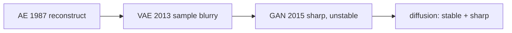

---

## Physics picture: ink in water

**Diffusion** in physics: particles move from **high concentration** to **low concentration**. A drop of **red ink** in a glass of water spreads over time. Researchers (2015) linked **nonequilibrium thermodynamics** to machine learning: the same spreading idea becomes a generative model.

The bridge: **physics of particle motion** ↔ **generative AI**, via diffusion models.

---

## Data landscape: peaks are images, valleys are noise

Imagine coordinates $(x_0, x_1)$ and a vertical axis **probability**. Spikes are **high-probability** regions = **structured, realistic** images. Flat / low regions = **unstructured noise**.

In pixel space this is not a 3-D plot: **each pixel channel is its own axis**. The 2-D sketch is only a cartoon.

**Generation** = start somewhere on the landscape and **walk uphill** to a peak. The true $p_{\text{data}}$ is **unknown**, so you do not have a map of the peaks.

Two failed strategies:

| Idea | Why it fails |
|------|----------------|
| Map **every image in the world** as a peak | Impossible |
| Memorize **known** rooms of “your house” | No help in an **unknown house** (new images) |

You need a model with **general navigation**: from **any** point, choose a local step that still climbs. That is a **compass**: at this location, move **this** way toward high probability.

Each step is a **time-varying** distribution. Write

$$
p_t(x) = p(x \mid t)
$$

— probability of data $x$ **at time** $t$. Space **and** time appear together. That is ordinary in physics (the ink drop is concentrated at $t=0$ and spread at $t=5\,\mathrm{s}$) and new as a default language for generative ML. Concentration changes over **space and time**; that is why the name **diffusion** stuck.

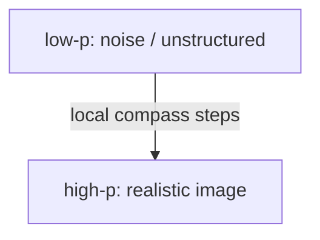

---

## Tractable vs. expressive: the gap diffusion fills

Existing generators (at the time of the 2015 paper) fell in one of two bins:

| | Tractable | Expressive |
|--|-----------|------------|
| Meaning | You can compute probabilities, train, optimize, **sample** | You can model **complex** data (images, speech, text) |
| Typical failure | Math is easy but the model **cannot** fit real images / speech | Fits complexity but you **cannot** evaluate / train / sample efficiently |

**Diffusion’s pitch:** be **flexible** (complex data) **and** **computationally tractable** by breaking a hard problem into **many easy steps**.

---

## Two processes

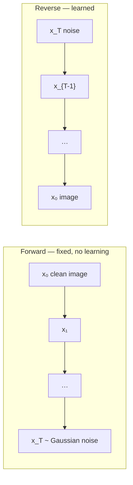

### Forward (known, fixed)

Start from structured $x_0$. Add a **little** noise each step: $x_1,x_2,x_3,\ldots,x_T$. At the end $x_T$ is (almost) **isotropic Gaussian** noise. Complex structured data has been reduced to a **simple** distribution that is easy to work with. **No neural net is trained here.**

Visual: face → slightly blurry → random pattern → **pure Gaussian**.

### Reverse (where learning happens)

Start from $x_T$ and denoise: $x_{T-1}, x_{T-2}, \ldots, x_0$. Step count depends on the problem (**100**, **200**, …). Each **small** denoising step is easier to learn than “noise → image” in one shot.

**Core idea:** learning a full $p(x)$ is hard. Learning **one previous step** is easier:

$$
p(x_{t-1} \mid x_t) \quad\text{is much easier than}\quad p(x).
$$

Forward only **corrupts**. Reverse **learns how much noise to strip** at each $t$.

---

## Training pipeline vs. inference pipeline

### Training

1. Take a real image $x_0$.  
2. Add noise over many steps (the talk’s example: out to $x_{100}$) to obtain a noisy $x_t$.  
3. Feed $x_t$ to a neural net.  
4. The net **predicts the noise** that was added relative to $x_0$.  
5. **Denoising loss** = difference between **true** noise and **predicted** noise.  
6. Update weights so the next prediction is closer.

### Inference (sampling / generation)

1. Draw $x_T \sim \mathcal{N}(0,1)$ (mean 0, variance 1 as spoken).  
2. The **trained** net repeatedly denoises: $x_T \to x_{T-1} \to \cdots \to x_0$.  
3. It knows how much noise to remove at each hop. Repeated denoising **gradually** yields a realistic image.

Learning is **only** in training. Sampling starts from noise and applies the learned reverse steps.

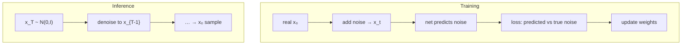

---

## Markov chains (why they appear)

A Markov chain: the system hops **state 1 → 2 → … → N**. The probability of the **next** state depends on the **current** state, **not** on the whole history.

**Snakes and ladders:** from square **9** a ladder goes to **55**; from **98** a snake goes to **76**. Whether you can take the ladder depends only on **being on 9**, not on the path $1,2,\ldots$ that got you there. Square **8** does not send you to 55.

As used for diffusion: to produce $x_t$ you only need $x_{t-1}$.

**Both** the forward noising process and the reverse denoising process are modeled as Markov chains.

---

## One-slide summary from the lecture

- VAEs / AEs / GANs gave images but not **stability and quality together**; diffusion generates from noise with both.  
- Navigate a **probability landscape** with a local compass; treat $p$ as **space- and time-varying** (physics).  
- **Forward:** corrupt $x_0$ with small Gaussian hits until $x_T$ is Gaussian.  
- **Reverse:** strip noise over many steps until a realistic $x_0$.  
- Train by predicting added noise; sample by iterating the reverse.  
- Markov: next state depends on **now**, not the full past.

Next theory lecture: **mathematics** of diffusion models.

### Key takeaways

- Diffusion = many easy Markov steps instead of one intractable map from noise to data.  
- Forward is **fixed** Gaussian corruption; reverse is the **learned** denoiser.  
- High probability ↔ structure; low probability ↔ noise; generation is climbing with a local rule $p_t(x)$.  
- The net is trained to predict **noise**, then used at inference to denoise $x_T\sim\mathcal{N}(0,I)$ down to an image.

---


\newpage

# L45: Mathematics of diffusion models

**Video:** [Lec 45](https://www.youtube.com/watch?v=eyw6Hep8kf4) · 31:58  
**Instructor in this lecture:** Prof. Baishali Garai

### Learning objectives

- Write the **forward** kernel $q(x_t\mid x_{t-1})$ and the **reverse** kernel $p_\theta(x_{t-1}\mid x_t)$ as the lecture set them up.
- Explain the **noise variance schedule** $\beta_t$ and what goes wrong if destruction is too fast or too slow.
- Recall the **Gaussian** PDF, the **standard** Gaussian $\mathcal{N}(0,1)$, and why images need a **multivariate** Gaussian (covariance, not a scalar $\sigma^2$).
- Compute a $2\times2$ **covariance matrix** on the height–weight table (population $n$, not $n-1$).

This lecture is **foundations only**. The next video specializes them to **DDPM**. It is not a full DDPM derivation.

---

## Problem setup: two processes

Demo: a **dog jumping**. At $t=0$ the frame is clean. At $t=1,2,\ldots$ more noise appears. At $t=T$ the frame is almost **pure noise**.

| Symbol | Meaning |
|--------|---------|
| $x_0$ | original data (clean image / signal) |
| $x_t$ | noisy version at step $t$ |
| $T$ | total diffusion steps (can be **up to ~1000**, application-dependent) |
| $t\in\{1,\ldots,T\}$ | current step |

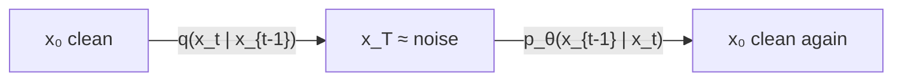

### Forward kernel (fixed, known)

$$
q(x_t \mid x_{t-1})
$$

is the distribution of $x_t$ **conditioned on** $x_{t-1}$. If you know $x_2$, then $x_3$ is drawn given $x_2$.

Nothing is **learned**. You only manufacture a noisier sample from a cleaner one. Because the process is known, this kernel is taken to be a **predefined Gaussian**.

### Reverse kernel (learned)

Start at $t=T$ (almost pure noise). Denoise step by step down to $x_0$. The network learns **how much noise was added at timestamp $t$**.

$$
p_\theta(x_{t-1} \mid x_t)
$$

$x_{t-1}$ is conditioned on $x_t$ (walking **backward**). The new symbol **$\theta$** is **all trainable weights** of the denoising net. Reverse = generate a **cleaner** sample from a **noisier** one.

| | Forward | Reverse |
|--|---------|---------|
| Direction | clean → noise | noise → clean |
| Learning | none | $\theta$ |
| Typical letter | $q$ | $p_\theta$ |

---

## Noise variance schedule $\beta_t$

Noise is **not** the same size at every hop. A **schedule** is a sequence

$$
\beta_1,\beta_2,\ldots,\beta_T, \qquad \beta_t \in (0,1).
$$

$\beta_t$ is how much noise is injected at step $t$. Small $t$: **small** $\beta_t$. Large $t$: **larger** $\beta_t$. That **gradual** increase is the schedule. It also controls **signal-to-noise ratio** (more noise → SNR **drops**).

### Why not a constant $\beta$?

You want **complete destruction** of $x_0$’s structure by step $T$, i.e. $x_T \approx \mathcal{N}(0,1)$ (mean 0, variance 1).

| If destruction is… | What happens |
|--------------------|----------------|
| **Too fast** (clean → noise in ~3–6 steps) | Reverse learning is hard: too much change per hop |
| **Too slow** | Too many steps; **training inefficient** |

So a schedule must (i) finish as $\mathcal{N}(0,1)$ by $T$ and (ii) not jump or crawl.

---

## Gaussian review (used constantly from here on)

A Gaussian is a distribution **clustered around the mean**, **symmetric** left and right.

$$
p(x) = \frac{1}{\sqrt{2\pi\sigma^2}} \exp\left( -\frac{(x-\mu)^2}{2\sigma^2} \right)
$$

| Symbol | Role |
|--------|------|
| $x$ | data point (random variable) |
| $\mu$ | mean |
| $\sigma^2$ | variance (spread) |
| $\sigma$ | standard deviation |
| $1/\sqrt{2\pi\sigma^2}$ | **normalization** so total probability is 1 |
| exponential | density **falls off** as you move away from $\mu$ |

Empirical rule drawn on the bell curve:

| Interval | Probability (as taught) |
|----------|-------------------------|
| $\mu\pm\sigma$ | **68%** |
| $\mu\pm 2\sigma$ | **95%** |
| $\mu\pm 3\sigma$ | **99.7%** |

### Standard Gaussian

When $\mu=0$ and variance $=1$, write $\mathcal{N}(0,1)$ and call it the **standard** Gaussian.

---

## Multivariate Gaussian (why images are not $\mathcal{N}(\mu,\sigma^2)$)

**Multivariate** = more than one variable, packed as a **vector**. Instead of a scalar $x$, take $x\in\mathbb{R}^d$ ($d$ components). The density is a multivariate normal with **mean vector** $\mu$ and **covariance matrix** $\Sigma$ — you speak of **covariance**, not a single $\sigma^2$.

**Why this course needs it:** ML almost never uses one scalar. An image has **millions of pixels**; embeddings are high-dimensional. Pixels are **correlated**; features are correlated. Those relationships live in $\Sigma$.

If the off-diagonals are zero, dimensions are **uncorrelated** (this fact is reused in the DDPM forward covariance $\beta_t I$).

### Covariance as “how two variables move together”

| Example | Pattern | Name |
|---------|---------|------|
| Temperature vs **ice-cream** sales in summer | both **rise** | **positive** covariance |
| Temperature vs **hot-chocolate** sales in summer | heat up, chocolate sales **fall** | **negative** covariance |

### Shape of a $2\times2$ covariance matrix

For features $X_1,X_2$:

$$
\Sigma = \begin{bmatrix}
\mathrm{Var}(X_1) & \mathrm{Cov}(X_1,X_2) \\
\mathrm{Cov}(X_2,X_1) & \mathrm{Var}(X_2)
\end{bmatrix}
$$

**Diagonal** = variances. **Off-diagonal** = covariances. $\mathrm{Cov}(X_1,X_2)=\mathrm{Cov}(X_2,X_1)$.

---

## Numerical example: height and weight

Four people, two features. $X_1=$ height, $X_2=$ weight.

| Person | Height $X_1$ | Weight $X_2$ |
|--------|--------------:|--------------:|
| A | 150 | 50 |
| B | 160 | 55 |
| C | 170 | 65 |
| D | 180 | 72 |

Means (as computed in class):

$$
\mu_1 = 165, \qquad \mu_2 = 60.5
$$

**Population variance** (divide by $n=4$, **not** $n-1$; sample variance would use $n-1$):

$$
\mathrm{Var}(X_1) = \mathbb{E}\bigl[(X_1-\mu_1)^2\bigr]
$$

| Person | $X_1-\mu_1$ | $(X_1-\mu_1)^2$ |
|--------|-------------:|----------------:|
| A | $-15$ | 225 |
| B | $-5$ | 25 |
| C | $5$ | 25 |
| D | $15$ | 225 |

Sum $=500$, divide by $4$ → $\mathrm{Var}(X_1)=\mathbf{125}$.  
$\mathrm{Var}(X_2)$ was **left as an exercise** (same table with $X_2-\mu_2$).

**Covariance**

$$
\mathrm{Cov}(X_1,X_2) = \mathbb{E}\bigl[(X_1-\mu_1)(X_2-\mu_2)\bigr] = \mathbf{95}
$$

(The lecture asked you to pause and check the extended table; the filled-in value is 95.)

So

$$
\Sigma = \begin{bmatrix} 125 & 95 \\ 95 & \mathrm{Var}(X_2) \end{bmatrix}
$$

with the missing diagonal entry from the exercise. This $2\times2$ drill exists because **later DDPM lectures keep saying “covariance.”**

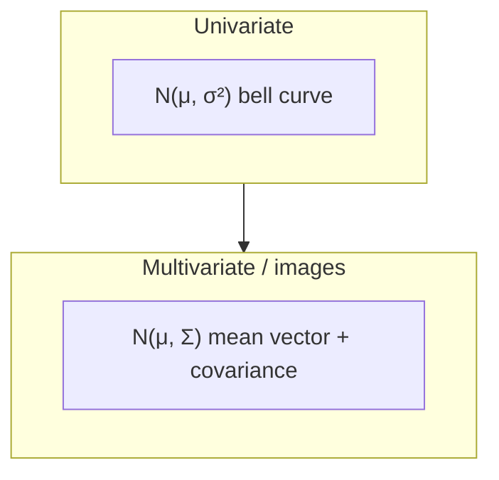

---

## Recap map

1. Forward $q(x_t\mid x_{t-1})$: **Gaussian**, **fixed**.  
2. Reverse $p_\theta(x_{t-1}\mid x_t)$: Gaussian whose parameters depend on **$\theta$**.  
3. $\beta_t\in(0,1)$ schedules how fast structure dies; too fast or too slow both hurt.  
4. Target at $T$: standard Gaussian $\mathcal{N}(0,1)$.  
5. Images → **multivariate** Gaussians → **covariance matrices**; ice cream vs hot chocolate; height–weight calculation.

Next lecture: **denoising diffusion probabilistic models (DDPM)** as a specific diffusion family, starting with the **forward** process.

### Key takeaways

- $q$ noising is predefined Gaussian; $p_\theta$ denoising is the trainable Gaussian.  
- $\beta_t$ is a **schedule**, not a constant, so $x_T$ is fully noise without making reverse learning impossible.  
- Standard Gaussian = $\mathcal{N}(0,1)$; pixels need $\mathcal{N}(\mu,\Sigma)$.  
- $\Sigma$’s diagonal is variance, off-diagonal is relationship; the $n=4$ height–weight example is the calculation you are expected to reproduce.

---


\newpage

# L46: DDPM — forward process

**Video:** [Lec 46](https://www.youtube.com/watch?v=Ze66dWq7yhI) · 29:51  
**Instructor in this lecture:** Prof. Baishali Garai

### Learning objectives

- Identify **DDPM** as the 2020 Ho et al. (UC Berkeley) formulation of diffusion.
- Write the Markov forward kernel $q(x_t\mid x_{t-1})$ with mean $\sqrt{1-\beta_t}\,x_{t-1}$ and covariance $\beta_t I$.
- Show why the previous image must be **scaled** (unscaled variance **blows up**).
- Expand the recursion to the **closed-form** $q(x_t\mid x_0)$ and the **reparameterization** that samples any $t$ in one shot.

Reverse-process math is the **next** lecture. This video is forward only.

---

## What DDPM is

**Denoising diffusion probabilistic models (DDPM)** — paper *Denoising Diffusion Probabilistic Models*, Jonathan Ho and colleagues, UC Berkeley, **2020**. A **specific** instance of the diffusion family from the previous two lectures.

Same two processes:

| Forward | Reverse |
|---------|---------|
| Clean image → almost pure noise, step by step | Almost pure noise → clean image |
| **No learning**; predefined Gaussian | Learning lives here (next lecture) |

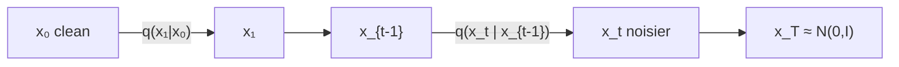

Markov reminder: the **next** state depends only on the **current** state, not on the whole path. Forward DDPM is a Markov chain. Noise **increases** with $t$ (a little at $t=1,2$; much more by $t=30$–$40$).

$$
q(x_t \mid x_{t-1})
$$

= probability of a **noisier** $x_t$ given a **less noisy** $x_{t-1}$.

---

## Forward kernel as a Gaussian

Because the forward process is **fixed**, $x_t$ is sampled from a Gaussian with mean $\mu$ and covariance $\Sigma$:

$$
x_t \sim \mathcal{N}(\mu, \Sigma)
$$

written $\mathcal{N}(x_t;\,\mu,\,\Sigma)$.

**Covariance** (from last lecture): how uncertainty is spread across dimensions and how dimensions **relate**. For two scalars $X_1,X_2$,

$$
\Sigma = \begin{bmatrix} \mathrm{Var}(X_1) & \mathrm{Cov}(X_1,X_2) \\ \mathrm{Cov}(X_2,X_1) & \mathrm{Var}(X_2) \end{bmatrix}.
$$

**Zero off-diagonal covariance** = no relationship between dimensions. DDPM uses that idea: noise is **independent across pixels**, so $\Sigma$ is a **scaled identity**.

### The actual DDPM forward equation

$$
q(x_t \mid x_{t-1}) = \mathcal{N}\!\bigl(x_t;\; \sqrt{1-\beta_t}\, x_{t-1},\; \beta_t I\bigr)
$$

| Symbol | Meaning |
|--------|---------|
| $x_t$ | image at step $t$ |
| $x_{t-1}$ | image at step $t-1$ |
| $\beta_t$ | how much noise is added at $t$ (magnitude) |
| $I$ | identity matrix |

$\beta_t I$ for 2-D looks like $\mathrm{diag}(\beta_t,\beta_t)$: variance $\beta_t$ on each axis, **zero** cross-covariance.

**In words:** given $x_{t-1}$, draw $x_t$ from a Gaussian whose

- **mean** is $\sqrt{1-\beta_t}\,x_{t-1}$ — a **scaled copy** of the previous image, scale $\sqrt{1-\beta_t}$, with $\beta_t\in(0,1)$;  
- **covariance** is $\beta_t I$.

---

## Substitute $\alpha_t = 1-\beta_t$

$$
\alpha_t := 1-\beta_t \quad\Rightarrow\quad \beta_t = 1-\alpha_t
$$

$$
q(x_t \mid x_{t-1}) = \mathcal{N}\!\bigl(x_t;\; \sqrt{\alpha_t}\, x_{t-1},\; (1-\alpha_t)I\bigr)
$$

**Reparameterize a Gaussian sample** as mean + std $\times$ standard normal:

$$
x_t = \sqrt{\alpha_t}\, x_{t-1} + \sqrt{1-\alpha_t}\,\varepsilon_t, \qquad \varepsilon_t \sim \mathcal{N}(0,I)
$$

| Term | Role |
|------|------|
| $\sqrt{\alpha_t}\, x_{t-1}$ | **scaled remaining signal** |
| $\sqrt{1-\alpha_t}\,\varepsilon_t$ | **noise** ($\varepsilon_t$ standard Gaussian) |

---

## Why scale the signal? Variance blow-up

Suppose we **did not** scale and wrote $x_t = x_{t-1} + \sqrt{1-\alpha_t}\,\varepsilon_t$. Independently adding noise,

$$
\mathrm{Var}(x_t) = \mathrm{Var}(x_{t-1}) + \mathrm{Var}\bigl(\sqrt{1-\alpha_t}\,\varepsilon_t\bigr).
$$

Let $a=\sqrt{1-\alpha_t}$. Then $\mathrm{Var}(a\varepsilon_t)=a^2\mathrm{Var}(\varepsilon_t)=(1-\alpha_t)\cdot 1$, so

$$
\mathrm{Var}(x_t) = \mathrm{Var}(x_{t-1}) + (1-\alpha_t).
$$

$\mathrm{Var}(x_{t-1})$ **grows every step**. After many steps the variance is huge and the **distribution blows up**. That is why the mean is a **fraction** of the previous image, not the whole image.

---

## Recursion: write $x_2$ in terms of $x_0$

Start at $t=1$:

$$
x_1 = \sqrt{\alpha_1}\, x_0 + \sqrt{1-\alpha_1}\,\varepsilon_1.
$$

Then

$$
x_2 = \sqrt{\alpha_2}\, x_1 + \sqrt{1-\alpha_2}\,\varepsilon_2.
$$

Substitute $x_1$:

$$
x_2 = \sqrt{\alpha_2}\bigl(\sqrt{\alpha_1}\, x_0 + \sqrt{1-\alpha_1}\,\varepsilon_1\bigr) + \sqrt{1-\alpha_2}\,\varepsilon_2
$$

$$
x_2 = \sqrt{\alpha_1\alpha_2}\, x_0 + \sqrt{\alpha_2(1-\alpha_1)}\,\varepsilon_1 + \sqrt{1-\alpha_2}\,\varepsilon_2.
$$

- $\sqrt{\alpha_1\alpha_2}\,x_0$ still carries the **original signal** $x_0$.  
- The other two terms are **independent Gaussians**.

Define

$$
\bar{\alpha}_2 := \alpha_1\alpha_2
$$

and let $Z$ be the sum of those two noise terms. Their covariance (independent $\varepsilon_1,\varepsilon_2$):

$$
\alpha_2(1-\alpha_1)I + (1-\alpha_2)I = \bigl(\alpha_2 - \alpha_1\alpha_2 + 1 - \alpha_2\bigr)I = (1-\alpha_1\alpha_2)I = (1-\bar{\alpha}_2)I.
$$

So $x_2$ is Gaussian with mean $\sqrt{\bar{\alpha}_2}\,x_0$ and covariance $(1-\bar{\alpha}_2)I$.

### General $t$

$$
\bar{\alpha}_t := \prod_{s=1}^{t} \alpha_s = \alpha_1\alpha_2\cdots\alpha_t
$$

$$
\sqrt{\alpha_1\cdots\alpha_t} = \sqrt{\bar{\alpha}_t}.
$$

**Closed-form forward (the equation to memorize):**

$$
q(x_t \mid x_0) = \mathcal{N}\!\bigl(x_t;\; \sqrt{\bar{\alpha}_t}\, x_0,\; (1-\bar{\alpha}_t)I\bigr)
$$

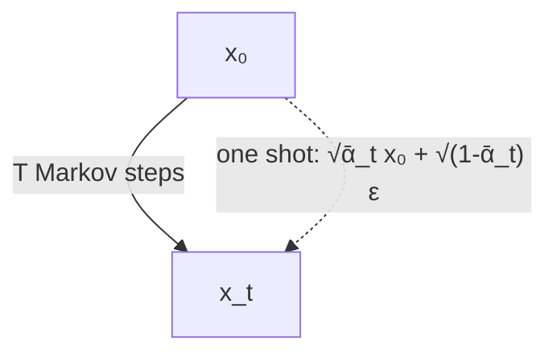

---

## Reparameterization trick (why DDPM training is cheap)

If $Z\sim\mathcal{N}(\mu,\sigma^2)$, do **not** sample $Z$ as an opaque Gaussian. Write

$$
Z = \mu + \sigma\,\varepsilon, \qquad \varepsilon\sim\mathcal{N}(0,1).
$$

Apply that to $q(x_t\mid x_0)$:

$$
x_t = \sqrt{\bar{\alpha}_t}\, x_0 + \sqrt{1-\bar{\alpha}_t}\,\varepsilon, \qquad \varepsilon\sim\mathcal{N}(0,I).
$$

| Term | Meaning |
|------|---------|
| $\sqrt{\bar{\alpha}_t}\,x_0$ | **remaining signal strength** |
| $\sqrt{1-\bar{\alpha}_t}\,\varepsilon$ | **accumulated noise** |

**Without** this: to reach $x_t$ you must walk $x_0\to x_1\to\cdots\to x_t$ (**$t$ diffusion steps**).  
**With** this: if you know $x_0$, you can draw $x_t$ for **any** $t$ **in one step**. Example from the lecture: want $x_{99}$? Use $x_0$ and $\bar{\alpha}_{99}$ directly.

That one-shot sample is the important DDPM engineering fact for the forward process.

---

## What this lecture is *not*

It does **not** train $\theta$ or write $p_\theta(x_{t-1}\mid x_t)$. The instructor flags that as the next class (parameters live on the reverse chain).

### Key takeaways

- DDPM forward is a **fixed** Markov Gaussian: $q(x_t\mid x_{t-1})=\mathcal{N}(\sqrt{1-\beta_t}\,x_{t-1},\,\beta_t I)$.  
- $\alpha_t=1-\beta_t$; samples $x_t=\sqrt{\alpha_t}\,x_{t-1}+\sqrt{1-\alpha_t}\,\varepsilon_t$.  
- Skipping the $\sqrt{\alpha_t}$ scale makes variance **accumulate** until the law blows up.  
- $\bar{\alpha}_t=\prod_s\alpha_s$ yields $q(x_t\mid x_0)=\mathcal{N}(\sqrt{\bar{\alpha}_t}\,x_0,\,(1-\bar{\alpha}_t)I)$ and the one-shot $x_t=\sqrt{\bar{\alpha}_t}\,x_0+\sqrt{1-\bar{\alpha}_t}\,\varepsilon$.

---


\newpage

# L47: DDPM — reverse process

**Video:** [Lec 47](https://www.youtube.com/watch?v=AF3G4llVO20) · 33:01  
**Instructor in this lecture:** Prof. Baishali Garai

### Learning objectives

- Write the reverse **Markov** joint $p_\theta(x_{0:T})$ from a Gaussian **prior** $x_T$.
- State the **forward posterior** $q(x_{t-1}\mid x_t,x_0)$ (mean $\tilde{\mu}_t$ depends on $x_0$ — unusable at generation).
- Eliminate $x_0$ using the forward reparameterization, replace $\varepsilon$ by $\varepsilon_\theta$, and sample $x_{t-1}$.
- Quote the **MSE noise-prediction** loss used to train DDPM.

U-Net internals are **not** this video (the instructor points to a later architecture lecture; the next playlist item is the **forward-process lab**).

---

## Recap: forward equations we reuse

From the previous lecture:

$$
q(x_t \mid x_0) = \mathcal{N}\!\bigl(x_t;\; \sqrt{\bar{\alpha}_t}\, x_0,\; (1-\bar{\alpha}_t)I\bigr)
$$

$$
x_t = \sqrt{\bar{\alpha}_t}\, x_0 + \sqrt{1-\bar{\alpha}_t}\,\varepsilon, \qquad \varepsilon\sim\mathcal{N}(0,I).
$$

Reparameterization still means: sample **any** $x_t$ from $x_0$ **without** walking every intermediate hop.

We keep returning to these $q$ formulas because the **reverse learner is guided by the known forward**.

---

## Reverse process: goal

Sequence: $x_T \to x_{T-1} \to \cdots \to x_2 \to x_1 \to x_0$. $x_T$ is complete Gaussian noise; $x_0$ is a clean image. Generation = **progressively remove noise** from a Gaussian draw.

**Goal:** learn

$$
p_\theta(x_{t-1} \mid x_t)
$$

— given a noisy $x_t$, predict a **slightly less noisy** $x_{t-1}$. $\theta$ = neural-net parameters (how much noise to strip).

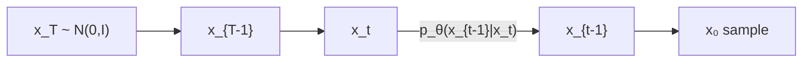

---

## Reverse as a Markov chain

$x_{t-1}$ depends **only** on $x_t$, not on the rest of the trajectory. The joint over the **whole reverse path** therefore factors:

$$
p_\theta(x_{0:T}) = p(x_T)\prod_{t=1}^{T} p_\theta(x_{t-1}\mid x_t)
$$

| Factor | Meaning |
|--------|---------|
| $p_\theta(x_{0:T})$ | joint of the **entire reverse trajectory** |
| $p(x_T)$ | **prior** at the start of generation |
| $\prod p_\theta(x_{t-1}\mid x_t)$ | all reverse conditionals |
| $\theta$ | trainable weights |

**Prior:** $x_T$ is **Gaussian noise, mean 0, unit variance** — $\mathcal{N}(0,I)$. Generation **starts** there.

---

## Prior vs. posterior (terms used below)

| Term | Lecture meaning |
|------|-----------------|
| **Prior** | what you assume **before** extra evidence |
| **Posterior** | the law **after** observing more information |

---

## Posterior of the **forward** process

Under the known noising $q$, look **one step back** given both the current noisy state **and** the clean start:

$$
q(x_{t-1} \mid x_t, x_0)
$$

Forward path: $x_0\to x_1\to\cdots\to x_{t-1}\to x_t\to\cdots\to x_T$. Here you know $x_0$ (training-time clean image) and $x_t$; you want the law of the previous noisy image $x_{t-1}$.

This posterior is **Gaussian**:

$$
q(x_{t-1}\mid x_t,x_0) = \mathcal{N}\!\bigl(x_{t-1};\; \tilde{\mu}_t(x_t,x_0),\; \tilde{\beta}_t I\bigr).
$$

The lecture **does not derive** $\tilde{\mu}_t$; it **states** the formula (depends on $x_t$ and $x_0$). With $\bar{\alpha}_t=\prod_{s=1}^t\alpha_s$ as before:

$$
\tilde{\mu}_t(x_t,x_0)
= \frac{\sqrt{\bar{\alpha}_{t-1}}\,\beta_t}{1-\bar{\alpha}_t}\, x_0
+ \frac{\sqrt{\alpha_t}\,(1-\bar{\alpha}_{t-1})}{1-\bar{\alpha}_t}\, x_t.
$$

Once mean and variance are known, $x_{t-1}$ is a Gaussian sample (mean + std $\times$ noise). Tractable **because** it is Gaussian.

---

## Reverse conditional we actually learn

$$
p_\theta(x_{t-1}\mid x_t) = \mathcal{N}\!\bigl(x_{t-1};\; \mu_\theta(x_t,t),\; \Sigma_\theta(x_t,t)\bigr)
$$

**Wherever you see $\theta$, something is learned.** Both the reverse **mean** $\mu_\theta(x_t,t)$ and the reverse **covariance** $\Sigma_\theta(x_t,t)$ are functions of the current noisy image **and** the time index.

The next denoised image is sampled from that Gaussian: you **have** $x_t$, you **sample** $x_{t-1}$. The net must learn that mean (and covariance).

---

## Why $\tilde{\mu}_t(x_t,x_0)$ cannot be used at generation

$\tilde{\mu}_t$ contains **$x_0$**, the **clean** image. During **generation** you start at $x_T$ and only have the current $x_t$. You **do not** have $x_0$ yet — that is the thing you are trying to create. So the posterior mean **as written cannot be plugged into the sampler**.

**Fix:** rewrite the mean **without** $x_0$.

From the forward sample equation, solve for $x_0$:

$$
x_0 = \frac{x_t - \sqrt{1-\bar{\alpha}_t}\,\varepsilon}{\sqrt{\bar{\alpha}_t}}.
$$

Substitute that into $\tilde{\mu}_t$. After algebra the lecture **does not expand on the board**, the mean depends only on $x_t$ (and $\varepsilon$). **Replace the true noise $\varepsilon$ by the network’s prediction** $\varepsilon_\theta(x_t,t)$:

$$
\mu_\theta(x_t,t)
= \frac{1}{\sqrt{\alpha_t}}\left(
x_t - \frac{\beta_t}{\sqrt{1-\bar{\alpha}_t}}\,\varepsilon_\theta(x_t,t)
\right).
$$

Now the reverse mean is a function of **$x_t$ and $t$ only** — no $x_0$.

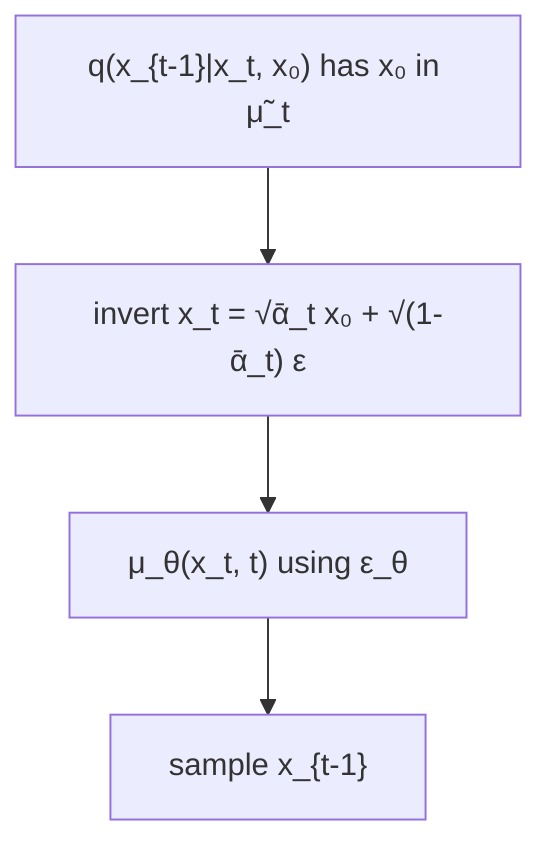

---

## Sampling the reverse step

A Gaussian sample is mean + standard deviation $\times$ standard normal:

$$
x_{t-1} = \mu_\theta(x_t,t) + \sigma_t z, \qquad z\sim\mathcal{N}(0,I).
$$

$\sigma_t$ comes from the reverse variance (square root). Plug in $\mu_\theta$ from above — that **is** the reverse diffusion update. The net has learned how to produce $x_{t-1}$ from $x_t$.

Then **iterate**: at $x_{t-1}$ predict mean/variance again, sample $x_{t-2}$, … until $x_0$.

---

## Training loss: predict the noise

The diffusion model is trained as a **noise predictor**. Loss = expected **mean squared error** between true $\varepsilon$ and predicted $\varepsilon_\theta(x_t,t)$:

$$
L = \mathbb{E}_{x_0,\,\varepsilon,\,t}\Bigl[ \bigl\| \varepsilon - \varepsilon_\theta(x_t,t) \bigr\|^2 \Bigr]
$$

| Piece | Average over… |
|-------|----------------|
| $x_0$ | **all images** |
| $\varepsilon$ | **all noise levels** |
| $t$ | **all time steps** |

So the network must work **on average** across the dataset, across $t$, and across the noise draws. $x_t$ is built from $x_0$ and $\varepsilon$ with the **forward** closed form.

---

## Story in one chain

1. Forward $q$ is known.  
2. Reverse $p_\theta(x_{t-1}\mid x_t)$ is modeled as Gaussian with learned mean/covariance.  
3. The textbook posterior mean needs $x_0$ → invert the forward sample → replace $\varepsilon$ by $\varepsilon_\theta$.  
4. Sample $x_{t-1}=\mu_\theta+\sigma_t z$ and loop to $x_0$.  
5. Train with $\|\varepsilon-\varepsilon_\theta\|^2$.

### Key takeaways

- Reverse joint = prior $x_T\sim\mathcal{N}(0,I)$ times Markov conditionals $p_\theta(x_{t-1}\mid x_t)$.  
- $q(x_{t-1}\mid x_t,x_0)$ is Gaussian, but $\tilde{\mu}_t$ needs the **unknown** $x_0$ at sampling time.  
- $\mu_\theta(x_t,t)=\frac{1}{\sqrt{\alpha_t}}\bigl(x_t-\frac{\beta_t}{\sqrt{1-\bar{\alpha}_t}}\varepsilon_\theta(x_t,t)\bigr)$.  
- $x_{t-1}=\mu_\theta+\sigma_t z$; train $\varepsilon_\theta$ with MSE vs true $\varepsilon$.

---


\newpage

# L48: Hands-on — forward diffusion process

**Video:** [Lec 48](https://www.youtube.com/watch?v=wXBxC49sNmk) · 20:05  
**Instructor in this lecture:** Debarpan (part 1 of the diffusion notebook; reverse sampling is Lec 53)

### Learning objectives

- Implement the DDPM **forward** kernel, $\alpha_t$, $\bar{\alpha}_t$, and **closed-form** $x_t$ from $x_0$.
- Compare **linear** vs **cosine** $\beta$-schedules ($T=1000$) on remaining signal and **SNR**.
- Show that **iterative Markov** noising and **one-shot** $q(x_t\mid x_0)$ match in **mean and std** (Monte Carlo).
- Train a small **time-conditioned CNN** on MNIST to predict $\varepsilon$, then reconstruct by **subtracting** predicted noise — and list what a full DDPM still needs.

**Part 2** (reverse sampling, U-Net, guidance) is explicitly **not** this tutorial.

---

## What the notebook covers (week 7 theory)

Why diffusion; forward Gaussian noising; linear vs cosine variance schedules; denoising intuition; Markov interpretation; closed-form vs iterative sampling; SNR; noise-prediction objective; a small CNN on MNIST.

Imports: PyTorch, set **device to GPU** when available.

---

## Intuition recap (as coded)

Generation splits in two:

| Process | Path | Who learns |
|---------|------|------------|
| **Forward** | $x_0\to x_1\to\cdots\to x_T$ | nobody — add small Gaussians until noise |
| **Reverse** | $x_T\sim\mathcal{N}(0,I)$ toward $x_0$ | **neural net** |

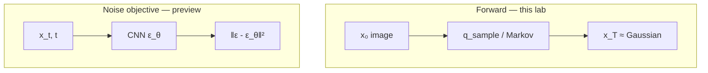

---

## Equations implemented (from theory)

$$
q(x_t\mid x_{t-1}) = \mathcal{N}\!\bigl(\sqrt{1-\beta_t}\,x_{t-1},\; \beta_t I\bigr)
$$

$$
\alpha_t = 1-\beta_t, \qquad \bar{\alpha}_t = \prod_{s=1}^{t}\alpha_s
$$

**Closed form** (any intermediate state from $x_0$):

$$
x_t = \sqrt{\bar{\alpha}_t}\, x_0 + \sqrt{1-\bar{\alpha}_t}\,\varepsilon
$$

---

## Step 1 — Variance schedules, $T=1000$

Set **$T=1000$** steps from clean image to noise. Implement:

- **Linear** $\beta$ schedule  
- **Cosine-derived** $\beta$ schedule  

Both run over the **same start/end range** (spoken as going from **0 to 1** on the plotted normalized axis).

| Schedule | Shape on the plot | Remaining signal $\bar{\alpha}_t$ |
|----------|-------------------|-------------------------------------|
| **Linear** | essentially **flat** $\beta_t \approx 1/1000$ | signal decays **slowly at first**, then **drops** |
| **Cosine** | $\beta_t$ **small at the start**, then **rises** | **more uniform** decline of original signal |

**Why cosine is preferred here:** even though linear takes **uniform $\beta$ steps**, the **fraction of $x_0$ that remains** is **not** uniform. Cosine’s smaller early $\beta$ makes $\bar{\alpha}_t$ fall more evenly. Linear also fails to push **SNR as low** at the end (next plot).

Plot both $\beta_t$ and the retained-signal curves.

---

## Step 2 — Forward on a real image (astronaut)

- Load a standard **astronaut** image with **scikit-image**. Display $x_0$.  
- Precompute time-indexed $\alpha,\beta,\bar{\alpha}$.  
- `extract(values, time_steps, target_shape)` — gather coefficients for a batch of $t$.  
- `q_sample` — draw $x_t$ from **$q(x_t\mid x_0)$** (the **marginal**, one shot).

**Visualization timesteps:** $0, 50, 100, \ldots, 999$ (last step). The image **slowly** becomes Gaussian by $t=999$.

**Linear vs cosine on the same photo:**

| Row | What you should see |
|-----|---------------------|
| **Linear** (top) | becomes **very noisy early**; by **$t\approx 500$** already near Gaussian |
| **Cosine** (bottom) | **uniform** fade from structure to noise |

That is the same story as the $\bar{\alpha}_t$ plots.

---

## Step 3 — Markov-chain interpretation

**Markov:** next noisier image depends only on the **previous** noisier image.

$$
q(x_t \mid x_{t-1}, x_{t-2}, \ldots, x_0) = q(x_t \mid x_{t-1})
$$

Once $x_{t-1}$ is known, $x_{t-2},\ldots,x_0$ are irrelevant. Implement **iterative** transitions with the $\beta_t,\alpha_t$ formulas. Visualize $t=0$ through $t=999$: again, image → Gaussian.

---

## Step 4 — Closed form vs iterative: Monte Carlo check

Individual draws **differ** (different random $\varepsilon$ sequences) but they represent the **same marginal**. Experiment:

| Setting | Value |
|---------|--------|
| Clean signal $x_0$ | a **scalar** |
| Target $t$ | **500** |
| Number of samples | **20{,}000** |

Compare **empirical mean and standard deviation** of iterative Markov vs one-shot `q_sample`. They are **close** — the lab’s check that Markov modeling and closed-form sampling agree.

---

## Step 5 — Signal-to-noise ratio

$$
\mathrm{SNR}(t) = \frac{\bar{\alpha}_t}{1-\bar{\alpha}_t}
$$

| $t$ | Expected SNR |
|-----|----------------|
| start | **high** (all signal, no noise) |
| later | **falls** (signal down, noise up) |
| $T$ | **~0** (only noise) |

Both schedules: SNR **monotonically decreases**. Extra linear limitation: it does **not** drive SNR as **low** as cosine. Desired: **as high as possible at $t=0$**, **as low as possible at $t=T$**. Cosine has the **better range**.

---

## Step 6 — Noise-prediction objective (bridge to reverse)

Given clean $x_0$, random $t$, $\varepsilon\sim\mathcal{N}(0,I)$, build $x_t$. Ask a net: from **$(x_t, t)$**, recover $\varepsilon$. Not a linear map — needs a network.

**Simplified loss** (gradient descent):

$$
L_{\text{simple}} = \mathbb{E}\bigl[\|\varepsilon - \varepsilon_\theta(x_t,t)\|^2\bigr]
$$

$\theta$ = network weights. This is the training objective used next.

---

## Step 7 — Tiny MNIST noise predictor

| Piece | As implemented |
|-------|----------------|
| Data | MNIST, **transforms**, train/test split |
| Train size | **12{,}000** |
| Val size | **2{,}000** |
| Model | **CNN** taking the image **and** time, predicting noise |
| Parameters | about **124{,}000** |
| Optim | batches + train / eval loops |

**Observe:** training **MSE** and **validation MSE** both **fall**. So $\varepsilon_\theta(x_t,t)$ can approximate $\varepsilon$.

**Sanity check beyond the loss:** if noise is predicted well, **subtract** it from $x_t$ and you should **see $x_0$**. Grid: **first row = original digits**, **last row = reconstructions**. This is a **toy, one-step** demo — quality is only **approximate**. Real reverse diffusion uses **many** steps and a stronger net.

**Caveats stated at the end**

- Falling noise-prediction loss **does not** mean high-quality generation.  
- A complete DDPM still needs **reverse equations**, **iterative sampling** (not one subtraction), a **U-Net** (not this CNN), **longer training**, and optionally **conditioning / guidance** (next tutorial).  
- Optional extra exercises are listed in the notebook for self-study.

---

## Summary (as spoken)

- Forward diffusion **destroys** structure with Gaussian noise; the process is **Markovian**.  
- A **variance schedule** sets how fast signal dies; cosine is the better SNR / remaining-signal shape here.  
- **Closed form** enables efficient **random-$t$** training.  
- SNR **decreases** with $t$.  
- The net sees **$x_t$ and $t$** when predicting noise.  
- Basic DDPM learns added Gaussian noise with **MSE**.  
- **Full reverse** is the next lab.

### Key takeaways

- Code $x_t=\sqrt{\bar{\alpha}_t}x_0+\sqrt{1-\bar{\alpha}_t}\varepsilon$ and the Markov one-step kernel; they match in Monte Carlo.  
- $T=1000$; cosine $\beta$ beats linear on uniform signal decay and final SNR.  
- Astronaut viz: linear is “done” by ~500; cosine fades evenly.  
- MNIST CNN (~124k params, 12k/2k split) can drop $L_{\text{simple}}$ and roughly undo noise in one subtract — that is **not** yet a DDPM sampler.

---


\newpage

# L49: U-Net for denoising

**Video:** [Lec 49](https://www.youtube.com/watch?v=oqA3Mjp2Nn4) · 36:13  
**Instructor in this lecture:** Prof. Baishali Garai

### Learning objectives

- Place **U-Net** in DDPM: input $(x_t,t)$ → predicted noise $\varepsilon_\theta(x_t,t)$.
- Contrast **Ronneberger** segmentation U-Net with the DDPM stack: **time embeddings**, **residual blocks**, **self-attention**.
- Compute a **sinusoidal** time embedding (the $T=100$, $d=8$ numerical example).
- Walk **encoder / bottleneck / decoder**, the residual-block algebra (GroupNorm, **SiLU**, time projection), and **QKV** attention.

Classifier-guided diffusion is the **next** theory lecture, not this one.

---

## Role of U-Net in DDPM

Forward DDPM: add a scheduled amount of noise until a clean image is destroyed. Reverse: start from noise, denoise to $x_0$. The **network that predicts how much noise is in $x_t$** is a **U-Net**.

$$
\varepsilon_\theta(x_t, t)
$$

$\theta$ = U-Net weights. Inputs: noisy image $x_t$ **and** timestep $t$.

**Why U-Net rather than a plain CNN?**

1. **Global context** — overall image structure.  
2. **Skip connections** — **fine details** lost in downsampling are **copied back** on the expanding path.

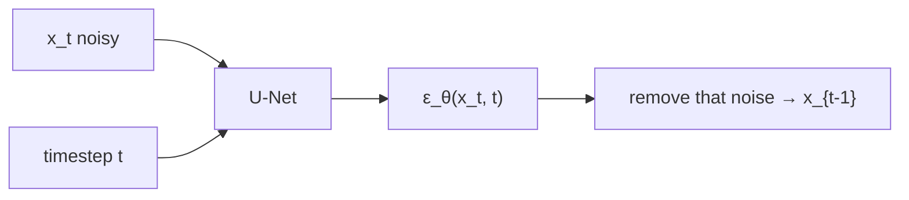

At **every reverse step**, U-Net predicts $\varepsilon$; that amount is removed to form $x_{t-1}$.

---

## Original U-Net (segmentation) vs DDPM U-Net

Source picture: **Olaf Ronneberger**, *U-Net: Convolutional Networks for Biomedical Image Segmentation*. Input image → **segmentation map**.

| Part | Job |
|------|-----|
| **Encoder** (contracting) | downsample; spatial size shrinks; keep important information |
| **Bottleneck** | most **compressed** summary |
| **Decoder** (expanding) | upsample / reconstruct |
| **Skips** | **crop and concatenate** encoder features onto the matching decoder level so fine detail survives |

DDPM is **not** producing a segmentation map. It must **predict noise at each $t$**. The modified U-Net therefore adds three things:

1. **Timestep embeddings**  
2. **Residual blocks**  
3. **Attention layers**

---

## Time embeddings

Walking $x_T\to x_{t-1}\to\cdots\to x_0$, U-Net always sees some $x_t$. **$t$ is a proxy for noise level:** small $t$ → little noise; large $t$ → lots of noise (from the forward schedule).

Without $t$, the net sees only $x_t$ and cannot tell **$t=5$ from $t=1000$**.

| Example $t$ | Typical look (as taught) |
|-------------|---------------------------|
| 50 | slightly noisy |
| 500 | moderately noisy |
| 900 | heavily noised |

At each training step DDPM feeds **$(x_t, t)$**. $t$ is **not** a raw scalar. It becomes a **high-dimensional vector** via **sinusoidal embedding** (same idea as **transformers**).

For embedding dimension $d$, index $i=0,1,2,\ldots$:

$$
\mathrm{TE}(t, 2i) = \sin\left(\frac{t}{10000^{2i/d}}\right), \qquad
\mathrm{TE}(t, 2i+1) = \cos\left(\frac{t}{10000^{2i/d}}\right)
$$

Each $i$ produces **two** coordinates $(2i)$ and $(2i+1)$. Typical $d$ in implementations: **128 to 512**.

### Numerical example: $t=100$, $d=8$

Denominator $10000^{2i/d}$:

| $i$ | $2i/d$ | $10000^{2i/d}$ | Argument $t/\cdot$ | $\mathrm{TE}_{2i}=\sin$ | $\mathrm{TE}_{2i+1}=\cos$ |
|----:|--------:|----------------:|-------------------:|-------------------------:|---------------------------:|
| 0 | 0 | $1$ | $100$ | $\sin 100 \approx \mathbf{-0.506}$ | $\cos 100 \approx \mathbf{0.862}$ |
| 1 | $1/4$ | $10$ | $10$ | $\sin 10 \approx \mathbf{-0.544}$ | $\cos 10 \approx \mathbf{-0.839}$ |
| 2 | $1/2$ | $100$ | $1$ | $\sin 1 \approx 0.842$ | $\cos 1 \approx 0.540$ |
| 3 | $3/4$ | $1000$ | $0.1$ | $\sin 0.1 \approx 0.100$ | $\cos 0.1 \approx 0.995$ |

The lecture filled $i=0,1$ on the board (bold) and said $i=2,3$ complete $\mathrm{TE}_4\ldots\mathrm{TE}_7$ by the same recipe.

So $\mathrm{TE}(100)\in\mathbb{R}^8$ is the vector $(\mathrm{TE}_0,\ldots,\mathrm{TE}_7)$ fed into residual blocks. The instructor asked students to **cross-check** the trig values.

---

## Encoder, bottleneck, decoder (DDPM layout)

Time vectors sit **aside** until they are added **inside residual blocks**.

### Encoder

`x_t` → **conv** → feature map → **two residual blocks** (time embedding into each) → **downsample** → **res + attention** → **res + attention** → **downsample**. Residual blocks learn features for **noise prediction**; attention is the extra DDPM ingredient.

### Bottleneck

**Res → attention → res**, time embedding in the residual blocks.

### Decoder

**Upsample** → **concatenate skip** from encoder → **res + attention** → **res + attention** → **upsample** → **concat skip** → **res** → **res** (time in every res block) → predicted noise.

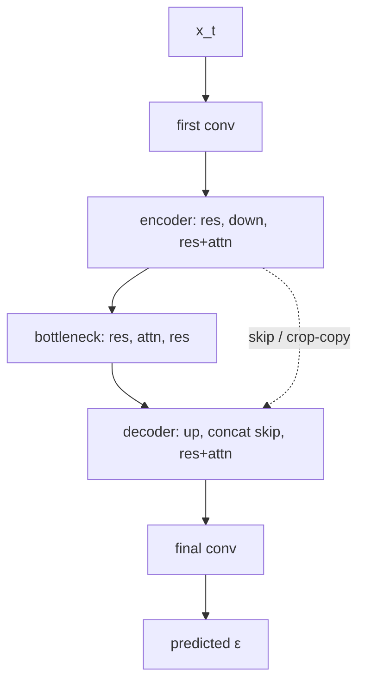

**Skips:** a slice of encoder features (fine detail) is **cropped and concatenated** onto the **same-scale** decoder map, then upsampling continues.

Simplified picture from the slides: noisy $x_t$ → encoder block → bottleneck → decoder → concat of the last skip → final convolution → $\varepsilon$.

---

## Inside a residual block

Input feature map $H$ has shape **$B\times C\times H\times W$** (batch, channels, spatial height/width).

| Step | Operation |
|------|-----------|
| 1 | **GroupNorm** → $\hat H$ |
| 2 | **SiLU** → $A$. Formula: $\mathrm{SiLU}(x)=x\cdot\sigma(x)$ ($\sigma=$ sigmoid) |
| 3 | **Conv 1** → $H_1$ |
| 4 | **Time projection:** sinusoidal $\mathrm{TE}(t)$, then $v_t = W_t\,\mathrm{TE}(t)$ with **learned linear** $W_t$ |
| 5 | $H_2 = H_1 + v_t$ |
| 6 | GroupNorm($H_2$) → $H_3$ |
| 7 | SiLU($H_3$) → $H_4$ |
| 8 | **Conv 2** → $H_5$ |
| 9 | **Residual:** $H_{\mathrm{out}} = H + H_5 = H + F(H)$ |

$F(H)$ is the learned transformation through the block; adding $H$ is the skip **inside** the res block. **That is how $t$ is wired into the architecture.**

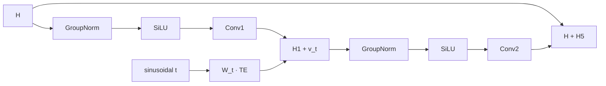

---

## Self-attention (why convolution is not enough)

A convolution sees only a **local neighborhood**. Denoising a **left eye** may need the **right eye** across the face. Self-attention can pull **distant** but relevant pixels.

Feature map $X$ with spatial size $H\times W$ and $C$ channels. Build **query, key, value**:

$$
Q = X W_Q,\quad K = X W_K,\quad V = X W_V
$$

$W_Q,W_K,W_V$ are **learned**. Attention weights and output:

$$
A = \mathrm{softmax}\left(\frac{Q K^\top}{\sqrt{d}}\right), \qquad Y = A V
$$

$d$ is the key dimension (scale is a **scalar** divide). This is how self-attention is used in the DDPM U-Net for noise prediction.

---

## Recap

- Original U-Net → segmentation; DDPM U-Net → **$\varepsilon_\theta(x_t,t)$**.  
- Modifications: **sinusoidal time embeddings**, **residual blocks** (time added after conv1), **self-attention**.  
- $t$ matters because it **encodes noise level**.  
- Encoder / bottleneck / decoder all mix res ± attention; skips restore detail.  
- Next lecture flagged: **classifier-guided** diffusion.

### Key takeaways

- U-Net is the DDPM denoiser: global structure + skips for fine detail.  
- $\mathrm{TE}(t)$ uses $\sin/\cos$ of $t/10000^{2i/d}$; the $t=100$, $d=8$ vector is the exam-style drill.  
- Residual path: GroupNorm → SiLU → conv → **add $W_t\mathrm{TE}(t)$** → GroupNorm → SiLU → conv → **$H+F(H)$**.  
- Attention: $Q,K,V$ projections, softmax$(QK^\top/\sqrt{d})$, then $AV$, so far-apart structure (two eyes) can interact.

---


\newpage

# L50: Classifier-guided diffusion model

**Video:** [Lec 50](https://www.youtube.com/watch?v=tDFtVtmwuxo) · 37:35  
**Instructor in this lecture:** Prof. Ashwini Kodipalli

### Learning objectives

- Explain why an unconditional DDPM cannot choose a class (dog vs cat vs flower).
- Describe the **artist + critic** pair: a denoising U-Net plus a **noisy-image classifier**.
- Reconstruct the Bayes / score derivation that turns a classifier gradient into a **guided noise** $\hat{\varepsilon}$.
- State the **guidance scale** $s$ trade-off (class precision vs diversity) and the sampling replacement rule.
- List the pipeline limitations that motivate classifier-free guidance in the next lecture.

### Agenda (as stated in lecture)

1. Motivation for classifier-guided diffusion  
2. What the method is (core idea + paper)  
3. Mathematical formulation  
4. Guidance scale  
5. Sampling equation  
6. Limitations  

This lecture is **not** classifier-free guidance (Lec 51) and **not** Stable Diffusion (Lec 52).

---

## Why unconditional DDPM has no class control

A standard DDPM learns the data distribution and can emit realistic images, but it has **no control over which class** comes out. Feed in noise; the reverse process may produce a cat, a car, a dog, or a bird. If the requirement is “only dog images” (or even a specific breed), that is not guaranteed.

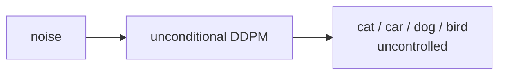

A **guidance mechanism** is required so the model knows *what* to generate, not only *how* to denoise.

---

## Core idea and paper

**Core idea (lecture metaphor):** take a generative model that already knows how to create images from noise, and give it a **GPS / steering wheel** that steers generation toward a chosen category.

The method was introduced in **Dhariwal & Nichol**, *Diffusion Models Beat GANs on Image Synthesis*, **NeurIPS 2021**.

### Two components

| Role | What it is | What it does |
|------|------------|--------------|
| **Artist** | Ordinary **unconditional** DDPM / U-Net | Denoises a noisy image toward something realistic. It does **not** know which class to emit. |
| **Critic** | A **classifier**, itself a pretrained network | Looks at the *noisy* image $x_t$ and predicts $p_\phi(y \mid x_t)$ over classes (cats, dogs, trees, houses, …). |

$\phi$ denotes the classifier’s parameters.

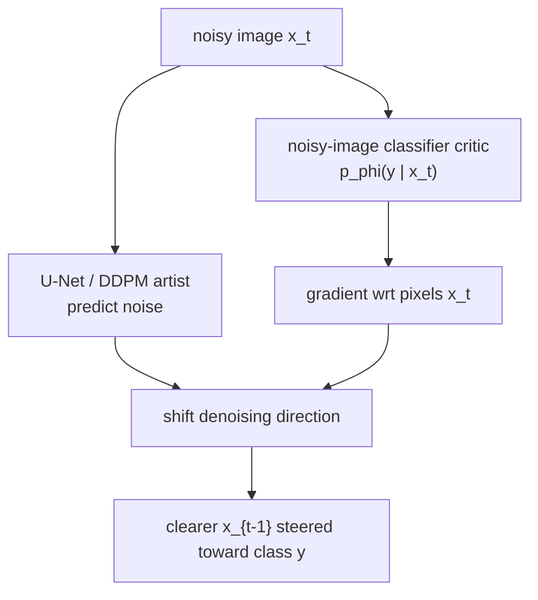

---

## Artist–critic loop (intuition)

At each reverse step:

1. The **artist** takes a small step to remove noise.  
2. The **critic** looks at the slightly clearer image and computes the **gradient of the class score with respect to image pixels**:

$$
\nabla_{x_t} \log p_\phi(y \mid x_t)
$$

3. That gradient says *how to change pixels* so that the probability of the target class (lecture running example: **dog**, $y = \text{dog}$) goes up.  
4. The diffusion model **shifts its denoising trajectory** along that gradient. Generation is oriented toward class $y$.

The classifier must be trained on **noisy** images $x_t$ at many noise levels (the lecture’s jumping-dog example: clean dog plus several noisy versions, all labeled “dog”). A classifier trained only on **clean** photos will not give a usable gradient during reverse diffusion, because the critic only ever sees noisy $x_t$, never a clean $x_0$, until the end.

---

## Guidance scale $s$

The **guidance scale** $s$ is the **strength** with which the classifier gradient is added to the denoiser.

| $s$ | Class recognizability | Sample diversity |
|-----|------------------------|------------------|
| Small | Weak conditioning; images may not look like the target class | Higher diversity |
| Large | Strong, precise class (very “dog-like”) | Diversity **drops** |

There is an explicit **precision–diversity trade-off**. Too large $s$ yields accurate dogs but similar dogs. An **optimal** $s$ is a compromise; the lecture does not prescribe a single numeric default here (paper figures use specific values below).

---

## Reverse process without class, then with a perturbation

Unconditional DDPM reverse transition (no $y$ in the formula):

$$
p_\theta(x_{t-1} \mid x_t) = \mathcal{N}\!\bigl(x_{t-1};\; \mu_\theta(x_t, t),\; \Sigma_\theta(x_t, t)\bigr)
$$

starting from $x_T$ and walking down to $x_0$. Conditioning is visible in an equation **only if $y$ appears**.

To steer that trajectory: **perturb** the reverse denoising path with the **classifier gradient**. Sampling still uses a trained unconditional DDPM; the extra signal is the critic’s $\nabla_{x_t} \log p_\phi(y \mid x_t)$.

### Sampling-time picture (as drawn in lecture)

1. Give $x_t$ to the U-Net; it predicts noise $\varepsilon_\theta(x_t, t)$.  
2. Subtracting that noise would give the usual slightly cleaner image.  
3. Independently, take $\nabla_{x_t} \log p_\phi(y \mid x_t)$ from the classifier on the **same** $x_t$.  
4. **Add** that gradient into the update so the next image is both cleaner **and** more like class $y$.

---

## Mathematical formulation

The target reverse distribution is **class-conditional on the noisy image**:

$$
p(x_t \mid y)
$$

—probability of observing noisy $x_t$ given class $y$ (dog).

### Bayes

$$
p(x_t \mid y) = \frac{p(y \mid x_t)\, p(x_t)}{p(y)}
$$

Take $\log$:

$$
\log p(x_t \mid y) = \log p(x_t) + \log p(y \mid x_t) - \log p(y)
$$

$p(y)$ does **not** depend on $x_t$, so its gradient wrt $x_t$ is zero. Differentiate:

$$
\nabla_{x_t} \log p(x_t \mid y)
= \nabla_{x_t} \log p(x_t)
+ \nabla_{x_t} \log p_\phi(y \mid x_t)
$$

This is the **key equation** of classifier guidance.

| Term | Role (lecture reading) |
|------|-------------------------|
| $\nabla_{x_t} \log p(x_t)$ | Makes the image **realistic** (no class $y$) |
| $\nabla_{x_t} \log p_\phi(y \mid x_t)$ | Pushes toward the **target class** (dog) |

### Unconditional score as predicted noise

In ordinary DDPM the first term is the **diffusion score**, written in the lecture as a constant times the U-Net noise prediction:

$$
\nabla_{x_t} \log p(x_t)
= -\frac{1}{\sqrt{1-\bar{\alpha}_t}}\, \varepsilon_\theta(x_t, t)
$$

with the usual cumulative product

$$
\bar{\alpha}_t = \prod_{i=1}^{t} \alpha_i
$$

—the **fraction of original signal remaining** after $t$ forward steps.

Substitute:

$$
\nabla_{x_t} \log p(x_t \mid y)
= -\frac{1}{\sqrt{1-\bar{\alpha}_t}}\, \varepsilon_\theta(x_t, t)
+ \nabla_{x_t} \log p_\phi(y \mid x_t)
$$

$\varepsilon_\theta$ is the **old, unconditioned** noise. The extra gradient produces a **new** noise oriented toward class $y$.

### Guided noise $\hat{\varepsilon}$

Identify the left-hand side with the same score form but a **new** noise that depends on $y$:

$$
\nabla_{x_t} \log p(x_t \mid y)
= -\frac{1}{\sqrt{1-\bar{\alpha}_t}}\, \hat{\varepsilon}(x_t, y)
$$

Multiply through by $-\sqrt{1-\bar{\alpha}_t}$ and insert the **guidance scale** $s$ on the classifier term (lecture: “classifier-guided noise prediction equation”):

$$
\hat{\varepsilon}(x_t, y)
= \varepsilon_\theta(x_t, t)
- s\,\sqrt{1-\bar{\alpha}_t}\, \nabla_{x_t} \log p_\phi(y \mid x_t)
$$

Removing $\hat{\varepsilon}$ instead of $\varepsilon_\theta$ steers the reverse path toward $y$.

- Small $s$: diverse images, **weak** class match.  
- Large $s$: strong class match, **less** diversity.

---

## Sampling equation

**Rule:** in the usual DDPM reverse update, **replace** the standard noise estimate with the guided $\hat{\varepsilon}$.

The lecture writes the reverse step in the “predict $x_0$ then mix with noise” form (same $\hat{\varepsilon}$ in both places):

$$
x_{t-1}
= \sqrt{\bar{\alpha}_{t-1}}
\left(
\frac{x_t - \sqrt{1-\bar{\alpha}_t}\,\hat{\varepsilon}}{\sqrt{\bar{\alpha}_t}}
\right)
+ \sqrt{1-\bar{\alpha}_{t-1}}\,\hat{\varepsilon}
$$

(At the last step the usual DDPM extra Gaussian draw is omitted; that detail is used in the reverse-process lab, Lec 53.)

### Paper figure (Pembroke Welsh Corgi)

From Dhariwal & Nichol: classifier guidance on class **Pembroke Welsh Corgi**.

- Smaller $s$ (lecture: **$s=1$**): not very convincing class images.  
- Larger $s$ (lecture: **$s=10$**, corrected from a spoken “100”): consistent images of that class.

---

## Limitations

1. **Extra classifier**, trained specifically on **noisy** $x_t$ at the diffusion time steps (gradients needed at every $t$). Two trainings: unconditional DDPM **and** the noisy classifier.  
2. **Off-the-shelf ImageNet classifiers** (e.g. **ResNet** on clean images) **do not work**.  
3. **Complex pipeline:** two separate networks (U-Net + classifier).  
4. **Sampling cost:** classifier gradients at **every** $t$.  
5. **Adversarial vulnerability:** the reverse process can create **artifacts** that score high for the target class but look artificial / not human-like.

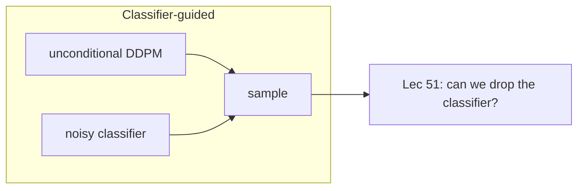

---

### Key takeaways

- Unconditional DDPM generates realistic images with **no class knob**.  
- Classifier guidance adds a noisy-image critic; $\nabla_{x_t}\log p_\phi(y\mid x_t)$ steers denoising toward $y$.  
- Bayes splits the conditional score into a **realism** term (U-Net $\varepsilon_\theta$) and a **class** term (classifier).  
- Guided noise $\hat{\varepsilon}$ replaces $\varepsilon_\theta$ in the reverse update; $s$ trades **precision vs diversity**.  
- Cost: a second network, noisy-label training, per-step gradients, and adversarial artifacts. Next lecture: **classifier-free** guidance.

---


\newpage

# L51: Classifier-free diffusion models

**Video:** [Lec 51](https://www.youtube.com/watch?v=sf35xeS7i2Y) · 20:36  
**Instructor in this lecture:** Prof. Ashwini Kodipalli

### Learning objectives

- Restate why classifier-guided diffusion is heavy (extra noisy classifier, no off-the-shelf ResNet).
- Explain **classifier-free guidance (CFG)**: one U-Net trained for **both** conditional and unconditional denoising.
- Write the CFG noise combination with guidance scale $s$.
- Contrast sampling cost: U-Net **+ classifier** vs **two U-Net passes**.

### Agenda (as stated in lecture)

Motivation → CFG concept → **joint training** → math → sampling → comparison table vs classifier guidance.

---

## Motivation: drop the external classifier

Lec 50’s limitations, restated as the reason for CFG:

| Problem | Why it hurts |
|---------|----------------|
| Extra classifier | Must be trained **on noisy images** $x_t$ to supply $\nabla_{x_t}\log p(y\mid x_t)$ |
| No ImageNet ResNet | Off-the-shelf nets saw **clean** pixels, not $x_t$ |
| Two trainings | Unconditional DDPM **and** the classifier → slower, more complex pipeline |

**Question of this lecture:** can we get similar **class-conditioned** generation **without** an explicit classifier?

**Paper:** Jonathan Ho and the Google Research Brain Team, *Classifier-Free Diffusion Guidance*, **NeurIPS workshop 2022**.

---

## Core idea

- Conditional generation **without** a separate critic.  
- A **single** diffusion U-Net is trained to do **conditional and unconditional** generation **at the same time**.  
- Guidance comes from the **difference** between those two denoising scores—not from $\nabla \log p_\phi(y\mid x_t)$.

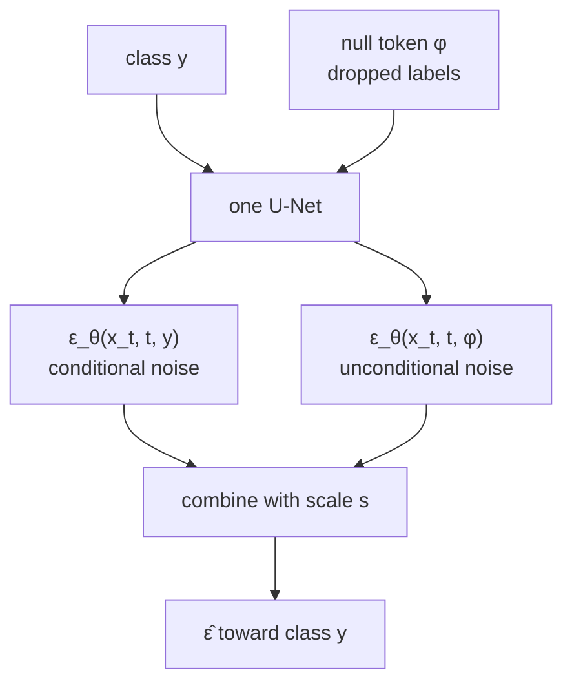

---

## Joint training of one network

The same network sees two kinds of example:

**Conditional path.** Supply class labels $y$. The network outputs a **conditional** noise / score that depends on $(x_t, t, y)$:

$$
\varepsilon_\theta(x_t, t, y)
$$

**Unconditional path.** Drop class labels with a **fixed probability** (lecture: on the order of **10–20%** of the data). Replace $y$ by a **null token** $\phi$ that means “no conditioning.” The same network then outputs

$$
\varepsilon_\theta(x_t, t, \phi)
$$

$\phi$ is **not** a class; it is the **absence** of class information. One set of U-Net weights therefore learns both scores. Their **difference** is what steers generation toward a chosen class.

---

## Mathematical formulation

In classifier guidance the missing piece was the classifier term $p(y \mid x_t)$. CFG **rewrites that probability using the diffusion model itself**.

Bayes:

$$
p(y \mid x_t) = \frac{p(x_t \mid y)\, p(y)}{p(x_t)}
$$

$$
\log p(y \mid x_t) = \log p(x_t \mid y) + \log p(y) - \log p(x_t)
$$

$p(y)$ is constant wrt $x_t$, so its gradient vanishes. The classifier gradient then becomes a combination of a **conditional** score $\nabla_{x_t}\log p(x_t \mid y)$ and an **unconditional** score $\nabla_{x_t}\log p(x_t)$—the two quantities the jointly trained U-Net already estimates.

**Punchline:** CFG **approximates the classifier gradient using only the diffusion model**. No external $p_\phi$.

### Guided noise (as written in lecture)

The instructor does not re-derive every algebra step; the sampling noise is given as a **combination** of conditional and unconditional predictions, with guidance scale $s$:

$$
\hat{\varepsilon}(x_t, t, y)
= (1+s)\,\varepsilon_\theta(x_t, t, y)
- s\,\varepsilon_\theta(x_t, t, \phi)
$$

- $\varepsilon_\theta(x_t, t, y)$: noise from the **conditional** training path.  
- $\varepsilon_\theta(x_t, t, \phi)$: noise from the **unconditional** path ($y$ replaced by $\phi$).  
- $s$: how hard to push toward the condition (same precision–diversity tension as Lec 50).

Equivalently, this is a weighted mix of “noise with class” and “noise without class.” Removing $\hat{\varepsilon}$ in the reverse process steers samples toward $y$.

---

## Sampling / training recipe (as listed)

1. Sample training pairs **with** class labels from the dataset.  
2. **Randomly discard** the label on a fraction of examples; replace with $\phi$.  
3. Train **one** network on both conditional and unconditional examples.  
4. At generation time, form $\hat{\varepsilon}$ from the two forward passes and denoise as in DDPM.

The network has learned to guide itself toward a class **without a classifier**.

### Paper figure

From Ho et al.: **left** = non-guided samples (not convincing); **right** = CFG with **$s = 3$** (class is clear; lecture notes some **color saturation**). Same source: NeurIPS workshop 2022.

---

## Classifier-guided vs classifier-free

| | **Classifier-guided** (Lec 50) | **Classifier-free (CFG)** |
|--|-------------------------------|---------------------------|
| Separate classifier | Yes | **No** (main advantage) |
| Noisy-classifier training | Yes | Not required |
| Where the guidance signal comes from | Classifier gradient $\nabla_{x_t}\log p_\phi(y\mid x_t)$ | **Difference** of conditional vs unconditional scores |
| Sampling-time cost | U-Net **plus** classifier, both run while generating | **Two U-Net passes** (conditional and unconditional) per step |

Why two U-Net passes: there is no critic, but each reverse step still needs **both** $\varepsilon_\theta(\cdot, y)$ and $\varepsilon_\theta(\cdot, \phi)$ to form $\hat{\varepsilon}$. The lecture also describes training as seeing each image in both roles (with $y$ and with $\phi$).

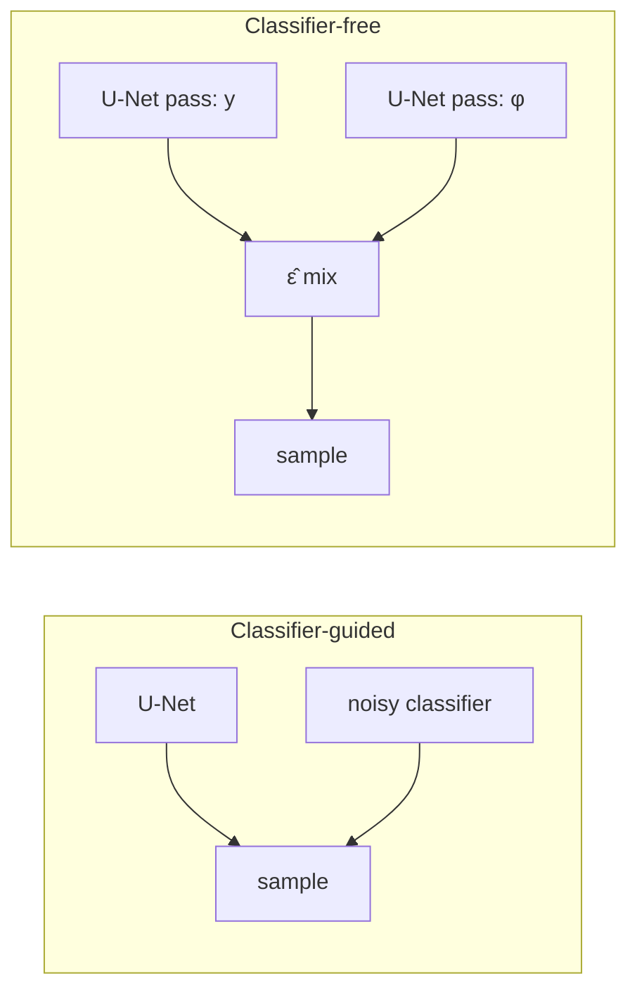

---

### Key takeaways

- CFG exists to **delete the noisy classifier** while keeping class control.  
- One U-Net, **joint** training: keep $y$ or replace it by null $\phi$ with fixed dropout probability.  
- The old classifier gradient is rewritten as **conditional minus unconditional** diffusion scores.  
- $\hat{\varepsilon}=(1+s)\varepsilon_\theta(x_t,t,y)-s\varepsilon_\theta(x_t,t,\phi)$; larger $s$ (paper demo $s=3$) sharpens class at some cost (saturation / diversity).  
- Sampling trades classifier cost for **two U-Net evaluations**. Next lecture: **Stable Diffusion**.

---


\newpage

# L52: Stable Diffusion model

**Video:** [Lec 52](https://www.youtube.com/watch?v=8xZqIo3BZgE) · 36:02  
**Instructor in this lecture:** Prof. Ashwini Kodipalli

### Learning objectives

- Motivate **latent** diffusion: why pixel-space DDPM on $512\times 512\times 3$ is too expensive.
- Separate **latent diffusion (LDM)** (the algorithm) from **Stable Diffusion** (text-to-image implementation).
- Trace the frozen autoencoder → noisy latent → U-Net → decoder pipeline and the latent-space MSE objective.
- Write **cross-attention** with $Q$ from U-Net maps and $K,V$ from a **CLIP** text encoder.
- Choose **concatenation vs cross-attention** from whether the condition has spatial structure.

### Agenda (as stated in lecture)

Motivation → latent diffusion intro → LDM training pipeline → LDM objective → Stable Diffusion pipeline → cross-attention → conditioning modalities → advantages vs DDPM.

This is the **last image-generation / diffusion theory** video in the series. Transformer encoder internals are **not** taught here (text encoder is used as a frozen CLIP module).

---

## Motivation: DDPM in pixel space is expensive

In DDPM, forward and reverse diffusion run on the **full high-dimensional image**. Every pixel is noised and denoised.

$$
x \in \mathbb{R}^{H \times W \times 3}
$$

($H,W$ = height/width; $3$ = RGB). A **$512\times 512\times 3$** image has

$$
512 \times 512 \times 3 = 786{,}432
$$

pixel values. Those must be processed at **every** denoising step. Diffusion already uses **hundreds** of reverse steps, so inference is slow.

Stated problems: **high memory**, **high compute**, **slow inference**.

**Idea:** compress the image to a **latent** that keeps the important structure and drops irrelevant detail, then run diffusion **in that latent**.

**Paper:** Rombach et al., *High-Resolution Image Synthesis with Latent Diffusion Models*, **CVPR 2022**.

| Name | What it is |
|------|------------|
| **Latent diffusion model (LDM)** | The **algorithm** in that paper |
| **Stable Diffusion** | A **practical** LDM implementation for **text-to-image**, with extra **conditioning** |

For a $512\times 512$ image the lecture’s latent is **$64\times 64\times 4$** (much smaller than $786{,}432$ pixels). Diffusion happens on that latent, not on RGB.

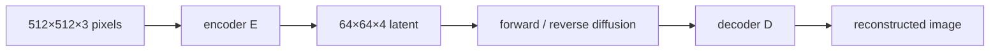

---

## Latent diffusion training pipeline

1. Input image $x$ goes through an **autoencoder**. Latent $z = E(x)$.  
2. The autoencoder is **trained first, then frozen**. While the diffusion model trains, **$E$ and $D$ are not updated**.  
3. $z$ goes through **forward diffusion** → **noisy latent** (latent analogue of DDPM’s noisy image).  
4. **U-Net** reverse-denoises and **predicts the noise** in latent space → **clean latent**.  
5. Frozen **decoder** $D$ maps the clean latent to $\hat{x}$ (generated / reconstructed image).

```mermaid
flowchart TB
    X["image x"] --> E["frozen encoder E"]
    E --> Z["latent z"]
    Z --> FWD["forward diffusion"]
    FWD --> ZT["noisy latent z_t"]
    ZT --> UNET["U-Net: predict noise"]
    UNET --> ZC["clean latent"]
    ZC --> D["frozen decoder D"]
    D --> XH["image x̂"]
```

Noisy latent $\Leftrightarrow$ DDPM noisy image, but in compressed coordinates.

---

## Latent diffusion objective

Same shape as the DDPM noise-matching loss, **applied to latents** instead of pixels:

$$
L = \mathbb{E}\bigl\| \varepsilon - \varepsilon_\theta(z_t, t) \bigr\|^2
$$

| Symbol | Meaning |
|--------|---------|
| $\varepsilon$ | Gaussian noise added in the **forward** process |
| $z_t$ | **Noisy latent** at time $t$ |
| $\varepsilon_\theta(z_t, t)$ | U-Net prediction — depends on **$z_t$ and $t$**, **not** on pixel $x_t$ |

The network predicts noise in **latent** space.

---

## Stable Diffusion pipeline (text → image)

Stable Diffusion = LDM **plus text conditioning**.

1. **Text prompt** $y$ (e.g. a caption).  
2. **Text encoder:** a **pretrained CLIP** text encoder, used so the model can read the **semantic meaning** of the prompt.  
3. **Text embeddings** (networks do not ingest raw strings). Lecture notation:

$$
c = \tau_\theta(y)
$$

vectors that store the prompt’s meaning as numbers. These embeddings **condition** image generation.

4. Embeddings enter the U-Net through a **cross-attention** block — the **bridge** between language and the latent diffusion path.  
5. U-Net sees **noisy latent** $z_t$ (DDPM’s noisy image, in latent space), predicts noise, yields a cleaner latent.  
6. **Frozen decoder** reconstructs the image.

```mermaid
flowchart LR
    Y["prompt y"] --> CLIP["CLIP text encoder"]
    CLIP --> C["embeddings c = τ_θ(y)"]
    C --> XA["cross-attention"]
    ZT["noisy latent z_t"] --> UNET["U-Net"]
    XA --> UNET
    UNET --> ZC["clean latent"]
    ZC --> D["frozen decoder"]
    D --> IMG["generated image"]
```

---

## Cross-attention: $Q$ from the image, $K,V$ from text

Attention always uses **query, key, value**.

**Query (from the image / U-Net):**

$$
Q = W_Q^{i}\, \varphi_i(z_t)
$$

- $W_Q^{i}$: learnable weights at U-Net layer $i$  
- $\varphi_i(z_t)$: feature map of that layer, flattened into an $N\times d$ intermediate representation  

**Key and value (from text embeddings):**

$$
K = W_K^{i}\, \tau_\theta(y), \qquad
V = W_V^{i}\, \tau_\theta(y)
$$

Because $Q$ comes from one sequence (U-Net features) and $K,V$ from another (text), this is **cross-attention**. If $Q,K,V$ all came from the same sequence it would be **self-attention**.

Standard weights:

$$
\mathrm{Attention}(Q,K,V) = \mathrm{softmax}\!\left(\frac{QK^{\top}}{\sqrt{d}}\right) V
$$

$\sqrt{d}$ is the (scalar) key dimension scale.

### Why cross-attention is required

Prompt example: **“a yellow butterfly sitting on a purple flower.”**

Different **regions of the latent** need different **words**:

| Latent region | Must receive |
|---------------|----------------|
| Butterfly | “butterfly” + **yellow** |
| Flower | “flower” + **purple** |
| Background | remaining context |

Without attending text into spatial features, those details do not land in the right places. Cross-attention at **several U-Net resolutions** is called out as a **main innovation** of the LDM paper (skip connections still carry fine spatial detail that encoding might drop).

---

## Three blocks of the LDM / Stable Diffusion figure

The lecture walks the paper diagram as **pixel space** (pink), **latent space** (green), and a **conditioning** block.

### Pixel space

- Encoder $E$: $x \mapsto z$  
- After diffusion in latent space, decoder $D$ reconstructs $\tilde{x}$ / $\hat{x}$

### Latent space

- **All** forward and reverse diffusion lives here.  
- Gaussian noise is added **progressively** to $z$ until $z_T$ at $t=T$.  
- Denoising U-Net predicts $\varepsilon_\theta$; **skip connections** restore fine detail.  
- **Cross-attention at several resolutions** injects conditioning (text or other).

### Conditioning block

Stable Diffusion’s headline use is **text → image**, but the architecture supports **several modalities**:

| Condition | Lecture example |
|-----------|-----------------|
| **Text prompt** | “cat sitting on a red carpet” |
| **Semantic map** | labeled regions (dog, cats) → image |
| **Image** | e.g. **black-and-white → color** (image-to-image) |

Conditioning is injected in **two** ways; a **switch** in the diagram picks one from the application.

| Method | When |
|--------|------|
| **Concatenation** | Condition has **spatial** structure: segmentation map, low-res image, another image |
| **Cross-attention** | **Text embeddings** — **no** spatial dimensions |

Text-to-image → cross-attention. Image-to-image → concatenation. The switch is “use concat **or** cross-attention depending on the job.”

```mermaid
flowchart TB
    COND["condition: text / map / image"] --> SW{"switch"}
    SW -->|"spatial (map, image)"| CAT["concatenate into U-Net"]
    SW -->|"text embeddings"| XA["cross-attention Q←image, K V←text"]
    CAT --> UNET[U-Net in latent]
    XA --> UNET
```

---

## Advantages over pixel-space DDPM

Lecture metaphor: DDPM adds Gaussian noise to a **full-resolution photograph**. Stable Diffusion first compresses that photo to a compact **blueprint** (latent: important structure, unimportant detail removed), **noises the blueprint**, then **cleans the blueprint** step by step and **decodes** to pixels.

Fewer coordinates in the reverse process → **lower computational cost** and faster inference than denoising all $786{,}432$ RGB values at every step.

---

## Text-to-image examples (paper, LAION 1.45B)

Same prompt can yield **different** valid images on different runs. Lecture examples:

- “a street sign that reads latent diffusion”  
- “a zombie in the style of Picasso”  
- “image of an animal half mouse, half octopus”  
- “illustration of slightly conscious neural network”  

---

### Key takeaways

- LDM moves DDPM from pixels into a **frozen autoencoder’s latent** ($64\times 64\times 4$ vs $512\times 512\times 3$).  
- Stable Diffusion **is** that algorithm plus **CLIP text embeddings** and **cross-attention** into the U-Net.  
- Loss is DDPM’s noise MSE on **$z_t$**, not $x_t$.  
- $Q$ from U-Net maps, $K$ and $V$ from $\tau_\theta(y)$; concat is for **spatial** conditions.  
- Next in the playlist is the **reverse-diffusion lab**; the instructor also flags the coming shift to **NLP / transformers / LLMs**.

---


\newpage

# L53: Hands-on reverse diffusion process

**Video:** [Lec 53](https://www.youtube.com/watch?v=b1lFJ8_zEdQ) · 37:26  
**Instructor in this lecture:** lab / TA session (part 2 of the diffusion notebook; Debarpan’s reverse-denoising track from the course intro)

### Learning objectives

- Implement reverse DDPM sampling from $\mathcal{N}(0,I)$ with a **small class-conditional U-Net** on **MNIST**.
- Train with **$L_{\mathrm{simple}}$** (MSE on Gaussian noise) and **null-class dropout** for classifier-free guidance.
- Compare **guidance scales** and a tiny **quality classifier** on generated digits.
- Contrast diffusion vs **GAN** vs **VAE** using the lecture’s table (tendencies, not universal laws).

### What this notebook covers (stated up front)

Reverse-diffusion intuition · full DDPM training pipeline · small U-Net for MNIST · noise-prediction loss · sampling from Gaussian noise · classifier guidance vs **classifier-free** guidance · gradient-weight experiments · visual quality · qualitative **diffusion vs GANs vs VAEs**.

This is **part 2**. Part 1 was the **forward** process (clean image → incremental noise → Gaussian). Fast Colab settings are intentional; this is **not** a production sampler.

---

## Reverse-process intuition

**Forward (part 1):** $x_0$ is destroyed step by step until $x_t$ is (approximately) Gaussian noise.

**Reverse (this lab):** generation **starts from** that Gaussian and repeatedly estimates a **less noisy** state. At each $t$ the network predicts the noise to subtract:

$$
\varepsilon_\theta(x_t, t, y)
$$

given current noisy image $x_t$, time $t$, and optional class $y$. $\theta$ = U-Net weights. Iterate until $x_0$.

```mermaid
flowchart LR
    XT["x_T ~ N(0,I)"] --> UNET["U-Net ε_θ(x_t, t, y)"]
    UNET --> XM["x_{t-1} less noisy"]
    XM --> UNET
    XM --> X0["x_0 digit-like image"]
```

---

## DDPM reverse equations (as used in the notebook)

The reverse **mean** $\mu_\theta(x_t,t)$ is parameterized by the **same** $\varepsilon_\theta$ and by schedule coefficients $\alpha_t$, $\beta_t$. Sample quality tracks how well $\varepsilon_\theta$ predicts the forward noise.

A reverse draw:

$$
x_{t-1} = \mu_\theta(x_t, t) + \sqrt{\tilde{\beta}_t}\, z, \qquad z \sim \mathcal{N}(0,I)
$$

with $\tilde{\beta}_t$ the usual posterior variance. **At the final step no extra random noise is added** — you want a clean image.

---

## Diffusion schedule (fast mode)

Production models may use more elaborate / faster schedules. Here:

| Setting | Value in the notebook |
|---------|------------------------|
| Time steps $T$ | **100** (`fast_mode=True`; set `False` to increase $T$) |
| $\beta$ schedule | **Linear**, $\beta$ from **0** to **0.02** |
| $\alpha_t$ | $1-\beta_t$ |
| Also computed | $\bar{\alpha}_t$, posterior variance |

**Plot to observe:** $\alpha$ starts at **1** and falls; $\beta$ starts at **0** and rises with $t$.

### Helpers reused from the forward lab

- `extract`: reshape schedule coefficients to **image shape** for broadcast multiply.  
- `q_sample`: sample a noisy image from the closed-form posterior $q(x_t \mid x_0)$ (same function as part 1).

---

## Dataset: MNIST (small on purpose)

Scale up to “real-looking” datasets later; MNIST keeps the tutorial short.

| Split | Size |
|-------|------|
| Train | **12,000** |
| Validation | **2,000** |

PyTorch `Dataset` + `DataLoader` (`train_loader`, `val_loader`). Print sizes as a check (12000 / 2000). Display a few digit grids for sanity.

---

## Small class-conditional U-Net

Encoder of conv layers **down** to a bottleneck, then **up**; **skip connections** (ResNet-style) keep local detail.

Extra inputs required to predict noise:

| Condition | Role |
|-----------|------|
| **Time-step embedding** | Current noise level (sinusoidal, like transformer **positional** embeddings) |
| **Class embedding** | Desired digit $y$ |

### Residual conv block (time + class)

Forward path (as narrated / shown as pseudocode):

1. Residual projection of the incoming features.  
2. **GroupNorm** → **SiLU** → $3\times 3$ conv.  
3. Add `condition_projection(condition)` — this is where **time + class** enter (`hidden = hidden + self.condition_projection(condition)`).  
4. GroupNorm → nonlinearity → conv again.  
5. Skip from input features to the block output.

### `SmallConditionalUNet`

- Number of classes for MNIST digits.  
- **`non_null` / null class:** **unconditional** (“free-form”) generation — random MNIST-like digits, **not** forced to be a five. Null class ⇒ no digit guidance.  
- Sinusoidal time embedding + class embedding + encoder / downsampling + bottleneck + decoder / upsampling.  
- Forward: pack time and labels into `condition`; project the noisy image; encoder skips (`skip1`, `skip2`); decoder; output = **predicted noise**.

**Size check:** model `.to(device)`; about **778k** parameters.

**Shape check:** pull `test_images` / labels from `train_loader`; noisy image, predicted noise, and target noise must share **the image shape**.

---

## Training objective and loop

$$
L_{\mathrm{simple}} = \mathbb{E}\bigl\| \varepsilon - \varepsilon_\theta(x_t, t, y) \bigr\|^2
$$

$\varepsilon$ = the Gaussian actually added in the forward process. $\theta$ = U-Net.

**One training step:**

1. Sample a clean image and label.  
2. Sample a random time $t$.  
3. Sample Gaussian noise; `q_sample` → noisy image.  
4. **Occasionally replace the class with the null condition** (needed for **classifier-free** guidance).  
5. Predict noise; **MSE** vs true $\varepsilon$; backprop.

`prepare_training_batch(clean_images, class_labels, drop_probability)` with **drop probability $0.1$**.

### Evaluation helper

- `model.eval()` so gradients are not stored.  
- Move clean images, labels, and time steps to GPU.  
- `q_sample` → noisy image + true noise.  
- `predicted = model(noisy, timesteps, labels)`.  
- `F.mse_loss(predicted, true_noise)`; accumulate.  
- Set the model **back to `train()`** after eval.

### Optimizer / epochs (fast tutorial)

| Choice | Value |
|--------|--------|
| Optimizer | **Adam** |
| Learning rate | **$10^{-3}$** |
| Epochs | **4** |

Per batch: `optimizer.zero_grad()` → `loss.backward()` → `optimizer.step()`. Track **train and val MSE** each epoch (overfitting check).

**Spoken curves:** train MSE **$1.09 \to 0.07$**; validation MSE also falls (lecture: starts near **$0.01$** and is **$0.07$** by the end of the short run). Plot train MSE; optional **save** utility for later reuse.

---

## Reverse sampling: `p_sample`

Start from $x_T \sim \mathcal{N}(0,I)$. At every $t$ call the model and apply the reverse equation until a clean image.

| Mode | What you pass |
|------|----------------|
| **Unconditional** | noisy image, $t$, **null labels** |
| **Conditional** | noisy image, $t$, **class labels** (e.g. digit 5) |

**Classifier-free mix** (what the notebook implements):

$$
\hat{\varepsilon}
= \varepsilon_{\mathrm{uncond}}
+ s\,(\varepsilon_{\mathrm{cond}} - \varepsilon_{\mathrm{uncond}})
$$

Larger $s$ → stronger class push. **Too large $s$ harms image quality** (same trade-off as the theory lectures). Schedule $\alpha_t,\beta_t$ from the closed-form cells; emit the denoised image.

### Digit-7 trajectory demo

- Class **7**, **guidance scale $s=2$**.  
- Reverse from $t=99$ (i.e. start near $T=100$) down to $0$.  
- Left: pure noise. Toward the end: **MNIST-like structure**.  
- With this tiny net / 4 epochs it may **not** look like a crisp 7; the point is the **mechanism**. More iterations, a stronger net, and more training (exercise) make a real digit.

---

## Two guidance stories (theory recap in the notebook)

**Classifier-guided:** a **separate noisy-image classifier** supplies a gradient $\propto \nabla_{x_t}\log p_\phi(y\mid x_t)$.

**Classifier-free (implemented):** train the **same** diffusion model with and without labels; combine

$$
\hat{\varepsilon}
= \varepsilon_{\mathrm{uncond}}
+ \omega\,(\varepsilon_{\mathrm{cond}} - \varepsilon_{\mathrm{uncond}})
$$

($\omega$ = guidance scale, same $s$ as above).

### Gradient-weight grid

Rows = guidance **$0, 1, 2, 4$**. Row $s=0$ is fully unguided.

**What to look at:** class **0** — $s=0$ does not look like zero; last row **does**. Class **2** and **6** are weaker in this tiny run but **trend** toward those shapes as $s$ grows. Treat “train bigger” as homework.

---

## Quantitative-ish quality check

Visual inspection does not scale. Idea: train a small **CNN “quality classifier”** on real MNIST (train split), then see whether it **recognizes generated digits** (test / generated split).

- Very high accuracy on real training digits.  
- On **generated** images this demo uses only **~10** images, so numbers are noisy.  
- Spoken: accuracy about **$0.3$** at guidance **$0$**; **$s=1,2,3$** still show the **trend** that higher guidance → more recognizable digits (no longer free-form).

### Other losses (pointer only)

MSE on $\varepsilon$ is what you train. Other papers: predict **clean $x_0$**, **velocity** parameterization, **SNR-weighted** combinations. Left as further reading.

---

## Diffusion vs GAN vs VAE (broad tendencies)

| | **Diffusion** | **GAN** | **VAE** |
|--|---------------|---------|---------|
| Training signal | Denoising **regression** (MSE) | **Adversarial** game (G vs D) | Reconstruction + **latent regularization** |
| Stability | Relatively **stable** (convex-ish MSE) | **Unstable** (conflicting objectives) | Usually stable |
| Sampling speed | **Iterative** / slow | **One** generator pass | **One** decoder pass |
| Mode coverage | Often **strong** | **Mode collapse** risk | Generally decent coverage |
| Sharpness | Sharp | Sharp | Often **smooth / blurry** |
| Practical cost | Many U-Net calls | Hard adversarial opt. | Reconstruction–quality trade-off |

These are **tendencies**, not universal rules — they depend on implementation.

```mermaid
flowchart TB
    subgraph d [Diffusion]
      N1[noise] --> R[many reverse steps]
      R --> I1[sharp image]
    end
    subgraph g [GAN]
      Z[z] --> G[one generator pass]
      G --> I2[sharp / collapse risk]
    end
    subgraph v [VAE]
      Z2[latent] --> D[one decoder pass]
      D --> I3[often blurrier]
    end
```

---

## Suggested exercises (from the notebook)

1. Vary **guidance** values.  
2. **Remove one U-Net skip**, retrain, watch detail.  
3. Vary **condition drop** probability.  
4. Raise $T$ from **100 → 200**.  
5. Base channels **16 / 32 / 64**.  
6. Reuse the **same initial noise**, change only guidance.  
7. Turn **fast mode off** (more epochs, more steps).  
8. **SNR-weighted** loss vs this MSE.

### Common failure modes

| Symptom | Likely cause |
|---------|----------------|
| Samples stay noisy | Undertrained / too small net / **wrong reverse equation** |
| Every class looks similar | Network **ignores class embedding** |
| Guidance barely matters | Conditional and unconditional $\varepsilon$ **not different yet** |
| Large $s$ → artifacts | Over-guidance; naturalness suffers |
| Loss falls, samples still poor | Noise MSE is a **local** objective; good samples also need capacity, time-step coverage, and a **correct reverse process** |

---

### Key takeaways

- Reverse diffusion repeatedly maps noise toward data; a U-Net mixes global structure with skip-connection detail.  
- Train by predicting known Gaussian noise with **MSE**; condition on **$t$** (noise level) and optionally **$y$**.  
- Null-class dropout + $\varepsilon_{\mathrm{uncond}}+s(\varepsilon_{\mathrm{cond}}-\varepsilon_{\mathrm{uncond}})$ is **classifier-free** guidance. Moderate $s$ helps class adherence; excessive $s$ hurts diversity / adds artifacts.  
- This classroom model **demonstrates the mechanism**; scale data, $T$, channels, and epochs to get convincing digits. That closes the diffusion hands-on pair (forward + reverse).

---


\newpage
