# Volume 06 — NLP, Transformers, and LLMs

**Lec 54–63** · Transcript-grounded notes (notes-2)

These notes follow the official NPTEL lecture videos. They are not the condensed 36-lecture mapping in `notes/`.

---

# L54: Foundations of natural language processing

**Video:** [Lec 54](https://www.youtube.com/watch?v=xPba29DZ0wI) · 32:03  
**Instructor in this lecture:** Prof. Ashwini Kodipalli

### Learning objectives

- Define NLP as mapping human language to something a model can compute, then to an action.
- Walk the pipeline: **raw text → preprocessing → numerical representation → model**.
- Tokenize at word / sentence / **subword** / character granularity; apply stop-word removal and **lemmatization**.
- Contrast **Word2Vec** (local windows, king–queen arithmetic) with **GloVe** (co-occurrence matrix).
- List NLP challenges that motivate **sequential** models in Lec 55 (especially **long-range dependency**).

### Agenda (as stated in lecture)

Introduction → applications → NLP pipeline → text preprocessing → tokenization → stop-word removal → lemmatization → text representations (**Word2Vec**, **GloVe**) → challenges.

**BERT / GPT contextual embeddings** are named and **deferred** until transformers. Traditional one-hot / bag-of-words / TF–IDF are mentioned and **not** developed.

---

## What NLP is

NLP is technology that lets computers **interpret, manipulate, and comprehend human language**. Speech or text is hard for a machine in raw form; NLP turns it into a representation deep models can use, then into a **response or action**.

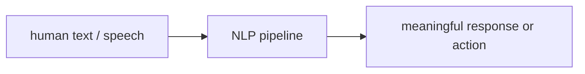

### Input → output → action (lecture table)

| Input | Output | Action / task |
|-------|--------|----------------|
| “Is this email spam?” | Yes | **Spam detection** |
| “The movie was amazing” | Positive | **Sentiment analysis** |
| “Hello” | “Hola” | **Machine translation** |
| “What is generative AI?” | A definition paragraph | **Question answering** |

Whenever a computer processes, understands, or **generates** human-like language, NLP is at work. Named application list: **chatbots**, translation, QA, **summarization**, spam, sentiment — and more.

---

## NLP pipeline

Running example: raw text **“I absolutely love this movie!”**

| Stage | What happens | Example |
|-------|----------------|---------|
| Raw text | User text, or speech converted to text | Full sentence + punctuation |
| **Text preprocessing** | Clean, normalize, drop extras | Content words such as **absolutely / love / movie** |
| **Text representation** | Words → **numerical vectors** (models do not read strings) | Embedding per token |
| Model | Learns patterns from those vectors | Sentiment model |
| Output | Task prediction | **Positive** sentiment |

Preprocessing is described as removing information that is **not needed** so the remaining tokens still encode the sentence’s meaning, at lower compute.

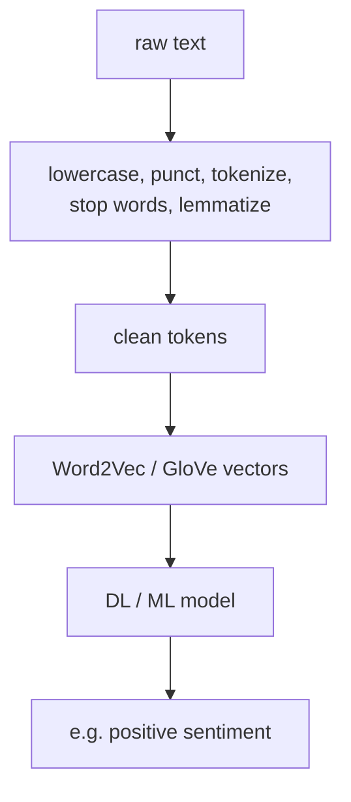

---

## Text preprocessing, step by step

Goal: structured text that models can analyze.

1. **Lowercase** the raw string.  
2. Remove **punctuation and special characters** (little vital information).  
3. **Tokenization** (next section).  
4. **Stop-word removal** — frequent words that add compute without much meaning.  
5. **Lemmatization** — map inflected forms to one **dictionary base (lemma)**.  
6. Result: **clean text**.

**Worked cleaning example.** Raw: “The quick brown foxes are running. Visit https://example.com” plus a smiley and extra punctuation. After preprocessing the lecture keeps the content skeleton **the quick brown fox run** (link, emoji, extras gone; inflected *foxes/running* collapsed).

---

## Tokenization

Split text into smaller units called **tokens**. A token may be a **word**, a **sentence**, a **subword**, or a **character**, depending on the application.

### Word tokenization

Sentence: “I love learning natural language processing.”  
Tokens: `I` | `love` | `learning` | `natural` | `language` | `processing`.

### Sentence tokenization

Paragraph of three sentences (NLP is fascinating / computers understand language / it powers generativity). Each **sentence** is one token.

### Subword tokenization

Word **unbelievable** split into subword pieces (lecture: *un* / *believe* / *able* style pieces). Used in modern LLMs such as **BERT** and **GPT** (details later).

### Character tokenization

Word **NLP** → `N`, `L`, `P`.

**Why tokenize:** raw text becomes smaller units so models can process human language at all.

---

## Stop-word removal

**Stop words:** very frequent items such as **the, is, are, of, and**. They rarely add extra semantics but still become tokens, embeddings, and matmuls — **noise + cost**.

Example: “The students are learning natural language processing”  
→ **students learning natural language processing** (*the*, *are* dropped).

---

## Lemmatization

Convert a word to its **base / dictionary form (lemma)** while keeping meaning.

| Original | Lemma |
|----------|--------|
| running | **run** |
| studies | **study** |
| children | **child** |
| better | **good** (*good / better / best*) |

**Why:** many surface forms share one semantic core (*better/best* → *good*; plural *children* → *child*). After this stage the string is still **text** — representation is next.

---

## Text representation

Machines need **numbers**. Traditional methods (one-hot, bag of words, TF–IDF) are skipped. This lecture’s **modern** slice:

| Family | Methods | This course |
|--------|---------|-------------|
| **Word embeddings** | **Word2Vec**, **GloVe** | Taught now |
| **Contextual embeddings** | **BERT**, **GPT** | After transformers |

Vectors should carry **semantic fingerprints** of the words.

### Word2Vec

**Core idea:** learn from **local context windows**. Vector **length and direction** store meaning.

Classic geometry (origin, 2-D sketch): vectors for **king, queen, man, woman**. Parallelogram / vector arithmetic:

- $\overrightarrow{\text{king}}-\overrightarrow{\text{man}}$ ≈ **male royalty**  
- $(\overrightarrow{\text{king}}-\overrightarrow{\text{man}})+\overrightarrow{\text{woman}} \approx \overrightarrow{\text{queen}}$  

Gender / royalty relations are **linear** in the embedding space. That is the point of Word2Vec in this lecture — not a full skip-gram derivation.

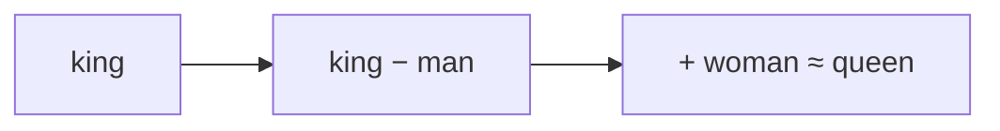

### GloVe

**Core idea:** words that **often occur together** in a large corpus (e.g. **hot** and **coffee**) tend to be semantically related. Learn **dense** embeddings from a **word–word co-occurrence matrix**.

Lecture toy matrix over {king, queen, man, woman} (counts are illustrative):

|  | king | queen | man | woman |
|--|-----:|------:|----:|------:|
| **king** | 0 | 120 | 250 | (low / 80 in the symmetric reading) |
| **queen** | 120 | 0 | 75 | 240 |
| **man** | 250 | 75 | 0 | 110 |
| **woman** | 80 | 240 | 110 | 0 |

Diagonal self-pairs are **0** in the sketch. **High co-occurrence ⇒ stronger semantic relation**; those statistics become GloVe vectors.

---

## Challenges in NLP

| Challenge | Lecture example |
|-----------|-----------------|
| **Discrete** text | *sky* vs *stars*, *red* vs *pink* — relatedness is not obvious from the string |
| **Evolving** language | New dictionary words (lecture: **rizz**) with **no** training corpus |
| **Ambiguity / vagueness** | “Never tasted a pizza like this before” — positive **or** negative |
| **Long-range dependency** | “Animals do not cross the road as it was **tired** or **wide**” — *tired* must bind to *animal*, *wide* to *road* |

Capturing long-range links is called out as **especially important**. It is why the **next** lecture is sequential modeling with **RNNs and LSTMs** (memory of the past).

---

### Key takeaways

- NLP turns language into **clean tokens**, then **vectors**, then a task output (spam, sentiment, translation, QA, …).  
- Preprocessing: lowercase, strip punct, **tokenize**, drop stop words, **lemmatize**.  
- Word2Vec: local windows + vector arithmetic (king − man + woman ≈ queen).  
- GloVe: **co-occurrence** counts → dense embeddings.  
- Discrete, drifting, ambiguous language plus **long-range** binding still break bag-of-features thinking — hence sequence models next. Contextual BERT/GPT embeddings wait for the transformer week.

---


\newpage

# L55: Sequential modeling with RNNs and LSTM

**Video:** [Lec 55](https://www.youtube.com/watch?v=omPaHVk9hrM) · 38:40  
**Instructor in this lecture:** Prof. Ashwini Kodipalli

### Learning objectives

- Motivate sequence models from **word order** (“dog bites man” vs “man bites dog”).
- Distinguish **short-term** vs **long-term** temporal dependence.
- Write the RNN **hidden-state** and **output** updates; map **one-to-one / one-to-many / many-to-one / many-to-many**.
- Explain **vanishing / exploding** gradients and **BPTT** as why vanilla RNNs fail on long gaps.
- Walk LSTM **forget, input, output** gates and the **cell state** highway.

### Agenda (as stated in lecture)

Why sequence models → temporal dependencies → RNNs (architecture + math) → types of RNN → limitations → LSTMs → gates and cell states.

Transformers are **previewed only** as the next video (Lec 56).

---

## Why sequential models

Most real-world language has **inherent order**. Moving a word changes meaning.

| Sentence | Meaning |
|----------|---------|
| The dog bites man | Dog is the biter |
| Man bites dog | Same words, **different** event |

NLP so far (Lec 54): text → **tokens** → **embeddings**. Missing piece: process those vectors **without scrambling order**.

Applications that need order:

- **Next-word prediction** — meaning of previous tokens.  
- **Sentence classification** — e.g. “I love pizza” → positive sentiment.  
- **Translation** (English → German / French / …).

That motivation produced **RNNs** and **LSTMs**.

---

## Temporal dependency

**Temporal dependency:** what a token means depends on **when** (in the sequence) it appears.

### Short-term

“The movie is **not good**.”  
*Good* is flipped by the immediately preceding **not**. Swap to “the movie is good” and sentiment flips. Dependence on the **just previous** word = **short-term**.

### Long-term

“I grew up in **France**. I speak fluent \_\_\_.”  
Most probable fill-in: **French**. *French* relates to *France* with **three** intervening words. The model must **remember earlier** information. That gap is **long-term dependency**.

(If many words sit between two related tokens — 3, 4, 5, 6, … — it is long-term.)

---

## Why a feedforward net is not enough

In a feedforward MLP, information flows **one way**: $x_1,x_2,\ldots$ → hidden layer(s) → output. There is **no memory of previous inputs**. Sequential modeling needs that memory → **recurrent** nets.

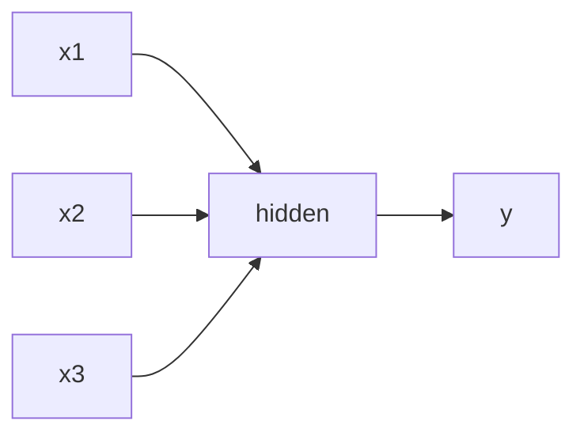

No recurrent arrow: previous $x$ is not stored.

---

## Recurrent neural networks

**Core idea:** do **not** discard the previous token; **carry it forward** in a **hidden state**. The hidden state is the network’s **working memory**.

### Unrolled picture

Time steps $t-1$, $t$, $t+1$. Inputs $x_{t-1}, x_t, x_{t+1}$ are successive words (lecture: “I love pizza” / “I love machine learning”).

| Matrix | Connects |
|--------|----------|
| $U$ | Input $x_t$ → hidden $h_t$ |
| $V$ | **Recurrent:** previous hidden $h_{t-1}$ → current $h_t$ |
| $W$ | Hidden $h_t$ → output $\hat{y}_t$ |

$U,V,W$ are **shared across all time steps**.

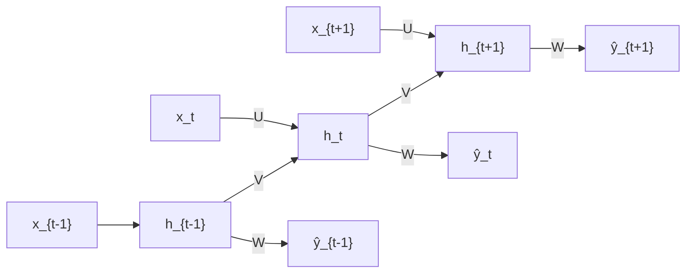

### Hidden-state update

At each $t$, $h_t$ mixes **current input** $x_t$ and **previous memory** $h_{t-1}$:

$$
h_t = \tanh\!\bigl( V h_{t-1} + U x_t + b_h \bigr)
$$

$b_h$ = hidden bias. If $h_t$ is not updated every step, the **immediately preceding** word is lost.

### Output

$$
\hat{y}_t = g(W h_t + b_y)
$$

$g$ depends on the task: **softmax** for multiclass, **sigmoid** for binary. $b_y$ = output bias.

---

## Types of RNN (by input/output arity)

| Pattern | Shape | Lecture application |
|---------|--------|---------------------|
| **One-to-one** | One in, one out | Binary classification (cat vs dog image) — **no** real sequence |
| **One-to-many** | One in, many outs | **Image captioning** (one photo → “sunset near the river”) |
| **Many-to-one** | Many in, one out | **Sentiment** (“I love pizza” → positive) |
| **Many-to-many** | Many in, many outs | **Translation**; **POS tagging** (“I play cricket” → pronoun / verb / noun) |

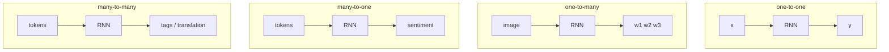

---

## Limitation: long-term memory dies

Example: “My brother lives in **France** and I visit him every summer which is why I understand **French** quite well.”  
*France* and *French* are separated by **11** words. The signal must pass $h_1,\ldots,h_{11}$. Information **weakens** along that chain. Vanilla RNNs **cannot handle long-term dependency**.

### Vanishing and exploding gradients

Training uses **backpropagation through time (BPTT)** — backprop unrolled over the sequence. A small gradient multiplied along many steps **vanishes**; a large one **explodes** (unstable training). That is why RNNs fail on long gaps.

---

## LSTM: add a long-term cell

**Long short-term memory** keeps RNN-style **working memory** (hidden state: recent word) **and** a **cell state** that carries important information **across many steps**.

Gates are **learnable** (small nets). Each learns how much to **retain, update, or expose**.

| Gate | Job |
|------|-----|
| **Forget** | How much of $c_{t-1}$ to keep vs erase |
| **Input** | How much **new** candidate content to write |
| **Output** | How much of the cell to expose as $h_t$ |

Lecture chain: three LSTM cells at $t-1$, $t$, $t+1$. From the previous cell: **cell** $c_{t-1}$ and **hidden** $h_{t-1}$.

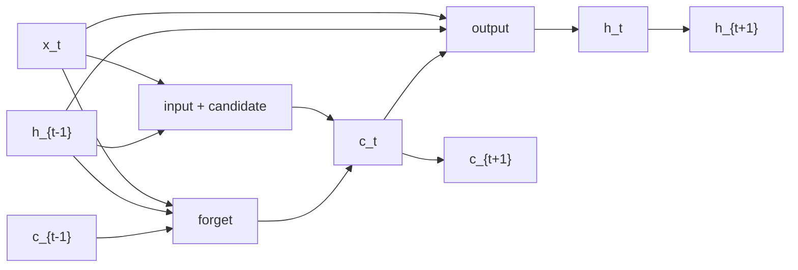

### Forget gate

Concatenate $h_{t-1}$ and $x_t$, then sigmoid:

$$
f_t = \sigma\!\bigl( W_f [h_{t-1}, x_t] + b_f \bigr)
$$

$f_t \in (0,1)$: near **1** ≈ keep almost everything; near **0** ≈ forget. Apply to the old cell:

$$
f_t \odot c_{t-1}
$$

(element-wise product).

### Input gate and candidate cell

$$
i_t = \sigma\!\bigl( W_i [h_{t-1}, x_t] + b_i \bigr)
$$

$$
\tilde{c}_t = \tanh\!\bigl( W_c [h_{t-1}, x_t] + b_c \bigr)
$$

$\tilde{c}_t$ = **new information** proposed from the current input. Mix:

$$
i_t \odot \tilde{c}_t
$$

**New cell state** (forget old + write new):

$$
c_t = f_t \odot c_{t-1} + i_t \odot \tilde{c}_t
$$

### Output gate

$$
o_t = \sigma\!\bigl( W_o [h_{t-1}, x_t] + b_o \bigr)
$$

$$
h_t = o_t \odot \tanh(c_t)
$$

$c_t$ and $h_t$ both pass to time $t+1$; the same gates run again.

$W_f,W_i,W_c,W_o$ and $b_f,b_i,b_c,b_o$ are the gate / candidate parameters.

---

### Key takeaways

- Order is meaning: same bag of words, different sequence, different sentence.  
- Feedforward nets have **no** sequential memory; RNNs store it in $h_t = \tanh(V h_{t-1}+U x_t+b_h)$.  
- RNN patterns match captioning, sentiment, translation / tagging.  
- Long gaps + BPTT → **vanishing / exploding** gradients.  
- LSTM adds **cell state** $c_t$ and three gates so memory can survive many steps.  
- **Still not enough** when dependencies are *very* long → **transformers / attention** in Lec 56.

---


\newpage

# L56: Evolution from LSTMs to transformers

**Video:** [Lec 56](https://www.youtube.com/watch?v=PkK0LcbqPXM) · 42:27  
**Instructor in this lecture:** Prof. Ashwini Kodipalli

### Learning objectives

- Place RNN → LSTM → **attention (2014)** → **transformers (2017)** on the lecture’s timeline.
- Explain why recurrence is expensive for long documents ($O(n)$ sequential steps, memory of every $h_t$).
- Define **encoder–decoder attention** (context $c_t=\sum_j \alpha_{tj}h_j$) and **self-attention** ($Q,K,V$).
- Motivate **multi-head** attention and **causal masks** ($-\infty$ → softmax $0$).
- Contrast RNN/LSTM vs transformers: sequential vs **parallel**, hidden state vs **direct** token links.

### Agenda (as stated in lecture)

Evolution of sequence models → limits of RNN/LSTM → attention → encoder–decoder attention → self-attention → multi-head → masked self-attention → introduction to transformers → RNN/LSTM vs transformers.

**Full transformer block diagrams** (encoder stacks, FFN, residuals) are **next lecture**, not this one. Read *Attention Is All You Need* as assigned homework.

---

## Timeline (as taught)

| When | What |
|------|------|
| ~2013 | **RNNs** in wide NLP use |
| 1997 / adopted ~2014 | **LSTMs** (Hochreiter & Schmidhuber 1997; popular after 2014) |
| **2014** | **Attention** (the ingredient transformers will rest on) |
| **2017** | **Transformers** — NLP landscape changes; leads to **BERT, GPT, LLaMA**, … |

The rest of the lecture is: which RNN/LSTM failures attention + parallel processing fix.

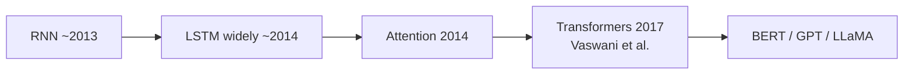

---

## Limits of RNN and LSTM (why attention)

**Example 1.** “The **book** that I brought yesterday from the new bookstore **is** amazing.”  
*Is* agrees with *book*. A recurrent model must thread that link through a **chain of hidden states**

$$
h_t = \tanh(V h_{t-1} + U x_t + b_h)
$$

(same recurrence as Lec 55).

**Example 2.** “The **quick brown** fox” — understanding *brown* requires having processed *quick*; each word still has its own $h_t$.

Two costs:

1. **Memory:** the machine must **hold the sequence of hidden states** so the start of a sentence is still available at the end.  
2. **Long-range path length:** information between distant words travels **$\mathcal{O}(n)$ sequential steps**. A **1,000-word** sequence ⇒ **1,000** sequential operations to carry a token from the front to the back (a paragraph whose first line must bind to a later line). That is slow and fragile for RNNs **and** LSTMs.

---

## Attention: not all hidden states are equal

When predicting a word, do we need **every** previous $h_t$ **equally**? **No.** Nearby words may be almost irrelevant; **relevant** words should get **higher attention weight**.

**Example.** “The **animal** didn’t cross the street because **it** was too tired.”  
*It* refers to **animal**, not *street*. *Didn’t / cross / street / because* should not all share equal weight with *animal*.

**Idea:** replace uniform memory with an **attention score** over the sequence.

---

## Encoder–decoder attention

### Encoder–decoder without attention (baseline)

Encoder compresses the **input sequence** into a single **thought vector**; the decoder generates the output **word by word** from that bottleneck.

### With attention

Encoder (RNN/LSTM, possibly bidirectional) produces hidden states $h_1,\ldots,h_T$ for the source, e.g. **“I love machine learning.”**

Attention weights $\alpha_{tj}$: how much to use encoder state $h_j$ when emitting **decoder step** $t$.

First output step uses context

$$
c_1 = \sum_{j=1}^{T} \alpha_{1j}\, h_j
$$

In general

$$
c_t = \sum_{j=1}^{T} \alpha_{tj}\, h_j
$$

$\alpha_{tj}$ = attention on the **$j$-th input word** (via $h_j$) while generating the **$t$-th output word**.

**Translation setting in the lecture:** English source on the encoder; decoder emits **German** one token at a time. Four source words ⇒ four contexts $c_1,\ldots,c_4$ for four target words (spoken German pieces: *ich*, *liebe*, … plus an EOS).

**Decoder loop:**

1. Start-of-sentence token + $c_1$ → first target word.  
2. That word **plus** $c_2$ → second word.  
3. Repeat; last step emits **end-of-sequence**.

Attention here is **between encoder inputs and decoder outputs** (cross-sequence).

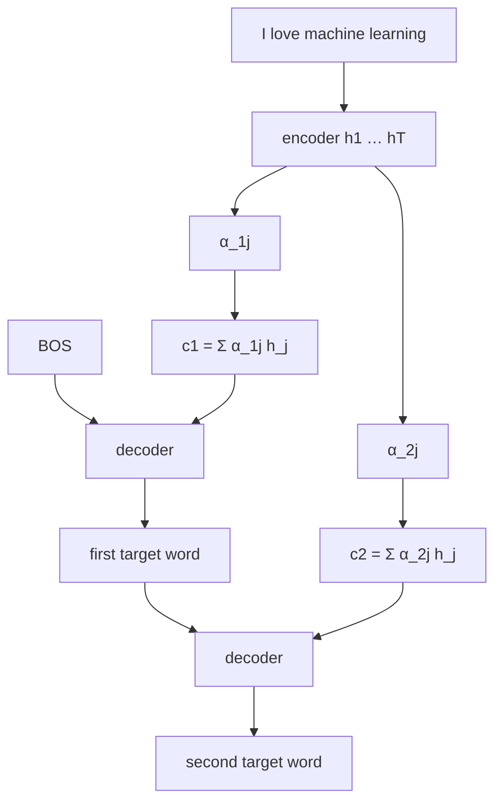

---

## Self-attention

**Attention** is the umbrella. **Self-attention:** **every word learns from every other word** in the *same* sequence (“I love machine learning” — *I* from *love*, *love* from *machine*, … all pairs).

Each token is projected to three vectors: **query, key, value**.

### Toy embeddings

Sentence **“I love generative AI.”** Tokens have embedding vectors $x_1,\ldots,x_4$ (lecture uses made-up numbers). Then

$$
Q = X W_Q,\qquad
K = X W_K,\qquad
V = X W_V
$$

$W_Q,W_K,W_V$ are learned. **Attention (must-remember equation):**

$$
\mathrm{Attention}(Q,K,V)
= \mathrm{softmax}\!\left(\frac{Q K^{\top}}{\sqrt{d_k}}\right) V
$$

$d_k$ = key dimension.

| Vector | Informal job (lecture) |
|--------|-------------------------|
| **Query** | What am I looking for? |
| **Key** | What information do I contain? |
| **Value** | What should I pass forward? |

---

## Multi-head attention

One head ≈ **one dominant** relation at a time. Real sentences have **several** linguistic links at once.

**Example.** “The **scientist** published the **paper** because **she** **completed** the **experiment** successfully.”

- *paper*–*published*  
- *experiment*–*completed*  
- *scientist*–*completed*  
- *scientist*–*she*  

**Core idea:** different heads learn **different** relations **in parallel** (e.g. head 1 grammar, head 2 semantics, head 3 syntax).

**Block (as drawn):**

1. $Q,K,V$ into **linear** layers — different weights = **different views** of the same sentence.  
2. **Projection** per head: one $(Q,K,V)$ triple per head.  
3. Each head: $\mathrm{softmax}(QK^{\top}/\sqrt{d_k})V$.  
4. **Concatenate** head outputs into one feature vector.  
5. Final **linear** mix → one representation.

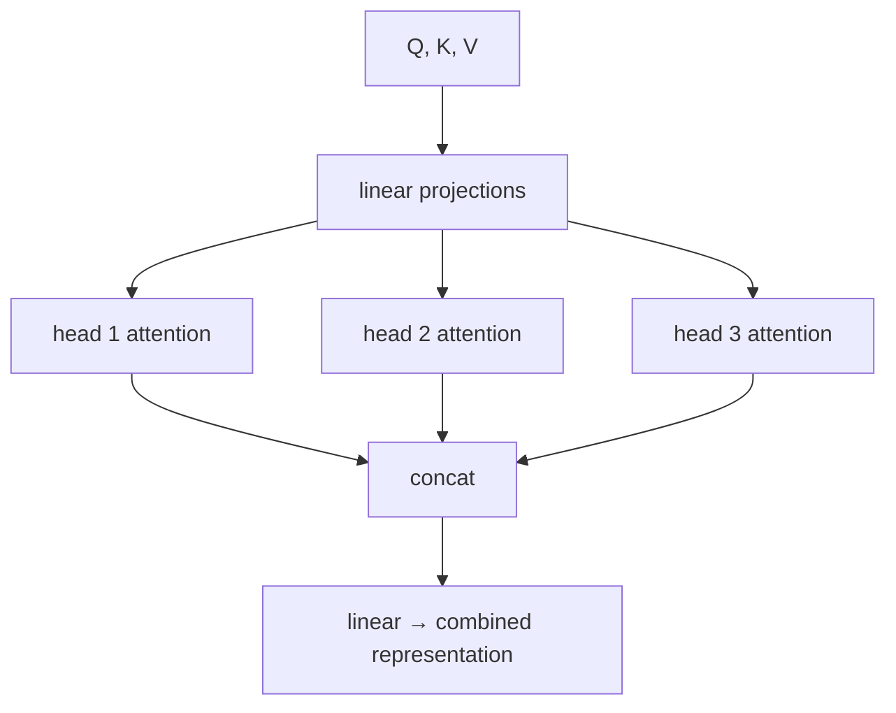

---

## Masked self-attention

**Mask** = hide the future. Needed when the **decoder** emits **one word at a time** (English → French: “I am a student” → *je suis un étudiant*). The source may be seen at once; the **target** must not peek at tokens **after** the current position.

**Rule:** when predicting a token, attend only to **past tokens and itself**, **never** to future tokens.

### Attention matrix

Tokens e.g. **I / love / deep / learning**.

- **Unmasked:** every pair has a score.  
- **Masked:** future positions are **$-\infty$**.  
  - After only “I”, scores involving later words are $-\infty$.  
  - After “I love”, the last two keys are $-\infty$.  
  - Full sequence: all scores allowed.

**Why $-\infty$:** softmax

$$
\mathrm{softmax}(z)_i = \frac{e^{z_i}}{\sum_j e^{z_j}}, \qquad e^{-\infty}=0
$$

so future tokens get **zero** attention weight.

---

## Transformers (introduction only)

**2017 landmark:** Vaswani et al., *Attention Is All You Need*, **Google Brain**. Two pillars:

1. **Attention** (self-attention, multi-head, encoder–decoder attention).  
2. **Parallel processing** — not one-token-after-another recurrence.

Architecture internals: **next session**. Assigned: actually **read the paper**.

### RNN / LSTM vs transformers

| RNN / LSTM | Transformers |
|------------|----------------|
| Read tokens **sequentially** | Look at **all tokens at once** |
| **Hidden states** carry memory | **Attention connects tokens directly** |
| **Hard to parallelize** | **Highly parallelizable** |
| Slow training on long sequences | **Faster** training |
| Long-distance information **weakens** | Long distance handled **efficiently** |

**Core transformer idea (lecture):** instead of reading one word after another, **look at all the words simultaneously**.

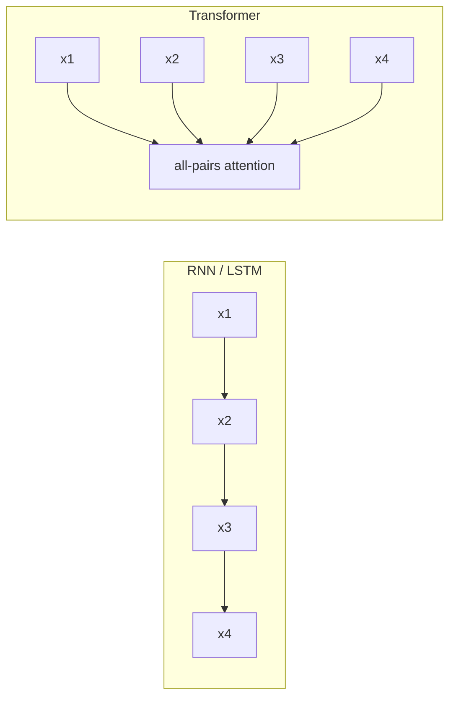

---

### Key takeaways

- Recurrence forces **$O(n)$** hops and a stack of hidden states; long documents (paragraph-scale) become expensive and forgetful.  
- Attention **reweights** encoder states (or tokens) so *it* can lock onto *animal*, not the whole sentence equally.  
- Self-attention: $Q,K,V$ from the **same** sequence; multi-head = several relations at once; **masks** implement causal decoding.  
- Transformers (2017) combine attention with **parallel** reads of the whole sequence — the reason they replace LSTMs as the default sequence backbone. Next lecture: **transformer architecture** in detail.

---


\newpage

# L57: Transformer architecture — encoder

**Video:** [Lec 57](https://www.youtube.com/watch?v=PBBWBo7OL3M) · 39:35

### Learning objectives

- State why RNNs, LSTMs, and GRUs motivated the 2017 transformer: sequential compute, hard parallelization, and remaining recurrence after attention.
- Describe the encoder as **six identical stacked layers**, each with **multi-head self-attention** and a **position-wise feed-forward network**.
- Explain why **sinusoidal positional encodings** are added to token embeddings when every token is processed at once.
- Compute a $d_{\text{model}}=4$ positional encoding for the token *sat* in “the cat sat on the mat.”
- Write residual + layer-norm and the two-linear ReLU FFN used in the original paper.

### Agenda (as stated)

1. Motivation for transformers  
2. Introduction to the transformer (encoder vs decoder)  
3. Function of encoder and decoder  
4. Positional encoding, with one numerical example  
5. Encoder architecture  
6. Residual connections and layer normalization  
7. Position-wise feed-forward network  

Decoder details are the **next** lecture.

---

## Motivation: what sequence models still could not do

RNNs, LSTMs, and GRUs are **sequence-to-sequence** models: an input sequence in, an output sequence out. They capture **some** long-term dependency, but the lecture lists three hard limits:

| Limitation | What happens |
|------------|----------------|
| **Sequential computation** | Word 1, then 2, then 3, … Training is slow. |
| **Hard to parallelize** | Later tokens wait on earlier hidden states; many operations cannot run together. |
| **Very long-range dependency** | LSTMs help, but words many sentences apart are still a problem. |

**Attention** (previous lecture) improved seq2seq by weighting the *relevant* past words for the next prediction, instead of treating every past word equally. Recurrence was still there: a hidden state remembers the previous word, that word depends on the one before it, and so on. Scientists asked whether **recurrence could be removed entirely**.

**Vaswani et al., 2017, *Attention Is All You Need***: transformers based **only on attention**, eliminating **recurrence and convolutions**.

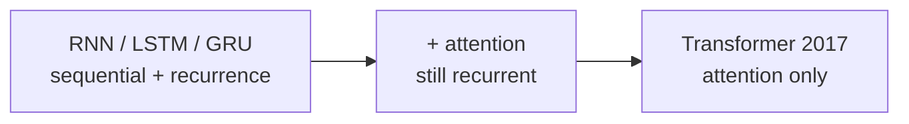

---

## Encoder + decoder; six stacked encoder layers

A transformer has two parts: **encoder** and **decoder**. This lecture is the encoder.

The original paper stacks **six encoder layers** (layer 1 … layer 6). Architecture is **the same** in every layer; **learned weights differ**. Stacking is what builds a **deeper understanding** of the sentence.

Each encoder layer has **two sub-layers**:

1. **Multi-head self-attention**
2. **Position-wise feed-forward network (FFN)**

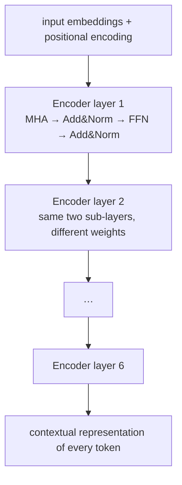

---

## Function of encoder vs decoder (English → German)

Running example: **translate English to German**.

| Block | Job |
|-------|-----|
| **Encoder** | **Understand** the English input. Process **all input tokens simultaneously**. Emit a **contextual representation** of every token. |
| **Decoder** | **Generate** the German translation. At **inference**, it does **not** emit all words at once: **one word at a time**. |

At each decoder step the model uses:

- words it has **already generated**, and  
- the **encoder’s** contextual representations,

then predicts the **next** German word.

---

## Why positional encoding exists

In an RNN/LSTM, words arrive **one after another**. Hidden states carry previous-word information, so the model **naturally knows order**. Example: *the cat sat on the mat* — *the*, then *cat*, then *sat*, …

In the transformer encoder, **all words are processed simultaneously**. Each token has a vector embedding, but **order is lost** if those embeddings are fed in as a bag. **Positional encoding injects order**: a fingerprint of where the token sits. It is **added** to the token embedding to form the vector that actually enters the encoder.

Original $d_{\text{model}} = 512$. Even dimensions use **sine**, odd dimensions **cosine**:

$$
\mathrm{PE}_{(\mathrm{pos},\,2i)} = \sin\left(\frac{\mathrm{pos}}{10000^{2i/d_{\mathrm{model}}}}\right)
$$

$$
\mathrm{PE}_{(\mathrm{pos},\,2i+1)} = \cos\left(\frac{\mathrm{pos}}{10000^{2i/d_{\mathrm{model}}}}\right)
$$

- $\mathrm{pos}$: token position in the sentence (0-based in the numerical).  
- $i$: dimension index (pairs even/odd coordinates).  
- $d_{\text{model}}$: embedding / model width.

---

## Numerical example: $d_{\text{model}}=4$, token *sat*

The lecture uses $d_{\text{model}}=4$ so the arithmetic is small (the paper’s 512 would be huge). Sentence:

> the cat sat on the mat

Positions $\mathrm{pos} = 0,1,2,3,4,5$. **$\mathrm{pos}=2$** is *sat*.

### $i=0$ (coordinates $2i=0$ and $2i+1=1$)

$$
\mathrm{PE}_{(2,0)} = \sin(2 / 10000^{0}) = \sin 2 = 0.9093
$$

$$
\mathrm{PE}_{(2,1)} = \cos(2 / 10000^{0}) = \cos 2 = -0.4161
$$

### $i=1$ (coordinates $2$ and $3$)

$2i/d_{\text{model}} = 2/4 = 1/2$, so $10000^{1/2}=100$:

$$
\mathrm{PE}_{(2,2)} = \sin(2/100) = \sin 0.02 = 0.0200
$$

$$
\mathrm{PE}_{(2,3)} = \cos(2/100) = \cos 0.02 = 0.9998
$$

**Positional vector for *sat*:**

$$
\mathrm{PE}_2 = \bigl[0.9093,\; -0.4161,\; 0.0200,\; 0.9998\bigr]
$$

If the token embedding of *sat* is $[X_1,X_2,X_3,X_4]$, the **final embedding** into the transformer is the sum:

$$
\bigl[0.9093+X_1,\; -0.4161+X_2,\; 0.0200+X_3,\; 0.9998+X_4\bigr]
$$

*Mat* at the **end** of the sentence gets a different PE from *the* at the **start** — that is the order fingerprint.

---

## Encoder block, in order

1. **Input sequence** → **input embeddings**: tokens to continuous vectors of width $d_{\text{model}}=512$ in the paper.  
2. **Add positional encoding** (relative / absolute position).  
3. **Multi-head self-attention**: look at the same sentence from several **perspectives** in parallel — semantic, syntactic, structural. More heads → richer relations. Tokens attend to **different parts of the same sequence** at once.  
4. **Add & Norm**: residual **add** of the sub-layer input to its output, then **layer normalization**. Stabilizes training.  
5. **Position-wise FFN**: after attention, learn **richer, more complex** token features.  
6. **Add & Norm** again (residual around the FFN).  
7. Repeat this block $N$ times ($N=6$ in the paper). The slide’s $N\times$ is that stack.

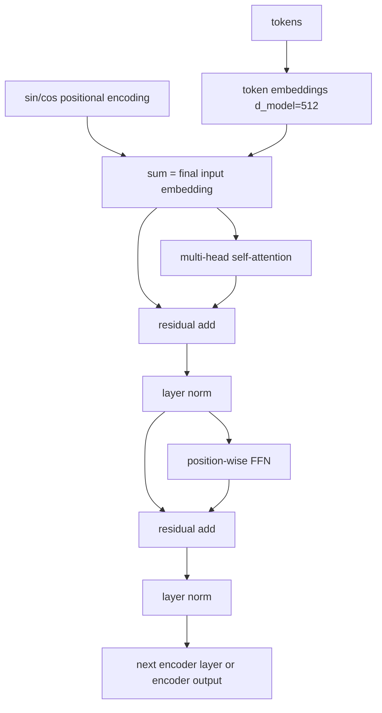

---

## Residual connections and layer normalization

Let $x$ be the word embedding **plus** positional encoding. A **sub-layer** (multi-head attention, or later the FFN) maps $x$ to $\mathrm{Sublayer}(x)$. Residual:

$$
\mathrm{LayerNorm}\bigl(x + \mathrm{Sublayer}(x)\bigr)
$$

**Why add $x$ back?** Sub-layer operations can **change the representation fully**. Important information can disappear. The skip **preserves the original representation**.

**Why layer-norm?** Neuron outputs sit on **different scales**. Normalization **stabilizes activations**, improves optimization, and **makes training faster / more stable**.

---

## Position-wise feed-forward network

After multi-head attention (and Add & Norm), each token is transformed **independently** by the **same** FFN. That is why it is **position-wise**: if the input words are $w_1,\ldots,w_T$, each token’s vector goes through **its own application** of one shared FFN (not one giant mix across positions at this step).

Inside the FFN, **two linear maps** with **ReLU** between them. Paper sizes:

| Stage | Width |
|-------|------:|
| Input | $512$ |
| After first linear | $2048$ (expand) |
| ReLU | $2048$ |
| After second linear | $512$ (project back) |

$$
\mathrm{FFN}(x) = \max\bigl(0,\; xW_1 + b_1\bigr)\,W_2 + b_2
$$

$W_1,b_1$ first linear; $\max(0,\cdot)$ is ReLU; $W_2,b_2$ second linear. The expansion is meant to learn a **richer** representation after attention has mixed context.

---

### Key takeaways

- Seq2seq recurrence made training slow, blocked parallelization, and still struggled with **very** long range; *Attention Is All You Need* (2017) dropped recurrence and convolutions.
- The encoder is **six identical layers** (different weights): multi-head self-attention + position-wise FFN, each wrapped in residual Add & Norm.
- Encoder **understands** all input tokens at once; decoder **generates** one token at a time from past outputs **and** encoder context (English→German).
- Simultaneous encoding loses order, so **sinusoidal PE** is added to embeddings; even dims sine, odd dims cosine.
- Residual $x+\mathrm{Sublayer}(x)$ keeps information from being wiped; layer-norm stabilizes training; FFN is $512\to 2048\to\mathrm{ReLU}\to 512$.

---


\newpage

# L58: Practical exercise 1 — RNN vs LSTM sentiment classification

**Video:** [Lec 58](https://www.youtube.com/watch?v=doc237ORyxc) · 48:27

### Learning objectives

- Implement **binary sentiment classification** on **IMDb** with a **SimpleRNN** and an **LSTM** in TensorFlow / Keras.
- Pad / truncate reviews to a fixed length with **post-padding** and **post-truncation**.
- Compare validation accuracy/loss, test accuracy, and confusion matrices.
- Inspect **LSTM hidden-state** heatmaps (tanh activations) and decode two test reviews.

### What this lecture is *not*

Despite sitting after the encoder theory video, this Colab is **not** a transformer implementation. It is **RNN vs LSTM on movie reviews**. The decoder-only transformer from scratch is **Lec 63**.

---

## Task and dataset

**Sentiment classification** on text: sequential / time-series style data, so the lecture uses networks with **memory** (RNN, LSTM).

**IMDb** (Internet Movie Database): movie reviews (also mentioned: actor information, web series / serials). Keras `imdb` load:

| Split | Reviews |
|-------|--------:|
| Train | 25,000 |
| Test | 25,000 |
| Total | 50,000 |

Labels: **positive = 1**, **negative = 0**.

Limits (full unique vocabulary would be expensive; the lecture mentions the raw set can be on the order of 50k–100k words):

| Parameter | Value | Why |
|-----------|------:|-----|
| `vocab_size` / `num_words` | **10,000** | Unique words kept; rest treated as unknown later |
| `maxlen` | **200** | Networks need a **fixed** input length |


---

## 1. Imports and TensorFlow version

| Import | Role in this lab |
|--------|------------------|
| `numpy` as `np` | Arrays |
| `matplotlib.pyplot` as `plt` | Plots |
| `tensorflow` as `tf` | Deep learning |
| `imdb` from `tensorflow.keras.datasets` | Reviews |
| `pad_sequences` from `tensorflow.keras.preprocessing.sequence` | Padding |
| Layers: `Input`, `Embedding`, `SimpleRNN`, `LSTM`, `Dense`, `Dropout`, `GlobalAveragePooling1D` | Architecture |
| `Model` from `tensorflow.keras.models` | Functional-style model from inputs/outputs |
| `accuracy_score`, `confusion_matrix`, `ConfusionMatrixDisplay`, `classification_report` from sklearn | Metrics |

Print **TensorFlow version** (lab shows **2.20**) so LSTM-layer options can be adjusted if needed.

---

## 2. Load IMDb

```text
(x_train, y_train), (x_test, y_test) = imdb.load_data(num_words=vocab_size)
```

Print lengths: 25,000 train, 25,000 test.

---

## 3. Padding (pre-processing)

Reviews are **variable length**. Pad train and test to `maxlen=200` with **`padding='post'`** and **`truncating='post'`**.

Shapes after padding: `x_train` and `x_test` are **(25000, 200)**.

### Mini-example from the slides

Positive review (label 1): *The movie was interesting. Actors acted well.* — **7** words.  
Negative review (label 0): *movie was boring … climax was dull … I did not like the movie* — **15** words.

If `maxlen=20`:

- 7-word review → **13** zeros **after** the words (post-pad).  
- 15-word review → **5** zeros after.

**Pre-padding** would put zeros first, then the sentence. The lecture prefers **post-padding**: real tokens come first, so **activation is more likely early**; trailing zeros do not fire neurons.

Pipeline named in the talk:

1. **Tokenization** — sentence → words.  
2. **Integer encoding** — e.g. *the* → 3, *movie* → 10.  
3. **Dense vectors** — embedding layer turns those integers into features (128-d in the models below).

---

## 4. SimpleRNN model

1. **Input** shape `(maxlen,)` = 200.  
2. **Embedding**: `input_dim=10000`, `output_dim=128`.  
3. **SimpleRNN**: **64** units (compress 128-d embeddings; named `rnn_layer`). The lecture’s story: different hidden units specialize (positive words, negative words, pairwise relations, adjectives, …).  
4. **Dense(1, sigmoid)** — binary classification.

Threshold:

- predicted $p > 0.5$ → **positive**  
- $p \le 0.5$ → **negative**

**Compile:** optimizer **Adam**, loss **binary cross-entropy**, metric **accuracy**.

**Fit:** `x_train`, `y_train`; **10 epochs**; **batch size 64**; **`validation_split=0.2`**.

### What to observe (RNN)

At epoch 10: **validation accuracy ≈ 50%**, **validation loss ≈ 1.26**.  
RNN has **one** hidden state, **vanishing gradients**, weak **long-term** (and “future word”) dependency — text is sequential. Bidirectional LSTM is mentioned as a type that can use future context; this lab’s RNN does not.

**Test:** `model.predict(x_test)`, threshold 0.5. **RNN test accuracy ≈ 50%.**

### RNN confusion matrix (as read off the plot)

|  | Predicted 0 (neg) | Predicted 1 (pos) |
|--|------------------:|------------------:|
| **True 0** | 8,846 | 3,654 |
| **True 1** | 8,828 | 3,672 |

Correct ≈ $8846+3672$; errors ≈ $3654+8828$ — about half right.

---

## 5. LSTM model

Same skeleton, extra capacity and regularization:

1. **Input** `(200,)`.  
2. **Embedding** 10,000 → 128 (named `embedding_layer`).  
3. **LSTM(64, `return_sequences=True`)** so the sequence of hidden states is kept (dependency along the review). Named `lstm_layer`.  
4. **GlobalAveragePooling1D** — average the 64-d states over the 200 positions into **one** vector (one representation for backprop).  
5. **Dropout(0.5)** — drop 50% of units.  
6. **Dense(1, sigmoid)**.

Same compile and fit as RNN (Adam, BCE, accuracy; 10 epochs, batch 64, val split 20%) so the comparison is fair.

### What to observe (LSTM)

End of epoch 10: **validation accuracy ≈ 84.82%**, **validation loss ≈ 0.77** (below 1, unlike RNN).  
**Test accuracy ≈ 82%.** Confusion matrix: true counts **above ~10,000**, errors **around 4,000**.

### Why LSTM beats this RNN (as drawn)

RNN: previous hidden state + current word → SimpleRNN → **one** new hidden state.

LSTM: previous **hidden** state **and** previous **cell** state + current word, with three gates:

| Gate | Role in the lecture |
|------|---------------------|
| **Forget** | How much to drop vs pass on |
| **Input** | What to write into the cell |
| **Output** | What to emit as hidden state |

Hidden state ≈ **short-term**; cell state ≈ **long-term**. Together: **Long Short-Term Memory**.

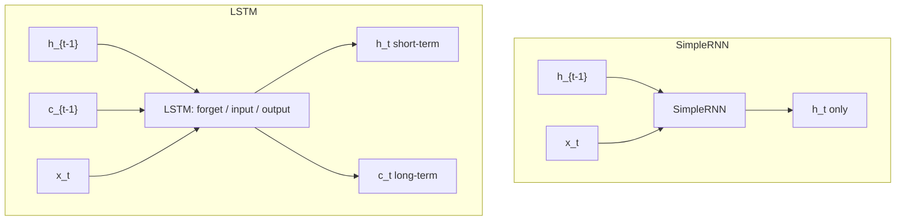

---

## 6. Validation curves

Figure **8×5** inches.

**Validation accuracy vs epoch**

- RNN: `'o'` markers, label “simple RNN”  
- LSTM: square markers, label “LSTM”  
- *x*: epoch (0–10); *y*: validation accuracy; grid on; legend  

**Observe:** LSTM around **82–85%**; RNN around **50%**.

**Validation loss vs epoch** — same markers. LSTM loss stays lower (orange in the demo); RNN loss **rises** and stays higher.

---

## 7. Hidden-state probe (LSTM)

Build a second model with the **same input** as the LSTM but **output = `lstm_model.get_layer('lstm_layer').output`** — stop before GAP / Dense.

Take **one** test review: `x_test[0:1]`. Hidden-state shape: **`(1, 200, 64)`** — 1 sample, 200 word positions, 64 units.

**Heatmap:** `imshow` of the **transpose** so **rows = hidden units**, **columns = word position**. Colormap **viridis**. Values in **$[-1,1]$** because LSTM uses **tanh**.

Color reading from the lecture:

| Color | Activation |
|-------|------------|
| Purple | Negative |
| Yellow | Strong positive |
| Green / blue | Little / none |

**Observe on sample 0:**

- Positions ~0–20: mostly green/blue, activations roughly **−0.2 to 0.2** (still picking up the start).  
- ~20–60: mixed colors — the **middle of the review** is where learning varies.  
- After ~60–75: **constant** stripes (all purple, all green, …) because **post-padding zeros** remain; neurons do not keep changing on zeros.

### Three hidden units vs word position

Plot units 0, 1, 2 on the same sample: *x* = word position 0–200, *y* = activation. Learning until ~70–75, then **flat**. Sign flips: a “positive-word” unit goes **> 0.5** on positive tokens and **drops** on negative ones.

---

## 8. Predict and reverse-decode two reviews

LSTM + sigmoid; threshold 0.5.

| Index | $p$ | Predicted |
|------:|----:|-----------|
| `x_test[0]` | **0.01** | negative |
| `x_test[20]` | **0.99** | positive |

Reverse mapping uses `imdb.get_word_index()`, then a dictionary that also maps special ids:

| Id | Meaning in the decode helper |
|---:|------------------------------|
| 0 | padding |
| 1 | start of sequence |
| 2 | **UNK** — word outside the 10k vocab (raw IMDb is described as ~80k unique words) |
| 3 | unused |

Decoded **sample 0** (negative, matches the score): starts with start-token, *please give this one a miss*, some **UNK**, *the rest of the cast render **terrible** performance*, *the show is **flat flat flat***.

Decoded **sample 20** (positive): *this film was one that I have waited to see for some time … everything anticipated … writing … so finely crafted*.

---

### Key takeaways

- IMDb 25k/25k, vocab **10k**, length **200**, **post-pad**; Embedding **128**, recurrent **64**, sigmoid + **Adam** + **BCE**, 10 epochs, batch 64, 20% validation.
- SimpleRNN stuck near **50%**; LSTM near **85% val / 82% test** because of **forget / input / output** gates and a **cell state**.
- Hidden-state heatmaps show tanh activity on real tokens, then **constant** rows on **padding**.
- This exercise is **sentiment RNNs**, not a transformer; transformer training/inference is Lec 63.

---


\newpage

# L59: Transformer architecture — decoder

**Video:** [Lec 59](https://www.youtube.com/watch?v=if65zXEwIKI) · 35:20

### Learning objectives

- List the decoder’s **three** sub-layers and why the encoder only needed two.
- Explain **masked** multi-head attention vs **encoder–decoder** attention ($Q$ from decoder, $K,V$ from encoder).
- Reconstruct **BPE** (frequency) vs **WordPiece** (likelihood) as the pre-processing step before embeddings.
- Recall the **WMT 2014** En–De / En–Fr training setup and transformer **advantages vs quadratic cost**.

### Agenda (as stated)

Decoder architecture and sub-layers; encoder–decoder connection; subword tokenization (BPE, WordPiece); training of the transformer; advantages and limitations. Encoder internals were Lec 57.

---

## Six decoder layers, three sub-layers each

Same stacking idea as the encoder: **decoder layers 1–6**, identical structure, different weights. Encoder layers had **two** sub-layers; each decoder layer has **three**:

1. **Masked multi-head (self-)attention**  
2. **Encoder–decoder multi-head attention**  
3. **Position-wise feed-forward network**

Each is followed by **Add & Norm** (residual + layer-norm), as in the encoder.

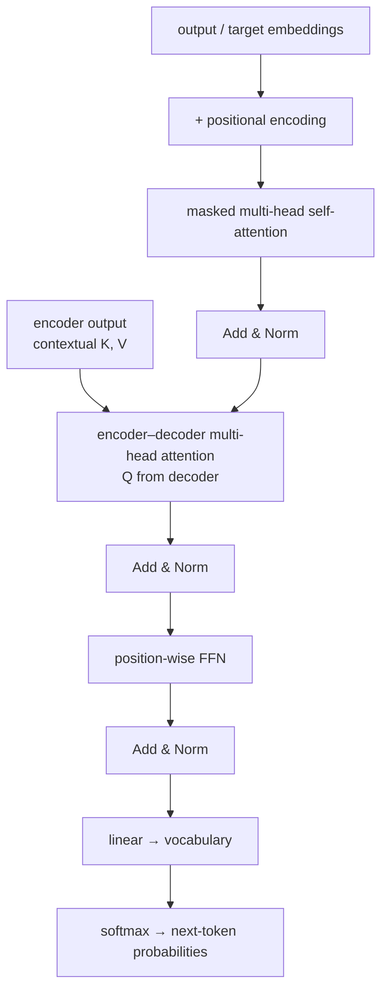

---

## Information flow

**Output embeddings** (not the source sentence) enter the decoder. At inference, **already generated tokens** are fed back as this input. Add **positional encoding**, then:

### Masked multi-head attention

When predicting the next word, the model **must not see future** target tokens. **Masking** lets each target token attend **only to previously generated** tokens (and itself). Same idea in **training**: future positions in the gold target are hidden.

### Add & Norm

$\mathrm{LayerNorm}(x + \mathrm{Sublayer}(x))$: residual keeps the original input; normalization **stabilizes training** (same story as the encoder).

### Encoder–decoder attention

The decoder must **read the encoder’s output** — the contextual understanding of the **input** (English, in the running translation example). This second attention is **multi-head cross-attention**:

- **Queries $Q$** from the **decoder**  
- **Keys $K$ and values $V$** from the **encoder**

Scaled-dot attention (as written in the lecture; $d$ = key dimension):

$$
\mathrm{Attention}(Q,K,V) = \mathrm{softmax}\!\left(\frac{QK^{\top}}{\sqrt{d}}\right) V
$$

Heads run in parallel, then **concatenate**. The decoder can put weight on **relevant encoder positions** while predicting the next German token.

### Position-wise FFN

Same as the encoder: **two linear layers**, **ReLU** between them; each token independently; expand then project back. With $x$ the token vector:

$$
\mathrm{FFN}(x) = \max(0,\, xW_1 + b_1)\, W_2 + b_2
$$

### Linear + softmax

The last decoder output is mapped to **vocabulary logits**, then **softmax** → a distribution over **every** vocab word. The next token is the word with **maximum** probability. Stacking $N=6$ decoder layers (paper) deepens that prediction.

English → German reminder: encoder consumes **all English tokens at once**; decoder emits **one German word at a time**.

---

## Why the extra sub-layer?

| Side | Job | Attention it needs |
|------|-----|--------------------|
| **Encoder** | Only **understand** the input | Self-attention over the source + FFN (**two** sub-layers) |
| **Decoder** | **Two** jobs | (1) Look at **already generated** words → **masked** self-attention. (2) Attend to **encoder** context → **cross-attention**. Then FFN. |

Without cross-attention the decoder would generate without looking at the source representation; without masking it would **cheat** by seeing future target words.

---

## How many heads?

Inside **one** attention sub-layer, heads are **parallel**, not separate stacked sub-layers.

| Model (as stated) | Heads |
|-------------------|------:|
| Original transformer | **8** |
| Transformer **big** | **16** |

---

## Full transformer (encoder hooked to decoder)

One encoder layer: embeddings + PE → multi-head **self**-attention → Add & Norm → position-wise FFN → Add & Norm.  
One decoder layer: target embeddings + PE → **masked** MHA → Add & Norm → **encoder–decoder** MHA (encoder output enters **here**) → Add & Norm → FFN → Add & Norm → linear → softmax.

$N\times$ stacks; paper: **six encoders and six decoders**.

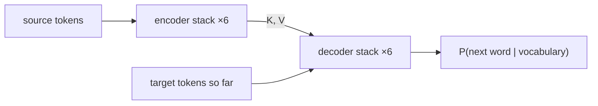

---

## Subword tokenization (pre-processing)

Transformers do not ingest raw characters as the only unit. **Subword tokenization** splits text into **smaller meaningful pieces**, which become embeddings. Two methods in this lecture:

| Method | Merge / split rule |
|--------|--------------------|
| **Byte-pair encoding (BPE)** | Merge the **most frequent** character (then subword) pairs |
| **WordPiece** | Break using **likelihood** of pieces occurring together |

**Why subwords?** Handle **rare / unseen** words. If the model knows *cyber* and *security*, it can compose **cybersecurity**. Smaller **reusable** pieces → smaller vocab → less memory.

### BPE walk-through (corpus: *low*, *lower*, *newer*)

1. Split into characters: `l o w`, `l o w e r`, … (the board also tracks *lowest*-style forms).  
2. Most frequent pair is **`l`+`o`** → merge to **`lo`**.  
3. Next frequent continuation is **`w`** after `lo` → **`low`**.  
4. Write the corpus with the merged piece: *low*, *low er*, *low est*, *new er*.  
5. Store **`er`**, **`est`**, **`new`** as pieces. You do **not** need a separate full-word *newer* if *new*+*er* compose it.

**Learned vocabulary stores subwords, not only whole words.**

### WordPiece examples

Vocabulary pieces such as *play*, *##ing*, *##ed*, *##er* (the `##` means “continuation, not a new word”).

| Word | Pieces |
|------|--------|
| playing | play + ##ing |
| played | play + ##ed |
| player | play + ##er |
| microscope | micro + scope |
| unhappiness | un + happiness |

**BPE merges by frequency; WordPiece chooses merges by likelihood.**

---

## Training the original transformer

| Dataset | Size (as stated) | Subword method |
|---------|------------------|----------------|
| **WMT 2014 English–German** | ≈ **4.5 million** sentence pairs (also said ~4.1M) | **BPE** |
| **WMT 2014 English–French** | ≈ **36 million** sentence pairs | **WordPiece** |

A sentence pair is source + translation (English sentence $i$ with German/French sentence $i$).

---

## Advantages and limitations

**Advantages**

- **Parallel** computation  
- Better **long-range** dependency modeling  
- **Scalable**; state-of-the-art  
- Foundation of modern LLMs (**BERT**, **GPT** — next lectures)

**Limitations**

- **High memory**  
- **Quadratic** attention: $n$ tokens → on the order of $n^2$ pairwise operations  
- Needs **large** datasets  
- **Computationally expensive**

---

### Key takeaways

- Decoder layer = **masked self-attention** + **encoder–decoder attention** ($Q$ decoder, $K,V$ encoder) + **FFN**, each with residual Add & Norm; **six** layers in the paper.
- Masking stops future-target leakage; cross-attention injects source context; softmax over the vocab emits the next word.
- Extra sub-layer exists because generation has **two** look-ups (past outputs **and** encoder).
- BPE (frequency) and WordPiece (likelihood) shrink vocab and handle unknowns (*cyber*+*security*).
- Trained on WMT 2014 En–De (~4.5M, BPE) and En–Fr (~36M, WordPiece); pay **$O(n^2)$** attention cost.

---


\newpage

# L60: BERT

**Video:** [Lec 60](https://www.youtube.com/watch?v=tXCsSH5MJUI) · 42:39

### Learning objectives

- Contrast BERT with **static** embeddings (Word2Vec / GloVe) and **left-to-right** LMs using the lecture’s *bank* and *movie was —* examples.
- Explain why BERT is **encoder-only**: **understand** language, not generate long text.
- Describe the two pre-training tasks **MLM** and **NSP**, including the **15% / 80–10–10** masking recipe.
- Trace input construction: **token + segment + position** embeddings, `[CLS]`, `[SEP]`.
- Distinguish **self-supervised pre-training** from **supervised fine-tuning**, and name the BERT **variants** listed in class.

### Agenda (as stated)

Motivation; what BERT is; why encoder only; pre-training vs fine-tuning; MLM and NSP; pipelines; variants. GPT is the **next** lecture.

---

## Motivation: four limits of earlier LMs

### 1. Static embeddings (Word2Vec / GloVe)

> I deposited money in the **bank**.  
> The children played near the **bank** of the river.

Financial *bank* vs river *bank* got the **same** vector. **Context** was missing.

### 2. Left-to-right processing

> The movie was ——

Both *good* (positive) and *bad* (negative) are possible. A left-to-right model **ignores words that appear later**, so sentiment can be under-determined until the end — and those later tokens were not used when scoring the blank.

### 3. Poor very-long-range understanding

RNNs/LSTMs struggle to link word 2 with word 10 in a long sequence. LSTMs helped; **very** long range stayed hard.

### 4. One model per task

Sentiment analysis, question answering, **NER** (named entity recognition) each needed a **separately trained** model.

These gaps motivated **BERT**.

---

## What BERT is

**Bidirectional Encoder Representations from Transformers.** Pre-trained deep LM from **Google (2018)**; paper (Devlin et al.): *Pre-training of Deep Bidirectional Transformers for Language Understanding* (existence 2018, published **2019**).

Built **only on the transformer encoder** (not the decoder). It reads **left and right** at once. Example: *the cat sat on the mat* is used from both directions so beginning **and** end context are available.

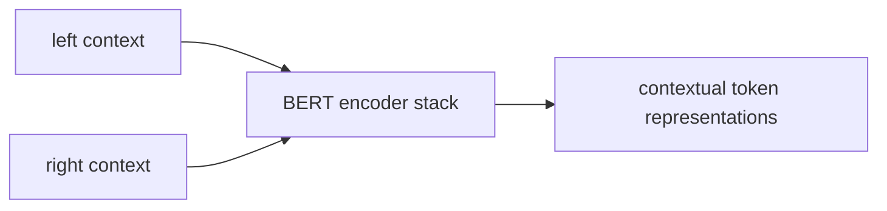

### Language model (working definition here)

An LM learns a **probability distribution over word sequences**. Given a prefix (or a blank), it scores the **vocabulary**; the highest-scoring word fills the slot. Traditional LMs do **next-word prediction** after training on **billions** of text examples (statistical patterns and relations). BERT’s pre-training objective is **not** that left-to-right next word — it is **masked** prediction (below).

---

## Why encoder only? Understand, do not generate

BERT’s primary goal is **language understanding**, not paragraph **generation**. Applications listed:

| Task | Input (lecture) | Output |
|------|-----------------|--------|
| **Sentiment** | *I absolutely love this movie.* | **positive** (one label, not a sentence) |
| **NER** | *Dr. Joan visited Ames Hospital on August 1st, 2025.* | person / organization / date |
| **QA** | Paragraph: *Paris is the capital of France.* Q: *What is the capital of France?* | **Paris** |
| **Text classification** | (same idea) | class label |

None of these require **writing a full generated sentence**. Encoder contextualization is enough.

---

## Pre-training vs fine-tuning (two-stage LMs)

Modern LMs (BERT, GPT) train in **two stages**. School analogy:

| Stage | School analogy | Data | What is learned |
|-------|----------------|------|-----------------|
| **Pre-training** | KG through class 12: many subjects | **Massive unlabeled** corpus | Grammar, word relations, general language |
| **Fine-tuning** | Medical school: specialize | **Smaller labeled** set | One NLP task (e.g. news-topic classification) |

Fine-tuning takes the **same** pre-trained net and trains it further until it is an **expert** at that task.

---

## Pre-training is self-supervised: two tasks

No human labels on the raw corpus. Two objectives on **unlabeled** text.

### Masked language modeling (MLM)

Traditional LMs: *the cat sat on the ——* → *mat* (left-to-right only).  
BERT: **randomly mask** tokens and predict them from **both** sides.

Original: *the boy is **playing** football.*  
Input: *the boy is **[MASK]** football.*  
Target: *playing*.

**Masking strategy (original paper):** randomly select **15%** of tokens. Of those selected:

| Fraction of the 15% | Replacement |
|--------------------:|-------------|
| **80%** | `[MASK]` token |
| **10%** | a **random** word |
| **10%** | **left unchanged** |

**Why not always `[MASK]`?** At inference / fine-tuning the `[MASK]` token often **does not appear**. Training only on `[MASK]` would **mismatch** pre-training and later use. Random replacements and unchanged tokens reduce that gap. MLM yields **contextual** word representations.

### Next sentence prediction (NSP)

Needed for QA, NLI, document retrieval: **relation between two sentences**.

| Sentence A | Sentence B | Label |
|------------|------------|-------|
| Rahul went to the grocery store. | He bought some milk. | **IsNext** |
| Rahul went to the grocery store. | Eiffel Tower is in Paris. | **NotNext** |

During pre-training: **50%** true consecutive pairs, **50%** random **NotNext**. BERT learns **sentence-level** relations (paragraphs are sequences of sentences).

---

## Pre-training pipeline and input construction

**Data:** **BooksCorpus + Wikipedia** (plus “other relevant documents” as a catch-all).  
**Tokenizer:** **WordPiece**.  
Then **input construction** → BERT → **MLM + NSP** → pre-trained BERT.

The vector that enters BERT is the **sum** of three embeddings:

| Embedding | Role |
|-----------|------|
| **Token** | WordPiece piece vectors |
| **Position** | Order (same idea as transformer PE) |
| **Segment** | Sentence **A** vs sentence **B** ($E_A$ vs $E_B$ in the paper figure) |

Special tokens (paper figure *my dog is cute* / *he likes playing*):

- **`[CLS]`** at the **start**. Its **final** embedding is the **sequence representation** for **classification**.  
- **`[SEP]`** **between** sentences and at the end.

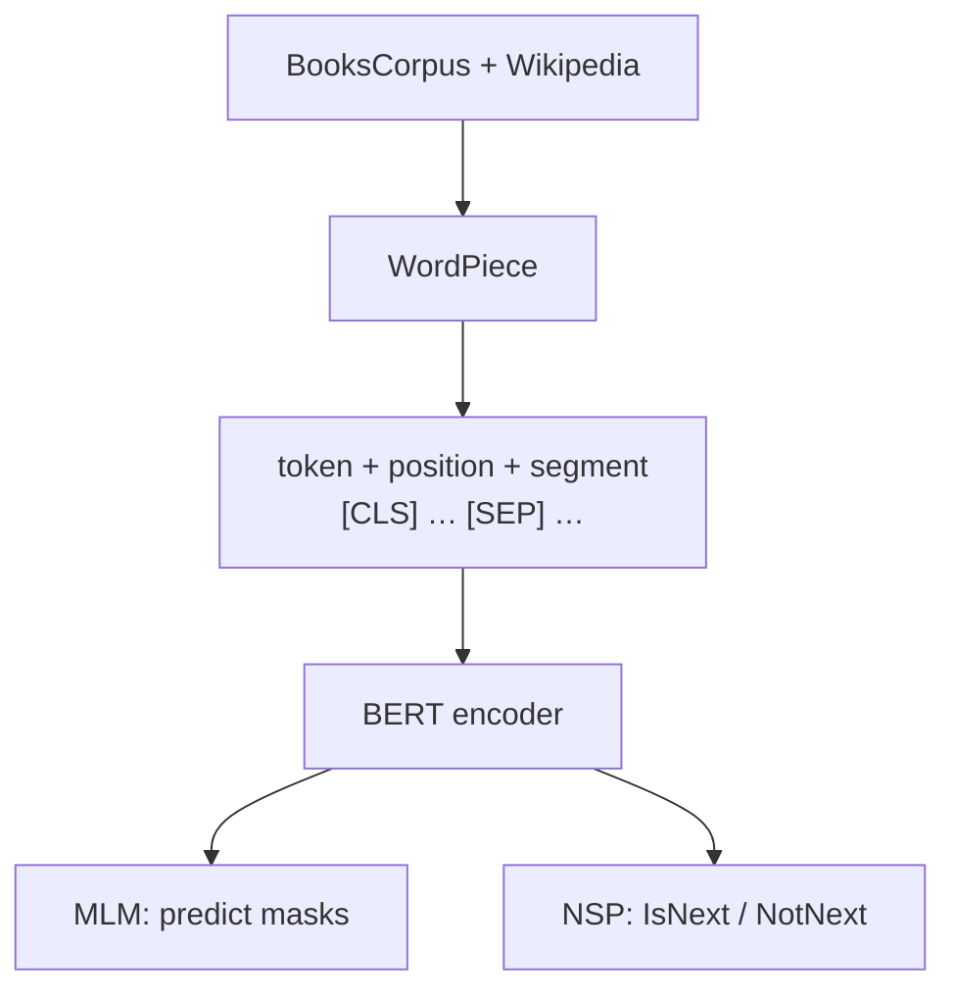

---

## Fine-tuning pipeline

Adapt pre-trained BERT to one NLP task (sentiment, QA, NER, …).

1. Take **pre-trained** BERT (MLM + NSP).  
2. Add a **small task-specific output layer** (e.g. linear) on top.  
3. Train **BERT + new layer together** on **labeled** data (**supervised**).  

Weights are **updated**, not trained **from scratch**. Pre-training still matters: you start from a language-aware initialization.

**Takeaway:** one pre-trained body; **swap the last layers** for different tasks. Pre-training = self-supervised; fine-tuning = supervised.

**QA fine-tune (paper figure):** question tokens + context paragraph, `[CLS]` / `[SEP]`. Heads predict the **start and end span** of the answer. Other heads in the figure: NER, MultiNLI, etc. **Dotted arrows** = copy pre-trained weights into the fine-tune graph.

---

## Variants named in lecture

| Variant | What the lecture says it changes |
|---------|----------------------------------|
| **RoBERTa** | Robustly optimized BERT: **drops NSP**, more data, larger batches, **dynamic masking** |
| **ALBERT** | “A lite BERT”: **parameter sharing** → smaller model / memory, performance kept high |
| **DistilBERT** | Compressed BERT: faster, smaller, about **95%** of BERT’s performance with fewer parameters |
| **ELECTRA** | Efficiently Learning an Encoder that Classifies Token Replacements Accurately: **detect replaced tokens** instead of predicting masks; stronger results with **less** compute |

Closing ask: **read the original BERT paper** for architecture details not expanded on the slides.

---

### Key takeaways

- Static *bank* vectors and left-to-right LMs miss context; BERT is a **bidirectional encoder** LM (Google / Devlin et al.).
- Encoder-only because target tasks need **labels and short answers**, not free generation.
- Pre-train **MLM** (15% selected; 80% `[MASK]`, 10% random, 10% unchanged) and **NSP** (50/50 IsNext) on BooksCorpus + Wikipedia with WordPiece.
- Input = token + position + segment; `[CLS]` for classification; fine-tune with a small head on labeled data.
- Variants: RoBERTa, ALBERT, DistilBERT, ELECTRA — still BERT-family encoders, not GPT.

---


\newpage

# L61: GPT — decoder-only large language model

**Video:** [Lec 61](https://www.youtube.com/watch?v=_zH-VPjiHfM) · 40:53

### Learning objectives

- Contrast **BERT (encoder, understanding, MLM)** with **GPT (decoder, generation, next-token)** as taught in this pair of lectures.
- Explain **causal / masked self-attention** and why a **bidirectional encoder cannot** generate without **information leakage**.
- Walk the **autoregressive** loop on *The capital of France is … Eiffel Tower*.
- Describe GPT’s **pre-train (unlabeled next-word) → supervised fine-tune** framework and the **decoder-only** block (no encoder–decoder attention).
- List GPT-1 vs GPT-2 scale numbers and the **limitations** named here (including **hallucination**). Prompt recipes are Lec 62 — not this video.

### Agenda (as stated)

Evolution of GPT; need for GPT-1; why decoder-only; autoregressive generation; learning framework; architecture; what “large language model” means; limitations.

---

## Evolution (timeline as stated)

| Year (lecture) | Model |
|----------------|--------|
| 2018 | **GPT-1** (same year as BERT) |
| 2019 | **GPT-2** |
| 2020 | **GPT-3** |
| 2022 | **GPT-3.5** |
| 2023 | **GPT-4** |
| 2024 | **GPT-4o** |
| 2025 | **GPT-5**, and the lecture’s latest mention **GPT-5.6** |

Scale, context, and **multimodal** ability grow along this line. This lecture’s architecture story is still the **decoder-only** GPT-1 design (Radford et al.).

---

## BERT vs GPT (as taught)

Both are 2018 language models; jobs differ.

| | **BERT** | **GPT-1** |
|--|----------|-----------|
| Aim | Language **understanding** | Language **generation** (sentences, paragraphs) |
| Stack | **Encoder-only** transformer | **Decoder-only** transformer |
| Pre-train prediction | **Masked** token (both sides): *the boy is **[MASK]** football* → *playing* | **Next** token (left context only) |

```mermaid
flowchart TB
    subgraph bert [BERT]
      BDIR["bidirectional encoder"] --> MASK["predict masked tokens"]
      MASK --> UND["labels: sentiment, NER, span QA"]
    end
    subgraph gpt [GPT]
      DEC["causal decoder"] --> NEXT["predict next token"]
      NEXT --> GEN["generated text + optional task head"]
    end
```

---

## Why GPT-1 was built

Older NLP systems needed **labeled** data (scarce) and a **separate model per task** (expensive).

**OpenAI**, **Radford** et al., paper: *Improving Language Understanding by Generative Pre-Training* (2018).

**Key idea**

1. **Pre-train one** model on **large unlabeled** text with **next-word prediction** (**self-supervised** — no extra labels).  
2. **Fine-tune the same** model on downstream tasks (sentiment, NLI, QA, …) instead of training a new net from scratch.

---

## Why decoder-only?

Encoder **understands**; decoder **generates**. Generation is **predict the next word from words already seen** — that is the decoder’s job in the original transformer.

GPT generates **one token at a time** (**autoregressive** next-token prediction) and uses **causal masked self-attention** so the model **cannot see future** words.

Example of the mask: given *the cat sat on the ——*, the model has seen *the cat sat on the* and must **not** see *mat* or later sentences (*the cat is jumping above the wall*, …).

### Why not generate with an encoder?

The transformer **encoder** uses **bidirectional** attention: every word attends to **every** other word (no causal mask). If you tried to generate *mat* in *the cat sat on the mat*, the encoder could already have **attended to *mat* from the right**. That is **information leakage**. Causal masking is **incompatible** with full bidirectional attention. Hence **encoders are not used for text generation** in this design.

---

## Autoregressive generation (worked prompt)

Start: *The capital of France is*

| Input so far | Predicted next |
|--------------|----------------|
| The capital of France is | **Paris** |
| … is Paris | **.** |
| … Paris. | **It** |
| … It | **is** |
| … is | **known** |
| … known | **for** |
| … for | **the** |
| … the | **Eiffel** |
| … Eiffel | **Tower** |

Final: *The capital of France is Paris. It is known for the Eiffel Tower.*  
Each new token is **appended** to the context; then the model predicts again. That loop is **autoregressive text generation**.

```mermaid
flowchart LR
    P["prompt"] --> M["GPT next-token"]
    M --> T["new token"]
    T --> P
```

---

## Learning framework

```mermaid
flowchart LR
    U["large unlabeled corpus"] --> PT["stage 1: generative pre-training<br/>self-supervised next-word"]
    PT --> BASE["pre-trained GPT"]
    L["smaller labeled task data"] --> FT["stage 2: supervised fine-tuning"]
    BASE --> FT
    FT --> TASK["task-specific model"]
```

**Pre-training** learns grammar, semantics, and **reasoning / “what follows what”** patterns.

Examples of the next-word task (repeated **billions** of times):

- Input: *the earth revolves around the sun* → target last word **sun**  
- *Artificial intelligence is transforming ——* → **industries**

The model absorbs **statistical structure**: grammar, vocabulary, context, long-range dependency.

**Fine-tuning:** labeled data for a domain (sports QA, education QA, …). **Update pre-trained weights**; do **not** train from scratch (saves time and compute). Tasks named: text classification, QA, NLI, semantic similarity. Few extra **task-specific** layers.

---

## Decoder-only architecture (paper figure)

**12 decoder layers.** Input: **token + position** embeddings.

Inside a block (as drawn): **masked multi-head self-attention** → **layer-norm** → **feed-forward** → **layer-norm**, with **skip / residual** connections.

**Missing vs the original transformer decoder:** there is **no encoder**, so there is **no encoder–decoder cross-attention**. Only **causal** self-attention (hide future tokens).

Two heads on the figure:

- **Text / next-token prediction** = **pre-training** objective.  
- **Task classifier** = **downstream** fine-tune (linear layers on transformed inputs).

### Downstream input layouts (paper)

**Start** token = beginning of sequence. **Extract** (end) token: its **final hidden state** is used for prediction. **Delimiter** = separator between two texts.

| Task | How the sequence is packed | Output idea |
|------|----------------------------|-------------|
| **Classification** | start + text + extract → transformer → **linear** | e.g. positive / negative |
| **Entailment** | start + **premise** + delimiter + **hypothesis** + extract | entailment / contradiction / **neutral** (need more info) |
| Example | Premise *birds can fly*; hypothesis *sparrows can fly* | **entailment** |
| **Similarity** | start + text1 + delimiter + text2 + extract (order also swapped in the figure) → linear | similar / not |
| **Multiple choice** | context packed with **each** answer option; each pair scored | **highest score** wins |

Those extra **linear** layers are the **fine-tune** heads.

---

## What “large language model” means here

A **transformer** trained on **massive** text with **self-supervised next-token prediction**. **GPT** is one such model. **One** pre-trained net is adapted to many NLP tasks via last-layer heads.

### GPT-1 vs GPT-2 (numbers from the lecture)

Same **decoder-only** net and **next-token** objective; **scale** changes.

| | **GPT-1** | **GPT-2** |
|--|-----------|-----------|
| Parameters | **117 million** | **1.5 billion** |
| Training data | **5 GB** | **40 GB** (high-quality web pages) |
| Context length | **512** tokens | **1024** tokens |
| Vocabulary | **40k** | **50k BPE** |

Later versions grow these further and add **multimodal** paths (text↔image, etc.). Context length keeps increasing.

---

## Limitations of GPT (as listed)

| Issue | Lecture meaning |
|-------|-----------------|
| **Hallucination** | Model **makes up** information and states it **confidently** |
| **Bias** | If training text says leaders are “he” 95% of the time, the model may assume leaders are male |
| **Compute cost** | Training / running is expensive |
| **Context-window limits** | Only so many tokens at once |
| **Prompt sensitivity** | A small prompt change can **drastically** change the output |
| **Knowledge cutoff** (especially **base** models) | Trained through e.g. 2022–23 may not know 2025–26 facts (the lecture notes later products mitigate this) |
| **Safety** | Harmful content if **prompted wrongly** |

Because of **prompt sensitivity**, **prompt engineering** is how we communicate with LLMs so outputs match intent — **next lecture**.

---

### Key takeaways

- GPT-1 (OpenAI / Radford, 2018) is **decoder-only**; BERT is **encoder-only**. GPT predicts the **next** token; BERT predicted **masks**.
- Causal masking enables generation; bidirectional encoder attention would **leak** future tokens.
- Generation is **autoregressive**: append Paris, then `.`, then *It is known for the Eiffel Tower*.
- Pre-train unlabeled next-word (12 decoder blocks, no cross-attention) → fine-tune with small linear heads (classification, entailment, similarity, MCQ).
- GPT-1 → GPT-2: 117M→1.5B parameters, 5→40 GB, 512→1024 context, 40k→50k BPE. Failures named here: hallucination, bias, cost, context, prompts, cutoff, safety — not RAG/ethics weeks.

---


\newpage

# L62: Prompt engineering basics

**Video:** [Lec 62](https://www.youtube.com/watch?v=DQqRc6ifLFA) · 37:09

### Learning objectives

- Define a **prompt** as the input that **guides** an LLM, and **prompt engineering** as designing that input so the answer matches what you asked for.
- List what a prompt can contain: **instructions, questions, context, constraints, examples**.
- Name the six techniques taught: **zero-shot, one-shot, few-shot, chain-of-thought, role, structured-output**.
- Contrast a **vague** vs **specific** prompt using the *explain machine learning* pair.

### Agenda (as stated)

Concept; why prompts matter; techniques (zero / one / few-shot, chain of thought, structured output, role); applications. This instructor’s **last theory session** in the series; later videos (RAG, etc.) are **other** sessions — not this one.

---

## What a prompt is

You are a user; you want an answer (example: Bangalore weather **ten years ago**). You must **tell the model the question**. That input is the **prompt**.

**Prompt:** input to an AI model that **guides its response**.  
Flow: prompt → LLM → generated response.

**Prompt engineering:** how to write **effective** prompts so the model returns **what you want** — not a dump of extra material, and not too little. **Better prompts → better responses.**

A prompt **may include**:

| Ingredient | Lecture example |
|------------|-----------------|
| **Instructions** | *Summarize this article in **five bullet points*** |
| **Context** | The article itself, pasted in |
| **Questions** | Follow-ups (e.g. weather in Bangalore over five months **from that summary**) |
| **Constraints** | *Avoid rainy season; only summer/winter/…* |
| **Examples** | Demonstrations of the desired pattern |

More clarity in the prompt → the LLM is clearer on the target.

```mermaid
flowchart LR
    U["user intent"] --> P["prompt: instructions + context + constraints + examples"]
    P --> LLM["LLM"]
    LLM --> R["response"]
```

---

## Why prompts matter

| Role of the prompt | What it does |
|--------------------|--------------|
| **Define the task** | Summarization, translation, explanation, classification, QA, **code generation**, … |
| **Provide context** | Background so the situation is understood |
| **Specify the audience** | Explain AI to a **layperson** vs **PhD / research** scholars → **depth** changes |
| **Control format** | Bullets, **table**, code, essay; “three bullet points” vs a long paragraph |
| **Reduce ambiguity** | Task + context + audience + format + extra specifics → fewer misreads |

### Characteristics of a **good** prompt

**Clear and crisp**; **context-rich**; **unambiguous**; **goal-oriented and specific**.

Specificity examples: not “political situation in India,” but **Bangalore, one week before**; not “sports update last 7 days,” but **cricket played by Karnataka cricketers**.

Prehistoric-era questions need **political/social situation** as context first.

### What to **avoid**

| Failure | Effect |
|---------|--------|
| **Vague** instructions | You do not even know what a good answer would be |
| **Missing context** | Model may **hallucinate a context** and answer that |
| **Many unrelated questions** | Weather + politics + sociology in one blob → confused, weaker answer |

**Diabetes example:** paste a **scientific / medical** document (symptoms, treatments) as context, *then* ask symptoms, control, treatments, what patients find hardest. Trustworthy context → more precise answers.

---

## Vague vs specific (machine learning)

**Vague prompt:** *Explain machine learning.*

Possible response: branch of AI; learn from data without being explicitly programmed; supervised / unsupervised / RL; decision trees, neural nets, SVMs. **Problem:** heavy jargon; a **newcomer** cannot use it; may be **too broad / too detailed** vs what you needed (maybe only a high-level picture).

**Specific prompt:** *Explain machine learning to **first-year engineering students** in **150 words**. Use **simple language** and include **one real-world example**.*

Possible response: learn patterns from data and predict without programming every case; **spam filter** trained on thousands of emails, improves with more data; key points: patterns from data, improves with experience; spam, recommenders, image recognition.

**Why better:** matches **audience**, **length**, and **format**.

---

## Techniques (as named)

```mermaid
flowchart TB
    PE[prompting techniques] --> Z[zero-shot]
    PE --> O[one-shot]
    PE --> F[few-shot]
    PE --> C[chain of thought]
    PE --> R[role prompting]
    PE --> S[structured output]
```

### Zero-shot

**No examples.** Rely on **instructions in the prompt** + the model’s **pre-trained** knowledge. Prompt = task description only.

> Classify the sentiment as positive, negative, or neutral.  
> *The movie had stunning visuals but the storyline was disappointing.*

Lecture’s model answer: **negative**.

**Typical uses named:** summarization, translation, sentiment, QA, grammar correction.

### One-shot

**One** input–output example so the model sees the **task** and **expected answer**, then a new input.

> *The customer support was excellent.* Sentiment: **positive**.  
> *The laptop battery drains very quickly.* Sentiment: **?**

Expected: **negative**.

**Uses named:** teach a **response format**; keep a **writing style** (e.g. one Shakespeare passage, then “write more like that”); customer labeling; structured outputs.

### Few-shot

**Two to five** examples (format, style, reasoning pattern).

> *I absolutely loved the food.* → positive  
> *The service was very slow.* → negative  
> *The phone had a good camera but poor battery life.* → **?**

**Uses named:** custom text classification, information extraction, domain-specific and **reasoning** tasks, **intent** classification. Customer-care: examples of happy vs angry reviews before classifying a new ticket.

### Chain of thought (CoT)

For **numerical / multi-step** problems. Ask the model to **think step by step**.

> A shop sells a notebook for **$5** and a pen for **$2**. Customer buys **3** notebooks and **4** pens. Calculate the total cost. **Think step by step.**

Lecture’s intended trace:

1. Notebooks: $3\times 5=15$  
2. Pens: $4\times 2=8$  
3. Total: $15+8=\mathbf{23}$

### Role prompting

Assign a **profession / persona**: doctor, nurse, teacher, athlete, nutritionist, musician, artist, …

> You are an **experienced physics professor** teaching **first-year engineering students**. Explain **Newton’s second law** in simple language with **real-life examples**.

Role = physics professor; audience = first-years; task = Newton’s second law; extras = real-world examples.

Intended answer: $F=ma$; empty shopping cart vs **fully loaded** cart (more mass → more force for the same acceleration).

Other roles mentioned: experienced **dietitian / nutritionist** for a one-month plan (muscle, fat, weight).

### Structured-output prompting

Demand a **format**: bullets, **JSON**, summary, essay, **code snippet**.

> Extract information from the paragraph and return a **JSON object**.  
> *John Smith is a data scientist at ABC technologies.*

Fill `name`, … in the requested schema. Same idea: “50-word summary,” “bullet list,” “give me the code.”

---

## Applications of prompt engineering (closing list)

Content generation (including **images / videos** from prompts), **data analysis** (last weeks/months; bar vs pie), **programming assistance**, education, healthcare, customer support, research, document summarization, translation — “every domain” once the prompt is right.

Closing moral: scientific depth vs high-level overview is a **prompt-design** choice. This is the last **prompt-engineering theory** video; the speaker points to later sessions on **RAG and other topics** without teaching them here.

---

### Key takeaways

- A prompt is the **guiding input**; engineering it means instructions + context + constraints + examples so the LLM matches intent.
- Good prompts are clear, contextual, specific, audience- and format-aware; avoid vagueness, missing context (hallucinated background), and unrelated question piles.
- Six named techniques: **zero-shot** (no demos), **one-shot**, **few-shot** (2–5), **chain-of-thought** (step-by-step $5/$2 shop), **role** (physics professor / $F=ma$ cart), **structured output** (JSON / bullets / code).
- *Explain machine learning* vs *150 words, first-years, one example* is the running quality contrast.
- RAG, ethics, and LoRA are **not** in this transcript.

---


\newpage

# L63: Hands-on on LLM

**Video:** [Lec 63](https://www.youtube.com/watch?v=V0q393vUcKw) · 32:56  
**Instructor in this lecture:** Debarpan (PhD student, Electrical Engineering; reliable AI and LLMs)

### Learning objectives

- Implement **scaled dot-product attention** with a **causal (triangular) mask** and **next-token** training (input shifted by one).
- Train a **tiny decoder-only** transformer from scratch on a **character** corpus (paragraph × 80).
- Decode with **greedy**, **top-$k$**, and **nucleus (top-$p$)** sampling; see **temperature** and **seed**.
- Compare **character** vs **BPE / WordPiece** on Hugging Face tokenizers; run **DistilGPT-2** as a pretrained **completion** model (not instruction-tuned chat).
- Treat **prompts** as incomplete context. This notebook does **not** implement RAG.

### Lab map

```mermaid
flowchart TB
    DEP["install transformers, accelerate, pandas; import torch"] --> SEED["seed 42; GPU if available"]
    SEED --> ATT["causal scaled dot-product attention"]
    ATT --> CHAR["character vocab + encode/decode"]
    CHAR --> BATCH["block size 64; 90/10 split; next-token batches"]
    BATCH --> TINY["TinyDecoderLM train Adam 3e-4"]
    TINY --> DEC["generate: greedy / top-k / top-p"]
    DEC --> TOK["AutoTokenizer: GPT-2 BPE vs BERT WordPiece"]
    TOK --> DGPT["DistilGPT-2 generate + seed demo"]
    DGPT --> PE["prompt-completion examples"]
```

---

## Scope (as announced)

- Next-token prediction and **causal self-attention**  
- Tiny **decoder-only** transformer trained **from scratch** on a toy corpus  
- **Character** tokenization; short **BPE** and **WordPiece** demo  
- Load a small LLM **DistilGPT-2**; generate with **greedy, top-$k$, nucleus / top-$p$**  
- Basic **prompt engineering** as completion  

Theory at full web/Wikipedia scale is only **illustrated** by this scaled-down Colab (notebook to be shared).

---

## 1. Setup

Install a suitable **`transformers`** version, plus **`accelerate`** and **pandas**.

Imports named: `math`, `random`, `numpy`, `pandas`, **PyTorch** utilities.

- **`set_seed(42)`** for reproducibility  
- Check **device**; prefer **GPU** (`cuda`)

---

## 2. Next-token prediction and decoder-only vs full transformer

For tokens $x_1,\ldots,x_T$, a **causal** LM predicts the next token at each position. Training **minimizes cross-entropy** between the predicted distribution and the **true next token**.

A “typical” transformer has encoder **and** decoder. **Decoder-only** LMs are enough **at scale** (large data + large model): the model sees **previous** tokens, predicts the **next**, and **never** sees the future. A **triangular causal mask** is used in **training** as well as inference, because inference will only have the past.

---

## 3. Scaled dot-product attention (single head)

Function of $Q,K,V$ with `causal=True`:

$$
d_k = Q.\mathrm{size}(-1),\qquad
\mathrm{scores} = \frac{QK^{\top}}{\sqrt{d_k}}
$$

If causal: apply an **upper-triangular** mask so future positions cannot attend. Then

$$
\mathrm{weights} = \mathrm{softmax}(\mathrm{scores}),\qquad
\mathrm{out} = \mathrm{weights}\, V
$$

**Sanity check:** random `torch.rand` tensors; print weights — **upper triangle is 0** (mask in place).

---

## 4. Character tokenizer (tiny model)

Advanced LMs split words into **2–3 meaningful subwords**. This tiny net uses **characters**.

1. **Corpus:** one short paragraph (stand-in for “crawl the web / Wikipedia”).  
2. **Repeat it 80 times** so the string is long enough to train.  
3. `chars = sorted(set(corpus))` — unique characters.  
4. Dicts: **stoi** (char → id), **itos** (id → char).  
5. **`encode(text)`:** if any char is **outside** the train vocab, **raise** (cannot process unseen characters); else return integer ids.  
6. **`decode(ids)`:** join characters.  
7. `data = torch.tensor(encode(corpus))`. Print **vocab size** and **token count**.  
8. **Sanity:** encode `"transformer"` then decode → `"transformer"`.

---

## 5. Next-token batches

Target sequence = input **shifted left by one** (standard LM).

| Hyperparameter | Value | Lecture name |
|----------------|------:|--------------|
| **Block size** | **64** | context window (64 **characters** per sample) |
| **Batch size** | 32 (from printed shapes) | independent sequences per step |
| Split | **90%** train / **10%** val | prefix of the token stream vs rest |

`get_batch(split)` returns `x, y` on **device** (GPU if present). Demo shapes: **`x` and `y` are `(32, 64)`**. Example: input starts `m...`; target is the same window **shifted** so the model learns *n-e-x-t* from *next*.

---

## 6. Tiny decoder-only transformer

**Blocks:** token embedding + **learned position** embedding; causal **multi-head self-attention**; **FFN**; **residuals**; **layer-norm**; linear to **vocab logits**.

**No encoder–decoder cross-attention.** A PyTorch **TransformerEncoderLayer**-style block is reused **only** as a self-attention brick; a **causal mask** makes the net **decoder-only**.

Config (as described): `vocab_size`, `block_size`, `d_model`, `n_head`, `n_layer`, `dropout`.

`TinyDecoderLM(nn.Module)`:

- `token_embedding(vocab_size, d_model)`  
- `position_embedding` — **learnable** vector per position  
- `self.blocks` — repeat the transformer block `n_layer` times  
- final `LayerNorm` + **linear** → logits over characters  

**Forward:** ids → embeddings → blocks **with mask** → logits (and loss if targets given).

Instantiate `tiny_model = TinyDecoderLM(config).to(device)`. Pass `x_demo, y_demo`.

**Printed in the demo:**

- Initial loss **≈ 3.613**  
- Trainable parameters **413,987** (captions split this as “413 and 987”)

---

## 7. Train

- `estimate_loss(model, split)`: `model.eval()`, average loss on train or val batches, then `model.train()`.  
- Optimizer: **Adam**, learning rate **$3\times 10^{-4}$**.  
- **Steps:** **400** if CUDA, else **180** (CPU is slow).  
- Loop: every **50** steps, print estimated losses.  
- Standard PyTorch: `optimizer.zero_grad()`, `loss.backward()`, `optimizer.step()`.

**Observe:** train loss **3.623 → 0.161**. **Val loss falls in proportion** (not a pure train overfit). Print wall-clock time. Colab-only in the session.

---

## 8. Decoding modes (tiny model)

At each step the LM scores **every vocab token**.

| Mode | Rule |
|------|------|
| **Greedy** | Always take the **max** probability token. **No stochasticity** — same string every time (seed / temperature do not change it). |
| **Top-$k$** | Keep the **$k$ largest** logits; sample from that set (with temperature, e.g. 1). |
| **Nucleus / top-$p$** | Smallest prefix of the ranked vocab whose probabilities **sum to ≥ $p$** (e.g. **0.9**); sample from that set. |

Helpers: `apply_top_k` (cutoff from the $k$-th logit; mask the rest); `apply_top_p` (cumulative probability).

`generate_tiny(model, prompt, strategy, max_new_tokens, temperature, top_k, top_p)`:

- **Autoregressive** loop; **`max_new_tokens`** caps length.  
- **Temperature 0** ≈ deterministic; **higher** temperature → closer to **uniform** over remaining tokens.  
- Demo defaults: temperature **0.9**, top-$k$ **10**, top-$p$ **0.9**.  
- `model.eval()` — **no grad** at inference.

**Greedy demo text (truncated by max tokens):** starts like *a transformer processes tokens using self attention and feed forward layers. causal attention prevents a token from reading tokens in the future during training…*

**Top-$k$ / nucleus:** may match greedy at first, then **diverge** (e.g. sample a **period** instead of the letter **r**). The tiny model is **intentionally weak**: tiny corpus, **character** tokens, few parameters, a few hundred updates — purpose is **mechanism**, not quality prose.

---

## 9. BPE and WordPiece (Hugging Face)

Character tokens collide across words with different meanings. Production LMs use **WordPiece** / **BPE**.

`AutoTokenizer` from **`transformers`**: GPT-2-style **BPE** vs BERT **WordPiece**. Example strings: *transformer*, *tokenization*, *unbelievable*, *prompt engineering*, …

| String | BPE (lecture) | WordPiece (lecture) |
|--------|---------------|---------------------|
| transformer | trans + former | transform… (pieces as printed) |
| tokenization | one piece in the demo | token + … |
| unbelievable | four pieces: un / believ / … / able | **one** token *unbelievable* |
| prompt engineering | prom / pt / … / engineering | prompt + engineering |

Same idea as Lec 59: subwords, not full-word memory. Suggested **exercise:** larger corpus + these tokenizers (beyond the class toy).

---

## 10. DistilGPT-2 (pretrained completion)

Load **DistilGPT-2**: a **pretrained base completion** model, **not** an instruction-tuned chat assistant.

Course theory: LLMs often have **pre-training** then **instruction tuning** for human-like replies. This demo uses the **base** (no instruction tune).

Contrast with the tiny net: DistilGPT-2 is **much larger** (captions jumble “81 crores / billions”; the **named** Hugging Face checkpoint is DistilGPT-2). Write `generate` with the same strategy arguments as the toy model.

**Observe:** greedy vs top-$k$ vs nucleus **differ**. Stochastic decoding can be **more useful** than a single greedy string. This is **inference**, not RAG.

### Random seed

| Strategy | Change seed 1, 2, 3 |
|----------|---------------------|
| **Greedy** | **Identical** completions (always argmax) |
| **Top-$k$** | Completions **vary** |
| **Nucleus** | Completions **vary** |

---

## 11. Prompt engineering in this notebook

A prompt **conditions** free-running completion: incomplete context; the LM continues.

Tried prefixes (DistilGPT-2):

- *transformers are*  
- *In a beginner machine learning textbook transformers are described as*  
- *three advantages of transformer models are*

**Observe:** completions can be **poor** (*transformers are very scary / dangerous*) — DistilGPT-2 is a small **base** completer. Mechanistically, the prompt is still **context for next-token**.

---

## 12. Suggested extra experiments

Change **`d_model`**, **layers**, **heads** on the tiny LM; **block size**, **temperature**, **top-$k$ / top-$p$**; **larger corpus** and **different tokenizers**. Watch train curves and sample quality.

---

### Key takeaways

- Causal LMs learn **next-token** prediction; **causal masks** block future tokens in train and decode.
- Tokenization is **model-specific**: use the **same** tokenizer at train and inference.
- **Greedy** is deterministic (seed-invariant); **top-$k$** and **nucleus** add **controlled** diversity.
- Prompt wording **shifts** the continuation distribution; a prompt is **unfinished context**, not a separate RAG index.
- Tiny char-LM (block 64, Adam $3\times10^{-4}$, loss ~3.6→0.16) plus DistilGPT-2 decoding is the whole lab — **no RAG, no ethics module**.

---


\newpage
