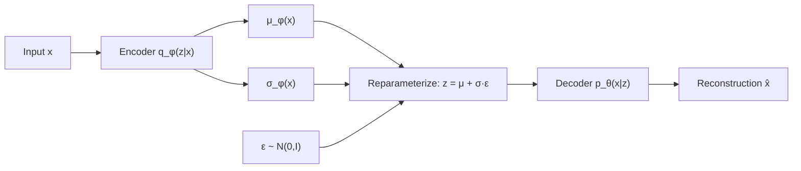

# Volume 01 — Deep Learning Foundations, Autoencoders, and VAE Foundations

**Lectures L01–L09** · Weeks 1–3

---

## L01: Introduction to Generative AI and Course Overview

### Learning objectives

- Distinguish generative models from discriminative models.
- State the core problem of generative modeling.
- Survey the landscape of modern generative AI.

### Discriminative vs. generative modeling

A **discriminative model** learns the conditional distribution \(P(y \mid x)\)—for example, classifying an image as "cat" or "dog." A **generative model** learns the data distribution \(P(x)\) or the joint distribution \(P(x, y)\), enabling **sampling** of new data points.

| Paradigm | Learns | Example task | Example output |
|----------|--------|--------------|----------------|
| Discriminative | \(P(y \mid x)\) | Image classification | Label |
| Generative | \(P(x)\) or \(P(x \mid c)\) | Image synthesis | New image |

### The generative modeling problem

Given i.i.d. samples \(\{x^{(1)}, \ldots, x^{(N)}\}\) from an unknown distribution \(p_{\text{data}}(x)\), we seek a parametric model \(p_\theta(x)\) such that:

1. **Density estimation:** \(p_\theta(x)\) approximates \(p_{\text{data}}(x)\).
2. **Sampling:** we can draw \(\tilde{x} \sim p_\theta(x)\).
3. **Likelihood:** we can evaluate \(\log p_\theta(x)\) for unseen data.

### Taxonomy of generative models

```
Explicit density          Implicit density
├── Autoregressive        ├── GANs
├── Flow models           └── Score-based / Diffusion
└── VAEs (lower bound)
```

### Key takeaways

- Generative AI creates new content by learning probability distributions.
- This course progresses from tractable models (autoencoders, VAEs) to adversarial and diffusion-based approaches, then to language models.

---

## L02: Neural Network Fundamentals for Generative Models

### Learning objectives

- Review feedforward networks, activation functions, and backpropagation.
- Understand how neural networks parameterize complex distributions.

### Feedforward computation

For layer \(l\), given input \(h^{(l-1)}\):

\[
h^{(l)} = \sigma\!\left(W^{(l)} h^{(l-1)} + b^{(l)}\right)
\]

where \(\sigma\) is a nonlinear activation (ReLU, GELU, sigmoid).

### Loss and optimization

For a dataset \(\mathcal{D}\), we minimize:

\[
\mathcal{L}(\theta) = \frac{1}{|\mathcal{D}|} \sum_{(x, y) \in \mathcal{D}} \ell\!\left(f_\theta(x), y\right)
\]

using stochastic gradient descent:

\[
\theta \leftarrow \theta - \eta \nabla_\theta \mathcal{L}(\theta)
\]

### Backpropagation

The chain rule propagates gradients backward:

\[
\frac{\partial \mathcal{L}}{\partial W^{(l)}} = \frac{\partial \mathcal{L}}{\partial h^{(l)}} \cdot \frac{\partial h^{(l)}}{\partial W^{(l)}}
\]

For generative models, the "target" \(y\) is often the input itself (reconstruction) or an adversarial signal.

### Universal approximation

Neural networks with sufficient width/depth can approximate arbitrary continuous functions (Cybenko, 1989; Hornik et al., 1989). This justifies using deep networks as flexible density estimators and decoders.

### Key takeaways

- Backpropagation is the workhorse for training all models in this course.
- Activation choices (ReLU for hidden layers, sigmoid/tanh for bounded outputs) matter for generative quality.

---

## L03: Convolutional Neural Networks: LeNet, VGG, ResNet

### Learning objectives

- Explain convolution, pooling, and spatial hierarchy.
- Compare LeNet, VGG, and ResNet architectures.

### Convolution operation

For input \(X\) and kernel \(K\) of size \(k \times k\):

\[
(X * K)_{i,j} = \sum_{m=0}^{k-1} \sum_{n=0}^{k-1} X_{i+m,\,j+n} \cdot K_{m,n}
\]

CNNs exploit **translation equivariance** and **local connectivity**, making them ideal for image generation and encoding.

### Architecture comparison

| Model | Year | Key idea | Depth |
|-------|------|----------|-------|
| LeNet-5 | 1998 | Conv + pool + FC | 5 layers |
| VGG-16 | 2014 | Small 3×3 filters, deep stacks | 16 layers |
| ResNet-50 | 2015 | Skip connections: \(h^{(l+1)} = h^{(l)} + F(h^{(l)})\) | 50 layers |

### Residual connections

\[
h^{(l+1)} = h^{(l)} + \mathcal{F}\!\left(h^{(l)}; W^{(l)}\right)
\]

Skip connections mitigate vanishing gradients and enable training very deep encoders/decoders—critical for VAEs and diffusion U-Nets.

### Role in generative AI

CNNs serve as:
- **Encoders** mapping images to latent codes (VAE, GAN discriminator input).
- **Decoders** generating images from latent vectors (DCGAN generator).
- **Backbones** in U-Net architectures for diffusion models.

---

## L04: Encoder-Decoder Architecture and Bottleneck Representations

### Learning objectives

- Describe the autoencoder architecture.
- Explain the role of the bottleneck latent space.

### Autoencoder structure

An autoencoder consists of:

1. **Encoder** \(f_\phi: \mathbb{R}^d \to \mathbb{R}^k\) — maps input to latent code \(z\).
2. **Decoder** \(g_\theta: \mathbb{R}^k \to \mathbb{R}^d\) — reconstructs input from \(z\).

\[
\hat{x} = g_\theta\!\left(f_\phi(x)\right)
\]

### Bottleneck principle

With \(k \ll d\), the network must learn a **compressed representation** that captures salient features. The bottleneck forces the model to discard noise and retain structure.

### Information-theoretic view

The bottleneck implements a form of **rate-distortion trade-off**: fewer bits in \(z\) mean higher compression but potentially higher reconstruction error.

### Applications

- Dimensionality reduction (nonlinear PCA)
- Pre-training representations for downstream tasks
- Foundation for VAEs (add probabilistic latent space)

---

## L05: Training Autoencoders and Reconstruction Loss

### Learning objectives

- Formulate the autoencoder training objective.
- Compare loss functions for different data types.

### Training objective

\[
\mathcal{L}_{\text{AE}}(\theta, \phi) = \frac{1}{N} \sum_{i=1}^{N} \|x^{(i)} - g_\theta(f_\phi(x^{(i)}))\|^2
\]

For binary images, cross-entropy is often preferred:

\[
\mathcal{L}_{\text{BCE}} = -\sum_j \left[x_j \log \hat{x}_j + (1 - x_j)\log(1 - \hat{x}_j)\right]
\]

### Latent space geometry

After training, nearby points in latent space \(\mathcal{Z}\) should correspond to semantically similar inputs. However, standard autoencoders have **holes** in \(\mathcal{Z}\)—regions that do not correspond to any training example—making random sampling unreliable.

### Limitations motivating VAEs

| Issue | Consequence |
|-------|-------------|
| Non-probabilistic latent space | Cannot sample meaningfully |
| No regularization on \(z\) | Overfitting; irregular latent geometry |
| Deterministic encoding | No uncertainty quantification |

---

## L06: Denoising and Sparse Autoencoders

### Learning objectives

- Understand denoising autoencoders (DAE) and their regularization effect.
- Describe sparse autoencoder objectives.

### Denoising autoencoder

Corrupt input \(\tilde{x} = \text{corrupt}(x)\) and train to recover \(x\):

\[
\mathcal{L}_{\text{DAE}} = \|x - g_\theta(f_\phi(\tilde{x}))\|^2
\]

Common corruptions: additive Gaussian noise, random masking (dropout), salt-and-pepper noise.

**Insight:** DAEs learn to capture the **manifold structure** of the data—projecting noisy points back onto the data manifold.

### Sparse autoencoder

Add an \(\ell_1\) penalty on activations:

\[
\mathcal{L}_{\text{sparse}} = \|x - \hat{x}\|^2 + \lambda \sum_l \|h^{(l)}\|_1
\]

This encourages each hidden unit to respond to a specific feature, improving interpretability.

### Connection to generative modeling

DAEs are closely related to **score matching** and **denoising score matching**, which underpin diffusion models (covered in Volume 03).

---

## L07: Latent Variable Models and the Probabilistic Perspective

### Learning objectives

- Formulate generative modeling with latent variables.
- Introduce variational inference as an approximation strategy.

### Latent variable model

Assume data is generated by sampling latent \(z \sim p(z)\), then \(x \sim p_\theta(x \mid z)\):

\[
p_\theta(x) = \int p_\theta(x \mid z)\, p(z)\, dz
\]

Typically \(p(z) = \mathcal{N}(0, I)\) and \(p_\theta(x \mid z) = \mathcal{N}(\mu_\theta(z), \sigma_\theta^2 I)\).

### Intractability

The marginal likelihood \(p_\theta(x) = \int p_\theta(x \mid z) p(z)\, dz\) is generally **intractable** for neural network decoders. We cannot compute \(\log p_\theta(x)\) exactly.

### Variational inference

Introduce an approximate posterior \(q_\phi(z \mid x)\) and optimize a lower bound on \(\log p_\theta(x)\) instead of the marginal directly.

### Key identity

\[
\log p_\theta(x) = \mathcal{L}(\theta, \phi; x) + D_{\mathrm{KL}}\!\left(q_\phi(z \mid x) \,\|\, p_\theta(z \mid x)\right)
\]

Since \(D_{\mathrm{KL}} \geq 0\), \(\mathcal{L}\) is a **lower bound** on the log-likelihood.

---

## L08: Variational Autoencoders and the Reparameterization Trick

### Learning objectives

- Describe the VAE architecture.
- Explain the reparameterization trick for gradient estimation.

### VAE architecture



The encoder outputs parameters of a Gaussian:

\[
q_\phi(z \mid x) = \mathcal{N}\!\left(z;\, \mu_\phi(x),\, \sigma_\phi^2(x)\right)
\]

### Reparameterization trick

To backpropagate through stochastic sampling:

\[
z = \mu_\phi(x) + \sigma_\phi(x) \odot \varepsilon, \quad \varepsilon \sim \mathcal{N}(0, I)
\]

This expresses \(z\) as a deterministic function of \(\phi\) and noise \(\varepsilon\), enabling gradient flow.

### Decoder

The decoder parameterizes \(p_\theta(x \mid z)\). For continuous data:

\[
p_\theta(x \mid z) = \mathcal{N}\!\left(x;\, \mu_\theta(z),\, \sigma_{\text{dec}}^2 I\right)
\]

Reconstruction loss becomes (up to constants) \(\|x - \mu_\theta(z)\|^2\).

---

## L09: Evidence Lower Bound (ELBO) Derivation

### Learning objectives

- Derive the ELBO step by step.
- Interpret the reconstruction and KL terms.

### Full derivation

Starting from the KL identity:

\[
D_{\mathrm{KL}}\!\left(q_\phi(z \mid x) \,\|\, p_\theta(z \mid x)\right) = \mathbb{E}_{q_\phi}\!\left[\log q_\phi(z \mid x) - \log p_\theta(z \mid x)\right]
\]

Using Bayes' rule, \(\log p_\theta(z \mid x) = \log p_\theta(x \mid z) + \log p(z) - \log p_\theta(x)\):

\[
\log p_\theta(x) = \mathbb{E}_{q_\phi}\!\left[\log p_\theta(x \mid z)\right] - D_{\mathrm{KL}}\!\left(q_\phi(z \mid x) \,\|\, p(z)\right) + D_{\mathrm{KL}}\!\left(q_\phi(z \mid x) \,\|\, p_\theta(z \mid x)\right)
\]

Dropping the non-negative KL term yields the **ELBO**:

\[
\boxed{\mathcal{L}(\theta, \phi; x) = \mathbb{E}_{q_\phi(z \mid x)}\!\left[\log p_\theta(x \mid z)\right] - D_{\mathrm{KL}}\!\left(q_\phi(z \mid x) \,\|\, p(z)\right)}
\]

### Gaussian case

With \(q_\phi(z \mid x) = \mathcal{N}(\mu_\phi, \sigma_\phi^2 I)\) and \(p(z) = \mathcal{N}(0, I)\):

\[
D_{\mathrm{KL}} = \frac{1}{2} \sum_{j=1}^{k} \left(\mu_j^2 + \sigma_j^2 - \log \sigma_j^2 - 1\right)
\]

### Training objective

\[
\mathcal{L}_{\text{VAE}} = \frac{1}{N} \sum_{i=1}^{N} \left[\|x^{(i)} - \mu_\theta(z^{(i)})\|^2 + \beta \cdot D_{\mathrm{KL}}\!\left(q_\phi(z \mid x^{(i)}) \,\|\, p(z)\right)\right]
\]

where \(z^{(i)} = \mu_\phi(x^{(i)}) + \sigma_\phi(x^{(i)}) \odot \varepsilon^{(i)}\).

### Interpretation

| Term | Role |
|------|------|
| Reconstruction \(\mathbb{E}[\log p_\theta(x \mid z)]\) | Fidelity of generated samples |
| KL penalty | Regularizes latent space toward prior; enables sampling \(z \sim p(z)\) |

### Key takeaways

- The ELBO trades off reconstruction quality against latent regularization.
- VAEs provide a principled probabilistic framework but often produce blurry images compared to GANs (Volume 02).

---

## Volume 01 summary

| Lecture | Core concept |
|---------|-------------|
| L01 | Generative vs. discriminative; taxonomy |
| L02 | Neural nets, backprop, optimization |
| L03 | CNNs: LeNet, VGG, ResNet |
| L04 | Autoencoder architecture |
| L05 | Reconstruction loss |
| L06 | Denoising and sparse autoencoders |
| L07 | Latent variable models |
| L08 | VAE + reparameterization trick |
| L09 | ELBO derivation |

**Next:** [Volume 02 — Advanced VAEs and GANs](vol-02.md)
