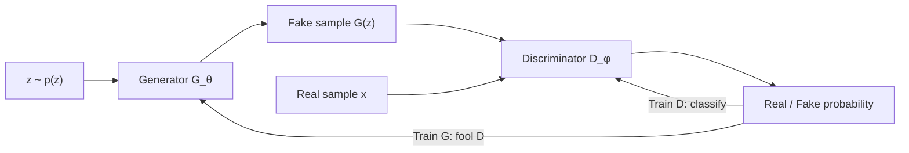

# Volume 02 — Advanced VAEs and Generative Adversarial Networks

**Lectures L10–L18** · Weeks 4–6

---

## L10: Conditional VAE (CVAE)

### Learning objectives

- Extend VAEs to conditional generation \(p(x \mid c)\).
- Derive the conditional ELBO.

### Conditional generative model

Given condition \(c\) (class label, text caption, attribute vector):

\[
p_\theta(x \mid c) = \int p_\theta(x \mid z, c)\, p(z \mid c)\, dz
\]

The encoder becomes \(q_\phi(z \mid x, c)\) and the decoder \(p_\theta(x \mid z, c)\).

### Conditional ELBO

\[
\mathcal{L}(\theta, \phi; x, c) = \mathbb{E}_{q_\phi(z \mid x, c)}\!\left[\log p_\theta(x \mid z, c)\right] - D_{\mathrm{KL}}\!\left(q_\phi(z \mid x, c) \,\|\, p(z \mid c)\right)
\]

Typically \(p(z \mid c) = p(z) = \mathcal{N}(0, I)\).

### Applications

- Class-conditional image generation (MNIST digits by label)
- Text-to-image conditioning (caption as \(c\))
- Controlled attribute manipulation

---

## L11: Beta-VAE and Disentangled Representations

### Learning objectives

- Understand disentanglement in latent spaces.
- Formulate the β-VAE objective.

### Disentanglement

A representation is **disentangled** if each latent dimension controls a single generative factor (e.g., rotation, color, scale) independently.

### β-VAE objective

\[
\mathcal{L}_{\beta\text{-VAE}} = \mathbb{E}_{q_\phi}\!\left[\log p_\theta(x \mid z)\right] - \beta \cdot D_{\mathrm{KL}}\!\left(q_\phi(z \mid x) \,\|\, p(z)\right)
\]

With \(\beta > 1\), stronger pressure on the KL term encourages **factorized** latent codes at the cost of reconstruction fidelity.

### Evaluation metrics

- **MIG** (Mutual Information Gap)
- **SAP** (Separated Attribute Predictability)
- **DCI** (Disentanglement, Completeness, Informativeness)

---

## L12: Latent Space Interpolation and VAE Limitations

### Learning objectives

- Perform latent space interpolation and arithmetic.
- Identify fundamental VAE limitations.

### Latent interpolation

Given encodings \(z_1 = \mu_\phi(x_1)\) and \(z_2 = \mu_\phi(x_2)\):

\[
z(\alpha) = (1 - \alpha)\, z_1 + \alpha\, z_2, \quad \alpha \in [0, 1]
\]

Decode \(\hat{x}(\alpha) = \mu_\theta(z(\alpha))\) for smooth morphing between inputs.

### Latent arithmetic

\[
z_{\text{result}} = z_{\text{king}} - z_{\text{man}} + z_{\text{woman}}
\]

### VAE limitations

| Limitation | Cause |
|------------|-------|
| Blurry outputs | Gaussian decoder assumption; MSE loss |
| Posterior collapse | KL → 0; decoder ignores \(z\) |
| Weak samples | ELBO is loose; \(p_\theta(x)\) underestimated |

These motivate adversarial training (GANs, next section).

---

## L13: Generative Adversarial Networks: Minimax Formulation

### Learning objectives

- Formulate GAN training as a two-player game.
- Derive the minimax objective and its practical variant.

### GAN architecture



- **Generator** \(G_\theta: \mathcal{Z} \to \mathcal{X}\) maps noise to data.
- **Discriminator** \(D_\phi: \mathcal{X} \to [0, 1]\) classifies real vs. fake.

### Minimax objective

\[
\min_G \max_D \; V(D, G) = \mathbb{E}_{x \sim p_{\text{data}}}\!\left[\log D(x)\right] + \mathbb{E}_{z \sim p(z)}\!\left[\log(1 - D(G(z)))\right]
\]

### Optimal discriminator

For fixed \(G\), the optimal discriminator is:

\[
D^*(x) = \frac{p_{\text{data}}(x)}{p_{\text{data}}(x) + p_G(x)}
\]

### Global optimum

At equilibrium, \(p_G = p_{\text{data}}\) and \(D^*(x) = \frac{1}{2}\).

### Non-saturating generator loss

In practice, the generator minimizes:

\[
\mathcal{L}_G = -\mathbb{E}_{z \sim p(z)}\!\left[\log D(G(z))\right]
\]

This avoids vanishing gradients when \(D\) confidently rejects fakes.

### Key equation summary

\[
\boxed{\min_\theta \max_\phi \; \mathbb{E}_{x}\!\left[\log D_\phi(x)\right] + \mathbb{E}_{z}\!\left[\log\!\left(1 - D_\phi(G_\theta(z))\right)\right]}
\]

---

## L14: GAN Training Dynamics and Mode Collapse

### Learning objectives

- Analyze GAN training instability.
- Describe mode collapse and mitigation strategies.

### Training challenges

| Problem | Description |
|---------|-------------|
| Mode collapse | Generator produces limited variety |
| Vanishing gradients | \(D\) too strong; \(G\) receives no useful signal |
| Oscillation | No stable Nash equilibrium |
| Non-convergence | Alternating updates don't guarantee convergence |

### Mode collapse

The generator maps many \(z\) values to a few outputs, failing to cover the full data distribution. Detection: low diversity in generated samples; low inception score variance.

### Mitigation techniques

1. **Minibatch discrimination** — discriminator sees batch statistics.
2. **Unrolled GANs** — simulate future discriminator updates.
3. **Spectral normalization** — constrain discriminator Lipschitz constant.
4. **Wasserstein GAN (WGAN)** — replace JS divergence with Wasserstein distance:

\[
\mathcal{L}_{\text{WGAN}} = \mathbb{E}_{x \sim p_{\text{data}}}[D(x)] - \mathbb{E}_{z \sim p(z)}[D(G(z))]
\]

with weight clipping or gradient penalty on \(D\).

---

## L15: DCGAN Architecture and Design Principles

### Learning objectives

- Apply DCGAN architectural guidelines.
- Understand transposed convolutions for upsampling.

### DCGAN guidelines (Radford et al., 2016)

1. Replace pooling with strided convolutions (discriminator) and transposed convolutions (generator).
2. Use batch normalization in both \(G\) and \(D\).
3. Remove fully connected hidden layers; use global average pooling.
4. Use ReLU in \(G\) (except output: tanh); LeakyReLU (0.2) in \(D\).

### Generator structure

```
z (100-d) → FC → 4×4×512 → ConvT → 8×8×256 → ... → 64×64×3
```

Each transposed convolution doubles spatial resolution while halving channels.

### Transposed convolution

For upsampling, transposed convolution (deconvolution) learns the upsampling kernel:

\[
y_{i,j} = \sum_{m,n} W_{m,n} \cdot x_{\lfloor i/s \rfloor,\, \lfloor j/s \rfloor}
\]

---

## L16: Conditional GAN and Pix2Pix

### Learning objectives

- Condition GAN generation on labels or paired inputs.
- Describe the Pix2Pix image-to-image framework.

### Conditional GAN (cGAN)

\[
\min_G \max_D \; \mathbb{E}_{x,y}\!\left[\log D(x, y)\right] + \mathbb{E}_{z,y}\!\left[\log(1 - D(G(z, y), y))\right]
\]

Condition \(y\) is concatenated to input (channel-wise) or embedded and added.

### Pix2Pix

For paired image translation (e.g., sketch → photo):

\[
\mathcal{L} = \mathcal{L}_{\text{cGAN}} + \lambda \mathcal{L}_{\text{L1}}
\]

where \(\mathcal{L}_{\text{L1}} = \|y - G(x)\|_1\) enforces pixel-level fidelity.

Uses a **U-Net generator** with skip connections and a **PatchGAN discriminator** that classifies local \(N \times N\) patches.

---

## L17: CycleGAN and Unpaired Image Translation

### Learning objectives

- Translate between domains without paired training data.
- Explain cycle consistency loss.

### Problem setting

Domains \(X\) and \(Y\) with unpaired samples. Learn \(G: X \to Y\) and \(F: Y \to X\).

### Cycle consistency

\[
\mathcal{L}_{\text{cycle}} = \mathbb{E}_{x \sim p_X}\!\left[\|F(G(x)) - x\|_1\right] + \mathbb{E}_{y \sim p_Y}\!\left[\|G(F(y)) - y\|_1\right]
\]

### Full objective

\[
\mathcal{L} = \mathcal{L}_{\text{GAN}}(G, D_Y) + \mathcal{L}_{\text{GAN}}(F, D_X) + \lambda \mathcal{L}_{\text{cycle}}
\]

### Applications

- Horse ↔ Zebra, summer ↔ winter, photo ↔ Monet painting

---

## L18: StyleGAN and GAN Evaluation Metrics

### Learning objectives

- Understand StyleGAN's style-based generator.
- Apply FID and related evaluation metrics.

### StyleGAN innovations

1. **Mapping network** — transforms \(z\) to intermediate latent \(w\) in a less entangled space.
2. **Adaptive instance normalization (AdaIN)** — injects style at each layer:

\[
\text{AdaIN}(x, y) = y_s \cdot \frac{x - \mu(x)}{\sigma(x)} + y_b
\]

3. **Progressive growing** — train on low resolution first, then add layers.

### Evaluation metrics

**Fréchet Inception Distance (FID):**

\[
\text{FID} = \|\mu_r - \mu_g\|^2 + \text{Tr}\!\left(\Sigma_r + \Sigma_g - 2(\Sigma_r \Sigma_g)^{1/2}\right)
\]

where \((\mu_r, \Sigma_r)\) and \((\mu_g, \Sigma_g)\) are mean and covariance of Inception features for real and generated images. Lower is better.

**Inception Score (IS):**

\[
\text{IS} = \exp\!\left(\mathbb{E}_x \left[D_{\mathrm{KL}}\!\left(p(y \mid x) \,\|\, p(y)\right)\right]\right)
\]

Higher IS indicates diverse, classifiable generated images.

---

## Volume 02 summary

| Lecture | Core concept |
|---------|-------------|
| L10 | Conditional VAE |
| L11 | β-VAE, disentanglement |
| L12 | Latent interpolation, VAE limits |
| L13 | GAN minimax objective |
| L14 | Mode collapse, WGAN |
| L15 | DCGAN architecture |
| L16 | cGAN, Pix2Pix |
| L17 | CycleGAN |
| L18 | StyleGAN, FID/IS |

**Previous:** [Volume 01](vol-01.md) · **Next:** [Volume 03 — Diffusion and Transformers](vol-03.md)
