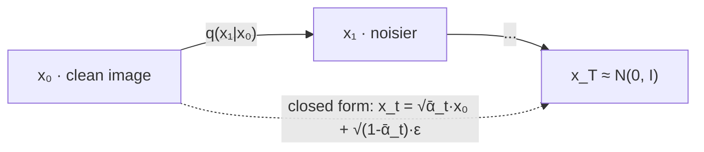
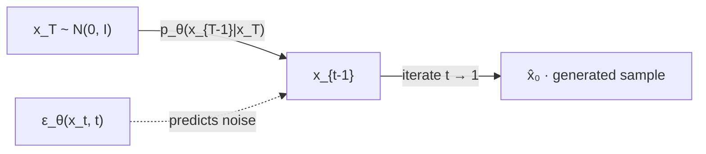
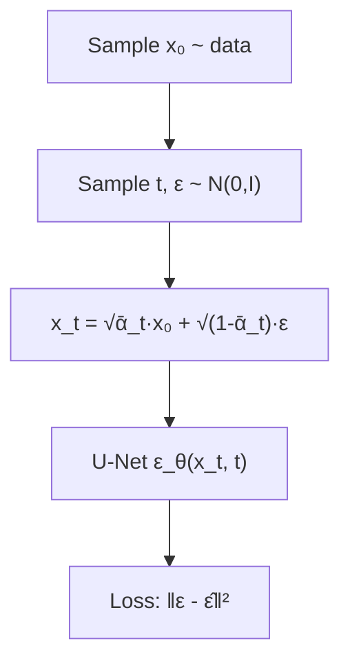
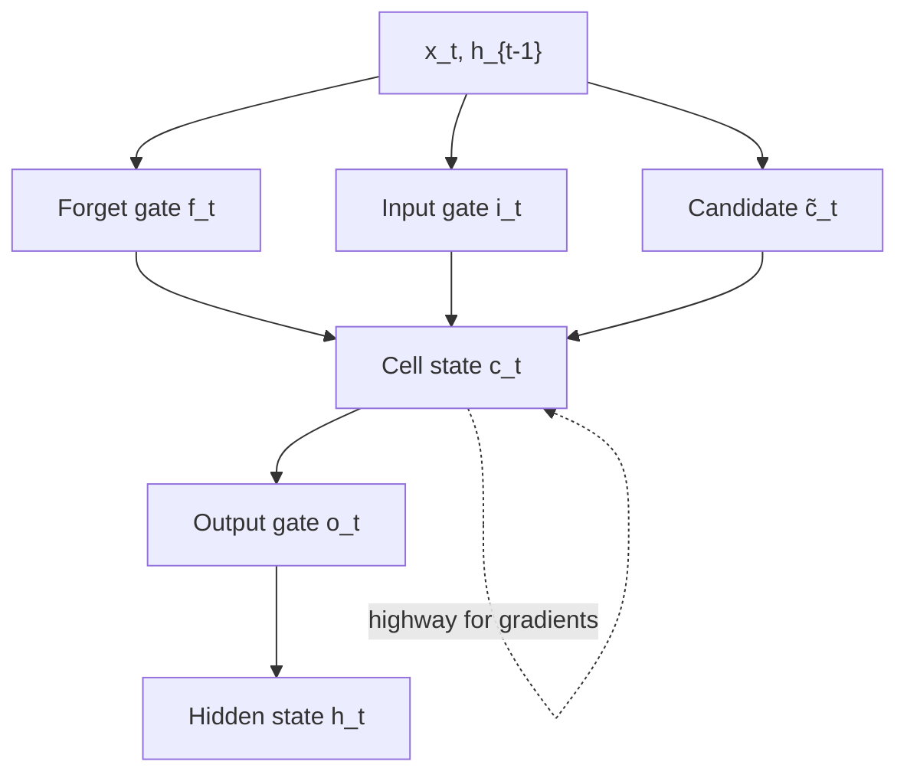
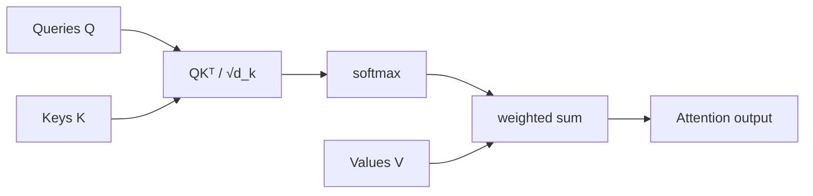

# Volume 03 — Diffusion Models, Sequence Models, and Transformers

**Lectures L19–L27** · Weeks 7–9

---

## L19: Forward Diffusion Process and Noise Schedules

### Learning objectives

- Define the forward diffusion (noising) process.
- Understand variance schedules $\beta_t$.

### Forward process

Given data $x_0 \sim q(x_0)$, define a Markov chain that gradually adds Gaussian noise over $T$ steps:

$$
q(x_t \mid x_{t-1}) = \mathcal{N}\!\left(x_t;\, \sqrt{1 - \beta_t}\, x_{t-1},\, \beta_t I\right)
$$

where $\{\beta_t\}_{t=1}^{T}$ is the **noise schedule** (typically $\beta_t \in [10^{-4}, 0.02]$).

### Closed-form marginal

Define $\alpha_t = 1 - \beta_t$ and $\bar{\alpha}_t = \prod_{s=1}^{t} \alpha_s$. Then:

$$
q(x_t \mid x_0) = \mathcal{N}\!\left(x_t;\, \sqrt{\bar{\alpha}_t}\, x_0,\, (1 - \bar{\alpha}_t)\, I\right)
$$

Equivalently:

$$
x_t = \sqrt{\bar{\alpha}_t}\, x_0 + \sqrt{1 - \bar{\alpha}_t}\, \varepsilon, \quad \varepsilon \sim \mathcal{N}(0, I)
$$

### Intuition

As $t \to T$, $\bar{\alpha}_t \to 0$ and $x_T \approx \mathcal{N}(0, I)$—pure noise. The forward process is fixed (no learnable parameters).

### Forward diffusion process



### Noise schedules

| Schedule | Formula | Property |
|----------|---------|----------|
| Linear | $\beta_t$ linear from $\beta_1$ to $\beta_T$ | Simple, widely used |
| Cosine | $\bar{\alpha}_t = \cos^2\!\left(\frac{t/T + s}{1+s} \cdot \frac{\pi}{2}\right)$ | Slower destruction at low $t$ |

---

## L20: Score-Based Models and Denoising Objectives

### Learning objectives

- Connect diffusion to score matching.
- Define the score function and denoising score matching.

### Score function

The **score** of a distribution is the gradient of log-density:

$$
s(x) = \nabla_x \log p(x)
$$

### Score matching objective

Train a network $s_\theta(x)$ to match the data score:

$$
\mathcal{L}_{\text{SM}} = \frac{1}{2}\mathbb{E}_{p(x)}\!\left[\|s_\theta(x) - \nabla_x \log p(x)\|^2\right]
$$

### Denoising score matching

Add noise $\tilde{x} = x + \sigma \varepsilon$ and train:

$$
\mathcal{L}_{\text{DSM}} = \mathbb{E}_{p(x), \varepsilon}\!\left[\|s_\theta(\tilde{x}) + \varepsilon / \sigma^2\|^2\right]
$$

### Connection to diffusion

At each noise level $t$, the score of $q(x_t)$ is:

$$
\nabla_{x_t} \log q(x_t \mid x_0) = -\frac{\varepsilon}{\sqrt{1 - \bar{\alpha}_t}}
$$

The diffusion model learns to predict the noise $\varepsilon$ added at step $t$.

---

## L21: DDPM: Reverse Diffusion Formulation

### Learning objectives

- Derive the reverse diffusion process.
- State the DDPM training objective.

### Reverse process

We learn the reverse transitions:

$$
p_\theta(x_{t-1} \mid x_t) = \mathcal{N}\!\left(x_{t-1};\, \mu_\theta(x_t, t),\, \sigma_t^2 I\right)
$$

### Simplified training objective (Ho et al., 2020)

Train a noise predictor $\varepsilon_\theta(x_t, t)$:

$$
\mathcal{L}_{\text{simple}} = \mathbb{E}_{t, x_0, \varepsilon}\!\left[\|\varepsilon - \varepsilon_\theta(x_t, t)\|^2\right]
$$

where $x_t = \sqrt{\bar{\alpha}_t}\, x_0 + \sqrt{1 - \bar{\alpha}_t}\, \varepsilon$.

### Sampling (reverse process)

At inference, start from $x_T \sim \mathcal{N}(0, I)$ and iterate:

$$
x_{t-1} = \frac{1}{\sqrt{\alpha_t}}\!\left(x_t - \frac{1 - \alpha_t}{\sqrt{1 - \bar{\alpha}_t}}\, \varepsilon_\theta(x_t, t)\right) + \sigma_t z
$$

where $z \sim \mathcal{N}(0, I)$ for $t > 1$ and $z = 0$ for $t = 1$.

### Reverse diffusion process



### Variational lower bound

The full DDPM objective is a weighted variational lower bound on $\log p_\theta(x_0)$, analogous to the VAE ELBO.

---

## L22: U-Net Architecture for Diffusion Models

### Learning objectives

- Describe the U-Net architecture used in diffusion models.
- Explain skip connections and time conditioning.

### U-Net structure

```
Input x_t (noisy) ──→ [Encoder blocks] ──→ Bottleneck ──→ [Decoder blocks] ──→ ε̂
                          ↓ skip connections ↑
```

Each block: Conv → GroupNorm → SiLU → Conv, with downsampling (encoder) or upsampling (decoder).

### Time conditioning

The timestep $t$ is embedded via sinusoidal encoding and injected into each block (via AdaGN or addition to activations):

$$
\text{emb}(t) = \left[\sin(t / 10000^{2i/d}),\, \cos(t / 10000^{2i/d})\right]_{i=0}^{d/2-1}
$$

### Why U-Net?

- **Multi-scale features** capture both global structure and fine detail.
- **Skip connections** preserve spatial information lost during downsampling.
- **Time conditioning** allows a single network to denoise at all noise levels.

---

## L23: DDPM Training Pipeline

### Learning objectives

- Outline the end-to-end DDPM training and sampling pipeline.
- Compare DDPM with accelerated samplers.

### Training algorithm

1. Sample $x_0 \sim p_{\text{data}}$, $t \sim \text{Uniform}(1, T)$, $\varepsilon \sim \mathcal{N}(0, I)$.
2. Compute $x_t = \sqrt{\bar{\alpha}_t}\, x_0 + \sqrt{1 - \bar{\alpha}_t}\, \varepsilon$.
3. Predict $\hat{\varepsilon} = \varepsilon_\theta(x_t, t)$.
4. Minimize $\|\varepsilon - \hat{\varepsilon}\|^2$.

### DDPM training pipeline



### Sampling algorithm

1. $x_T \sim \mathcal{N}(0, I)$.
2. For $t = T, T-1, \ldots, 1$: compute $x_{t-1}$ from $x_t$ using learned reverse step.
3. Return $x_0$.

### Accelerated sampling

| Method | Idea | Speedup |
|--------|------|---------|
| DDIM | Deterministic, non-Markovian reverse | 10–50× |
| DPM-Solver | ODE-based solver | 10–20× |
| Latent diffusion | Diffuse in VAE latent space (Stable Diffusion) | Memory + speed |

---

## L24: Classifier Guidance and Conditional Diffusion

### Learning objectives

- Apply classifier guidance for class-conditional generation.
- Describe classifier-free guidance.

### Classifier guidance (Dhariwal & Nichol, 2021)

Modify the reverse score with a pretrained classifier $p_\phi(y \mid x_t)$:

$$
\hat{\varepsilon} = \varepsilon_\theta(x_t, t) - \sqrt{1 - \bar{\alpha}_t}\, \nabla_{x_t} \log p_\phi(y \mid x_t)
$$

The gradient pushes samples toward class $y$.

### Classifier-free guidance

Train a single conditional model $\varepsilon_\theta(x_t, t, c)$ and interpolate at sampling:

$$
\hat{\varepsilon} = \varepsilon_\theta(x_t, t, \varnothing) + w \cdot \left(\varepsilon_\theta(x_t, t, c) - \varepsilon_\theta(x_t, t, \varnothing)\right)
$$

where $w > 1$ amplifies conditioning strength. Used in Stable Diffusion and DALL·E 2.

---

## L25: Sequence Models, RNNs, and Backpropagation Through Time

### Learning objectives

- Formulate sequence modeling with RNNs.
- Derive backpropagation through time (BPTT).

### Sequence modeling problem

Given tokens $x_1, x_2, \ldots, x_T$, model:

$$
P(x_1, \ldots, x_T) = \prod_{t=1}^{T} P(x_t \mid x_{<t})
$$

### Vanilla RNN

$$
h_t = \tanh(W_{hh} h_{t-1} + W_{xh} x_t + b_h), \quad y_t = W_{hy} h_t + b_y
$$

### BPTT

Unroll the RNN over $T$ steps and apply standard backpropagation. Gradients flow through time:

$$
\frac{\partial \mathcal{L}}{\partial h_t} = \frac{\partial \mathcal{L}}{\partial h_{t+1}} \cdot \frac{\partial h_{t+1}}{\partial h_t} + \frac{\partial \mathcal{L}_t}{\partial h_t}
$$

### Vanishing/exploding gradients

Repeated multiplication by $W_{hh}$ causes gradients to vanish (long-range dependencies lost) or explode. Motivates LSTM/GRU and ultimately transformers.

---

## L26: LSTMs, GRUs, and Sequence-to-Sequence

### Learning objectives

- Explain LSTM gating mechanisms.
- Describe encoder-decoder seq2seq with attention preview.

### LSTM cell

$$
\begin{aligned}
f_t &= \sigma(W_f [h_{t-1}, x_t] + b_f) & \text{(forget gate)} \\
i_t &= \sigma(W_i [h_{t-1}, x_t] + b_i) & \text{(input gate)} \\
\tilde{c}_t &= \tanh(W_c [h_{t-1}, x_t] + b_c) & \text{(candidate)} \\
c_t &= f_t \odot c_{t-1} + i_t \odot \tilde{c}_t & \text{(cell state)} \\
o_t &= \sigma(W_o [h_{t-1}, x_t] + b_o) & \text{(output gate)} \\
h_t &= o_t \odot \tanh(c_t)
\end{aligned}
$$

The cell state $c_t$ provides a highway for gradient flow across long sequences.

### LSTM cell diagram



### Seq2seq

Encoder RNN processes input sequence into context vector; decoder RNN generates output sequence. Limitation: fixed-size context bottleneck → attention (L27).

---

## L27: Motivation for Transformers and Attention Mechanisms

### Learning objectives

- Define scaled dot-product attention.
- Motivate self-attention over recurrence.

### Attention mechanism

Given query $Q$, keys $K$, values $V$:

$$
\text{Attention}(Q, K, V) = \text{softmax}\!\left(\frac{QK^\top}{\sqrt{d_k}}\right) V
$$

### Scaled dot-product attention equation

$$
\boxed{\text{Attention}(Q, K, V) = \text{softmax}\!\left(\frac{QK^\top}{\sqrt{d_k}}\right) V}
$$

The scaling factor $\sqrt{d_k}$ prevents softmax saturation for large $d_k$.

### Self-attention

Set $Q = K = V = XW$ (projections of input sequence). Each position attends to all positions:

$$
\text{SelfAttention}(X) = \text{softmax}\!\left(\frac{XW_Q (XW_K)^\top}{\sqrt{d_k}}\right) XW_V
$$

### Scaled dot-product attention



### Why transformers?

| RNN limitation | Transformer advantage |
|----------------|---------------------|
| Sequential computation | Parallel over sequence |
| Vanishing gradients | Direct connections via attention |
| Fixed context bottleneck | All-pairs attention |

### Multi-head attention preview

Apply attention $h$ times with different projections and concatenate:

$$
\text{MultiHead}(Q, K, V) = \text{Concat}(\text{head}_1, \ldots, \text{head}_h)\, W^O
$$

Full transformer architecture is developed in Volume 04 (L28).

---

## Volume 03 summary

| Lecture | Core concept |
|---------|-------------|
| L19 | Forward diffusion, noise schedules |
| L20 | Score matching |
| L21 | DDPM reverse process |
| L22 | U-Net for diffusion |
| L23 | DDPM training/sampling |
| L24 | Classifier guidance |
| L25 | RNNs, BPTT |
| L26 | LSTM, seq2seq |
| L27 | Attention mechanism |

**Previous:** [Volume 02](vol-02.md) · **Next:** [Volume 04 — LLMs, RAG, Ethics](vol-04.md)
