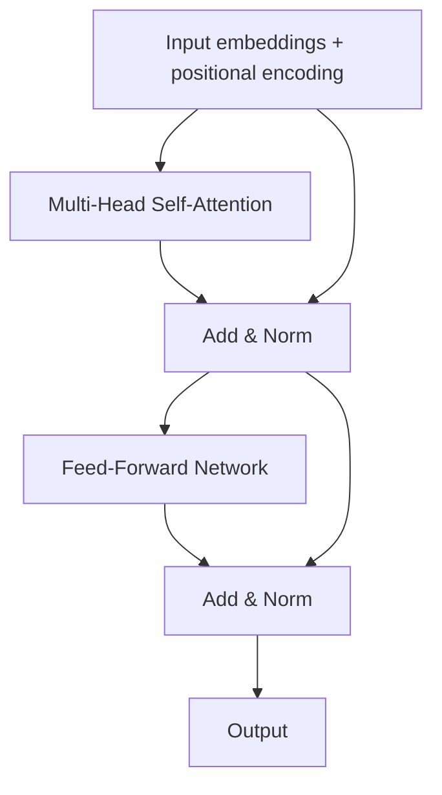
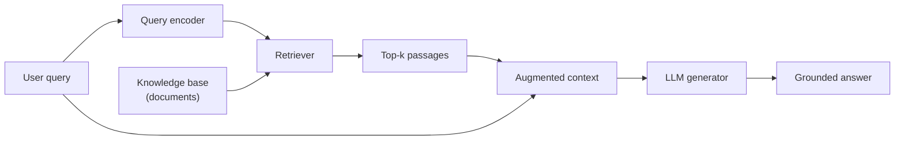

# Volume 04 — Large Language Models, RAG, Multimodal AI, and Ethics

**Lectures L28–L36** · Weeks 10–12

---

## L28: Transformer Architecture and Self-Attention

### Learning objectives

- Describe the full transformer encoder block.
- Implement multi-head self-attention.

### Transformer block

### Multi-head attention

For head \(i\):

\[
\text{head}_i = \text{Attention}(XW_i^Q, XW_i^K, XW_i^V)
\]

\[
\text{MultiHead}(X) = \text{Concat}(\text{head}_1, \ldots, \text{head}_h)\, W^O
\]

### Feed-forward sublayer

\[
\text{FFN}(x) = \max(0, xW_1 + b_1)\, W_2 + b_2
\]

Applied position-wise (identical network at each position, different parameters from attention).

### Layer normalization and residuals

\[
x' = \text{LayerNorm}(x + \text{Sublayer}(x))
\]

### Complexity

Self-attention has \(O(n^2 d)\) time and memory for sequence length \(n\), compared to \(O(n d^2)\) for RNNs—but with full parallelism over \(n\).

### Decoder-only vs. encoder-decoder

| Architecture | Used in | Masking |
|--------------|---------|---------|
| Encoder-only | BERT | Bidirectional |
| Decoder-only | GPT | Causal (left-to-right) |
| Encoder-decoder | T5, BART | Cross-attention |

---

## L29: Tokenization, Embeddings, and Positional Encoding

### Learning objectives

- Compare tokenization strategies (BPE, WordPiece, SentencePiece).
- Explain positional encoding schemes.

### Tokenization

Text is split into **tokens**—subword units that balance vocabulary size and coverage:

| Method | Used by | Idea |
|--------|---------|------|
| BPE | GPT-2/3/4 | Merge frequent byte pairs |
| WordPiece | BERT | Likelihood-based merges |
| SentencePiece | T5, Llama | Language-agnostic; no pre-tokenization |

### Embeddings

Token IDs are mapped to vectors via a learned embedding matrix \(E \in \mathbb{R}^{|V| \times d}\):

\[
x_i = E[\text{token\_id}_i]
\]

### Sinusoidal positional encoding (original Transformer)

\[
PE_{(pos, 2i)} = \sin\!\left(pos / 10000^{2i/d}\right), \quad PE_{(pos, 2i+1)} = \cos\!\left(pos / 10000^{2i/d}\right)
\]

### Learned positional embeddings

Modern models (GPT, BERT) use learned position embeddings. **RoPE** (Rotary Position Embedding) encodes relative positions in attention dot products and scales to long contexts.

---

## L30: Prompt Engineering and In-Context Learning

### Learning objectives

- Apply prompting strategies for LLM tasks.
- Explain in-context learning without gradient updates.

### Prompting strategies

| Strategy | Description |
|----------|-------------|
| Zero-shot | Task description only |
| Few-shot | Include exemplar input-output pairs |
| Chain-of-thought | Ask model to reason step by step |
| System prompt | Set role, constraints, format |

### In-context learning

LLMs conditioned on demonstration examples \(\{(x_i, y_i)\}\) perform tasks without parameter updates:

\[
P(y \mid x, \{(x_i, y_i)\}_{i=1}^{k}) 
\]

This emerges from pre-training on diverse text but is not equivalent to true learning—performance is sensitive to example selection and ordering.

### Scaling laws

Model performance improves predictably with compute, data, and parameters (Kaplan et al., 2020; Hoffmann et al., 2022—Chinchilla optimal allocation).

---

## L31: Retrieval-Augmented Generation Architecture

### Learning objectives

- Design a RAG pipeline combining retrieval and generation.
- Understand when RAG outperforms fine-tuning alone.

### RAG architecture

### Formal formulation (Lewis et al., 2020)

Given query \(x\), retrieve documents \(z \in \mathcal{Z}\) and generate:

\[
p(y \mid x) = \sum_{z \in \mathcal{Z}} p_\eta(z \mid x)\, p_\theta(y \mid x, z)
\]

where \(p_\eta\) is the retriever and \(p_\theta\) is the generator (LLM).

### Retrieval scoring

**Dense retrieval** with bi-encoder:

\[
\text{score}(q, d) = \text{sim}(E_q(q), E_d(d)) = \frac{E_q(q)^\top E_d(d)}{\|E_q(q)\|\,\|E_d(d)\|}
\]

### Advantages over fine-tuning

- **Updatable knowledge** — swap document index without retraining.
- **Attribution** — cite retrieved passages.
- **Reduced hallucination** — grounded in retrieved evidence.

---

## L32: Vector Databases and Document Chunking

### Learning objectives

- Implement document chunking strategies for RAG.
- Select and use vector databases.

### Chunking strategies

| Strategy | Chunk size | Overlap | Use case |
|----------|-----------|---------|----------|
| Fixed-size | 256–512 tokens | 10–20% | General documents |
| Semantic | Variable | None | Structured content |
| Recursive | Hierarchical | Parent-child | Long reports |

### Embedding pipeline

1. Chunk documents → \(\{c_1, \ldots, c_M\}\).
2. Embed each chunk: \(v_i = E_d(c_i)\).
3. Store \((v_i, \text{metadata}_i)\) in vector database.

### Vector databases

| System | Features |
|--------|----------|
| FAISS | In-memory, fast similarity search |
| Pinecone | Managed, scalable |
| Chroma | Lightweight, local |
| pgvector | PostgreSQL extension |

### Approximate nearest neighbor (ANN)

For large corpora, exact search is too slow. ANN algorithms (HNSW, IVF) trade accuracy for speed:

\[
\mathcal{Z}_k = \text{ANN}_k\!\left(E_q(q),\, \{v_i\}_{i=1}^{M}\right)
\]

---

## L33: Fine-Tuning with LoRA and Parameter-Efficient Methods

### Learning objectives

- Apply LoRA for efficient fine-tuning.
- Compare PEFT methods.

### Full fine-tuning cost

Updating all parameters of a 7B model requires storing optimizer states for 7B+ parameters—prohibitive for most practitioners.

### LoRA (Low-Rank Adaptation)

Freeze pretrained weights \(W_0\) and add a low-rank update:

\[
W = W_0 + \Delta W = W_0 + BA
\]

where \(B \in \mathbb{R}^{d \times r}\), \(A \in \mathbb{R}^{r \times k}\), and rank \(r \ll \min(d, k)\).

Train only \(A\) and \(B\)—typically < 1% of original parameters.

### Other PEFT methods

| Method | Mechanism |
|--------|-----------|
| Prefix tuning | Learnable prefix tokens prepended to input |
| Adapter layers | Small bottleneck layers inserted in transformer |
| QLoRA | LoRA + 4-bit quantized base model |

### When to use RAG vs. fine-tuning

| Criterion | RAG | Fine-tuning |
|-----------|-----|-------------|
| Dynamic knowledge | ✓ | ✗ |
| Style/format control | Limited | ✓ |
| Latency | Higher (retrieval step) | Lower |
| Infrastructure | Vector DB required | GPU for training |

---

## L34: Multimodal AI: Vision-Language Models

### Learning objectives

- Describe CLIP and its contrastive training.
- Survey multimodal LLM architectures.

### CLIP (Contrastive Language-Image Pre-training)

Train image encoder \(f_I\) and text encoder \(f_T\) with contrastive loss:

\[
\mathcal{L} = -\frac{1}{N}\sum_i \log \frac{\exp(\text{sim}(f_I(x_i), f_T(t_i)) / \tau)}{\sum_j \exp(\text{sim}(f_I(x_i), f_T(t_j)) / \tau)}
\]

Enables zero-shot image classification via text prompts.

### Multimodal LLMs

| Model | Approach |
|-------|----------|
| LLaVA | Project vision features into LLM token space |
| GPT-4V | Unified multimodal transformer |
| Flamingo | Cross-attention to visual features |
| Stable Diffusion | Text-conditioned image generation (diffusion) |

### Unified architectures

Modern trend: treat images, audio, and text as token sequences in a single transformer, with modality-specific encoders projecting to a shared embedding space.

---

## L35: LLM Evaluation, Hallucinations, and Safety

### Learning objectives

- Apply standard LLM benchmarks.
- Identify and mitigate hallucinations.

### Evaluation benchmarks

| Benchmark | Measures |
|-----------|----------|
| MMLU | Multi-domain knowledge (57 subjects) |
| HellaSwag | Commonsense reasoning |
| HumanEval | Code generation |
| TruthfulQA | Factual accuracy |
| MT-Bench | Multi-turn conversation quality |

### Hallucinations

**Hallucination** = model generates plausible but factually incorrect content.

| Type | Example |
|------|---------|
| Intrinsic | Contradicts source document |
| Extrinsic | Invents facts not in any source |

### Mitigation

1. **RAG** — ground responses in retrieved documents.
2. **Constitutional AI** — train with principle-based feedback.
3. **Uncertainty estimation** — calibrate confidence; abstain when uncertain.
4. **Human-in-the-loop** — review high-stakes outputs.

### Safety alignment

- **RLHF** (Reinforcement Learning from Human Feedback): train reward model on human preferences, optimize policy with PPO.
- **DPO** (Direct Preference Optimization): bypass reward model; optimize directly on preference pairs.

---

## L36: Bias, Fairness, and Ethics in Generative AI

### Learning objectives

- Identify sources of bias in generative models.
- Apply ethical frameworks for AI deployment.

### Sources of bias

1. **Training data** — reflects societal biases, underrepresentation.
2. **Objective function** — likelihood maximization doesn't encode fairness.
3. **Deployment context** — model used beyond intended scope.

### Fairness metrics

| Metric | Definition |
|--------|------------|
| Demographic parity | Equal positive rates across groups |
| Equalized odds | Equal TPR and FPR across groups |
| Calibration | Predicted probabilities match outcomes |

### Environmental impact

Training large models consumes significant energy. Inference at scale adds ongoing cost. Consider model size vs. task requirements.

### Ethical principles

1. **Transparency** — disclose AI-generated content.
2. **Accountability** — human oversight for consequential decisions.
3. **Privacy** — protect training data; avoid memorization attacks.
4. **Accessibility** — consider who benefits and who is harmed.

### Regulatory landscape

- EU AI Act (risk-based classification)
- NIST AI Risk Management Framework
- India's Digital Personal Data Protection Act

### Course conclusion

This course traced generative AI from first principles—probability, neural networks, and optimization—through VAEs, GANs, diffusion models, transformers, and LLMs. The field evolves rapidly; the mathematical foundations developed here provide durable tools for understanding new architectures as they emerge.

---

## Volume 04 summary

| Lecture | Core concept |
|---------|-------------|
| L28 | Transformer architecture |
| L29 | Tokenization, positional encoding |
| L30 | Prompt engineering, in-context learning |
| L31 | RAG architecture |
| L32 | Vector DBs, chunking |
| L33 | LoRA, PEFT |
| L34 | Multimodal AI, CLIP |
| L35 | Evaluation, hallucinations |
| L36 | Bias, fairness, ethics |

**Previous:** [Volume 03](vol-03.md)
