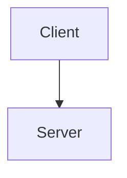

# notes-2 lecture file style

Each file `lectures/Mxx-slug.md` follows this shape:

```
# Mxx: Title From Playlist

**Source:** https://www.youtube.com/watch?v=...
**Instructor / expert:** ...

### Learning objectives
- 3–6 bullets of what THIS lecture actually taught

### Core concepts
Prose + headings + tables covering **every topic, definition, named protocol, algorithm, standard, example, and conclusion** from the transcript.
Correct obvious ASR errors (e.g. anology → deontology) using standard networking/security terminology.
Do not invent material the lecture did not teach.

### Diagrams
At least one mermaid or ASCII diagram when the lecture describes a stack, handshake, architecture, packet format, or process. Use:



Keep mermaid simple (flowchart / sequenceDiagram). No HTML.

### Key terms
| Term | Meaning in this lecture |

### Lecture takeaways
Dense recap of conclusions the instructor actually stated.
```
