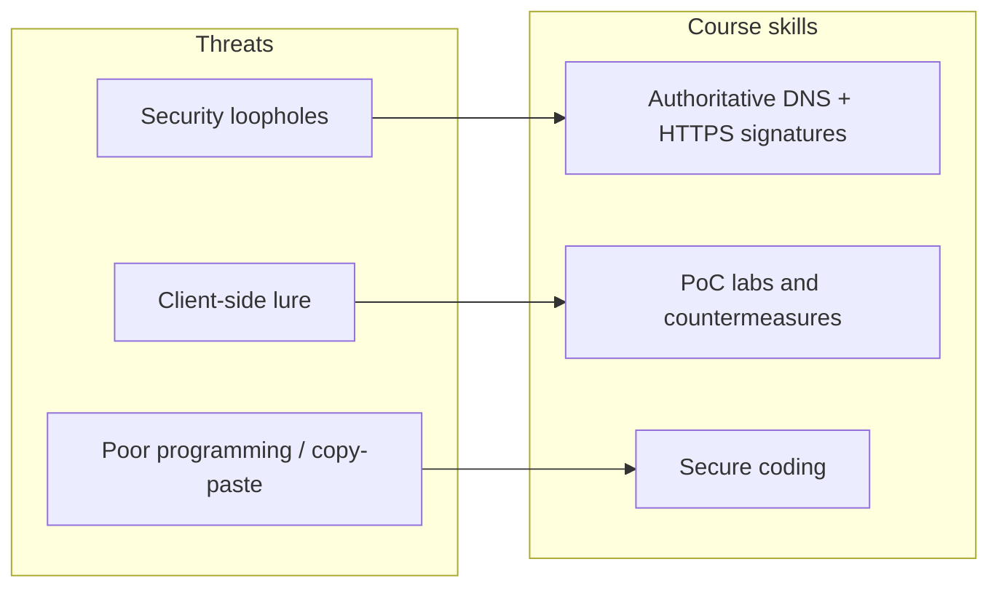

# M00: Introductory Video — Information Security

**Source:** https://www.youtube.com/watch?v=g0jhMsXaL6Q
**Coordinator:** Dr. Maninder Singh, Professor and Dean of Academic Affairs, Thapar University, Patiala

### Learning objectives

- State why information security now spans individuals and enterprises.
- List the course's promised themes: web trust, DNS, HTTPS, client-side attacks, and secure coding.
- Explain the coordinator's claim that poor programming is the root cause of most information-security threats.
- Recall that this is a short, two-credit course on information and network security.

### Core concepts

Information security is no longer a specialist niche. The coordinator opens from **threat anatomy** to a **comprehensive picture of cyber hygiene**: loopholes in an organization give criminals a breakthrough they can exploit, whether the target is a single person or an enterprise.

The course promises a **big-picture tour** that starts with fundamentals of a **secure web surface**:

- **Recognizing fake websites** using **authoritative DNS replies** (not just a page that "looks" official).
- **Verifying digital signatures** when the site uses **HTTPS**.
- A **hands-on DNS poisoning** demonstration, so students see how name resolution can be subverted.
- An argument developed across later lectures: the **main root cause of information-security threats is poor programming**. Copy-paste ("Ctrl+C / Ctrl+V") coding across generations of software is called out as a habit to **discourage**.

**Client-side attacks** get a dedicated proof-of-concept because they are a **critical attack vector**. Securing one server or asset is comparatively easy; if the **client willingly visits a malicious site**, the defender has almost no remaining control. Through a **series of proofs of concept**, students should learn to **deploy countermeasures** and, more importantly, to **practice secure coding** — described as the **ultimate goal of the course**.

The offering is an **eight-week, two-credit** short-term course. Paradigms to be covered include:

- Information security and **network security**
- **Operating-system** and **database** security issues
- **DNS poisoning** in depth, including **authoritative answers**
- Competencies against **client-side attacks**

The closer: information security is needed to keep the **hygiene of the connected world**; the faster it is understood, the better.

### Key terms

| Term | Meaning in this lecture |
|------|-------------------------|
| Security loophole | Organizational gap that lets an attacker break in and exploit a vulnerability |
| Authoritative DNS reply | Name-server answer that should be trusted when judging whether a site is genuine |
| HTTPS digital signature | Cryptographic check that the web server is the claimed site |
| DNS poisoning | Tampering with name resolution so users reach a fake host |
| Client-side attack | Compromise that succeeds because the user (browser) approaches a malicious site |
| Secure coding | The course's stated end-goal: stop shipping the vulnerabilities that attacks exploit |

### Lecture takeaways

- Security is ambient: individual and enterprise alike.
- Trust on the web is technical (DNS + HTTPS), not visual.
- Poor programming, especially copy-paste reuse, is framed as the root cause of threats.
- Client-side attacks are hard to stop once the user cooperates with the attacker.
- The two-credit course aims at network, OS, database, DNS, and secure-coding competence.
