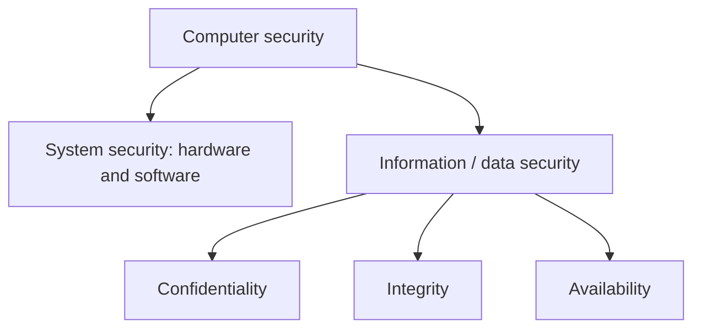
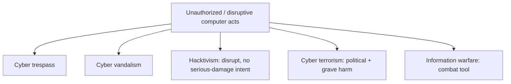

# M01: Information Security

**Source:** https://www.youtube.com/watch?v=q4BLwk2kOGs
**Instructor / expert:** Dr Navdeep Singh, Department of Computer Engineering, Punjabi University Patiala (course coordinator: Dr Maninder Singh, Thapar University, Patiala)

### Learning objectives

- Define ethics and contrast consequentialism with deontology as approaches to right and wrong.
- Distinguish system security from information (data) security and state the CIA triad.
- Relate computer-security breaches and overly protective measures to rights, harms, and interests.
- Contrast hacking vs cracking, cyber trespass vs cyber vandalism, and cyber terrorism vs hacktivism vs information warfare.
- Explain why codes of ethics are not enough for information-security professionals.
- State why privacy matters, how IT enables dataveillance, and what concerns arise from public-space tracking and biometrics.

### Core concepts

This lecture is on **social and ethical issues of information security**, not a catalogue of technical controls. The closer points ahead to the next lecture on **information security management**.

#### Ethics

**Ethics** is the field of study concerned with distinguishing **right from wrong** and **good from bad**. It analyzes the morality of human behaviours, policies, laws, and social structures. Ethicists try to justify moral judgments by referring to ethical principles or theories that capture intuitions about what is right and wrong.

The two theoretical approaches most common in ethics:

| Approach | Core assumption |
|----------|-----------------|
| **Consequentialism** | Actions are wrong to the extent that they have **bad consequences**. |
| **Deontology** | People have **moral duties** that exist **independently** of any good or bad consequences their actions may have. |

Ethical principles often **inform legislation**, but ethics recognizes that **legislation cannot substitute for morality**. Individuals and corporations must therefore consider **both the legality and the morality** of their actions.

#### Computer ethics

Ethical analysis of security and privacy in IT mainly happens in **computer ethics**, which emerged in the **1980s**. Computer ethics analyzes:

- Moral responsibilities of **computer professionals** and **computer users**.
- Ethical issues in **public policy** for IT development and use.

Sample questions the field asks:

- Is it wrong for corporations to **read employees' email**?
- Is it morally permissible for users to **copy copyrighted software**?
- Should people be free to put **controversial or pornographic** content online **without censorship**?

Such questions require **moral (ethical) analysis**: clarify the **moral dilemmas**, get clear on the **facts and values**, find a **balance** among values, rights, and interests, and **propose or evaluate** policies and courses of action.

#### Moral importance of computer security

**Computer security** (as a field of computer science) applies security features to computer systems to protect against:

- **Unauthorized disclosure, manipulation, or deletion** of information.
- **Denial of service**.

The resulting condition is also called computer security. Professionals aim to protect **valuable information** and **system resources**.

A distinction:

| Term | What is protected |
|------|-------------------|
| **System security** | Hardware and software against **malicious programs** that sabotage system resources |
| **Information security** (data security) | Data that **resides on disk drives** or is **transmitted between systems** |

Information security is customarily defined around three aspects of data — the **CIA triad**:

- **Confidentiality**
- **Integrity**
- **Availability**

#### How computer security poses ethical issues

Ethics is mostly concerned with **rights, harms, and interests**. The lecture therefore asks:

- What **morally important benefits** can computer security bring?
- What **morally important harms** or **violations of moral rights** can result from a **lack** of computer security?
- Can computer security **itself** cause harms or violate rights instead of preventing them?

#### Harms from breaches

**Economic harm.** If system security is undermined, valuable hardware and software may be damaged or corrupted and service may become unavailable — losses of **time, money, and resources**. Breaches of **information** security may cost even more: data can be worth far more than the hardware that stores it.

**Non-economic value.** Stored data may have **personal, cultural, or social** value, not only economic value.

**Psychological / emotional harm.** Any loss of system or data security is more likely to cause some amount of psychological or emotional harm.

**Injury and death.** This can occur in **safety-critical systems**: computer systems with a component of **real-time control** that can have a **direct life-threatening impact**. Examples given:

- Nuclear-reactor control
- Aircraft and air-traffic control
- Missile systems
- Medical-treatment systems

Other systems can threaten life **indirectly** if corrupted: systems used for **design, monitoring, diagnosis, or decision making** (e.g. **bridge design** or **medical diagnosis**).

#### Confidentiality, property, and privacy

Third parties may compromise confidentiality by **accessing, copying, and disseminating** information.

- **Property rights**, including **intellectual property rights** — rights to own and use intellectual creations such as artistic or literary works and industrial designs. If information is exclusively owned, the owner may determine who can access and use it; unauthorized access violates that right.
- **Privacy rights** — when the accessed information is about persons and is considered **private**.
- **Other harms** from dissemination and use of confidential information: e.g. leaking **internal matters of a firm** damages its **reputation**; compromising **online credit-card transactions** undermines **trust** in online financial transactions and harms **e-banking** and **e-commerce**.

#### Availability, freedom of information, and free speech

Prolonged or **intentional** compromises of availability can violate **freedom rights**, specifically:

- **Freedom of information** — the right to access and use **public** information. Shutting down vital information services could violate this right.
- **Free speech** — computer networks are an important medium for speech (websites, email, bulletin boards, and other services). Blocking access (e.g. **denial-of-service attacks** or **hijackings of websites**) is classified as a **violation of free speech**.

#### When security measures themselves cause harm

Computer-security measures normally **prevent harms and protect rights**, but they can also **cause harm and violate rights**:

- Measures may be so protective that they **discourage or prevent** stakeholders from accessing information or using services.
- Measures may be **discriminatory**: they may wrongly **exclude** certain classes of users, or wrongly **privilege** some classes over others.

#### Ethical issue 1: hacking and computer crime

A large part of computer security is protection against **unauthorized intentional break-ins or disruptions**. Such action is often called **hacking**.

| Term as taught | Meaning |
|----------------|---------|
| **Hacking** (general) | Use of computer skills to gain **unauthorized access** to computer resources. Hackers are highly skilled users who often form communities to share knowledge and data. |
| **Hacking** (negative definition) | Unauthorized access for **malicious** purposes: steal information and software, corrupt data, or disrupt operations. |
| **Hacking vs cracking** (self-identified hackers) | **Hacking** = non-malicious break-ins; **cracking** = malicious and disruptive break-ins. |

Self-identified hackers often justify their activity by arguing they cause **no real harm** and instead have a **positive impact**: they **free data** for everyone's benefit and **improve systems** by exposing security holes. These claims are part of the **hacker ethic** (hacker **code of ethics**), including convictions that:

- **Information should be free**.
- **Access to computers should be unlimited and total**.
- Activities in cyberspace **cannot do harm in the real world**.

The lecture rejects the “information should be free” claim as running **counter to intellectual property**: creators would have no right to keep information or profit from it. It would also **undermine privacy** and the **integrity and accuracy** of information, because anyone who accessed it could modify it at will.

Not all computer crime compromises computer security. Two **major types that do**:

| Type | Definition |
|------|------------|
| **Cyber trespass** | Use of IT to gain **unauthorized access** to computer systems or password-protected websites |
| **Cyber vandalism** | Use of IT to unleash programs that **disrupt** computer-network operations or **corrupt data** |

#### Ethical issue 2: cyber terrorism and information warfare

**Cyber terrorism:** politically motivated hacking operations intended to cause **grave harm** — **loss of life** or **severe economic loss**, or both. A major concern since the **9/11 attacks** has been attacks on **information infrastructure** meant to debilitate or compromise it and harm the economic, industrial, or social structures that depend on it. Attacks could be **foreign or domestic**.

Controversy exists on **scope**: where to draw boundaries among cyber terrorism, cyber crime, and cyber vandalism. Examples the lecture poses:

- Should a teenager who releases a dangerous virus that causes major harm to **government computers** be **prosecuted** as a cyber terrorist?
- Are **politically motivated hijackings** of major organizations' homepages acts of cyber terrorism?

A usable distinction: cyber terrorism consists of **politically motivated** operations that **aim to cause (grave) harm**.

**Hacktivism** is distinguished from terrorism: hacking against an Internet site or server with intent to **disrupt normal operations** but **without intent to cause serious damage**. Activists may use **email bombs**, **low-grade viruses**, and **temporary homepage hijackings**. Politically motivated hackers engaged in **electronic political activism** should be distinguished from terrorists.

**Information warfare** is an extension of ordinary warfare in which combatants use information and **attacks on information and information systems** as tools of warfare. It may include:

- Using information media to spread **propaganda**.
- **Disruption, jamming, or hijacking** of communication infrastructure, or propaganda aimed at the enemy.
- Hacking into systems that control **vital infrastructure** (examples: **oil and gas pipelines**, **electric power grids**, **rail infrastructure**).

#### Moral responsibilities of information-security professionals

Information-security professionals maintain **system and information security**. By the standing of their profession they have a professional responsibility to assure the **correctness, reliability, availability, safety, and security** of all aspects of information and information systems.

That responsibility has a **moral dimension**: professional activity may protect people from morally important harms **or cause such harms**, and may **protect or violate** moral rights. In **safety-critical systems**, decisions may be a matter of **life or death**.

This is reflected in **codes of ethics** used by computer- and information-security organizations. Those codes **rarely go into detail** on responsibilities in specific situations. Example: the **Information Systems Security Association (ISSA)** — an international organization of information-security professionals and practitioners — states that members should perform all professional activities and duties in accordance with **all applicable laws** and the **highest ethical principles**, but **does not specify** what those principles are or how to **apply and balance** them in particular cases.

A code of ethics is therefore **not enough**. Professionals need **training in information-security ethics** so they can:

- Get clear about **interests, rights, and moral values** at stake.
- **Recognize** ethical questions and dilemmas in their work.
- **Balance** different moral principles when resolving them.

#### Ethical issue 3: information privacy and ethics

In Western societies there is broad recognition of a **right to personal privacy**. The right was first defended by American justices **Samuel Warren** and **Louis Brandeis**, who defined privacy as the **right to be let alone**.

Privacy is hard to define; more precise definitions have followed. Often it is defined as a right of individuals to **control access or interference** by others into their private affairs.

Why privacy is held to be valuable:

- It protects individuals from external threats: **defamation, ridicule, harassment, manipulation, blackmail, theft, subordination, and exclusion**.
- It is argued to be a **necessary condition for autonomy**: without privacy people could not experiment in life and develop their own personality and thoughts, because they would constantly be subjected to others' judgment.
- It has been claimed to protect **other rights** (examples given: **abortion rights** and the **right to sexual expression**).
- It has **social** as well as individual value; e.g. it has been held **essential for maintaining democracy**.

The right is **not normally absolute**. It must be balanced against other rights and interests such as **public order** and **national security**. Expectation of privacy also **varies by context**: there is a **lesser** expectation in the **workplace** or **public sphere** than **at home**.

An important principle in Western privacy protection is **informed consent**: citizens should be informed how organizations plan to **store, use, or exchange** their personal data and should be asked for **consent**. People can then **voluntarily give up** privacy if they choose.

#### Ethical issue 4: information technology and privacy

Privacy corresponds with the ideal of the **autonomous individual** free to act and decide their own destiny. Modern societies are also characterized by **surveillance**, which tends to undermine privacy.

**Surveillance** is the **systematic observation** of groups of people for specific purposes, usually aiming to **exert influence** over them. The **state** surveils to protect national security and fight crime; the **modern corporation** surveils the workplace to retain control over the workforce.

**Computerization from the 1960s onward** intensified surveillance by increasing its **scale, ease, and speed**. Surveillance is partly **delegated to computers** that collect, process, and exchange data.

Computers also made a new kind of surveillance possible: **dataveillance** — large-scale computerized collection and processing of personal data in order to **monitor people's actions and communications**. More and more IT records **actions and communication**, not only static facts. New detection technologies (**smart closed-circuit television**, **biometrics**, **intelligent user interfaces**) and processing techniques such as **data mining** further exaggerate this trend.

Surveillance has become a **generalized, routine** activity across settings and organizations. Corporations have extended it from the workplace to customers (**consumer surveillance**). The **9/11** terrorist attacks **drastically expanded** state surveillance.

Many privacy disputes are tensions between people's **right to privacy** and **state and corporate interest in surveillance**. In the information society, protection is realized through **information-privacy laws, policies, and directives** (data-protection policies) that regulate **harvesting, processing, usage, storage, and exchange** of personal data. These policies are often **overtaken by new technology**. Privacy protection has also become a concern in the **design and development** of IT itself.

#### Ethical issue 5: privacy in public

A common belief is that privacy is a right in **private places** (homes, private clubs, restrooms) but is **minimized or forfeited** once people enter **public space**. On this view, walking in public streets or driving, one may retain the right not to be **seized and searched without probable cause**, but appearance and behaviour may be **freely observed, surveilled, and registered**.

Many privacy scholars argue this is **not fully tenable**: people have privacy rights in public that are **incompatible** with certain registration and surveillance practices. The problem of **privacy in public** applies to tracking, recording, and surveillance of **public appearances, movements, and behaviours** of individuals and their vehicles. Techniques listed:

- Video surveillance, including **smart CCTV** for **facial recognition**
- **Infrared** cameras
- **Satellite** surveillance
- **GPS** tracking
- **RFID** tagging
- **Electronic checkpoints**
- **Mobile-phone** tracking
- **Audio bugging**
- **Metadata-intelligence** techniques

#### Ethical issue 6: biometric identification

**Biometrics** is the identification or verification of someone's identity on the basis of **physiological or behavioral** characteristics. It provides a reliable method of **access control** and personal identification for governments and organizations, but it has raised privacy concerns:

- Widespread use would tend to **eliminate anonymity and pseudonymity** in most daily transactions, because people would leave **unique traces** everywhere they go.
- Monitoring movements and actions gives the organization **insight into a person's behaviours**, which may be used **against that person's interests**.
- Many people find biometrics **distasteful** because it records **unique and intimate** aspects of a person, and because procedures are sometimes **invasive of bodily privacy**.

The challenge is to develop techniques and policies that are **optimally protective of personal privacy**.

### Key terms

| Term | Meaning in this lecture |
|------|-------------------------|
| Ethics | Study of right/wrong and good/bad; analyzes behaviours, policies, laws, and social structures |
| Consequentialism | Wrongness of actions judged by bad consequences |
| Deontology | Moral duties exist independently of consequences |
| Computer ethics | 1980s field on professional/user duties and IT public-policy ethics |
| System security | Protecting hardware/software against malicious sabotage |
| Information security | Protecting stored and transmitted data (CIA) |
| Safety-critical system | Real-time control system whose failure can threaten life |
| Hacking / cracking | Unauthorized access; crackers = malicious/disruptive break-ins (hacker self-description) |
| Hacker ethic | Information should be free; unlimited computer access; cyberspace cannot harm the real world |
| Cyber trespass | Unauthorized access to systems or password-protected sites |
| Cyber vandalism | Programs that disrupt networks or corrupt data |
| Cyber terrorism | Politically motivated hacking intended to cause grave harm (death and/or severe economic loss) |
| Hacktivism | Political site disruption without intent to cause serious damage |
| Information warfare | Using information and attacks on information systems as tools of war |
| ISSA | Information Systems Security Association; code requires law plus “highest ethical principles” without specifying them |
| Right to be let alone | Warren and Brandeis's definition of privacy |
| Informed consent | Tell people how personal data will be stored/used/exchanged and obtain consent |
| Dataveillance | Large-scale computerized collection/processing of personal data to monitor actions and communications |
| Biometrics | Identity verification from physiological or behavioral characteristics |

### Lecture takeaways

- Ethics is not the same as law: legality does not replace morality for individuals or corporations.
- Computer security has a moral structure: CIA plus system vs data, tied to rights, harms, and interests — including economic, cultural, psychological, and life-and-death stakes in safety-critical systems.
- Over-strong or discriminatory security can itself violate access, fairness, and freedom rights (including FOI and free speech when availability is blocked).
- The hacker ethic's “information should be free” claim collides with intellectual property, privacy, and data integrity.
- Cyber terrorism is marked by **political motive plus grave harm**; hacktivism and ordinary cyber crime are not the same thing; information warfare extends ordinary war onto information systems.
- Professional codes (e.g. ISSA) are too thin: security practitioners need ethics **training**, not only a code.
- Privacy is the right to be let alone / control access to private affairs; it is valuable for autonomy and democracy but not absolute.
- IT scaled surveillance into **dataveillance**; 9/11 and consumer tracking intensified the privacy–surveillance tension; public-space tracking and biometrics further squeeze anonymity.
