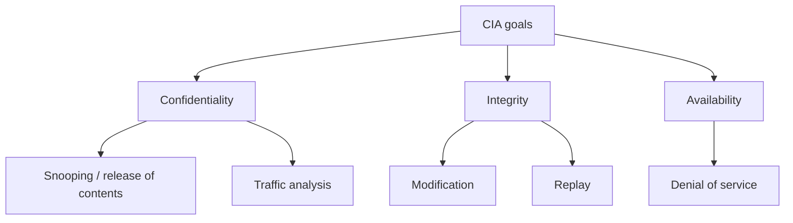
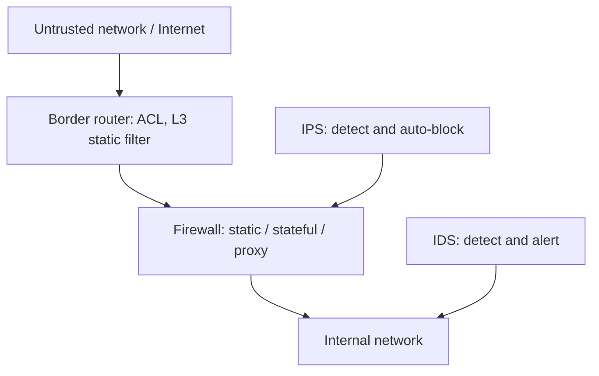

# M02: Network Security

**Source:** https://www.youtube.com/watch?v=kibMPvGrLXw
**Instructor / expert:** Dr Pardeep Bhandari, Doaba College, Jalandhar (course coordinator: Dr Maninder Singh, Thapar University, Patiala)

### Learning objectives

- State why e-business networks need network security and list the CIA goals.
- Distinguish a **threat** from an **attack**, and **passive** from **active** attacks.
- Relate snooping, traffic analysis, replay, modification, and denial of service to confidentiality, integrity, and availability.
- Describe cryptography's three mechanisms: symmetric-key, asymmetric-key, and hashing (including MD5 and SHA).
- Place border routers, firewalls (static / stateful / proxy), IDS, and IPS in a network-boundary defense.
- List hallmarks of a good security policy and the non-technical side of defense in depth.

### Core concepts

Over recent years **Internet-enabled business (e-business)** has improved companies' efficiency and revenue. Applications such as **e-commerce**, **supply-chain management**, and **remote access** let firms streamline processes, lower operating costs, and increase customer satisfaction. Those applications need **mission-critical networks** that carry **voice, video, and data**, and that are **scalable** as user counts and capacity needs grow.

As networks enable more applications and more users, they become more **vulnerable** to a wider range of security threats. **Network security** exists so that e-business transactions are not compromised. It deals with securing information through **cryptography** and **network security devices**.

#### Goals of network security: CIA

**Confidentiality** is probably the most common aspect of information security. Organizations must guard against malicious actions that endanger confidentiality. It applies not only to **storage** but also to **transmission**: information sent to or retrieved from a remote computer must be **concealed in transit**.

**Integrity** means changes are made **only by authorized entities** and **through authorized mechanisms**. The bank example: when a customer deposits or withdraws money, the account balance must change — but only correctly. An integrity violation is **not necessarily malicious**: an **interruption** such as a **power failure** or **power surge** may also create unwanted changes.

**Availability** means information created and stored by an organization must be available to **authorized entities**. Information is useless if it is not available; it must be accessible because it needs to be **constantly changed**. Unavailability is as harmful as a lack of confidentiality or integrity. Imagine a bank whose customers **could not access their accounts** for transactions.

#### Security attacks: threat vs attack

Any action that **compromises the security of information owned by an organization** is a **security attack**. Two notions must be kept separate:

| Term | Meaning in this lecture |
|------|-------------------------|
| **Threat** | A **potential** for a security violation: a circumstance, capability, action, or event that could breach security and cause harm. A threat is a **possible danger** that might **exploit a vulnerability**. |
| **Attack** | An **assault** on system security that derives from an **intelligent threat** — a **deliberate** attempt to evade security services and **violate the security policy**. |

#### Passive attacks

**Passive attacks** are in the nature of **eavesdropping on or monitoring of** transmissions. The opponent's goal is to **obtain information** that is being transmitted. Two types:

**1. Release of message contents.** A telephone conversation, an electronic message, or a transferred file may contain sensitive or confidential information. The defender wants to prevent an opponent from **learning the contents**.

**2. Traffic analysis.** Even if contents are **masked** (the common technique is **encryption**) so that a captured message cannot be read, an opponent may still observe the **pattern** of messages: **location and identity** of communicating hosts, and **frequency and length** of exchanges. That information may be useful in **guessing the nature** of the communication.

#### Active-style attacks presented after the passive pair

The lecture then covers attacks that produce an **unauthorized effect** (classically treated as **active** attacks):

**Replay.** Passive capture of a data unit and its **subsequent retransmission** to produce an unauthorized effect.

**Modification of messages.** Some portion of a legitimate message is **altered**, or messages are **delayed or reordered**, to produce an unauthorized effect. Example: “allow **John Smith** to read confidential file **accounts**” is modified to “allow **Fred Brown** to read confidential file **accounts**.”

**Denial of service (DoS).** Prevents or inhibits the **normal use or management** of communication facilities. It may have a **specific target** (suppress all messages directed to a particular destination) or disrupt an **entire network** by disabling it or **overloading** it with messages so performance degrades.

#### Attacks grouped by CIA goal; snooping

The three CIA goals can be threatened by security attacks. Attacks can be divided into groups related to those goals. A concept introduced in this classification is **snooping**: **unauthorized access to or interception of data**. Example: a file transferred over the Internet contains confidential information; an unauthorized entity intercepts the transmission and uses the content. To prevent snooping, data can be made **meaningless to the interceptor** by **encryption**.

#### Two implementation techniques

Some **security services** are required to achieve the goals and prevent attacks. Actual implementation uses two techniques designed to protect against one or more attacks while maintaining the goals:

1. **Cryptography**
2. **Security through specific devices**

#### Cryptography

The word has **Greek origin** and means **secret writing**. Here it is the science and art of **transforming messages** to make them **secure and immune to attacks**. In the past it referred only to encryption and decryption with **secret keys**. Today it involves **three distinct mechanisms**:

- **Symmetric-key cryptography**
- **Asymmetric-key cryptography**
- **Hashing**

##### Symmetric-key cryptography

Also known as a **traditional cipher**. The **same key** is used for encryption and decryption, and the key can be used for **bidirectional** communication. Model:

- **Plaintext** is input.
- An **encryption algorithm** plus the key produce **ciphertext**.
- On the receiver side a **decryption algorithm** plus the (same) key recover plaintext.
- Sender and receiver **share the same secret key**.

##### Asymmetric-key cryptography

Asymmetric algorithms rely on **one key for encryption** and a **different but related** key for decryption. Important characteristic: it is **computationally infeasible** to determine the decryption key given only the algorithm and the encryption key. Some algorithms such as **RSA** also exhibit: **either** of the two related keys can be used for encryption, with the other used for decryption.

Main components:

| Component | Role |
|-----------|------|
| **Plaintext** | Readable message or data fed into the algorithm |
| **Encryption algorithm** | Performs transformations on the plaintext |
| **Public and private keys** | A pair selected so that if one encrypts, the other decrypts; the exact transformations depend on which key is input |
| **Ciphertext** | Scrambled output depending on plaintext **and** key; two different keys yield two different ciphertexts for a given message |
| **Decryption algorithm** | Accepts ciphertext and the matching key; produces original plaintext |

##### Hash functions

A **cryptographic hash function** takes a message of **arbitrary length** and creates a **message digest of fixed length**. Creating such a function is best done by **iteration**: instead of one function with variable-size input, a function with **fixed-size input** is used as many times as needed. That fixed-size function is a **compression function**: it compresses an **n-bit** string to an **m-bit** string where **n is normally greater than m**. The scheme is an **iterated cryptographic hash function**.

**Ron Rivest** designed several hash algorithms referred to as **MD2, MD4, MD5** (**MD** = **message digest**). **MD5** is a strengthened version of MD4 that divides the message into **512-bit** blocks and creates a **128-bit** digest. A 128-bit digest is **too small to resist attack**.

**SHA** (**Secure Hash Algorithm**) is a standard developed by **NIST** (National Institute of Standards and Technology). SHA has gone through **several versions**.

#### Network security through specific devices

Think about the **boundary** in which the network is established: protect against **external** attacks and watch **internal suspicious activities**. Devices typically deployed:

- **Border routers** as **static filtering** devices
- **Firewalls**
- **Intrusion detection systems (IDS)**
- **Intrusion prevention systems (IPS)**

##### Border routers as static filtering devices

Routers are the **traffic cops** of the network: they direct traffic **into, out of, and within** networks. The **border router** is the last router you control before an **untrusted network** such as the Internet. Because all Internet traffic goes through it, it often functions as the network's **first and last line of defense** (initial and final filtering).

Configure it as a **static packet-filtering** device using **ACLs** (**access control lists**). It is called **static** because it can inspect packets only up to **layer 3 (network layer)**.

**Improperly destined traffic** — internal addresses hitting the **external** interface, or vice versa — can be addressed with **ingress and egress filtering**.

The border router can also block **high-risk** traffic:

- **ICMP** is a favorite of attackers for **DoS** and **reconnaissance**, so blocking it in whole or in part is a common border-router function.
- Consider blocking **source-routed packets** because they can **circumvent defenses**.
- Block **out-of-band** packets such as **SYN** packets (as taught).

**Smurf / DDoS example (9 February 2000).** Websites such as **Yahoo** and **CNN** were temporarily taken off the Internet, mostly by **distributed denial-of-service Smurf attacks**. A **Smurf** attack sends **spoofed ICMP echo requests (pings)** to **broadcast addresses**, resulting in a response from **every host**. Spoofing let attackers direct the large number of responses to a **victim network**. **Ingress and egress filtering** would have blocked the spoofed traffic and allowed the targets to weather the DDoS storm.

**Every network** should have ingress and egress filtering at the border router: permit only traffic **destined for the internal network** to enter, and traffic **destined for the external network** to exit.

##### Firewalls

A firewall is a **choke-point** device with a **set of rules** specifying what traffic it will **allow or deny**. It typically **picks up where the border router leaves off** and makes a **much more thorough** pass at filtering. Firewalls are not perfect; they **block what we tell them to block** and **allow what we tell them to allow**.

Three types: **static**, **stateful**, and **proxy**.

A **router** can be used as a **static packet filter** / static firewall. **Specialized firewalls** are needed for stateful and proxy operation.

**Stateful firewalls** keep track of connections in a **state table** and are the **most common** type. They **block traffic that is not in the table of established connections**. The **rule base** determines the source and destination **IP and port numbers** permitted to establish connections. By rejecting non-established, non-permitted connections, a stateful firewall helps block **reconnaissance** packets and those that may gain more extensive **unauthorized access**.

**Proxy firewalls** are the **most advanced** and **least common**. They are also stateful: they block non-established, non-permitted connections, with the same kind of IP/port rule base. They offer a **high level of security** because **internal and external hosts never communicate directly**; the firewall is an **intermediary**. They **examine the entire packet** to ensure **compliance with the protocol** indicated by the **destination port number**. Allowing only **protocol-compliant** traffic supports **defense in depth** by diminishing malicious traffic entering or exiting the network.

##### Intrusion detection systems (IDS)

An IDS is like a **security alarm** for the network: it **detects and alerts** on malicious events. It may comprise many **IDS sensors** at strategic points. In general, sensors watch for **predefined signatures** of malicious events and may perform **statistical and anomaly analysis**. When they detect suspicious events they can alert by **email**, **paging**, or simply **logging**.

A **network IDS** could identify and alert on:

- **DNS zone-transfer** requests from an **unauthorized host**
- **Unicode** attacks directed at a **web server**
- **Buffer-overflow** attacks
- **Virus** propagation
- and so on

##### Intrusion prevention systems (IPS)

An IPS **automatically detects and prevents** network and host attacks. Contrast: a traditional IDS **notifies the administrator** of anomalies; an IPS **strives to defend the target without the administrator's direct involvement**. Protection may use **signature-based or behavioral** techniques to identify an attack and then **block** the malicious traffic or system call **before it causes harm**. In this respect an IPS **combines firewall and IDS** functionality and automatically blocks offending actions as soon as it detects an attack.

#### Non-technical elements and security policy

Technical work — optimizing the firewall rule base, examining traffic for suspicious patterns, locking down system configuration — is important, but the **human** end is often forgotten: **policies and awareness** that go with the technical solutions.

**Policy** determines what security measures the organization should implement; it **guides decisions** when implementing network security. An effective **defense-in-depth** infrastructure requires a **comprehensive and realistic** security policy.

Hallmarks of a **good security policy**:

| Hallmark | Question it answers |
|----------|---------------------|
| **Authority** | Who is responsible? |
| **Scope** | Who it affects? |
| **Expiration** | When it ends? |
| **Specificity** | What is required? |
| **Clarity** | Can everyone understand it? |

### Key terms

| Term | Meaning in this lecture |
|------|-------------------------|
| Confidentiality | Protect stored and transmitted information from unauthorized disclosure |
| Integrity | Authorized entities change data only through authorized mechanisms (faults can also violate it) |
| Availability | Authorized entities can access information when needed |
| Threat | Possible danger that might exploit a vulnerability |
| Attack | Deliberate assault that tries to evade services and violate policy |
| Passive attack | Eavesdropping / monitoring to obtain transmitted information |
| Traffic analysis | Inferring communication nature from patterns despite encryption |
| Snooping | Unauthorized access to or interception of data |
| Replay | Capture a data unit and retransmit it for an unauthorized effect |
| Symmetric-key crypto | Same shared secret key for encrypt and decrypt |
| Asymmetric-key crypto | Related public/private pair; decryption key infeasible to derive from encryption key |
| RSA | Example algorithm where either related key may encrypt and the other decrypt |
| Compression function | Fixed-size hash step: n bits in, m bits out, n > m |
| MD5 | Rivest message digest: 512-bit blocks → 128-bit digest (too small) |
| SHA / NIST | Secure Hash Algorithm family standardized by NIST |
| ACL | Access control list on a border router (static L3 filter) |
| Ingress / egress filtering | Only properly destined traffic enters / leaves |
| Smurf attack | Spoofed ICMP echo to broadcast addresses; responses flood the victim |
| Stateful firewall | Tracks connections in a state table; most common type |
| Proxy firewall | Intermediary; full-packet protocol compliance; most advanced, least common |
| IDS | Detect and alert (signatures / anomaly); does not auto-block |
| IPS | Detect and automatically prevent/block |
| Defense in depth | Layered technical controls plus policy and awareness |

### Lecture takeaways

- E-business needs scalable voice/video/data networks; more applications and users mean more threats, so network security is central.
- CIA is the goal set: conceal in storage and transit; authorize changes (including against accidental corruption); keep authorized access working (a bank that cannot serve accounts fails availability).
- A threat is potential danger; an attack is a deliberate intelligent assault. Passive attacks steal or infer information; replay, modification, and DoS produce unauthorized effects; snooping is stopped by making data meaningless via encryption.
- Cryptography today is three mechanisms: shared-key ciphers, public/private-key (RSA-style) algorithms, and iterated hashes (MD2/4/5; SHA from NIST). MD5's 128-bit digest is too small.
- Boundary defense: border router ACLs (ICMP, source routing, SYN, Smurf-style spoofing via ingress/egress), then firewalls (static vs stateful vs proxy), then IDS alerts and IPS auto-blocks.
- Defense in depth also needs a clear, scoped, dated, specific, understandable policy with named authority — not only tuned rule bases.
