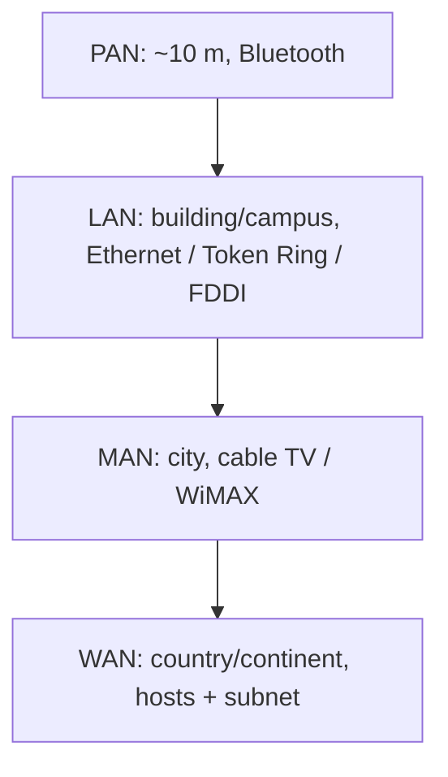
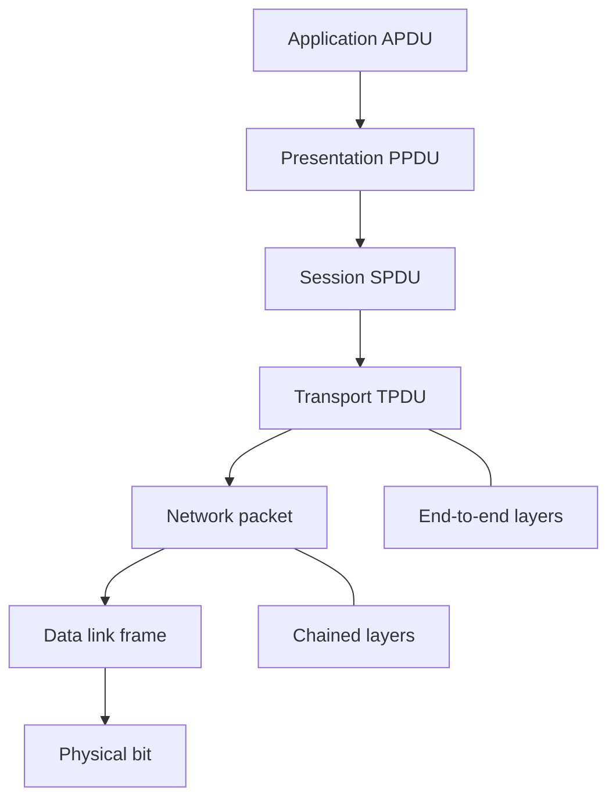

# M03: Computer Network Reference Models

**Source:** https://www.youtube.com/watch?v=qpjjzb1yRiM
**Instructor / expert:** Dr Yogesh Chaba, Department of Computer Engineering and IT, Guru Jambheshwar University of Science & Technology, Hisar (course coordinator: Dr Maninder Singh, Thapar University, Patiala)

### Learning objectives

- Define a computer network and distinguish it from a distributed system (middleware / World Wide Web example).
- Classify networks by coverage: PAN, LAN, MAN, WAN, with named technologies and topologies.
- State the seven OSI-layer design principles and the PDU names from bit through APDU.
- Contrast **chained** layers (physical–network) with **end-to-end** layers (transport–application).
- List the function of each OSI layer (including MAC as a data-link sublayer).
- Describe the four-layer TCP/IP model, its ARPANET / DoD origins and design goals, key protocols, and how it differs from OSI.

### Core concepts

The lecture is divided into three parts: **basic concepts**, the **OSI reference model**, and the **TCP/IP reference model**.

#### What is a computer network?

A **computer network** is a collection of **autonomous computers interconnected by a single technology**. Two computers are **interconnected** if they can **exchange information**. The connection may be via **copper wire**, **fiber optics**, **microwaves**, **infrared**, or **communication satellite**.

#### Network vs distributed system

There is sometimes confusion between a computer network and a **distributed system**. The key distinction: in a distributed system, a collection of independent computers **appears to its users as a single coherent system**. Often a layer of software on top of the operating system called **middleware** implements this model. A well-known example is the **World Wide Web**, in which everything looks like a **document**. In a computer network, different computers are connected through a **single technology** but do **not** necessarily appear as one system.

#### Types of network by coverage area

Four types:

| Type | Expansion | Coverage / character as taught |
|------|-----------|--------------------------------|
| **PAN** | Personal Area Network | IT devices within about **10 m** |
| **LAN** | Local Area Network | Privately owned; single building or campus, up to a **few kilometers** |
| **MAN** | Metropolitan Area Network | Can cover a **city** |
| **WAN** | Wide Area Network | Large geography: a **state, country, or continent** |

##### PAN

Interconnection of IT devices within around **10 metres**. Connecting a computer to a **wireless keyboard, mouse, printer, or another computer** is a PAN. A PAN may also be interconnected, with or without wires, to the **Internet or other networks**. The most common PAN technology available is **Bluetooth**, which uses **short-range radio waves** over distances up to approximately **10 m**.

##### LAN

Generally called LANs. **Privately owned** networks within a single building or campus of up to a few kilometres. Widely used to connect **PCs and workstations** in company offices and factories to **share resources and exchange information**. Restricted size means the **worst-case transmission time is bounded and known in advance**.

Two topologies shown:

**Bus.** At any instant **at most one machine is the master** and is allowed to transmit. The **arbitration** mechanism may be **centralized or distributed**. **IEEE 802.3**, popularly called **Ethernet**, is a **bus-based broadcast** network with **decentralized control**, usually operating at **10 Mbps to 10 Gbps**.

**Ring.** Any computer that wants to communicate **captures a token** and starts transmission. **IEEE 802.5 (Token Ring)** is a ring-based LAN at **4 and 16 Mbps**. **FDDI** is another example of a ring network.

##### MAN

A network that can cover a **city**. Best-known example: **cable television** networks in many cities. **WiMAX** is coming up as **wireless MAN** technology. A typical picture: **television signals and Internet** are fed into a centralized **head-end** for subsequent distribution to people's homes.

##### WAN

Spans a large geographical area. Contains a collection of **hosts** intended for running **user programs**. Hosts are connected by a **communication subnet** (or just **subnet**). **Hosts are owned by the customers**; the subnet is typically owned and operated by a **telephone company or ISP**. The subnet's job is to carry messages from host to host, **just as the telephone system carries words from speaker to listener**.

In most WANs the subnet has two distinct components:

- **Transmission lines** — move bits between machines; **copper wire, optical fiber, or radio links**.
- **Switching elements** — specialized computers that connect **three or more** transmission lines.

Typical picture: each host is connected to a **LAN** on which a **router** is present. The collection of **communication lines and routers** forms the **subnet**; the collection of these LANs through a subnet spread across geography **is the WAN**.

#### Network architecture: two reference models

Two important architectures: **OSI** and **TCP/IP**. Protocols associated with the OSI model are **rarely used anymore**, but the **model itself is still quite general and valid**; features discussed at each layer remain important. Protocols in the **TCP/IP** model are **very widely used**.

#### OSI reference model

ISO's OSI model is based on a proposal developed by the **International Organization for Standardization (ISO)** — a first step toward **international standardization** of communication protocols. **OSI** = **Open Systems Interconnection**. The model is for systems that are **open for interconnection**.

##### Principles that produced seven layers

1. A layer should be created where a **different abstraction** is needed.
2. Each layer should perform a **well-defined function**.
3. The function of each layer should be chosen with an eye toward defining **internationally standardized protocols**.
4. Layer boundaries should be chosen to **minimize information flow across the interfaces**.
5. The number of layers should be **large enough** that distinct functions need not be thrown together in the same layer.

##### Seven layers and data path

From top to bottom: **application, presentation, session, transport, network, data link, physical**. All seven exist at **both transmitter and receiver**.

- **Transmitter:** user data enters at the **application** layer, moves layer by layer down to the **physical** layer, then onto the **transmission medium**.
- **Receiver:** data is received at the **physical** layer and passed layer by layer up to **application**, where the user receives it.

##### PDU nomenclature

| Layer | Data unit name |
|-------|----------------|
| Physical | **Bit** |
| Data link | **Frame** |
| Network | **Packet** |
| Transport | **TPDU** (transport protocol data unit) |
| Session | **SPDU** |
| Presentation | **PPDU** |
| Application | **APDU** |

##### Chained layers vs end-to-end layers

**Two types of layers:**

**Chained layers** — the lower three: **network, data link, physical**. Their protocols are available at **intermediate network devices** as well. These protocols run **between each machine and its immediate neighbors**, not between the ultimate source and destination (which may be separated by many **routers**).

**End-to-end layers** — the upper four: **application, presentation, session, transport**. These protocols are available **only on the end computers**.

##### Physical layer

Concerned with transmitting **raw bits** over a communication channel. Design issue: when one side sends a **one bit**, the other must receive a **one**, not a **zero**. The layer decides **voltage levels** of bits, **timings** for each bit, **modulation** technique, and related matters. Design issues deal with **mechanical, electrical, bit-timing**, and the **physical transmission medium** below this layer.

##### Data link layer

Main task: turn the raw bit stream into a line that appears **free of undetected transmission errors** to the network layer. The sender **breaks input data into data frames** and transmits frames **sequentially**. If the service is **reliable**, the receiver confirms correct receipt of each frame by sending back an **acknowledgement frame**.

Another issue: keep a **fast transmitter from drowning a slow receiver**. A **traffic-regulation** mechanism is often needed so the transmitter knows how much **buffer space** the receiver has. **Flow control** is this layer's job.

**Broadcast networks** add the issue of **controlling access to the shared channel**. A special sublayer, **MAC (Medium Access Control)**, deals with this problem.

##### Network layer

Controls operation of the **subnet**. A key design issue is determining how packets are **routed** from source to destination. If too many packets are in the subnet at once they get in one another's way, forming **bottlenecks**; **congestion control** belongs to this layer. **Addressing** is also a network-layer job. More generally, **quality of service** is a network-layer issue.

##### Transport layer

Basic function: **accept data from the layer above**, **split it into smaller units** if need be, pass these to the network layer, and ensure that the pieces **all arrive correctly** at the other end. It also determines **what type of service** to provide to the session layer and ultimately to users.

The transport layer is a **true end-to-end layer** all the way from source to destination: a program on the source machine carries on a conversation with a similar program on the destination machine.

##### Session layer

Allows users on different machines to **establish sessions**. Sessions offer:

- **Dialog control**
- **Token management** — to prevent two parties from attempting the **same critical operation at the same time**
- **Synchronization**

##### Presentation layer

Unlike lower layers, which mostly move bits around, presentation is concerned with **syntax and semantics** of the information transmitted. It also takes care of **encoding and decoding** of data.

##### Application layer

Contains a variety of protocols commonly needed by users; it provides the **interface to the user**. One widely used application protocol is **HTTP (Hypertext Transfer Protocol)**, the basis for the **World Wide Web**. Other application protocols are for **file transfer**, **electronic mail**, and **network news**.

#### TCP/IP reference model

The TCP/IP reference model is the network model used in the **current Internet architecture**. Origin in the **1960s** with the grandfather of the Internet, the **ARPANET**, a research network sponsored by the **U.S. Department of Defense**.

**Major design goals:**

- Ability to connect **multiple networks together seamlessly**.
- Ability for connections to **remain intact** as long as the **source and destination machines were functioning**.
- To be built on a **flexible architecture**.

Named after two of its main protocols: **TCP (Transmission Control Protocol)** and **IP (Internet Protocol)**.

**Four layers** (compared with seven in OSI):

| TCP/IP layer | Correspondence as taught |
|--------------|--------------------------|
| **Host-to-network** | Jobs of OSI **data link + physical** |
| **Internet** | Same as OSI **network** |
| **Transport** | Covers OSI **session + transport** (one TCP/IP layer) |
| **Application** | Covers OSI **application + presentation** |

##### Initial protocols and networks (as shown)

**Host-to-network:** ARPANET, satellite, packet radio, and LAN.

**Network (internet) layer:** **IP** — routing, addressing, and congestion control.

**Transport:** **TCP** and **UDP**. TCP is **reliable, connection-oriented**; UDP is **unreliable, connectionless**. Their job is **end-to-end connectivity** and **flow control** between end users.

**Application** (on top of transport): all higher-level protocols. Early ones included **virtual terminal Telnet**, **FTP (File Transfer Protocol)**, and **SMTP** (electronic mail). Added over the years: **DNS** (mapping host names onto network addresses), **NNTP** (moving **Usenet** news articles around), **HTTP** (fetching pages on the World Wide Web), and many others.

#### OSI vs TCP/IP: similarities and differences

**In common:**

- Both are based on a **stack of independent protocols**.
- Layer functionality is **roughly similar**.
- In both, a layer provides an **end-to-end, network-independent transport service** to processes wishing to communicate.
- In both, the layers **above transport** are **application-oriented** users of the transport service.

**Differences:**

| Topic | OSI | TCP/IP |
|-------|-----|--------|
| Number of layers | **Seven** | **Four** |
| Service vs protocol | Clearly distinguishes **service, interface, and protocol** | Did **not originally** clearly distinguish service, interface, and protocol |
| Connection modes | Network layer: **both** connectionless and connection-oriented; transport: **only connection-oriented** | Network layer: **only connectionless**; transport: **both** modes, giving the **user a choice** |

### Key terms

| Term | Meaning in this lecture |
|------|-------------------------|
| Computer network | Autonomous computers interconnected by a single technology, able to exchange information |
| Distributed system | Independent computers appearing as one coherent system (often via middleware) |
| Middleware | Software above the OS that implements the distributed-system illusion |
| PAN / Bluetooth | ~10 m personal interconnection; short-range radio |
| IEEE 802.3 Ethernet | Bus-based broadcast LAN, decentralized control, 10 Mbps–10 Gbps |
| IEEE 802.5 Token Ring | Ring LAN at 4 and 16 Mbps; transmit after capturing a token |
| FDDI | Another ring-network example |
| WiMAX | Wireless MAN technology |
| Head-end | Central MAN point that feeds TV and Internet to homes |
| Subnet | WAN communication lines + switching elements/routers, typically telco/ISP owned |
| OSI | Open Systems Interconnection; ISO seven-layer model |
| Chained layers | Physical, data link, network — hop-by-hop, present on intermediate devices |
| End-to-end layers | Transport through application — only on end computers |
| TPDU / SPDU / PPDU / APDU | PDUs at transport, session, presentation, application |
| MAC | Medium Access Control sublayer: shared-channel access on broadcast networks |
| ARPANET | DoD-sponsored 1960s research network; grandfather of the Internet |
| TCP vs UDP | Reliable connection-oriented vs unreliable connectionless transport |

### Lecture takeaways

- A network interconnects autonomous computers; a distributed system (WWW via middleware) makes them look like one machine.
- Coverage taxonomy: PAN (~10 m, Bluetooth), LAN (Ethernet bus / Token Ring / FDDI), MAN (cable TV, WiMAX, head-end), WAN (customer hosts plus telco/ISP subnet of lines and routers).
- OSI's seven layers follow explicit design principles; PDUs run bit → frame → packet → TPDU → SPDU → PPDU → APDU; lower three layers are chained, upper four are end-to-end.
- Each OSI layer has a distinct job: bits and media; frames, ACK, flow control, MAC; routing, congestion, addressing, QoS; end-to-end TPDUs and service type; sessions (dialog, tokens, sync); syntax/semantics; user protocols (HTTP, mail, news, file transfer).
- TCP/IP is the living Internet model: four layers, ARPANET/DoD goals (internetworking, surviving as long as endpoints live, flexibility), IP plus TCP/UDP plus Telnet/FTP/SMTP/DNS/NNTP/HTTP.
- Shared idea of a protocol stack and transport-to-applications split; OSI has more layers and a cleaner service/interface/protocol split; TCP/IP puts connectionless IP below and lets the user choose TCP or UDP above.
