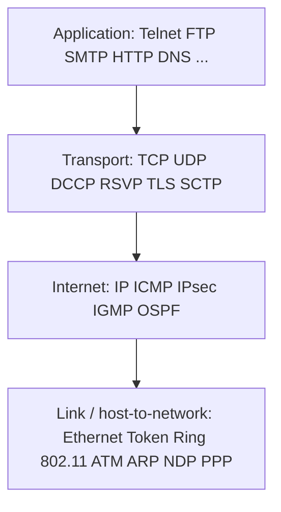

# M04: Computer Network Reference Models — TCP/IP Layers Continuation

**Source:** https://www.youtube.com/watch?v=i7nPyb1c-d4
**Instructor / expert:** Dr Yogesh Chaba, Department of Computer Science and Engineering, Guru Jambheshwar University of Science & Technology, Hisar (course coordinator: Dr Maninder Singh, Thapar University, Patiala)

### Learning objectives

- Trace TCP/IP from ARPANET / DARPA (Kahn and Cerf, NCP) to the IETF-maintained Internet protocol suite.
- Map the four TCP/IP layers (and the five-layer hybrid that adds physical) onto OSI, including chained vs end-to-end layers.
- List link-layer tasks (MAC, LLC) and named link protocols: IEEE 802 family, ATM, ARP, NDP, LLTD, PPP.
- State IP's three functions and the internet-layer protocols IP, ICMP, IPsec/IKE, IGMP, and OSPF.
- Contrast TCP and UDP (RFCs, reliability, sockets/ports) and name DCCP, RSVP, TLS/SSL, and SCTP.
- Identify application-layer protocols with their RFCs: Telnet, FTP, SMTP, HTTP, RPC, DNS, SNMP, RTP.

### Core concepts

This second reference-models lecture is devoted to the **TCP/IP reference model**: a brief introduction, then **layered protocol architecture**, then **protocols at each layer**.

#### Introduction: the Internet protocol suite

The **Internet protocol suite**, commonly known as the **TCP/IP reference model**, is the computer-networking model and set of communication protocols used on the **Internet**. It is commonly called TCP/IP because its most important protocols — **TCP (Transmission Control Protocol)** and **IP (Internet Protocol)** — were the **first networking protocols defined in this standard**.

It is the model of the **current Internet architecture**. Origin in the **late 1960s** with the **ARPANET**, a research network sponsored by the **U.S. Department of Defense**; for that reason it was also called the **DoD model**.

**Major design goals** (same trio as the previous lecture):

- Connect **multiple networks together seamlessly**.
- Keep connections **intact as long as source and destination machines are functioning**.
- Build on a **flexible architecture**.

The TCP/IP model and related protocol models are maintained by the **IETF (Internet Engineering Task Force)**.

#### History: DARPA, Kahn, Cerf, NCP

The suite resulted from R&D by **DARPA (Defense Advanced Research Projects Agency)** in the late 1960s. After initiating the pioneering **ARPANET in 1969**, DARPA started work on other data-transmission technologies in **1972**.

**Robert E. Kahn** joined the DARPA **Information Processing Techniques Office**, worked on **satellite packet networks** and **ground-based radio packet networks**, and saw the value of communicating **across both**.

In **spring 1973**, **Vinton Cerf**, developer of the existing ARPANET **Network Control Program (NCP)** protocol, joined Kahn to work on **open-architecture interconnection models** with the goal of designing the **next protocol generation** for ARPANET.

By **summer 1973**, Kahn and Cerf had a fundamental reformulation:

- Differences between network protocols were **hidden** by using a **common internetwork protocol**.
- Instead of the **network** being responsible for reliability (as in ARPANET), the **host** became responsible.

The initial **four computers** on ARPANET grew to **several hundred** by linking universities, research institutes, and military installations over **leased telephone lines**. When technologically different networks (satellite, wireless) connected, the originally implemented protocols were soon **overburdened** by the data-traffic **translation** required from one network to another.

#### Four-layer model and five-layer hybrid

The actual TCP/IP reference model consists of **four layers**, numbered **layer 2 to 5** as shown in the lecture figure. Together with the addition of the **physical layer (layer 1)** they make up the **five-layer hybrid TCP/IP reference model**.

Bottom to top of the four-layer model:

1. **Link layer** (also **host-to-network layer**)
2. **Internet layer**
3. **Transport layer**
4. **Application layer**

| TCP/IP layer | OSI correspondence | Main responsibility as taught |
|--------------|--------------------|-------------------------------|
| Link / host-to-network | OSI **physical + data link** | Secure transmission of data packets of **bit sequences** |
| Internet | OSI **network** | Data communication of two end systems at a given location in a **heterogeneous** communication network |
| Transport | OSI **transport** (same name) | Two user programs on different computers exchange **reliable, connection-oriented** data |
| Application | OSI **session + presentation + application** (layers 5–7) | Interface for actual application programs that wish to communicate |

Unlike ISO OSI, TCP/IP was **not conceived and planned theoretically**; it was **derived from protocols already in practice** on the Internet. ISO OSI protocols were planned theoretically and **adopted before** protocols existed that implemented the layer functions. **Today ISO OSI protocols are no longer used**; TCP/IP protocols developed from practice **dominate the Internet**.

#### Chained vs end-to-end in TCP/IP

**Lower two layers (link and internet)** are **chained layers**. **Upper two layers (transport and application)** are **end-to-end layers**, where **process-to-process** communication takes place.

#### Link layer (host-to-network)

Lowest layer of the TCP/IP model. It defines networking methods within the **local network link** on which hosts communicate **without intervening routers**. Primary task: **secure transmission of individual data packets between two adjacent end systems**.

Normally subdivided into:

- **MAC (Medium Access Control) sublayer** — regulates access to **shared channels** with a mechanism of **fair and efficient access** for all participants, including methods for **discovery of collisions or their avoidance** when many participants wish to transmit at once.
- **LLC (Logical Link Control) sublayer** — forms the data-link layer of the LAN; provides **flow control** and **link management**. Data-transmission errors must be **recognized and if possible corrected**. Data is **subdivided into size-limited data packets** as required.

##### Link-layer protocols

Most important protocols of this layer in TCP/IP are based on the **IEEE 802 LAN standard**:

- **Ethernet — IEEE 802.3**
- **Token Ring — IEEE 802.5**
- Different **wireless LAN** technologies — **IEEE 802.11**
- and many more

Also named:

**ATM (Asynchronous Transfer Mode).** A **connection-oriented packet-switching** network protocol that breaks down and forwards data in **cells of a fixed size**. Design idea: carry **time-critical real-time data** (video or audio) **together with regular data** over a **standardized protocol**.

**ARP (Address Resolution Protocol), RFC 826.** Determines the **MAC address** of a host from the **IP address** of the layer above. Needed when an Internet data packet must be delivered on a local network: the receiver's **MAC address** must be determined from the stored **IP address** for forwarding on the LAN.

**NDP (Neighbor Discovery Protocol).** Functions very similar to ARP: explore and discover further hosts in the local network. **NDP was developed for IPv6**; **ARP works under IPv4**.

**LLTD (Link Layer Topology Discovery).** A **proprietary** protocol developed by **Microsoft** for **exploration of the present network topology** and **verification of guaranteed quality of service**.

**PPP (Point-to-Point Protocol).** A simple protocol for the connection between **two network nodes**. Used by the **majority of Internet providers** to offer customers a **dial-up connection over a standard telephone line**.

#### Internet layer

Responsibility: sending packets across **potentially multiple networks** — from the **source network** to the **destination network**.

The **Internet Protocol** performs **three basic functions**:

1. **Host addressing and identification** — a **hierarchical IP addressing** system.
2. **Packet routing** — sending packets from source to destination by forwarding them to the **next network router closer to the final destination**.
3. **Congestion control** — control of traffic congestion.

##### Internet-layer protocols

**IP** is the central protocol. It offers **unreliable, data-packet-oriented, end-to-end** information transmission. It is responsible for **fragmentation and defragmentation** into **IP datagrams**. Two versions exist today: **IPv4** and **IPv6**.

**ICMP (Internet Control Message Protocol)** is implemented in the internet layer. It notifies of **specific errors** during IP transmission and handles further **diagnostic** tasks such as sending **echo requests** to test a computer's **availability** and the necessary **transmission time**. ICMP **sits directly on IP**. Two variations exist: one for **IPv4** and another for **IPv6**.

**IPsec (Internet Protocol Security).** A protocol suite to ensure **secure execution of IP data traffic**. Within a data stream, **IP datagrams can be authenticated and encrypted**. Also included are protocols for handling, establishment, and exchange of **secure cryptographic keys** — **IKE (Internet Key Exchange)**.

**IGMP (Internet Group Management Protocol).** Administers **IP multicast groups** of end systems in a TCP/IP network. Special **multicast routers** administer address lists of end systems that can be addressed commonly via **one multicast address**.

**OSPF (Open Shortest Path First).** A **link-state routing protocol** that transmits IP datagrams within a **single routing domain or autonomous system**. OSPF is the **most widely used routing protocol on the Internet** (as stated).

#### Transport layer

Establishes a basic data channel that an application uses for **task-specific data exchange**. It establishes **process-to-process connectivity** by providing **end-to-end services independent** of the structure of user data and of the logistics of exchanging information for any particular purpose.

The transport protocol establishes a **direct virtual end-to-end communication connection**. To allow **multiple application programs on the same computer**, every application is assigned a **port number** for unique identification on the transport layer. Every unit of data sent must contain the **port number of sender and receiver**. Together with the **IP address**, the port number defines a **network socket** — a unique connection endpoint in the network.

End-to-end message transmission is categorized as:

- **Connection-oriented** — implemented in **TCP**
- **Connectionless** — implemented in **UDP**

##### TCP

**TCP** is a core element of the Internet protocol architecture and the **most popular** transport protocol in the TCP/IP model. Standardized as **RFC 793**. It carries out a **reliable, connection-oriented, bidirectional** data exchange between two end systems and enables establishment of **virtual** connections.

##### UDP

**UDP (User Datagram Protocol)** is the second most prominent transport protocol. Standardized as **RFC 768**. It transmits independent data units known as **datagrams** between application programs on different computers. Transmission is **unreliable**, possibly combined with **data loss**, **proliferation (duplication) of datagrams**, and **changes in sequence**. Datagrams recognized as **false are discarded** by UDP and **do not even reach the receiver**. Compared with TCP, UDP is **clearly less complex**, which shows up as **increased data throughput**, but UDP suffers a **dramatic loss of reliability and security**.

##### Other transport protocols

**DCCP (Datagram Congestion Control Protocol).** A **message-oriented** transport protocol. In addition to **reliably establishing and terminating connections**, it **distributes overload notifications**. It provides **overload / congestion control** and can be used for **negotiation of transmission parameters**.

**RSVP (Resource Reservation Protocol).** Used to **request and reserve network resources** using IP to transmit data streams. It is **not intended for the actual data transport** and bears a similarity to **ICMP** and **IGMP** at the internet layer. RSVP can be implemented by **end systems as well as routers** without having to reserve and maintain specified **service qualities**.

**TLS (Transport Layer Security)** / **SSL (Secure Sockets Layer).** Cryptographic protocols for **secure data transport** on the Internet. Individual **TCP segments are encrypted** by TLS and SSL. They provide protocols for **negotiation of transmission parameters**, **exchange of cryptographic keys**, **authentication**, **encryption**, and **digital signature**. (SSL is the historical predecessor; TLS is the successor used for the same role.)

**SCTP (Stream Control Transmission Protocol).** A proposal for a **highly scalable and performance** version of original TCP: **reliable, connection-oriented**, and specialized in transmitting **large amounts of data**.

#### Application layer

Functions map onto **OSI layers 5 to 7**. Primarily an **interface** for application programs wishing to communicate over the network.

| Protocol | RFC as taught | Role |
|----------|---------------|------|
| **Telnet** (Teletype Network) | **RFC 854** | Interactive **bidirectional** communication to a remote computer through a **command-line interface** |
| **FTP** (File Transfer Protocol) | **RFC 959** | Transmission and manipulation of data between two computers on a TCP/IP network; **client–server**: client initiates and requests; server accepts and answers |
| **SMTP** (Simple Mail Transfer Protocol) | **RFC 821** | Simple structured protocol for **electronic mail** on the Internet |
| **HTTP** (Hypertext Transfer Protocol) | **RFC 2616** | Data transmission on the **World Wide Web**; client–server; based on **reliable TCP** |
| **RPC** (Remote Procedure Call) | **RFC 1057** and **RFC 5531** | Interprocess communication: a program **calls an external subroutine** located in **another addressing area** |
| **DNS** (Domain Name System) | (named, no RFC number given) | Name and directory service: assignment of **readable system names to IP addresses** for participating Internet systems |
| **SNMP** (Simple Network Management Protocol) | **RFC 3411** (taught as “341 RFC”) | Helps network-management systems **monitor, administer, and control** individual systems on the network |
| **RTP** (Real-time Transport Protocol) | **RFC 1889** | Transmission of **real-time audio and video** over the Internet |

### Key terms

| Term | Meaning in this lecture |
|------|-------------------------|
| Internet protocol suite / TCP/IP | Model and protocols of the Internet; named for TCP and IP |
| DoD model | Alternate name because ARPANET was DoD-sponsored |
| IETF | Body that maintains TCP/IP and related models |
| DARPA | Agency whose late-1960s R&D produced the suite |
| NCP | ARPANET Network Control Program; Cerf was its developer |
| Five-layer hybrid | Four TCP/IP layers plus an explicit physical layer 1 |
| MAC / LLC | Shared-medium access vs flow control, link management, error handling, packet sizing |
| ATM | Fixed-size cells; mix real-time audio/video with regular data |
| ARP / NDP | IP→MAC mapping for IPv4 vs IPv6 neighbor discovery |
| LLTD | Microsoft proprietary topology / QoS discovery |
| PPP | ISP dial-up over a telephone line between two nodes |
| IP | Unreliable datagram forwarding; fragmentation; IPv4 and IPv6 |
| ICMP | Errors and diagnostics (echo) sitting on IP |
| IPsec / IKE | Authenticate/encrypt IP datagrams; key exchange |
| IGMP | IP multicast group administration |
| OSPF | Link-state IGP inside one AS; called the most widely used Internet routing protocol here |
| Socket | IP address + port = unique connection endpoint |
| RFC 793 / RFC 768 | TCP / UDP standards |
| DCCP / RSVP / SCTP | Congestion-aware datagrams; resource reservation; scalable stream TCP-like transport |
| TLS / SSL | Encrypt TCP segments; keys, auth, encryption, signatures |

### Lecture takeaways

- TCP/IP is a practice-first, IETF-maintained DoD/ARPANET descendant: Kahn and Cerf hid network differences behind a common internet protocol and moved reliability from the network to the **host** (replacing NCP).
- Four layers (or five if physical is drawn separately): link and internet are chained; transport and application are end-to-end process communication. OSI protocols were designed first and are unused; TCP/IP dominates.
- Link layer is local (no routers): IEEE 802 (Ethernet, Token Ring, 802.11), ATM cells, ARP (IPv4) vs NDP (IPv6), Microsoft LLTD, and ISP PPP dial-up.
- Internet layer: hierarchical addressing, hop-by-hop routing, congestion control — IP (unreliable, fragmenting, v4/v6), ICMP, IPsec+IKE, IGMP multicast, OSPF inside an AS.
- Transport: ports and sockets; TCP (RFC 793, reliable bidirectional) vs UDP (RFC 768, fast, lossy, unordered); also DCCP, RSVP, TLS/SSL, SCTP.
- Application is the OSI 5–7 interface: Telnet, FTP, SMTP, HTTP, RPC, DNS, SNMP, RTP, several explicitly tied to RFCs and to client–server over TCP.
