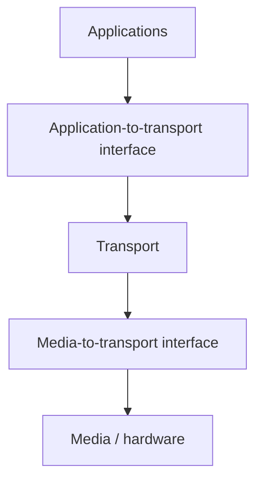
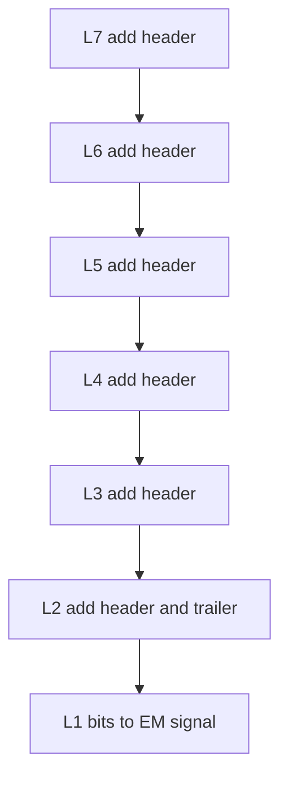

# M05: Protocol Stack

**Source:** https://www.youtube.com/watch?v=KanyeVKL6cs
**Instructor / expert:** Dr Navdeep Singh, Department of Computer Engineering, Punjabi University Patiala (course coordinator: Dr Maninder Singh, Thapar University, Patiala)

### Learning objectives

- Distinguish a protocol **suite** (definition) from a protocol **stack** (software implementation) and state why layered modules exist.
- Recite the five OSI layering principles (including ISO 7498) and describe encapsulation/decapsulation (headers, Layer-2 trailer, physical signals).
- List services of each of the seven OSI layers, with named mechanisms (baud rate, line codes, CSMA/CD, IP/ICMP/IGMP/IPsec, TCP vs UDP, session beans, etc.).
- Describe the four TCP/IP layers and early applications Telnet, FTP, SMTP, and DNS (including the Yahoo name-to-address example).
- State the lecture's listed merits and demerits of TCP/IP.

### Core concepts

After this lesson students should understand the **need for protocols and standards** and be able to **identify various protocols at different layers** of the protocol stack.

#### Suite vs stack

The **protocol stack** is an **implementation** of a computer-networking **protocol suite**. The terms are often used interchangeably, but:

- The **suite** is the **definition** of the protocols.
- The **stack** is the **software implementation** of them.

A protocol stack is a **complete set of network protocol layers** that work together to provide networking capabilities. It is called a **stack** because it is typically designed as a **hierarchy of layers**, each **supporting the one above it** and **using those below it**.

Individual protocols within a suite are often designed with a **single purpose**. This **modularization** makes design and evaluation easier because each protocol module usually communicates with **two others**. They are commonly imagined as layers in a stack. The **lowest protocol always deals with low-level physical interaction of the hardware**. Every higher layer **adds more features**. User applications usually deal only with the **topmost layers**.

#### Practical three-section split and OS interfaces

In practical implementation, protocol stacks are often divided into three major sections: **media**, **transport**, and **applications**. A particular OS or platform will often have **two well-defined software interfaces**:

1. Between the **media and transport** layers.
2. Between the **transport layers and applications**.

The **media-to-transport** interface defines how transport-protocol software uses particular **media and hardware types** — e.g. how **TCP/IP transport software talks to Ethernet hardware**.

The **application-to-transport** interface defines how application programs use the transport layers — e.g. how a **web-browser program talks to TCP/IP transport software**.

#### OSI model

**OSI** = **Open Systems Interconnection** model. It is a **conceptual model** that characterizes and standardizes the communication functions of a telecommunication or computing system **without regard to underlying internal structure and technology**. Goal: **interoperability** of diverse communication systems with **standard protocols**. The model partitions a communication system into **abstraction layers**. The original version defines **seven layers**.

It is a product of the Open Systems Interconnection project at the **International Organization for Standardization**, maintained as **ISO 7498**.

##### Principles used to arrive at seven layers

1. A layer should be created where a **different abstraction** is needed.
2. Each layer should perform a **well-defined function**.
3. The function of each layer should be chosen with an eye toward defining **internationally standardized protocols**.
4. Layer boundaries should be chosen to **minimize information flow across the interfaces**.
5. The number of layers should be **large enough** that distinct functions need not be thrown together in the same layer out of necessity, and **small enough** that the architecture does not become **unwieldy**.

##### Encapsulation and exchange of data

Data units are labeled **D7** at layer 7, **D6** at layer 6, and so on. The process starts at **layer 7 (application)** and moves **descending** through the layers. At each layer a **header**, or possibly a **trailer**, can be added. Commonly the **trailer is added only at layer 2**.

When the formatted data unit passes through the **physical layer**, it is changed into an **electromagnetic signal** and transported along a **physical link**.

At the destination the signal enters **layer 1** and is transformed back into **digital form**. Data units move **back up**. As each block reaches the next higher layer, the **headers and trailers** attached at the corresponding sending layer are **removed** and actions appropriate to that layer are taken. By the time it reaches **layer 7**, the message is again in a form appropriate to the application and is made available to the **recipient**.

#### Physical layer (layer 1)

First and lowest layer. It **coordinates the functions required to carry a bitstream over a physical medium**. It deals with **mechanical and electrical specifications** of the interface and transmission medium, and defines **procedures and functions** that physical devices and interfaces must perform for transmission to occur.

**Services / topics taught:**

**Symbol rate (baud rate) and modulation rate.** Number of **symbol changes**, waveform changes, or signaling events across the medium per time unit, using a digitally modulated signal or a **line code**. Measured in **baud** or **symbols per second**. For a line code, the symbol rate is the **pulse rate** in **pulses per second**.

**Standardized interface to physical media**, including:

- Mechanical specifications of **electrical connectors and cables** (e.g. **maximum cable length**).
- Electrical specifications of the transmission line: **signal level** and **impedance**.
- **Radio interface**: electromagnetic spectrum, **frequency allocation**, **signal strength**, analog **bandwidth**, etc.
- Specifications for **IR over optical fiber** or a **wireless IR** communication link.

**Modulation.** Process of **varying one or more properties** of a periodic waveform (the **carrier signal**) with a **modulating signal** that typically contains the information. A **modulator** performs modulation; a **demodulator** performs the inverse; a **modem** can perform **both**.

**Line coding.** Representing the digital signal by a waveform **optimally tuned** for the physical channel and receiving equipment. The pattern of **voltage, current, or photons** used to represent digital data on the link is **line encoding**. Common types: **unipolar, polar, bipolar, and Manchester**. After line coding, the signal is put through a physical channel — a **transmission medium** or a **data-storage medium**.

**Bit synchronization.** Sender and receiver must use the **same bit rate** and be **synchronized at the bit level** (clocks synchronized).

**Line configuration.** How devices connect to the media:

- **Point-to-point** — two devices, **dedicated** link.
- **Multipoint** — a link **shared** among several devices.

**Physical topology.** How devices are connected to make a network.

**Transmission mode.** Direction of transmission between two devices: **simplex, half duplex, or full duplex**.

#### Data link layer (layer 2)

Transfers data between **adjacent network nodes** in a WAN or between nodes on the **same LAN segment**. Provides functional and procedural means to transfer data between network entities and **might detect and possibly correct errors** that occur in the physical layer.

**Services:**

**Framing.** A **frame** is the **PDU at the data link layer** — the result of the **final layer of encapsulation** before transmission over the physical layer. A frame is a unit of transmission in a link-layer protocol and consists of a **link-layer header followed by a packet**.

**Physical addressing.** If frames are distributed to different systems, the data-link layer adds a header defining **sender or receiver**. If the frame is intended for a system **outside the sender's network**, the receiver address is the address of the **device that connects this network to the next one**.

**Flow control.** Managing the rate of data transmission so a **fast sender does not overwhelm a slow receiver**. The receiver can control transmission speed.

**Error control.** Lets the receiver inform the sender if a frame is **lost or damaged** and coordinates **retransmission**. Error control here is based on **ARQ (automatic repeat request)**: whenever an error is detected, specified frames are retransmitted.

**Logical Link Control (LLC).** Functions required to **establish and control logical links** between local devices. Usually considered a **DLL sublayer**. It provides services to the **network layer above** and **hides the rest of the data-link details** so different technologies work seamlessly with higher layers. Most LAN technologies use the **IEEE 802.2 LLC** protocol.

**Media Access Control (MAC).** Procedures devices use to **control access to the network medium**. Many networks use a **shared medium** (a single cable, or cables electrically connected into one virtual medium), so rules are needed to **avoid conflicts**. Example: **Ethernet uses CSMA/CD**; **Token Ring uses token passing**.

#### Network layer (layer 3)

Responsible for **packet forwarding**, including **routing through intermediate routers**. It knows addresses of neighboring network nodes and also manages **quality of service**.

**Services:**

**Logical addressing.** Every communicating device has a **logical (layer-3) address**. On the Internet, **IP** is the network-layer protocol and every machine has an **IP address**.

**Routing.** Moving data across a series of interconnected networks is the defining function. Devices and software at this layer handle incoming packets from various sources and determine their **final destination**.

**Datagram encapsulation.** Messages from higher layers are placed into **datagrams (also called packets)** with a **network-layer header**.

**Fragmentation and reassembly.** Some data-link technologies **limit message length**. If a packet is too large, the network layer **splits** it, sends each piece to the data-link layer, and has pieces **reassembled** at the destination network layer.

**Error handling and diagnostics.** Special protocols let devices that are logically connected, or that are trying to route traffic, **exchange status** about hosts or about themselves.

**Network-layer protocols named:** **ICMP** (Internet Control Message Protocol), **IGMP** (Internet Group Management Protocol), **IPsec** (Internet Protocol Security), **IPv4** and **IPv6**.

#### Transport layer

Called the **host-to-host transport layer** in the TCP/IP model. Data is encapsulated in a **transport-layer PDU** and sent to the network layer. **Network-layer nodes transfer the transport PDU intact without decoding or modifying its content**, so only **peer transport entities** actually communicate using the transport protocol's PDUs.

Services: **connection-oriented data stream**, **reliability**, **flow control**, and **multiplexing**.

**Connection-oriented communication.** Often easier for an application to interpret a connection as a **data stream** than to deal with underlying **connectionless** models such as the **datagram model of UDP and of IP**.

**Same-order delivery.** The network layer generally does **not** guarantee packets arrive in the order sent. Order is usually restored by **segment numbering**, with the receiver passing data to the application **in order**.

**Reliability.** Packets may be lost due to **congestion and errors**. With an error-detection code such as a **checksum**, the transport protocol may check that data is not corrupted and verify **correct receipt** by sending an **ACK or NACK**. **ARQ** schemes may retransmit lost or corrupted data.

**Flow control.** Rate must sometimes be managed so a fast sender does not transmit more than the receiving buffer can support (**buffer overrun**). It can also improve efficiency by reducing **buffer underrun**.

**Congestion avoidance.** Congestion control limits traffic entering a telecommunications network to avoid **congestive collapse**, avoiding oversubscription of processing or link capabilities of intermediate nodes, including reducing the send rate. Example: **ARQ may keep the network in a congested state**; this is avoided by adding congestion avoidance to flow control, including **slow start**, which keeps bandwidth consumption **low at the beginning of a transmission or after packet retransmission**.

**Multiplexing.** **Ports** provide multiple endpoints on a single node. Analogy: the **name on a postal address** multiplexes different recipients at the same location. Applications listen on their own ports so more than one network service can run at once. Multiplexing via ports is part of the **transport layer in TCP/IP** but of the **session layer in OSI**.

##### TCP

**Transmission Control Protocol** is **connection-oriented**: a connection is established and maintained until the application programs at each end have **finished exchanging messages**. It determines how to **break application data into packets** that networks can deliver, **sends packets to and accepts packets from** the network layer, **manages flow control**, and because it is meant to provide **error-free** transmission it handles **retransmission of dropped or garbled packets** as well as **acknowledgement of all packets that arrive**.

##### UDP

**User Datagram Protocol** is a transport protocol defined for use with the **IP** network-layer protocol. It provides a **best-effort datagram** service to an end system: **unreliable**, **no guarantees for delivery**, **no protection from duplication**. Simplicity **reduces overhead**; the service may be adequate in many cases.

UDP provides **minimal, unreliable, best-effort message-passing** to applications and upper-layer protocols. Compared with other transport protocols, **UDP and its UDP-Lite variant** are unique in that they **do not establish end-to-end connections**. Consequently they do not incur **connection establishment and tear-down overheads**, and there is **minimal associated end-system state**. That can be a **very efficient** transport for some applications, but UDP has **no inherent congestion control or reliability**.

On many platforms applications can send UDP datagrams at the **line rate of the link interface**, often much greater than available **path capacity**, which would **contribute to congestion**. Applications therefore need to be **designed responsibly**.

#### Session layer

Provides mechanisms for **opening, closing, and managing a session** between end-user application processes — a **semi-permanent dialogue**. Communication sessions consist of **requests and responses** between applications. Session-layer services are commonly used in environments that make use of **remote procedure calls (RPC)**.

**Services named:** (1) **authentication**, (2) **authorization**, (3) **session restoration**.

The OSI session layer is responsible for **session checkpointing and recovery**. It allows information of different streams, perhaps from different sources, to be properly **combined or synchronized**.

**Examples:**

- **Session beans** — active only as long as the session is active and **deleted when the session is disconnected**. Developers can use them to **store information about the user during a web session**.
- **Web conferencing** — audio and video streams must be synchronous to avoid **lip-sync problems**; flow control ensures the person displayed is the **current speaker**.
- **Live TV** — audio and video streams need to be **seamlessly merged and transitioned** to avoid **silent air time** or **excessive overlap**.

#### Presentation layer

Primary goal: **syntax and semantics** of information exchanged. It ensures data is sent so the receiver will **understand and use** it. If the two systems' **language syntax** differs, presentation plays the role of **translator**.

**Functions:**

**Translation.** Before transmission, characters and numbers should be changed to **bit frames**. The layer is responsible for **interoperability between encoding methods** because different computers use different encodings: it translates between the format the **network** requires and the format the **computer** uses.

**Encryption.** Encryption at the transmitter and **decryption** at the receiver.

**Compression.** Data compression to **reduce the bandwidth** of data to be transmitted — reduce the **number of bits**. Important when transmitting **multimedia** (audio, video, text, etc.).

#### Application layer

Topmost OSI layer. **Manipulation of data** in various ways so that **users or software get access to the network**. Services include **email**, **transferring files**, **distributing results to the user**, **directory services**, and **network resources**.

**Functions:**

**Mail services.** Basis for **email forwarding and storage**.

**Network virtual terminal.** Allows a user to **log on to a remote host**. The application creates a **software emulation of a terminal** at the remote host; the user's computer talks to that software terminal, which talks to the host, and vice versa. The remote host believes it is communicating with **one of its own terminals** and allows the logon.

**Directory services.** Access for **global information about various services**.

**File transfer, access, and management.** Standard mechanism to **access and manage files**. Users can access files on a remote computer, manage them, and **retrieve** files from a remote computer.

#### TCP/IP reference model (in this lecture)

The model used in the current Internet architecture, named after **TCP** and **IP**. Developers chose to build a **packet-switched network** based on a **connectionless internetwork layer**.

**Host-to-network (physical) layer.** TCP/IP does **not specify in any great detail** the operation of this layer except that the host has to **connect to the network using some protocol** so it can send **IP packets** over it.

**Network (internet) layer.** Inject packets into any network and have them **travel independently** to the destination. Defines **IP** as official packet format and protocol. **Packet routing** is a major job.

**Transport layer.** Interface between the application layer and the complex hardware of the network. Designed so **peer entities** of source and destination hosts can carry on conversations. Data may be **user data or control data**. Two modes: **full duplex** (both sides transmit and receive **simultaneously**) and **half duplex** (a side can only send **or** receive at one time). Any application-layer program can send using **TCP or UDP**; both communicate with **IP** in the internet layer. Communication is **two-way**: applications can **read and write** to the transport layer.

**Application layer.** The original TCP/IP specification described several applications at the top of the stack: **Telnet, FTP, SMTP, and DNS**.

- **Telnet** supports the Telnet protocol over **TCP**: a general **two-way** communication protocol to connect to another host and **run applications on that host remotely**.
- **FTP** was originally designed to **promote sharing of files** among users. It **shields the user from variations of file storage on different architectures** and allows **reliable and efficient** transfer.
- **SMTP (Simple Mail Transfer Protocol)** transports electronic mail from one computer to another **through a series of other computers along the road**.
- **DNS** resolves the **numerical address** of a network node into its **textual name or vice versa**. Example: it would translate **www.yahoo.com** to **204.71.177.71** to allow routing protocols to find the host the packet is destined for.

#### Merits of TCP/IP (as listed)

1. It **operates independently**.
2. It is **scalable**.
3. **Client–server architecture**.
4. **Supports a number of routing protocols**.
5. Can be used to **establish a connection between two computers**.

#### Demerits of TCP/IP (as listed)

1. The transport layer does **not guarantee delivery of packets**.
2. The model **cannot be used in any other application**.
3. **Replacing protocols is not easy**.
4. It has **not clearly separated its services, interfaces, and protocols**.

### Key terms

| Term | Meaning in this lecture |
|------|-------------------------|
| Protocol suite | Definition of the protocols |
| Protocol stack | Software implementation of the suite; hierarchy of layers |
| ISO 7498 | Identifier of the OSI model standard |
| D7…D1 | Data units at OSI layers 7 down to 1 |
| Baud / symbol rate | Symbol (or pulse) changes per second on the medium |
| Modem | Device that both modulates and demodulates |
| Line encoding | Unipolar, polar, bipolar, Manchester patterns of voltage/current/photons |
| Simplex / half / full duplex | One-way; either direction but not both at once; both at once |
| Frame | DLL PDU: link header + packet; trailer typically only here |
| ARQ | Retransmit specified frames when errors are detected |
| IEEE 802.2 LLC | Common LAN logical-link protocol |
| CSMA/CD vs token passing | Ethernet MAC vs Token Ring MAC |
| Slow start | Congestion avoidance that starts (or restarts after loss) at low rate |
| UDP-Lite | Lightweight UDP variant; still connectionless, no inherent congestion control |
| Session beans | Session-scoped objects deleted when the web session disconnects |
| Network virtual terminal | Emulated terminal so a remote host accepts a logon |
| www.yahoo.com → 204.71.177.71 | DNS example given in the lecture |

### Lecture takeaways

- A suite is the specification; a stack is the running layered software, often split into media / transport / applications with two OS interfaces (e.g. TCP/IP ↔ Ethernet, browser ↔ TCP/IP).
- OSI (ISO 7498) uses seven abstraction layers with explicit design rules; data grows headers (and a layer-2 trailer) going down, becomes an EM signal, and is unwrapped going up.
- Physical: bits, baud, connectors, radio/IR, modulation/modems, line codes, bit sync, point-to-point vs multipoint, topology, duplex modes.
- Data link: frames, hardware addresses, flow control, ARQ, LLC (802.2), MAC (CSMA/CD vs token passing).
- Network: logical IP addresses, routing, datagrams, fragmentation, ICMP/IGMP/IPsec/IPv4/IPv6.
- Transport PDUs traverse the network unmodified; TCP is a reliable connection; UDP/UDP-Lite are cheap and connectionless — applications must not blast at line rate. Ports multiplex (OSI would put that in session).
- Session (auth, authorization, restoration, checkpointing; session beans, lip-sync, live TV), presentation (translate, encrypt, compress), application (mail, virtual terminal, directories, FTAM).
- TCP/IP: underspecified host-to-network, connectionless IP, TCP or UDP (full or half duplex), Telnet/FTP/SMTP/DNS on top. Merits: independence, scale, client–server, many routing protocols, can connect two computers. Demerits: transport does not always guarantee delivery, poor reuse in other applications, hard protocol replacement, fuzzy service/interface/protocol split.
