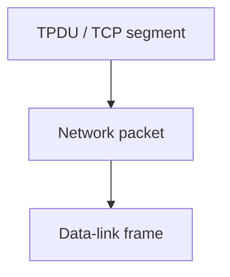
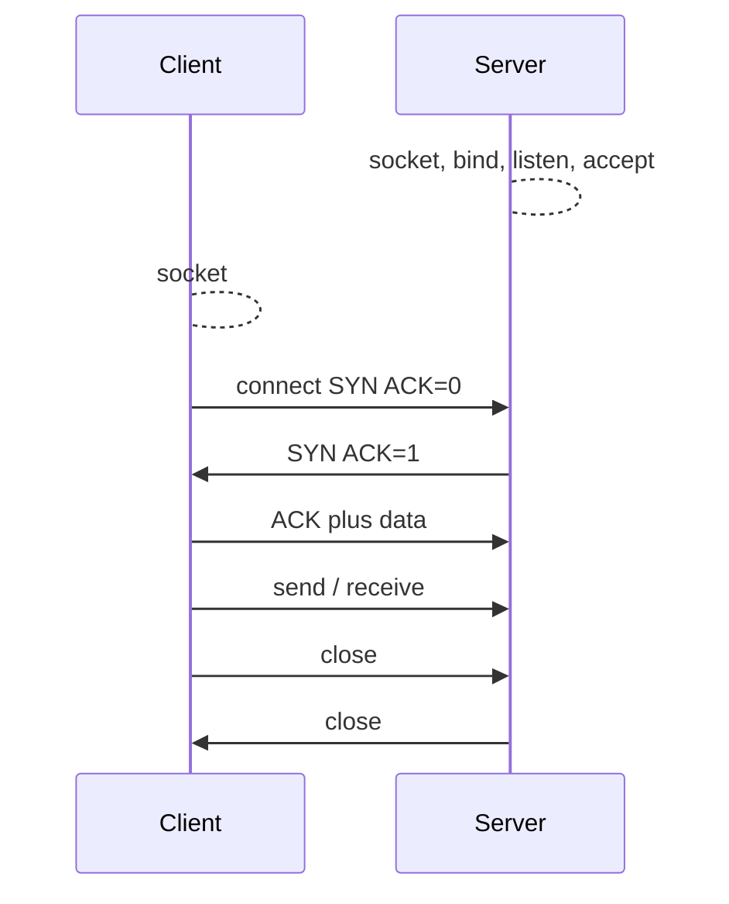

# M06: Transmission Control Protocol

**Source:** https://www.youtube.com/watch?v=9bKXrX4lz6g
**Instructor / expert:** Dr Yogesh Chaba, Department of Computer Science and Engineering, Guru Jambheshwar University of Science & Technology, Hisar (course coordinator: Dr Maninder Singh, Thapar University, Patiala)

### Learning objectives

- Place TCP in the Cerf–Kahn 1974 internetworking paper and in RFC 793 / 1122 / 1323.
- Explain reliable stream delivery: segments, acknowledgements, timers, retransmission, and nesting TPDU ⊂ packet ⊂ frame.
- Define sockets, TSAPs/ports (including well-known ports below 1024 and IANA), and TCP's full-duplex, point-to-point, byte-stream service.
- Walk the 20-byte TCP header field by field (ports, seq/ack, data offset, flags, window, checksum, urgent pointer, options).
- Use socket primitives and the three-way handshake (plus simultaneous-open collision and FIN release / two-army timers).
- Apply variable-size sliding-window flow control, including a zero window and the one-byte probe that prevents deadlock.

### Core concepts

TCP is used for **connection-oriented transmission at the transport layer** for **end-to-end connectivity** of computers. Contents: brief introduction, **TCP header**, then **connection management and flow control**.

#### Foundation (1974) and split into TCP + IP

The foundation of TCP was laid in **May 1974** when the **IEEE (Institute of Electrical and Electronics Engineers)** published a paper entitled **"A Protocol for Packet Network Intercommunication."** Authors **Cerf and Kahn** described an internetworking protocol for sharing resources using **packet switching** among nodes. A central control component of that model was the **transmission control program (TCP)** that incorporated both **connection-oriented links** and **datagram services** between hosts.

That transmission control program was later divided into a modular architecture:

- **Transmission Control Protocol** at the **connection-oriented** layer
- **Internet Protocol** at the **internet** layer

The model became known informally as **TCP/IP**, and formally as the **Internet protocol suite**.

#### Reliable stream delivery

TCP is a **reliable stream delivery service** that **guarantees that all bytes received will be identical with bytes sent and in the correct order**. The fundamental technique: the receiver **responds with an acknowledgement** as it receives data. The sender **keeps a record of each packet it sends** and **maintains a timer** from when the packet was sent; it **retransmits** if the timer expires before the message is acknowledged. The timer is needed in case a packet gets **lost or corrupted**.

TCP was formally defined in **RFC 793**. Over time various errors and inconsistencies were detected and requirements changed; clarifications and bug fixes are detailed in **RFC 1122**. Extensions are given in **RFC 1323**.

While **IP handles actual delivery** of the data, **TCP keeps track of the individual units of data transmission called segments**. The internet layer **encapsulates each TCP segment into an IP packet** by adding an IP header that includes the **destination IP address**. When they arrive, the destination TCP layer **reassembles** the individual segments and ensures they are **correctly ordered and error-free**.

For messages sent from the transport layer the lecture uses the acronym **TPDU (transport protocol data unit)**. TPDUs exchanged by the transport layer are contained in **packets** at the network layer; packets are contained in **frames** at the data-link layer.

#### Sockets, ports, TSAPs

TCP service is obtained by sender and receiver creating endpoints called **sockets**. Each socket has a **socket number** consisting of the **IP address of the host** and a **16-bit number local to that host** called a **port**. A port is the TCP name for a **transport service access point (TSAP)**.

A socket may be used for **multiple connections at the same time**: two or more connections may terminate at the same socket. Connections are identified by the **socket identifiers at both ends** (socket 1, socket 2). **No virtual-circuit numbers or other identifiers** are used.

**Port numbers below 1024** are **well-known ports**, reserved for **standard services**. The **IANA (Internet Assigned Numbers Authority)** maintains official assignments of port numbers for specific uses.

Well-known / listed ports from the lecture table (ASR “Port 0 for HTTP” corrected to **80**):

| Port | Protocols mentioned | Service |
|------|---------------------|---------|
| **20** | TCP and UDP | **FTP** data transfer |
| **23** | TCP and UDP | **Telnet** |
| **25** | TCP and UDP | **SMTP** (email) |
| **53** | TCP and UDP | **DNS** |
| **69** | (as listed) | **TFTP** (Trivial File Transfer Protocol) |
| **80** | TCP, SCTP, and UDP | **HTTP** |
| **107** | TCP and UDP | Remote Telnet service protocol |
| **109** | TCP and UDP | **POP2** (Post Office Protocol v2) |
| **110** | TCP and UDP | **POP3** |
| **115** | TCP | Simple File Transfer Protocol |
| **119** | TCP | **NNTP** (Network News Transfer Protocol) |
| **143** | TCP | **IMAP** |
| **220** | TCP and UDP | **IMAP** |
| **500** | TCP and UDP | **ISAKMP** (Internet Security Association and Key Management Protocol) |
| **530** | TCP and UDP | **RPC** |
| **554** | TCP and UDP | **RTSP** (Real Time Streaming Protocol) |
| **587** | TCP | Email message submission (**SMTP**) |
| **698** | UDP | **OLSR** (Optimized Link State Routing) |
| **953** | TCP and UDP | DNS **RNDC** service |
| **995** | TCP | **POP3** (as listed for this port) |

#### Service properties

Connections are **full duplex** and **point-to-point**:

- **Full duplex** — traffic can go in **both directions at the same time**.
- **Point-to-point** — each connection has **exactly two endpoints**. TCP does **not support multicasting or broadcasting**.

A TCP connection is a **byte stream, not a message stream**. **Message boundaries are not preserved end to end.** Example: if the sending process does **four 512-byte writes** to a TCP stream, the data may be delivered as four 512-byte chunks, **two 1024-byte** chunks, **one 2048-byte** chunk, or some other way. The receiver **cannot detect the unit in which the data were written**.

Figure A: four 512-byte segments sent as **separate IP datagrams**. Figure B: **2048 bytes** of data delivered to the application in a **single read** call.

#### TCP segment header

Every segment begins with a **fixed-format 20-byte header**. The fixed header may be followed by **header options**. After the options, if any, up to

**65535 − 20 − 20 = 65495** data bytes

may follow, where the first 20 is the **IP header** and the second 20 is the **TCP header**. **Segments without any data are legal** and commonly used for **acknowledgements and control messages**.

##### Header fields

**Source port and destination port** identify the local endpoints of the connection. A port plus its host IP address forms a **48-bit unique endpoint**. The source and destination endpoints together identify the connection.

**Sequence number** and **acknowledgement number** perform their usual functions for delivery confirmation. The acknowledgement number specifies the **next byte expected**, **not** the last byte correctly received. Both fields are **32 bits** long because **every byte of data is numbered** in a TCP stream.

**TCP header length (data offset)** tells how many **32-bit words** are in the TCP header. Needed because the **options field is of variable length**. Technically it indicates the **start of the data** within the segment, measured in 32-bit words — which is just the header length in words.

Next comes a **six-bit field that is not used**, then **six 1-bit flags**:

| Flag | Meaning as taught |
|------|-------------------|
| **URG** | Set to 1 if the **urgent pointer** is in use. The urgent pointer is a **byte offset from the current sequence number** at which urgent data are found. |
| **ACK** | Set to 1 to indicate the **acknowledgement number is valid**. If ACK is 0, the segment does not contain an acknowledgement, so the ACK-number field is **ignored**. |
| **PSH** | **Pushed** data: the receiver is requested to **deliver data to the application upon arrival** and **not buffer** it until a full buffer has been received. |
| **RST** | **Reset** a connection that has become confused due to a **host crash** or some other reason. |
| **SYN** | Used to **establish connections**. Connection **request**: SYN=1, ACK=0 (piggyback acknowledgement field not in use). Connection **reply**: SYN=1, ACK=1. SYN denotes request vs accepted; **ACK distinguishes** the two possibilities. |
| **FIN** | Used to **release** a connection: the sender has **no more data to transmit**. |

**Window size.** Flow control in TCP uses a **variable-sized sliding window**. This field tells how many bytes may be sent **starting at the byte acknowledged**.

**Checksum.** Provided for extra reliability. It checksums the **header**, the **data**, and the conceptual **pseudo-header**.

#### Socket primitives

Socket primitives are widely used for **Internet programming**.

**Server side:**

1. **socket** — creates a new communication endpoint. Newly created sockets do **not** have network addresses.
2. **bind** — attach a **local address** to a socket.
3. **listen** — announce willingness to accept connections and **allocate space to queue incoming calls** in case several clients try to connect at once.
4. **accept** — **block** waiting for an incoming connection.

**Client side:** a socket must first be created with **socket**, but **bind is not required** because the address used **does not matter to the server**. **connect** **blocks** the caller and **actively starts** the connection process. When the appropriate TPDU is received from the server, the client is unblocked and the connection is established.

Both sides then use **send** or **receive** over the full-duplex connection.

**Connection release** with sockets is **symmetric**: when **both sides** have executed a **close** primitive, the connection is released.

#### Connection establishment: three-way handshake

Connections are established by a **three-way handshake**. One side (the **server**) **passively** waits by executing **listen** and **accept**. The other side (the **client**) executes **connect**.

**connect** sends a TCP segment with **SYN on and ACK off**, then waits. When this segment arrives, the TCP entity checks whether a process has done a **listen** on the **destination port**. If **not**, it sends a reply with the **RST** bit on to **reject** the connection. If some process is listening, that process is given the incoming segment and can **accept or reject**. If it accepts, an **acknowledgement segment** is sent back.

**Normal case (as numbered in the lecture):**

- Host 2 receives **SYN with seq = X**.
- Host 2 returns **SYN with seq = Y** and **ACK = X+1**.
- Host 1 sends data with **seq = X+1** and **ACK = Y+1**.

**Simultaneous open.** If two hosts **simultaneously** attempt to establish a connection between the **same two sockets**, a **collision** occurs (illustrated in the lecture's Figure B).

#### Connection release

Either party can send a TCP segment with **FIN** set, meaning it has no more data to transmit. When the FIN is **acknowledged**, **that direction is shut down for new data**. Data may continue to flow **indefinitely in the other direction**. When **both directions** have been shut down, the connection is released.

Normally **four TCP segments** are needed: one FIN and one ACK **for each direction**. It is possible for the **first ACK and the second FIN** to be contained in the **same segment**, reducing the total to **three**.

To avoid the **two-army problem**, **timers** are used. If a response to a FIN is not forthcoming within **two maximum packet lifetimes**, the **sender of the FIN releases the connection**. The other side will eventually notice that nobody seems to be listening anymore and will **time out as well**.

#### Window management / flow control (worked example)

Window management in TCP is **not directly tied to acknowledgements** as it is in most data-link protocols.

**Step 1.** Receiver has a **4096-byte** buffer. Sender transmits a **2048-byte** segment with **sequence = 0**. It is received correctly.

**Step 2.** Receiver acknowledges. With only **2048 bytes** of buffer space left, it advertises a window of **2048** starting at the next byte expected, with **ACK = 2048**.

**Step 3.** Sender transmits another **2048 bytes** with **sequence = 2048**. Receiver buffer is now **full**.

**Step 4.** Acknowledged with **ACK = 4096** and **WIN = 0**. The sender **must stop** until the application on the receiving host has **removed some data from the buffer**, at which point TCP can advertise a larger window.

**When the window is zero**, the sender may not normally send segments, with **two exceptions**:

1. **Urgent data** may be sent — e.g. to allow the user to **kill the process** running on the remote machine.
2. The sender may send a **one-byte segment** to make the receiver **re-announce the next byte expected and window size**. The TCP standard **explicitly provides this option to prevent deadlock** if a window announcement ever gets **lost**.

When the receiver application then reads **2K**, it has a **2K** window again and replies with **ACK = 4096** and **WIN = 2048**. Next, the transmitter sends **1K** with **sequence = 4096**. Communication continues with **end-to-end flow control through TCP**.

### Key terms

| Term | Meaning in this lecture |
|------|-------------------------|
| Transmission control program (1974) | Cerf–Kahn component later split into TCP + IP |
| RFC 793 / 1122 / 1323 | TCP definition; clarifications and bug fixes; extensions |
| Segment | TCP unit of transmission; IP encapsulates it for delivery |
| TPDU | Transport protocol data unit nested in packets then frames |
| Socket / TSAP | IP + 16-bit port; port is TCP's transport service access point |
| Well-known ports | Numbers below 1024 reserved for standard services; IANA assigns |
| Byte stream | Message boundaries not preserved; writes may coalesce or split |
| 20-byte header | Fixed TCP header; options extra; max data 65495 with 20-byte IP |
| ACK number | Next byte expected, not last byte received |
| SYN/ACK/FIN/RST/PSH/URG | Connection setup, valid ACK, close, reset, push, urgent offset |
| Sliding window | Variable-size; WIN says how many bytes may be sent from ACK point |
| Pseudo-header | Included in the TCP checksum along with header and data |
| Three-way handshake | SYN; SYN+ACK; ACK (seq X / Y, ACK X+1 / Y+1) |
| Two-army problem | Connection-release uncertainty; solved with 2× MPL timers |
| Zero window | Sender stops except urgent data or a 1-byte window probe |

### Lecture takeaways

- TCP grew out of the 1974 Cerf–Kahn transmission control program, then split from IP; it is specified in RFC 793 with later fixes (RFC 1122) and extensions (RFC 1323).
- It is a reliable, ordered **byte stream** with ACKs, retransmission timers, and segments carried inside IP packets inside frames — not a message stream, and not multicast/broadcast.
- Endpoints are sockets (IP + port/TSAP); well-known ports below 1024 (FTP 20, Telnet 23, SMTP 25/587, DNS 53, HTTP 80, POP/IMAP, ISAKMP 500, RTSP 554, etc.) are IANA-assigned.
- The 20-byte header numbers every byte, advertises a window, checksums a pseudo-header, and uses six flags for urgent data, valid ACKs, push, reset, setup (SYN), and teardown (FIN).
- Servers socket/bind/listen/accept; clients socket/connect; close is symmetric. Setup is a three-way handshake (RST if nobody listens); simultaneous open can collide. Teardown is two FINs (often four segments, sometimes three) plus timers against the two-army problem.
- Flow control is a variable window independent of data-link-style ACK coupling: a full 4K buffer can advertise WIN=0; urgent data and a one-byte probe still get through so a lost window update cannot deadlock.
