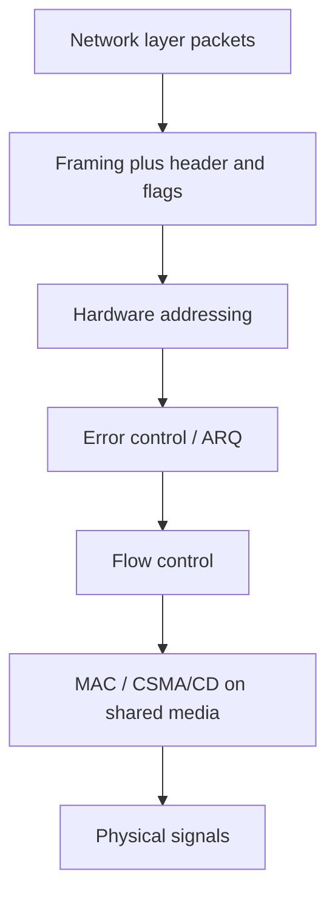
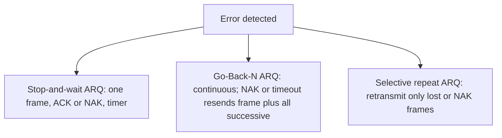

# M07: Data Link Layer

**Source:** https://www.youtube.com/watch?v=u9QZrz8pG6A
**Instructor / expert:** Dr Maninder Singh, Department of Computer Science, Punjabi University Patiala (course coordinator: Dr Maninder Singh, Thapar University, Patiala)

### Learning objectives

- Place the data link layer (DLL / Layer 2) above the physical layer and split it into LLC and MAC.
- List DLL functions: framing, hardware addressing, error control, flow control, and multi-access (CSMA/CD).
- Describe four framing methods: byte count, flag bytes with byte stuffing, flag bits with bit stuffing (01111110), and physical-layer coding violations (Manchester / IEEE 802).
- Contrast stop-and-wait with sliding-window flow control, including utilization U = 1/(1+2a).
- Explain ARQ error control: stop-and-wait ARQ, Go-Back-N ARQ, and selective-repeat ARQ.

### Core concepts

This lecture explains the working of the **second layer of the OSI reference model**: the **data link layer (DLL)**, also called **Layer 2**. It is one of the **most complex** layers, with difficult functionalities and responsibilities. It **hides the particulars of underlying hardware** and depicts itself to upper layers as **the channel to communicate**.

The DLL works between two communicating hosts that are connected **directly in some sense**. That direct connection may be **broadcast or point-to-point**. Systems on a **broadcast network** are supposed to be on the **same link**. Work becomes **more difficult** when dealing with **several hosts on a single collision domain**.

As taught, the DLL converts the incoming data stream into **signals bit by bit** to send over the underlying hardware. At the receiving end it collects data from the hardware (electrical signals), builds them into an **identifiable frame format**, and passes them to the upper layer.

#### Two sublayers

| Sublayer | Role as taught |
|----------|----------------|
| **LLC (Logical Link Control)** | Needed in the case of **point-to-point links only**. Deals with **protocols, flow control, and error control**. |
| **MAC (Media Access Control)** | Decides **which user gets to use the broadcast medium** at any particular time. |

DLL protocols can be implemented in **hardware or software**, in a computer's **main CPU** or in special-purpose hardware known as a **network adapter** or **network interface card (NIC)**. A common example of the latter is an **Ethernet NIC**.

#### Functions on behalf of the upper layer

**Framing.** The DLL receives **packets from the network layer** and **encapsulates them into frames**.

**Addressing.** It provides a **Layer 2 hardware addressing** system. The hardware address is supposed to be **unique** and is **encoded into hardware at manufacturing time**.

**Error control.** During transmission, signals may encounter problems and **bits get flipped**. **Detection of errors and recovery of original data** is done by this layer.

**Flow control.** Stations on the same link may have **different speeds**. The DLL allows sender and receiver to **exchange data at the same speed**.

**Multi-access.** When hosts on a **shared link** try to transfer data there is a **high probability of collision**. The DLL provides mechanisms such as **CSMA/CD** so multiple systems can access shared media.

#### Framing in detail

A major responsibility is to make the **physical link reliable**. To do so the DLL **breaks the network-layer data stream into small blocks** (**segmentation**) and, to form a frame, **adds a header and frame flag** to each block (**encapsulation**).

The **frame header** generally contains three fields:

| Field | Contents |
|-------|----------|
| **Address** | Address of **sender and receiver** |
| **Error-detecting code** | A **checksum** of the frame for error detection |
| **Control** | Additional information to implement **protocol functions** |

The receiving DLL must know the **start and end** of a frame according to the **frame flag**. A good design makes it easy for a receiver to find the start of a new frame while using **little of the channel bandwidth**.

Four framing methods:

##### 1. Byte count

Uses a field in the header to describe the **number of bytes** present in the frame. When the receiver's DLL sees this count, it knows **how many bytes follow**.

##### 2. Flag bytes with byte stuffing

Each frame **starts and ends** with a special byte sequence. Generally the **same byte** (a **flag byte**) is used as starting and ending **delimiter**. If the flag byte appears **in the data**, the sender's DLL inserts a special **ESC (escape) byte** immediately before each accidental flag byte. This technique is **byte stuffing**.

##### 3. Flag bits with bit stuffing

The frame flag is a special **bit pattern** that should not appear anywhere else inside the frame. A special flag of **0, six 1s, 0** (**01111110**) is used at start and end. Whenever the sender's DLL sees **five consecutive ones** in the data, it automatically **adds a 0 after those five ones**. The receiver **deletes this 0 bit** that follows five consecutive 1 bits. This process is **bit stuffing**.

##### 4. Physical-layer coding violations

Used on networks whose encoding on the physical medium contains **some redundancy**. Some LANs encode each bit using **two physical bits**. **Manchester coding** is normally used: a **1** is encoded as **10** and a **0** as **01**. An **invalid physical code** (a coding violation) is used as a frame delimiter. This type of invalid physical code is used in **IEEE 802 LAN standards**.

#### Flow control

Modern networks aim to support a wide variety of hosts and media. Two motivating mismatches:

- A **200 MHz Pentium** host transmitting to a **25 MHz 80386** host: the faster Pentium will **drown** the slower 80386 with data.
- Two hosts both on **Ethernet LANs**, but the Ethernets connected by a **28.8 kbps modem** link: if one host transmits at Ethernet speed, the modem link is quickly **overburdened**.

In both cases flow control is required to keep transfer at a **suitable rate**.

**Flow control** informs the sender **how much data it can transfer before it should wait for an acknowledgement**. Data from sender to receiver must not **overburden** the receiver. The receiver must be able to **report to the transmitter before its limits are reached**, and the sender should then send **fewer frames**. The limit may be **memory used to store incoming frames** or the **processing power** of the receiver.

Two methods: **stop-and-wait** and **sliding window**.

##### Stop-and-wait

Simplest form: the sender transmits a **data frame**; after receiving it the receiver indicates willingness to accept another by sending an **acknowledgement frame**. The sender **must wait** until the ACK is received before transmitting the next frame. Also called a **request-reply** mechanism: easy to understand and implement but **not very efficient**.

On LANs with **fast links** this is not a major concern, but **WAN links spend most of their time idle**, especially if a **large number of hops** are required.

The protocol depends on **two-way transmission** (half or full duplex) so the receiver can return ACKs. A small **processing delay** sits between reception of the last data frame and generation of the ACK.

**Major drawback:** only **one frame can be in transit at a time**, which is inefficient if **propagation delay is longer than transmission delay**.

**Link utilization.** Let **transmission time** be normalized to **1**, and let **propagation delay** be **a** (time for a bit to travel from sender to receiver).

- If **a < 1**, the frame is long enough that the **first bit arrives before the source has finished transmitting**.
- If **a > 1**, the sender **completes the entire frame** before the leading bits arrive at the receiver.

Utilization:

**U = 1 / (1 + 2a)** where **a = propagation time / transmission time**.

Utilization depends strongly on that ratio. When propagation time is very small (**LANs**), utilization is **good**. When delays are very long (**satellite communication**), utilization can become **very poor**. Sliding window is used instead of stop-and-wait to **improve utilization**.

##### Sliding window

Stop-and-wait does not work well if **multiple data frames** are used for a single message — only one frame can be in transmission at a time. If **a > 1**, **severe inefficiencies** result. Efficiency improves if **multiple frames are transmitted at the same time** and the line is **full duplex**.

The sender tracks frames by transmitting **sequentially numbered** frames. The sequence number occupies a field of **limited size**. If there are **K bits** in that header field, sequence numbers range from **0 to 2^K − 1**.

- The sender keeps a list of sequence numbers it is authorized to send: the **sender window**. Maximum sender-window size is **2^K − 1**. The sender is allocated buffer space equal to the window size.
- The receiver also keeps a **receiver window** of size **2^K − 1** (as first stated). The receiver acknowledges every frame with an ACK that includes the **sequence number of the expected next frame**, which also announces that the receiver is ready to receive the **next n frames** starting at that number. This scheme can **acknowledge multiple frames**.

**TCP** uses a sliding-window protocol. A **buffer** is placed between the application and the network data flow (for TCP, normally in the **OS kernel**). Data received from the network is stored in the buffer; the application reads at **its own speed**. As data is read, buffer space empties and can accept more from the network.

**Sender sliding window (at a given time):** the sender may transmit frames whose sequence numbers lie in a particular range.

**Receiver sliding window (later description):** the receiver keeps a window of **size one** if frames should arrive in a particular order. Frames received **out of order are discarded** and need to be **resent**. The receiver window **increases by one** if a particular frame is received. The ACK includes the next sequence number and can announce readiness for the next n frames; this can also **ACK multiple frames**.

Sliding window is beneficial if the local application processes data at the **same rate** it is transferred. If **packet size is smaller than the window size**, **multiple packets can be in the network** because the sender knows space exists at the receiver. Ideally a **steady state** is attained: data packets in the forward direction and **window announcements** in the reverse direction are constantly in flight. When the sender gets a new window announcement it transmits more; when the application reads the buffer, more window announcements are generated. Maintaining sequence during transfer **guarantees effective use of network resources**.

#### Error control and ARQ

When the receiver detects an error in a message or packet, it informs the sender to **retransmit** that message or packet. The most popular retransmission scheme is **ARQ (automatic repeat request)**. Three well-known ARQ techniques:

1. **Stop-and-wait ARQ**
2. **Go-Back-N ARQ**
3. **Selective-repeat ARQ**

##### Stop-and-wait ARQ

Simplest protocol: the sender sends a frame and **waits** for a **positive acknowledgement (ACK)** or **negative acknowledgement (NAK)** from the receiver. The receiver sends a positive ACK only if the frame is received **correctly**; otherwise a NAK. The sender sends a **new** frame only after a positive ACK; otherwise it **retransmits the old frame**.

To deal with a **lost or damaged** frame the sender has a **timer**. If the ACK is lost, the sender transmits the old frame. Example in the lecture: the **second data PDU is lost**. The sender does not know about the loss but starts a timer after each PDU. Normally a positive ACK arrives before the timer expires; here none arrives, the timer counts to zero, and the **same PDU is retransmitted**. The second transmission receives an ACK before timeout. The receiver **discards the duplicate**, identified by the **label (sequence) of the frame**.

For frames **corrupted by noise**, the receiver sends a **NAK**. If the transmitter receives a NAK **before timeout**, it transmits the old frame again.

**Advantage:** **simplicity**; requires **minimum buffer size**. **Disadvantage:** **highly inefficient** use of the link, particularly when **propagation delay is large**.

##### Go-Back-N ARQ

One of the **most popular** ARQ schemes. The sender transmits frames **continuously without waiting for acknowledgement** — hence **continuous ARQ**. The receiver continues to send ACKs or NAKs. If a NAK is received, the sender **retransmits that frame including all successive frames** — hence **Go-Back-N**.

If a frame is **lost**, the receiver sends a NAK. If there is a long delay before the NAK, the sender **retransmits the lost frame after its timer times out**. If the **ACK frame is lost**, the sender also **resends after timeout**.

**Piggybacked acknowledgement** (full duplex): the receiver puts some number in the **acknowledgement field of its data frame**. Example: a **3-bit sequence number**; a station sends frame **0**, gets **RR1** (Receive Ready 1), then sends frames **1, 2, 3, 4, 5, 6, 7, and 0** and gets **another RR1**. That might mean RR1 is a **cumulative ACK**, **or** that **all eight frames were damaged**. The uncertainty is removed if the **maximum window size is limited to 7** — for a **K-bit** sequence-number field, limited to **2^K − 1**. The number **n = 2^K − 1** is how many frames can be sent **without receiving acknowledgement**. If no ACK arrives after sending n frames, the sender uses a timer and after timeout **resumes retransmission**.

Go-Back-N also handles **damaged frames and damaged acknowledgements**. It is a little more complex than stop-and-wait ARQ but gives **much higher throughput**.

##### Selective-repeat ARQ

Retransmits **only those frames for which NAKs are received** or for which the **timer has expired**. This is the **most efficient** ARQ method, but the sender must be **more complex** so it can send **out-of-order frames**. The receiver must have **storage** for the subsequent frames and **processing power to reinsert frames in proper sequence**.

### Key terms

| Term | Meaning in this lecture |
|------|-------------------------|
| DLL / Layer 2 | OSI layer above physical; hides hardware; frames for upper layers |
| Collision domain | Shared-link setting that makes DLL work harder |
| LLC | Point-to-point sublayer: protocols, flow control, error control |
| MAC | Who uses the broadcast medium; CSMA/CD for shared access |
| NIC | Network interface card / adapter (e.g. Ethernet) implementing DLL in hardware |
| Segmentation / encapsulation | Split network-layer stream; add header and frame flags |
| Byte stuffing | Insert ESC before accidental flag bytes in the data |
| Bit stuffing | After five 1s in data, insert 0; flag is 01111110 |
| Manchester / coding violation | 1→10, 0→01; illegal physical codes delimit IEEE 802 frames |
| Stop-and-wait | One data frame, then wait for ACK; U = 1/(1+2a) |
| a | Propagation time / transmission time |
| Sliding window | Numbered frames; window up to 2^K−1; used by TCP (kernel buffer) |
| ARQ | Automatic repeat request after error detection |
| Stop-and-wait ARQ | ACK/NAK plus timer; duplicates discarded; small buffers, poor on long delay |
| Go-Back-N | Continuous send; on NAK/timeout resend that frame and all later ones; max window 2^K−1 |
| RR | Receive Ready piggyback (e.g. RR1) |
| Selective repeat | Retransmit only lost/NAK frames; receiver resequences from storage |

### Lecture takeaways

- Layer 2 sits on the physical bit pipe, hides the hardware, and is hardest on a shared collision domain; LLC (point-to-point protocols, flow, errors) and MAC (who speaks on the broadcast medium) split the work, often in an Ethernet NIC.
- Packets become frames with address, checksum, and control fields; four ways to mark frame edges are count, byte-stuffed flags, bit-stuffed 01111110, and Manchester coding violations (IEEE 802).
- Speed mismatches (Pentium vs 80386, Ethernet vs a 28.8 kbps modem) require flow control: stop-and-wait is simple but idle on long-delay paths (U = 1/(1+2a), bad for satellite); sliding windows of size at most 2^K−1 (and TCP's kernel buffer) keep multiple frames in flight and can cumulative-ACK.
- Errors are recovered by ARQ: stop-and-wait ARQ (ACK/NAK, timer, drop duplicates) is simplest and least efficient; Go-Back-N is continuous and rewinds to the bad frame (window capped at 2^K−1 so piggybacked RR cannot be ambiguous); selective repeat is most efficient and most complex because only lost frames are resent and the receiver must reorder.
