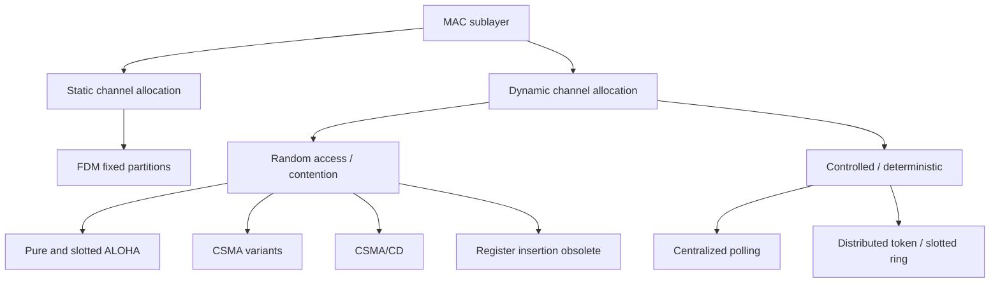
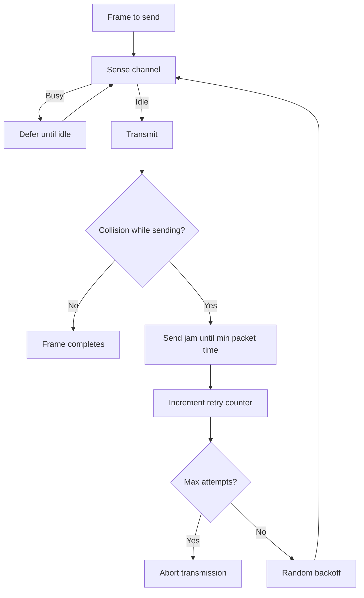

# M08: Medium Access Control Protocols

**Source:** https://www.youtube.com/watch?v=Yw1HsIBvLLM
**Instructor / expert:** Dr. Maninder Singh, Department of Computer Science, Punjabi University, Patiala

### Learning objectives

- Place the MAC sublayer in the OSI data-link layer and list its basic functions.
- Contrast static channel allocation (FDM) with dynamic allocation and state the LAN assumptions that dynamic methods need.
- Distinguish random-access (ALOHA, CSMA, CSMA/CD) from controlled-access (polling, token passing, slotted ring) methods.
- Compute Pure ALOHA and slotted ALOHA throughput and explain the vulnerable period in each.
- Describe nonpersistent, 1-persistent, and *p*-persistent CSMA, and the CSMA/CD collision procedure used on early Ethernet.

### Core concepts

The **medium-access sublayer** is the **bottom part of the data-link layer**. It is also called **MAC** (Media Access Control). When many stations share one medium, MAC is required: simultaneous transmissions would otherwise produce **garbled** messages.

MAC mechanisms **standardized by IEEE** sit in this sublayer. MAC **provides service to LLC** (Logical Link Control) above it and **receives service from the physical layer** below.

**Basic MAC functions:** media access control, **error detection**, and **station addressing**. Access procedures try to give every station a **fair chance** to transmit and to **avoid collisions**. Several LAN methods exist, each tied to a **specific LAN topology**. Besides basic access, MAC also handles **frame delimiting**, **address recognition**, and **error checking**.

**Multiple-access communication** is the case where many user stations share one transmission medium. The medium is **broadcast**: every attached station can receive a given station’s transmission. A LAN’s physical medium is shared by the stations on that LAN.

#### Static vs dynamic channel allocation

Two basic approaches:

| Approach | Also called | Idea |
|----------|-------------|------|
| Static access control | Static channel allocation | Fixed share of the channel |
| Dynamic access control | Dynamic channel allocation | Share adapts to traffic; further split into **random access** and **scheduling** |

**Static FDM.** The first way to share one channel among contending users is **frequency-division multiplexing (FDM)**. With *n* users, bandwidth is split into *n* equal partitions and each user gets one. Fixed bands avoid interference, but the scheme fits only when **users are few** and each has **constant traffic**. If the LAN is large with **varying** traffic and the band is still cut into *n* partitions: fewer than *n* users **wastes spectrum**; more than *n* users leaves some **without a channel**. The channel is then **inefficient**. If *n* users wait in one queue, average delay *T* is **n times the mean delay**. Static FDM therefore shows **poor channel performance**.

**Dynamic channel allocation** appears in **LANs and WANs**. It can handle mixed traffic by building an order so each station gets a proper chance to send frames. The lecture’s requirements:

1. Workstations/terminals are **independent**; work is generated at a **constant rate**.
2. A **single channel** is used for all communication; all stations transmit and receive on it.
3. A station may start at **any time** or in a **slotted time** assigned to it.
4. Two simultaneous transmissions **collide** and the result is **garbled**; all stations can **detect** the collision; the signal may be **retransmitted**.
5. Stations may or may not have **carrier sensing** — an electrical sense of whether the channel is **busy or free**.

#### Multiple-access protocols

A LAN backbone is a **shared channel**. Two or more stations sending at once **interfere** and **garble** data. Medium-access protocols exist to resolve that, especially for **bursty** LAN traffic: data in **irregular bursts**, not a continuous stream.

**Asynchronous TDM** is the mechanism named here. It splits into:

| Family | Also called | Examples from the lecture |
|--------|-------------|---------------------------|
| Contention | Random access | **ALOHA**, **CSMA**, **CSMA/CD**; **register insertion** (unpopular, **obsolete**) |
| Deterministic | Controlled access | **Centralized:** a master decides who may send (e.g. **polling**). **Distributed:** each station gets a turn (e.g. **token passing**, **slotted ring**) |

Typical multiple-access sharing is used on **wired and wireless** networks.

- **Wired multi-drop cables** connect stations to a **host**. The host **broadcasts on an outbound line**; stations send on an **inbound line**. A MAC protocol has the host issue **polling messages** that grant permission to transmit inbound.
- **Radio:** several stations share **two frequency bands** (transmit and receive).
- **Satellite:** each station gets a channel in an **uplink** band to the satellite; the satellite returns signals on a **downlink** band.

#### ALOHA

**ALOHA** is a **contention** protocol from the **University of Hawaii** in the **early 1970s**, originally for **packet radio**, but usable on any shared medium. When many users send on one broadcast channel, **random access** is used: **no exact scheduled time** to transmit. The scheme is **simple and asynchronous** — no tight coordination.

If two stations send together, data may **collide and scramble**. Each then waits a **random time** and tries again. Two variants:

| Variant | Synchronization |
|---------|-----------------|
| **Pure ALOHA** | No global time sync |
| **Slotted ALOHA** | Requires time synchronization |

**Pure ALOHA.** A station sends a frame **whenever it has one**. With one shared channel, frames can collide. The protocol **depends on an acknowledgement**. After sending, the user expects an ACK; if none arrives by a **timeout**, the frame is assumed destroyed and is resent.

If the **first bit** of a new frame overlaps even the **last bit** of a finishing frame, **both frames are completely destroyed** and both must retransmit after timeout. If every station retries at the same timeout, they collide again. Pure ALOHA therefore waits a **random backoff time \(T_B\)** after timeout. Randomness reduces repeated collisions.

**Timeout** equals the **maximum round-trip propagation delay**: twice the time to send a frame between the two most widely separated stations, written **\(2 \times T_P\)**.

Assume equal-length packets and one time unit \(T_P\) to transmit. Station A sends packet A at \(t_0\):

- If B generated a packet between \(t_0\) and \(t_0 + T_P\), the **end of B** hits the **start of A**.
- Pure ALOHA **does not listen** before transmitting, so A cannot know a frame was already underway.
- If C transmits between \(t + T_P\) and \(t + 2T_P\), the **start of C** hits the **end of A**.

If two packets overlap by even the smallest amount in this **vulnerable period**, both are corrupted and must be retransmitted. The vulnerable period is **two packet times**.

**Throughput of Pure ALOHA.** Throughput \(S\) is **average successful traffic per unit time**. The time unit is **slot time** (time to transmit one equal-size frame). At most one packet per slot can succeed, so the **maximum \(S\) is 1**. Collisions waste channel time, so realized \(S < 1\).

Assume \(P_k\), the probability that \(k\) packets are generated in a slot, follows a **Poisson** distribution with mean **\(G\)** per packet time. Then \(S = G \cdot P\), where \(P\) is the probability a packet suffers **no collision**. No other traffic in the whole vulnerable period gives \(P = e^{-2G}\), so:

\[
S = G e^{-2G}
\]

Maximum throughput is at **\(G = 0.5\)**. Best **channel utilization is around 18%**. Advantage: **no synchronization**; a station may send whenever it has a packet. Disadvantage: **inefficient** — only about **18%** of capacity.

**Slotted ALOHA.** Channel time is cut into **discrete** slots equal to **packet transmission time**. Stations may transmit only at those instants and must **sync to the next slot**. Wasted collision time drops to **one packet time**; the **vulnerable period is halved**.

Assumptions: all frames the same size; equal slots (one frame each); nodes start **only at slot beginnings** and are synchronized; if two or more transmit in a slot, **all detect the collision before the slot ends**.

Packets arrive synchronized. Probability of a single transmission in a slot is \(P_0 = e^{-G}\), so:

\[
S = G e^{-G}
\]

Maximum at **\(G = 1\)**, **twice Pure ALOHA**. Best utilization about **36.8%**.

#### CSMA

**Carrier Sense Multiple Access (CSMA)** is a **probabilistic** MAC protocol: a station **confirms the absence of other traffic** before sending on a shared medium.

- **Carrier sense:** listen for another station’s **carrier** before starting. If a carrier is present, **wait until that transmission finishes**. Principle: **sense before transmit** / **listen before talk**.
- **Multiple access:** more than one station may send and receive on the shared medium.

**Vulnerable time** is the **propagation time \(T_P\)** — time for a packet to go from one end of the medium to the other. Example: station A sends at \(T_1\); the frame reaches rightmost station D at \(T_1 + T_P\).

When the medium is sensed idle, a station sends using one of three approaches:

**Nonpersistent CSMA** (non-aggressive). Sense first. If **idle**, send immediately. If **busy**, wait a **random time without sensing**, then repeat the whole sense cycle. This **reduces collisions** and raises **medium throughput**.

**1-persistent CSMA** (aggressive). Sense. If **idle**, send immediately. If **busy**, **keep sensing** until idle, then send **unconditionally** (probability **1**). After a collision, wait a random time and try again with probability 1. **Used in CSMA/CD systems including Ethernet**.

***p*-persistent CSMA** (between the two). Sense. If **idle**, send immediately. If **busy**, keep sensing until idle, then send with probability **\(p\)**. With probability **\(1-p\)** it waits until the **next time slot**. **Used in CSMA/CA systems including Wi-Fi and other packet radio**.

#### CSMA/CD

**Carrier Sense Multiple Access with Collision Detection** is used mostly on LANs with **early Ethernet**. While sending, a station **detects other signals**, **stops** that frame, sends a **jamming signal** on collision, then waits a **random time** before retry. It **modifies pure CSMA** by **terminating transmission as soon as a collision is detected**, which **improves CSMA performance**.

Base protocol: a station with a message **monitors** the channel. If another station is sending, it **defers** until that station finishes, then may send. If nobody was sending when it first listened, it may send **immediately**. **Carrier sensing** is this listen-before-transmit behavior.

If two or more stations, **separated by a significant distance on a bus**, start at roughly the same time without hearing each other, signals **superimpose** and become **garbled** beyond decoding — a **collision**.

**Collision-resolution procedure** (done when retransmission starts, or is aborted after too many collisions):

1. Continue transmitting a **jam signal** (instead of header/data/CRC) until **minimum packet time**, so **all receivers detect** the collision.
2. **Increment** the retransmission counter.
3. If the **maximum number of attempts** is reached, **abort**.
4. Otherwise **calculate and wait** a **random backoff** based on the number of collisions.
5. **Re-enter** the main procedure at stage one.

Because transmission is cut short, **time and bandwidth are saved**. The lecture’s conclusion: **CSMA/CD is more efficient than ALOHA, slotted ALOHA, and CSMA**.

CSMA/CD works best on a **bus / multipoint** topology with **bursty asynchronous** transmission. All stations attach to **one path** and monitor the channel through a **transceiver** on the cable. Control is **fully decentralized** and **contention-based**. It supports **baseband and broadband**. Four named options of **bit rate, signaling method, and maximum electrical cable segment length**:

| Name | How the lecture unpacks the name |
|------|----------------------------------|
| **10BASE5** | Leading number = bit rate in **Mbps**; middle = **baseband** or **broadband**; trailing number = segment length in **multiples of 100 m** |
| **10BASE2** | Same naming rule |
| **10BROAD36** | Broadband option |
| **1BASE5** | Same naming rule |

**Manchester** line code is used at the **baseband** transmission level. In **broadband**, **phase-shift keying** converts the Manchester-encoded signal to analog form.

### Key terms

| Term | Meaning in this lecture |
|------|-------------------------|
| MAC sublayer | Bottom of the data-link layer; IEEE media-access, error detection, station addressing; serves LLC, uses the physical layer |
| LLC | Logical Link Control; MAC’s user above |
| Multiple access | Many stations share one broadcast medium |
| FDM | Static split of bandwidth into fixed frequency partitions |
| Collision | Overlapping transmissions that garble the signal |
| Carrier sensing | Electrical sense that the channel is busy or free |
| ALOHA | Random-access protocol from the University of Hawaii (early 1970s) |
| Vulnerable period | Time window in which another packet can overlap and destroy a transmission |
| \(G\), \(S\) | Offered load per packet time; successful throughput per slot |
| CSMA | Sense-before-transmit multiple access |
| 1-persistent CSMA | Keep sensing a busy medium, then send with probability 1 (Ethernet CSMA/CD) |
| *p*-persistent CSMA | After idle, send with probability \(p\) (CSMA/CA, Wi-Fi) |
| CSMA/CD | CSMA plus collision detection, jam, and backoff (early Ethernet) |
| 10BASE5 / 10BASE2 / 10BROAD36 / 1BASE5 | CSMA/CD cabling options named by Mbps, baseband/broadband, and segment length × 100 m |

### Lecture takeaways

- Shared-medium LANs need MAC so simultaneous sends do not garble frames; MAC sits under LLC and above the physical layer.
- Static FDM wastes spectrum or starves users when traffic is not small and constant; dynamic methods are what LANs and WANs actually use.
- Random access (ALOHA, CSMA, CSMA/CD) versus controlled access (polling vs token/slotted ring) is the main protocol split; register insertion is obsolete.
- Pure ALOHA needs no sync but tops out near 18% (\(S = Ge^{-2G}\) at \(G=0.5\)); slotted ALOHA halves the vulnerable period and reaches about 36.8% (\(S = Ge^{-G}\) at \(G=1\)).
- CSMA listens first; 1-persistent is Ethernet/CSMA/CD, *p*-persistent is Wi-Fi/CSMA/CA.
- CSMA/CD aborts into a jam and backoff, and is taught as more efficient than ALOHA and plain CSMA on a bus with bursty traffic.
