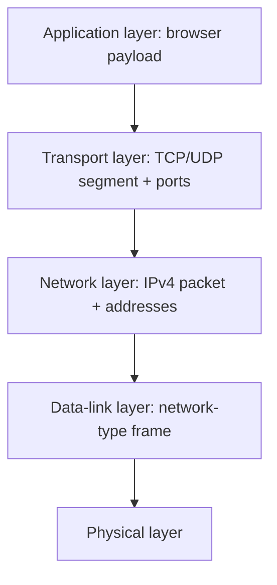
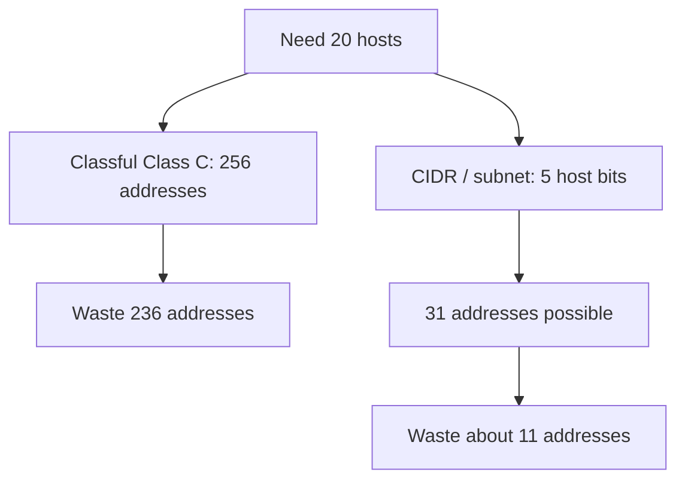

# M09: TCP/IP Model-IP Addressing – I

**Source:** https://www.youtube.com/watch?v=Q40gn2Eu1zw
**Instructor / expert:** Prof Maninder Singh, Department of Computer Engineering, Thapar University, Patiala

### Learning objectives

- Trace a payload vertically down the TCP/IP stack from application to physical layer.
- State what a protocol is and when TCP versus UDP is used at the transport layer.
- Bind well-known applications to port numbers and describe a TCP segment’s source and destination ports.
- Explain IPv4 dotted-decimal addressing, classful classes A–E, default masks, and network versus host bits.
- Compute network, broadcast, and gateway addresses, and state why CIDR/subnetting is introduced to cut classful waste.

### Core concepts

The lecture is an **introductory session on computer networks** as the foundation for **cyber security**: to secure a system, first understand how the network works. Data from one machine to another travels from the **application** that talks to the user down to the **physical layer**.

#### Seven-layer mnemonic and the practical TCP/IP stack

The instructor presents **seven layers** from application downward, memorized as **“All People Seem To Need Data Processing.”** Client and server each have the same seven layers.

In the **practical model**, the first three layers — **application, presentation, and session** — are **combined** into a single **application layer**. On that layer the user talks to a server with a **browser**, the **interface between user and machine**.

Example: the user types **`www.google.com`** in the address bar.

**Conversation between layers is vertical, not horizontal.** Data travels:

**application → transport → network → data-link → physical.**

**Data-link and physical** depend on **network type** (Wi-Fi versus wired).

#### Payload and protocols

From the application, the data is a **payload** — here the payload is `www.google.com`.

At the **transport layer**, behavior is governed by **TCP** and **UDP**. A **protocol** is a **set of instructions / rules** that must be followed for a line of action. The stack **chooses TCP or UDP**.

**Most real-time applications** — **WWW/HTTP** and **mail** — follow **TCP**. The lecture calls **TCP the default protocol for all real-time applications**. TCP internals are deferred; this introduction focuses on two fields: **source port** and **destination port**.

#### Ports and the segment

Ports **identify a particular application running on the server**. They are the identifiers for applications at that layer.

| Application | Port(s) taught |
|-------------|----------------|
| HTTP | **80** (browser / WWW) |
| FTP | **20 and 21** |
| SMTP | **25** |
| SSH | **22** |
| Telnet | **23** |

These are **standard applications** used worldwide.

When the payload reaches transport, the PDU is a **segment**. The segment holds:

1. The **payload**
2. **Source port number**
3. **Destination port number**

For HTTP, **destination port is 80 by default**. The **source port** is a **random number above 1024**. Standard / well-known ports are **not** used as sources: **source cannot be less than 1024**.

A port is a **16-bit** entity: \(2^{16} = 65{,}536\) ports, so that many applications can theoretically run on one machine. Applications are **bound** to ports (HTTP→80, and so on).

Worked example: source **4444**, destination **80**, payload from the application in between. That segment then goes to the **network layer**.

#### IPv4 addresses and classful classes

The **network layer** gives addresses to **client and server** computers. Addresses are written in **dotted-decimal notation** and called **IP addresses**.

This lecture is **IPv4**: **32-bit** addresses, so \(2^{32}\) unique addresses. Some are **reserved** as **Class D and Class E**. Computers use **Class A, B, and C**.

Form: **`X.Y.Z.A`**, each octet **0–255**, each octet **8 bits**, totaling 32 bits.

An IP address has two parts: **network address** and **host address**. Which bits are which depends on the **subnet mask**.

| Class | Default subnet mask | First-octet cue taught | Network bits | Host bits | Implication taught |
|-------|---------------------|------------------------|--------------|-----------|--------------------|
| **A** | `255.0.0.0` | **0–126** | 8 | 24 | \(2^{8}\) networks, \(2^{24}\) hosts each — **millions of machines**, “bigger networks” |
| **B** | `255.255.0.0` | (default mask 16/16) | 16 | 16 | \(2^{16}\) networks, \(2^{16}\) hosts each — about **65,536 hosts** per network |
| **C** | `255.255.255.0` | (default mask 24/8) | 24 | 8 | \(2^{8} = 256\) addresses/hosts per network — **smallest** classful size taught |
| **D** | — | reserved | — | — | **Multicasting** (later lectures) |
| **E** | — | reserved | — | — | **Not used**; reserved |

Example: **`10.10.10.10`** — first octet between 0 and 126 → **Class A**, default mask `255.0.0.0`.

#### 20-host example, unicast, network and broadcast

Need **20 machines**. Class A would **waste huge numbers** of addresses (\(2^{24}\) hosts per network). **Class C** is the fit among classful choices: **256** addresses, wasting **236** if only 20 are needed — still described as **pretty huge waste**.

Worked Class C net: **`192.168.1.0`**. Assign **`192.168.1.1` … `192.168.1.20`**. All those machines share the **same network**.

For machines to talk (including to **another** network), two ideas matter: they must be on the **same network** (for on-net talk), and there is a **broadcast address**.

**Unicast:** `192.168.1.2` talking to **one** other machine — a **single** machine to another.

**Talk to all machines on the same network** needs the network identity of `192.168.1.2`.

**Network address** = IP **logically ANDed** with the subnet mask.

`192.168.1.2` AND `255.255.255.0`: AND with **zero** yields **zero** in that octet; other octets stay. Result: **`192.168.1.0`**.

**Broadcast address:** **all host bits set to 1** → last octet `11111111` = **255** → **`192.168.1.255`**.

So for `192.168.1.2`:

| Role | Address |
|------|---------|
| Network | `192.168.1.0` |
| Broadcast | `192.168.1.255` |

Each network that must talk to another network needs **three special addresses**:

1. **Network address**
2. **Broadcast address**
3. **Gateway address**

**Gateway** = a **router** that talks to the other network. **Standard** taught: give the gateway the **last IP of the network** → **`192.168.1.254`**.

**Hosts per network formula:** \(2^n - 2\). For Class C, \(n = 8\): \(2^8 - 2 = 254\) hosts. One of those 254 is the gateway, leaving **253 live hosts** on a full Class C. For only **20** needed addresses, **233** still wasted (after the lecture’s accounting).

#### Classful waste and CIDR / subnetting preview

**Classful** addressing uses A, B, or C (D multicast, E unused). Those three **waste** IPv4 space, so another mechanism is adopted: **CIDR** — **classless inter-domain routing** — to **cut down wastage**. That practice is **subnetting**.

For **20** addresses, **five host bits** suffice. Binary weights: **1, 2, 4, 8, 16, 32**. Five bits address **31** machines (\(16+8+4+2+1\)). Only five of the last octet’s eight host bits are consumed; **three bits go to the network**. Wastage drops to about **11** addresses instead of hundreds.

In binary for this case: **three network bits + five host bits** in the last octet. The default Class C mask `255.255.255.0` is **replaced**; the exact new last-octet value is **deferred to the next lecture**.

**Supernetting** is also previewed: the next class will find **subnets** and discuss **supernetting**. The instructor’s framing: **play with host bits and network bits** to cut IPv4 waste. Subnetting here means using **fewer host bits** so **fewer IPs are wasted**.

#### Recap chain taught at the close

1. **Application** produces a **payload**.
2. Payload goes **vertically** to **transport**.
3. Transport adds **source and destination ports**; PDU = **segment**.
4. **Destination port is fixed by the application** (browser → **80**).
5. Standard ports address standard applications.
6. Segment goes to the **network layer**, which adds **source and destination IP addresses**.
7. Hosts are numbered with **classful** or **classless** IPv4; classful **wastes** space (the `192.168.1.0` / 20-host example).
8. **CIDR** is the tool to cut that waste; **worked CIDR examples** come next, along with **MAC / data-link addresses**.

### Key terms

| Term | Meaning in this lecture |
|------|-------------------------|
| All People Seem To Need Data Processing | Mnemonic for the seven layers from application down |
| Payload | Application data handed down (e.g. `www.google.com`) |
| Protocol | Set of rules for a line of action (TCP or UDP at transport) |
| Segment | Transport PDU: payload plus source and destination ports |
| Port | 16-bit application identifier; 65,536 possible values |
| Well-known ports | Below 1024; not used as random source ports |
| Dotted-decimal | IPv4 written as four octets 0–255 |
| Subnet mask | Marks which IP bits are network vs host |
| Unicast | One machine talking to one other machine |
| Network address | IP AND mask; host bits zero |
| Broadcast address | All host bits one |
| Gateway | Router address used to reach another network |
| CIDR | Classless inter-domain routing; subnetting to reduce classful waste |

### Lecture takeaways

- Layers talk only **down the stack**; the browser payload becomes a TCP segment (ports) then an IPv4 packet (addresses).
- TCP is taught as the default for HTTP and mail; UDP is the other transport choice.
- HTTP listens on **80**; sources pick a port **above 1024**; FTP 20/21, SMTP 25, SSH 22, Telnet 23.
- IPv4 is 32-bit dotted decimal; classful A/B/C (with D multicast, E reserved) waste space when a site needs only 20 hosts.
- Network = IP AND mask; broadcast = host bits all 1; a gateway (often last host address) is required to leave the network; usable hosts are \(2^n-2\).
- CIDR/subnetting uses only as many host bits as needed (five bits for 20–31 hosts); mask arithmetic and MAC addresses are the next lecture.
