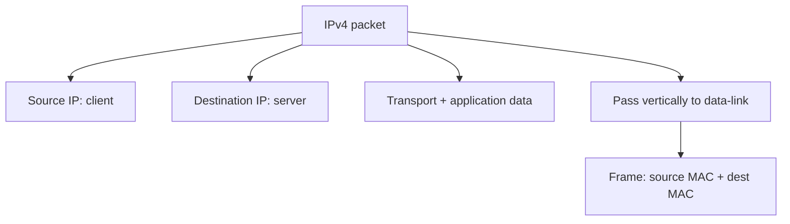
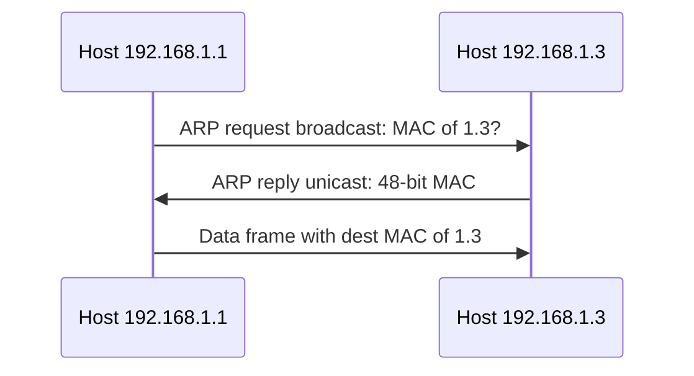

# M10: TCP/IP Model-IP Addressing – II

**Source:** https://www.youtube.com/watch?v=FQzPOhnEkjg
**Instructor / expert:** Dr Maninder Singh, Professor and Dean, Academic Affairs, Thapar University, Patiala

### Learning objectives

- Finish the 20-host CIDR example: mask `255.255.255.224`, block size, network and broadcast.
- Repeat the method for 10 hosts (`/28`) and list network, broadcast, first/last host, and wasted addresses.
- Write the same prefix in subnet-mask form and in CIDR slash notation.
- Distinguish IPv4 **logical** addresses from 48-bit **MAC** **physical** addresses (OUI + serial).
- Use ARP (broadcast request, unicast reply) to fill a frame when two hosts are on the same network; note that off-net frames use the **gateway’s** MAC.

### Core concepts

Previous lecture: payload (application) → **segment** (transport) → **packet** (network). A packet is built from **source IP** and **destination IP**. Classes A, B, and C were introduced, plus a **20-machine** network on **`192.168.1.0`** with as little waste as possible via **CIDR** (**classless inter-domain routing**).

#### Powers-of-two table for the last octet

Memorize \(2^0 \ldots 2^7\) because hosts use **binary**: **1, 2, 4, 8, 16, 32, 64, 128**. Those are the **eight bits of the last octet**.

**Rule:** bits with weight **1** are **network**; bits with weight **0** are **host**.

#### Example 1 — 20 machines on `192.168.1.0`

Five bits are enough for 20 hosts. In the last octet, **five bits address hosts**, **three bits address the network**.

Network-bit weights **128 + 64 + 32 = 224**. Subnet mask:

**`255.255.255.224`**

That last **224** leaves **five host bits**. Network address **`192.168.1.0`**. Hosts **`192.168.1.1` … `192.168.1.20`**.

**Broadcast:** always work on the **incomplete octet**. Incomplete value is **224**. Subtract from **256**:

**\(256 - 224 = 32\)** → **block size 32** (32 addresses per block).

Last address in the block = broadcast = **32 − 1 = 31** → **`192.168.1.31`**.

Network **`192.168.1.0`**. Addresses **21–30** are **waste** if only 20 machines are required.

#### Example 2 — 10 machines on `192.168.1.0`

Same network address; need **10** machines. Eight last-octet bits would cover **256** machines. **Four bits** cover 10 hosts.

Split of the last octet: **four network bits + four host bits**.

Usable hosts: **\(2^4 - 2 = 14\)**.

Mask last octet: **`11110000`**. Sum the 1-weights: **128+64+32+16 = 240**.

**Mask: `255.255.255.240`**

IPv4 is 32 bits: **four host bits**, **28 network bits**. Slash form:

**`192.168.1.0/28`**

**CIDR notation** (`/28`) and **subnet-mask notation** (`255.255.255.240`) are **the same thing**.

Incomplete octet = 240. Block size **\(256 - 240 = 16\)**.

| Item | Value taught |
|------|----------------|
| Network (first in block) | `192.168.1.0` |
| Broadcast (last in block) | `192.168.1.15` |
| First host | `192.168.1.1` |
| Last assigned of the 10 | `192.168.1.10` |
| Unused in the block | `.11`, `.12`, `.13`, `.14` (four addresses wasted) |

These addresses are used at the **network layer**. That layer forms a **packet**: **source IP** (client), **destination IP** (server), plus data from transport and application. The network layer is the **host-to-host** communication layer.

#### Data-link layer: frames and MAC addresses

Communication continues **vertically down**. The packet goes to the **data-link layer**. Data-link PDU = **frame**. This layer is **hardware dependent**: **Wi-Fi frame format ≠ wired frame format**. Common to both: **source MAC** and **destination MAC**.

| Address | Layer | Role |
|---------|-------|------|
| **IP** | Network | **Logical** address |
| **MAC** | Data-link | **Physical** address |

**Analogy:** a mobile **phone number** is **logical** (the same number can move to another handset). The set has a **physical** identity — compared to an **IMEI** — like a MAC on a NIC.

MAC addresses are **48-bit**, written in **hexadecimal**, e.g. `00:A0:C0:AB:CD:01`. Two parts:

| Part | Size | Meaning |
|------|------|---------|
| First **three bytes** (24 bits) | OUI / **OEM** | Original equipment manufacturer (Cisco, Intel, D-Link, …) |
| Last **three bytes** (24 bits) | Serial / sequence | Serial number of that network card |

Hierarchy when surfing: **name in the address bar** → **IP** → **MAC**. Humans remember **names**; machines use **numbers**. `www.google.com` is converted to a **logical IP** at the network layer, then to a **48-bit MAC** on the host.

**Experiment:** Command Prompt → **`ipconfig /all`**. Shows **IP**, **subnet mask**, and **physical (MAC)** address for the interface (demo values: an address in `192.168.1.x` with a mask, and a MAC beginning `00-50-56-…`).

To learn Google’s IP: **`ping www.google.com`**. The lecture’s reply at that moment: **`173.194.126.80`**. That destination IP is what goes into the **network packet**.

Packet then: **source = this machine’s IP**, **destination = Google’s IP**. Data-link **translates the packet into a frame**.

#### Same-net vs gateway MAC (student mistake)

**Common mistake:** frame destination MAC is the **server’s** MAC. **Not so** when leaving the LAN: **destination MAC is the gateway’s MAC**.

**Same network:** `192.168.1.1` talking to `192.168.1.3`. The computer **computes both network addresses**. If they **match**, it **requests the physical address by broadcast**.

Both IPs are already known → the hosts are talking at the **network layer**. A frame still needs MACs. **Source MAC** comes from **`ipconfig /all`**. **Destination MAC** on the same net is learned by **broadcast**.

That broadcast is **ARP** — **Address Resolution Protocol**. Machine **1.1** sends an **ARP request (broadcast)**; **1.3** returns an **ARP reply (unicast)** with its **48-bit** MAC (illustrated as a value such as `00:00:00:0C` plus the rest of the 48 bits). With that MAC, **1.1** can **form the frame**.

**Different network:** destination MAC is the **router/gateway** MAC. **What a router is** is deferred; **IP spoofing** is also named as a **next-lecture** security topic.

#### Recap of layer roles

| Layer | Addresses | Communication name |
|-------|-----------|--------------------|
| Transport | **Port** (process) addresses | **Process-to-process** |
| Network | **IP** (logical) | **Host-to-host** |
| Data-link | **MAC** (physical, 48-bit) | **Node-to-node** |

Classful addressing **wastes IPs**; **CIDR** lets you take **only as many host bits as the machine count needs**, then compute **network, broadcast, first host, last host**. Frames need MACs from **ARP**. First **24** MAC bits = **OEM**, next **24** = card **sequence number**. Application still starts from a **string**; the stack turns it into ports, IPs, and MACs.

### Key terms

| Term | Meaning in this lecture |
|------|-------------------------|
| CIDR | Classless inter-domain routing; slash prefix equivalent to a mask |
| Incomplete octet | The mask octet that is not 0 or 255; used to get block size as \(256 -\) that value |
| Block size | Number of addresses in the CIDR block (e.g. 32 for mask 224, 16 for 240) |
| `/28` | 28 network bits = mask `255.255.255.240` |
| Frame | Data-link PDU with source and destination MAC |
| Logical vs physical | IP vs MAC (phone number vs IMEI analogy) |
| OEM / OUI | First three MAC bytes: manufacturer |
| `ipconfig /all` | Shows IP, mask, and MAC |
| `ping` | Reveals the current IP of a name such as `www.google.com` |
| ARP | Broadcast request / unicast reply to map IP → MAC on the same network |
| Gateway MAC | Destination MAC of an off-net frame (not the remote server’s MAC) |

### Lecture takeaways

- For 20 hosts, mask **`255.255.255.224`**, block **32**, network `.0`, broadcast `.31`; leftover `.21–.30` are waste.
- For 10 hosts, **`192.168.1.0/28`** = **`255.255.255.240`**, block **16**, broadcast `.15`, 14 usable, four leftover if only 10 are assigned.
- Network layer = host-to-host **packet**; data-link = hardware **frame** with 48-bit MACs (24-bit OEM + 24-bit serial).
- Names become IPs (`ping`); IPs become MACs (`ipconfig /all` plus ARP).
- Same-net destination MAC comes from ARP; **off-net destination MAC is the gateway**, not the server — the usual student error.
- Transport = process-to-process (ports), network = host-to-host (IP), data-link = node-to-node (MAC).
