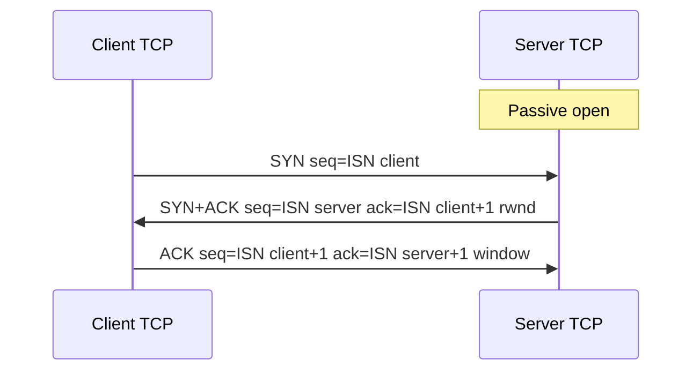
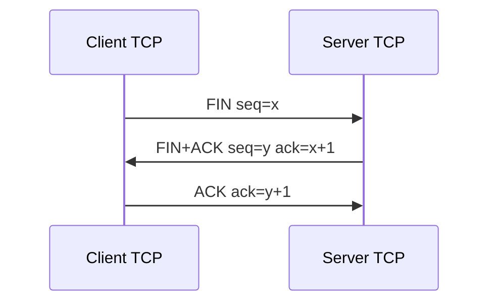
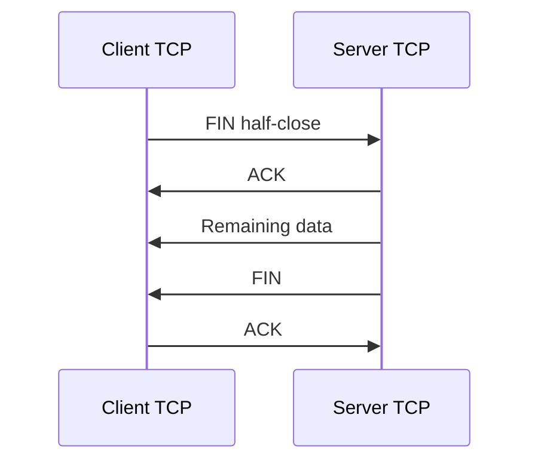

# M11: TCP Connection Management and Flow Control

**Source:** https://www.youtube.com/watch?v=TDYgEmXtWHc
**Instructor / expert:** Sunil Kumar, Department of Electrical and Computer Engineering, Punjab Agricultural University, Ludhiana

### Learning objectives

- Explain how TCP can be connection-oriented while using connectionless IP.
- Walk the three-way handshake (passive/active open, SYN, SYN+ACK, ACK) including sequence-number consumption.
- Describe SYN flooding as a denial-of-service attack and the mitigations taught (limits, filters, cookies).
- Account for bidirectional data transfer, piggybacked ACKs, PSH, and URG (including what urgent mode is not).
- Contrast three-way connection termination with four-way half-close.

### Core concepts

Contents: **TCP connection establishment**, **data transfer**, then **connection termination**.

**TCP** is a **connection-oriented transport protocol**. It builds a **virtual path** between source and destination. **All segments of a message** travel that **single virtual pathway**, which helps **acknowledgement** and **retransmission** of damaged or lost data.

TCP uses **IP**, which is **connectionless**, yet TCP itself is connection-oriented because the TCP connection is **virtual, not physical**. TCP runs **higher** than IP: IP **delivers individual segments**; **TCP controls the connection**. If a segment is **lost or corrupted**, TCP **retransmits** — **IP is unaware**. If a segment arrives **out of order**, TCP **holds it** until missing segments arrive — **IP is unaware of reordering**.

Connection-oriented TCP has **three phases:**

1. **Connection establishment**
2. **Data transfer**
3. **Connection termination**

#### Connection establishment

TCP transfers data in **full duplex**. When two TCPs are connected they can **send segments simultaneously**. Each party must **initialize** communication and **get approval** from the other **before any data**.

**Three-way handshake.** An application **client** wants to connect to an application **server** using TCP.

The process **starts with the server**. The server program tells its TCP it is **ready to accept a connection** — a **passive open**. Server TCP will accept from **any machine** but **cannot originate** the connection itself.

The client issues an **active open**: it tells its TCP to connect to a **particular server**. Three-way handshaking then proceeds.

Timelines show each segment’s headers; the lecture keeps **sequence number**, **acknowledgement number**, **control flags**, and **window size** when relevant.

**Step 1 — client SYN.** Only the **SYN** flag is set. Purpose: **synchronize sequence numbers**. The client picks a **random Initial Sequence Number (ISN)** and sends it. This segment has **no acknowledgement number** and **does not define window size** (a window makes sense only when a segment **includes an acknowledgement**). Options may appear (deferred). SYN is a **control segment with no data** but **consumes one sequence number**. When data starts, ISN is **incremented by one**. Think of SYN as carrying **one imaginary byte**. **A SYN cannot carry data** (in this account) **but consumes one sequence number**.

**Step 2 — server SYN+ACK.** Flags **SYN** and **ACK**. Dual purpose: it is a SYN for the **reverse direction** (server picks its own sequence numbers for bytes **server → client**) and it **ACKs** the client’s SYN by showing the **next sequence number expected** from the client. Because it contains an ACK, it **defines the receive window size (rwnd)** for flow control.

**Step 3 — client ACK.** An **ACK** segment acknowledging the second segment. The **sequence number is the same as in the SYN** (no new consumption). **ACK consumes no sequence numbers**. The client must also **define the server window size**. Some implementations let this third segment **carry the first chunk of client data**; then it **must have a new sequence number** equal to the **first data byte**. In general the third segment **usually carries no data** and **consumes no sequence numbers**.

**Simultaneous open.** Rare: **both** processes issue an **active open**. Both TCPs send **SYN+ACK** to each other and **one single connection** is established.

#### SYN flooding

Connection establishment is open to **SYN flooding**. One or more attackers send a **large number of SYN segments**, **pretending** to be different clients by **faking source IP addresses**. The server treats them as **active opens**, allocates **resources** — **TCB** (**transmission control block**) **tables** and **timers** — and sends **SYN+ACK** to the **fake** clients (those replies are **lost**). While the server waits for the **third leg**, **resources stay allocated unused**. If SYNs are many in a short time, the server **runs out of resources** and **cannot accept valid clients**.

SYN flooding is a **denial-of-service (DoS)** attack: the attacker **monopolizes** the system with so many requests that it **overloads** and **denies service** to valid users.

Mitigations taught:

- **Limit** connection requests in a **specified period**.
- **Filter** datagrams from **unwanted source addresses**.
- **Postpone resource allocation** until the server verifies a **valid IP**, using a **cookie**.

#### Data transfer

After establishment, **bidirectional** data transfer: client and server send **data and acknowledgements in both directions**. Acknowledgements are **piggybacked** with data.

Example: after connect, client sends **2000 bytes in two segments**; server sends **2000 bytes in one segment**; client sends **one more** segment. The **first three** segments carry **data and ACK**; the **last** is **ACK only** (no more data). Note sequence and ACK numbers. Client data segments have **PSH** set so server TCP **delivers to the server process as soon as received**. The server’s segment **does not** set PSH. Implementations may **choose** whether to set it.

**Pushing data.** Sending TCP **buffers** the application stream and **selects segment size**. Receiving TCP also **buffers** and delivers when the application is ready or when convenient — flexibility that **raises efficiency**. Interactive applications (e.g. a **keystroke** that needs an **immediate response**) cannot accept **delayed send/delivery**. The sending application can request a **push**: sending TCP **must not wait for the window to fill**; it **creates and sends a segment immediately** and **sets PSH** so the receiver delivers **as soon as possible** and does not wait for more data. **Most current TCP implementations ignore** application push requests; TCP **may or may not** use the feature.

**Urgent data.** TCP is **stream-oriented**: the application presents a **byte stream**, each byte with a **position**. Sometimes the application must send **urgent bytes** for **special treatment** at the far end. Solution: a segment with **URG** set. Sending TCP puts **urgent data at the beginning** of the segment; the rest can be **normal buffered data**. The **urgent pointer** marks the **end of urgent data**. On URG, receiving TCP **informs the receiving application** (OS-dependent); **action is the receiving program’s discretion**.

TCP urgent data is **neither a priority service nor an expedited data service**. Urgent mode only **marks a portion of the byte stream** as needing **special treatment** and **signals its position**. For all other purposes urgent data is **identical** to the rest of the stream. The receiver **must read every byte in submission order** whether or not urgent mode is used. **Standard TCP never delivers data out of order**.

#### Connection termination

**Either** client or server may close; it is **usually** the client. Implementations allow **two options:** **three-way handshaking** and **four-way handshaking with half-close**.

**Three-way termination** (common case):

1. After a **close** from the client process, client TCP sends a **FIN** (FIN flag set). FIN **may carry the last data chunk** or be **control-only**. A control-only FIN **consumes one sequence number**. **FIN consumes one sequence number if it does not carry data.**
2. Server TCP **informs its process**, then sends **FIN+ACK**: confirms the client FIN and **announces close in the other direction**. May carry the server’s last data; if not, **consumes one sequence number**.
3. Client TCP sends a final **ACK**. ACK number is **1 plus the sequence number in the server’s FIN**. This segment **cannot carry data** and **consumes no sequence numbers**.

**Half-close.** One end can **stop sending** while still **receiving**. Either side may request it. Typical when the **server needs all data before processing**, e.g. **sorting**: the client sends all data, then closes **client→server**, but **server→client must stay open** to return sorted data.

Sequence: client **half-closes** with **FIN**; server **accepts** with **ACK**; server may **still send data**; when done, server sends **FIN**, client **ACKs**. After half-close, **data server→client** and **ACKs client→server** continue; the **client cannot send more data**. The **ACK of the client FIN consumes no sequence number**. Server sequence numbering stays at the next expected value until the server’s own FIN. The **last ACK** still uses the client sequence number **x** because **no sequence numbers were consumed** in that direction during the remaining transfer.

### Key terms

| Term | Meaning in this lecture |
|------|-------------------------|
| Virtual path | TCP’s connection-oriented path over connectionless IP |
| Passive open | Server ready to accept; does not itself initiate |
| Active open | Client request to connect to a particular server |
| SYN | Control segment that syncs ISN; consumes one sequence number; no real data |
| SYN+ACK | Server’s reverse SYN plus ACK of client SYN; carries rwnd |
| ACK (handshake 3) | Usually no data; consumes no sequence number |
| ISN | Random initial sequence number |
| TCB | Transmission control block; state allocated per embryonic connection |
| SYN flooding | DoS via forged SYNs that exhaust server resources |
| Cookie | Postpone allocation until the client IP is shown valid |
| Piggybacking | ACK carried with data |
| PSH | Push: send/deliver without waiting to fill buffers |
| URG / urgent pointer | Mark a stream range for special treatment; not priority or out-of-order delivery |
| FIN | Close in one direction; consumes one sequence number if no data |
| Half-close | Stop sending but keep receiving (e.g. sort-then-reply) |

### Lecture takeaways

- TCP is virtually connection-oriented on top of unaware, connectionless IP (retransmission and reordering are TCP’s job).
- Full-duplex use needs a three-way handshake: SYN (ISN, one seq), SYN+ACK (reverse ISN + rwnd), ACK (usually no seq consumption).
- SYN flooding is DoS by fake source IPs filling TCB/timer resources; limits, filters, and cookies are the taught defenses.
- Data is bidirectional with piggybacked ACKs; PSH is for interactive immediacy (often ignored); URG only marks special bytes in order.
- Close is three-way FIN / FIN+ACK / ACK, or four-way half-close so one side can finish sending while the other still replies.
