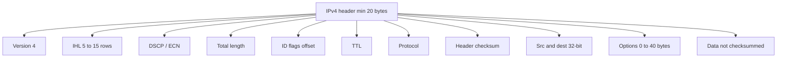
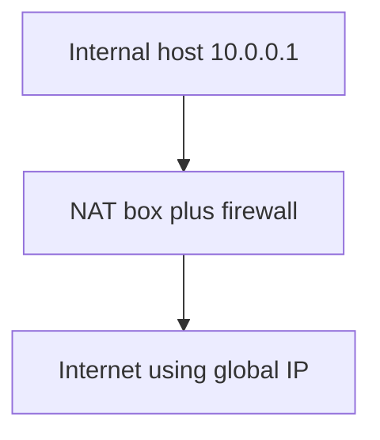

# M12: IPV4 & IPV6

**Source:** https://www.youtube.com/watch?v=HXbCUPDXLG8
**Instructor / expert:** Prof Yogesh Chaba, Department of Computer Engineering and IT, Guru Jambheshwar University of Science & Technology, Hisar

### Learning objectives

- Place IPv4 as RFC 791’s connectionless 32-bit packet protocol and parse every IPv4 header field taught.
- Contrast classful IPv4 ranges and default masks with CIDR (RFC 1519) using the Cambridge / Oxford / Edinburgh example.
- Explain NAT and the RFC 1918 private ranges.
- List IPv6’s 128-bit notation, header fields, address compression, and six extension headers.
- State which IPv4 header fields disappear in IPv6 and why.

### Core concepts

Contents: **IPv4 introduction**, **IPv4 header**, **IPv4 addressing**, then **IPv6**.

#### IPv4 introduction

**Internet Protocol version 4** is the **fourth version** of IP and a **core Internet protocol**. It still **routes most Internet traffic** despite **IPv6**. Specified in **IETF RFC 791** (September **1981**), replacing **RFC 760** (January **1980**). IPv4 is **connectionless**, for **packet-switched** networks, with **32-bit** addresses.

#### IPv4 datagram header

A datagram has a **header** and a **text (data)** part. The header has a **20-byte fixed part** plus a **variable options** part. Format: **minimum five rows of 32 bits**; extra rows are optional.

| Field | Size | Meaning taught |
|-------|------|----------------|
| **Version** | 4 bits | IPv4 = **4**. Other versions named: **IPv5** (experimental **real-time stream** protocol, **never widely used**) and **IPv6** (expected to deploy) |
| **IHL** (Internet Header Length) | 4 bits | Number of **32-bit rows**. **Minimum 5** (no options). **Maximum 15** → header **≤ 60 bytes**, options **≤ 40 bytes** |
| **DSCP** (Differentiated Services Code Point) | 6 bits | For **differentiated services** / emerging **real-time** streams, e.g. **Voice over IP**. Originally **Type of Service**: **3-bit precedence** plus flags **D** (delay), **T** (throughput), **R** (reliability) |
| **ECN** (Explicit Congestion Notification) | 2 bits | **End-to-end congestion notification without dropping packets**. Previously unused |
| **Total length** | 16 bits | **Header + data**. Maximum **65,535** bytes |
| **Identification** | (ID field) | Uniquely identifies the **group of fragments** of one datagram so the destination can reassemble; **all fragments share the same ID** |
| **Flags** | 3 bits | One **unused**; **DF** = Don’t Fragment (order to routers **not to fragment** because the destination **cannot reassemble**); **MF** = More Fragments (**all fragments except the last**) |
| **Fragment offset** | 13 bits | Where this fragment belongs in the datagram. All fragments except the last must be a **multiple of 8 bytes** (elementary fragment unit). 13 bits → at most **8192** fragments → max datagram **65,536** bytes (**one more than** the total-length field) |
| **Time to live** | 8 bits | Limits packet lifetime; **supposed** to count **seconds**, max **255 seconds** |
| **Protocol** | 8 bits | Protocol in the **data** portion |
| **Header checksum** | 16 bits | Verifies the **header only**; useful against **bad memory words inside a router** |
| **Source address** | 32 bits | Sender IPv4; **may change in transit** via **NAT** |
| **Destination address** | 32 bits | Receiver IPv4; **may also change** via **NAT** |
| **Options** | variable | Escape hatch for later versions, experiments, and rare info. Originally **five** options (more added later): **security** (how secret the datagram is); **strict source routing** (complete path as IP addresses); **loose source routing** (list of routers **not to be missed**); **record route** (routers **append their IPs**); **timestamp** (record route **plus a 32-bit timestamp**) |

**Data** is **not** in the packet checksum. Contents are interpreted from the **protocol** field.

| Protocol value | Payload protocol |
|----------------|------------------|
| 1 | ICMP |
| 2 | IGMP |
| 6 | TCP |
| 17 | UDP |
| 41 | IPv6 encapsulation |
| 89 | OSPF |
| 132 | SCTP |

#### IPv4 addressing

32-bit addresses are written **dotted decimal**: four **1-byte** parts, each **0–255**. Example: binary `10101100 00010000 11111110 00000001` → **`172.16.254.1`**. Lowest **`0.0.0.0`**, highest **`255.255.255.255`**.

For decades addresses were in **five categories** — **classful addressing**. It is **no longer used**, but literature still refers to it. Replacement is discussed after the classful review.

**Classful leading bits and ranges:**

| Class | Starts with | Network / host bits | Range taught |
|-------|-------------|---------------------|--------------|
| **A** | `0` | 8 / 24 | `1.0.0.0` – `127.255.255.255` |
| **B** | `10` | 16 / 16 | `128.0.0.0` – `191.255.255.255` |
| **C** | `110` | 24 / 8 | `192.0.0.0` – `223.255.255.255` |
| **D** | `1110` | — | **Multicasting** |
| **E** | `1111` | — | **Reserved for future use** |

**Network address** = **first IP** of a network or subnet. Example host **`192.168.64.100/24`**: `/24` means **24 network bits**, **8 host bits**. Mask is **24 ones and 8 zeros** = **`255.255.255.0`**. Network = host IP **AND** mask → **`192.168.64.0`**.

Classful addressing allowed **only three** default masks:

| Class | Mask | Prefix |
|-------|------|--------|
| A | `255.0.0.0` | `/8` |
| B | `255.255.0.0` | `/16` |
| C | `255.255.255.0` | `/24` |

#### CIDR (RFC 1519)

**Classless inter-domain routing:** allocate remaining IPs in **variable-sized blocks without regard to classes**. A site needing **2000** addresses gets a block of **2048** on a **2048-byte boundary** (to ease forwarding).

Worked pool starting at **`194.24.0.0`**:

| Site | Need | Assignment | Mask |
|------|------|------------|------|
| **Cambridge University** | 2048 | `194.24.0.0` – `194.24.7.255` | `255.255.248.0` |
| **Oxford University** | 4096 | Cannot start at `194.24.8.0` (not on a **4096** boundary); gets `194.24.16.0` – `194.24.31.255` | `255.255.240.0` |
| **University of Edinburgh** | 1024 | `194.24.8.0` – `194.24.11.255` | `255.255.252.0` |

#### NAT

**Network Address Translation:** give a company **one IP for Internet traffic**. Inside, every computer has a **unique IP** for **internal routing**. When a packet **exits** to the **ISP**, **address translation** occurs.

Three **private** ranges (also **not used for websites**). **No packet containing these addresses may appear on the Internet itself.** Defined in **RFC 1918**:

| Class-style block | Range | Hosts taught |
|-------------------|-------|--------------|
| Class A | `10.0.0.0` – `10.255.255.255` | 16,777,216 per network |
| Class B | `172.16.0.0` – `172.31.255.255` | 1,048,576 per network |
| Class C | `192.168.0.0` – `192.168.255.255` | 65,536 per network |

Operation: inside, machines use **`10.x.y.z`**. On the way out, a **NAT box** maps e.g. **`10.0.0.1`** to the company’s **global** IP (**`198.60.42.12`** in the figure). The NAT box is **often combined with a firewall** that provides security by **careful control**.

#### IPv6

**IPv6** was developed by the **IETF** to deal with **IPv4 address exhaustion** and is **intended to replace IPv4**. Addresses are **128 bits**, written as **eight groups of four hexadecimal digits** separated by **colons**.

**Main features:**

1. **Longer addresses:** 128 vs 32.
2. **Simpler header:** **seven fields** vs **13** in IPv4.
3. **Better support for options.**
4. **Security** is a big advance.
5. More attention to **quality of service**.

An IPv6 packet = **header + payload**. The **fixed header occupies the first 40 bytes**.

| Field | Size | Meaning taught |
|-------|------|----------------|
| **Version** | 4 bits | Always **6** |
| **Traffic class** | 8 bits | Distinguish packets with different **real-time delivery** requirements |
| **Flow label** | 20 bits | Source and destination set up a **pseudo-connection** with particular **flow-control** properties |
| **Payload length** | 16 bits | Bytes **after** the 40-byte header (name/meaning changed from IPv4 **total length**; **the 40 header bytes are not counted**) |
| **Next header** | 8 bits | How to interpret what follows: which of **six extension headers**, or which **transport protocol** if this is the last IP header |
| **Hop limit** | 8 bits | Keeps packets from living forever; **same practice as IPv4 TTL** — **decremented each hop**. IPv4 TTL was **in theory seconds** but **no router used it that way**, so the name changed |
| **Source address** | 16 bytes | |
| **Destination address** | 16 bytes | |

Example written form: `8000:0000:0000:0000:0123:4567:89AB:CDEF`.

**Compression:**

1. **Leading zeros** in a group may be omitted (`0123` → `123`).
2. **One or more groups of 16-bit zeros** may be replaced by **`::`**, giving e.g. **`8000::123:4567:89AB:CDEF`**.

**Extension headers** (optional, efficient encoding of missing IPv4 features). **Six** kinds:

| Extension | Role |
|-----------|------|
| **Hop-by-hop** | Miscellaneous information for **routers** |
| **Destination options** | Extra information for the **destination** |
| **Routing** | **Loose list** of routers to visit |
| **Fragmentation** | Management of datagram **fragments** |
| **Authentication** | Verify the **sender’s identity** |
| **Encapsulating Security Payload** | Information about **encrypted** contents |

**IPv4 vs IPv6 field comparison:**

- **IHL is gone** — IPv6 header **fixed length**.
- **Protocol is gone** — **next header** says what follows the last IP header.
- **All fragmentation fields removed** — IPv6 uses a **different fragmentation approach**.
- **TTL → hop limit**.
- **Checksum gone** because calculating it **greatly reduces performance**.

### Key terms

| Term | Meaning in this lecture |
|------|-------------------------|
| RFC 791 / RFC 760 | IPv4 spec (1981) replacing the 1980 definition |
| IHL | Header length in 32-bit words; 5–15 |
| DSCP / ECN | Diffserv class; congestion signal without drops |
| DF / MF | Don’t fragment; more fragments |
| Classful addressing | Historic A–E split; no longer used |
| CIDR (RFC 1519) | Variable blocks, class-free, aligned on block size |
| NAT | One public IP; rewrite internals at the border |
| RFC 1918 | Private ranges 10/8, 172.16/12, 192.168/16 |
| Flow label | IPv6 pseudo-connection / QoS-related marking |
| Hop limit | IPv6 TTL-as-actually-used |
| `::` | Compression of one or more zero 16-bit groups |

### Lecture takeaways

- IPv4 is connectionless, 32-bit, RFC 791; the header is 20 bytes plus up to 40 bytes of options, with DSCP/ECN, fragmentation (DF/MF/offset), TTL, protocol, and header-only checksum.
- Classful A–E is historical; CIDR hands out aligned variable blocks (Cambridge 2048, Oxford 4096 on a 4096 boundary, Edinburgh 1024).
- NAT plus RFC 1918 private space, often with a firewall, keeps internal 10.x addresses off the public Internet.
- IPv6 is 128-bit, 40-byte fixed header, seven fields, better options/security/QoS; addresses compress with dropped leading zeros and `::`.
- IPv6 drops IHL, protocol, fragmentation fields, and checksum; TTL is renamed hop limit; six extension headers (including AH and ESP) carry what IPv4 stuffed into options and flags.
