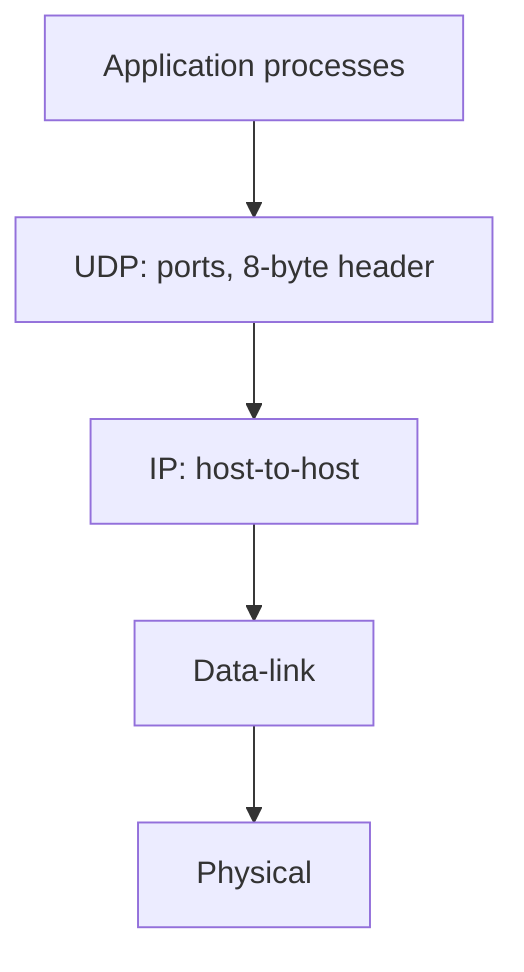
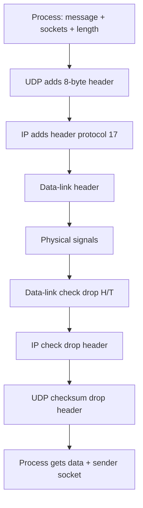

# M13: UDP — User Datagram Protocol

**Source:** https://www.youtube.com/watch?v=g4p_kJxiRHk
**Instructor / expert:** Dr Sunil Kumar, Department of Electrical and Computer Engineering, Punjab Agricultural University, Ludhiana

### Learning objectives

- Place UDP between applications and IP as a connectionless, unreliable, low-overhead process-to-process protocol.
- Parse the 8-byte user-datagram header and the hexadecimal dump example (ports, length, data).
- List UDP services: well-known ports, no connection, no flow/window, checksum with pseudo-header, no congestion control.
- Trace encapsulation/decapsulation, queuing, and multiplexing/demultiplexing.
- Describe the five-component UDP “package” (control-block table, input queues, control-block / input / output modules).

### Core concepts

Contents: **UDP introduction**, **user-datagram characteristics**, **UDP services**, then **features** and **UDP packages**.

#### Introduction

UDP is a **simple transport protocol** that extends IP’s **host-to-host** packet delivery into **process-to-process** communication. Many processes run on a host, so UDP adds **demultiplexing** so they can **share the network**.

UDP sits **between the application layer and the IP layer** in the TCP/IP suite — intermediary between **application programs** and **network operations**.

Transport duties vs what UDP actually does:

- **Process-to-process communication** — UDP uses **port numbers**.
- **Control at transport** — UDP does this at a **minimal** level: **no flow control**, **no acknowledgement** of received packets.
- **Error control to some extent** — if UDP detects an error, it **silently drops** the packet.

UDP is **connectionless** and **unreliable**. It adds essentially **nothing** to IP except **process-to-process** instead of **host-to-host**. **Minimum overhead**. If a process wants a **small message** and **does not care about reliability**, UDP is appropriate: **much less interaction** than TCP.

#### User datagram format

UDP packets are **user datagrams** with a **fixed 8-byte header**.

| Field | Size | Meaning |
|-------|------|---------|
| **Source port** | 16 bits | Process on the source host; range **0–65,535**. If the source is a **client**, usually an **ephemeral** port chosen by UDP software. If the source is a **server**, usually a **well-known** port |
| **Destination port** | 16 bits | Process on the destination. If destination is a **server**, usually **well-known**; if a **client**, usually **ephemeral**. The server **copies** the ephemeral port from the request |
| **Length** | 16 bits | **Header plus data**, theoretically **0–65,535** bytes. In practice much less because the user datagram sits in an IP datagram whose total length is **65,535**. Length is **not strictly necessary**: IP total length minus IP header length yields UDP length, but designers preferred the destination UDP to compute data length **from the UDP header** rather than ask IP. When IP delivers the user datagram, it has **already dropped the IP header**. Formula taught: **UDP length = IP length − IP header length** |
| **Checksum** | 16 bits | Errors over the **entire** user datagram (**header + data**) |

**Hex dump example:** `CB84 000D 001C 001C`

| Question | Answer taught |
|----------|----------------|
| Source port | First four hex digits **`CB84`** = **52100** |
| Destination port | Next four **`000D`** = **13** |
| Total length | Third four **`001C`** = **28 bytes** |
| Data length | 28 − 8 = **20 bytes** |
| Client→server or reverse? | Destination **13** → **client to server** |
| Client process | **Daytime** |

#### UDP services

**Process-to-process communication** uses **sockets** = **IP addresses + port numbers**. Well-known UDP ports:

| Port | Service |
|------|---------|
| 7 | Echo |
| 9 | Discard |
| 11 | Users |
| 13 | Daytime |
| 17 | Quote (QOTD) |
| 19 | Chargen |
| 53 | Domain (DNS) |
| 67 | BOOTP server |
| 68 | BOOTP client |
| 69 | TFTP |
| 111 | RPC |
| 123 | NTP |
| 161 | SNMP |
| 162 | SNMP trap |

**Connectionless service.** Each user datagram is **independent**. **No relationship** even if they share source process and destination program. Datagrams are **not numbered**. **No connection establishment or termination** (unlike TCP). Each datagram may take a **different path**. Processes **cannot** hand UDP a **byte stream** and expect it to **chop** it into related datagrams. **Each request must fit in one user datagram**. Only processes sending **short** messages (taught bound: less than **65,507** bytes) are appropriate.

**Flow control.** **None**, hence **no window**. The receiver **may overflow**. If flow control is needed, the **using process** must provide it.

**Error control.** **None except checksum**. Sender does **not** know if a message was **lost or duplicated**. On checksum error the datagram is **silently discarded**. If error control is needed, the **process** must provide it.

**Checksum.** Unlike IPv4’s header checksum, UDP checksum covers **three sections:** a **pseudo-header**, the **UDP header**, and **application data**. The pseudo-header is taken from the **IP header** of the encapsulating packet, some fields **zeroed**. Without the pseudo-header, a user datagram could arrive intact yet be delivered to the **wrong host** if the IP header were corrupted. The **protocol** field ensures the packet belongs to **UDP not TCP** (same destination port can be used by either). UDP protocol value = **17**; if it changes in transit, receiver checksum fails and UDP **drops** the packet rather than handing it to the wrong protocol. Pseudo-header fields match the **last 12 bytes** of the IP header in spirit.

**Congestion control.** **None.** UDP **assumes** packets are **small** and **cannot create congestion** — an assumption that **may not hold** when UDP carries **real-time audio and video**.

**Encapsulation.** Process sends the message to UDP with a **pair of socket addresses** and **data length**. UDP adds its header and passes the user datagram to IP with those sockets. IP adds its header with **protocol = 17**. The IP datagram goes to data-link (header added) then physical (**electrical or optical** signals).

**Decapsulation.** Physical **decodes** bits → data-link **checks** using its header; if OK, **header and trailer dropped**, datagram to IP. IP checks; if OK, **header dropped**, user datagram to UDP with **sender and receiver IP addresses**. UDP checksums the whole user datagram; if OK, **header dropped**, application data plus **sender socket address** go to the process (so it can **respond**).

**Queuing.** Queues are **associated with ports**. On the **client**, a process **requests a port** from the OS. Some implementations create **incoming and outgoing** queues per process; others **only incoming**. Even if a process talks to **many** peers, it gets **one port** and eventually **one outgoing and one incoming queue**. Client queues are usually identified by **ephemeral** ports. Queues last **as long as the process runs**; they are **destroyed** on terminate. The client sends using the **source port** in the request; UDP **dequeues one by one**, adds the header, and hands to IP. An **outgoing queue can overflow**; the OS may then ask the client to **wait**.

**Multiplexing and demultiplexing.** One UDP on a host, **many** processes.

- **Multiplexing (sender):** many-to-one. UDP accepts messages distinguished by **port numbers**, adds a header, passes to IP.
- **Demultiplexing (receiver):** one-to-many. UDP takes datagrams from IP, error-checks, drops the header, delivers by **port number**.

**Comparison with a generic connectionless simple protocol.** The **only difference** is UDP’s **optional checksum** for corruption at the receiver. If present, the receiver can discard a bad packet; **no feedback** is sent to the sender. UDP **is** that simple protocol **plus optional checksum**.

#### Features (advantages and disadvantages)

**Connectionless service** can be an **advantage or disadvantage** by application. Advantage: **short request and short response** each in **one** datagram — connection setup/teardown overhead is **significant** otherwise. Connection-oriented would exchange **at least nine packets**; connectionless needs **two**. Connectionless → **less delay**; connection-oriented → **more delay**. If **delay** matters, connectionless is preferred.

**Lack of error control** = **unreliable service**. Most applications want reliability, but reliability has **side effects**: a lost/corrupt part must be **resent**, so the receiver **cannot deliver that part immediately** → **uneven delay** between parts of the message. Some applications **do not notice**; for others uneven delay is **crucial**.

**Lack of congestion control.** UDP does **not** create **extra** traffic on an **error-prone** network the way TCP may **resend several times** and **worsen congestion**. So **lack of error control can be an advantage** when **congestion** is the big issue.

#### UDP package (implementation sketch)

A simple UDP package has **five components:**

1. **Control-block table**
2. **Input queues**
3. **Control-block module**
4. **Input module**
5. **Output module**

**Control-block table** tracks **open ports**. Each entry has at least **four fields:** **state** (`free` or `in use`), **process ID**, **port number**, **corresponding queue number**.

**Input queues:** **one per process**. This design uses **no output queues**.

**Control-block module** manages the table. A starting process asks the OS for a port: **well-known** for servers, **ephemeral** for clients. It passes **PID and port** to create a table entry. Queue-number field starts at **zero**. The lecture **does not include a strategy for a full table**.

**Input module** receives a user datagram from IP, **searches** the table for the **same port**. If found, it **enqueues** the data using the entry. If **not found**, it generates an **ICMP** message.

**Output module** **creates and sends** user datagrams.

### Key terms

| Term | Meaning in this lecture |
|------|-------------------------|
| User datagram | UDP packet; 8-byte header plus data |
| Ephemeral port | Client port chosen by UDP/OS (vs well-known server ports) |
| Socket | IP address + port |
| Pseudo-header | IP-derived fields (including protocol 17) included in the UDP checksum |
| Silent drop | Checksum failure with no NAK to the sender |
| Protocol 17 | IP protocol number for UDP |
| Multiplexing | Many processes → one UDP at the sender |
| Demultiplexing | One UDP → many processes at the receiver |
| Control-block table | Open-port state, PID, port, queue number |
| ICMP on unknown port | Input module’s response when no table entry matches |

### Lecture takeaways

- UDP is a thin, connectionless, unreliable transport: ports for process-to-process delivery, almost no control, silent drop on error.
- Header is always 8 bytes (src, dest, length, checksum); example `CB84/000D/001C/001C` is client port 52100 to daytime (13) with 20 data bytes.
- No connections, numbering, flow window, or congestion control; checksum (with pseudo-header) is the only error tool and is optional versus a bare datagram protocol.
- Encapsulation sets IP protocol 17; decapsulation peels physical → link → IP → UDP and passes the sender socket up for a reply.
- Features that look like weaknesses (no setup, no retry) are taught as advantages for short exchanges and for not feeding congestion.
- The sketched package: control-block table, per-process input queues, modules for bind, receive (ICMP if no port), and send.
