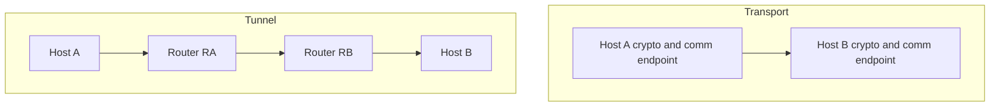
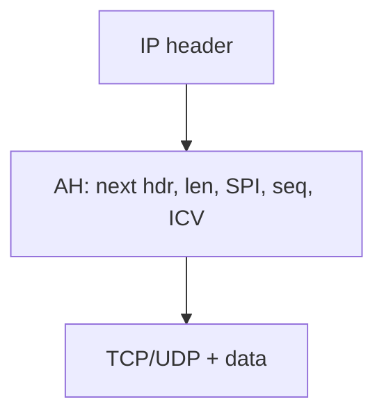
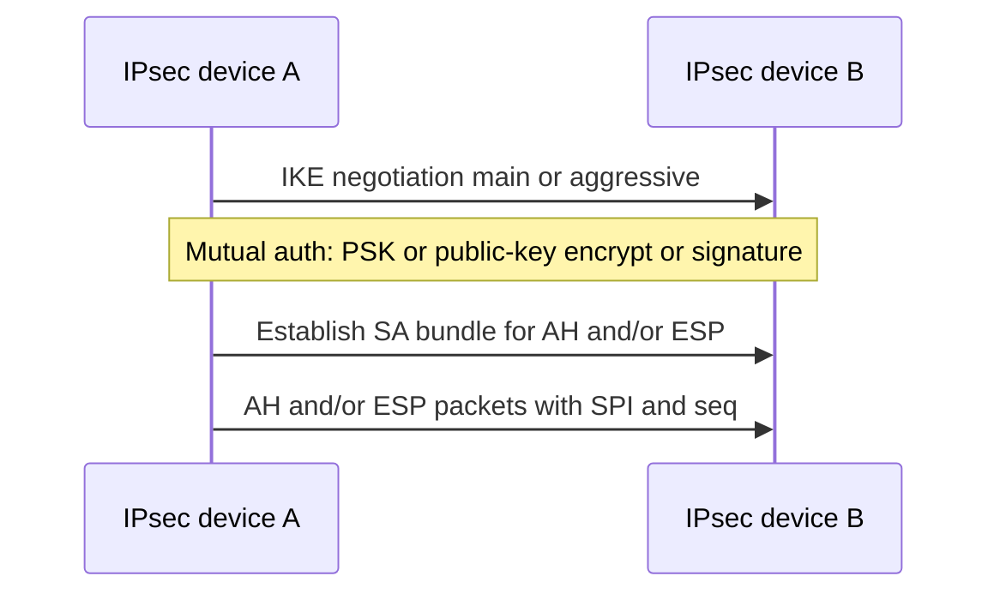

# M14: IPSec Security Protocol

**Source:** https://www.youtube.com/watch?v=wVX5KLPh_o8
**Instructor / expert:** Prof Yogesh Chaba, Department of Computer Engineering and IT, Guru Jambheshwar University of Science & Technology, Hisar

### Learning objectives

- Define IPsec as a network-layer framework (not a single protocol) for authenticating and encrypting IP packets.
- Name architecture pieces from RFC 2401: security associations, AH, ESP, transport vs tunnel mode, and IKE.
- Contrast transport mode (payload protected; IP header intact) with tunnel mode (whole packet wrapped; used for VPNs).
- Parse AH and ESP headers/trailers, ICV, SPI, and sequence numbers for anti-replay.
- State IKE’s role (RFC 2409): mutual authentication, SA setup, aggressive/main modes, and three authentication methods.

### Core concepts

Contents: **IPsec introduction**, **architecture**, **AH and ESP**, then **IKE** for key management.

#### Introduction

**IPsec** (Internet Protocol Security) is a **framework for a set of protocols** providing security at the **network / packet-processing** layer. Earlier approaches put security at the **application** layer. IPsec is especially useful for **virtual private networks** and for **remote user access through dial-up** to **private networks**. A **big advantage:** security can be arranged **without changing individual user computers**.

IPsec is a **protocol suite** that **authenticates and encrypts each IP packet** of a session. It can protect:

- **Host-to-host** (a pair of hosts)
- **Network-to-network** (a pair of **security gateways**)
- **Network-to-host** (gateway and host)

IPsec is **not a single protocol** but a **set of services and protocols** that together are a **complete security solution** for an IP network. Protections taught:

- **Confidentiality** by **encrypting** data
- **Integrity** by **checksum or hash**
- **Authentication** by **signatures and certificates**
- Protection against certain attacks such as **replay**
- **Session** handling together with **key management**

#### Architecture (RFC 2401)

**RFC 2401** defines the basic IPsec architecture. It covers **security associations (SA)**: a **bundle of algorithms and data** with the **parameters** needed by the two IPsec protocols **Authentication Header (AH)** and **Encapsulating Security Payload (ESP)**. Those protocols run in **transport mode** or **tunnel mode**. Key management uses **Internet Key Exchange (IKE)**.

#### Modes

IPsec can be implemented **host-to-host transport** or **network tunneling**.

| Mode | What is protected | Routing / header | Where it is used |
|------|-------------------|------------------|------------------|
| **Transport** | Usually only the **payload** is encrypted and authenticated | **IP header neither modified nor encrypted** so **routing is intact** | Only between **endpoints of the communication**; **cryptographic endpoints = communication endpoints** (hosts A and B) |
| **Tunnel** | The **entire IP packet** is encrypted or authenticated, then **encapsulated in a new IP packet with a new IP header** | New outer header | Between **arbitrary peers** when **at least one cryptographic endpoint is not** a communication endpoint of the secured packets (e.g. **A ↔ router RA**, **RA ↔ RB**, **RB ↔ B**). Outer source/destination can be **RA and RB**. Used to create **virtual private networks** for **network-to-network**, **host-to-network**, and **host-to-host** |

IPsec offers two security-service choices:

- **AH** — essentially **authentication of the sender**
- **ESP** — **authentication of the sender and encryption of data**

The associated information is inserted in a **header that follows the IP header**.

#### Authentication Header (AH)

AH is a member of the IPsec suite. It guarantees **connectionless integrity** and **data-origin authentication** of IP packets. Optionally it protects against **replay** with a **sliding window**, **discarding old packets**.

AH is one of **two core** IPsec security protocols. It authenticates **all or part** of a datagram by adding a header **calculated from datagram values**. AH works in **both transport and tunnel** modes.

**Packet layout:**

- **Transport:** AH is added **after** the payload that consists of **TCP header and data**.
- **Tunnel:** AH is added **after the original IP header and data** (data here also contains **TCP or UDP**).

AH uses a **hashing algorithm** and a **key known only to source and destination**. The **SA** between the two devices specifies those particulars so **only they** can compute. The source computes and puts the **Integrity Check Value (ICV)** in a special header with other fields. The destination **repeats the calculation with the shared key** and sees immediately whether **any fields in the original datagram were modified**.

**AH field format:**

| Field | Size | Meaning |
|-------|------|---------|
| **Next header** | 1 byte | Protocol number of the header **after AH**; used to **link headers** |
| **Payload length** | 1 byte | Length of the **AH itself** (including the ICV payload), in **2-octet units minus 2**. Example: value **4** = \(3+3-2\): first **three** 32-bit rows plus **three** 32-bit ICV rows → **24 octets** |
| **Reserved** | 16 bits | Unused; **set to zero** |
| **SPI** (Security Parameter Index) | 32 bits | Arbitrary value which, with the **destination IP**, **identifies the SA** of the receiving party |
| **Sequence number** | 32 bits | **Incremented by one** for every packet to **prevent replay**. When replay detection is on, sequence numbers are **never reused**; a **new SA must be renegotiated** before incrementing **beyond the maximum** |
| **ICV** | Multiple of 32 bits | May contain **padding** to align to an **8-octet** boundary for **IPv6** or a **4-octet** boundary for **IPv4** |

AH gives **integrity and authentication** so devices can verify messages arrived **intact** from the peer. For many applications that is **only one piece**: defenders also want to stop intermediates from **examining contents**. **AH is not enough for privacy**; **privacy is ESP**.

#### Encapsulating Security Payload (ESP)

ESP is the other core protocol. IPsec (via ESP) provides **origin authenticity, integrity, confidentiality, and protection of packets**. ESP **operates directly on top of IP**. Main job: **privacy** by **encrypting** datagrams — an encryption algorithm **combines data with a key**. ESP also works in **transport and tunnel** modes.

**Packet layout:**

- **Transport:** **ESP header** is added relative to the payload (TCP header + data); **ESP trailer** and **ESP authentication** are placed with that payload as taught (trailer/auth associated **with** the TCP/data region).
- **Tunnel:** the **entire original IP packet** is encapsulated under a **new outer header**. **ESP protects the whole inner IP packet**; the **outer header remains unprotected**. As in transport, **ESP trailer and ESP authentication** are added with the protected data.

ESP reuses some **AH-like fields** but **packages them differently**: not one header, but **three components**.

| Component | Contents | Placement |
|-----------|----------|-----------|
| **ESP header** | **SPI** and **sequence number** | **Before** the encrypted data; exact place depends on **transport vs tunnel** |
| **ESP trailer** | **Padding**, **pad length**, and (interestingly) **next header** | **After** the encrypted data |
| **ESP authentication data** | **ICV**, similar idea to AH | Used when ESP’s **optional authentication** is on |

Field-level:

| Field | Size | Meaning |
|-------|------|---------|
| **SPI** | 32 bits | With destination IP, identifies the receiver’s **SA** |
| **Sequence number** | 32 bits | **Monotonically increasing**, +1 per packet, **anti-replay**; **separate counter per SA** |
| **Payload data** | variable | Encrypted content |
| **Padding** | 0–255 octets | Aligns to the **cipher block size** and aligns the next field |
| **Pad length** | 8 bits | Padding size in octets |
| **Next header** | 8 bits | Next-header information |

**Why split like this:**

1. Some ciphers need a **block size**, so **padding must be after the data, not before** → padding lives in the **trailer**.
2. **ESP authentication data is separate** because it authenticates the **rest of the encrypted datagram after encryption** — it **cannot** sit in the ESP header or trailer.

#### Internet Key Exchange (IKE)

Like many secure protocol sets, IPsec uses a **shared secret**: two devices **encode and decode** with information **only they know**. An outsider may **intercept** but is prevented from **reading** or **tampering**. The primary support protocol for that in IPsec is **IKE**.

**IKE** is defined in **RFC 2409**. It is the **most complicated** IPsec protocol to understand; more than a **real simplification** needs **significant cryptography background**.

Purpose: let devices **exchange information required for secure communication**, including **cryptographic keys** for **encoding authentication information** and **payload encryption**. IKE lets IPsec-capable devices **exchange SAs**.

Features taught:

- IPsec component for **mutual authentication** and **establishing and maintaining security associations**
- Typically used to establish **IPsec sessions**
- **Key exchange** for **network-layer** security
- **Five variations** of an IKE negotiation with **two modes: aggressive and main**
- **Three authentication methods:** **pre-shared**, **public-key encryption**, and **public-key signature**

### Key terms

| Term | Meaning in this lecture |
|------|-------------------------|
| IPsec | Network-layer suite: authenticate and encrypt each IP packet; useful for VPNs and dial-up without host software changes |
| RFC 2401 | IPsec architecture (SA, AH, ESP, modes, IKE) |
| SA | Security association: algorithms and parameters for AH/ESP |
| Transport mode | Crypto endpoints = communication endpoints; payload protected, IP header intact |
| Tunnel mode | Whole packet wrapped in a new IP header; VPNs; at least one crypto endpoint is a gateway |
| AH | Integrity and origin authentication; optional anti-replay; no privacy |
| ESP | Encryption (privacy) plus optional authentication |
| SPI | 32-bit index which, with dest IP, selects the SA |
| ICV | Integrity check value from a keyed hash |
| IKE (RFC 2409) | Mutual auth and SA/key setup; main vs aggressive; PSK / public-key encrypt / public-key signature |

### Lecture takeaways

- IPsec secures IP itself (not the application), for host–host, gateway–gateway, or gateway–host, including VPNs, without reconfiguring every PC.
- Architecture is SAs plus AH and/or ESP in transport or tunnel mode, with IKE for keys.
- Transport keeps routing headers visible; tunnel hides the original packet behind gateway addresses and builds VPNs.
- AH authenticates (hash + SA key + ICV, SPI, anti-replay sequence); it does not give confidentiality — that is ESP.
- ESP splits header (SPI, seq), encrypted payload, trailer (pad, pad length, next header), and optional ICV after encryption for block ciphers and post-encrypt authentication.
- IKE (RFC 2409) negotiates SAs with main or aggressive mode and three auth methods; the lecture treats full crypto detail as out of scope.
